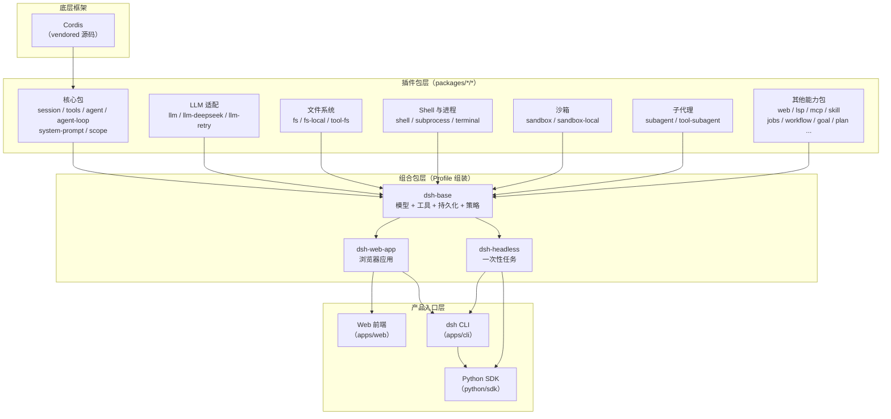
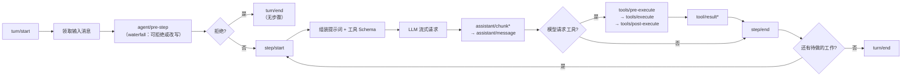

DeepSeek Harness（简称 `dsh`）是由 DeepSeek AI 开发的开源智能体框架。它采用**一切皆插件**的架构理念，底层由 [Cordis](https://github.com/cordiverse/cordis) 插件框架驱动——产品的每一个组成部分——模型适配器、工具注册表、会话日志、甚至 Agent 循环本身——都是插件，因此每一部分都可以被替换、增强或移除。本文面向初次接触本项目的开发者，帮助你在进入具体代码或教程之前，建立对整个系统的全局认知。

Sources: [README.md](README.md#L1-L7), [AGENTS.md](AGENTS.md#L1-L4)

## 核心设计哲学

### 一切皆插件

传统框架通常存在一个特权内核，扩展需要"打补丁"或覆写核心逻辑。dsh 彻底摈弃了这一模式：**不存在需要打补丁的特权内核**。扩展 dsh 的方式是把插件挂载到其他插件旁边，而各项注册都是副作用，会在其插件卸载时自动撤销。

这意味着你添加一个新的文件系统提供方、一个新的 Shell 后端、或一个新的 LLM 适配器时，不需要修改任何已有代码——你只需要编写一个新插件，让它声明对相应服务的依赖，并在激活时将自己的实现注册到共享上下文中。

Sources: [architecture.zh.md](docs/architecture.zh.md#L9-L13)

### Cordis：底层框架

Cordis 是 dsh 的基础设施。它以 vendor（源码内嵌）方式引入仓库，并以 `@deepseek-ai` scope 发布。Cordis 提供了五个核心概念：

| 概念 | 说明 | 类比 |
|---|---|---|
| **插件** | 实现 `Service` 的对象，生命周期由框架挂载到上下文 | 一个可热插拔的模块 |
| **上下文（Context）** | 服务的容器，每个服务占据稳定的 `ctx.<key>` | 依赖注入容器 |
| **inject 声明** | 插件声明所需的服务，框架确保依赖就绪后才启动 | Spring `@Autowired` |
| **类型化事件** | 通过 TypeScript 声明合并注册事件，以四种模式分发 | 观察者模式 + 中间件 |
| **可逆副作用** | 所有注册可通过 `ctx.effect()` 安装，卸载时自动撤销 | RAII 模式 |

Sources: [cordis-primer.zh.md](docs/cordis-primer.zh.md#L7-L14), [rescope.zh.md](docs/rescope.zh.md#L5-L19)

### 事件分发的四种模式

事件是 dsh 的核心扩展点。选择正确的事件域和分发模式，是大多数架构决策的第一步：

| 模式 | 是否 await | 分发顺序 | 是否有返回值 | 典型用途 |
|---|---|---|---|---|
| `emit` | 否 | 按注册顺序观察 | 否 | 通知型事件 |
| `waterfall` | 否 | 按注册顺序包装 | 是 | 拦截器、策略网关 |
| `parallel` | 是 | 所有监听器并行 | 否 | 扇出型观察 |
| `serial` | 是 | 按注册顺序 | 是 | 需要顺序结果的链 |

Sources: [cordis-primer.zh.md](docs/cordis-primer.zh.md#L19-L28)

## 系统架构总览

运行中的 `dsh` 是**一棵插件树**，由启动时按序叠加的各层组合而成。以下架构图展示了从底层 Cordis 框架到最终产品表面的分层结构：



Sources: [architecture.zh.md](docs/architecture.zh.md#L15-L37), [AGENTS.md](AGENTS.md#L9-L55)

### Profile 与 Bundle 分层组合

**Profile** 是存放在 Harness home 中的具名组装方案，列出自己叠放的组合包、已安装的树外插件，以及用户自己的 `cordis.patch.yml`。**Bundle** 是 Cordis 配置项及其挂载代码的分发格式。两者的关系类似于"配方"与"食材包"。

各层按以下顺序应用到空条目列表之上：

```
[空条目列表]
  ↓ 每个组合包的 patch（按 profile 列出的顺序）
  ↓ profile 的 cordis.patch.yml
  ↓ home 级的 cordis.patch.yml
  ↓ --patch 覆盖层
  ↓
[最终的插件树]
```

一条 patch 按 id 定位某个条目并替换其整个 config，或插入新条目。你可以通过 `dsh --profile web --dump-config` 查看实际启动的配置树——它打印出的任何条目，都可以被你自己的 patch 替换。

Sources: [architecture.zh.md](docs/architecture.zh.md#L15-L37), [apps/cli/README.md](apps/cli/README.md#L31-L43)

## 三种运行模式

dsh 提供三种入口，覆盖交互式、自动化和程序化集成的使用场景：

| 入口 | 启动命令 | 适用场景 | 对应 Bundle |
|---|---|---|---|
| **Web UI** | `dsh web` | 浏览器交互式对话、可视化工具调用 | `dsh-web-app` |
| **Headless** | `dsh --profile headless "task"` | 一次性任务执行、输出最终答案后退出 | `dsh-headless` |
| **Python SDK** | `from deepseek_harness import DeepSeekHarness` | 程序化调用、嵌入其他应用 | `dsh-headless` + JSON-RPC |

所有模式共享同一个核心：`dsh-base` 提供模型适配器、工具集、持久化、沙箱与审批策略、设置、凭据和遥测能力。

Sources: [apps/cli/README.md](apps/cli/README.md#L7-L27), [python/sdk/README.zh.md](python/sdk/README.zh.md#L1-L24)

### 快速启动

最简单的体验方式——无需克隆仓库，只需安装 Node.js：

```sh
npx @deepseek-ai/dsh web
```

该命令会自动初始化 `web` profile 并启动 Web UI，默认地址为 `http://127.0.0.1:3080`。

如果你需要从源码运行（适用于开发或贡献场景）：

```sh
git clone https://github.com/deepseek-ai/deepseek-harness.git
cd deepseek-harness
pnpm install
pnpm run build
pnpm dsh web
```

Sources: [README.md](README.md#L15-L35), [apps/cli/README.md](apps/cli/README.md#L16-L17)

## Agent 循环：轮次与步骤

理解 dsh 的工作方式，最核心的概念是 **Agent 循环**。它由两个层级组成：

- **步骤（Step）**：一次模型请求加上它调用的工具执行。这是最小的工作单元。
- **轮次（Turn）**：包含零个或多个步骤。它在领取首条输入之前打开，并在不再欠下任何工作时关闭。



这个循环的每一个阶段都暴露为事件，任何插件都可以通过监听相应事件来观察或拦截进行中的工作。

Sources: [architecture.zh.md](docs/architecture.zh.md#L65-L94), [glossary.zh.md](docs/glossary.zh.md#L36-L39)

## 能力接缝（Capability Seams）

**Seam** 是 dsh 中"可替换能力"的正式术语。一个 seam 包含三种角色：

| 角色 | 职责 | 示例 |
|---|---|---|
| **Service Definition** | 声明接口，拥有自己的 `ctx.<key>` 和词汇类型 | `ctx.fs`（文件系统接口） |
| **Service Provider** | 实现该接口 | `fs-local`（本地文件系统）、`fs-e2b`（E2B 沙箱文件系统） |
| **Consumer** | 使用该接口（通常是面向模型的工具） | `tool-fs`（文件读写工具） |

替换一个提供方就能改变整个产品的行为——这是 dsh 架构的根本灵活性所在。例如，将文件系统和进程提供方指向远程沙箱后，Bash、PTY 和 LSP 也会自动跟随迁移，无需提供方专用的 fork 机制。

Sources: [architecture.zh.md](docs/architecture.zh.md#L103-L106), [glossary.zh.md](docs/glossary.zh.md#L7-L9)

## 核心包一览

dsh 的功能由 48 个包组下的上百个独立包组成。以下是理解系统时最重要的核心包：

| 包组 | 核心包 | 职责 | `ctx` 键 |
|---|---|---|---|
| `core/` | `session` | 仅追加的 `SessionEvent` 日志和内存存储 | `ctx.sessions` |
| `core/` | `system-prompt` | 提示词片段与工具 Schema 的组装 | `ctx.systemPrompt` |
| `core/` | `tools` | 作用域化的工具注册表和带把关的执行流水线 | `ctx.tools` |
| `core/` | `agent` | `Agent` 接口、活跃 agent 注册表和 `agent/*` 事件 | `ctx.agents` |
| `core/` | `agent-loop` | 实现该接口的默认驱动器 | `ctx.agentLoop` |
| `core/` | `scope` | 按 agent 划分作用域的注册原语 | 库，无 ctx 键 |
| `llm/` | `llm` | 消息与流式词汇表，以及适配器 seam | `ctx.llm` |

Sources: [architecture.zh.md](docs/architecture.zh.md#L39-L52), [AGENTS.md](AGENTS.md#L14-L17)

### 包组全景

更广泛地，`packages/` 下的 48 个包组覆盖了智能体的全部能力域：

| 能力域 | 包组 | 典型工具/服务 |
|---|---|---|
| 对话核心 | `core` | session、tools、agent、system-prompt |
| 模型接入 | `llm` | DeepSeek 适配器、重试、token 计量 |
| 文件操作 | `fs` | 读写、搜索（ripgrep）、编辑器 |
| 命令执行 | `shell` `subprocess` `terminal` | Bash、PowerShell、PTY |
| 安全隔离 | `sandbox` | Linux Landlock、Windows ACL |
| 代码执行 | `code-runtime` | 沙箱内代码运行 |
| 子代理 | `subagent` | 进程内/进程外委托、ACP/Claude/Codex 桥接 |
| 后台任务 | `jobs` | 注册、查看、终止后台运行 |
| 工作流 | `workflow` | 脚本引擎、worker thread |
| 目标管理 | `goal` | 持久目标、Goal Round |
| Web 访问 | `web` | 搜索、抓取 |
| 语言服务器 | `lsp` | 代码导航 |
| 技能系统 | `skill` | 技能发现与加载 |
| 会话持久化 | `session` | JSONL、SQLite、投影、遥测 |
| SDK 协议 | `sdk` | JSON-RPC 协议、TS 客户端 |
| 类型系统 | `typert` | 类型图生成、Host-Client RPC 网关 |

Sources: [AGENTS.md](AGENTS.md#L12-L55), [subsystems/README.zh.md](docs/subsystems/README.zh.md#L7-L54)

## 会话日志：单一事实来源

会话日志是整个系统的**单一事实来源**。一个核心设计原则是：**模型可见即已记录**。抵达模型请求的一切都必须能从日志重建，并由一项运行时不变量断言这一点。

`deriveMessages()` 从事件流中投影出模型历史，原始 `assistant/chunk` 事件则保证回放和 UI 保真。会话 fork、恢复、文本记录、遥测和持久化都派生自这个事件流。这意味着新增一项模型可见输入，就需要新增一个会话事件——扩展 `SessionEventMap` 并从日志渲染。

Sources: [architecture.zh.md](docs/architecture.zh.md#L96-L100)

## 技术栈与工程基线

| 维度 | 选择 |
|---|---|
| **运行时** | Node.js 22.19+ / 24+（CI 覆盖 22.19、24、26） |
| **包管理** | pnpm 11.7.0（通过 Corepack 启用） |
| **语言** | TypeScript 6.x（Host 与 Client 双 aggregate 独立类型检查） |
| **构建** | tsc（类型声明）+ tsdown（运行时打包）+ Vite（Web 前端） |
| **测试** | Vitest（单元、e2e、快照、Web 压力、性能） |
| **Lint** | oxlint |
| **Git 钩子** | Lefthook（worktree 本地配置） |
| **沙箱** | Linux Landlock（native addon）/ Windows ACL |
| **Python SDK** | PyPI 分发，内置单文件 `dsh-jsonrpc-agent` 可执行程序 |
| **许可证** | MIT |

Sources: [package.json](package.json#L1-L10), [development.zh.md](docs/development.zh.md#L9-L14), [README.md](README.md#L53-L57)

## 当前状态

DeepSeek Harness 目前处于**开发者预览**（Developer Preview）阶段，正在快速迭代。**未来将出现破坏兼容性的变更**。这意味着 API、配置格式和包结构都可能调整，尚不建议用于生产环境。项目的重心是构建正确的基础设施，而非维持向后兼容——这是预发布阶段的刻意选择。

Sources: [README.md](README.md#L9-L11), [AGENTS.md](AGENTS.md#L5-L7)

## 阅读路线建议

根据你的目标，以下是建议的后续阅读路径：

**如果你想快速跑起来：**

→ [快速上手与运行](2-kuai-su-shang-shou-yu-yun-xing) — 环境搭建、首次启动、基本使用流程

**如果你想使用产品功能：**

→ [Web 界面使用指南](3-web-jie-mian-shi-yong-zhi-nan) — 浏览器交互界面详解
→ [命令行启动器（dsh CLI）](4-ming-ling-xing-qi-dong-qi-dsh-cli) — CLI 入口模式与参数
→ [Python SDK 快速入门](5-python-sdk-kuai-su-ru-men) — 程序化调用方式

**如果你想理解架构设计：**

→ [整体架构与插件树设计](10-zheng-ti-jia-gou-yu-cha-jian-shu-she-ji) — 深入 Profile/Bundle 组合机制与插件树
→ [Agent 循环：Turn 与 Step 生命周期](12-agent-xun-huan-turn-yu-step-sheng-ming-zhou-qi) — 轮次与步骤的完整时序
→ [能力接缝（Capability Seams）原理](15-neng-li-jie-feng-capability-seams-yuan-li) — 可替换能力体系的设计原理

**如果你想学习 Cordis 插件开发：**

→ [编写第一个插件](6-bian-xie-di-ge-cha-jian) — 从零开始的 Cordis 教程
→ [服务声明与依赖注入](8-fu-wu-sheng-ming-yu-yi-lai-zhu-ru) — `inject` 与 `ctx` 的工作方式
→ [类型化事件与分发模式](9-lei-xing-hua-shi-jian-yu-fen-fa-mo-shi) — 四种分发模式实战