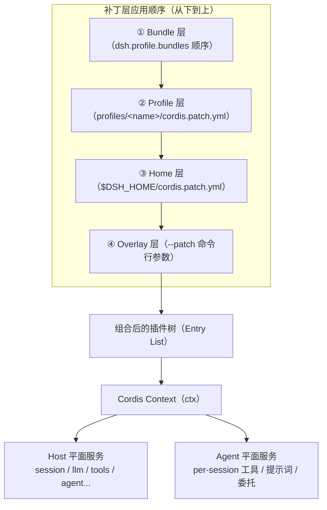
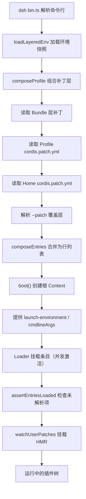

DeepSeek Harness（dsh）是一个以 Cordis 插件框架为底座的 AI Agent 运行时。本文揭示其从框架基座到产品形态的完整组装逻辑：**一切皆插件，一切皆可替换**——没有特权核心可供修补，你只需在现有插件旁边挂载自己的插件即可扩展系统。

---

## Cordis：一树万物的框架基座

Cordis 是 dsh 之下被 vendor 的插件框架，提供了五条核心设计原则，它们共同决定了整个系统为何能够做到"一切皆插件"。一条插件是实现 `Service` 接口的对象（函数式或类式），它声明一个稳定的 `ctx.<key>`（如 `ctx.tools`、`ctx.llm`）从共享上下文中获取能力，其他插件通过 key 而非导入具体实现来发现服务。插件通过 `inject` 声明依赖关系，加载顺序由服务可用性驱动而非手动编排。插件之间通过类型化事件（`emit`/`waterfall`/`parallel`/`serial`）通信，所有注册——提示词片段、工具 schema、适配器、监听器——都是通过 `ctx.effect()` 或 `ctx.on()` 安装的可逆副作用，在重载或卸载时可预测地回退。

Sources: [cordis-primer.md](docs/cordis-primer.md#L1-L45)

### 事件分发模式一览

| 模式 | 是否等待 | 分发顺序 | 是否有返回值 |
|---|---|---|---|
| `emit` | 否 | 监听器按注册顺序观察 | 否 |
| `waterfall` | 否 | 监听器按注册顺序观察，链式传递 | 是 |
| `parallel` | 是 | 所有监听器并行观察 | 否 |
| `serial` | 是 | 监听器按注册顺序执行 | 是 |

**Waterfall** 是 dsh 中最关键的中间件语义：监听器收到 `(...args, next)`，调用 `next()` 将可能被包装的结果委托给下一个服务；不调用 `next()` 即短路。`agent/pre-step`、`llm/stream`、`tools/execute` 等核心扩展点都采用 waterfall 模式。

Sources: [cordis-primer.md](docs/cordis-primer.md#L16-L34)

---

## 插件树：从空根到运行时实例

一个运行中的 dsh 实例是一棵在启动时从有序层叠组合而成的插件树。这棵树的构建遵循一套精确的分层规则，确保每一层都能被上层覆写，同时保持可预测的组合语义。



**Profile（配置文件）** 是存放在 Harness 主目录（`$DSH_HOME/profiles/<name>`）下的命名组合，它列出要堆叠的 Bundle、安装的额外插件，以及用户自己的 `cordis.patch.yml`。`web` 和 `headless` 作为模板随产品发布。

**Bundle（打包层）** 是 Cordis 配置行及其所挂载代码的分发格式。每个 Bundle 在自身 `package.json` 的 `dsh` 字段中声明：`dsh.profile` 列出 Profile 的 Bundle 列表，`dsh.bundle.patch` 指向 Bundle 的补丁文件。

Sources: [architecture.md](docs/architecture.md#L15-L38), [app-boot README.md](packages/boot/app-boot/README.md#L36-L60)

### 三层 Bundle 的职责分工

| Bundle | 定位 | 核心职责 |
|---|---|---|
| `dsh-base` | 所有 Profile 的第一层 | 模型适配器、工具集、持久化、沙箱与审批策略、设置/凭证、遥测、子代理基础设施 |
| `dsh-web-app` | 叠加在 base 之上的浏览器界面 | Web 服务器、API 网关、工作区、投影缓存、浏览器插件花名册、Agent Preset 组合 |
| `dsh-headless` | 叠加在 base 之上的一次性执行 | 编码角色设定、Code Mode 执行能力、任务提交与结果输出 |

`dsh-base` 作为最底层，插入约 60+ 个插件行，覆盖了 LLM 适配（DeepSeek 原生 + pi-ai 多供应商）、会话日志与持久化（JSONL）、沙箱与权限预设、Shell 巧行（平台条件启用 bash 或 pwsh）、文件系统工具、子代理委托、工作流引擎等全部共享能力。行内序无加载语义——激活由服务可用性驱动。

Sources: [base/cordis.patch.yml](packages/bundle/base/cordis.patch.yml#L15-L452), [base README.md](packages/bundle/base/README.md#L1-L24)

---

## 补丁覆写机制：最后一行获胜

每一层以补丁的形式叠加在一个**空的根入口列表**之上。补丁层按以下顺序应用到空列表：Profile 列出的每个 Bundle（按声明顺序）→ Profile 自身的 `cordis.patch.yml` → Home 级别的 `cordis.patch.yml` → `--patch` 覆盖层。

一个补丁通过 `id` 定位目标行，其语义有两条规则：

- **`insert`**：向列表中插入新行（带 `id`、`name`、`config`、`disabled`、`inject` 等字段）
- **id 定向覆写**：用相同 `id` 的配置**整体替换**目标行的 `config`——不存在深度合并，需要保留的字段必须在覆写行中完整重述

这一设计意味着一个需要按模式区分值的行不会放在 base 中，而是由每个模式 Bundle 各自完整声明自己的配置。

Sources: [architecture.md](docs/architecture.md#L27-L38), [base/cordis.patch.yml](packages/bundle/base/cordis.patch.yml#L1-L14)

### 覆写实例：Web 模式的行禁用

`dsh-web-app` 在 base 之上执行了一系列**禁用而非删除**的操作。禁用而非删除是深思熟虑的设计：base 是共享的，一个从表面覆写中消失的行可能在某天重新排序组合时悄然重现。例如，Web 模式禁用了 `tool-bash`、`tool-pwsh`、`tool-fs`、`tool-subagent` 等面向代理的工具行——这些工具从 Host 平面移到了 Agent Preset 平面，使每个会话可以拥有独立的工具集。

Sources: [web-app/cordis.patch.yml](packages/bundle/web-app/cordis.patch.yml#L276-L399)

---

## 双平面架构：Host 平面与 Agent 平面

在 Web 模式下，插件树存在两个逻辑平面，这是理解多会话架构的关键。

```mermaid
flowchart LR
    subgraph host["Host 平面（进程级单例）"]
        direction TB
        H1["ctx.sessions<br/>会话存储"]
        H2["ctx.llm<br/>LLM 适配器注册表"]
        H3["ctx.subagents<br/>子代理注册表（跨会话）"]
        H4["ctx.tokenMeter<br/>Token 计量"]
        H5["ctx.goals<br/>目标服务"]
        H6["shell-env<br/>Shell 环境变量"]
    end
    subgraph agent["Agent 平面（每会话隔离）"]
        direction TB
        A1["tool-bash / tool-pwsh"]
        A2["tool-fs / tool-fs-search"]
        A3["tool-subagent"]
        A4["tool-goal / plan-mode"]
        A5["compaction-basic"]
        A6["skill-filesystem"]
    end
    host -.->|"Agent Preset 挂载"| agent
```



**Host 平面**承载进程级单例服务：会话存储、LLM 适配器、子代理注册表（跨会话查询）、Token 计量器。这些服务要么被主机注入（如 `shell-env` 注入 `webStartup` 服务），要么被主机远程端读取（如 `goals` 通过 Gateway 对浏览器暴露 Remote 端点），因此不能隔离到单个会话。

**Agent 平面**承载面向模型的工具和提示词片段。每个会话通过 Agent Preset 挂载自己的工具集，多个会话可以并行运行不同的工具组合。一个关键判断准则是：如果一个 Service 被 Host 平面的行通过 `ctx.get` 读取，那么它就属于 Host 平面；如果一个行只在某个 Agent 的作用域内被消费，它就可以放在 Agent 平面。

Sources: [web-app/cordis.patch.yml](packages/bundle/web-app/cordis.patch.yml#L276-L399), [agent-presets README.md](packages/preset/agent-presets/README.md#L1-L51)

---

## 核心包与 ctx 键映射

插件树的核心服务由 `packages/core/` 下的六个包贡献，它们构成一轮对话的完整主干：

| 包 | 职责 | `ctx` 键 |
|---|---|---|
| `core/session` | 追加式 `SessionEvent` 日志与内存存储 | `ctx.sessions` |
| `core/system-prompt` | 提示词片段与工具 schema 组装 | `ctx.systemPrompt` |
| `core/tools` | 分作用域工具注册表与受管执行管线 | `ctx.tools` |
| `core/agent` | `Agent` 接口、活跃注册表与 `agent/*` 事件 | `ctx.agents` |
| `core/agent-loop` | 实现该接口的默认驱动器 | `ctx.agentLoop` |
| `core/scope` | 每代理作用域注册原语 | 库，无 ctx 键 |

`scope` 是唯一的非服务包——一个零依赖库，提供 `createScope`/`scopeOf`/`scopeTarget` 原语。它位于依赖图的最底层，恰好让 `session` 和 `system-prompt` 能够消费它而不产生循环依赖。`agent-loop` 是 `Agent` 公共契约的唯一具体实现。

Sources: [architecture.md](docs/architecture.md#L39-L52), [subsystems/core.md](docs/subsystems/core.md#L1-L20)

### 可替换能力体系概览

除了核心主干，dsh 的能力通过**能力接缝（Capability Seams）**组织。一个接缝由三部分组成：**服务定义**（声明接口）、**服务提供者**（实现接口）、**消费者**（使用接口，通常是面向模型的工具）。一个包可以合并多个角色。

| 能力域 | 接缝服务 | 实现包示例 |
|---|---|---|
| 文件系统 | `ctx.fs` | `fs-local`、`fs-sandbox`、`fs-e2b` |
| 子进程 | `ctx.subprocess` | `subprocess-local`、`subprocess-e2b` |
| Shell 执行 | `ctx.shell` | `bash-local`、`pwsh-local` |
| 沙箱 | `ctx.sandbox` | `sandbox-local` |
| LLM 适配 | `ctx.llm` | `llm-deepseek`、`llm-pi-ai` |
| 持久化 | `ctx.sessionPersistence` | `session-persistence-jsonl`、`session-persistence-sqlite` |
| 凭证 | `ctx.credentials` | `credentials-local` |
| 会话查询 | `ctx.sessionQuery` | `session-query-sqlite` |

切换一个提供者即可改变整个产品行为：文件系统和子进程提供者共享一个执行世界，因此将它们指向远程沙箱会同时迁移 Bash、PTY 和 LSP，无需任何提供者分叉。

Sources: [architecture.md](docs/architecture.md#L98-L103), [capability-seams.md](docs/capability-seams.md#L1-L80)

---

## 启动流程：从命令行到插件树

当用户执行 `dsh --profile web` 时，整个插件树的构建经历以下阶段：



启动过程的核心在于 `composeProfile` 函数：它将 Bundle 补丁层、Profile 用户层、Home 用户层和命令行覆盖层按序拼接，通过 `composeEntries` 合并为最终的行索引。补丁层的引用通过 `structuredClone` 深拷贝——因为 Include 将 `insert` 行**按引用**推入已挂载的树，后续 id 定向补丁会就地修改这些对象。重用同一个已解析补丁对象会使用户覆写固化到 Bundle 的内存行中，导致删除覆写后无法恢复默认值。

Sources: [profile-boot.ts](apps/cli/src/profile-boot.ts#L142-L171), [profile-boot.ts](apps/cli/src/profile-boot.ts#L240-L259)

### 依赖驱动的加载

插件的激活由服务可用性驱动。一个声明了 `inject: ['tools']` 的插件会等待 `ctx.tools` 服务存在后才加载，无需手动编排启动顺序。如果一个插件的 `inject` 引用了无人提供的服务，它会无限期停留在 `PENDING` 状态——不报错，因为提供者可能稍后挂载。使用 `--dump-config` 可以查看实际组合的插件树：

```sh
dsh --profile web --dump-config
```

输出的任何行都可以被用户自己的补丁替换。

Sources: [architecture.md](docs/architecture.md#L29-L35), [06-composition-and-hmr.md](docs/cordis-tutorial/06-composition-and-hmr.md#L61-L109)

---

## 新行为归属指南

插件树的扩展点设计遵循一个明确原则：**新行为挂载到已文档化的扩展点上**。下表列出常见目标与对应机制：

| 目标 | 机制 |
|---|---|
| 添加模型提供商 | 在 `ctx.llm` 上注册适配器 |
| 添加面向模型的能力 | 在 `ctx.tools` 上注册；其 schema 加入提示词组装 |
| 添加 Shell 执行 | 注册 `ctx.shell` 后端；本地后端通过 `ctx.subprocess` 生成 |
| 添加持久终端执行 | 注册 `ctx.terminals` 后端 + `dsh-tool-terminal` |
| 添加人类命令 | 在 `ctx.commands` 上注册；无需模型轮次即分发 |
| 拦截请求/工具/轮次 | 使用 `agent/*` 或 `tools/*` 事件；`agent/turn-stopping` 停止轮次 |
| 注入模型可见上下文 | 调用 `agent.inject()`；它进入下一个准入请求 |
| 添加持久会话状态 | 扩展 `SessionEventMap`；从日志渲染和重放 |
| 将注册限定于一个代理 | 使用该代理的 `agent.ctx` |

Sources: [architecture.md](docs/architecture.md#L106-L129)

---

## 延伸阅读

理解整体架构后，以下页面提供更深入的主题展开：

- **[Profile 与 Bundle 分层组合机制](11-profile-yu-bundle-fen-ceng-zu-he-ji-zhi)**——详细拆解 Profile 解析、Bundle 补丁合入与 HMR 热重载的精确机制
- **[Agent 循环：Turn 与 Step 生命周期](12-agent-xun-huan-turn-yu-step-sheng-ming-zhou-qi)**——从 `turn/start` 到 `turn/end` 的完整事件序列与中间件链路
- **[会话日志：事件溯源与持久化](13-hui-hua-ri-zhi-shi-jian-su-yuan-yu-chi-jiu-hua)**——追加式日志如何成为模型可见上下文的唯一来源
- **[工具执行管线](14-gong-ju-zhi-xing-guan-xian)**——`tools/pre-execute` → `tools/execute` → `tools/post-execute` 的 waterfall 管线
- **[能力接缝（Capability Seams）原理](15-neng-li-jie-feng-capability-seams-yuan-li)**——三角色设计与接缝的替换语义