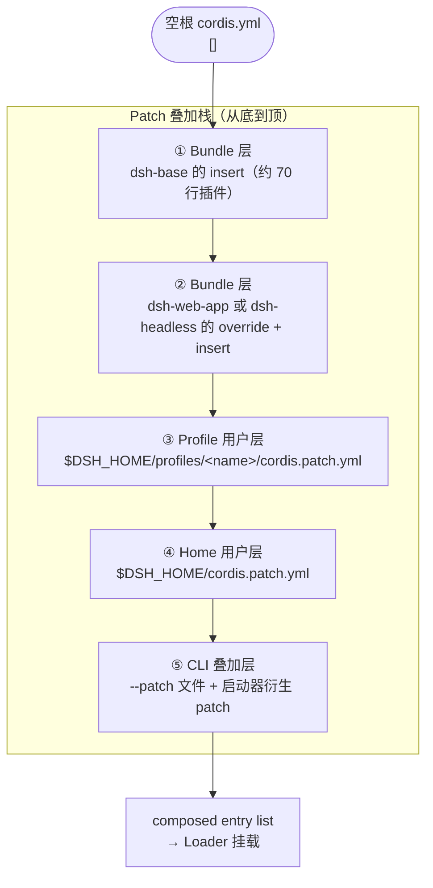
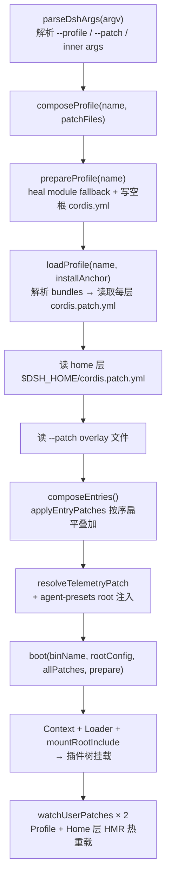

DeepSeek Harness 采用 **Profile（配置文件） × Bundle（插件束）** 两层抽象来管理插件树的组装。Profile 是面向用户的运行实例目录，Bundle 是平台提供的预制插件束。二者通过 **YAML patch 叠加** 算法在启动时合成为一棵完整的 Cordis Loader 插件树。理解这套机制，是掌握"哪些插件被加载、以什么配置挂载、谁覆盖谁"的钥匙。

---

## 核心概念：Profile 与 Bundle 各自的职责

**Profile** 是 `$DSH_HOME/profiles/<name>` 下的一个目录，它本身不是配置文件，而是一个完整的项目容器。目录内的 `package.json` 通过 `dsh.profile.bundles` 字段声明它要叠加哪些 Bundle 层；`cordis.patch.yml` 则是用户自己的 override 层，应用在所有 Bundle 之后。Profile 目录还承担着 `node_modules` 管理——它是一个标准的 pnpm workspace，可以安装树外插件（out-of-tree plugins）。

**Bundle** 是一个 npm 包，其 `package.json` 通过 `dsh.bundle.patch` 字段声明自己导出的 patch 文件路径。Bundle 包的实质内容就是那个 `cordis.patch.yml`——一份 YAML 数组，描述要插入哪些插件行、各自用什么配置。启动器读取 Bundle 声明的 patch 路径，按 Profile 里 `bundles` 数组的顺序逐层叠加。

Sources: [profile.ts](packages/boot/app-boot/src/profile.ts#L1-L23), [dsh-base package.json](packages/bundle/base/package.json#L36-L39)

---

## 分层叠加模型

整个组合过程遵循严格的 **后写优先（last write wins）** 原则。启动时，patch 层按固定顺序从底到顶叠加：



底部的 `cordis.yml` 是一个空数组 `[]`，不携带任何插件行。整棵树完全由 patch 层组装而成。每次启动时，启动器都会覆写这个空根文件，防止 Loader 的写回机制将已组合的行固化进去导致下次重复插入。

Sources: [profile-boot.ts](apps/cli/src/profile-boot.ts#L60-L64), [profile-boot.ts](apps/cli/src/profile-boot.ts#L97-L103)

### Patch 操作语义

每一层 patch 是一个 YAML 数组，数组中的每个元素称为一个 **patch entry**，支持三种操作：

| 操作 | YAML 语法 | 语义 |
| --- | --- | --- |
| **override**（配置覆盖） | `- id: <row-id>`<br/>`  config: { ... }` | 替换目标行的整个 `config` 对象——不是合并，而是整体替换 |
| **disable**（禁用行） | `- id: <row-id>`<br/>`  disabled: true` | 将目标行标记为禁用，Loader 跳过其挂载 |
| **insert**（插入新行） | `- insert:`<br/>`  - id: <id>`<br/>`    name: <pkg>`<br/>`    config: { ... }` | 向 entry list 追加全新的插件行 |

**关键设计约束**：override 是整体替换而非深度合并。这意味着如果一个行的配置因运行模式不同而不同，它不能在 `dsh-base` 里写一个"部分值"然后在模式 Bundle 里补全——每个行必须在一个层里完整声明自己的全部配置。这就是为什么 `dsh-base` 的注释明确指出："模式特定的行只在此声明共享身份和中性默认值；每个模式 Bundle 重述其完整配置。"

Sources: [dsh-base cordis.patch.yml](packages/bundle/base/cordis.patch.yml#L1-L14), [dsh-web-app cordis.patch.yml](packages/bundle/web-app/cordis.patch.yml#L1-L13)

---

## 三大内置 Bundle 的分工

系统内置三个 Bundle 包，各自覆盖不同的运行表面：

| Bundle | 包名 | 角色 | 是否含 insert |
| --- | --- | --- | --- |
| **dsh-base** | `@deepseek-ai/dsh-base` | 共享核心层，每个 Profile 的第一层，插入约 70 个基础插件行 | ✅ 纯 insert |
| **dsh-web-app** | `@deepseek-ai/dsh-web-app` | 浏览器表面，override base 行 + 插入 Host/HTTP/浏览器插件 | override + insert |
| **dsh-headless** | `@deepseek-ai/dsh-headless` | 一次性任务模式，override base 行 + 插入直接驱动器 | override + insert |

### dsh-base：共享核心

`dsh-base` 是所有 Profile 的地基。它的 `cordis.patch.yml` 是一个大的 `insert` 列表，一次性插入 LLM、Session、Agent、沙箱、工具链、子代理等约 70 个插件行。这些插件是任何运行模式都需要的，不依赖特定的传输层或 UI 表面。

Base 层的策略是：对那些因模式而异的配置行，只声明 **共享身份和中性默认值**。例如 `system-prompt` 行在 base 里没有 `persona` 配置——因为 headless 和 web-app 各自需要不同的 persona 文本。每个模式 Bundle 各自重述该行的完整 `config`。

Sources: [dsh-base cordis.patch.yml](packages/bundle/base/cordis.patch.yml#L15-L452), [dsh-base src/index.ts](packages/bundle/base/src/index.ts#L1-L10)

### dsh-headless：一次性任务模式

`dsh-headless` 的 patch 文件只有 36 行，极为精简。它 override 了 `system-prompt` 的 persona、禁用了共享 HMR 行，然后 insert 了三个插件：`code-runtime`（Code Mode 执行引擎）、`headless-startup`（命令行参数解析 provider）和 `headless-runner`（一次性驱动器）。后者注入 `headlessStartup` 服务，创建一个 Agent，驱动单次任务完成，打印结果后退出进程。

Sources: [dsh-headless cordis.patch.yml](packages/bundle/headless/cordis.patch.yml#L1-L36), [dsh-headless src/index.ts](packages/bundle/headless/src/index.ts#L1-L151)

### dsh-web-app：浏览器表面

`dsh-web-app` 是最重的模式 Bundle，override 了 `system-prompt`、`hmr`、`session-query-sqlite`、`tools` 等 base 行，并 insert 了 40 余个插件，涵盖 Host 层（Web 服务器、API 网关、前端静态服务、目录选择器）、传输层（连接模块、客户端运行时、Cordis Client Runner）以及整个浏览器 UI 组件层（布局、侧边栏、对话、设置、工作区等）。

Sources: [dsh-web-app cordis.patch.yml](packages/bundle/web-app/cordis.patch.yml#L1-L425)

---

## Profile 模板与初始化

启动器为内置 Profile 名称提供了 **模板**——预定义的 Bundle 列表，在 Profile 目录不存在时自动初始化：

| Profile 名称 | 模板 Bundle 列表 |
| --- | --- |
| `web` | `dsh-base` → `dsh-web-app` |
| `headless` | `dsh-base` → `dsh-headless` |
| 自定义名称 | `dsh-base`（仅基础层） |

初始化时，`initProfile` 创建三样东西：`package.json`（含 `dsh.profile.bundles` 声明）、`cordis.patch.yml`（空数组模板，带注释指引）、`pnpm-workspace.yaml`（配置 hoisted linker + `autoInstallPeers: false`，让树外插件能复用安装的单一 Cordis 实例）。已存在的文件不会被覆盖——重新运行是幂等的。

Sources: [profile.ts](packages/boot/app-boot/src/profile.ts#L114-L168)

### shipped Profile 的归一化

安装层面的 Bundle 列表可能因版本演进而变化。`INSTALLATION_OWNED_PROFILE_TUPLES` 记录了安装拥有的完整三元组（如 headless 曾为 base + web-app + headless）。启动时，`normalizeShippedProfile` 检测到恰好匹配安装拥有列表的 Profile，会静默归一化为当前发布的模板（base + headless），同时保留所有其他用户字段。

Sources: [profile.ts](packages/boot/app-boot/src/profile.ts#L119-L122), [profile.ts](packages/boot/app-boot/src/profile.ts#L293-L312)

---

## 双锚点模块解析

Bundle 名称的解析遵循 **双锚点优先级**：先从 dsh 安装目录解析，再从 Profile 目录解析。这个顺序是核心契约——`dsh-base`（以及每个内置 Bundle）始终来自与正在运行的 dsh 相同的安装位置，绝不使用 Profile 本地的副本。

`resolveBundleDir` 依次探测两个锚点：安装锚点（app 的 `package.json` 路径）和 Profile 目录的 `package.json`。对每个锚点，它遍历 `createRequire(anchor).resolve.paths(packageName)` 返回的搜索路径，找到第一个持有目标 `package.json` 的目录。

Sources: [profile.ts](packages/boot/app-boot/src/profile.ts#L314-L355)

### 模块回退修复

`healProfilesModuleFallback` 在每次启动时维护 `$DSH_HOME/profiles/node_modules`——一个扁平的符号链接目录，包含 app 的 **完整依赖闭包** 中每个包的符号链接。这不是直接依赖列表，而是对 `dependencies` 和 `peerDependencies` 做 BFS 遍历得到的闭包，因为树外插件的 peer 依赖（如 `dsh-compaction`、`dsh-invariants`）通过 Service Provider 包间接可达，但树外插件直接 import 它们。

这个机制确保从任何 Profile 通过 Node 的 parent-walk 都能解析到所有内置插件——无需 pnpm 管理，正是"Bundles 来自安装"契约的运行时体现。

Sources: [profile.ts](packages/boot/app-boot/src/profile.ts#L204-L255)

---

## 组合流程：从命令行到插件树

以下是 `dsh --profile web --patch ./extra.yml` 一次完整启动的流程：



`composeProfile` 是核心组装函数。它将四段 patch 拼成一个有序数组：Bundle 层（`profile.layers.flatMap(layer => layer.patches)`）→ Profile 用户层 → Home 用户层 → CLI overlay 层。然后调用 `composeEntries` 将这些层通过 `applyEntryPatches` 在空根上一次性叠加，得到最终的 entry list 和行索引（`id → row` 的 Map），供启动器做后续的行检查（如 telemetry 行是否存在、agent-presets 行是否需要注入 system root）。

Sources: [profile-boot.ts](apps/cli/src/profile-boot.ts#L142-L171), [profile-boot.ts](apps/cli/src/profile-boot.ts#L207-L259), [profile.ts](packages/boot/app-boot/src/profile.ts#L405-L420)

### 热重载：用户层的实时刷新

Profile 层和 Home 层的 `cordis.patch.yml` 都通过 Cordis HMR 注册为 **config-only watcher**。文件变更时，`watchUserPatches` 回调重新读取两个文件、重组完整的 patch 栈（Bundle 层在下、overlay 层在上），然后通过 `entry.update()` 事务性地更新根 Include。

关键细节：每次重组都对 patch 对象做 `structuredClone`——因为 Include 在将 `insert` 行推入挂载树时使用 **按引用** 而非按值。如果跨代复用同一个解析的 patch 对象，用户 override 会就地修改 Bundle 的 insert 行，导致移除 override 后行无法回退到 Bundle 默认值。

Sources: [index.ts](packages/boot/app-boot/src/index.ts#L226-L265), [profile-boot.ts](apps/cli/src/profile-boot.ts#L228-L298)

---

## Agent Preset：第三维组合

Profile × Bundle 组装的是 **进程级全局树**——每个进程一棵。Agent Preset 则在此基础上增加了 **per-session 的第三维**。每个 Agent 在创建时可选地 mount 一个 preset `cordis.yml` 到自己的 scope context 下，使得该 Agent 看到的工具集、prompt section、技能目录是独立的。

Preset 的 mount 发生在 Agent 工厂的 `setup(agentCtx)` 回调中——这是唯一支持的调用点，因为只有在这里 join 是在 Agent 发布前安装的，被拒绝的组合会回滚整个创建。mount 使用 `PresetTree`（Include 的子类）在 Agent scope 下组装子树，裸模块名从 harness 安装位置解析，而非从 preset 目录。

Sources: [agent-presets src/index.ts](packages/preset/agent-presets/src/index.ts#L1-L68), [agent-presets src/mount.ts](packages/preset/agent-presets/src/mount.ts#L57-L112)

### 三层组合的关系

| 维度 | 作用域 | 粒度 | 典型内容 |
| --- | --- | --- | --- |
| **Bundle patch** | 进程级 | Profile 启动时一次性 | 核心/模式插件的全局挂载 |
| **Profile/Home patch** | 进程级 | Profile 启动时 + HMR 热重载 | 部署 override、用户偏好 |
| **Agent Preset** | 每会话 | Agent 创建时 | 工具子集、persona、技能 |

Profile 和 Bundle 决定了"进程里有什么"；Agent Preset 决定了"某个 Agent 会话能看到什么"。两者通过 `ctx.systemPrompt`、`ctx.tools` 等 Cordis 服务视图自然衔接——全局层的注册对 scope 层可见，scope 层的注册随 Agent 生命周期回收。

---

## 用户如何自定义：实用场景

### 场景一：禁用某个内置插件

在 Profile 的 `cordis.patch.yml` 中通过 id 禁用：

```yaml
- id: web-search-deepseek
  disabled: true
```

### 场景二：修改某个插件的配置

整体替换 `config`——必须重述所有需要的键：

```yaml
- id: spill-policy
  config:
    maxInlineBytes: 30000
```

### 场景三：插入自定义插件

```yaml
- insert:
    - id: my-custom-tool
      name: '@my-org/dsh-custom-tool'
      config:
        apiKey: !!js process.env.MY_API_KEY
```

`!!js` 表达式在 Loader 的配置插值阶段解析，可以引用 `process.env`、`ctx`（注入的服务上下文）、`dshHomePath`（Harness home 路径解析器）等。

### 场景四：创建全新 Profile

```bash
dsh plugin --profile my-experimental add @some-org/custom-bundle
dsh --profile my-experimental "your task"
```

首次使用 `dsh plugin --profile <name>` 时，Profile 目录自动初始化，Bundle 列表为 `['@deepseek-ai/dsh-base']`。安装的 npm 包会出现在 Profile 的 `package.json` 的 `dependencies` 中，pnpm 在 Profile 目录内管理它们。

Sources: [profile.ts](packages/boot/app-boot/src/profile.ts#L124-L168), [args.ts](apps/cli/src/args.ts#L171-L181)

---

## 小结

Profile 与 Bundle 的分层组合机制用三个简单原语（insert / override / disable）和一条确定性叠加管线（Bundle → Profile → Home → CLI overlay），实现了从约 70 个共享核心插件到 Web 浏览器全栈或 Headless 一次性任务的灵活配置。其设计哲学是：**每一行插件属于恰好一个 Bundle 层加用户层**，override 是整体替换而非合并，保持每个决策点单一且可追溯。

理解了这套机制，你可以继续深入以下方向：

- [整体架构与插件树设计](10-zheng-ti-jia-gou-yu-cha-jian-shu-she-ji)——从更高层面理解 Cordis 插件树的全貌
- [Agent 循环：Turn 与 Step 生命周期](12-agent-xun-huan-turn-yu-step-sheng-ming-zhou-qi)——组合后的插件树如何驱动 Agent 运行
- [Cordis 核心概念速览](20-cordis-he-xin-gai-nian-su-lan)——了解 Loader、Context、Fiber 等底层概念
- [扩展开发实战手册](21-kuo-zhan-kai-fa-shi-zhan-shou-ce)——动手编写自己的 Bundle 或插件