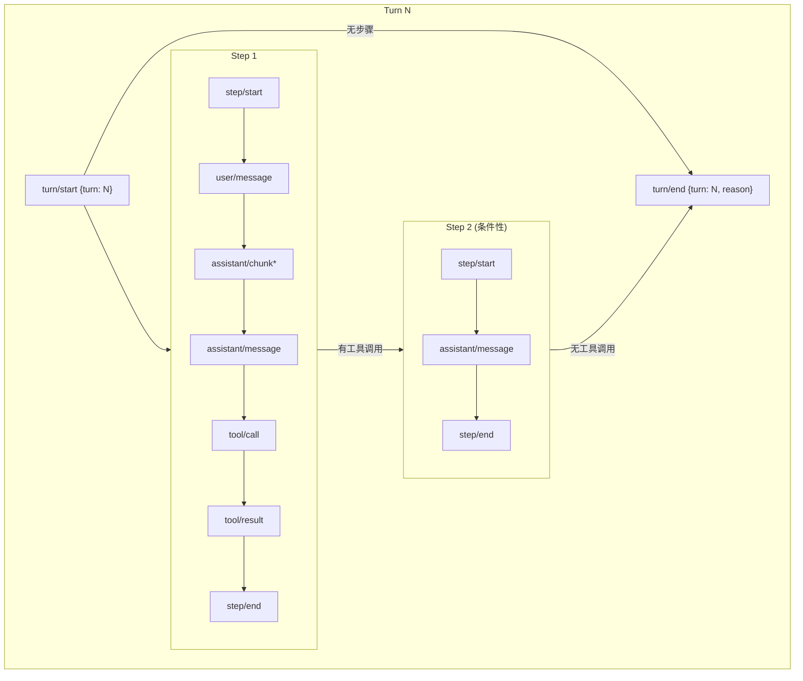
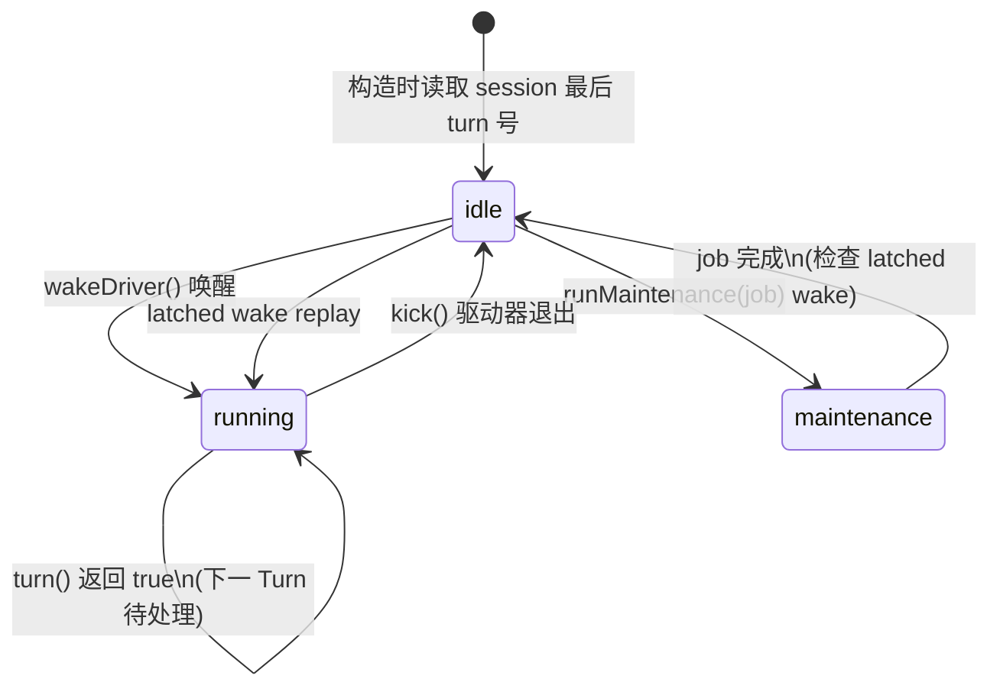
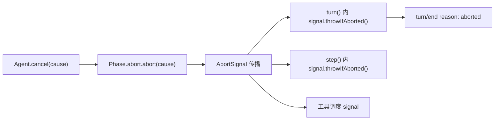
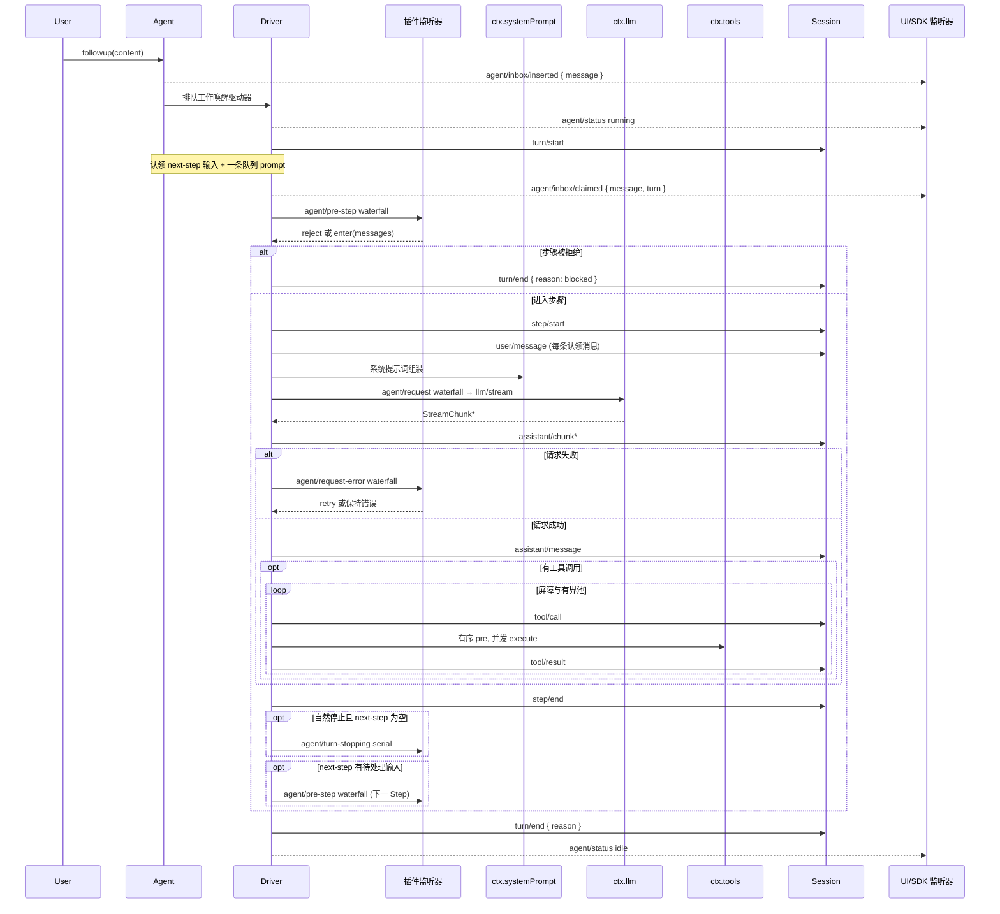

DeepSeek Harness 的核心驱动引擎是 `ReactLoopAgent`——一个由会话日志作为唯一真相源（source of truth）、按 Turn → Step 两级嵌套边界推进的 ReAct 式循环。本文深入剖析该循环的内部状态机、事件词汇表、扩展点协议、以及取消与恢复的工程保证，帮助高级开发者在插件层精确地观测、拦截和替换循环行为。

---

## 核心概念：Turn 与 Step 的层次模型

Agent 循环采用**两级嵌套**结构：**Turn（轮次）** 是面向用户输入的边界，**Step（步骤）** 是面向模型调用的边界。一个 Turn 可包含零个或多个 Step；每个 Step 恰好对应一次 LLM 请求及其触发的全部工具执行。

这一层次直接映射到会话日志的持久事件序列中。`turn/start` 和 `turn/end` 包裹一个完整的轮次，`step/start` 和 `step/end` 包裹其中每一次模型交互。所有边界事件都是**只追加（append-only）** 的持久事实，即使进程崩溃重启，持久化后端也可以从日志重建精确到 token 级别的回放。



持久事件类型完整列表见会话类型定义，其中 surface-eligible 事件（`user/message`、`assistant/message`、`tool/result`）会投影到模型可见的消息序列上，其余为纯日志/回放数据。

Sources: [types.ts](packages/core/session/src/types.ts#L236-L333), [known-event-types.ts](packages/core/session/src/known-event-types.ts#L19-L64)

---

## 状态机：Phase 与生命周期阶段

`ReactLoopAgent` 内部维护一个 **Phase 状态机**，驱动器（driver）在三个互斥相位间切换：

| Phase | 含义 | 可取消 | 唯一活跃工作 |
|---|---|---|---|
| `idle` | 无驱动器运行，等待唤醒 | 否（no-op） | — |
| `maintenance` | 非轮次维护任务正在执行（如 compaction） | 是（`AbortController`） | 维护任务 Promise |
| `running` | 驱动器正在排空 Turn/Step 队列 | 是（`AbortController`） | 驱动器 Promise |

状态转换通过 `setPhase` 方法集中管理：每次相位提交时，如果外部可见状态（`AgentStatus`：`'idle'` 或 `'running'`）发生翻转，就会分发 `agent/status` 事件。`maintenance` 和 `idle` 对外都暴露为 `'idle'`，因为维护任务不产生 Turn 边界。



关键设计约束：**同一时刻只允许一个活跃工作**。`runMaintenance` 在进入时检查相位是否为 `idle`，如果驱动器仍在运行则同步抛出错误。类似地，`wakeDriver` 在相位非 `idle` 时不会立即启动新驱动器，而是将唤醒请求**锁存（latch）** 为 `wakeRequested = true`，在当前活跃工作收敛到 `idle` 时再重放。

Sources: [agent.ts](packages/core/agent-loop/src/agent.ts#L38-L111), [runtime-types.ts](packages/core/agent/src/runtime-types.ts#L43-L50)

---

## Inbox 双队列：输入路由与消息认领

Agent 拥有一个 **Inbox**——由两条独立待处理消息列表构成的增量投影：

| 队列 | 标识 | 投递方法 | 认领时机 |
|---|---|---|---|
| **next-turn** | `nextTurn` | `followup()` | Turn 开启时，取出恰好一条 |
| **next-step** | `nextStep` | `steer()` / `inject()` | 每个 Step 的 pre-step 边界，取全部 |

三条公共输入 API 的语义差异：

- **`followup(message)`**：将消息放入 `next-turn` 队列并唤醒驱动器。每条 followup 独占一个 Turn。
- **`steer(message)`**：将消息放入 `next-step` 队列并唤醒驱动器。运行中的驱动器在下一个 Step 边界消费它；空闲驱动器先开启一个 Turn。
- **`inject(message)`**：将消息放入 `next-step` 队列但**不唤醒**驱动器。运行中的驱动器在最近 Step 边界消费它；空闲驱动器将其留在队列中直到被唤醒。

认领操作 `claim(target, turn)` 在 Step 边界执行：先取出全部 `next-step` 消息，如果 `target === 'next-turn'` 则再取出一条 `next-turn` 消息。每条被认领的消息通过 `agent/inbox/claimed` 事件发出实时通知，并从 Inbox 中永久删除。

Sources: [inbox.ts](packages/core/agent/src/inbox.ts#L24-L78), [runtime-types.ts](packages/core/agent/src/runtime-types.ts#L64-L144)

---

## 驱动器主循环：kick → turn → step

驱动器的核心执行路径嵌套三层方法调用：`kick()` → `turn()` → `step()`。

### kick()：驱动器边界

`kick()` 是驱动器的顶层入口，通过 `while (await this.turn()) {}` 持续排空 Turn 队列。当 `turn()` 返回 `false`（无待处理输入）时退出。任何异常和取消信号在驱动器边界被**包含（contained）**——不会向上传播到 `wakeDriver` 的调用者。退出时如果仍有锁存的唤醒且 Inbox 有待处理内容，会启动新驱动器。

### turn()：轮次边界

`turn()` 方法负责开启一个 Turn 的完整生命周期：

1. **turn/start**：递增 turn 计数器，追加 `turn/start` 事件。
2. **Step 循环**：进入 `while (true)` 循环，每次迭代：
   - 调用 `preStep()` 认领消息、组装系统提示词、分发 `agent/pre-step` waterfall。
   - 如果被 reject，Turn 以 `blocked` 结束。
   - 如果 enter 决策消息为空且为首步，Turn 以 `completed` 结束（空输入不消耗模型调用）。
   - 追加 `step/start`，将认领消息作为 `user/message` 写入日志。
   - 调用 `step()` 执行模型请求和工具调用。
   - 如果 Step 产出 `turnEnds`（completed 或 max-tokens）且 `next-step` 队列为空，分发 `agent/turn-stopping` serial 检查点；若有 Steering 进入则继续。
3. **turn/end**：在 `finally` 块中追加 `turn/end` 事件，携带 `TurnEndReason`。

**max-tokens 的粘滞性**：一旦某个 Step 触达了输出 token 上限，`turnEnds` 被设为 `max-tokens`，后续即使有 `completed` 的 Step 也不会降级轮次结果——这确保 `max-tokens` 的语义信号在轮次层面不被遮蔽。

Sources: [agent.ts](packages/core/agent-loop/src/agent.ts#L210-L330)

### step()：模型请求 + 工具执行

`step()` 是最内层的执行单元，包含一次完整的 LLM 交互循环：

1. **请求构建**：调用 `buildRequest()` 组装冻结的 `GenerateOptions`，包含系统提示词、消息历史、工具 schema。
2. **流式接收**：通过 `ctx.llm.stream()` 逐块接收，每个 `StreamChunk` 追加为 `assistant/chunk` 事件。
3. **消息组装**：流结束后，`BlockAssembler` 聚合为 `AssistantMessage`，追加 `assistant/message` 事件。
4. **工具执行**：如果模型请求了工具调用，调用 `executeToolCalls()` 调度。
5. **结束判定**：无工具调用返回 `completed`；触达上限返回 `max-tokens`；工具调用完成且 `concludesTurn` 为真返回 `completed`，否则返回 `null`（Turn 继续）。

如果流式结果为 `error` 或 `aborted`，`step()` 会分发 `agent/request-error` waterfall，给监听器一个拥有恢复的机会——返回 `{ kind: 'retry' }` 则重新执行请求循环，否则抛出 `LlmError`。

Sources: [agent.ts](packages/core/agent-loop/src/agent.ts#L332-L401)

---

## 扩展点协议：Waterfall 与 Serial 分发

Agent 循环暴露四个核心扩展点，供插件在循环的不同阶段插入逻辑。所有扩展点通过**作用域化分发（scoped dispatch）**执行——监听器只在匹配的 Agent 作用域内被调用。

| 扩展点 | 分发模式 | 触发时机 | 决策能力 |
|---|---|---|---|
| `agent/pre-step` | **waterfall** | 每个 Step 认领消息后、进入模型调用前 | reject 或替换消息 |
| `agent/request` | **waterfall** | 每次模型请求构建时 | 替换调用配置 |
| `agent/request-error` | **waterfall** | 模型请求失败后 | 返回 retry 或保持原错误 |
| `agent/turn-stopping` | **serial** | Turn 即将关闭前 | 可通过 Steering 延续 Turn |

### agent/pre-step：步骤准入控制

这是**最强大的拦截点**。它接收当前 Turn/Step 编号、已认领的消息列表和取消信号。监听器可以：

- **reject**：拒绝整个步骤，Turn 以 `blocked` 结束。已认领的消息从 Inbox 永久移除，但不会作为 `user/message` 写入日志。
- **enter**（默认）：进入步骤。可以替换消息列表——例如压缩插件在此截取消息进行裁剪。

```typescript
// 示例：拦截步骤准入
ctx.on('agent/pre-step', (agent, payload, next) => {
  // payload.messages 是从 inbox 认领的消息
  // 可以追加上下文、替换内容、或直接 reject
  if (shouldBlock(payload.messages)) {
    return Promise.resolve({ kind: 'reject' })
  }
  return next() // 保持默认行为：enter + 原始消息
})
```

### agent/request：调用配置替换

每个 Step 开始构建请求时触发。监听器可以替换 provider、model、temperature 等配置。首次请求使用 `AgentOptions` 的种子配置；后续请求从持久化的 `request/header` 折叠。替换不会影响消息内容——消息变更必须通过日志化通道（如 `user/message` 事件）完成。

### agent/turn-stopping：数据驱动的关闭守卫

这是唯一使用 **serial**（顺序 await）分发的扩展点。在模型不再欠回应（无活跃工具调用、无新 Steering）时，驱动器顺序等待所有监听器完成。如果某个监听器在此期间调用了 `agent.steer()`，驱动器会重新读取 `next-step` 队列：有新内容则继续 Step 循环，无则关闭 Turn。

关键设计：**监听器顺序不能改变结果**。Turn 的关闭与否完全由数据决定——Inbox 是否有待处理 Steering。这避免了监听器排列顺序引起的非确定性。

Sources: [runtime-types.ts](packages/core/agent/src/runtime-types.ts#L219-L291), [agent.ts](packages/core/agent-loop/src/agent.ts#L225-L243)

---

## 工具调用调度：屏障与并行池

`executeToolCalls()` 在一个 Step 内调度模型请求的全部工具调用。调度策略基于每个工具声明的 `executionMode`：

| 模式 | 行为 | 调度方式 |
|---|---|---|
| **barrier**（排他） | 独占执行，后续调用等待其完成 | 逐个串行 |
| **parallel**（并行安全） | 可与其他并行调用同时执行 | 有界滚动池 |

有界滚动池的容量由 `maxParallelToolCalls` 配置控制（默认 10）。该值可通过 `AgentLoopSettings` 在运行时变更，对下一个工具组即时生效，不干扰当前正在执行的组。

调度的关键保证：

- **模型顺序提交**：即使 dispatch（分发）可以重叠，`tool/call` 和 `tool/result` 事件严格按模型给出的顺序提交到会话日志。
- **实时重分类**：每次启动新调用前重新读取其 `executionMode`，因此工具注册表的变更可以在组内创造屏障。
- **取消恢复**：Abort 到来时停止启动新调用，排空已启动调度的结果，并为未启动的调用追加合成的 `tool/result` 错误事件，确保回放一致性。
- **`concludesTurn`**：工具结果可以携带 `concludesTurn: true` 信号，在当前 Step 结束 Turn。但同一 Step 内的 `additionalContexts` 和竞态 Steering 仍会执行完毕。

Sources: [tool-calls.ts](packages/core/agent-loop/src/tool-calls.ts#L1-L101), [constants.ts](packages/core/agent-loop/src/constants.ts#L1-L7)

---

## 取消传播与收敛保证

Agent 循环的取消语义基于 `AbortController` / `AbortSignal` 协议，贯穿三层嵌套：



`cancel()` 的行为：

- 默认清空整个 Inbox（`keepInbox: false`），丢弃所有待处理输入。
- 中止活跃 Turn 或维护任务的 `AbortController`。第一个 cause 对该活动胜出。
- `keepInbox: true` 保留队列内容，中止当前 Turn 但允许后续工作继续。

**取消收敛唤醒锁存（cancel-convergence wake latch）** 是一个关键的竞态安全机制：当一条唤醒消息在活跃取消之后到达时（`wakingAfterAbort = true`），它的投递目标被重定向为 `next-turn`，确保它不会被即将关闭的 Turn 吞掉。同时 `wakeDriver` 被调用但延迟执行——只有在被中止的驱动器收敛到 `idle` 后，锁存的唤醒才会重放。

取消原因 `AgentCancelCause` 是一个闭合联合类型：`user`（用户取消）、`parent`（父 agent 中断）、`hook`（钩子拦截）、`disposed`（销毁）。`disposed` 是一个特殊值——它不会锁存唤醒，因为销毁意味着没有后续 Turn。

Sources: [agent.ts](packages/core/agent-loop/src/agent.ts#L113-L193), [types.ts](packages/core/session/src/types.ts#L143-L151)

---

## TurnEndReason：轮次终结原因

每个 `turn/end` 事件携带一个 `TurnEndReason`，精确描述 Turn 为什么结束。这是 **merge-extensible** 的联合类型——插件可以扩展新的原因变体。

| 原因 | 触发条件 | 对已认领输入的会计处理 |
|---|---|---|
| `completed` | 模型自然结束（无工具调用或 `concludesTurn`） | **不算消耗**（input 没有被 "完成"，只是没有更多工作） |
| `max-tokens` | 至少一个 Step 触达输出上限（粘滞） | 算消耗 |
| `blocked` | pre-step 被拒绝 | 算消耗（被拒绝的工作永远不会运行） |
| `aborted` | 取消信号中断活跃 Turn | 算消耗 |
| `error` | Turn 内发生未恢复错误 | 算消耗 |
| `interrupted` | 持久化后端在重载时关闭崩溃遗留的 Turn | 算消耗 |

`consumed-work` 模块利用这一区分来精确回答"一个 Agent 日志消耗了多少工作"——单独读取 Turn 边界无法区分"被中止的工作"和"完成的空操作"，必须结合 Inbox 的 `agent/inbox/spliced` 事件中的 `removedCount` 和 `outcome: 'canceled'` 标记。

Sources: [types.ts](packages/core/session/src/types.ts#L155-L177), [consumed-work.ts](packages/core/agent/src/consumed-work.ts#L42-L58)

---

## 请求重建不变量

`dsh-agent-loop/invariant` 包注册了一个**运行时不变量检查器**，在 `llm/stream` waterfall 中前置拦截所有 Agent 循环发出的请求。它验证三个约束：

1. **冻结性**：请求对象及其 `messages` 数组必须被 `Object.freeze` 冻结——防止任何中间件意外修改请求。
2. **会话标识**：请求必须携带 `sessionId`，且该会话必须存在于活跃存储中。
3. **日志一致性**：请求的 `messages` 必须与 `session.deriveMessages()` 的输出**按值相等**；请求的配置字段必须与 `foldRequestHeader(events)` 的折叠头部**按值相等**。

这第三个约束尤其关键——它确保**每一个发送给 LLM 的请求都可以从持久日志完整重建**。如果任何中间件绕过了日志化通道来修改请求（例如直接修改消息数组），这个不变量会立刻失败，防止日志与实际请求之间的静默偏差。

Sources: [invariant.ts](packages/core/agent-loop/src/invariant.ts#L19-L55)

---

## 完整时序图

以下时序图展示了从用户输入到 Turn 结束的完整事件流，包含所有扩展点的触发位置：



Sources: [agent-lifecycle.md](docs/agent-lifecycle.md#L1-L83)

---

## 事件域分离原则

理解 Agent 循环的最后一层关键认知是**持久事实与实时控制**的分界：

- **`session/event`**（会话事件）：包括 `turn/start`、`turn/end`、`step/start`、`step/end`、`user/message`、`assistant/chunk`、`assistant/message`、`tool/call`、`tool/result` 等。这些是**只追加的持久事实**，用于回放、重放和审计。需要可重放数据时消费这里。
- **`agent/*`**（Agent 事件）：包括 `agent/status`、`agent/inbox/*`、`agent/pre-step`、`agent/request`、`agent/request-error`、`agent/turn-stopping`、`agent/error`、`agent/session-start`、`agent/created`、`agent/disposed`。这些是**实时协调 API**，用于队列/状态管理、提示词拦截、请求构造、Steering、续跑和错误报告。不持久化。

这一分界意味着：SDK 消费者如果需要可回放的对话数据，应订阅 `session/event`；如果需要实时控制循环行为（如 UI 更新、 Steering 注入），则使用 `agent/*` 事件。

Sources: [runtime-types.ts](packages/core/agent/src/runtime-types.ts#L146-L291), [architecture.md](docs/architecture.md#L54-L60)

---

## 进阶阅读

理解了 Agent 循环的 Turn/Step 生命周期后，以下页面提供了相邻主题的深入分析：

- **[会话日志：事件溯源与持久化](13-hui-hua-ri-zhi-shi-jian-su-yuan-yu-chi-jiu-hua)**——持久化事件如何被写入、折叠和回放
- **[工具执行管线](14-gong-ju-zhi-xing-guan-xian)**——工具调度、执行模式与结果管理的完整管线
- **[能力接缝（Capability Seams）原理](15-neng-li-jie-feng-capability-seams-yuan-li)**——插件如何通过接缝事件替换底层能力
- **[整体架构与插件树设计](10-zheng-ti-jia-gou-yu-cha-jian-shu-she-ji)**——Agent 循环在整体插件树中的定位