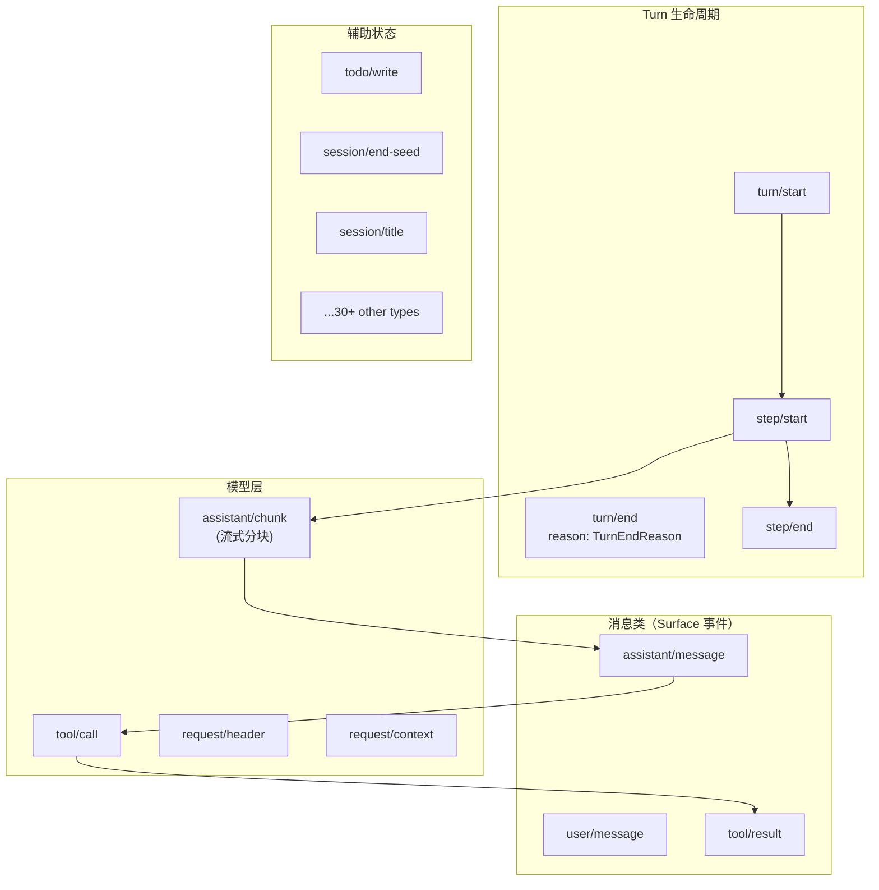
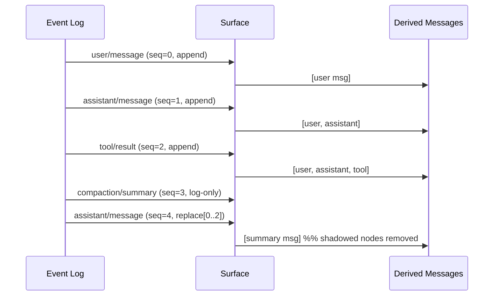
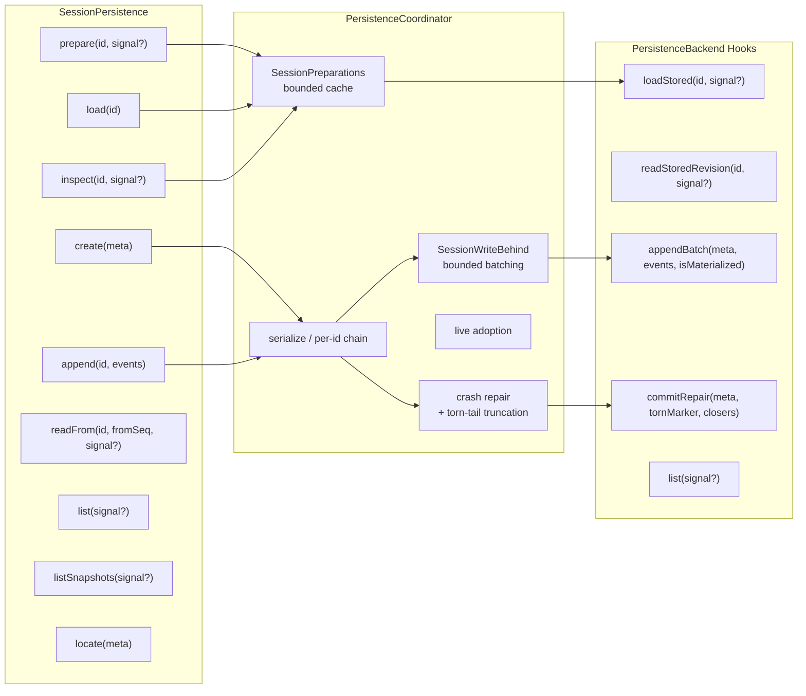
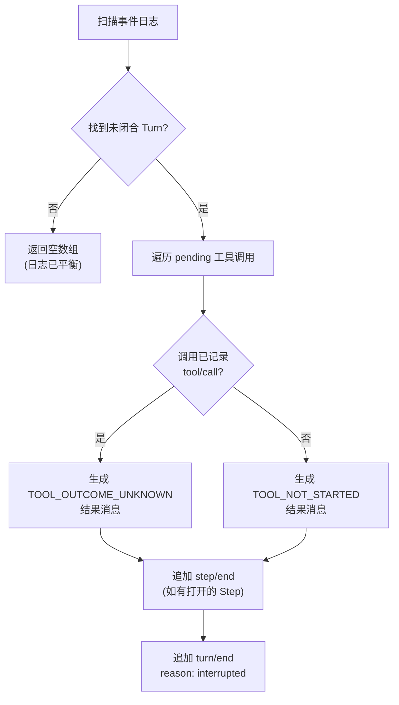
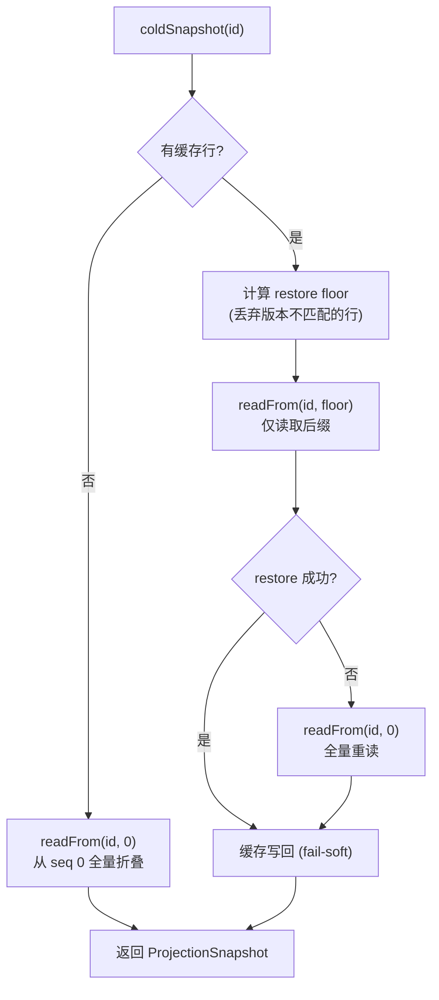
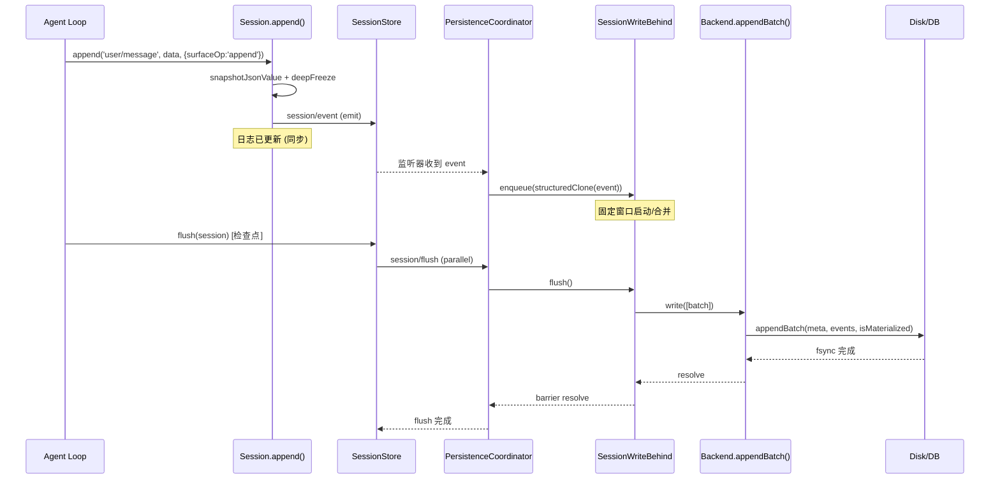

会话日志是整个 Harness 运行时的**单一事实来源**。每一次用户输入、模型回复、工具调用、流式分块——无论是否需要持久化——都以不可变事件的形式追加到一条有序日志中。这条日志既是模型对话历史的推导基，也是崩溃恢复与重放的权威记录。本文档深入剖析从内存中的事件溯源聚合体（`Session`）到磁盘上的 JSONL/SQLite 存储后端的完整数据通路，揭示写后批量、语义检查点、崩溃修复与投影缓存等关键架构决策。

Sources: [index.ts](packages/core/session/src/index.ts#L1-L7), [types.ts](packages/core/session/src/types.ts#L230-L236)

## 事件溯源模型：Session 与事件词汇表

### 事件信封与类型判别联合

`SessionEvent` 是一个严格的判别联合（discriminated union），以 `type` 字段为判别轴。每个事件携带四个固定字段和一组条件字段：

| 字段 | 类型 | 约束 |
|---|---|---|
| `type` | `keyof SessionEventMap` | 事件类型键 |
| `seq` | `number` | 单调序列号，始终等于 `log.length`（连续性契约） |
| `time` | `number` | Unix 纪元毫秒时间戳 |
| `data` | `SessionEventMap[T]` | 按 `type` 收窄的负载 |
| `surfaceOp` | `SurfaceOp` | 仅存在于 Surface 事件 |
| `sourceEventSeqs` | `number[]` | 仅存在于 Surface 事件 |
| `ignorable` | `true` | 标记为可被旧版运行时安全跳过 |

`ignorable` 标记遵循**默认必须（fail-loud）**策略：缺少该标记的未知事件类型会导致会话重建拒绝，而非静默丢弃。这是为了防止一个被忽略的必要事件改变日志后续部分的解释方式。

Sources: [types.ts](packages/core/session/src/types.ts#L392-L437), [index.ts](packages/core/session/src/index.ts#L212-L250)

### 事件类型分类

`SessionEventMap` 定义的 40+ 种事件类型可以按语义分为以下几组：



其中只有三种类型属于 **SurfaceEventType**——`user/message`、`assistant/message`、`tool/result`——它们携带 `surfaceOp` 和 `sourceEventSeqs`，是模型可见对话历史的唯一来源。所有其他事件（包括流式分块 `assistant/chunk`、Turn/Step 边界标记、请求头快照）都是纯日志数据，不直接推导为消息。

Sources: [types.ts](packages/core/session/src/types.ts#L236-L333), [known-event-types.ts](packages/core/session/src/known-event-types.ts#L19-L64)

### Surface 层与有序视图

`SurfaceManager` 在事件日志之上维护一条**有序 Surface**——当前有效的消息序列号列表。Surface 操作只有两种模式：

- **`append`**：追加到尾部——用户消息、正常助手消息、工具结果的常规路径
- **`{ op: 'replace', start, end }`**：替换 `[start, end]` 区间的 Surface 节点——用于压缩（compaction）场景



`deriveEventMessage` 是纯粹的每节点投影规则：`user/message` 返回其 `data`，`assistant/message` 返回 `data.message`（空内容时返回 `null`），`tool/result` 返回 `data.message`。`Session.deriveMessages()` 增量缓存投影结果，每次调用仅处理新增 Surface 节点，复杂度为 O(新增节点数)。

Sources: [surface.ts](packages/core/session/src/surface.ts#L1-L114), [index.ts](packages/core/session/src/index.ts#L700-L758)

### Session 类：内存中的事件溯源聚合体

`Session` 是一个普通类（非 Service），持有一条 `SessionEvent[]` 日志和一个 `SurfaceManager`。关键的不可变性和验证发生在构造时和 `append()` 时：

构造路径支持两种模式——`snapshot`（深拷贝种子事件）和 `restore`（获取持久化新鲜值的所有权，原地冻结）。当种子非空且最后一个事件不是 `session/end-seed` 时，构造器自动追加该边界标记事件，区分种子历史与本生命周期产生的实时事件。

`append()` 方法的核心逻辑：
1. 对 `data` 执行一次性的 `snapshotJsonValue` 遍历——同时完成验证、深拷贝和冻结
2. 校验 Surface 元数据
3. 构建 `deepFreeze` 的事件对象（`seq = log.length`，`time = Date.now()`）
4. 通过 `SurfaceManager.validateNext` 验证 Surface 转换
5. 推入日志，通知观察者

Sources: [index.ts](packages/core/session/src/index.ts#L425-L655), [preparation.ts](packages/core/session/src/preparation.ts#L1-L49)

## SessionStore：内存会话注册表与发布生命周期

`SessionStore`（`ctx.sessions`）是所有活跃会话的内存注册表，同时管理事件发布的同步边界。它暴露了四个 Cordis 事件：

| 事件 | 模式 | 触发时机 |
|---|---|---|
| `session/created` | `emit` | 会话在 Store 中发布（同步抛出可否决并回滚） |
| `session/disposed` | `emit` | 会话离开 Store（包含发布回滚） |
| `session/event` | `emit` | 事件追加后（fire-and-forget，观察者失败被隔离） |
| `session/flush` | `parallel` | 持久化检查点屏障（所有监听器并行 await） |

创建-进入-宣布三步分离是一个精心设计的事务模式。`prepare()` 构建会话但不进入 Store；`enter()` 安装发布钩子并加入 Store（返回 detach 处理器）；`announce()` 发射 `session/created`。调用者在 `ctx.effect` 中先 yield detach 处理器再调用 announce——这样 `session/created` 监听器抛出异常时，effect 生成器自动回滚已 yield 的处理器，保证不泄露 Store 条目。

Sources: [index.ts](packages/core/session/src/index.ts#L792-L996)

### Fork 语义

`SessionStore.fork()` 从一个活跃会话的稳定前缀创建子会话。边界必须是闭合 Turn（不能落在 `turn/start` 和 `turn/end` 之间）。子会话通过 `seed`（父事件前缀的拷贝）和 `meta.parentSession`/`meta.seedLength` 标记谱系。

Sources: [index.ts](packages/core/session/src/index.ts#L1067-L1153)

## 持久化服务：SessionPersistence 能力接缝

持久化是一个**能力接缝**（Capability Seam）。抽象服务 `SessionPersistence`（`ctx.sessionPersistence`）定义了存储契约，但不规定存储实现。当前提供两个第一方后端：

| 后端 | 包 | 介质 | Torn Marker | Seek 读取 |
|---|---|---|---|---|
| JSONL | `dsh-session-persistence-jsonl` | 每会话一个追加文件 | `{ truncateTo, recoveredEvents }` | 不支持（全文件解析+跳过） |
| SQLite | `dsh-session-persistence-sqlite` | 一个数据库多表行 | `number`（删除起始 seq） | 支持（`WHERE seq >= ?`） |

### 服务 API 概览



`PersistenceCoordinator` 是所有第一方后端共享的编排层，负责：每 ID 串行化（`serialize()`）、有界写后批量、延迟物化、崩溃修复排序、会话采纳（adoption）、和静默退出（quiescent disposal）。后端只需实现 `PersistenceBackend` 的六个存储钩子。

Sources: [index.ts](packages/session/session-persistence/src/index.ts#L60-L241), [coordinator.ts](packages/session/session-persistence/src/coordinator.ts#L83-L215)

### 写后批量（Write-Behind）

`SessionWriteBehind` 是每个活跃会话的有界写入控制器。其调度策略为：

1. 首个待处理事件启动一个**固定时间窗口**（默认 `200ms`）
2. 后续事件加入队列**不重置**截止时间
3. 窗口到期触发一次后台批量写入
4. 如果写入时窗口已到期，写入完成后立即开始下一次写入

显式的 `flush()` 调用（由检查点策略驱动）取消等待窗口并启动静默排空屏障——保证所有已缓冲事件在写入完成前不会产生新的消费者。

写入失败时，已排出的批次重新拼接到队列头部，控制器进入暂停状态（`automaticPaused`），直到下一次显式 `flush()` 恢复。

Sources: [write-behind.ts](packages/session/session-persistence/src/write-behind.ts#L1-L159), [coordinator.ts](packages/session/session-persistence/src/coordinator.ts#L26-L33)

### 延迟物化与连续性契约

`create(meta)` 在协调器中仅记录元数据（`{ meta, cursor: 0, materialized: false }`），不产生任何物理 I/O。首次 `appendBatch` 时，后端原子地执行物化写入（创建文件/插入行）和事件追加——崩溃不会留下一个已物化但为空的会话。

连续性契约要求每个事件的 `seq` 必须等于 `state.cursor + index`。违反时立即拒绝，保证存储日志的完整性。

Sources: [coordinator.ts](packages/session/session-persistence/src/coordinator.ts#L633-L710)

## 崩溃恢复：中断 Turn 的语义闭合

### interruptedTurnClosers

当进程在 Turn 中途崩溃时，持久化日志可能以一个未闭合的 Turn 结尾——有 `turn/start` 但没有配对的 `turn/end`，有 `tool/call` 但没有配对的 `tool/result`。`interruptedTurnClosers` 函数扫描日志尾部，为每个未匹配的工具调用生成一个错误结果，然后闭合步骤和 Turn：



两个错误码传达了不同的风险等级：

| 错误码 | 含义 | 恢复建议 |
|---|---|---|
| `TOOL_NOT_STARTED` | 工具调用在 Harness 记录其开始前被中断 | 可以重试 |
| `TOOL_OUTCOME_UNKNOWN` | 工具调用已记录但结果未持久化 | 验证外部状态后决定是否重试 |

合成事件的 `seq` 从最后真实事件继续，`time` 复用最后真实事件的时间戳（确定性，不发明"未来"时间）。

Sources: [repair.ts](packages/core/session/src/repair.ts#L1-L133), [index.ts](packages/core/session/src/index.ts#L29)

### Torn-Tail 截断

除了 Turn 级别的语义闭合，物理介质的损坏（部分写入的帧/行）需要由后端各自的 `loadStored` 处理。后端返回 `StoredPrefix` 时携带 `tornMarker`，协调器通过 `commitRepair` 让后端执行截断+追加闭合事件。

JSONL 后端检测不完整的 Zstandard 帧并保留其完整解码的记录；SQLite 后端处理最后一行 JSON 解析失败。两种后端都只丢弃物理损坏的尾部记录——已完整解码的记录被保留。

Sources: [coordinator.ts](packages/session/session-persistence/src/coordinator.ts#L90-L115)

## 语义检查点策略

`dsh-session-checkpoint-policy` 是一个零配置插件，在三个关键边界安装**故障关闭（fail-closed）**的持久化屏障：

| 边界 | 拦截点 | 失败后果 |
|---|---|---|
| 模型请求 | `llm/stream` —— 下游适配器在缓冲请求事件持久化前不被构造 | 请求不发出 |
| 顶层工具执行 | `tools/execute` —— 顶层工具体在其记录的调用持久化前不运行 | 工具不执行 |
| 下一步 | `agent/pre-step` —— 前一步的响应和工具结果在下一步开始前持久化 | Turn 失败 |

策略包装 `llm/stream` 的方式是惰性的——下游流在 `await ctx.sessions.flush(session)` 完成之前不被构造。这意味着即使适配器支持流式传输，也会等待已缓冲的请求前缀到达磁盘后才发起。

Sources: [index.ts](packages/session/session-checkpoint-policy/src/index.ts#L1-L83)

## JSONL 后端：追加日志文件

### 磁盘布局

```
<root>/
  --<normalized-cwd>--/          # 可读项目目录（或 _no-cwd/）
    <encoded-session-id>/        # 会话目录
      session.jsonl.zstd         # 默认：校验和头帧 + 追加帧
      session.jsonl              # 仅 compression: 'none' 时
```

项目目录的键将 cwd 中的路径分隔符和驱动器分隔符替换为 `-`，并对不安全字符使用 `~XXXX` 转义。会话 ID 通过 `encodeSegment` 注入式编码为单个安全路径段——防止 `../` 遍历和分隔符注入。

每个文件的第一行是 `SessionHeader`（标记为 `{ type: 'session', ... }`），后续每行是一个 `SessionEvent` 或一个**打包的 chunk 行**。

Sources: [format.ts](packages/session/session-persistence-jsonl/src/format.ts#L1-L191), [README.md](packages/session/session-persistence-jsonl/README.md#L7-L21)

### 物理编码：Zstandard 帧

默认使用标准 Zstandard 帧连接——一个包含且仅包含头行的校验和帧，后跟每个持久追加批次的校验和帧。这使得：

- 头帧可以独立解码（会话元数据无需读取整个日志）
- 不完整的最后一帧可以被检测和截断
- 每帧携带校验和，物理损坏不会静默传播

Sources: [index.ts](packages/session/session-persistence-jsonl/src/index.ts#L37-L58)

### Chunk 行打包

`assistant/chunk` 流式分块事件在真实会话中占据数百行，但其 JSON 信封远大于负载。`packChunkRuns` 将连续的同类型 delta 分块（`text-delta`、`reasoning-delta`、`tool-call-delta`）打包为单行存储记录：

| 打包行类型 | 对应事件 | 节省 |
|---|---|---|
| `text-chunks` | `assistant/chunk` (text-delta) | ~60% |
| `reasoning-chunks` | `assistant/chunk` (reasoning-delta) | ~60% |
| `tool-call-chunks` | `assistant/chunk` (tool-call-delta) | ~60% |

打包是无损的：解码器恢复确切的事件序列号和时间戳（通过 `dt` 间隔数组），且打包行的 bare 标签（如 `text-chunks`）不含斜杠，不会与会话事件类型混淆。编码器采用白名单策略——任何它不完全识别的形状按原样存储，不丢失数据。

Sources: [chunk-rows.ts](packages/core/session/src/chunk-rows.ts#L1-L200)

### 轻量修订令牌

`listSnapshots` 不需要解析完整日志即可返回每个会话的变更令牌。JSONL 后端使用文件系统身份（设备 ID + inode + 大小 + 纳秒级时间戳）构建修订令牌。全前缀读取要求读取前后该身份匹配，排除读取期间外部写入的干扰。

Sources: [index.ts](packages/session/session-persistence-jsonl/src/index.ts#L91-L108), [README.md](packages/session/session-persistence-jsonl/README.md#L48-L49)

## SQLite 后端：关系型存储

### Schema 设计

```sql
CREATE TABLE persistence_state (
  singleton INTEGER PRIMARY KEY CHECK (singleton = 1),
  store_id  TEXT NOT NULL
) STRICT;

CREATE TABLE sessions (
  id               TEXT PRIMARY KEY,
  version          INTEGER NOT NULL,
  created_at       INTEGER NOT NULL,
  cwd              TEXT,
  parent_session   TEXT,
  seed_length      INTEGER,
  origin           TEXT,
  delegation_depth INTEGER,
  agent_preset     TEXT,
  incarnation      TEXT NOT NULL,    -- 物化时分配的稳定身份
  revision         INTEGER NOT NULL   -- 每个变更事务递增
) STRICT;

CREATE TABLE events (
  session_id        TEXT NOT NULL REFERENCES sessions(id) ON DELETE CASCADE,
  seq               INTEGER NOT NULL,
  type              TEXT NOT NULL,
  time              INTEGER NOT NULL,
  data              TEXT NOT NULL,           -- JSON 文本
  source_event_seqs TEXT,                     -- JSON 编码的 number[]
  surface_op        TEXT,                     -- JSON 编码的 SurfaceOp
  ignorable         INTEGER,                  -- 1 iff ignorable: true
  PRIMARY KEY (session_id, seq)
) STRICT;
```

`sessions` 行的存在性是物化信号——`create` 不写入行，首次 `append` 才写入。`incarnation` + `revision` 组合提供乐观并发控制。数据库在初始化时通过 `PRAGMA application_id`（`0x44534850`）和 `PRAGMA user_version`（`SCHEMA_VERSION = 15`）标记所有权，防止无关数据库被误写入。

Sources: [schema.ts](packages/session/session-persistence-sqlite/src/schema.ts#L20-L172), [index.ts](packages/session/session-persistence-sqlite/src/index.ts#L99-L168)

### Seek 能力与 Suffix 读取

SQLite 后端实现了可选的 `loadStoredFrom(id, fromSeq)` 钩子，通过 `WHERE seq >= ?` 直接读取事件后缀。这使得 `readFrom` 的复杂度仅与后缀大小成正比，而非整个日志。JSONL 后端不实现此钩子，回退到全文件解析后跳过。

Sources: [coordinator.ts](packages/session/session-persistence/src/coordinator.ts#L154-L176)

## 投影系统：从事件到派生状态

### ProjectionDefinition 驱动模型

`SessionProjectionRegistry`（`ctx.sessionProjections`）订阅 `session/event` 一次，将每个已提交事件传递给每个已注册投影单元的 `apply` 函数。这是一个**急切驱动**模型——域插件不需要订阅事件，只需贡献纯数学：

```typescript
interface ProjectionDefinition<K, S> {
  key: K
  schema: ZodType<SessionProjectionMap[K]>
  init(): S
  apply(state: S, event: SessionEvent): S  // 返回同引用 = 无变更
  view(state: S): SessionProjectionMap[K]   // 状态 → 线负载
  stateVersion: number                       // 序列化失效版本
}
```

核心约束：三个函数必须是同步的（异步会撕裂载体的一致性切口），`state` 必须是纯 JSON（持久化缓存前提）。当 `apply` 返回同一个对象引用（`Object.is`）时，不产生下游工作——这是零成本的无变更快路径。

Sources: [index.ts](packages/session/session-projection/src/index.ts#L42-L74), [index.ts](packages/session/session-projection/src/index.ts#L171-L184)

### 持久化投影缓存

`SessionProjectionCache`（`ctx.sessionProjectionCache`）将每个投影单元的状态以 `(sessionId, key, ver, seq, val)` 记录形式持久化。缓存只是折叠快捷方式，永远不是权威——版本不匹配时丢弃行，而非迁移。

冷读取采用分层梯子：



写后缓存采用两个触发器：事件计数（`writeEveryEvents`）和时间间隔（`writeIntervalMs`），加上两个强制写入点——`turn/end` 和会话退出（活跃到冷的时刻）。

Sources: [index.ts](packages/session/session-projection-cache/src/index.ts#L42-L197)

## 端到端写入路径：从 append 到磁盘

将上述组件串联起来，一次完整的 `Session.append()` 到磁盘持久化的流程如下：



**热路径不阻塞 I/O**——`Session.append()` 同步返回，持久化通过 `session/event` 监听器异步缓冲。当语义检查点需要确保耐久性时（如模型请求前），`SessionStore.flush()` 等待所有持久化监听器完成。

Sources: [index.ts](packages/core/session/src/index.ts#L604-L655), [index.ts](packages/core/session/src/index.ts#L1022-L1039), [coordinator.ts](packages/session/session-persistence/src/coordinator.ts#L669-L710)

## 格式版本与向前兼容

`SESSION_FORMAT_VERSION` 是单一单调整数，当前固定为 `0`（预发布阶段）。该版本不区分大小/小版本号，仅在结构性变更（头格式、事件信封、核心事件语义、Surface 机制）需要时递增。

加载时，后端检查版本：
- **版本相同**：正常加载
- **存储版本 > 运行时版本**：抛出 `SessionFormatUnsupportedError`，提示用户升级 Harness
- **存储版本 < 运行时版本**：同样拒绝，提示无升级路径

`KNOWN_SESSION_EVENT_TYPES` 集合由 `scripts/gen-persistence-catalog.ts` 自动生成，列出当前构建理解的所有事件类型。读取路径拒绝解释包含未知事件类型且未标记 `ignorable` 的日志——这是一种静默防止"新日志被旧运行时错误读取"的保护机制。

Sources: [types.ts](packages/core/session/src/types.ts#L33-L56), [known-event-types.ts](packages/core/session/src/known-event-types.ts#L8-L18), [coordinator.ts](packages/session/session-persistence/src/coordinator.ts#L47-L81)

## 会话恢复与重建

会话恢复（resume）通过 `SessionPersistence.prepare(id)` 完成。协调器加载存储前缀，执行崩溃修复（如有），验证和冻结事件，然后通过 `Session.fromRestore()` 构建一个转移所有权的 Session 实例。

恢复后的会话保留了完整的 Surface 历史（包括压缩 `replace` 操作的投影效果），`request/header` 事件序列折叠为最后的 EpochHeader 快照，而新的循环实例在此基础上组合当前系统提示和工具集。`session/end-seed` 边界事件标记了种子历史和实时工作的分界——会话标题投影、遥测等消费者从此点开始处理实时事件。

Sources: [index.ts](packages/session/session-persistence/src/index.ts#L145-L168), [types.ts](packages/core/session/src/types.ts#L310-L333)

## 延伸阅读

- [Agent 循环：Turn 与 Step 生命周期](12-agent-xun-huan-turn-yu-step-sheng-ming-zhou-qi)——Turn/Step 边界事件如何被循环驱动器产生
- [工具执行管线](14-gong-ju-zhi-xing-guan-xian)——检查点策略如何嵌入工具执行管线
- [能力接缝（Capability Seams）原理](15-neng-li-jie-feng-capability-seams-yuan-li)——SessionPersistence 作为能力接缝的三方分离设计
- [压缩（Compaction）机制](docs/subsystems/compaction.md)——Surface `replace` 操作如何用于对话历史压缩