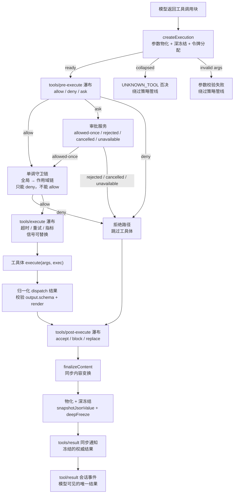

工具执行管线是 DeepSeek Harness 中连接 LLM 工具调用与底层能力实现的枢纽架构。当模型返回一条包含工具调用的助手消息后，该调用并非直接进入工具函数体——它要穿越一条精心设计的 **六阶段管线**：参数物化 → 前置策略（pre-execute）→ 单调守卫（guards）→ 环绕调度（around-dispatch）→ 后置策略（post-execute）→ 内容终结与通知（finalize & result）。每一阶段都通过 Cordis 事件瀑布（waterfall）对外暴露为可插拔的扩展点，使超时控制、审批询问、结果重写等横切关注点可以以声明式的方式介入，而无需侵入核心调度逻辑。

Sources: [tools.md](docs/subsystems/tools.md#L170-L172) · [index.ts](packages/core/tools/src/index.ts#L1328-L1344)

## 核心类型：ToolDefinition 与 defineTool

### 注册体：ToolDefinition

每一个被注册到注册表中的工具都由一个 `ToolDefinition` 完整描述。它扩展了模型可见的 `ToolSchema`（`name`、`description`、`parameters`），并增加了执行层面的契约：**必选的 `output` 输出声明**、**必选的 `execute` 执行函数**，以及若干可选的调度与展示回调。`output.schema` 是一份原始 JSON Schema，注册表会对每次成功返回的规范值进行校验；`output.render` 是一个纯投影函数，负责将校验后的值转换为面向模型的 `ContentBlock[]`。`output.presentationMeta` 仅供顶层调用使用，生成可回放的展示元数据（如 diff 结构），由注册表附加在 `tool/result` 事件上持久化。

`timeoutMs` 声明了一个协作式超时预算——注册表本身不执行超时逻辑，而是由 `timeout-policy` 插件在 `tools/execute` 瀑布中读取该值并实施截断。`isConcurrencySafe` 是一个纯同步分类器，只有精确返回 `true` 时该调用才被允许加入并行组——其他所有返回值（包括异常）都降级为 `exclusive`，形成排序屏障。`finalizeContent` 是注册表在每个归一化结果（包括管线级失败）上调用一次的同步内容变换器，返回 `undefined` 保留原始内容，返回新数组则替换。

Sources: [index.ts](packages/core/tools/src/index.ts#L221-L288) · [schema.ts](packages/core/tools/src/schema.ts#L482-L536)

### 类型安全工厂：defineTool

第一方工具不会手写 `ToolDefinition`，而是通过 `defineTool` 工厂函数获得完整的类型推断与参数验证。`defineTool` 接收一组 `DefineToolOptions<S, O>`，其中 `S` 是隐式参数对象 schema、`O` 是输出值 schema。它在注册前编译参数 schema 为原始 JSON Schema、编译输出 schema、并为每个工具缓存一个 `validate` 闭包。`execute` 函数接收的 `args` 已经经过了 schema 校验与类型收窄——`InferArgs<S>` 从字面量约束中推导出精确的 TypeScript 类型，而 `InferValue<O>` 则为输出值提供同等级的类型安全。

| 关注点 | defineTool 行为 | 手写 ToolDefinition 时 |
|---|---|---|
| 参数验证 | 注册前编译 schema，执行时自动校验 | 需手动调用 `validateArgs` |
| 类型推断 | `InferArgs`/`InferValue` 全链路推断 | `args: unknown` 需手动收窄 |
| 展示回放 | soft 验证，旧参数回退到 generic 卡片 | 需自行处理异常 |
| 超时/并发 | 透传 `timeoutMs`/`isConcurrencySafe` | 手写 metadata |

Sources: [schema.ts](packages/core/tools/src/schema.ts#L538-L618) · [tools.md](docs/subsystems/tools.md#L96-L149)

## 管线全景



管线中有一条关键不变式：**参数在策略开始前就已完成物化与冻结**。`createExecution` 通过 `snapshotJsonValue` 执行一次无损 JSON 序列化/反序列化——任何携带 `undefined`、函数、循环引用或 `Symbol` 键的输入都会被拒绝。冻结后的参数对象通过 getter 属性被组装进 `MutableToolRunContext`，其中还包含 `deferContext()` 和 `concludeTurn()` 两个副作用通道，以及注册表分配的不透明 `token`（`Symbol` 类型，仅用于标识比较）。

Sources: [index.ts](packages/core/tools/src/index.ts#L1364-L1451) · [tool-execution-pipeline.md](docs/tool-execution-pipeline.md#L9-L58)

## 六个阶段详解

### 阶段一：参数物化与调用创建（createExecution）

`createExecution` 是管线的入口，它做了四件事：第一，将原始 `arguments` 通过 `snapshotJsonValue` 物化为无损 JSON 快照并 `deepFreeze`，确保后续所有阶段看到的参数是不可变的；第二，铸造一个唯一的 `ToolExecutionToken`（`Symbol`），用于嵌套调用的父子关联与注册表内部映射；第三，在参数物化之前捕获 `finalizeContent` 回调——因为参数 getter 可能在物化过程中替换或清除已注册的定义，所以回调必须在物化前绑定；第四，处理 Code Mode 折叠——如果当前 scope 的展示模式是 `code` 且这是一个无 parent 的模型直调（即调用了非 `run_code` 工具），则直接以 `UNKNOWN_TOOL` 拒绝，**绕过整个可扩展策略管线**。

此阶段还会创建一个 `ToolCancellationState`，记录调用者的原始 `AbortSignal` 和一个 `bodyInvoked` 布尔标志。该标志决定了取消发生时的语义：如果工具体尚未被调用，取消产生 `ABORTED_BEFORE_DISPATCH`；如果工具体已被调用，取消产生 `ABORTED`——但已启动的 Promise 仍然会被排空到完成（drain），不会硬中断同进程代码。

Sources: [index.ts](packages/core/tools/src/index.ts#L1364-L1451) · [index.ts](packages/core/tools/src/index.ts#L1509-L1525)

### 阶段二：前置策略瀑布（tools/pre-execute）

`tools/pre-execute` 是一个 Cordis **waterfall** 事件，每个监听器收到 `(exec, next)` 并返回一个 `PreToolDecision`。决策有三种：`{ kind: 'allow' }` 放行、`{ kind: 'deny', reason }` 拒绝、`{ kind: 'ask', reason? }` 请求人工审批。瀑布的默认 continuation 返回 `allow`，因此"无监听器"等同于全部放行。事件分发是 **scope-filtered** 的——agent 级别的监听器只接收属于该 agent 的调用。

当决策为 `ask` 时，注册表通过 `ctx.get('approval')` **机会性消费**审批服务接缝。该接缝是可选的：未部署 `ApprovalService` 的环境中 `ask` 降级为 `deny`；agent 不存在的调用也降级（没有会话可审计、没有 UI 可路由）。审批服务的 `request()` 返回四种结果：`allowed-once` 转为 `allow`、`rejected` 转为带用户拒绝原因的 `deny`、`cancelled` 转为带取消原因的 `deny`（同时标记 `approvalCancelled` 以触发 `ABORTED_BEFORE_DISPATCH` 路径）、`unavailable` 转为带通道不可用原因的 `deny`。

**参数不可重写**是此阶段的刻意约束——参数在进入瀑布前已被记录到 `tool/call` 会话事件并向 UI 展示，任何重写都会导致记录与实际执行的不一致。

Sources: [index.ts](packages/core/tools/src/index.ts#L1463-L1507) · [index.ts](packages/core/tools/src/index.ts#L1689-L1729)

### 阶段三：单调守卫链（ToolGuard）

守卫是注册在 `tools/pre-execute` 瀑布之后的同步策略检查。它们的设计核心是**单调性**：返回 `undefined` 保持当前状态不变，返回一个 `string` 理由则否决调用——**没有 allow 返回值**。这意味着监听器顺序不可能把一个否决翻转为放行。

守卫的解析顺序是：先全局层，再按作用域链从最远祖先到当前 scope。每个 `ToolLayer` 持有一个 `guards` 表，`guardReason()` 遍历所有守卫返回第一个否决理由。通过 `agent.ctx` 注册的守卫仅对该 agent 生效。例如沙箱策略插件可以注册一个守卫来检查工具调用是否违反沙箱约束，而无需担心被另一个监听器覆盖。

```ts
type ToolGuard = (execution: Readonly<ToolExecution>) => string | undefined
```

守卫与瀑布的关系如下表所示：

| 特性 | tools/pre-execute 监听器 | 单调守卫 |
|---|---|---|
| 返回类型 | `PreToolDecision`（allow/deny/ask） | `string \| undefined` |
| 可请求审批 | 是（`ask`） | 否 |
| 可否决 | 是 | 是 |
| 可放行 | 是 | 否（只能保持不变） |
| 异步 | 是（须观察 signal） | 否（同步） |
| 注册方式 | `ctx.on('tools/pre-execute', ...)` | `ctx.tools.guard(fn)` |

Sources: [index.ts](packages/core/tools/src/index.ts#L1110-L1128) · [tools.md](docs/subsystems/tools.md#L313-L325)

### 阶段四：环绕调度与工具体（tools/execute + body）

`tools/execute` 是一个 **around-dispatch** 瀑布：监听器接收 `(exec, next)` 并返回一个 `ToolExecutionResult`，通过 `next()` 委托给下一个包装器或最终的工具体。这个瀑布是超时策略、重试逻辑和指标采集的归宿。

**信号融合**是此阶段最精密的机制。`ToolDispatchExecution` 允许包装器替换 `exec.signal`（例如超时插件设置截止信号），但注册表在工具体执行前会将替换信号与调用者的原始信号**融合**（`fuseToolSignals`）：融合后的 `AbortController` 同时监听两个信号源，任一 abort 则触发融合信号。当工具体完成后，融合信号被 `dispose()`，`exec.signal` 恢复为包装器的上游信号——保证 `tools/post-execute` 监听器永远看不到超时插件的已-aborted 信号。如果调用者信号和包装器信号是同一对象，则零开销直接返回。

超时插件（`timeout-policy`）的实现是此模式的典型范例：它读取 `ctx.tools.get(exec.name, exec.agent)?.timeoutMs`，为该值创建一个 `deadline(exec.signal, timeoutMs, TOOL_TIMEOUT)` 派生信号，临时替换到 `exec` 上，然后调用 `next()`。如果它自己的计时器触发了（通过 `timeoutOf(d.signal, TOOL_TIMEOUT)` 确认），则用结构化的 `TOOL_TIMEOUT` 错误结果替换返回值。

工具体执行后，注册表通过 `createSuccessResult` 归一化返回值：snapshot 快照 → `output.schema` 校验 → 深冻结 → `output.render` 投影为内容块 → 可选的 `presentationMeta` 投影。任何校验失败或投影异常都会变成 `ToolOutputError`，最终归一化为 `isError` 结果。around-dispatch 瀑布返回的结果如果是包装器自行构造的（非 `canonicalResults` 标记），则通过 `normalizeDispatchResult` 重新走一遍输出契约。

Sources: [index.ts](packages/core/tools/src/index.ts#L1532-L1599) · [index.ts](packages/core/tools/src/index.ts#L1825-L1844) · [timeout-policy/index.ts](packages/guard/timeout-policy/src/index.ts#L55-L80)

### 阶段五：后置策略瀑布（tools/post-execute）

`tools/post-execute` 接收已归一化的 `ToolExecutionResult`，并返回一个 `PostToolDecision`。这个瀑布是结果审查、上下文注入和纠正性反馈的归属。四种决策如下：

| 决策 | 语义 | 对结果的影响 |
|---|---|---|
| `accept`（无替换） | 接受不变 | 保持原始 content/value |
| `accept` + `content` | 替换展示内容 | 规范值保留，仅 content 变 |
| `accept` + `value` | 替换规范值 | 重新校验+渲染 content/meta |
| `block` + `feedback` | 阻断为错误 | value 丢弃，feedback 成为 isError content |

`accept` + `value` 会触发完整的 `createSuccessResult` 流程（重新校验 schema、重新 render），确保替换值仍然符合输出契约。`block` 会将成功结果翻转为 `isError`，其中的 `feedback` 内容成为模型看到的纠正性消息——例如 `repeat-tool-reminder` 插件不 block 调用，而是通过 `additionalContexts` 注入提醒消息；但如果某个安全策略发现工具输出了敏感信息，可以用 `block` 阻断它。

任何决策都可以附带 `additionalContexts`（`UserMessage[]`），这些上下文会在活跃批次的 `tool/result` 记录完成后按 FIFO 顺序注入到下一个模型请求中。工具体自身通过 `deferContext()` 延迟的上下文会在 `accept` 结果中保留，但在 `block` 时被丢弃——阻断操作只暴露阻断决策显式提供的上下文。

Sources: [index.ts](packages/core/tools/src/index.ts#L1742-L1781) · [tools.md](docs/subsystems/tools.md#L391-L404)

### 阶段六：内容终结与最终通知（finalizeContent → materialize → tools/result）

这是管线的最后一英里。首先，注册表调用 `applyFinalContent`——使用在执行开始时快照的 `finalizeContent` 回调，对归一化结果做一次同步内容变换。返回 `undefined` 保留内容，返回新的 `ContentBlock[]` 则替换。此回调在每个归一化结果上**恰好调用一次**，包括绕过了 `tools/post-execute` 的管线级失败。回调必须是完全函数（total function），不得抛出异常。

然后进入 **物化** 阶段（`materializeFinalResult`）：对 content、meta、additionalContexts 和 error 等字段执行 `snapshotJsonValue` + `deepFreeze`，确保最终结果是冻结的、无损 JSON 可序列化的。物化完成后，`notifyResult` 将执行对象本身也 `Object.freeze`，然后通过 `tools/result` 事件（`emit` 模式，非瀑布）同步通知所有观察者。观察者的异常被包含（contained）——仅记录警告日志，不影响最终结果。`tools/result` 之后不再有任何变换机会：此后管线返回的结果就是会话事件 `tool/result` 中持久化的权威结果。

Sources: [index.ts](packages/core/tools/src/index.ts#L1631-L1676) · [index.ts](packages/core/tools/src/index.ts#L1846-L1862)

## 调度器：并行与排他

Agent 循环并非简单串行地执行每个工具调用。`executeToolCalls` 负责将一个 assistant step 中的所有工具调用按其**运行时并发模式**分组调度。`ctx.tools.executionMode(exec)` 对每个待执行调用返回 `{ kind: 'parallel' }` 或 `{ kind: 'exclusive' }`——只有工具定义上声明了 `isConcurrencySafe` 且该函数对当前参数精确返回 `true` 的调用才被归为 parallel；其余一律 exclusive。

调度策略形成了一个**有界滚动池**：

- 第一个调用的模式决定初始分组——parallel 则将后续所有调用纳入一个可重叠的池，exclusive 则独自执行形成屏障
- 池的大小受 `maxParallelToolCalls`（默认 10）限制
- 池中后续调用在每次启动前**重新分类**——如果之前的调用改变了注册表状态（例如某工具注册或注销了新工具），使得下一个调用变为 exclusive，则停止填充，当前池排空后该 exclusive 调用形成新的屏障
- **策略有序、调度可重叠**：pre-execute（含审批）按模型顺序执行，只有工具体可以重叠
- **结果按模型顺序提交**：`commitReady()` 仅在连续的 slot 都就绪时才依次提交，保证 `tool/result` 事件的顺序与模型请求顺序一致

调度器通过 `TOOL_RUNTIME_SCHEDULER` 符号接口将管线拆分为三个可独立调度的阶段：`prepare`（参数物化 + 前置策略 + 守卫）→ `dispatch`（环绕调度 + 工具体）→ `finalize`（后置策略 + 终结）或 `finish`（绕过后置策略的终结）。这种拆分使得并行调用的前置策略可以有序执行，而工具体执行可以重叠，同时保持结果提交的模型顺序。

Sources: [tool-calls.ts](packages/core/agent-loop/src/tool-calls.ts#L59-L101) · [tool-calls.ts](packages/core/agent-loop/src/tool-calls.ts#L121-L213) · [index.ts](packages/core/tools/src/index.ts#L446-L460)

## 取消语义

管线对取消（`AbortSignal`）的处理遵循一个清晰的不变式：**取消不会放弃已启动的 Promise**。同进程代码无法被硬中断，因此注册表让已启动的工具体自然排空到 quiescence，然后根据 `bodyInvoked` 标志选择两种取消结果之一：

| 取消时机 | bodyInvoked | 错误码 | 语义 |
|---|---|---|---|
| 进入后、策略中、体前 | `false` | `ABORTED_BEFORE_DISPATCH` | 跳过未启动的体 |
| 体已启动、返回后 | `true` | `ABORTED` | 体已排空，结果被覆盖 |

取消在管线中有多个检查点：`prepareExecution` 在策略开始前检查、在审批 settle 后检查、在 guard 后检查；`dispatchScheduledExecution` 在 dispatch 结果归一化后检查。`postExecute` 完成后也会检查——一个成功的 accepted 结果在调用者已取消时会被替换为对应的取消结果。信号融合机制确保即使 `tools/execute` 包装器替换了信号，调用者的原始取消意图永远不会被脱离——融合信号同时监听两个来源。

Sources: [index.ts](packages/core/tools/src/index.ts#L1509-L1525) · [index.ts](packages/core/tools/src/index.ts#L1880-L1944)

## 不变式校验

`tools/invariant` 是一个 Cordis companion 插件，在运行时验证管线的不变式。它通过 `internal/dispatch` 拦截器监控每个执行对象在管线各阶段的流转：

1. **阶段单调性**：`tools/pre-execute` 必须先于 `tools/execute`，后者必须先于 `tools/post-execute`，最后是 `tools/result`。每个执行对象的阶段流转通过 `WeakMap<object, ToolStage>` 跟踪，重复进入或跳序都会触发不变式失败。
2. **冻结保证**：`tools/result` 的执行对象和结果（含 content）在发布前必须已被 `Object.isFrozen` 冻结。
3. **身份完整性**：执行对象的 `name` 和 `callId` 必须非空。
4. **Code Mode 分派封闭**：`tool/code-dispatch-start` 和 `tool/code-dispatch` 事件必须出现在某个打开的 turn 内，且 `subCallId` 的 `rootCallId` 一致性不可变更。

Sources: [invariant.ts](packages/core/tools/src/invariant.ts#L32-L120)

## Code Mode 传输

当 scope 的展示模式为 `code` 时，模型唯一可直接调用的工具是 `run_code`。所有其他工具通过 `run_code` 程序内部的 SDK（TypeScript 或 Python）以嵌套子分派的方式执行。`run_code` 的 execute 函数内部通过 `TOOL_RUNTIME_SCHEDULER.prepare → dispatch → finalize` 三阶段接口调度子调用，每个子调用携带父执行的 `token` 作为 `parent` 字段——这标记了它是一个传输子分派而非模型直调，使其可以绕过 Code Mode 折叠直接调用可见工具。

每个子分派的开始和结束都会记录为 `tool/code-dispatch-start` 和 `tool/code-dispatch` 会话事件（log-only，`deriveMessages` 忽略它们），UI 通过 `subCallId` 配对来渲染实时的逐子调用状态。`tools/code-dispatch-log` 瀑布允许监听器替换持久日志副本中的内容（例如 spill 策略为超大文本结果生成预览+定位器），但程序本身已经收到了完整的结构化 `value`，模型也看不到这些子调用——只有 `run_code` 的精选结果进入模型历史。

Sources: [code-mode.ts](packages/core/tools/src/code-mode.ts#L1-L86) · [types.ts](packages/core/tools/src/types.ts#L10-L58) · [tools.md](docs/subsystems/tools.md#L255-L281)

## 可见性与作用域

工具的可见性解析在单次层遍历中完成（`view(scope)`）。遍历从全局层开始，沿作用域链依次叠加每层注册——**近层遮蔽远层同名工具**。限制（`ToolRestriction`）作用于**继承面**（全局层 + 所有祖先层），且所有层的限制**取交集**。但 scope 自身的注册**不受限制影响**——这保证了委托运行时注册到子 agent 的报告/结构化输出工具不会被该子 agent 的能力过滤器剥离。

`schemas()` 方法将可见定义投影为模型可见的 `ToolSchema`（仅 `name`、`description`、`parameters`），执行和展示回调永远不会泄漏给模型。`tools/change` 事件在任何注册/注销/限制变更时触发（非 scope-filtered），通知所有 agent 重新组装下一次模型请求。

Sources: [index.ts](packages/core/tools/src/index.ts#L1152-L1193) · [tools.md](docs/subsystems/tools.md#L153-L168)

## 横切关注点对照

| 关注点 | 事件/接口 | 典型实现 |
|---|---|---|
| 权限审批 | `tools/pre-execute` → `ask` | `user-approval` 服务 |
| 沙箱策略 | `ToolGuard`（单调守卫） | `sandbox-policy` |
| 超时控制 | `tools/execute` 瀑布 | `timeout-policy` |
| 重试逻辑 | `tools/execute` 瀑布 | `llm-retry`（LLM 层类比） |
| 结果审查 | `tools/post-execute` → `block` | 安全策略插件 |
| 上下文注入 | `tools/post-execute` → `accept` + `additionalContexts` | `repeat-tool-reminder` |
| 结果观察 | `tools/result` emit | 会话日志、遥测 |
| 内容重写 | `finalizeContent` 回调 | 工具自身的最终展示 |
| 日志重塑 | `tools/code-dispatch-log` 瀑布 | `spill-policy` |

Sources: [timeout-policy/index.ts](packages/guard/timeout-policy/src/index.ts#L55-L80) · [repeat-tool-reminder/index.ts](packages/guard/repeat-tool-reminder/src/index.ts#L1-L57) · [user-approval/index.ts](packages/interaction/user-approval/src/index.ts#L1-L32)

## 延伸阅读

工具执行管线是 Agent 循环的核心驱动力。要理解管线如何融入完整的 Turn-Step 生命周期，参见 [Agent 循环：Turn 与 Step 生命周期](12-agent-xun-huan-turn-yu-step-sheng-ming-zhou-qi)。管线的可扩展性建立在 Cordis 事件系统之上，相关概念参见 [Cordis 核心概念速览](20-cordis-he-xin-gai-nian-su-lan)。如果需要添加自定义工具，[扩展开发实战手册](21-kuo-zhan-kai-fa-shi-zhan-shou-ce) 提供了端到端示例。工具的模型可见 Schema 与工具目录的完整参考参见 [工具 Schema 与配置目录参考](23-gong-ju-schema-yu-pei-zhi-mu-lu-can-kao)。