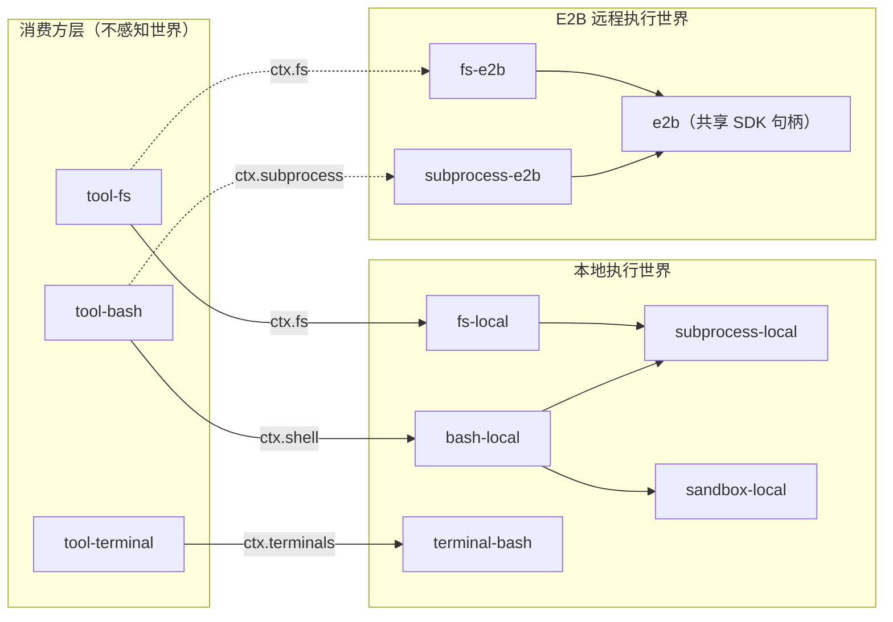
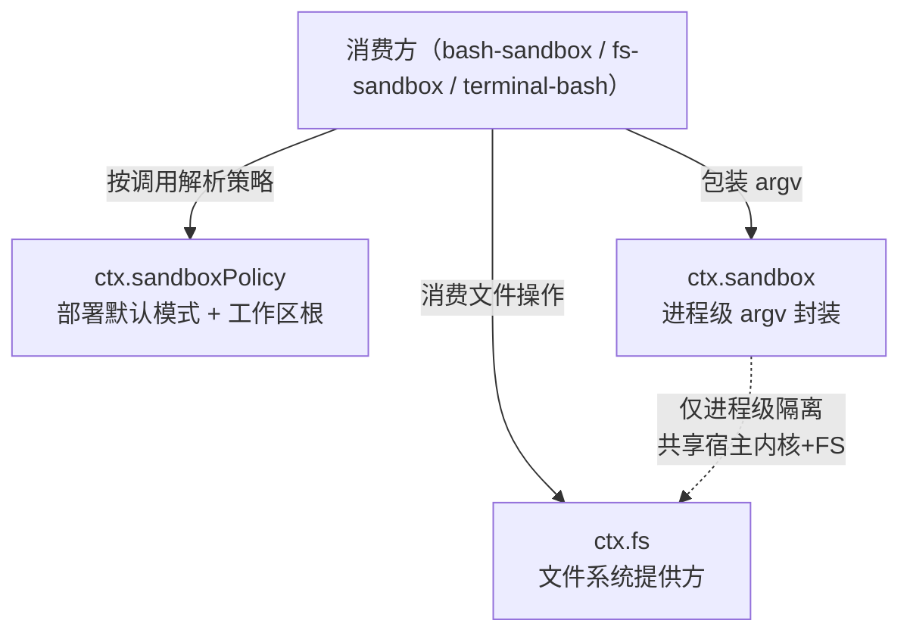

能力接缝（Capability Seam）是 DeepSeek Harness 可扩展性体系的结构骨架。它定义了一种三角色契约——**Service Definition**（声明接口）、**Service Provider**（实现接口）、**Consumer**（消费接口）——使得整个产品能在不修改消费方的前提下，通过替换单个提供方来改变运行时行为。本页从第一性原理出发，拆解 seam 的角色结构、注册模式、执行世界共享语义，并给出完整的 seam 目录。

## 什么是能力接缝

一个 **seam** 是一种**可替换能力**，严格包含三种角色：

1. **Service Definition（服务定义）** —— 一个拥有自身 `ctx.<key>` 和词汇类型的 Cordis `Service` 子类。它必须是抽象类（如 `ShellExecutor`）或具体注册表（如 `WebRuntime`），绝不是 TypeScript `interface`。这个包定义了术语、错误码和事件类型，但不提供实现。
2. **Service Provider（服务提供方）** —— 一个或多个独立包，各自实现 Service Definition 的抽象方法，以 Cordis 插件形式挂载到树上。
3. **Consumer（消费方）** —— 通过 `ctx.<key>` 查找服务并调用其 API 的包，通常是面向模型的工具（如 `tool-fs` 消费 `ctx.fs`）。

一个包可以合并承担多个角色——例如 `compaction-basic` 既是 `ctx.compaction` 的提供方又是自身的消费方——但**单一角色本身不构成 seam**。只有当添加一个新的提供方就能改变整个产品的行为时，这个能力才是 seam。替换 `ctx.fs` 的提供方从 `fs-local` 切换到 `fs-e2b`，就把文件系统操作整体迁移到远程沙箱，而 `tool-fs` 及其上层管线不需要任何改动。

Sources: [architecture.zh.md](docs/architecture.zh.md#L102-L106), [glossary.zh.md](docs/glossary.zh.md#L7-L9)

## seam 的结构解剖

以下通过文件系统 seam（`ctx.fs`）展示三角色包的代码级形态。

### Service Definition：抽象类 + 词汇 + 事件

`packages/fs/fs/src/index.ts` 定义了 `FileSystem` 抽象类，声明在 Cordis 上下文上：

```typescript
declare module '@deepseek-ai/cordis' {
  interface Context {
    fs: FileSystem
  }
  interface Events {
    'fs/write-intent'(target: FsTarget, actor: object | undefined, next: () => ...): ...
    'fs/edit-intent'(target: FsTarget, actor: object | undefined, next: () => ...): ...
    'fs/observed'(target: FsTarget, observation: FsObservation, actor: object | undefined): void
  }
}

export abstract class FileSystem extends Service {
  constructor(ctx: Context) {
    super(ctx, 'fs')
  }
  abstract resolve(path: string, opts?: {...}): Promise<FsTarget>
  abstract stat(target: FsTarget, signal?: AbortSignal): Promise<FsInfo | undefined>
  abstract readText(target: FsTarget, signal?: AbortSignal): Promise<string>
  abstract writeText(target: FsTarget, content: string, intent?: FsWriteIntent): Promise<FsWriteOutcome>
  // ...
}
```

Service Definition 包拥有 **opaque 类型词汇**（`FsTargetKey`、`FsVersion` 通过 Branded 类型实现，阻止消费方解析内部结构）、**结构化错误码**（`FsErrorCode` 联合类型，使重试 / 权限 / UI 层无需解析消息字符串即可分支），以及 **事件声明**（`fs/write-intent` 等通过 `@mode` 标签标注分发模式）。

Sources: [index.ts](packages/fs/fs/src/index.ts#L44-L106), [types.ts](packages/fs/fs/src/types.ts#L11-L46), [types.ts](packages/fs/fs/src/types.ts#L170-L204)

### Service Provider：实现抽象方法

`packages/fs/fs-local/src/index.ts` 中的 `LocalFileSystem` 继承 `FileSystem` 并实现每个抽象方法：

```typescript
export class LocalFileSystem extends FileSystem {
  static Config: z<Config> = z.object({
    cwd: z.string().default(process.cwd()),
    diffBasisMaxBytes: z.number().default(DEFAULT_DIFF_BASIS_MAX_BYTES),
  })
  // 实现 resolve, stat, readText, writeText, editText 等...
}
```

`packages/fs/fs-e2b/src/index.ts` 中的 E2B 后端实现**同一套抽象方法**，但路径解析、文件读取、原子写入全部通过远程 E2B SDK 完成。两个包的导入路径分别替换了同一个 `ctx.fs` 槽位。

Sources: [index.ts](packages/fs/fs-local/src/index.ts#L58-L80), [index.ts](packages/fs/fs-e2b/src/index.ts#L1-L28)

### Consumer：通过 ctx 键调用

`packages/fs/tool-fs` 通过 `ctx.fs` 调用服务，不导入任何提供方包。这意味着替换提供方对消费方完全透明。

Sources: [architecture.zh.md](docs/architecture.zh.md#L121-L122)

## 两种注册模式

并非所有 seam 采用相同的提供方注册策略。体系内存在两种截然不同的模式：

| 维度 | 单槽模式（Single-Slot） | 多提供方模式（Multi-Provider） |
|---|---|---|
| 典型 seam | `ctx.fs`、`ctx.shell`、`ctx.sandbox`、`ctx.subprocess` | `ctx.llm`、`ctx.subagents`、`ctx.web` |
| 提供方数量 | 每个上下文**恰好一个** | 每个上下文可注册**多个**，按名称寻址 |
| 重复注册行为 | Cordis 抛出 duplicate-service 异常 | 注册表拒绝重复 id |
| 提供方选择时机 | 组合时确定（挂载哪个包即决定） | 运行时按名称或配置选择 |
| 适用场景 | 执行世界绑定型（fs/shell/sandbox 共享同一世界） | 策略选择型（LLM 路由、Web 搜索引擎切换） |

**单槽模式**的核心约束是：加载第二个提供方会直接抛出异常。`ShellExecutor` 的 JSDoc 明确记录了这一点：

> "one implementation per context; loading a second throws, which is cordis' standard duplicate-service behavior"

Sources: [index.ts](packages/shell/shell/src/index.ts#L46-L64), [index.ts](packages/subprocess/subprocess/src/index.ts#L74-L79)

**多提供方模式**以 `ctx.llm` 为代表。`LlmRuntime` 持有一个 `Map<string, AdapterRegistration>`，每个 adapter 注册时声明一组 provider 路由（如 `['deepseek']`、`['openai']`）。子代理 seam（`ctx.subagents`）采用相同结构，其 JSDoc 明确对比了这两种模式：

> "Unlike the bash seam (one executor per context, second load throws), MULTIPLE providers coexist here: each registers under a unique name and a caller picks one by name."

Web seam（`ctx.web`）在此基础上增加了**执行时提供方解析**语义：不依赖注册顺序，配置的 id 优先，未配置时恰好一个可用提供方自动选中，多个可用则显式抛出 `WEB_PROVIDER_AMBIGUOUS`。

Sources: [index.ts](packages/llm/llm/src/index.ts#L284-L294), [index.ts](packages/subagent/subagent/src/index.ts#L1-L31), [index.ts](packages/web/web/src/index.ts#L62-L94)

## 执行世界共享

seam 架构中最具设计意义的原理是**执行世界共享**：文件系统提供方、子进程提供方和 shell 提供方共享同一个执行世界（execution world）。这意味着把它们指向远程沙箱，也就同时搬迁了 Bash、PTY 和 LSP 能力。

以下 Mermaid 图展示了"本地世界"与"E2B 远程世界"两个完整的提供方组合如何通过相同的 Consumer 层透明切换：



关键设计：`E2BRuntime`（`ctx.e2b`）作为**世界所有者**，持有共享的 E2B SDK 句柄和远程工作目录。`fs-e2b` 和 `subprocess-e2b` 都 await 同一个 `getSandbox()` promise，确保文件系统和进程操作处于同一个 Linux 运行时中。不存在提供方专用的 fork——切换世界只需替换组合树中的提供方包。

Sources: [index.ts](packages/e2b/e2b/src/index.ts#L1-L5), [index.ts](packages/e2b/e2b/src/index.ts#L63-L80), [architecture.zh.md](docs/architecture.zh.md#L106-L107)

## 沙箱封装的分层边界

沙箱能力不是单一 seam 而是三个协同的 seam 的组合，各自负责不同层面的封装：



`ctx.sandbox` 的 `SandboxProvider.confine()` 接收调用方即将 spawn 的确切 argv，返回一个包装后的 argv（如 `[bwrap, --ro-bind, /, /, ...]`）。它的设计注释明确划定了边界：

> "Containers, microVMs, and remote execution replace the surrounding capability seam instead; this service shares the host kernel and filesystem."

`ctx.fs` 的沙箱变体 `SandboxedFileSystem` **继承了 `LocalFileSystem` 的全部文本存储机制**，仅在两个 mutation 方法上添加 per-call 的路径策略围栏。它的注释阐述了这个设计选择：

> "The fence is a policy check in TRUSTED code over a MODEL-CONTROLLED path, NOT a kernel boundary"

这种分层意味着：内核级隔离（沙箱进程）属于 `ctx.sandbox`，文件路径围栏属于 `ctx.fs` 的沙箱变体，而策略默认值（模式 + 工作区根目录）统一归 `ctx.sandboxPolicy` 管理。三个 seam 通过 `SandboxExecutionPolicy` 结构体按调用传递，两个消费方可以在同一时刻以不同策略运行（例如 bash 以 `read-only` 运行，而受限的子 agent 需要写入其状态目录）。

Sources: [index.ts](packages/sandbox/sandbox/src/index.ts#L1-L9), [index.ts](packages/sandbox/sandbox/src/index.ts#L62-L176), [index.ts](packages/fs/fs-sandbox/src/index.ts#L1-L31), [index.ts](packages/fs/fs-sandbox/src/index.ts#L52-L60)

## 完整 seam 目录

下表列出体系中所有被标记为 `seam` 角色的服务。分类逻辑维护在 `scripts/gen-doc-graphs.ts` 的 `SERVICE_ROLES` 常量中，由 Cordis 声明合并自动发现，并设有完整性守卫。

| `ctx` 键 | Service Definition 包 | 提供方包 | 消费方 | 注册模式 |
|---|---|---|---|---|
| `ctx.fs` | `fs` | `fs-local`、`fs-sandbox`、`fs-e2b` | `tool-fs` | 单槽 |
| `ctx.shell` | `shell` | `bash-local`、`bash-sandbox`、`pwsh-local` | `tool-bash`、`tool-pwsh`、`hooks-claude-code`、`hooks-codex` | 单槽 |
| `ctx.subprocess` | `subprocess` | `subprocess-local`、`subprocess-e2b` | `bash-local`、`bash-sandbox`、`terminal-bash`、`lsp-stdio`、`subagent-acp` 等 | 单槽 |
| `ctx.sandbox` | `sandbox` | `sandbox-local` | `bash-sandbox`、`terminal-bash` | 单槽 |
| `ctx.terminals` | `terminal` | `terminal-bash` | `tool-terminal` | 单槽 |
| `ctx.llm` | `llm` | `llm-deepseek`、`llm-pi-ai`、`llm-replay` | `agent-loop`、`compaction-basic` | 多提供方 |
| `ctx.web` | `web` | `web-search-exa`、`web-search-perplexity`、`web-search-deepseek`、`web-fetch-http` | `tool-web` | 多提供方 |
| `ctx.subagents` | `subagent` | `subagent-spawn-in-process`、`subagent-fork-in-process`、`subagent-acp`、`subagent-codex`、`subagent-claude-code`、`subagent-dsh-sdk` | `tool-subagent`、`tool-subagent-control`、`tool-ralph` | 多提供方 |
| `ctx.compaction` | `compaction` | `compaction-basic` | `compaction-basic`（自消费） | 单槽 |
| `ctx.sessionPersistence` | `session-persistence` | `session-persistence-jsonl`、`session-persistence-sqlite` | `agent-loop`、`tool-bash`、`hooks-claude-code` 等 | 单槽 |
| `ctx.sessionQuery` | `session-query` | `session-query-sqlite` | `session-reference`、`tool-session-query` | 单槽 |
| `ctx.sessionTitle` | `session-title` | `session-title-first-prompt-llm`、`session-title-all-prompts-llm` | — | 单槽 |
| `ctx.settings` | `settings` | `settings-file` | `llm-deepseek`、`llm-pi-ai`、`apiproxy` | 单槽 |
| `ctx.credentials` | `credentials` | `credentials-local` | `llm-deepseek`、`llm-pi-ai`、`apiproxy` | 单槽 |
| `ctx.sessionTelemetry` | `session-telemetry` | `session-telemetry-otel` | — | 单槽 |
| `ctx.storage` | `storage` | `storage-json`、`storage-sqlite` | `storage-domain` | 多提供方 |
| `ctx.attachments` | `attachment` | `attachment-local` | `host-runtime`、`llm-pi-ai` | 单槽 |
| `ctx.userQuestions` | `user-questions` | UI 前端提供 | `tool-ask-user` | 单槽 |
| `ctx.skills` | `skill` | `skill-badge`、`skill-filesystem` | `tool-skill` | 多提供方 |
| `ctx.jobs` | `jobs` | `jobs-local` | `tool-bash`、`tool-terminal`、`tool-subagent`、`tool-jobs` | 单槽 |
| `ctx.web` (search/fetch) | `web` | 同上 | 同上 | 多提供方 |
| `ctx.spillStore` | `spill` | `spill-local` | `spill-policy` | 单槽 |
| `ctx.directoryPicker` | `directory-picker` | `directory-picker-native`、`directory-picker-browse` | `apiproxy` | 单槽 |
| `ctx.workflowEngine` | `workflow` | `workflow-worker-thread` | `tool-workflow`、`tool-ralph` | 单槽 |
| `ctx.lsp` | `lsp` | `lsp-local` | `tool-lsp` | 单槽 |
| `ctx.codeRuntime` | `code-runtime` | `code-runtime-worker` | `tools`（Code Mode） | 单槽 |
| `ctx.approval` | `approval` | `acp` | `tools`、`tool-bash` | 单槽 |

Sources: [gen-doc-graphs.ts](scripts/gen-doc-graphs.ts#L98-L297), [capability-seams.zh.md](docs/capability-seams.zh.md#L414-L472)

## 与 core 服务的区别

seam 与 core 服务的根本区别在于**是否存在可替换的实现**。`ctx.tools`（工具注册表）被标记为 `core`，因为它不存在替代实现——所有包都向**同一个**注册表实例贡献工具，而不是提供不同的注册表后端。同样，`ctx.sessions`（会话存储）、`ctx.systemPrompt`（提示词组装）、`ctx.agents`（Agent 句柄注册表）都是 core 服务。

判断一个服务是 seam 还是 core 的实用规则：**如果移除所有实现包只保留 Service Definition 包，消费方会编译通过但运行时报"无提供方"——这是 seam。如果 Service Definition 包自身就是完整实现——这是 core。**

第三种角色标记为 `bundle`，代表组合包：`ctx.agentLoop` 是唯一的具体循环驱动器，扩展包依赖 `dsh-agent` 的事件和服务而不依赖此包。

Sources: [gen-doc-graphs.ts](scripts/gen-doc-graphs.ts#L264-L271), [architecture.zh.md](docs/architecture.zh.md#L44-L51)

## 事件作为 seam 的策略扩展点

seam 不仅通过提供方替换实现可扩展性，还通过**类型化事件**为已有提供方叠加策略层。以 `ctx.fs` 为例，Service Definition 包声明了三个事件：

| 事件 | 分发模式 | 语义 |
|---|---|---|
| `fs/write-intent` | `waterfall` | 单决策：第一个返回 intent 的监听器赢得写入意图决策 |
| `fs/edit-intent` | `waterfall` | 单决策：第一个返回版本守卫的监听器赢得编辑决策 |
| `fs/observed` | `emit` | 记录型：同步记录权威观察结果（present/absent） |

这些事件不需要修改提供方或消费方即可叠加策略。例如 `fs-observation-policy` 包监听 `fs/observed` 事件来记录已观察状态，而 `tool-fs` 在写入前通过 `fs/write-intent` 事件获取策略层的写入意图决策。架构图中以虚线标注了这一关系：`svc_fs -. event gate .-> pkg_fs_observation_policy`。

Sources: [index.ts](packages/fs/fs/src/index.ts#L49-L78), [cordis-primer.zh.md](docs/cordis-primer.zh.md#L17-L27), [architecture.zh.md](docs/architecture.zh.md#L61-L62)

## 设计新 seam 的约束

当判断一项新能力是否应该成为 seam 时，以下约束源于源码注释和架构文档中的显式规范：

**opaque 身份原则。** Service Definition 包必须拥有不透明类型词汇（通过 Branded 实现）。`FsTargetKey` 和 `FsVersion` 的 JSDoc 明确要求消费方"MUST NOT parse it or assume it is a local absolute path"。提供方负责制造这些 token，消费方只能接收和回传。这使得本地后端使用 realpath 字符串、远程后端使用 URI 或 revision id 时，消费方代码完全不感知差异。

Sources: [types.ts](packages/fs/fs/src/types.ts#L11-L46)

**错误码归属。** Service Definition 包拥有错误码词汇表，所有提供方和策略层抛出相同的结构化代码。`FsError` 继承 `HarnessError`，携带 `FsErrorCode` 联合类型。这确保重试层、权限层和 UI 层可以基于 `{ name, code }` 分支决策而无需解析人类可读消息。

Sources: [types.ts](packages/fs/fs/src/types.ts#L170-L204)

**单上下文单服务实例。** Cordis 的 `Service` 基类保证每个 `ctx` 键对应恰好一个服务实例。单槽 seam 的第二提供方挂载会直接抛出 duplicate-service 异常。这是设计意图而非限制——它防止两个文件系统或两个 shell 后端在同一执行世界中竞争。

Sources: [index.ts](packages/shell/shell/src/index.ts#L46-L64)

**不可逃逸的契约。** LSP seam 的注释清晰表达了这一原则："the seam offers no protocol escape hatch, so a backend translates into the normalized request and result"。如果一个 seam 暴露了后端专用协议，消费方就会耦合到具体实现，seam 就不再是可替换的。

Sources: [capability-seams.zh.md](docs/capability-seams.zh.md#L468)

**世界一致性。** 执行世界绑定型 seam（fs、subprocess、shell）的提供方必须共享同一世界的可执行文件路径解析。`SubprocessRuntime.resolveExecutable()` 的注释指出："Executable paths belong to one execution world shared with the mounted filesystem provider"。这保证 `ctx.fs.processPath(target)` 返回的路径能被 `ctx.subprocess.spawn()` 在同一世界中打开。

Sources: [index.ts](packages/subprocess/subprocess/src/index.ts#L80-L88), [index.ts](packages/fs/fs/src/index.ts#L119-L126)

## 从 seam 到行为变更

seam 的价值在于**组合级别的一行替换改变产品级行为**。以下场景展示了替换提供方的实际效果：

| 替换操作 | 行为变更 |
|---|---|
| `fs-local` → `fs-e2b` + `subprocess-local` → `subprocess-e2b` | 全部文件和命令操作迁移到远程 Linux 沙箱 |
| `fs-local` → `fs-sandbox`（+ 挂载 `sandbox-policy`） | 文件系统写入获得路径级围栏保护，拒绝工作区外写入 |
| `bash-local` → `bash-sandbox`（+ 挂载 `sandbox` + `sandbox-policy`） | Bash 命令在内核级沙箱中执行，argv 被 Landlock/Seatbelt/bwrap 包装 |
| `session-persistence-jsonl` → `session-persistence-sqlite` | 会话日志存储后端从 JSONL 文件切换到 SQLite 数据库 |
| `llm-deepseek` → `llm-pi-ai` | 模型适配器从直接 fetch DeepSeek API 切换到 OpenAI 兼容 SDK |
| 注册 `web-search-exa`（仅此一个可用） | Web 搜索能力自动激活，无需配置 `searchProvider` |

每个替换只需修改组合树中的包列表，面向模型的工具层和 agent loop 完全不变。

Sources: [architecture.zh.md](docs/architecture.zh.md#L103-L107), [index.ts](packages/web/web/src/index.ts#L171-L194)

## 继续阅读

能力接缝原理是理解后续主题的基础。文件系统与会话沙箱的具体实现细节请参阅 [文件系统与会话沙箱](16-wen-jian-xi-tong-yu-hui-hua-sha-xiang)；子代理如何利用多提供方注册表实现委托请参阅 [子代理委托机制](17-zi-dai-li-wei-tuo-ji-zhi)；LLM 适配器的注册与流式协议请参阅 [LLM 流式协议与适配器](18-llm-liu-shi-xie-yi-yu-gua-pei-qi)。如需在代码层面实践扩展，[扩展开发实战手册](21-kuo-zhan-kai-fa-shi-zhan-shou-ce)将功能映射到具体能力并索引分步指南。