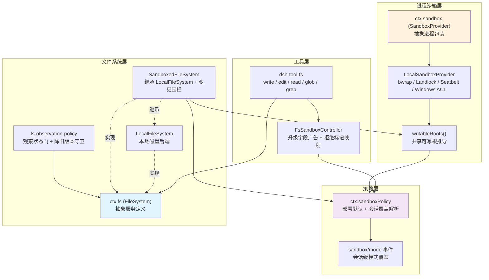
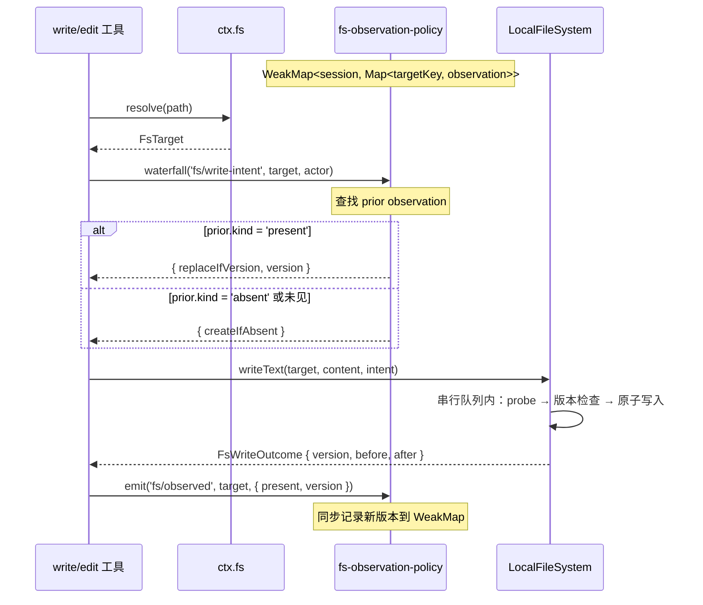
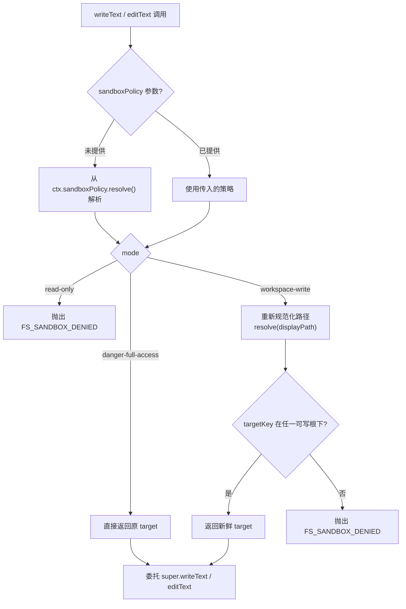
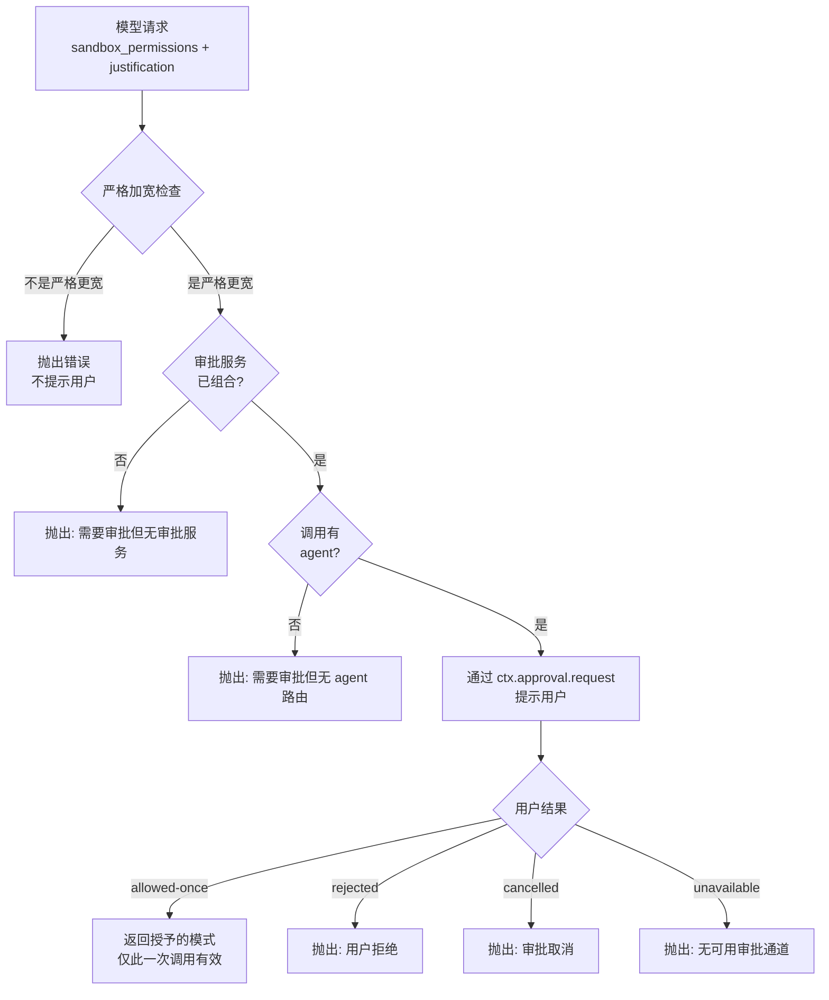

DeepSeek Harness 将文件系统操作与进程执行拆分为两个正交但共享同一安全词汇的能力接缝（capability seams）。`ctx.fs` 抽象服务定义了文件读写的提供者契约，`ctx.sandbox` 抽象服务定义了子进程的内核级文件策略包装。两者通过共享的 `SandboxMode` 词汇、共享的 `writableRoots` 根列表推导，以及共享的 `ctx.sandboxPolicy` 策略解析服务，保证了"写入工具能写的地方 bash 也一定能写、反之亦然"这一核心不变量。本页从第一性原理出发，解析文件系统服务定义、沙箱策略解析、沙箱本地后端的平台差异、以及模型可见的升级（escalation）流程如何在这一架构中协同工作。

Sources: [index.ts](packages/fs/fs/src/index.ts#L1-L253), [index.ts](packages/sandbox/sandbox/src/index.ts#L1-L179)

## 架构总览

整个文件系统与会话沙箱由 **四个层次** 叠加构成，每一层都通过 Cordis 插件体系独立可替换：



**核心设计决策**是让文件系统服务定义自身不包含任何安全逻辑。`FileSystem` 抽象类只定义 `resolve → stat → read/write/edit` 的操作原语；沙箱围栏由 `SandboxedFileSystem` 在继承 `LocalFileSystem` 后覆写 `writeText`/`editText` 两个变异操作来注入。这种设计使得从无沙箱到有沙箱的切换只需替换一个 Cordis 插件，工具层无需任何改动。

Sources: [index.ts](packages/fs/fs-sandbox/src/index.ts#L1-L31), [index.ts](packages/fs/fs/src/index.ts#L80-L106)

## 文件系统服务定义：`ctx.fs`

### 不透明目标身份

文件系统接缝的核心设计是 **不透明目标身份**（opaque target identity）。模型或插件提供的路径字符串不能直接用于后续操作，必须先通过 `resolve()` 解析为一个 `FsTarget`——一个包含 `targetKey`（品牌化的不透明字符串）和 `displayPath`（用于展示）的结构体。

| 属性 | 类型 | 角色 | 可否被消费者解析 |
|------|------|------|------------------|
| `targetKey` | `Branded<'FsTargetKey'>` | 陈旧守卫与目标查找的不透明键 | **否** — 消费者绝不解析或假设它是本地绝对路径 |
| `displayPath` | `string` | 面向模型/UI 的输出路径 | 是 — 可用于展示，但不可用作操作输入 |

这种设计的深层原因在于：本地后端的 `targetKey` 恰好是 `realpath` 后的绝对路径，但远程后端可能使用工作区 URI 或文件 ID。如果消费者解析了 `targetKey`，就会与特定后端的实现细节耦合。因此，跨能力坐标——子进程能打开的绝对路径（`processPath`）、文件 URI（`fileUrl`）、包含关系（`contains`）——全部由提供者自身的方法提供，消费者不直接解析键。

Sources: [types.ts](packages/fs/fs/src/types.ts#L11-L68), [index.ts](packages/fs/fs/src/index.ts#L107-L168)

### 版本令牌与原子变异

每次 `stat` 返回的 `FsInfo` 携带一个不透明的 `FsVersion` 令牌——后端从高分辨率 stat 标识字段派生的"新鲜度标记"。观察策略插件记录这个令牌，在后续的写入或编辑操作中用作陈旧守卫（stale guard）。

本地后端通过 **per-targetKey 串行化队列** 实现"读 → 守卫 → 写"临界区的原子性：同一个 `targetKey` 上的并发写入操作按 FIFO 顺序排队执行，一个写入成功后，其余的会看到新版本并以 `FS_STALE_VERSION` 拒绝。这种机制确保了并发写入的确定性顺序。

写入守卫有两种形式：

| 守卫类型 | 语义 | 拒绝条件 | 错误码 |
|----------|------|----------|--------|
| `createIfAbsent` | 仅在目标不存在时创建 | 目标已存在 | `FS_NOT_OBSERVED` |
| `replaceIfVersion` | 仅在版本匹配时替换 | 目标不存在或版本不匹配 | `FS_STALE_VERSION` |
| 省略守卫 | 无条件创建或覆盖 | 无 | — |

Sources: [types.ts](packages/fs/fs/src/types.ts#L117-L168), [index.ts](packages/fs/fs-local/src/index.ts#L72-L104)

### 观察策略：事件驱动的状态门

`fs-observation-policy` 是一个 **纯事件插件**——它不注册任何服务，而是监听 `dsh-fs` 声明的三个事件来维护一个 `WeakMap<session, Map<targetKey, FsObservation>>` 状态结构。



`fs/write-intent` 和 `fs/edit-intent` 是 **单槽瀑布决策**（single-slot waterfall decisions）：策略插件占据这个决策槽且不调用 `next()`，意味着只有一个监听器能决定写入意图。如果没有策略插件，默认瀑布返回 `undefined`（无条件创建或覆盖）。

观察状态的 `owner` 是通过不透明事件 `actor` 推导出来的——通常就是活动 agent 会话。`WeakMap` 的弱引用特性确保了会话被回收时，其观察状态也会被垃圾回收释放。

Sources: [index.ts](packages/fs/fs-observation-policy/src/index.ts#L21-L131), [index.ts](packages/fs/fs/src/index.ts#L44-L78)

## 沙箱模式词汇

### 三级文件策略

整个沙箱体系建立在一个精确的三级文件策略词汇之上：

| 模式 | 允许的写入 | 进程沙箱语义 | 文件系统围栏语义 |
|------|-----------|-------------|-----------------|
| **`read-only`** | 无（仅 `/dev/null` 等必要汇） | 拒绝所有文件写入 | `writeText`/`editText` 抛出 `FS_SANDBOX_DENIED` |
| **`workspace-write`** | 工作区根 + 平台临时目录 | 允许写入白名单内的根目录 | 规范化后进行包含检查，不包含则拒绝 |
| **`danger-full-access`** | 无限制 | 绕过围栏，消费者直接 spawn 原始 argv | 直接放行，不做包含检查 |

关键设计约束是 **只有前两种模式才能发送给沙箱提供者**。`danger-full-access` 的消费者根本不调用 `ctx.sandbox`——它直接 spawn 自己的原始 argv，因此 `SandboxPolicy` 的 `mode` 字段是 `ConfinedSandboxMode`（排除了 `danger-full-access` 的联合类型）。

Sources: [index.ts](packages/sandbox/sandbox/src/index.ts#L23-L73)

### 策略解析优先级

`ctx.sandboxPolicy.resolve()` 是所有强制执行能力的 **唯一策略入口**。它的解析遵循严格的三级优先级：

```
approved mode (已批准的升级)
    > session override (会话日志中最后的 sandbox/mode 事件)
        > deployment default (部署配置的默认模式)
```

会话级覆盖通过事件溯源实现——运行时切换会话模式不是修改外部配置，而是在会话日志中追加一个 `sandbox/mode` 事件。`effectiveSandboxMode` 函数从后往前扫描事件数组，返回最后一个 `sandbox/mode` 事件的模式。这种设计的优势是：覆盖通过重放（replay）即可重建，两个会话永远看不到彼此的状态，且无需外部配置存储。

部署默认模式是 **`read-only`**——这是故障安全（fail-safe）默认值。一个希望工作区可写的部署需要显式配置 `mode: 'workspace-write'`。

Sources: [index.ts](packages/sandbox/sandbox-policy/src/index.ts#L67-L152), [session-mode.ts](packages/sandbox/sandbox-policy/src/session-mode.ts#L41-L71)

### 按调用携带的策略

策略不是固定在提供者上的——它 **按每次能力调用** 解析和携带。这一设计允许两个消费者在同一时刻以不同的边界约束同一个提供者：例如 bash 在 `read-only` 模式下运行，而一个受约束的子代理需要其状态目录可写。`SandboxExecutionPolicy` 携带的字段包括：

| 字段 | 类型 | 用途 |
|------|------|------|
| `mode` | `SandboxMode` | 文件效果模式 |
| `workspaceRoot` | `string` | `workspace-write` 模式下的工作区根绝对路径 |
| `sessionId` | `SessionId?` | 会话的不透明标识——后端以此为键管理每会话状态 |

工具层在每次执行前解析策略。会话的不可变 cwd 成为工作区写入边界；部署配置的根是无会话调用的回退值。

Sources: [index.ts](packages/sandbox/sandbox/src/index.ts#L38-L52), [index.ts](packages/sandbox/sandbox-policy/src/index.ts#L126-L142)

## 文件系统沙箱围栏

### SandboxedFileSystem：继承而非组合

`SandboxedFileSystem` 继承 `LocalFileSystem` 而非包装它，这意味着所有文本存储机制——resolve、stat、读/流、列表、原子写入和读取-匹配-写入编辑临界区——完全是本地实现的原版。沙箱包只添加 **per-call 策略围栏**（policy fence），且仅覆盖两个变异操作。读取操作原封不动地通过：每种模式都允许读取。

围栏的核心方法是 `checkedTarget`，它在变异执行前对目标进行策略检查，并返回检查后的 **新鲜目标**，确保被检查的身份就是被变异的身份（消除 check-here-write-there 的 TOCTOU 竞态）：



`workspace-write` 模式的包含检查会 **重新规范化路径**——`resolve` 会对最深层的已存在祖先执行 realpath，反映出并发交换的符号链接。这种重新规范化是缩小 TOCTOU 窗口的关键防御措施。

Sources: [index.ts](packages/fs/fs-sandbox/src/index.ts#L59-L149)

### 路径包含机制

路径包含检查（`isPathUnder`）采用 **双路径策略**：词法快速路径 + 文件系统身份保守回退。

词法快速路径处理正常的规范化拼写——简单的前缀比较加上分隔符确保（`/foo` 不会匹配 `/foobar`）。当词法比较失败时（例如 Windows 8.3 短名与长名混用、大小写差异），回退路径会遍历目标的已存在祖先，通过 `BigIntStats` 比较 `dev` 和 `ino` 来判断文件系统级别的身份等价。这种设计在不过度放宽包含性（弱化为文本近似匹配）的前提下，正确识别了 Windows 的长名/短名别名和大小写差异。

Sources: [containment.ts](packages/fs/fs-sandbox/src/containment.ts#L1-L77)

### 共享可写根

文件系统围栏和进程沙箱共享同一个 `writableRoots()` 函数来推导 `workspace-write` 模式的可写根列表。这是整个沙箱架构的一个 **关键不变量**——确保"写入工具不能写 `/tmp` 但 bash 可以"这种不对称永远不会出现：

| 可写根来源 | 是否始终包含 | 规范化处理 |
|-----------|-------------|-----------|
| `policy.workspaceRoot` | 是 | `realpathSync.native()` 规范化 |
| `/tmp` | 是（仅 `workspace-write`） | 规范化（macOS 上解析为 `/private/tmp`） |
| `os.tmpdir()` | 是（仅 `workspace-write`） | 规范化（用户级临时目录，mkstemp 工具实际使用） |

三者去重后形成唯一的可写根允许列表。`read-only` 模式返回空数组。

Sources: [roots.ts](packages/sandbox/sandbox/src/roots.ts#L43-L55)

## 进程沙箱后端

### 平台运行者链

`LocalSandboxProvider` 按平台选择运行者链，每条链内的候选者按优先顺序进行功能探测：

| 平台 | 运行者链 | 探测策略 | 执行完备性 |
|------|---------|----------|-----------|
| **Linux** | bwrap → Landlock | 两候选者，功能探测仲裁 | bwrap: `full`；Landlock: 按探测结果 `full` 或 `partial` |
| **macOS** | Seatbelt | 单候选者，无需探测 | `full` |
| **Windows** | ACL restricted-token | 单候选者，无需探测 | **`partial`** — 受限于 `WRITE_RESTRICTED` 的固有边界 |

关键原则是 **失败即闭合**（fail-closed）：当没有可用的后端时，`confine()` 抛出 `SandboxUnavailableError`（代码 `SANDBOX_UNAVAILABLE`），拒绝以无约束方式运行命令。静默的无约束直通是被禁止的。

Sources: [index.ts](packages/sandbox/sandbox-local/src/index.ts#L59-L187), [index.ts](packages/sandbox/sandbox/src/index.ts#L118-L144)

### 各平台围栏机制

三个平台的围栏机制在技术路线上完全不同，但都表达同一个 `workspace-write` = "工作区根 + 临时区域"语义：

**bubblewrap (Linux 首选)**：通过 mount 命名空间重新映射文件系统。`--ro-bind / /` 将整个根文件系统以只读方式绑定；`--bind workspaceRoot workspaceRoot` 将工作区目录以读写方式绑定；`--tmpfs /tmp` 提供一个临时的内存文件系统。

**Landlock (Linux 备选)**：利用内核的 Landlock 安全模块，通过 `landlock-run` 原生插件设置文件访问规则。授予只读 `/` 和读写的 `/dev/null`、`/tmp`、`workspaceRoot`。较旧的 Landlock ABI 可能无法覆盖所有承诺的文件效果——后端会在 stderr 上自报告 partial enforcement。

**Seatbelt (macOS)**：通过 `sandbox-exec` 应用 SBPL（Seatbelt Policy Language）配置文件。`(deny file-write*)` 默认拒绝所有写入，然后 `(allow file-write* (subpath ...))` 为每个可写根开放子树。

**Windows ACL (Windows)**：使用 `WRITE_RESTRICTED` 令牌 + DACL 写入 ACE 授权。工作区 SID 是 **per-workspace** 确定性派生的（同一工作区的每次复用都命中 ACE 跳过缓存）；临时目录 SID 是 **per-session** 随机生成的（同工作区的兄弟会话无法进入彼此的临时树）。由于 `WRITE_RESTRICTED` 令牌的固有约束（需要保留 Everyone 在限制列表中以确保进程初始化成功），以及 NTFS 硬链接的别名问题，此后端报告 `partial` 执行完备性。

Sources: [profiles.ts](packages/sandbox/sandbox-local/src/profiles.ts#L1-L59), [index.ts](packages/sandbox/sandbox-windows-acl/src/index.ts#L1-L101)

### 拒绝签名与运行者故障规则

`ConfinedArgv` 返回两组正交的 stderr 分类器，让消费者在命令执行失败时正确区分"围栏起作用了，拒绝了文件效果"与"运行者本身启动失败"：

| 后端 | 拒绝签名 | 运行者故障签名 | 退出码门控 |
|------|---------|---------------|-----------|
| bwrap | `read-only file system` | `bwrap: ` | 无 |
| Landlock | `permission denied` | `landlock-run: ` (exit 125) | 125 |
| Seatbelt | `operation not permitted` | `sandbox-exec: ` | 无 |
| Windows ACL | `access is denied`, `access to the path`, `permission denied` | `windows-acl-run: ` (exit 127) | 127 |

消费者在匹配拒绝签名之前，必须先确认存在匹配的致命 stderr 行（在信息性行排除之后）和任意的规则特定退出码门控。仅靠退出状态永远不能证明运行者故障。

Sources: [index.ts](packages/sandbox/sandbox-local/src/index.ts#L200-L240)

## 升级流程：当沙箱拒绝时

### 严格加宽梯子

当沙箱拒绝了一次操作，模型可以通过 `sandbox_permissions` + `justification` 两个字段请求升级到更宽的模式。升级遵循 **严格加宽**（strict widening）规则——只能在 WIDER_MODES 表中允许的方向上升级：

| 当前有效模式 | 可升级到 |
|-------------|---------|
| `read-only` | `workspace-write`, `danger-full-access` |
| `workspace-write` | `danger-full-access` |

严格加宽检查在 **执行时** 进行，而非烘焙到工具 schema 中。Schema 的枚举只是关闭的目标词汇（`ESCALATION_TARGETS = ['workspace-write', 'danger-full-access']`），而有效模式是每次调用的真实状态。这种分离确保了 schema 全局一致性的同时，严格加宽仍然是 per-call 真理。

Sources: [escalation.ts](packages/sandbox/sandbox/src/escalation.ts#L28-L41), [escalation.ts](packages/sandbox/sandbox/src/escalation.ts#L157-L189)

### 有序的失败闭合审批序列

`approveEscalation` 在任何执行之前完成一个有序的失败闭合序列，两个强制执行家族（bash 和 fs）共享这套流程：



批准的升级模式仅对 **发起请求的那一次调用** 有效。下一次调用必须重新解析自己的策略。升级请求文本中自包含了审计信息——审批服务记录的 `reason` 是 `escalate sandbox to ${mode}: ${justification}`，确保审计轨迹完整自包含。

Sources: [escalation.ts](packages/sandbox/sandbox/src/escalation.ts#L51-L189)

### FsSandboxController：工具层的升级协调

`FsSandboxController` 在插件应用时基于 `ctx.fs.sandboxMode`（后端是否执行围栏的能力事实）构建一次。它负责三件事：

1. **广告门控**：当 `sandboxMode === undefined`（未挂载围栏后端）时，`escalationModes` 为空数组，升级字段不会出现在工具 schema 中——验证器会在 `execute` 之前就拒绝它们。当后端围栏时，枚举展示完整的 `ESCALATION_TARGETS`。

2. **每次调用策略解析**：`resolvePolicy` 先验证升级参数配对（`sandbox_permissions` 和 `justification` 必须同现），然后解析会话站立策略，最后如有升级请求，通过 `approveEscalation` 获取批准模式并覆盖到策略上。

3. **拒绝标记映射**：当 `writeText`/`editText` 抛出 `FS_SANDBOX_DENIED` 时，将错误文本替换为共享的 `[sandbox: file access denied under ${mode} mode]` 标记加上升级提示行。这使得模型 **在 bash 和 fs 中以完全相同的方式识别策略拒绝**，无论拒绝来自内核还是文件系统围栏。

Sources: [sandbox.ts](packages/fs/tool-fs/src/sandbox.ts#L37-L131)

## 会话工作目录与会话隔离

### 会话 CWD 作为工作区边界

文件系统工具解析相对路径时，使用调用 agent 的 **per-session 工作目录**（`exec.agent.session.header.cwd`），而非服务器的启动目录。这确保了每个会话的 `read`/`write`/`edit` 操作都作用于该会话自己的工作区，与 `dsh-tool-bash` 默认将 bash `workdir` 设为会话 cwd 的做法保持镜像对称。

当相对路径或 cwd 中存在父级遍历段（`..`）时，CWD 会通过 `canonicalPath()` 进行规范化——因为遍历一个符号链接 cwd 会使其文件系统身份可观察，只有规范化路径才能正确处理这种情况。

沙箱策略中的 `workspaceRoot` 取自同一个会话 cwd（通过 `ctx.sandboxPolicy.resolve({ session })` 解析），使得"工具解析路径时的工作区"与"沙箱围栏检查的工作区"是 **同一个绝对路径**。

Sources: [session-cwd.ts](packages/fs/tool-fs/src/session-cwd.ts#L1-L47)

### 系统提示中的策略上下文

`SandboxPolicyService` 在构造时注册了一个系统提示上下文贡献器（`sandbox:policy`，顺序 110），它将当前解析的策略渲染为模型可读的文本。例如，`workspace-write` 模式下会注入：

> Current DSH file policy: workspace-write. Any available operation enforced by the DSH file sandbox may modify files under the session workspace: "/path/to/workspace". Some platform temporary areas may also be writable.

这个上下文是 **缓存安全的运行时快照** 的一部分——agent 循环在每个请求前记录它，所以重放时能重建相同的模式和根，而无需重写稳定的系统提示。

Sources: [index.ts](packages/sandbox/sandbox-policy/src/index.ts#L37-L52), [index.ts](packages/sandbox/sandbox-policy/src/index.ts#L112-L123)

## 包关系总览

| 包名 | 角色 | 导出/注册 |
|------|------|----------|
| `dsh-fs` | 文件系统服务定义 | `ctx.fs` (abstract), `FsError`, 类型词汇 |
| `dsh-fs-local` | 本地磁盘后端 | `LocalFileSystem` (注册为 `ctx.fs`) |
| `dsh-fs-sandbox` | 沙箱围栏后端 | `SandboxedFileSystem` (替换 `ctx.fs`) |
| `dsh-fs-observation-policy` | 观察策略插件 | 纯事件插件，无服务 |
| `dsh-tool-fs` | 模型面向的 fs 工具 | `read`, `write`, `edit` 工具 + `FsSandboxController` |
| `dsh-tool-fs-search` | 搜索工具 | `glob`, `grep` |
| `dsh-sandbox` | 进程沙箱服务定义 | `ctx.sandbox` (abstract), `SandboxMode`, `writableRoots`, 升级词汇 |
| `dsh-sandbox-policy` | 策略解析服务 | `ctx.sandboxPolicy`, `SandboxPolicyService` |
| `dsh-sandbox-local` | 本地沙箱后端 | `LocalSandboxProvider` (注册为 `ctx.sandbox`) |
| `dsh-sandbox-windows-acl` | Windows ACL 后端 | `AclSandbox`, SID 工具 |
| `dsh-workspace` | 工作区注册表 | `ctx.workspaceRegistry` |

Sources: [index.ts](packages/fs/fs/src/index.ts#L44-L47), [index.ts](packages/sandbox/sandbox/src/index.ts#L146-L151), [index.ts](packages/sandbox/sandbox-policy/src/index.ts#L54-L58), [index.ts](packages/workspace/workspace/src/index.ts#L67-L71)

## 设计约束与威胁模型

### 围栏不是内核边界

`SandboxedFileSystem` 的围栏是 **可信代码中针对模型控制路径的策略检查**，而非内核边界。操作本身是接缝自己的（open、rename），只有目标路径是不可信的，因此规范化后检查包含性就是这一攻击面的完整回答。对不可信 **代码** 的内核级隔离是 `ctx.shell` 的职责（`@deepseek-ai/dsh-bash-sandbox`）。

残留的 TOCTOU 竞态——一个祖先符号链接在包含性复查和系统调用之间被交换——通过在委托前立即重新规范化来缩小，并在当前威胁模型中被接受。

Sources: [index.ts](packages/fs/fs-sandbox/src/index.ts#L8-L19)

### Windows ACL 的已知边界

Windows ACL 后端的 `partial` 执行完备性源于 **`WRITE_RESTRICTED` 令牌的固有约束**：

- **写入受限但读取不受限**：`WRITE_RESTRICTED` 只交集写入访问权限，读取、网络和进程可见性不受约束
- **Everyone 必须在限制列表中**：进程初始化需要 `Everyone` 的隐式权限，因此授予 `Everyone` 写权限的外部对象仍然可写
- **NTFS 硬链接别名**：工作区内被授予写入的文件可通过硬链接到工作区外的路径而被绕过
- **控制台隔离不可用**：子进程共享主机控制台

Sources: [index.ts](packages/sandbox/sandbox-windows-acl/src/index.ts#L1-L41), [index.ts](packages/sandbox/sandbox-local/src/index.ts#L177-L188)

---

理解了文件系统与会话沙箱的架构后，接下来的页面将探讨其他能力接缝如何利用同样的设计原则。[Shell、子进程与终端](19-shell-zi-jin-cheng-yu-zhong-duan) 展示了进程沙箱如何包装 shell 命令并分类拒绝结果；[能力接缝（Capability Seams）原理](15-neng-li-jie-feng-capability-seams-yuan-li) 从更高维度解释了为什么这些接缝被设计为独立可替换的抽象服务；[子代理委托机制](17-zi-dai-li-wei-tuo-ji-zhi) 则展示了子代理如何继承父会话的沙箱策略边界。