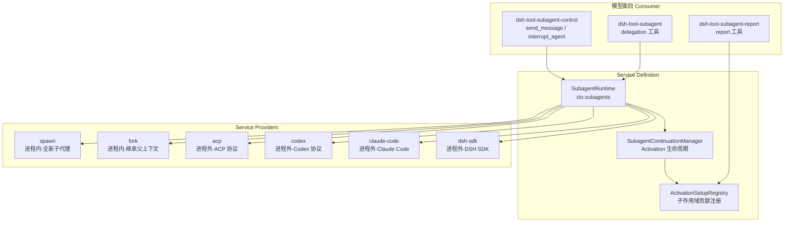
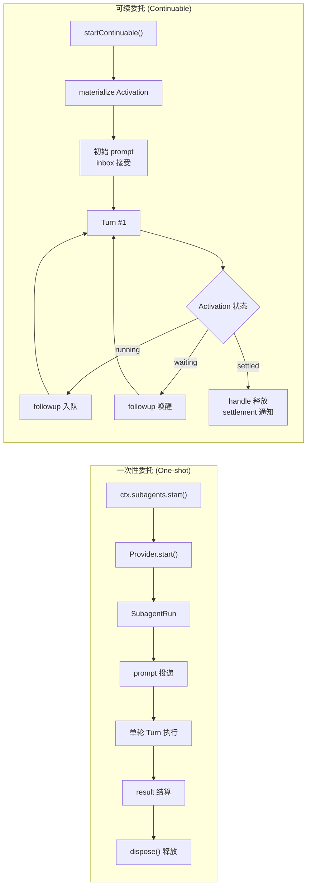
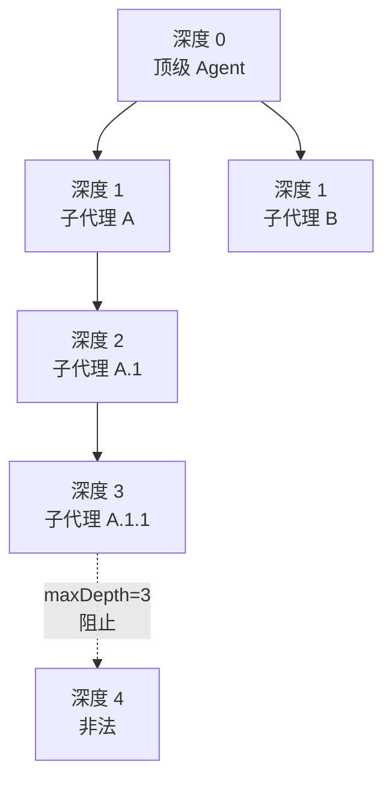

子代理（Subagent）委托机制是 Harness 中最复杂的能力接缝之一：它允许一个正在运行的 Agent 将任务委派给一个**子 Agent**——一个拥有独立会话、独立系统提示、独立上下文窗口的完整 Agent 实例。子代理与父代理之间通过结构化的消息通道交换数据，而非共享内存空间。这种设计使得复杂任务可以被分解为多个并行的、上下文隔离的子任务，从而避免单一会话的上下文溢出，同时保持严格的权限边界和生命周期归属。

本页将系统阐述该机制的架构设计、Provider 注册体系、一次性委托与可续委托两种模式、深度预算与权限继承策略，以及面向模型暴露的工具层。

Sources: [subagent.md](docs/subsystems/subagent.md#L1-L10), [types.ts](packages/subagent/subagent/src/types.ts#L1-L91)

## 架构总览：三角色分离的接缝设计

子代理接缝遵循 Harness 一贯的 **Service Definition → Service Provider → Consumer** 三角色分离模式，但与其他能力接缝（如 bash 只允许单个 Executor）有一个关键区别：**多个 Provider 可以同时共存**。每个 Provider 以唯一名称注册到 `ctx.subagents`，调用方通过名称选择具体的传输后端。



`SubagentRuntime` 作为 Cordis `Service` 暴露在 `ctx.subagents` 上。它的核心职责是：维护 Provider 注册表、在委托前校验能力声明（capability flags）、解析一次性子代理的持久化描述符（descriptor），以及将生命周期事件（`subagent/start`、`subagent/end`）通过**作用域过滤分发**投递给正确的父代理作用域监听器。可续子代理的全部生命周期管理——包括 Activation 创建、冷恢复（cold resume）、子优先销毁（child-first disposal）、settlement 通知——由内部的 `SubagentContinuationManager` 承载。

Sources: [index.ts](packages/subagent/subagent/src/index.ts#L129-L200), [subagent.md](docs/subsystems/subagent.md#L5-L9)

## Provider 注册体系与能力声明

每个 Provider 通过 `ctx.subagents.registerProvider()` 注册，注册是 **effect-scoped** 的，因此 HMR（热模块替换）安全。Provider 的核心契约由 `SubagentProvider` 接口定义，包含四个静态能力标志和一个描述性属性：

| 属性 | 含义 | spawn | fork | ACP/Codex/CC/SDK |
|---|---|---|---|---|
| `outputSchema` | 支持结构化输出捕获 | ✅ | ✅ | ❌ |
| `depthLimit` | 支持递归深度上限 | ✅ | ✅ | ❌ |
| `toolFilter` | 支持子代理工具过滤 | ✅ | ✅ | ❌ |
| `persona` | 支持子代理人格覆盖 | ✅ | ✅ | ❌ |
| `inheritsParentContext` | 子代理继承父对话历史 | ❌ | ✅ | ❌ |

能力声明的设计遵循 Harness 的 **"fail loud, no silent degradation"** 原则：如果一个请求需要某项能力而所选 Provider 不支持，服务会在 `start()` 之前同步拒绝（抛出 `SubagentError('UNSUPPORTED_CAPABILITY')`），而不是接受后静默忽略。进程外 Provider 统一使用 `NO_START_CAPABILITIES`（四个标志全部为 `false`），因为另一个进程中的子代理无法被父进程强制执行这些启动时特性。

Sources: [types.ts](packages/subagent/subagent/src/types.ts#L75-L91), [out-of-process.ts](packages/subagent/subagent/src/out-of-process.ts#L19-L30), [spawn-in-process/src/index.ts](packages/subagent/subagent-spawn-in-process/src/index.ts#L41-L60), [fork-in-process/src/index.ts](packages/subagent/subagent-fork-in-process/src/index.ts#L48-L90)

## 两种委托模式

子代理委托机制区分两种根本不同的执行模式，二者在生命周期归属、消息流、取消语义和持久化方面完全不同。



### 一次性委托（One-shot）

一次性委托是**前台同步阻塞**的委托方式：父代理通过 `SubagentRuntime.start()` 启动子代理，获取一个 `SubagentRun` 句柄，然后通过 `run.result`（一个 `Promise<SubagentResult>`）等待子代理完成其唯一的 Turn。调用方**必须**在收集结果后调用 `run.dispose()` 来取消剩余工作并释放资源。

`SubagentRun` 不是子代理的持久化句柄——它是一次性的前台委托，结果不可中途追加消息。`result` 不会在子代理级别失败时 reject：模型/传输错误会以 `stopReason: 'error'` 正常 resolve，让消费方将其映射为 `isError` 工具结果；只有接缝无法表示为基础架构故障的异常才会导致 reject。

`SubagentStopReason` 是一个**合并可扩展的派生联合类型**——后端可以添加新的变体，消费方应分支处理已知情况并在 `default` 分支中将未知终止原因视为失败。已知变体包括 `completed`（正常完成）、`aborted`（取消）、`error`（模型或传输故障）、`max-tokens`（达到 token 上限）和 `refusal`（拒绝任务）。

Sources: [types.ts](packages/subagent/subagent/src/types.ts#L194-L275), [in-process-driver/src/index.ts](packages/subagent/subagent-in-process-driver/src/index.ts#L102-L234), [tool-subagent/src/index.ts](packages/subagent/tool-subagent/src/index.ts#L157-L197)

### 可续委托（Continuable）与 Activation 生命周期

可续委托创建的是**持久化的子会话**，支持多轮 FIFO 消息交互和冷恢复。其核心概念是 **Activation（激活期）**——一个进程局部的、重建后的子 Agent 的驻留时期。

```text
持久化 Session
  -> 可选的活跃 Activation
       -> 一个被持有的 AgentHandle
       -> Agent inbox 作为唯一的 Turn FIFO
       -> 零或多个拥有的子 Activation
```

一个 Session 最多只有一个活跃 Activation。Activation 不是请求、结果、取消信号或 Task 的边界：它可能执行多个 FIFO Turn，并在它创建的后代仍在运行时保持驻留。**Agent inbox 是唯一的 Turn 队列**，因此每条消息都有唯一可观察的顺序，后续消息无法重定向正在进行的 Turn。

Activation 的状态由 Agent 的静默状态和拥有后代集合派生，无需第二个状态机：

| ActivationState | 含义 | `followup()` 路由 |
|---|---|---|
| `running` | Agent 有活跃的准入或 Turn，或正在处理 inbox 唤醒工作 | 入队到同一 Activation |
| `waiting` | Agent 静默但仍有未销毁的子 Activation | 唤醒同一 Activation |
| `settled` | 静默且所有子 Activation 已销毁 | 冷恢复新 Activation |

`SubagentRuntime.followup()` 是唯一的后续消息操作，路由**仅**取决于 Activation 的驻留状态。当子代理不活跃时，`followup()` 从持久化的 Session **冷恢复**一个新的 Activation——这要求会话持久化服务已挂载。调用方信号（`signal`）仅在 inbox 接受之前拥有操作的控制权；此后，管理器独立拥有 Activation——后续的调用方取消既不会取消已接受的 Turn，也不会销毁子代理。

`SubagentRuntime.interrupt()` 是唯一的公开停止操作：它同步授权，对活跃目标发出 `Agent.cancel(cause, { keepInbox: true })`，然后返回（fire-and-return），不等待目标达到静默。Activation 本身、其未声明的待处理 inbox 工作以及已发布的后代都会保留。

Sources: [continuation.ts](packages/subagent/subagent/src/continuation.ts#L1-L159), [subagent.md](docs/subsystems/subagent.md#L114-L200), [index.ts](packages/subagent/subagent/src/index.ts#L203-L276)

## 深度预算与会话谱系

子代理委托通过**委派深度（delegation depth）**控制递归上限，防止无限嵌套。深度信息持久化在 `SessionHeader.delegationDepth` 中，保证恢复后的子代理不能以顶级身份重新委托。

`delegationDepthOf()` 从两个来源计算深度：持久化的 session header（作为单调下限）和运行时 `AgentOptions.subagentDepth`（可以加深但不能降低计数）。顶级 Agent 的深度为零；子代理的深度为父代理深度加一。当配置了 `maxDepth`（默认值 `3`，`0` 表示完全禁止委托）时，`resolveChildDepth()` 在创建时检查并拒绝超限的委托。



工具层通过 `Config.maxDepth` 配置此预算。数值型上限要求 Provider 具备 `depthLimit` 能力（进程内后端均支持），否则在 mount 时就会抛出配置错误。对于进程外后端，`maxDepth` 可设为 `'provider-managed'`，将递归预算交给子进程运行时自行管理。

Sources: [depth.ts](packages/subagent/subagent/src/depth.ts#L1-L52), [child-agent.ts](packages/subagent/subagent/src/child-agent.ts#L30-L57), [tool-subagent/src/index.ts](packages/subagent/tool-subagent/src/index.ts#L69-L79)

## 子代理组合：权限继承与隔离

进程内子代理（spawn 和 fork）在创建窗口内通过 `applyChildComposition()` 完成组合，确保工具注册、系统提示和权限策略在子代理与其父代理之间形成精确的隔离关系。

组合的核心步骤包括：

1. **Preset 继承**：子代理加入父代理的 live scope chain 中的 composed preset，而非从 header 中读取（因为父代理可能已切换 preset 但 header 尚未更新）
2. **委派作用域声明**：注册一段固定文本 `SUBAGENT_DELEGATION_CONTEXT`，告知子代理其权限范围在启动时已固定，不可从内部会话中扩展
3. **可选人格覆盖**：`persona` 能力允许子代理以自己的人格 section **遮蔽**部署级人格，同一 `{{…}}` 模板语义
4. **可选工具过滤**：`toolFilter` 通过 `tools.restrict()` 在创建窗口中生效——被命名的工具从子代理的提示中**消失**且拒绝执行（可见性即权威性，loud unknown-name validation）

**权限策略种子**通过 `captureDelegatedPolicyOverrides()` 在第一个 `await` 之前同步捕获，因为之后父代理的切换属于父代理的未来，不属于这个子代理。捕获策略包括父会话的显式沙箱模式覆盖（从不捕获部署默认值或一次性授权），以及**固定的审批策略 `'never'`**——被委托的子代理仅在被委托时固定的沙箱范围内行动，因此其审批请求被确定性地拒绝。

Sources: [child-agent.ts](packages/subagent/subagent/src/child-agent.ts#L122-L238), [in-process-driver/src/index.ts](packages/subagent/subagent-in-process-driver/src/index.ts#L102-L148)

## 持久化描述符（Descriptor）

每个会话支持的子代理在创建时获得一个**版本化的 `subagent/descriptor` 会话事件**，记录其持久化身份。该描述符被追加在子代理初始 Turn 内部（在其第一个请求之前），不进入模型历史，并在压缩后存活。

描述符是**模式判别的（mode-discriminated）**持久化身份：

| 字段 | one-shot | continuable |
|---|---|---|
| `version` | ✅ 固定版本 | ✅ 固定版本 |
| `mode` | `'one-shot'` | `'continuable'` |
| `provider` | ✅ | ✅ |
| `label` | 可选 | 必填 |
| `agentProvider` | ❌ | 可选 |
| `agentModel` | ❌ | 可选 |
| `persona` | ❌ | 可选 |
| `toolFilter` | ❌ | 可选 |

可续描述符额外保存冷恢复所需的声明式组合信息。描述符故意快照显式字段而非完整的 `AgentOptions` 对象：一个不相关的扩展值不能仅因不可 JSON 序列化而使续接失败，后续的组合输入需要刻意提升 `SUBAGENT_DESCRIPTOR_VERSION` 版本号。它**不包含** `subagentDepth`（冷恢复信任持久化 header 的 `delegationDepth` 作为单调下限）和 `outputSchema`（属于单个 activation 的结果契约而非持久化子代理组合）。

Sources: [descriptor.ts](packages/subagent/subagent/src/descriptor.ts#L1-L118), [subagent.md](docs/subsystems/subagent.md#L283-L286)

## 面向模型的工具层

工具层是子代理委托机制暴露给 LLM 的消费接口，由三个独立包组成：

### 委托工具（dsh-tool-subagent）

这是模型通过 `{ description, prompt }` 发起委托的主入口。工具根据 Provider 的 `inheritsParentContext` 属性生成**诚实措辞**：fork 后端的措辞告知模型子代理继承了对话的已完成 Turn，因此提示只需补充新内容；spawn 后端的措辞要求完整的独立提示。工具的 `backgroundMode` 配置决定执行路由：

| 路由 | 触发条件 | 返回值 |
|---|---|---|
| foreground（前台） | `run_in_background: false`（one-shot 默认） | `{ kind: 'foreground', runId, output }` |
| background（后台 one-shot） | `run_in_background: true` | `{ kind: 'background', jobId }`（通过 Jobs 收集） |
| continuable（后台可续） | `backgroundMode: 'continuable'`（默认后台） | `{ kind: 'continuable', subagentId }` |

前台调用在收集结果后始终 `dispose()` 释放。后台 one-shot 通过 `settleRun()` 将子代理结果映射为 Job 结果（`completed` 携带最终文本，`aborted` 映射为 `killed`，其余映射为 `failed`）。非 `completed` 的终止原因会在错误信息中追加子代理的**部分输出**，确保截断或取消的子代理的真实文本仍然能够到达父模型。

Sources: [tool-subagent/src/index.ts](packages/subagent/tool-subagent/src/index.ts#L199-L399), [run-settlement.ts](packages/subagent/subagent/src/run-settlement.ts#L1-L64)

### 控制工具（dsh-tool-subagent-control）

`send_message` 和 `interrupt_agent` 是两个全局命名的薄适配器，分别对应 `ctx.subagents.followup()` 和 `ctx.subagents.interrupt()`。它们本身不执行任何生命周期路由——驻留判断、冷恢复和中断授权全部属于子代理服务。这两个工具独立于 provider-bound 的委托工具实例存在，使得多个委托工具共享一个控制 API。

`send_message` 将消息投递给后台子代理作为其下一个 FIFO Turn。如果子代理仍在工作，消息会等待当前 Turn 完成后才被处理——因此它**无法重定向正在进行的工作**。调用返回的不是子代理的回答，仅是投递确认。`interrupt_agent` 请求取消后台代理的当前 Turn，目标可以是直接子代理或更深层后代，但仅停止当前 Turn：已入队的消息保持等待，该代理启动的子代理继续运行，代理本身保持可用于后续交互。

Sources: [tool-subagent-control/src/index.ts](packages/subagent/tool-subagent-control/src/index.ts#L1-L121)

### 报告工具（dsh-tool-subagent-report）

`report` 是一个**子代理作用域**的工具，安装在每个可续进程内子代理的未发布上下文中。根代理、一次性子代理、远程 Provider 和无 Agent 执行永远不会看到该注册。子代理使用 `report` 将选定内容投递给启动它的直接父代理——父代理共享工作区但不会自动接收子代理的转录、工具输出或推理，因此简单的"完成"回答对父代理毫无用处。

报告投递调度策略（`SubagentReportDelivery`）有两个选项：`wakeup`（默认）创建一个普通的后续父代理 Turn；`quiet` 仅添加上下文而不唤醒，使暂停的父代理仅在后续被其他原因唤醒时才得知该报告。

除了子代理主动报告外，**当驻留的 Activation 结算时**，管理器会无条件向子代理的直接父代理投递一条 settlement 通知，描述该 epoch 如何结束并携带其最终助手内容。这条通知使用 `SubagentSettledMessageSource`（kind 为 `'subagent-settled'`），与子代理主动报告的 `SubagentReportMessageSource`（kind 为 `'subagent-report'`）**故意区分为不同的 kind**——一个合并它们的转录会将子代理从未写过的内容归功于它。

Sources: [tool-subagent-report/src/index.ts](packages/subagent/tool-subagent-report/src/index.ts#L1-L143), [continuation.ts](packages/subagent/subagent/src/continuation.ts#L57-L101), [lifecycle.ts](packages/subagent/subagent/src/lifecycle.ts#L175-L200)

## 生命周期事件

子代理接缝通过 Cordis 事件系统发布四类事件，均以 `emit` 模式分发：

| 事件 | 触发时机 | 作用域过滤 |
|---|---|---|
| `subagent/provider-added` | Provider 注册成功 | 无（全局） |
| `subagent/provider-removed` | Provider 离开注册表 | 无（全局） |
| `subagent/start` | Provider 建立已发布子代理 | 按委托父代理过滤 |
| `subagent/end` | 已发布子代理结算 | 按委托父代理过滤 |

`subagent/start` 和 `subagent/end` 通过**作用域过滤分发**（scope-filtered dispatch）以委托父代理作为 carrier key 投递，因此父代理作用域的监听器仅观察自己的委托。一次性 Run 和可续 Activation epoch 共享相同的词汇表——观察者无法区分这是一个一次性 Run 还是一个被冷恢复的 Activation epoch。生命周期边缘（edge）的发布具有**每监听器异常隔离**：同步抛出或 rejected promise 会被记录而不会饿死其他监听器。

Sources: [index.ts](packages/subagent/subagent/src/index.ts#L129-L168), [lifecycle.ts](packages/subagent/subagent/src/lifecycle.ts#L76-L162)

## 进程内与进程外后端的本质差异

进程内 Provider（spawn、fork）与进程外 Provider（ACP、Codex、Claude Code、DSH SDK）之间的核心差异在于**所有权边界和组合控制**：

| 维度 | 进程内（spawn/fork） | 进程外（ACP 等） |
|---|---|---|
| 能力声明 | 全部支持 | 全部为 `false` |
| 上下文继承 | fork 继承父对话 | 不继承 |
| 工作目录 | 从父会话 cwd 派生 | 配置覆盖或父会话 cwd |
| 结果句柄 | `localAgent` 有值 | `localAgent` 为 `undefined` |
| 取消机制 | `Agent.cancel()` | 子进程 teardown ladder |
| 结果结算 | `settleRunResult()` 永不 reject | 同 |
| 描述符追加 | 在子代理初始 Turn 内部 | 由 provider 驱动 |

进程外后端通过 `subprocessRunHandle()` 发布接缝 Run 句柄，`dispose()` 幂等（一次 memoized teardown）：移除 abort 监听器、结算本地取消（不假设子进程配合）、然后等待后端的 teardown 达到实际退出。工作目录解析遵循严格规则：部署覆盖（在加载时已验证）优先；否则使用父会话的 workspace cwd（在 start 时验证）——绝不会回退到 Harness 进程的启动目录，因为一个服务器进程服务多个会话，每个会话有自己的 cwd。

Sources: [out-of-process.ts](packages/subagent/subagent/src/out-of-process.ts#L1-L216), [subagent.md](docs/subsystems/subagent.md#L463-L469)

## 可续子代理的销毁顺序与 Drain 机制

可续子代理的销毁遵循**子优先（child-first）**顺序——这一要求无法通过 Cordis 普通 owner effect 的逆序注册表达，因此 continuation manager 在构造时刻意先注册结构化 disposer、再注册 drain 回调，使逆序展开时先执行 drain 再释放作用域。

`drain()` 方法关闭所有接纳（admission），等待已接纳的 materialization 通过发布或回滚达到静默，然后以子优先顺序销毁稳定的活跃 Activation 森林。兄弟分支独立 drain：一个分支的失败被记录但不会阻止剩余句柄被尝试。`drainDescendants()` 则仅停止指定父代理树的后代——作用域接纳截止持续到每个精确父代理离开 Agent 注册表；不相关的树和全局接纳保持活跃。

最终结算等待 `ctx.sessions.flush(session)` 但忽略其参与布尔值，因为任意监听器无法证明持久化后端确实存储了状态。拒绝会被记录但不会使 Activation 失败，管理器仍然释放句柄和所有权。

Sources: [continuation.ts](packages/subagent/subagent/src/continuation.ts#L349-L386), [continuation.ts](packages/subagent/subagent/src/continuation.ts#L700-L797), [subagent.md](docs/subsystems/subagent.md#L155-L160)

## 延伸阅读

子代理委托机制与 Harness 的多个核心子系统紧密关联。要理解 Agent 循环如何驱动子代理的 Turn 执行，建议阅读 [Agent 循环：Turn 与 Step 生命周期](12-agent-xun-huan-turn-yu-step-sheng-ming-zhou-qi)。要理解能力接缝的整体设计哲学和 Provider 注册模式，参见 [能力接缝（Capability Seams）原理](15-neng-li-jie-feng-capability-seams-yuan-li)。要理解会话日志如何持久化子代理的 descriptor 事件和 Activation 恢复数据，参见 [会话日志：事件溯源与持久化](13-hui-hua-ri-zhi-shi-jian-su-yuan-yu-chi-jiu-hua)。如需了解如何编写自定义扩展并集成新的子代理 Provider，参见 [扩展开发实战手册](21-kuo-zhan-kai-fa-shi-zhan-shou-ce)。