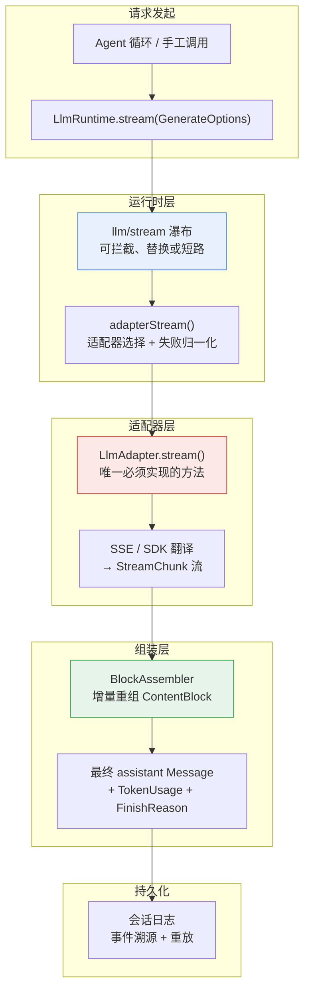
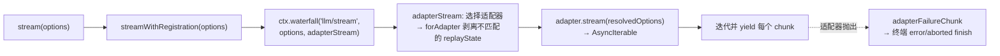
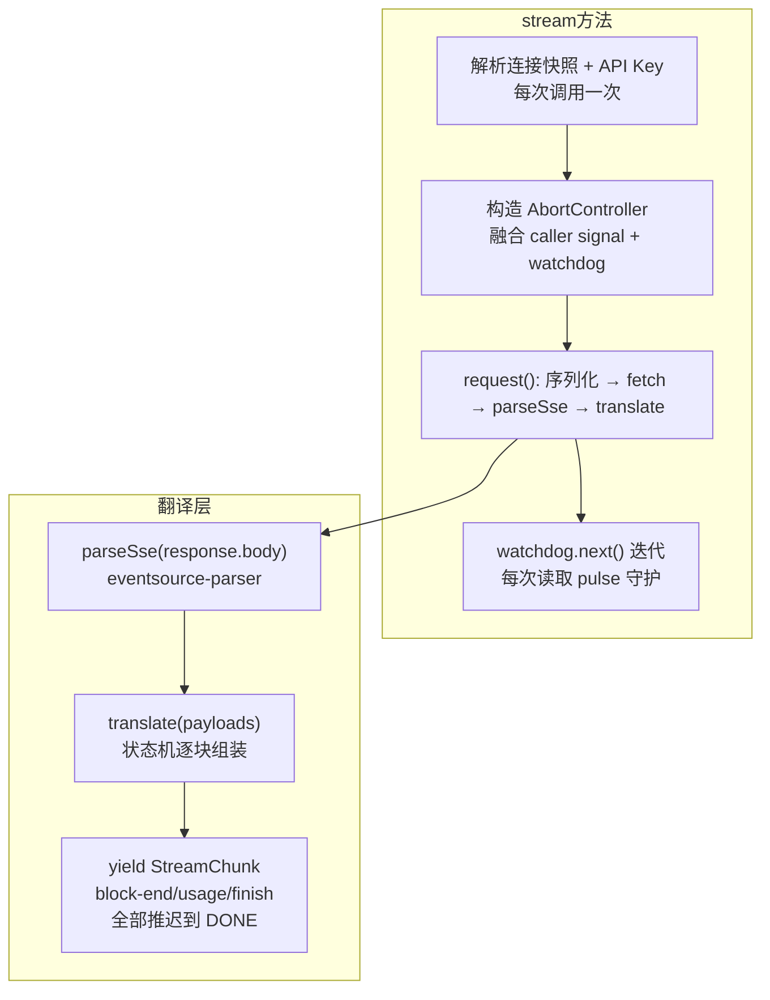

本页深入解析 DeepSeek Harness 的 **LLM 抽象层**——一套提供方中立（provider-neutral）的消息类型、流式协议、适配器契约（adapter contract）以及运行时服务，它在 Agent 循环与各类 LLM 提供方之间架起了一条统一的管道。理解这套管道，你就理解了 Harness 如何将 DeepSeek、Anthropic、OpenAI 等截然不同的 API 收敛为一套统一类型，同时保持每个适配器对传输细节的完全控制权。

## 架构总览：五层管道

在深入细节之前，先从全局视角审视这条管道的五层结构。一次模型请求从 Agent 循环发出，经由 Cordis 事件瀑布拦截、适配器选择、线协议翻译，最终输出为原始 `StreamChunk` 流，再由 `BlockAssembler` 重新折叠为不可变的 `Message`。



每一层都有清晰的职责边界：**运行时层**负责路由、瀑布分发和失败归一化；**适配器层**是提供方差异的唯一吸收点；**组装层**是所有适配器共享的唯一组装算法。这种分层使得新增一个提供方适配器只需关心线协议翻译，无需理解会话日志或重试策略。

Sources: [index.ts](packages/llm/llm/src/index.ts#L284-L928), [types.ts](packages/llm/llm/src/types.ts#L283-L303)

---

## 消息与内容块：提供方中立的词汇表

一切对话数据的基元是 `Message`，而 `Message` 的内容是一个类型化 **内容块**（ContentBlock）数组。这套词汇表是整个 Harness 共享的：从用户输入到持久化历史，从模型请求到会话投影，所有边界都使用同一个不可变类型。

| 内容块类型 | `type` 标签 | 核心字段 | 语义 |
|---|---|---|---|
| `TextBlock` | `text` | `text` | 模型可见的纯文本 |
| `ReasoningBlock` | `reasoning` | `text` | 思维链 / CoT 内容，独立于可见文本 |
| `ImageBlock` | `image` | `attachment: ImageAttachmentRef` | 持久化的图片附件引用 |
| `ToolCallBlock` | `tool-call` | `id, name, arguments` | 模型发起的工具调用（`arguments` 为原始 JSON 字符串） |
| `ToolResultBlock` | `tool-result` | `toolCallId, content, isError?` | 工具执行结果，嵌套 `ContentBlock[]` |

关键设计决策：**`ContentBlockMap` 是合并可扩展的**（merge-extensible）。插件可以通过 declaration merging 向这个接口添加新的块类型，而 `ContentBlock` 联合类型会自动包含它。新增核心块类型必须同时落地适配器、UI 和压缩支持，这是团队约定的约束。

Sources: [types.ts](packages/llm/llm/src/types.ts#L53-L110), [message.ts](packages/llm/llm/src/message.ts#L128-L156)

`Message` 本身是不可变的：它携带一个稳定 `id`（跨所有表示边界保留）、`role`（`system | user | assistant`）、`content: ContentBlock[]`，以及一个 `source: MessageSource` 记录消息的来源。对于模型生成的 assistant 消息，`source` 包含 `ModelMessageSource`，它记录了生成该消息的提供方路由、模型 ID，以及可选的 **回放状态**（`replayState`）——这是适配器私有的、无损 JSON 的状态，用于在后续请求中重建提供方的原生响应。

Sources: [message.ts](packages/llm/llm/src/message.ts#L7-L25), [message.ts](packages/llm/llm/src/message.ts#L128-L138)

回放状态的存在揭示了一个重要的不变量：`LlmRuntime` 仅在目标适配器实例同时拥有历史消息的提供方路由和当前请求的目标提供方时，才会将该状态传递给适配器。这一隔离由 `forAdapter()` 方法在每次请求时执行——如果适配器不匹配，回放状态会被剥离，适配器只能看到中立的 `ContentBlock`。

Sources: [index.ts](packages/llm/llm/src/index.ts#L823-L836)

---

## `StreamChunk`：适配器的原始流协议

适配器将其输出表达为一个 **`AsyncIterable<StreamChunk>`**。这是一个封闭的判别联合类型（discriminated union）——消费者必须对每个变体做 `switch` 并为未知类型留出 fall-through。

```ts
type StreamChunk =
  | { type: 'block-start'; index: number; blockType: ContentBlockType }
  | { type: 'text-delta'; index: number; text: string }
  | { type: 'reasoning-delta'; index: number; text: string }
  | { type: 'tool-call-delta'; index: number; id: CallId; name?: string; argumentsDelta: string }
  | { type: 'block-end'; index: number; block: ContentBlock }
  | { type: 'usage'; usage: TokenUsage }
  | { type: 'finish'; reason: FinishReason; replayState?: unknown }
```

`index` 是协议的核心线索：它将交错到达的增量（delta）关联到正确的块。一次流式响应会交替输出文本、推理和多个工具调用，`index` 确保每个 delta 被附加到正确的组装目标。`block-end` 携带完全组装的 `ContentBlock`，因此消费者无需自己从增量重建——但增量本身仍然实时流出，用于即时 UI 渲染。

Sources: [types.ts](packages/llm/llm/src/types.ts#L283-L303)

### 适配器契约：七条不变量

每个适配器 **必须** 遵守以下规则，而每个消费者 **可以** 依赖它们：

| 序号 | 契约 | 要点 |
|---|---|---|
| 1 | **`usage` 在 `finish` 之前，`finish` 之后无任何 chunk** | usage 和 finish 都推迟到提供方的流终止标记，确保不会有 trailing usage chunk 违反顺序 |
| 2 | **工具调用 `arguments` 全程保持原始 JSON 字符串** | 部分片段通过 `argumentsDelta` 流出；提供方返回已解析对象的适配器需在 `block-end` 时重新序列化 |
| 3 | **两条错误路径，一种 `LlmFailure` 类型** | 适配器可以在 `stream()` 中抛出异常（传输/协议错误），或以 `finish {kind:'error'|'aborted'}` 结束流（提供方 in-band 错误） |
| 4 | **一次适配器调用等于一次提供方尝试** | 适配器禁用底层库的重试机制；Agent 级别的恢复开启另一个持久化的编号 turn |
| 5 | **提供方停顿在传输层有界** | 两个远程适配器都暴露了正有限 `streamIdleTimeoutMs`（默认 5 分钟），通过 `idleWatchdog` 守护 |
| 6 | **上下文溢出有一个规范代码** | 两个适配器都将提供方的上下文窗口溢出分类为 `CONTEXT_WINDOW_EXCEEDED` |
| 7 | **空完成是可重试的错误** | 带有 `stop` finish 但无任何内容块的响应被映射为 `finish {kind:'error'}`，代码为 `EMPTY_RESPONSE` |

Sources: [llm-streaming.md](docs/subsystems/llm-streaming.md#L206-L217), [error.ts](packages/llm/llm/src/error.ts#L24-L48)

---

## `LlmRuntime`：适配器注册表与流式调用 API

`LlmRuntime` 是 Cordis `Service` 的子类，挂载在 `ctx.llm` 上。它的核心职责分为三个维度：**适配器注册**、**调用解析** 和 **流式分发**。

### 适配器注册：原子路由替换

注册一个适配器时，调用 `registerAdapter(providers, adapter)`，其中 `providers` 是该适配器要服务的路由名称数组。注册返回一个 `AdapterRegistrationHandle`——它既是释放器，又携带 `replace(providers: string[])` 方法实现**原子路由替换**。

原子性意味着：`replace` 先完整验证候选路由集（检查冲突、名称合法性和提供方元数据），然后在一个同步代码段内完成交换。任何观察者都无法观察到释放与重新注册之间的间隙。`emitAdaptersUpdated()` 在每次提交点（包括注册释放）发布 `llm/adapters-updated` 事件通知拓扑变化。

Sources: [index.ts](packages/llm/llm/src/index.ts#L338-L367), [index.ts](packages/llm/llm/src/index.ts#L399-L413)

### `stream()` 的内部链路

当调用 `ctx.llm.stream(options)` 时，请求经过以下管道：



`llm/stream` 瀑布是关键拦截点：任何插件都可以监听这个事件，在调用 `next()` 前读取完整请求，或者直接 yield 自己的 chunk 来短路适配器调用。循环构建的请求（`markAgentLoopRequest`）在到达瀑布时是**深冻结**的——其内容是会话日志的纯函数（可重构性不变量），因此监听器只读不改。

Sources: [index.ts](packages/llm/llm/src/index.ts#L46-L66), [index.ts](packages/llm/llm/src/index.ts#L843-L900), [index.ts](packages/llm/llm/src/index.ts#L913-L927), [call-config.ts](packages/llm/llm/src/call-config.ts#L61-L78)

### `prepareCall()`：一次解析，绑定注册

Agent 循环使用 `prepareCall()` 在头部日志记录和流式分发之间共享同一个适配器注册。它返回一个冻结的 `PreparedLlmCall`，其中 `config` 已深冻结、`adapterDefaults` 记录了哪些字段由适配器材质化（而非调用者提议）。`stream()` 方法只能调用一次——第二次或配置不匹配会抛出 `INVALID_PREPARED_CALL`。这确保 HMR 无法将一个适配器的能力解析结果与另一个适配器的分发组合在一起。

Sources: [index.ts](packages/llm/llm/src/index.ts#L779-L814)

---

## 适配器抽象基类：`LlmAdapter`

`LlmAdapter` 是所有提供方适配器的抽象基类。它的核心设计理念是：**唯一必须实现的方法是 `stream()`**，其他方法都有默认实现。

```ts
abstract class LlmAdapter {
  providerInfo(provider: string): LlmProviderInfo       // 默认：{ id: provider, name: provider }
  providerRetryPolicy(_provider: string): ResolvedRetryPolicy | undefined  // 默认：undefined → 使用 normal 默认值
  listModels(_provider: string): Promise<readonly LlmModelInfo[]>          // 默认：空列表
  resolveModel(provider, model, signal?): Promise<LlmResolvedModelInfo>    // 默认：最小元数据
  abstract stream(options: GenerateOptions): AsyncIterable<StreamChunk>     // 唯一必须实现
}
```

Sources: [index.ts](packages/llm/llm/src/index.ts#L180-L233)

### `GenerateOptions`：一次完整的模型请求

`GenerateOptions` 是一个完全组装的请求信封，包含提供方路由选择、模型 ID、对话历史、系统提示、工具模式、采样参数和取消信号：

| 字段 | 类型 | 语义 |
|---|---|---|
| `provider` | `string` | 已注册的提供方路由，选择适配器实例 |
| `model` | `string` | 模型 ID（Harness 模型名 = 线协议模型名） |
| `messages` | `Message[]` | 有序对话消息（`system` slot 之后） |
| `system` | `string?` | 系统提示文本 |
| `tools` | `ToolSchema[]?` | 工具的 JSON Schema 描述 |
| `temperature` | `number?` | 采样温度 |
| `maxTokens` | `number?` | 最大输出 token 数 |
| `stop` | `string[]?` | 停止序列 |
| `signal` | `AbortSignal?` | 调用者取消 |
| `reasoningEffort` | `ReasoningEffortId?` | 适配器拥有的推理强度选择 |
| `sessionId` | `Branded<'SessionId'>?` | 会话身份，用于请求路由和重放 |
| `purpose` | `'compaction' \| 'session-title'?` | 辅助模型调用的中性分类 |

Sources: [types.ts](packages/llm/llm/src/types.ts#L319-L356)

---

## `BlockAssembler`：共享的增量组装算法

`BlockAssembler` 是 **唯一** 的标准组装实现，负责将 `StreamChunk` 流增量折叠回完整的 `ContentBlock`。Agent 循环在日志记录原始 chunk（用于重放保真度）的同时，将相同的 chunk 喂给 `BlockAssembler`，然后一次读取 `blocks()` / `message()` / `usage` / `finish`。

它的容错设计有两个层面：**容忍 delta-only 协议**（没有 `block-start`/`block-end` 的协议也能工作，`ensure()` 会按需创建 partial）；**忽略 `block-end` 之后的 straggler delta**（已关闭的块不会被行为异常的适配器扩大内存或损坏）。

一个特殊的行为：当 `finish.kind === 'max-tokens'` 时，`blocks()` 会过滤掉 `tool-call` 类型的块——因为截断的工具调用无法安全执行，丢弃它们比执行一个半截 JSON 参数的调用更安全。

Sources: [assembler.ts](packages/llm/llm/src/assembler.ts#L36-L164)

---

## DeepSeek 适配器：直接 fetch + SSE

`DeepSeekAdapter` 是第一个实现的适配器，直接使用 `fetch` 和 SSE 对抗 DeepSeek（OpenAI 兼容）的 chat-completions 端点。它的架构可以用 **"四个阶段、一条信号"** 来概括。



**连接快照隔离**：每次 `stream()` 调用只解析一次连接配置和 API Key，然后在整个请求期间冻结。凭证从同一个快照中解析——一个请求永远不会将一代配置的 URL 与另一代的密钥配对。这使得配置变更在下一次请求时生效，而不会影响在途的流。

**翻译策略**：`translate()` 函数维护状态机，为每种内容（文本、推理、工具调用）维护独立的 `OpenBlock`。所有 `block-end`、`usage` 和 `finish` 都推迟到 `[DONE]` 哨兵——这覆盖了 finish-attached 和 trailing usage-only 两种 usage 到达形态，确保 `finish` 之后不会有任何 chunk。

Sources: [adapter.ts](packages/llm/llm-deepseek/src/adapter.ts#L158-L269), [translate.ts](packages/llm/llm-deepseek/src/translate.ts#L86-L185), [sse.ts](packages/llm/llm-deepseek/src/sse.ts#L28-L40)

**Token 计数转换**：DeepSeek 的 `prompt_tokens` 包含缓存命中数（`prompt_tokens = prompt_cache_hit_tokens + prompt_cache_miss_tokens`），但 Harness 的 `TokenUsage` 约定是 **不相交计数**——`inputTokens` 是未缓存的输入。因此 `mapUsage()` 会从 `prompt_tokens` 中减去缓存读取量，将它们报告为独立的 `cacheReadTokens`。

Sources: [translate.ts](packages/llm/llm-deepseek/src/translate.ts#L46-L62), [types.ts](packages/llm/llm-deepseek/src/types.ts#L133-L147)

**序列化约定**：序列化器有几个非显而易见的设计选择——纯工具调用轮次发送 `content: ""` 而非 `null`（某些网关拒绝 null）；推理内容（`reasoning_content`）仅在工具调用轮次回传（思维模式 passback 要求），在纯文本轮次省略以节省 token。

Sources: [serialize.ts](packages/llm/llm-deepseek/src/serialize.ts#L70-L187)

---

## pi-ai 适配器：多提供方库后端

`PiAiAdapter` 通过 `@earendil-works/pi-ai` 库支持多家提供方（Anthropic、OpenAI、Google 等）。与 DeepSeek 适配器的"自己管理 fetch"不同，pi-ai 适配器委托给库的事件流 API。

**不可变快照隔离**：每次 `stream()` 调用在任何 `await` 之前捕获整个快照——profile、模型描述符和 `Models` 集合都来自同一个不可变快照。配置变更构建一个**新**的集合而非修改正在使用的那个，因为 `Models.streamSimple()` 是惰性的——它在流首次消费时才解析提供方。这确保了在请求中途切换模型只会在下一步生效，永远不会在正在进行的步骤内部生效。

Sources: [adapter.ts](packages/llm/llm-pi-ai/src/adapter.ts#L1-L21), [adapter.ts](packages/llm/llm-pi-ai/src/adapter.ts#L186-L206), [adapter.ts](packages/llm/llm-pi-ai/src/adapter.ts#L276-L357)

**事件翻译**：pi-ai 使用 `start/text_start/text_delta/text_end` 等事件序列，`toStreamChunks()` 将它们一一映射到 `StreamChunk` 协议。关键差异：pi-ai **从不在流中途抛出异常**——失败作为 `error` 事件到达，被映射为 error/aborted `finish` chunk（Harness 协议的第二条错误路径）。此外，pi-ai 的工具调用参数是**已解析对象**，而 Harness 保持原始 JSON 字符串——翻译器在 `toolcall_end` 时执行 `JSON.stringify()`。

Sources: [stream.ts](packages/llm/llm-pi-ai/src/stream.ts#L124-L209), [stream.ts](packages/llm/llm-pi-ai/src/stream.ts#L1-L9)

**回放状态投影**：pi-ai 的 `replayState` 比 DeepSeek 复杂得多——它需要存储提供方原生的签名信息（`textSignature`、`thinkingSignature`、`thoughtSignature`）才能在后续请求中重建原生 assistant 消息。`toPiReplayState()` 将成功的 pi-ai 响应投影为最小化的版本化、无损 JSON 状态。

Sources: [replay.ts](packages/llm/llm-pi-ai/src/replay.ts#L63-L91), [replay.ts](packages/llm/llm-pi-ai/src/replay.ts#L1-L32)

---

## 两种适配器的关键对比

| 维度 | `DeepSeekAdapter` | `PiAiAdapter` |
|---|---|---|
| 传输方式 | 直接 `fetch` + SSE | pi-ai SDK 库 |
| 协议 | OpenAI 兼容 chat-completions | 多家提供方 API |
| 延迟模型 | 每次操作解析连接配置 thunk | 不可变快照按 profile 标识缓存 |
| 凭证管理 | `resolveApiKey(connection)` per-request | `resolveApiKey(provider, profile)` per-stream |
| 错误路径 | 主要抛出 `LlmError` | 主要通过 in-band `error` 事件 |
| 工具参数格式 | 原始 JSON 字符串 → 直接透传 | pi-ai 解析对象 → `JSON.stringify()` |
| Token 缓存 | `prompt_tokens` 包含命中 → 减去 | pi-ai 非零才报告 → 条件字段 |
| 回放状态 | 无 | `PiAiReplayState`（版本化、含签名） |
| 图片输入 | 不支持（`assertTextOnly`） | 按模型 `input` 模态门控 |
| 空闲超时 | `streamIdleTimeoutMs`（默认 300,000ms） | `profile.streamIdleTimeoutMs` |

Sources: [adapter.ts](packages/llm/llm-deepseek/src/adapter.ts#L88-L106), [adapter.ts](packages/llm/llm-pi-ai/src/adapter.ts#L56-L62), [stream.ts](packages/llm/llm-pi-ai/src/stream.ts#L22-L29), [translate.ts](packages/llm/llm-deepseek/src/translate.ts#L46-L62)

---

## 错误归一化与失败分类

无论适配器以何种方式失败，`LlmRuntime` 会将其归一化为一个终端 `finish` chunk。`adapterFailureChunk()` 函数将任何抛出值转换为 `{type: 'finish', reason: {kind: 'error'|'aborted', failure}}`——caller abort 映射为 `aborted`，其他映射为 `error`。

`LlmFailure` 是一个可序列化的提供方中立负载，包含 `message`、`code`、可选的 `status`、`providerRetryAfterMs` 和 `requestId`。`normalizeLlmFailure()` 在归一化时采取防御性策略：它**不信任**第三方 SDK 的 `code`（只信任 `HarnessError` 的 code），通过 `getOwnPropertyDescriptor` 读取 own data 属性而非调用 SDK 可能定义的访问器，避免恶意或错误的 getter 替换主失败信息。

Sources: [index.ts](packages/llm/llm/src/index.ts#L930-L939), [adapter-failure.ts](packages/llm/llm/src/adapter-failure.ts#L16-L28), [types.ts](packages/llm/llm/src/types.ts#L39-L51)

### 规范错误代码

| 代码 | 语义 | 默认可重试 |
|---|---|---|
| `EMPTY_RESPONSE` | 模型完成但无内容块 | ✅ |
| `RATE_LIMIT` | HTTP 429 请求速率限制 | ✅ |
| `SERVER` | HTTP 5xx 服务端错误 | ✅ |
| `TIMEOUT` | 传输层空闲超时 | ✅ |
| `TRANSPORT` | DNS / 连接 / TLS 等传输失败 | ✅ |
| `CONTEXT_WINDOW_EXCEEDED` | 请求超出模型上下文窗口 | ❌ |
| `AUTH` | HTTP 401/403 认证失败 | ❌ |
| `QUOTA` | 账户配额 / 余额耗尽 | ❌ |
| `ABORTED` | 调用者取消 | ❌ |
| `INVALID_CREDENTIAL` | 凭证格式错误（非缺失） | ❌ |

Sources: [error.ts](packages/llm/llm/src/error.ts#L24-L100), [retry-policy.ts](packages/llm/llm/src/retry-policy.ts#L14-L24)

---

## 重试策略：提供方所有、代理级执行

重试策略由提供方配置声明（`RetryPolicyConfig`），在路由注册时解析为不可变的 `ResolvedRetryPolicy`，由独立的 `dsh-llm-retry` 插件在 Agent 循环的 `agent/request-error` 扩展点上执行。

两种模式：

| 模式 | 行为 | 关键字段 |
|---|---|---|
| `normal` | 有界瞬时重试 | `maxRetries`（默认 2）、`retryableCodes`（默认集）、指数退避 |
| `always` | 无限重试直到成功、取消或释放 | 仅有退避配置 |

退避算法是 **有界指数退避 + 对称抖动**：`delay = min(initialDelayMs × 2^min(retry-1, 1024), maxDelayMs) × jitter`，其中 `jitter = 1 - ratio + 2 × ratio × random()`。如果提供方返回了有效的 `Retry-AFTER` 头，适配器会解析它并通过 `providerRetryAfterMs` 传递——策略会优先使用提供方请求的延迟（但不超过 `maxDelayMs`）。

每次重试都是**持久化的**：`llm/retry` 事件在可取消等待之前写入会话日志，`llm/retry-started` 在延迟结束后写入。这使得重试序列在崩溃后可恢复，且 `policyKey` 确保同一 turn/step/provider/策略组合的重试计数是连续的。

Sources: [retry-policy.ts](packages/llm/llm/src/retry-policy.ts#L26-L79), [retry-policy.ts](packages/llm/llm/src/retry-policy.ts#L145-L191), [llm-retry/index.ts](packages/llm/llm-retry/src/index.ts#L58-L63), [llm-retry/index.ts](packages/llm/llm-retry/src/index.ts#L111-L154)

---

## 应用归属与凭证

每个提供方 HTTP 请求都**必须**携带应用归属头（`User-Agent`）。`attributionHeaders()` 从包清单中读取版本号（永不手工拷贝），生成标准的 `product/version (+url)` 格式。这是不可抑制的——省略身份参数会回退到 `APP_IDENTITY` 默认值。适配器通过线级测试证明它们发送了这个头。

凭证管理遵循 **"凭证引用随连接事实同行"** 原则：配置只携带一个 `CredentialRef`（文字密钥不是配置值），解析在每次请求时执行。`assertUsableApiKey()` 在拒绝不可用密钥时不会将其任何部分回显到日志或 UI——`ref` 只指出去哪里修复，而非密钥本身。

Sources: [attribution.ts](packages/llm/llm/src/attribution.ts#L25-L68), [index.ts](packages/llm/llm/src/index.ts#L137-L152)

---

## Token 计量：回放感知的实时估算

`TokenMeter` 服务（`ctx.tokenMeter`）是唯一的回放感知 token 计量器。它按会话增量折叠事件日志（lazy replay），维护 `surfaceTokens`（当前会话表面 token 数）和 `anchor`（最后一次成功调用的基准）。`measure()` 方法根据请求信封是否匹配基准来决定复用提供方 usage 还是启发式估算。

Token 计量的核心理念是 **不相交计数**：`inputTokens` 是未缓存输入，缓存读取单独报告，计费输入 = 三者之和。两个适配器对提供方的计数方式做了不同的适配——DeepSeek 从 `prompt_tokens` 中减去缓存命中，pi-ai 则仅在非零时报告缓存字段。

Sources: [token-meter/index.ts](packages/llm/token-meter/src/index.ts#L44-L49), [token-meter/index.ts](packages/llm/token-meter/src/index.ts#L116-L147)

---

## 新增适配器的路径

新增一个提供方适配器只需要关注线协议翻译，而不需要理解会话日志或重试策略。核心步骤是：

1. **继承 `LlmAdapter`** 并实现唯一的 `abstract stream(options)` 方法，返回 `AsyncIterable<StreamChunk>`
2. **遵守七条适配器契约**——特别是 usage/finish 顺序和原始 JSON arguments
3. **在插件中使用 `ctx.llm.registerAdapter()`** 注册路由，提供连接配置 thunk 和凭证解析器
4. **通过 `providerInfo()` 和 `resolveModel()`** 提供显示元数据和模型能力

详细的实战指南（包括配置模式、测试策略和 mock server 设置）请参阅 [扩展开发实战手册](21-kuo-zhan-kai-fa-shi-zhan-shou-ce)。

Sources: [index.ts](packages/llm/llm/src/index.ts#L174-L233), [adding-an-llm-adapter.md](docs/cookbook/adding-an-llm-adapter.md#L1)

---

## 下一步

- 想了解 Agent 循环如何消费这些 chunk 并驱动 turn/step 生命周期，请阅读 [Agent 循环：Turn 与 Step 生命周期](12-agent-xun-huan-turn-yu-step-sheng-ming-zhou-qi)
- 想了解会话日志如何持久化这些流式数据，请阅读 [会话日志：事件溯源与持久化](13-hui-hua-ri-zhi-shi-jian-su-yuan-yu-chi-jiu-hua)
- 想了解工具执行如何与 `tool-call`/`tool-result` 块交互，请阅读 [工具执行管线](14-gong-ju-zhi-xing-guan-xian)
- 想了解整个能力的可替换架构，请阅读 [能力接缝（Capability Seams）原理](15-neng-li-jie-feng-capability-seams-yuan-li)