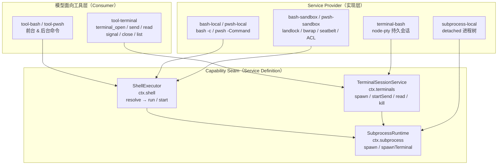
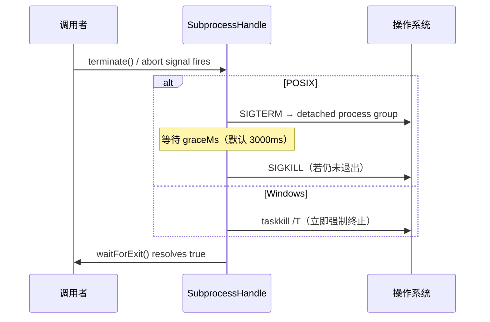
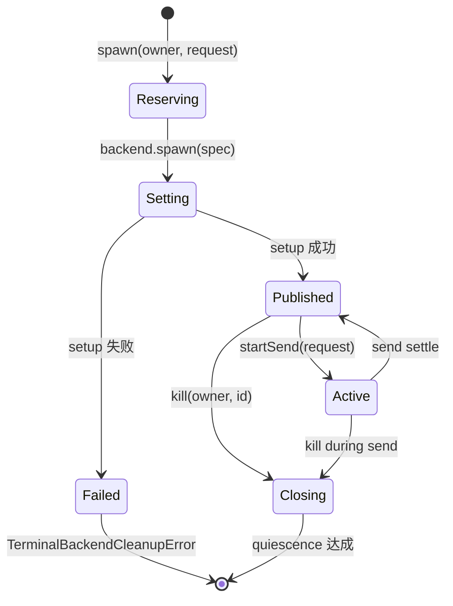

deepseek-harness 将模型驱动的命令执行拆分为三个分层递进的 Capability Seam：**子进程（Subprocess）** 管理底层进程树的 spawn 与终止；**Shell（`ctx.shell`）** 在其之上叠加命令解析、超时分类与沙箱策略；**终端（`ctx.terminals`）** 则基于子进程的终端原语提供持久的交互式 PTY 会话。这三层共同覆盖了从一次性命令执行到持久交互式 shell 的完整命令执行能力谱系。

## 三层架构全景

上图展示了从模型工具到底层 OS 进程的完整调用链路。值得注意的是：**Shell 和 Terminal 都消费 Subprocess**——`ctx.shell` 通过 `ctx.subprocess.spawn()` 启动 `bash -c` 进程，`ctx.terminals` 则通过 `ctx.subprocess.spawnTerminal()` 分配真实 PTY。

Sources: [ShellExecutor](packages/shell/shell/src/index.ts#L65-L101) · [SubprocessRuntime](packages/subprocess/subprocess/src/index.ts#L102-L140) · [TerminalSessionService](packages/terminal/terminal/src/index.ts#L105-L118)

## 子进程层：`ctx.subprocess`

子进程是整个执行体系的基石。它定义了一种 **全显式（zero-default）** 的 spawn 契约——spec 中的每一个字段（argv、cwd、stdio disposition、grace period、environment）都必须由调用者显式指定，Service Definition 不施加任何隐含默认值。这一设计确保了配置的决策权始终归属于调用者自身。

### 环境清洗与命名空间隔离

子进程服务在 spawn 前对父进程环境执行两层清洗：首先移除所有键名匹配 `KEY`、`PASSWORD`、`SECRET`、`TOKEN` 的凭据变量，然后剥离所有 `DSH_*` 命名空间条目。这意味着 `PATH`、`HOME`、locale 等常规变量正常传递给子进程，而 Harness 自身的 API Key 或托管环境变量绝不会隐式泄漏。调用者如果确实需要向子进程注入某个被清洗的变量，必须通过 spec 的 `env` 字段显式传递——该字段在清洗之后合并，因此显式条目总是优先。

Sources: [scrubbedParentEnv](packages/subprocess/subprocess/src/index.ts#L44-L66) · [SENSITIVE_ENV_PATTERN](packages/subprocess/subprocess/src/index.ts#L44)

### stdio 处置策略

每个流（stdin / stdout / stderr）的处置方式都是独立的、由调用者显式选择的。下表总结了三种输出模式和两种输入模式：

| 模式 | 适用场景 | 行为描述 |
|------|---------|---------|
| stdout/stderr = `'pipe'` | 协议解码（LSP JSON-RPC、ACP ndjson） | 将原始 `Readable` 流交给调用者，Service 不缓冲 |
| stdout/stderr = `'inherit'` | 诊断透传（语言服务器 stderr） | 继承父进程描述符，输出直接落在 Harness 自身的流上 |
| stdout/stderr = `SubprocessCollect` | 有界批处理输出（bash 工具） | 内存尾保留 + 可选 spill 文件，基于字节偏移的随机访问读取 |
| stdin = `'ignore'` | 模型驱动的一次性命令 | fd 0 连接到 `/dev/null` |
| stdin = `'pipe'` | 持续协议写入 | 暴露 `Writable` 供调用者按需写入 |
| stdin = `{ data }` | 批量写入（hooks 桥接） | 写入字节后立即关闭 |

**collect 模式的偏移读取**是子进程接缝中最精巧的设计。`SubprocessOutputReader.readFrom(fromByte)` 接受全流字节偏移量，返回增量文本、下一偏移和 `lossy` 标志。这种 cursor-free 设计意味着多个独立读取者不会相互"消费"输出——每个读取者维护自己的偏移游标。当偏移已滑出内存尾窗口时，读取标记为 `lossy`，完整数据只能从 spill 文件恢复。

Sources: [SubprocessStdio](packages/subprocess/subprocess/src/types.ts#L62-L67) · [SubprocessOutputReader](packages/subprocess/subprocess/src/types.ts#L139-L148) · [SubprocessCollect](packages/subprocess/subprocess/src/types.ts#L44-L52)

### 进程树终止：统一升级策略

子进程接缝定义了唯一的终止动词 `terminate()`，它在所有平台上都是 **树级（tree-scoped）** 的：

`waitForExit()` 等待的是 **整个进程树** 的退出，而非仅直接子进程——这意味着一个仍在运行的 helper 进程会在 teardown 返回前被观察到。这一语义确保了组合拆解（composition teardown）可以在真实的 quiescence 上挂住每一层清理。

Sources: [SubprocessHandle.terminate](packages/subprocess/subprocess/src/types.ts#L180-L194) · [disposeManagedProcesses](packages/subprocess/subprocess-local/src/index.ts#L79-L102)

### 终端进程原语：`spawnTerminal`

`spawnTerminal(spec)` 是子进程接缝中的唯一非管道进程原语。它分配一个真实的 PTY（伪终端），并拥有 UTF-8 文本传输、前台进程组检查与信号传递、以及整个会话树的 quiescence 终止。返回的 `SubprocessTerminalHandle` 暴露 `write()`、`inspectForeground()`、`signalForeground()` 和 `terminate()` 方法——终端层的 `BashTerminalBackend` 正是建立在这一原语之上。

Sources: [spawnTerminal](packages/subprocess/subprocess-local/src/index.ts#L161-L184) · [SubprocessTerminalHandle](packages/subprocess/subprocess/src/types.ts#L235-L264)

## Shell 层：`ctx.shell`

Shell 接缝在子进程之上构建了命令执行的语义层。它将 **模型/插件面向的请求（Request）** 与 **执行器实际消费的规格（Spec）** 显式分离，这是整个 Harness 架构中能力接缝模式的典型应用。

### Request → Spec 的 resolve 分离

`ShellExecutor.resolve()` 在 `run()` 或 `start()` 之前被调用，负责用实现自身的配置填充请求中的可选字段：

| 字段 | Request（可选） | Spec（已解析） | resolve 行为 |
|------|----------------|---------------|-------------|
| `workdir` | `string \| undefined` | `string` | 默认为 `config.cwd` 或 `process.cwd()` |
| `timeoutMs` | `number \| undefined` | `number` | 默认为 `config.timeoutMs`，上限 `config.maxTimeoutMs` |
| `stdoutMaxBytes` | `number \| undefined` | `number` | 默认为 `config.maxOutputBytes` |
| `signal` | `AbortSignal \| undefined` | `AbortSignal \| undefined` | 透传 |
| `stdin` / `env` / `dshEnv` | 可选 | 可选 | 透传（无默认值） |
| `sandboxPolicy` | 可选 | `SandboxExecutionPolicy \| undefined` | 透传；沙箱执行器子类覆盖以注入默认策略 |

**`dshEnv`（托管环境）** 是一个受控命名空间：所有以 `DSH_` 为前缀的变量在 spawn 前被丢弃，然后由 `ctx.shellEnv` 注册表收集的当前快照注入。这确保了模型可见的 Harness 环境事实（如 `DSH_SESSION_ID`、`DSH_HOME`）始终是新鲜的，而非从父进程继承的陈旧值。

Sources: [ShellExecRequest](packages/shell/shell/src/types.ts#L38-L79) · [ShellExecSpec](packages/shell/shell/src/types.ts#L86-L110) · [resolve()](packages/shell/bash-local/src/index.ts#L146-L171)

### 前台执行与结果分类

`run(spec)` 在前台执行命令并返回 `ShellRunResult`。结果中四个正交字段各自独立报告：一个进程可能同时"超时"和"退出码为 0"，因为某些命令会捕获信号。`timedOut` 和 `aborted` 互斥——一个 fused deadline 同时驱动超时和调用者取消，只有第一个触发的原因被记录。

关键设计原则：**`run()` 仅在基础设施故障时 reject**。非零退出码、超时 kill 和 abort kill 都会 resolve 为一个描述性的 `ShellRunResult`，而非抛出异常。这一约定让工具层能够正常渲染失败命令的输出而非中断 turn。

Sources: [ShellRunResult](packages/shell/shell/src/types.ts#L112-L138) · [runArgv](packages/shell/bash-local/src/index.ts#L223-L240)

### 后台进程与生命周期

`start(spec)` 立即返回一个 `ShellProcess` 句柄——后台进程 **没有超时**。句柄的 `done` Promise 在进程关闭时 resolve 且永不 reject（spawn 失败也会以 `killed` 状态 settle，错误信息出现在 stderr 中）。`readOutput()` 提供增量读取，连续读取不会重复输出。

`LocalBashExecutor` 在实现 `start()` 时，将 spec 映射为 `ctx.subprocess.spawn()` 调用，并以 `['bash', '-c', spec.command]` 作为 argv。后台进程的进程组、有界收集器和 spill 文件全部由子进程服务管理，因此即使执行器被重载（reload），后台进程仍在 **子进程服务的 disposal 边界内** 保持存活。

Sources: [ShellProcess](packages/shell/shell/src/types.ts#L161-L183) · [startArgv](packages/shell/bash-local/src/index.ts#L255-L318)

### PowerShell 变体

`dsh-pwsh-local` 是 Shell 接缝的 Windows 平台实现，镜像了 `dsh-bash-local` 的调用结构，但使用 `pwsh -NoLogo -NoProfile -NonInteractive -Command <command>` 作为 argv。它额外注入了 UTF-8 编码前导语句 `[Console]::OutputEncoding = ...`，以确保 Windows PowerShell 5.1 的输出不会因 OEM 代码页而乱码。

Sources: [pwsh-local ENV_OVERRIDES](packages/shell/pwsh-local/src/index.ts#L34-L38) · [ENCODING_PREAMBLE](packages/shell/pwsh-local/src/index.ts#L48-L49)

### 沙箱执行器变体

`dsh-bash-sandbox` 和 `dsh-pwsh-sandbox` 是沙箱化执行器，它们继承各自的本地基类并在 `resolve()` 中注入默认沙箱策略。沙箱化运行通过 `ShellSandboxInfo` 报告事实：模式（mode）、是否拒绝了文件操作（denied）、执法完整性（enforcement），以及 runner 是否在命令运行前就失败了（runnerFailed）。当沙箱后端不可用时，前台执行抛出 `SANDBOX_UNAVAILABLE` 错误——这是 fail-closed 语义。

Sources: [ShellSandboxInfo](packages/shell/shell/src/types.ts#L17-L30) · [bash-sandbox package](packages/shell/bash-sandbox/src/index.ts)

## 终端层：`ctx.terminals`

终端接缝提供 **持久的交互式 PTY 会话**——这是 Shell 层所不具备的能力。Shell 工具的每次 `bash -c` 调用都在全新 shell 中运行（无状态持久化），而终端会话则维护一个跨工具调用的、有状态的交互式 shell 进程。

### 所有者作用域（Owner-Scoped）会话模型

`TerminalSessionService` 是一个进程内注册表，管理可替换的 PTY 后端和 **精确 Agent 绑定** 的会话。每个会话通过 `TerminalSessionId`（service 铸造的 branded id）标识，所有操作（send / read / signal / kill）都要求传入精确的 owner Agent 引用——名称或猜测的 id 都不被接受。

会话的清理被绑定到精确的 owner 作用域：当 Agent 被销毁时，其拥有的所有 PTY 会话都会被关闭。会话能够跨后端或工具插件的重载存活——PTY 状态和原始字节保持在进程本地。

Sources: [TerminalSessionService](packages/terminal/terminal/src/index.ts#L105-L118) · [TerminalBackend](packages/terminal/terminal/src/types.ts#L166-L171)

### 后端抽象与会话就绪检测

`BashTerminalBackend` 是 `terminal-bash` 包注册的后端实现，它：

1. 通过 `ctx.subprocess.spawnTerminal()` 分配真实 PTY（使用 `node-pty`）
2. 设置 `TERM=dumb`、`PS1=CONTROLLED_PROMPT` 以及 `PROMPT_COMMAND`（用于输出 OSC 133 序列标记 prompt 边界）
3. 注入 `DSH_SHELL=1`、`DSH_SESSION_ID`、`DSH_PTY_SESSION_ID` 等托管变量
4. 在返回会话前执行 `initialize()`——等待 shell 就绪（检测到第一个 prompt 标记）

会话就绪检测是一个多阶段过程：backend 通过轮询前台进程组状态和观察输出静默期来推断 shell 是否回到 prompt 等待状态。`TerminalWaitReason` 描述了每次 send 操作返回的原因：

| WaitReason | 含义 | 是否意味着子进程退出 |
|------------|------|-------------------|
| `stdin_read` | 前台进程组在等待终端输入 | 否 |
| `inferred_idle` | 输出静默超过阈值，推断 shell 已回到 prompt | 否 |
| `timeout` | send 的等待超时 | 否 |
| `session_exit` | 顶层 shell 进程退出 | 是 |

Sources: [TerminalWaitReason](packages/terminal/terminal/src/types.ts#L29) · [childEnvironment](packages/terminal/terminal-bash/src/index.ts#L55-L69) · [BashTerminalBackend.spawn](packages/terminal/terminal-bash/src/index.ts#L119-L146)

### 六个模型面向的终端工具

`dsh-tool-terminal` 注册了六个工具供 LLM 使用：

| 工具 | 功能 | 关键参数 |
|------|------|---------|
| `terminal_open` | 创建持久 PTY 会话 | `type`（后端类型，通常 `"shell"`）、`name`、`cwd` |
| `terminal_send` | 向会话发送文本 | `sessionId`、`text`、`submit`（是否追加 Enter）、`run_in_background` |
| `terminal_read` | 分页读取保留的 scrollback | `sessionId`、`offset`、`count` |
| `terminal_signal` | 向前台进程组发送信号 | `sessionId`、`signal`（SIGINT/SIGTERM/SIGKILL/SIGTSTP/SIGHUP） |
| `terminal_close` | 关闭会话并等待进程树退出 | `sessionId` |
| `terminal_list` | 列出当前 Agent 拥有的会话 | 无 |

每个 send 操作在任一时间点是排他的——一个 PTY 会话最多有一个活跃 send。前台 send 等待就绪后返回 `TerminalSendResult`（包含 viewport、waitReason 和 sessionStatus），后台 send 则返回一个 job id 并通过 `ctx.jobs` 管理生命周期。

Sources: [tool-terminal apply](packages/terminal/tool-terminal/src/index.ts#L146-L395)

### 有界输出缓冲与 scrollback

`LocalPtySession` 内部使用 `BoundedTextBuffer` 管理两类缓冲：**操作缓冲（operation buffer）** 存储一次 send 期间产生的增量输出；**scrollback 缓冲** 存储会话的滚动历史。两者都有字节上限和（scrollback 还有）行数上限。当缓冲溢出时，头部被丢弃，尾部被保留——这与子进程层 collect 模式的 tail-keep 语义一致。`readOutput()` 是消费式读取（清空操作缓冲），而 `read()` 是分页式读取（保留 scrollback 内容）。

Sources: [BoundedTextBuffer](packages/terminal/terminal-bash/src/session.ts#L40-L75) · [LocalPtySession](packages/terminal/terminal-bash/src/session.ts#L156-L200)

## 沙箱模式锁定：终端与沙箱的交叉约束

终端会话引入了一个重要的跨子系统约束：**当持久终端会话打开时，不允许切换沙箱模式**。`BashTerminalBackend` 通过 `ensureSandboxModeFence()` 在 Agent 级别注册了一个全局事件拦截器——如果检测到 `session/event` 事件中的 `sandbox/mode` 类型事件与当前模式不同，且 Agent 有活跃的 PTY 活动，操作会被拒绝。这是因为 PTY 会话在创建时绑定了特定的沙箱策略（sandbox runner 的 argv 被烘焙进了 spawn 命令），运行时切换模式将导致已打开会话的沙箱约束与新策略不一致。

Sources: [ensureSandboxModeFence](packages/terminal/terminal-bash/src/index.ts#L34-L53) · [spawnArgv](packages/terminal/terminal-bash/src/index.ts#L71-L80)

## 三层对比总结

| 维度 | 子进程 (`ctx.subprocess`) | Shell (`ctx.shell`) | 终端 (`ctx.terminals`) |
|------|--------------------------|--------------------|-----------------------|
| **核心抽象** | 进程树 + stdio 处置 | 命令 → 前台/后台执行 | 持久交互式 PTY 会话 |
| **Service ID** | `subprocess` | `shell` | `terminals` |
| **状态持久性** | 无（一次性进程） | 无（每次 `bash -c` 全新 shell） | 有（跨工具调用的有状态 shell） |
| **输出收集** | collect 模式：偏移读取 + spill | 透传子进程的 collect | 有界缓冲 + scrollback |
| **终止策略** | SIGTERM → grace → SIGKILL | 继承子进程 + timeout 分类 | 后端 close() 等待 quiescence |
| **stdin 处理** | `ignore` / `pipe` / `{ data }` | heredoc/pipe 语法（模型侧） | 交互式 write() |
| **环境管理** | scrub 凭据 + `DSH_*` 剥离 | `resolve()` 合并 `DSH_*` 快照 | backend 注入终端特定变量 |
| **沙箱集成** | 无直接集成 | `ShellSandboxInfo` 报告 | 模式锁定 fence |
| **消费者** | Shell、LSP、ACP 等接缝 | tool-bash / tool-pwsh | tool-terminal（6 个工具） |

这一分层设计的核心价值在于 **每一层只增加自己负责的语义**：子进程层管进程和 stdio 的力学；Shell 层管命令解析、超时和沙箱；终端层管交互式会话的持久性和就绪检测。三层共享同一套子进程终止原语和环境清洗逻辑，确保了跨层的进程安全语义一致性。

Sources: [subprocess seam](docs/subsystems/subprocess.md) · [shell seam](docs/subsystems/shell.md) · [terminal seam](docs/subsystems/terminal.md)

## 延伸阅读

理解本页的三层执行体系后，可以继续探索以下主题：

- **[文件系统与会话沙箱](16-wen-jian-xi-tong-yu-hui-hua-sha-xiang)**：Shell 和终端层引用的沙箱策略与 `ShellSandboxInfo` 的完整语义
- **[能力接缝（Capability Seams）原理](15-neng-li-jie-feng-capability-seams-yuan-li)**：本页三层架构所遵循的 Service Definition / Service Provider / Consumer 分离模式的理论基础
- **[工具执行管线](14-gong-ju-zhi-xing-guan-xian)**：tool-bash 和 tool-terminal 工具如何融入 agent loop 的工具执行流程
- **[整体架构与插件树设计](10-zheng-ti-jia-gou-yu-cha-jian-shu-she-ji)**：这三个子系统在 Cordis 插件树中的位置与依赖关系