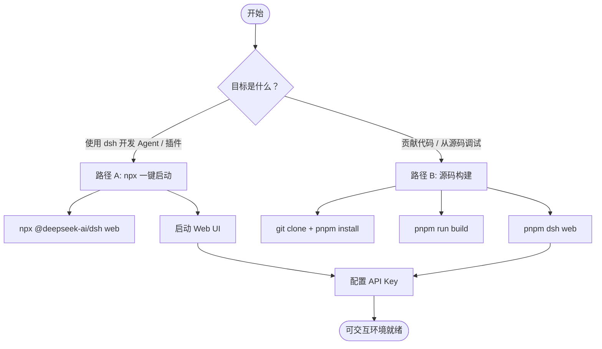
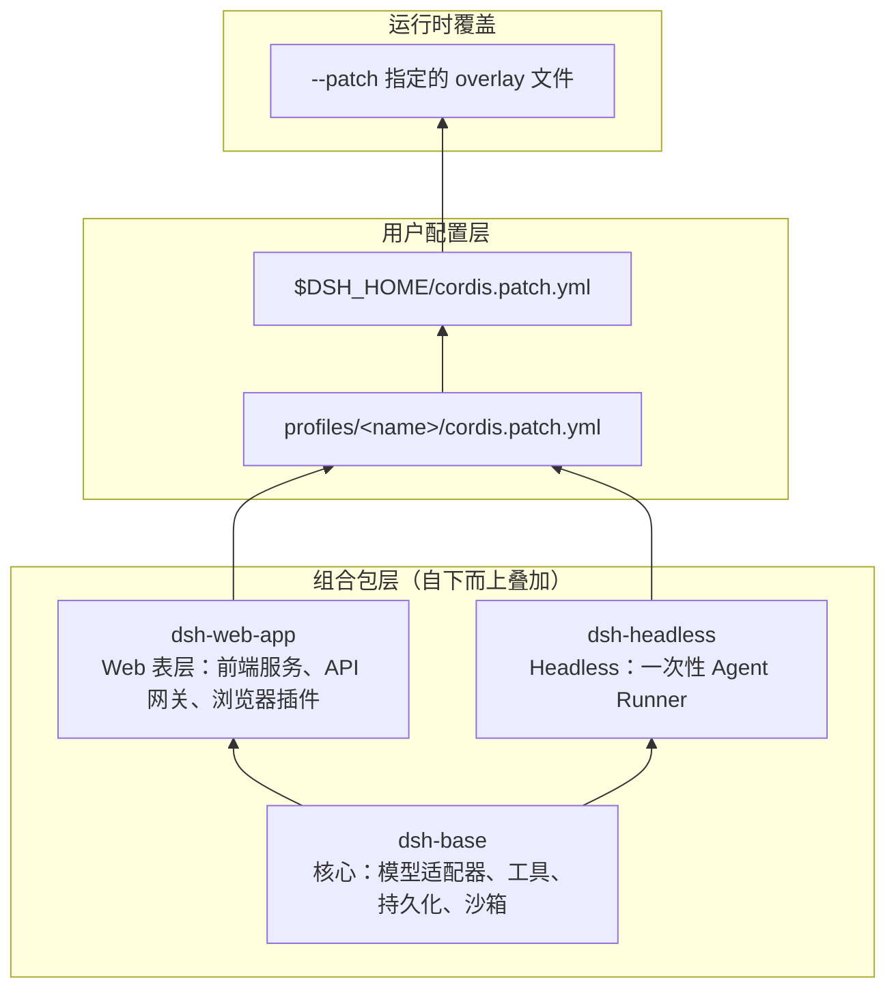
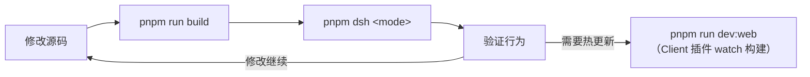

本页面帮助你从零开始启动 DeepSeek Harness（`dsh`）——从环境准备、凭证配置，到选择适合你的运行方式（npx 一键启动 或 源码构建），再到 Web UI 与 Headless 模式的实际操作。完成本页面后，你将拥有一个可交互的 AI Agent 开发环境。

## 环境前提

| 依赖项 | 版本要求 | 说明 |
|---|---|---|
| **Node.js** | 22.19+ 或 24+ | 运行时引擎。CI 覆盖 22.19、24 和 26 |
| **pnpm** | 11.7.0（经 Corepack 锁定） | 包管理器，仅从源码构建时需要 |
| **Git** | 2.26+ | 源码版本控制，Lefthook 钩子依赖 |
| **DeepSeek API Key** | 可选但推荐 | 真实 LLM 调用需要；未设置时 e2e 测试自动跳过 |

如果你使用 `npx` 方式（见下文），则只需要 Node.js——`npx` 会自动下载预构建包，无需手动安装 pnpm 或克隆仓库。

Sources: [development.zh.md](docs/development.zh.md#L9-L14), [README.zh.md](README.zh.md#L15-L21)

## 两种启动路径

根据你的目标，选择以下其中一条路径：



### 路径 A：npx 一键启动（推荐新手）

如果你只想快速体验 dsh，无需克隆仓库或构建源码：

```sh
npx @deepseek-ai/dsh web
```

`npx` 会临时安装 `@deepseek-ai/dsh` 包并启动 Web profile。Web UI 默认监听 `http://127.0.0.1:3080`，在浏览器打开该地址即可开始使用。

Sources: [README.zh.md](README.zh.md#L15-L23)

### 路径 B：从源码构建

适用于需要修改 dsh 自身代码、调试内部行为或贡献代码的场景：

```sh
git clone https://github.com/deepseek-ai/deepseek-harness.git
cd deepseek-harness
pnpm install
pnpm run build
pnpm dsh web
```

**关键点说明：**

- `pnpm install` 会自动通过 `postinstall` 钩子配置 Lefthook Git 钩子。如果依赖从缓存恢复或钩子被跳过，请手动运行 `node scripts/install-lefthook.mjs`。
- `pnpm run build` 会依次构建 Host 库、Client 库和 Web 前端，这是生产运行的前置条件。
- `pnpm dsh`（即 `package.json` 中的 `"dsh"` 脚本）通过 `node --import tsx/esm apps/cli/src/bin.ts` 直接运行 TypeScript 入口并转发所有参数，不需要重新构建即可修改源码。

Sources: [README.zh.md](README.zh.md#L25-L35), [package.json](package.json#L136), [development.zh.md](docs/development.zh.md#L16-L40)

### 构建阶段详解

从源码运行时，理解构建管线的分层有助于排查问题：

| 构建阶段 | 命令 | 产物 |
|---|---|---|
| Host 类型检查 + 打包 | `tsc -b tsconfig.host.json && tsdown --env.DSH_BUILD_FACE host` | Host 端 `lib/` JS 与类型声明 |
| Client 类型检查 + 打包 | `tsc -b tsconfig.client.json && tsdown --env.DSH_BUILD_FACE client` | Client 端 `lib/` JS 与浏览器 bundle |
| Web 前端 | `pnpm --filter @deepseek-ai/dsh-web-frontend run build` | `apps/web/dist/` 静态资源 |

Host 与 Client 保持两个独立的 aggregate program，是因为两侧以不同服务对 Cordis `Context` 接口做声明合并，放在同一个 program 中会报类型冲突。

Sources: [development.zh.md](docs/development.zh.md#L46-L76), [package.json](package.json#L20-L24)

## 配置 API 凭证

真实 LLM 调用需要 DeepSeek API Key。dsh 的凭据解析有四层优先级：

| 优先级 | 来源 | 说明 |
|---|---|---|
| 1（最高） | 继承的进程环境 | `DEEPSEEK_API_KEY=sk-... dsh web` 按次覆盖 |
| 2 | `$DSH_HOME/.credentials.yaml` | Web UI 设置页面写入的密钥存储 |
| 3 | 调用目录 `.env` | 项目级环境变量 |
| 4（最低） | `$DSH_HOME/.env` | 用户级环境变量 |

**最快的方式**是在仓库根目录创建一个 `.env` 文件（已被 `.gitignore` 忽略，不会被提交）：

```sh
DEEPSEEK_API_KEY=sk-...
DEEPSEEK_BASE_URL=https://...   # 可选，默认为公开 API
```

或者，启动 Web UI 后在 **设置 → 模型** 页面直接输入密钥并保存——凭据会写入 `$DSH_HOME/.credentials.yaml`，无需重启即可立即生效。

Sources: [credentials-local/README.zh.md](packages/credentials/credentials-local/README.zh.md#L6-L13), [development.zh.md](docs/development.zh.md#L90-L99)

## 运行模式与 Profile

dsh 通过 **Profile** 组织插件组合。每个 Profile 位于 `$DSH_HOME/profiles/<name>` 下，由有序的「组合包」（bundle）层叠而成。启动时只需指定 Profile 名称：

| 命令 | 用途 | 典型场景 |
|---|---|---|
| `dsh web`（或 `dsh --profile web`） | 启动 Web UI | 交互式编码、会话管理 |
| `dsh --profile headless "你的任务"` | 运行一次性任务，打印结果后退出 | CI 自动化、无人值守 |
| `dsh plugin --profile <name> add <pkg>` | 管理 Profile 插件 | 安装第三方扩展 |

`web` 和 `headless` Profile 在首次使用时会从随附模板自动初始化。`web` 的组合为 `dsh-base` + `dsh-web-app`；`headless` 的组合为 `dsh-base` + `dsh-headless`。

Sources: [apps/cli/README.zh.md](apps/cli/README.zh.md#L9-L16), [apps/cli/reference/README.zh.md](apps/cli/reference/README.zh.md#L13)

### 三层组合包架构

理解组合包的分层结构有助于判断问题归属：



`dsh-base` 是所有 Profile 的第一个 patch 层，提供模型适配器（DeepSeek 原生 + OpenAI 兼容）、文件系统工具、Shell 工具、会话持久化、沙箱策略等核心能力。在此基础上，`dsh-web-app` 增加 Web 宿主和浏览器交互层，`dsh-headless` 则添加一次性任务 Runner。

Sources: [packages/bundle/base/README.zh.md](packages/bundle/base/README.zh.md#L1-L9), [packages/bundle/web-app/README.zh.md](packages/bundle/web-app/README.zh.md#L1-L6), [packages/bundle/headless/README.zh.md](packages/bundle/headless/README.zh.md#L1-L7)

## Web UI 快速操作

启动 Web UI（`dsh web`）后，按以下步骤完成首次使用：

1. **配置模型**：打开 **设置 → 模型**，输入 DeepSeek API 密钥并保存。模型路由立即可用，无需重启。
2. **选择工作区**：点击 **选择工作区**，添加并选中启动 `dsh` 时所在的项目目录。选中工作区前，会话输入框不可用。
3. **运行任务**：启动会话，发送一条消息，例如：
   > Summarize this repository and identify its main packages.

Agent 可以读取和编辑工作区文件、运行命令、委派子任务并维护计划。当操作需要审批时（取决于当前权限策略），Web UI 会先弹出询问。

Sources: [docs/user/guide/index.zh.md](docs/user/guide/index.zh.md#L6-L23)

## Headless 模式

Headless 模式适用于无人值守场景。它会创建一个全新的持久化 Agent 会话，提交任务、等待完成并打印最终结果：

```sh
# 需要先设置 DEEPSEEK_API_KEY
pnpm dsh --profile headless "summarize this workspace"
```

任务文本作为位置参数传入。Runner 等待 Agent 完全停稳后，对 Session 执行 flush，再从持久化事件区间中提取最后一条非空 assistant 文本和终止原因。

Sources: [docs/development.zh.md](docs/development.zh.md#L135-L139), [packages/bundle/headless/README.zh.md](packages/bundle/headless/README.zh.md#L6-L8)

## 从源码开发的工作流

如果你需要修改 dsh 自身代码，以下是日常迭代循环：



| 命令 | 用途 |
|---|---|
| `pnpm run typecheck` | 类型检查（新克隆后应先运行一次确认搭建成功） |
| `pnpm run build` | 完整构建（Host + Client + Web 前端） |
| `pnpm run dev:web --poll` | Watch 模式构建 Client 插件，配合 `pnpm dsh web` 实现前端热更新 |
| `pnpm test` | 运行单元测试 |
| `pnpm test:e2e` | 运行端到端测试 |
| `pnpm run demo:cordis` | 运行自指 Cordis 演示（检查并修改实时插件树） |
| `pnpm run check:all` | 执行全面的本地门禁集 |

**提示**：`pnpm dsh` 脚本不需要重新构建即可修改 TypeScript 源码——它通过 `node --import tsx/esm` 直接执行 `.ts` 文件。但 Web 前端产物（`apps/web/dist/`）必须先构建一次，否则 Web profile 会在激活时报错。

Sources: [package.json](package.json#L136-L141), [development.zh.md](docs/development.zh.md#L82-L151)

## 关键路径速查

| 路径 | 说明 |
|---|---|
| `$DSH_HOME`（默认 `~/.dsh`） | Harness 主目录，存放所有用户数据 |
| `~/.dsh/profiles/<name>/` | 各 Profile 目录 |
| `~/.dsh/profiles/<name>/cordis.patch.yml` | Profile 级用户配置层 |
| `~/.dsh/cordis.patch.yml` | Home 级用户配置层（优先级高于 Profile 级） |
| `~/.dsh/.credentials.yaml` | 凭据存储（权限 0600） |
| `~/.dsh/.env` | 用户级环境变量 |
| `~/.dsh/settings.yaml` | 设置文档 |
| `./.env` | 项目级环境变量（优先级高于用户级） |

Sources: [home-paths/README.zh.md](packages/util/home-paths/README.zh.md#L6-L17), [app-boot/README.zh.md](packages/boot/app-boot/README.zh.md#L36-L43)

## 常见问题排查

| 问题 | 原因与解决 |
|---|---|
| **`pnpm install` 失败** | 确保已启用 Corepack：`corepack enable`。pnpm 版本必须为 11.7.0 |
| **`dsh web` 报前端缺失** | 从源码运行时必须先 `pnpm run build`。Web 前端没有从源码直接服务的回退路径 |
| **API 调用 401 / 无响应** | 检查 `DEEPSEEK_API_KEY` 是否已设置（`.env` 或 Web UI 设置页面） |
| **`--profile <name>` 报错 profile 不存在** | 除 `web` 和 `headless` 外的 Profile 需先通过 `dsh plugin --profile <name> add <package>` 创建 |
| **Git 钩子未生效** | 运行 `node scripts/install-lefthook.mjs` 手动重新安装 Lefthook |
| **类型检查失败** | 确保先运行 `pnpm run build:lib:host`（`pnpm run typecheck` 已自动包含此步骤） |

Sources: [development.zh.md](docs/development.zh.md#L16-L40), [apps/cli/reference/README.zh.md](apps/cli/reference/README.zh.md#L82-L85)

## 下一步

环境就绪后，建议按以下顺序深入：

- **[Web 界面使用指南](3-web-jie-mian-shi-yong-zhi-nan)** — 掌握 Web UI 的会话管理、权限审批与工作区操作
- **[命令行启动器（dsh CLI）](4-ming-ling-xing-qi-dong-qi-dsh-cli)** — 了解全部 CLI 模式、Profile 机制与插件管理
- **[Python SDK 快速入门](5-python-sdk-kuai-su-ru-men)** — 使用 Python 驱动无人值守的 Agent
- **[编写第一个插件](6-bian-xie-di-ge-cha-jian)** — 从零开始构建你的第一个 Cordis 插件