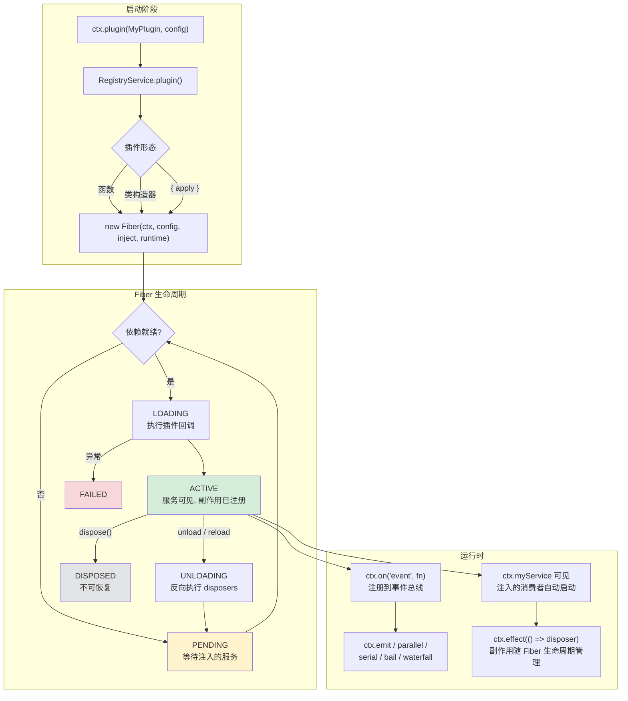
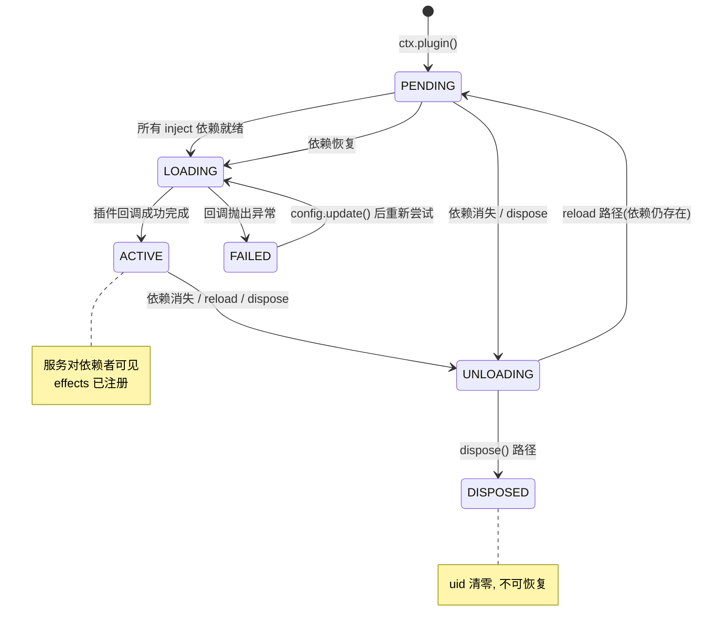

Cordis 是 DeepSeek Harness 底层以 vendor 方式引入的插件框架。理解 Cordis 是阅读子系统服务参考、编写 harness 扩展以及构建自定义 agent 工作流的前提。本页以概念速览的形式，系统梳理 Cordis 的五大核心抽象——**插件（Plugin）**、**上下文（Context）**、**服务（Service）**、**类型化事件（Events）** 和**可逆注册（Effects）**——并标注它们在源码中的精确位置，帮助你在进入扩展开发之前建立准确的思维模型。

## Cordis 全景架构

在深入每个概念之前，先看它们如何组合在一起。下图展示了从 `ctx.plugin()` 调用到服务注册、事件分发的完整数据流：



整个框架的核心理念是：**一切能力都是插件，插件在共享上下文中以服务的形式暴露能力，插件之间通过依赖声明和类型化事件协作，所有资源注册都可逆。**

Sources: [context.ts](vendor/cordis/src/context.ts#L42-L84), [fiber.ts](vendor/cordis/src/fiber.ts#L184-L333)

## 插件（Plugin）：三种入口形态

插件是 Cordis 的基本组合单元。它可以是以下三种形态中的任意一种：

| 形态 | 签名 | 适用场景 |
|---|---|---|
| **函数插件** | `(ctx: Context, config: T) => any` | 轻量逻辑、快速原型 |
| **类插件（Constructor）** | `new (ctx: Context, config: T) => any` | 有状态的服务、继承体系 |
| **对象插件（Object）** | `{ apply(ctx: Context, config: T): any }` | 需要额外元数据的场景 |

三种形态共享同一组元数据字段，定义在 `Plugin.Base` 接口中：

| 字段 | 类型 | 作用 |
|---|---|---|
| `name` | `string?` | Fiber 诊断与日志中的显示名 |
| `Config` | `StandardSchemaV1?` | 插件启动前的配置校验器 |
| `inject` | `Inject?` | 声明所需服务，决定加载顺序 |
| `provide` | `string \| string[]?` | 该插件提供的服务名 |
| `intercept` | `Dict<boolean>?` | 声明消费的 intercept config 键 |

`ctx.plugin()` 方法（或简写 `ctx.inject()`）接收任意形态的插件，解析出可执行回调后创建 Fiber。注册表（`RegistryService`）以回调函数引用为键，允许多次加载同一插件的不同实例。

```ts
// 函数插件 + inject 声明
export const inject = ['tools', 'llm']
export function apply(ctx: Context, config: MyConfig) {
  // 依赖已就绪，安全使用 ctx.tools 和 ctx.llm
}

// 类插件（Service 子类）
class MyService extends Service {
  constructor(ctx: Context) {
    super(ctx, 'myService')
  }
}
export function apply(ctx: Context) {
  ctx.plugin(MyService)
}
```

Sources: [registry.ts](vendor/cordis/src/registry.ts#L91-L146), [registry.ts](vendor/cordis/src/registry.ts#L316-L336)

## 上下文（Context）：服务的容器与作用域引擎

上下文是 Cordis 的中枢对象——所有服务、事件和生命周期 API 都通过 `ctx` 访问。`Context` 在运行时是一个 `Proxy`：普通属性读取会经过 `ReflectService` 的服务解析器，而 `extend()`、`isolate()` 和 `intercept()` 则创建不影响父级的子上下文。

### 三种上下文派生方法

| 方法 | 创建的子上下文 | 核心用途 |
|---|---|---|
| `ctx.extend(meta)` | 原型链继承父级属性 | 添加元数据（如 `fiber` 句柄） |
| `ctx.isolate(name, label?)` | 为指定服务创建独立作用域 | 同一应用中运行多个同名服务的不同实现 |
| `ctx.intercept(name, config)` | 为下游插件注入配置 | 分层配置覆盖 |

`isolate()` 的关键语义在于：子上下文中对 `name` 服务的读写将解析到新作用域，而非父级。传入相同的 `label` 可以让两次 `isolate()` 调用共享同一个作用域——这是 harness 中多 agent 隔离的底层机制。

`intercept()` 则构建了一个从根到当前上下文的拦截配置链。服务通过 `Service[symbols.resolveConfig]` 方法合并所有祖先的 intercept 配置条目，越靠近根的条目优先级越低。

```ts
// isolate：为 agent 创建独立作用域
const agentCtx = ctx.isolate('tools')

// intercept：为子上下文中的插件注入配置
const configuredCtx = ctx.intercept('llm', { model: 'deepseek-chat' })
```

Sources: [context.ts](vendor/cordis/src/context.ts#L42-L107), [context.ts](vendor/cordis/src/context.ts#L109-L145), [service.ts](vendor/cordis/src/service.ts#L86-L102)

## 服务（Service）：命名能力的暴露与发现

服务是插件暴露给其他插件使用的命名 API。一个 `Service` 子类在构造函数中调用 `super(ctx, name)` 即可注册自身，使 `ctx.<name>` 立刻可用。注册通过 `ctx.reflect.provide(name, instance)` 完成，注册是 fiber 绑定的副作用——卸载该 fiber 时自动移除。

### 服务注册的运行时与编译时

一个完整的服务声明包含两个独立部分：

**运行时注册**：`Service` 构造函数在 `ctx.reflect.provide()` 中记录服务实现，使其对同作用域的依赖者可见。

**编译时类型扩展**：通过 TypeScript 声明合并（declaration merging），将 `name` 添加到 `Context` 接口，使 `ctx.myService` 在所有消费者中获得类型安全。声明合并不产生运行时代码——没有它服务仍然能工作，但消费者失去类型检查。

```ts
import { Service, type Context } from '@deepseek-ai/cordis'

// ── 编译时：声明合并 ──
declare module '@deepseek-ai/cordis' {
  interface Context {
    greeter: GreeterService
  }
}

// ── 运行时：服务实现 ──
export class GreeterService extends Service {
  constructor(ctx: Context) {
    super(ctx, 'greeter')
  }
  greet(who: string) { return `Hello, ${who}!` }
}
```

`Service` 基类还通过 Symbol keys 暴露若干扩展点：

| Symbol Key | 作用 |
|---|---|
| `Service.init` | 构造后执行的实例方法（类插件用） |
| `Service.check` | 传递给 `provide()` 的可用性谓词 |
| `Service.config` | intercept 配置的幻影类型参数 |
| `Service.invoke` | 使服务实例可调用的函数体（如 `ctx.logger()`） |
| `Service.resolveConfig` | 合并 intercept 配置的解析方法 |

Sources: [service.ts](vendor/cordis/src/service.ts#L11-L59), [reflect.ts](vendor/cordis/src/reflect.ts#L17-L69), [03-services.md](docs/cordis-tutorial/03-services.md#L5-L72)

## 依赖注入（Inject）：通过服务需求表达加载顺序

Cordis 的依赖注入机制用一种优雅的方式替代了手动启动编排：插件在元数据中声明所需的 `inject`，框架会在所有依赖服务就绪时才执行插件回调。

### Inject 声明形式

```ts
// 数组形式：仅声明依赖，无 intercept config
export const inject = ['tools', 'llm']

// 对象形式：同时指定 intercept config
export const inject = {
  tools: { allowFork: true },
  llm: null,  // null 等价于数组形式
}
```

`Inject.resolve()` 函数将数组、对象和类继承的 inject 元数据统一归一化为扁平的 `name → config` 映射。

### 依赖追踪的动态语义

注入检查不是一次性的启动门控。如果某个被依赖的服务在运行中消失（其提供方被卸载或热替换），所有依赖它的插件都会被自动卸载，并在服务恢复后重新加载。这与 effect 系统结合，确保不会出现悬空引用或泄漏的资源。

在 Fiber 内部，`_refresh()` 方法构建一个由依赖服务 fiber uid 组成的 epoch 字符串。每当依赖关系发生变化时，epoch 改变触发 reload 或 unload。`_checkImpl()` 方法进一步检查服务实现的可用性谓词（`Service.check`），确保即使服务存在但不满足条件时也会被正确处理。

Sources: [registry.ts](vendor/cordis/src/registry.ts#L19-L89), [fiber.ts](vendor/cordis/src/fiber.ts#L597-L623), [03-services.md](docs/cordis-tutorial/03-services.md#L44-L78)

## 类型化事件（Events）：五种分发模式

服务之间的通信通过类型化事件完成。事件名通过 TypeScript 声明合并注册到全局 `Events` 接口上，每种事件有固定的分发模式（`DispatchMode`），且只能用对应的方法分发。

### 分发模式对比

| 模式 | 分发方法 | 是否 await | 执行顺序 | 是否有返回值 | 典型用途 |
|---|---|---|---|---|---|
| `emit` | `ctx.emit()` | 否（同步） | 按注册顺序 | 否 | 通知性广播 |
| `parallel` | `ctx.parallel()` | 是 | 并发执行 | 否 | 独立副作用扇出 |
| `serial` | `ctx.serial()` | 是 | 按注册顺序，可 bail | 是（首个 bail 值） | 异步决策链 |
| `bail` | `ctx.bail()` | 否 | 按注册顺序，可 bail | 是（首个 bail 值） | 同步决策链 |
| `waterfall` | `ctx.waterfall()` | 否 | 外层先于内层 | 是（外层返回值） | 中间件管道 |

### Waterfall 语义详解

`ctx.waterfall` 是最复杂也最强大的分发模式，本质上是一个环绕中间件管道。每个监听器接收 `(...args, next)`，其中 `next` 是指向下游的续行函数：

- **调用 `next()`**：将控制权委托给下一个监听器（最终到达内置行为）。`next()` 的返回值是下游处理后的结果，当前层可以包装后再向上返回。
- **不调用 `next()`**：直接短路，跳过所有下游监听器和内置行为。
- **`prepend: true`**：仅当监听器必须在普通注册之前执行时使用。

对于单决策事件，短路是设计意图本身。拥有决策权的策略监听器可以不调用 `next()` 直接返回结果，而仅做标注或观察的监听器必须委托。

分发模式是事件公开约定的一部分。harness 事件通过 JSDoc `@mode` 标签记录模式，生成目录工具（`gen-cordis-catalog.ts`）会将声明与实际分发调用点做交叉校验。

Sources: [events.ts](vendor/cordis/src/events.ts#L24-L32), [events.ts](vendor/cordis/src/events.ts#L131-L243), [cordis-primer.md](docs/cordis-primer.md#L15-L34)

### 上下文过滤

事件分发支持基于上下文的过滤。`dispatch()` 方法检查分发时传入的 `thisArg` 的 `Context.filter` Symbol 属性。只有通过过滤的监听器才会被调用。监听器可以通过 `global: true` 选项绕过过滤。`Service` 子类的默认过滤器检查 isolate 作用域是否匹配，这是 scope 机制（如 per-agent scoping）的事件层实现。

Sources: [events.ts](vendor/cordis/src/events.ts#L158-L175), [service.ts](vendor/cordis/src/service.ts#L61-L63)

## 可逆注册与 Fiber 生命周期

### 注册即副作用

在 Cordis 中，**所有注册都是可逆的副作用**——提示词片段、工具 schema、适配器、服务提供方和事件监听器都通过 `ctx.effect()` 或 `ctx.on()` 安装，它们会在 fiber 卸载或 reload 时按预期撤销。

`ctx.effect(execute, label?)` 立即执行 `execute` 函数，收集其返回的 disposer（资源释放函数），并在 fiber 卸载或显式调用返回的 disposer 时按注册的**逆序**执行。`execute` 可以返回：

| 返回形态 | 行为 |
|---|---|
| 单个 disposer 函数 | 收集为待清理项 |
| `Promise<disposer>` | 等待异步初始化后收集 |
| 同步可迭代对象 | 逐个收集每个 yielded 的 disposer |
| 异步可迭代对象 | 异步迭代收集 |

每个注册都应有对应的 disposer：要么从 `ctx.effect()` 返回一个，要么使用 Cordis 内置辅助方法（如 `ctx.on()` 自带的 disposer）。如果清理顺序有要求，请将相关工作放在同一个 effect 中，确保资源按预期的逆序释放。

Sources: [fiber.ts](vendor/cordis/src/fiber.ts#L68-L94), [fiber.ts](vendor/cordis/src/fiber.ts#L402-L561), [cordis-primer.md](docs/cordis-primer.md#L40-L45)

### Fiber 状态机

Fiber 是一次插件加载的运行时实例，跟踪依赖状态、校验后的配置、生命周期副作用和清理工作。其状态机包含六种状态：



状态转换通过 `_setEpoch()` 方法驱动。每次依赖服务发生变化时，`_refresh()` 重新计算 epoch 字符串。如果 epoch 变为 `INACTIVE`（某依赖消失），fiber 进入 unload；如果从 `INACTIVE` 变为有效值（所有依赖恢复），fiber 进入 reload。`_unload()` 方法并行等待所有 disposer 执行完毕，`_reload()` 方法在微任务检查点后执行插件回调。

Sources: [fiber.ts](vendor/cordis/src/fiber.ts#L139-L154), [fiber.ts](vendor/cordis/src/fiber.ts#L611-L696)

## 框架内置事件

Cordis 框架自身维护一组 `internal/*` 事件，供核心服务和扩展点使用：

| 事件名 | 分发模式 | 触发时机 |
|---|---|---|
| `internal/plugin` | emit | 插件 fiber 被创建或 uid 被清零 |
| `internal/status` | emit | fiber 生命周期状态转换 |
| `internal/config` | waterfall | 插件配置解析（可拦截修改） |
| `internal/update` | waterfall | fiber 配置更新应用中 |
| `internal/service` | emit | 服务绑定拦截钩子 |
| `internal/get` | waterfall | 通过上下文代理读取服务 |
| `internal/set` | waterfall | 通过上下文代理写入服务 |
| `internal/listener` | bail | 监听器注册（可替换注册逻辑） |
| `internal/dispatch` | emit | 事件分发（仅非 internal 事件触发） |

这些事件绝大多数以 `waterfall` 模式工作，使核心行为可被插件拦截和定制。例如，`internal/config` 允许插件在配置校验之前修改原始配置；`internal/update` 允许 HMR 钩子否决或替换重载。

Sources: [events.ts](vendor/cordis/src/events.ts#L321-L352), [inherited.md](docs/cordis-api/inherited.md#L23-L40)

## 实践规则

理解了五大核心概念后，以下规则是 harness 插件开发中遵循的实践模式：

**将行为封装为插件。** 工具流水线事件属于 `ctx.tools`，模型流式输出属于 `ctx.llm`，实时 agent 协调属于 `ctx.agents`。拦截和策略优先使用事件；直接能力调用优先使用服务方法。

**每个注册都应有 disposer。** 要么从 `ctx.effect()` 返回一个，要么使用 Cordis 提供的辅助方法（`ctx.on()` 等）自动处理。如果 teardown 顺序有要求，请将相关工作放在同一个 effect 中。

**加载顺序由 inject 决定，而非文件排列。** 在 `cordis.yml` 中交换两个条目的顺序不会改变行为——依赖关系而非文件顺序决定插件启动时机。

**声明合并不产生运行时代码。** `declare module` 块仅为 TypeScript 类型检查服务。如果服务只声明了类型而未在运行时提供，消费者会停留在 PENDING 状态而非崩溃。

Sources: [cordis-primer.md](docs/cordis-primer.md#L40-L45), [cordis-primer.zh.md](docs/cordis-primer.zh.md#L46-L51)

## Cordis 与 harness 能力体系的关系

Cordis 提供的是通用插件框架原语（插件、上下文、服务、事件、副作用）。在此之上，harness 定义了具体的 **能力接缝（Capability Seams）**：每个能力是三层结构——一个 `Service` 定义（拥有自身的 `ctx.<key>` 和类型词汇）、一个或多个实现包、以及若干消费者包。

例如 `ctx.llm` 是一个能力接缝：`llm` 包定义接口，`llm-deepseek` 和 `llm-pi-ai` 提供具体实现，`agent-loop` 等包通过 `inject: ['llm']` 消费它。配置文件（`cordis.yml`）中选择哪个实现完全不影响消费者代码——因为消费者只依赖 `ctx.llm` 这个 key，而非具体导入。

Sources: [capability-seams.md](docs/capability-seams.md#L1-L7), [03-services.md](docs/cordis-tutorial/03-services.md#L74-L78)

## 下一步阅读

本页提供了 Cordis 的概念全景。以下页面将带你从理解走向实践：

- [编写第一个插件](6-bian-xie-di-ge-cha-jian) — 动手写一个 Cordis 插件，理解 loader 如何挂载
- [生命周期、副作用与可逆注册](7-sheng-ming-zhou-qi-fu-zuo-yong-yu-ke-ni-zhu-ce) — 深入 Fiber 生命周期和 effect 清理
- [服务声明与依赖注入](8-fu-wu-sheng-ming-yu-yi-lai-zhu-ru) — 实践 Service 子类与 inject 机制
- [类型化事件与分发模式](9-lei-xing-hua-shi-jian-yu-fen-fa-mo-shi) — 从广播到 waterfall 的完整事件实践
- [整体架构与插件树设计](10-zheng-ti-jia-gou-yu-cha-jian-shu-she-ji) — Cordis 如何在 harness 中组织成完整的插件树
- [能力接缝（Capability Seams）原理](15-neng-li-jie-feng-capability-seams-yuan-li) — 理解 harness 如何在 Cordis 之上构建可替换能力体系
- [扩展开发实战手册](21-kuo-zhan-kai-fa-shi-zhan-shou-ce) — 面向 harness 的扩展开发完整指南