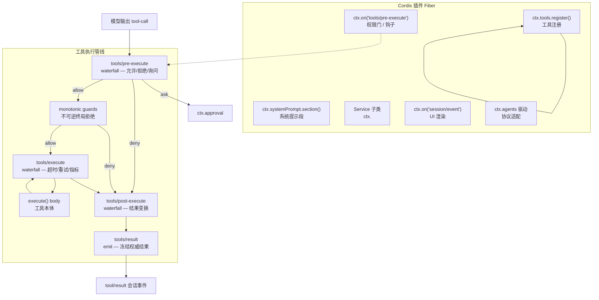
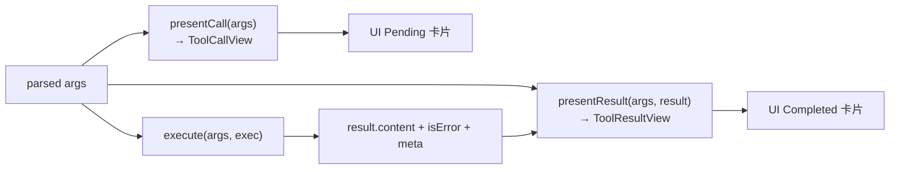
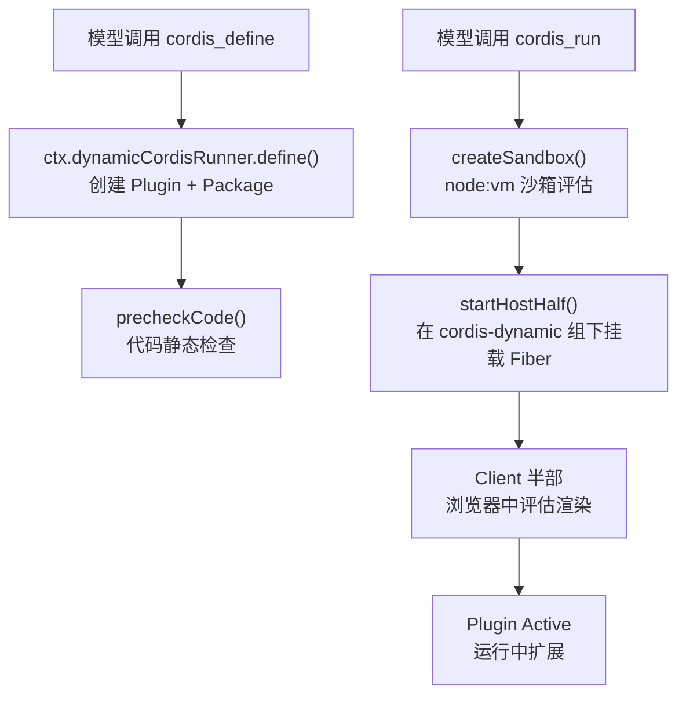

DeepSeek Harness（以下简称 **Harness**）采用 Cordis 微内核架构，所有产品能力——工具、权限策略、系统提示、UI 渲染、子代理委托——均以插件形式注册在 `ctx` 上，没有任何一行产品代码硬编码在主循环中。本手册从 **扩展点分类**、**插件骨架模式**、**工具管线**、**动态插件运行时** 四个维度，系统性地讲解如何为 Harness 编写扩展。前置阅读：[Cordis 核心概念速览](20-cordis-he-xin-gai-nian-su-lan)。

## 扩展点全景图

Harness 的每一个产品特性都映射到一个文档化的扩展点监听器，而非对 Agent 循环的修改。下面用 Mermaid 展示核心扩展点之间的层次关系与数据流向。



Sources: [tool-execution-pipeline.md](docs/tool-execution-pipeline.md#L1-L63), [extension-cookbook.md](docs/cookbook/extension-cookbook.md#L96-L130)

### 扩展形态对照表

Harness 支持六种核心扩展形态，每种绑定不同的注册机制和生命周期语义。

| 扩展形态 | 注册机制 | `inject` 声明 | 适用场景 |
|---|---|---|---|
| **工具插件** | `ctx.tools.register(defineTool({...}))` | `['tools']` | 模型可调用的操作 |
| **钩子插件** | `ctx.on('tools/pre-execute', ...)` | 按需声明 | 权限门、审计、指标 |
| **服务/能力接缝** | `ctx.plugin(ServiceClass)` 或 `super(ctx, 'name')` | 由消费者声明 | 可替换基础设施（FS、Shell、LLM） |
| **系统提示段** | `ctx.systemPrompt.section(...)` | `['systemPrompt']` | 模型可见上下文 |
| **UI 插件** | `ctx.on('session/event', ...)` | `['agents']` | 浏览器/CLI 渲染与输入驱动 |
| **协议驱动** | 自行管理 `ctx.agents` | `['agents', 'sessions', 'sessionPersistence']` | JSON-RPC、ACP 等外部协议 |

Sources: [extension-cookbook.md](docs/cookbook/extension-cookbook.md#L1-L130), [adding-a-tool.md](docs/cookbook/adding-a-tool.md#L1-L95)

## 插件骨架模式

所有 Cordis 插件遵循统一的三字段约定：`name`、`inject`、`apply`。`name` 是 Fiber 加载诊断中显示的标识；`inject` 声明该插件所需的服务名列表，Cordis 在全部依赖就绪前将插件保持在 PENDING 状态——加载顺序无关，依赖关系决定启动时机；`apply(ctx, config)` 是插件入口，其中所有注册均通过 `ctx.effect()` 包装，使插件 Fiber 卸载时自动回收全部资源。

```ts
import type { Context } from '@deepseek-ai/cordis'
import z from '@deepseek-ai/schemastery'

export const name = 'my-extension'
export const inject = ['tools', 'systemPrompt']

export interface Config {
  maxItems?: number
}

export const Config: z<Config> = z.object({
  maxItems: z.number().min(1).default(100),
})

export function apply(ctx: Context, config: Config): void {
  // config 已被 schemastery 填充所有默认值
  const resolved = config as Required<Config>
  // 所有注册都是 ctx.effect —— HMR 安全
}
```

`inject` 不是一次性启动检查。当所依赖的服务在运行期消失（提供者被卸载或热替换），所有依赖该服务的插件自动卸载，服务恢复时重新加载。这一机制使配置层面的服务替换（如将 `dsh-bash-local` 换成另一个 shell 提供者）能干净地级联重启所有消费者。

Sources: [03-services.md](docs/cordis-tutorial/03-services.md#L1-L99), [adding-a-package.md](docs/cookbook/adding-a-package.md#L1-L119)

## 工具插件开发

### defineTool 基础形态

工具注册通过 `defineTool` 辅助函数完成。它负责从 `parameters` schema 推导类型安全的 `execute` 参数、编译 JSON Schema、验证模型生成的参数。注册基于 effect 语义：卸载插件 Fiber 即注销工具，schema 自动流入系统提示组装。

```ts
import { readFile } from 'node:fs/promises'
import type { Context } from '@deepseek-ai/cordis'
import { defineTool } from '@deepseek-ai/dsh-tools'

export const name = 'my-tool'
export const inject = ['tools']

export function apply(ctx: Context) {
  ctx.tools.register(defineTool({
    name: 'read_file',
    description: 'Read a file from disk.',
    parameters: {
      path: { type: 'string', required: true, description: 'Absolute path' },
      limit: { type: 'number' },   // 默认可选
    },
    output: {
      schema: { type: 'string' },
      render: (_args, value) => [{ type: 'text', text: value }],
    },
    async execute(args, exec) {
      // args 类型从 schema 推导: { path: string; limit?: number }
      // exec 携带不可变标识 + 取消信号
      return readFile(args.path, { encoding: 'utf8', signal: exec.signal })
    },
  }))
}
```

Sources: [adding-a-tool.md](docs/cookbook/adding-a-tool.md#L8-L38), [07-into-the-harness.md](docs/cordis-tutorial/07-into-the-harness.md#L9-L47)

### execute 契约规则

`defineTool` 对 `execute` 的行为施加若干强约束，违反任何一条都会导致管线级别的失败。

| 规则 | 要求 | 违反后果 |
|---|---|---|
| **参数自动验证** | `defineTool` 在 `execute` 前验证类型、必填键、字面量约束 | 非法参数不进入工具本体 |
| **身份不可变** | `exec.callId`、`exec.name`、`exec.arguments`、`exec.token` 冻结 | 注册器拒绝篡改 |
| **单规范返回值** | `execute` 仅返回 `output.schema` 声明的值 | 注册器快照、验证、冻结 |
| **抛出 = isError** | 基础设施失败用 throw；领域结果放入规范值 | 管线捕获并标记 `isError` |
| **取消信号** | 必须 observe `exec.signal` | 长时间运行无法取消 |
| **presentationMeta 纯函数** | 仅从 `args` + `value` 推导，不可执行 I/O | 回放时崩溃 |

Sources: [adding-a-tool.md](docs/cookbook/adding-a-tool.md#L40-L57), [index.ts](packages/core/tools/src/index.ts#L221-L288)

### UI 卡片呈现

工具的 `output.render` 返回模型可见内容；UI 卡片是独立关注点，通过 `presentCall` 和 `presentResult` 两个纯函数声明。这两个方法在 **实时流式** 和 **会话日志回放** 时都会被调用，因此必须仅依赖 `args`（和结果数据），不得读取会话状态、时钟或随机数。



| 卡片类型 | `presentCall` 返回 | 适用场景 |
|---|---|---|
| `generic` | `{ card: 'generic', title, kind?, rawInput?, locations? }` | 默认卡片，适用于大多数工具 |
| `terminal` | `{ card: 'terminal', title, description?, cwd? }` | Shell 命令（tool-bash） |
| `diff` | `{ card: 'diff', title, diffs, locations? }` | 文件创建/修改（tool-fs write/edit） |

Sources: [adding-a-tool.md](docs/cookbook/adding-a-tool.md#L67-L90), [presentation.ts](packages/core/tools/src/presentation.ts#L1-L80)

### 后台任务

当工具需要执行长时间运行工作时，使用 `run_in_background` 模式。需在生产者配置中声明该标志，然后通过 `ctx.jobs.start({ kind, label, owner: exec.agent, run })` 注册。运行时验证所有权和任务控制器可用性后，生产者提供同步 `cancel`、非拒绝的 `done`（在资源清理后结算），以及可选的 `readOutput`（带界限输出格式化）。

Sources: [adding-a-tool.md](docs/cookbook/adding-a-tool.md#L51-L56)

## 钩子与执行管线

### 权限门示例

钩子插件通过事件系统拦截工具执行管线。权限门是最常见的形态：监听 `tools/pre-execute` waterfall，返回类型化决策。

```ts
import type { Context } from '@deepseek-ai/cordis'
import type { PreToolDecision, ToolExecution } from '@deepseek-ai/dsh-tools'

export const name = 'permission-gate'
export const inject = ['tools']

export function apply(ctx: Context) {
  ctx.on('tools/pre-execute', async (exec, next): Promise<PreToolDecision> => {
    if (!(await isAllowed(exec))) {
      return { kind: 'deny', reason: 'Denied by policy.' }
    }
    return next()  // 放行到下一监听器
  })
}
```

`tools/pre-execute` 是一个可重排的策略层。调用 `next()` 将决策委托给链中后续监听器；不调用 `next()` 则否决。利用 `ctx.tools.guard()` 可注册不可逆的终局拒绝——后续监听器无法撤销。

Sources: [extension-cookbook.md](docs/cookbook/extension-cookbook.md#L11-L33), [index.ts](packages/core/tools/src/index.ts#L137-L208)

### 管线扩展点矩阵

| 管线阶段 | 事件 | 模式 | 典型用途 |
|---|---|---|---|
| 执行前 | `tools/pre-execute` | waterfall | 钩子、权限、沙箱策略 |
| 单调守卫 | `ctx.tools.guard()` | 内置 | 终局拒绝策略 |
| 执行环绕 | `tools/execute` | waterfall | 超时、重试、指标 |
| 结果后处理 | `tools/post-execute` | waterfall | 结果变换、附加上下文 |
| 结果观测 | `tools/result` | emit | 审计、持久化捕获 |
| 工具集变更 | `tools/change` | emit | 渐进式披露、ToolSearch |

每个 waterfall 阶段都支持 **Scope 过滤**：Agent 作用域内的监听器仅接收该 Agent 的调用。这一机制由 `@deepseek-ai/dsh-scope` 实现，使子代理委派场景下的策略隔离成为可能。

Sources: [index.ts](packages/core/tools/src/index.ts#L137-L208), [tool-execution-pipeline.md](docs/tool-execution-pipeline.md#L1-L63)

## 服务声明与能力接缝

### Service 子类模式

**能力接缝**（Capability Seam）是 Harness 的可替换能力体系。一个接缝由三部分构成：接口声明包（抽象 `Service` 子类 + 类型合并）、实现包（具体提供者）、消费者包（注入服务）。Shell 三件套是标准模板。

```ts
import { Context, Service } from '@deepseek-ai/cordis'

declare module '@deepseek-ai/cordis' {
  interface Context {
    myEngine: MyEngineService
  }
}

export class MyEngineService extends Service {
  constructor(ctx: Context) {
    super(ctx, 'myEngine')   // 注册为 ctx.myEngine
  }

  // 能力方法...
}

export const name = 'my-engine'
export function apply(ctx: Context) {
  ctx.plugin(MyEngineService)
}
```

类型合并块（`declare module '@deepseek-ai/cordis'`）是编译期工具：它将 `myEngine` 添加到 `Context` 接口，使 `ctx.myEngine` 在所有消费者中通过类型检查。它不生成代码——没有它，服务在运行期仍能工作，但消费者失去类型安全。

Sources: [03-services.md](docs/cordis-tutorial/03-services.md#L8-L72), [shell/src/index.ts](packages/shell/shell/src/index.ts#L1-L60), [service.md](docs/cordis-api/service.md#L1-L80)

### 接缝角色命名约定

Harness 维护一套严格的角色命名规范，保证一个包名能诚实描述其责任。`pnpm run constraints` 会校验这些约定。

| 词汇 | 使用条件 | 不使用条件 |
|---|---|---|
| `Provider` | 提供一种能力实现（加机制/供应商限定词） | 它是能力定义、提供者注册表、或消费者运行时 |
| `Backend` | 在定义接口后实现可替换的底层持久化/传输/执行 | 它是面向用户的服务 |
| `Registry` | 拥有动态命名注册集（查找、去重、生命周期、回收） | 主要契约是分发、执行、策略 |
| `Policy` | 决定允许/选择/限制/观察什么 | 它执行该决策所允许的机制 |
| `Gateway` | 适配进程、网络、RPC 或 API 边界 | 它仅注册同进程服务 |

Sources: [adding-a-package.md](docs/cookbook/adding-a-package.md#L50-L71)

## 系统提示扩展

系统提示通过 `ctx.systemPrompt` 注册表管理，支持三种贡献类型：**Section**（有序文本段）、**Context**（动态模型上下文，快照为 durable user-role 消息）、**Variable**（模板变量插值）。

```ts
export const inject = ['systemPrompt']

export function apply(ctx: Context) {
  ctx.systemPrompt.section({
    name: 'my-guidance',
    order: 120,   // 0 = 人格, 100-199 = 工具指导, 负数在人格之前
    text: 'Always verify your work by running tests.',
  })
}
```

`system-prompt/assemble` 是一个专家级合作式 waterfall：其返回的 assembly 是权威的。监听器作者负责保留活跃的 Code Mode 和结构化输出协议贡献。需要在显示层和执行层保持对齐的工具过滤应优先使用 `ctx.tools.restrict()`。

| 段序号约定 | 内容 |
|---|---|
| `-100` | Harness 身份 |
| `0` | 部署人格（persona） |
| `99` | Code Mode 折叠声明 |
| `100–199` | 按工具的指导段 |
| `115` | Cordis 工具提示（tool-cordis） |

Sources: [system-prompt/src/index.ts](packages/core/system-prompt/src/index.ts#L1-L80), [tool-cordis/src/index.ts](packages/extensions/tool-cordis/src/index.ts#L35-L37)

## UI 插件与会话事件

UI 插件从 `session/event` 事件流中渲染（助手 token 流为 `assistant/chunk`，加上 turn/step 边界和工具活动），并通过 `agent.followup()` / `agent.steer()` 驱动输入。

```ts
import type { Context } from '@deepseek-ai/cordis'
import { createUserMessage } from '@deepseek-ai/dsh-llm'

export const name = 'my-ui'
export const inject = ['agents']

export function apply(ctx: Context) {
  ctx.on('session/event', (_session, event) => {
    if (event.type === 'assistant/chunk' && event.data.chunk.type === 'text-delta') {
      render(event.data.chunk.text)
    }
  })
  // 用户输入 → 驱动 Agent
  onUserInput(text => {
    ctx.agents.get(sessionId)?.followup(createUserMessage({
      content: [{ type: 'text', text }],
      source: { kind: 'user' },
    }))
  })
}
```

为 Web Client 贡献业务行的 UI 插件则注册 `ConversationNodeDefinition` 和 `conversation.chat.node` 键渲染器。每个 Node 关联一个 durable 会话事件族，通过增量构建业务 State 发布类型化 Step 数据。

Sources: [extension-cookbook.md](docs/cookbook/extension-cookbook.md#L36-L61), [adding-a-conversation-node.md](docs/cookbook/adding-a-conversation-node.md#L1-L80)

## LLM 适配器开发

连接新模型提供者需要继承 `LlmAdapter` 并实现 `stream()` 异步生成器。注册是 effect-based（HMR 安全），每个提供者路由一个适配器——重复注册会抛异常。

```ts
class MyAdapter extends LlmAdapter {
  async * stream(options: GenerateOptions): AsyncIterable<StreamChunk> { … }
}

export const name = 'llm-myprovider'
export const inject = ['llm']
export const Config = z.object({ apiKey: z.string(), … })

export function apply(ctx: Context, config: Config) {
  ctx.llm.registerAdapter(['my-provider'], new MyAdapter(…))
}
```

| 协议义务 | 要求 |
|---|---|
| usage/finish 顺序 | 先发 `usage`，再发 `finish`；`finish` 后不发任何内容 |
| 工具调用参数 | `arguments` 始终是原始 JSON 字符串；流式片段作为 `argumentsDelta` |
| block index | 按首次出现的流式顺序分配；同一 block 的所有 delta 复用 |
| 错误处理 | 两条路径：throw（传输/协议失败）或 `finish {kind:'error'\|'aborted'}`（提供者带内失败） |
| 不支持字段 | 抛 `LlmError(..., 'UNSUPPORTED')`，不要静默丢弃 |

Sources: [adding-an-llm-adapter.md](docs/cookbook/adding-an-llm-adapter.md#L1-L44)

## 动态 Cordis 插件运行时

Harness 的独特能力是 **模型驱动的运行期自我修改**。`DynamicCordisRunnerService` 管理 Agent 运行时定义的版本化 Cordis 包，包括其 host 和 browser 半部、人工审批的 Client 激活，以及 Host/Client 调用。



动态插件系统涉及以下核心概念：

| 概念 | 说明 |
|---|---|
| **Plugin** | 稳定标识，绑定到一个会话；包含多个不可变 Package 版本 |
| **Package** | 不可变版本快照，包含 hostCode 和/或 clientCode |
| **Run** | 一次成功的激活尝试，拥有 Fiber 和 Host 方法集 |
| **Host Half** | 在 `node:vm` 沙箱中评估的 host 端代码 |
| **Client Half** | 在浏览器中评估的客户端代码，需人工审批 |
| **Inspect** | 模型在编写代码前查询已加载插件和服务的只读接口 |

Sources: [cordis-host-runner/src/index.ts](packages/extensions/cordis-host-runner/src/index.ts#L44-L200), [registry.ts](packages/extensions/cordis-host-runner/src/registry.ts#L36-L120), [lifecycle.ts](packages/extensions/cordis-host-runner/src/lifecycle.ts#L1-L57), [subsystems/extensions.md](docs/subsystems/extensions.md#L1-L100)

## 工作区包创建清单

新增 `@deepseek-ai/dsh-<name>` 包的完整文件清单。此清单以 bash 和适配器包为模板校验。

### 文件结构

```
packages/<group>/<pkg>/
  package.json     # 从 packages/core/tools 复制，调整 name/description/deps
  tsconfig.json    # extends ../../../tsconfig.base.json, rootDir src, outDir lib/types
  src/index.ts     # 服务默认导出或插件 (name/inject/apply/Config)
  README.md        # 服务 API、事件、扩展点、设计说明
```

### 注册步骤

| 文件 | 修改内容 |
|---|---|
| `tsconfig.host.json` 或 `tsconfig.client.json` | 添加 `{ "path": "./packages/<group>/<pkg>" }` 到 `references` |
| `knip.json` | 仅当包有仓库发现未覆盖的入口点时 |
| `tsconfig.base.json` | 仅新分组时添加 `./packages/<group>/*/src` 通配候选 |

以下由 glob 或包清单发现自动覆盖——无需手动编辑：根 `package.json` workspaces、`tsdown.config.ts`、`.oxlintrc.json`、`scripts/check-workspace-constraints.ts`。

### 验证命令

```sh
pnpm install
pnpm run doc-sync
pnpm run constraints && pnpm run typecheck && pnpm run lint
pnpm run build && pnpm run hygiene
```

Sources: [adding-a-package.md](docs/cookbook/adding-a-package.md#L1-L119)

## cordis.yml 组合配置

所有可运行叶子从 `cordis.yml` 加载其插件树。下面展示一个典型的 ACP Agent 组合，演示从 LLM 适配器到沙箱、工具、子代理的完整堆栈。

```yaml
# LLM 适配器
- id: llm-deepseek
  name: '@deepseek-ai/dsh-llm-deepseek'
  config:
    thinking: enabled
    reasoningEffort: max

# 沙箱策略
- id: sandbox
  name: '@deepseek-ai/dsh-sandbox-local'

- id: sandbox-policy
  name: '@deepseek-ai/dsh-sandbox-policy'
  config:
    mode: workspace-write

# 工具堆栈
- id: tool-fs
  name: '@deepseek-ai/dsh-tool-fs'

- id: tool-bash
  name: '@deepseek-ai/dsh-tool-bash'

# Agent 应用（提供 ctx.agents）
- id: acp-agent
  name: '@deepseek-ai/dsh-acp-demo'
  config:
    provider: deepseek-official
    model: deepseek-v4-pro
```

组合中的 YAML 条目声明了插件依赖图，Cordis 的 `inject` 机制自动解析加载顺序——即使将上面的 `tool-bash` 放在 `sandbox` 之前，结果也相同。

Sources: [acp-agent/cordis.yml](examples/acp-agent/cordis.yml#L1-L193)

## 防御性编程要点

在编写涉及生命周期、并发、子进程或拆卸代码的扩展时，以下硬性规则各自防止一类已发布或差点发布的缺陷。

| 规则 | 原因 |
|---|---|
| **独立报告正交结果** | 进程可能超时且退出码为 0——不要将一个标志嵌套在另一个标志的分支中 |
| **异步状态 ≠ 同步状态** | `followup()` 无单消息完成回调；多个排队的 follow-up 共享 turn 边界 |
| **Dispose 必须到达静止态** | 发出 kill 但在子进程停止前返回会留下孤儿——先关闭监听器再 kill |
| **调度器中包含回调异常** | 用户监听器抛异常不得拒绝其所在的 Promise 或饿死后续监听器 |
| **不向不可信输出暴露环境** | 生成命令获得清洗后的 env（删除 `*KEY*`/`*SECRET*`/`*TOKEN*`） |
| **链接型路径用 unlink** | 符号链接/Windows 连接点用 `lstatSync().isSymbolicLink()` 检查后 `unlinkSync`，避免递归删除跟随链接 |

Sources: [defensive-patterns.md](docs/defensive-patterns.md#L1-L34)

## 后续学习路径

本手册涵盖了扩展开发的核心形态。以下路径引导你进入更具体的领域：

- **深入理解工具管线**：阅读 [工具执行管线](14-gong-ju-zhi-xing-guan-xian) 了解 pre-execute → guard → execute → post-execute → result 的完整生命周期
- **能力接缝架构**：阅读 [能力接缝（Capability Seams）原理](15-neng-li-jie-feng-capability-seams-yuan-li) 理解可替换能力体系的设计哲学
- **Host-Client 通信**：阅读 [Typert API 网关与 Host-Client 通信](22-typert-api-wang-guan-yu-host-client-tong-xin) 了解动态插件的跨进程调用机制
- **工具与配置参考**：阅读 [工具 Schema 与配置目录参考](23-gong-ju-schema-yu-pei-zhi-mu-lu-can-kao) 获取完整的 schema DSL 和配置项清单
- **测试策略**：阅读 [测试策略与分层体系](24-ce-shi-ce-lue-yu-fen-ceng-ti-xi) 了解扩展包的行为测试与覆盖率要求
- **防御性模式**：阅读 [防御性编程模式](25-fang-yu-xing-bian-cheng-mo-shi) 获取完整的生产级防护规则集