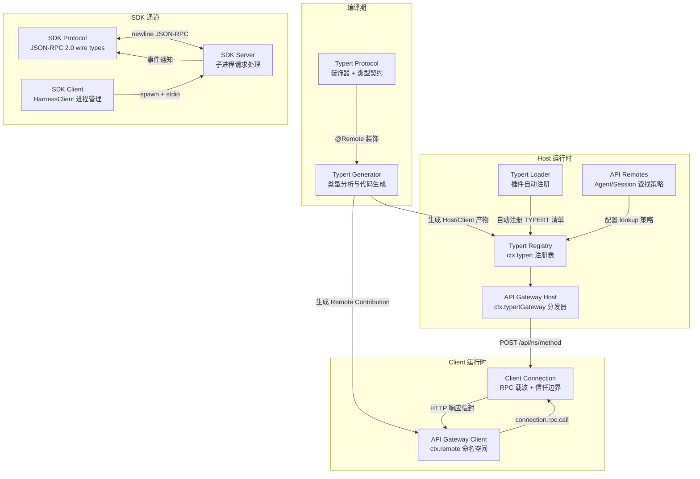
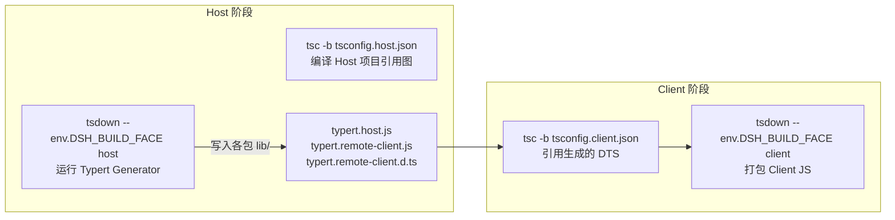
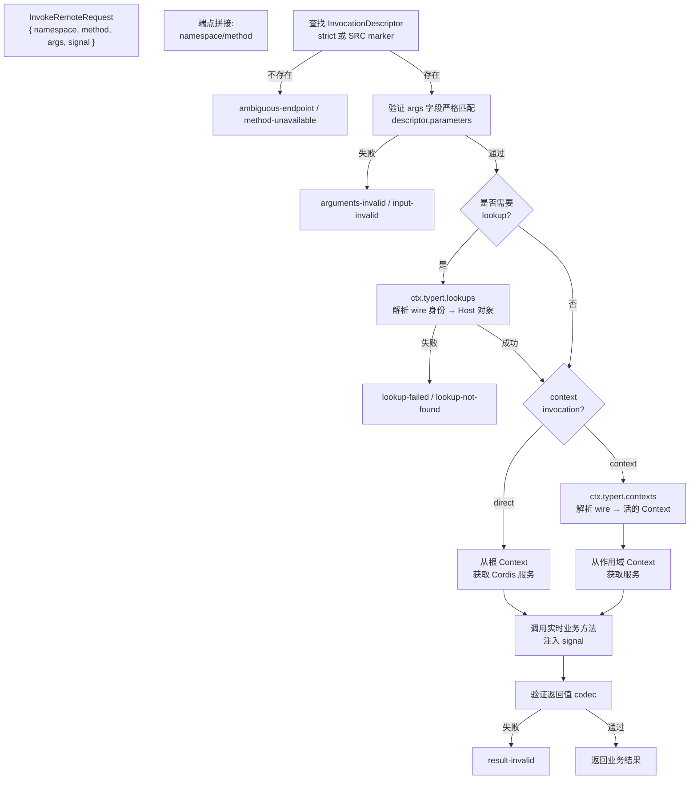
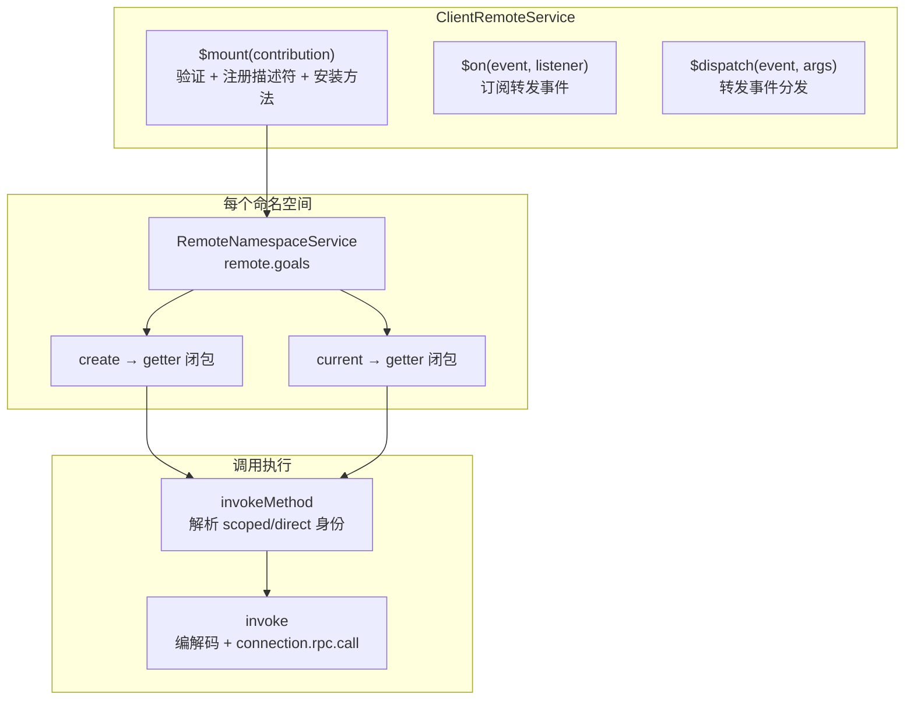
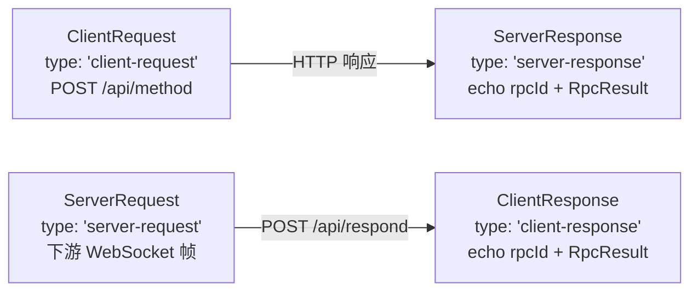

Typert 是 deepseek-harness 中连接 Host 进程与 Client 运行时的类型安全远程调用框架。它通过装饰器声明、编译期严格分析、运行时注册表、以及共享 `/api` RPC 载波，将 Host 侧的业务服务方法以强类型的端点形式暴露给浏览器端和 SDK 端消费者。本页深入解析 Typert 的协议契约层、代码生成管线、运行时分发机制，以及 Host-Client 之间的两种通信通道——Web RPC 载波与 SDK JSON-RPC stdio 协议——揭示从装饰器声明到跨进程调用的完整数据流。

## Typert 四层架构总览

Typert 系统由四个紧密分工的层次组成，每层有明确的编译/运行时归属和不可逾越的边界。



上图中，**Typert Protocol** 提供零依赖的类型契约与装饰器，**Generator** 在 Host 编译期分析签名并生成严格描述符与编解码器，**Registry** 在运行时持有这些描述符，**Gateway** 在 Host 侧解析端点并调用实时 Cordis 服务，**Client Connection** 则是统一的 RPC 载波。SDK 通道通过子进程 stdio 走独立的 JSON-RPC 协议，复用 Host 的 Cordis 上下文但不经过 Typert 网关。

Sources: [api-gateway.md](docs/api-gateway.md#L80-L94), [typert.md](docs/subsystems/typert.md#L1-L19)

## 协议契约层：装饰器与类型映射

### Remote 装饰器声明模型

业务服务通过 `@Remote` 和 `@RemoteScope` 选择暴露给 Client 的方法。这两种装饰器在运行时只记录一个**模块私有 WeakMap 标记**，不做任何 TypeScript 反射——严格类型分析是 Generator 的编译期职责。

| 装饰器 | 语义 | 接收者解析 | 典型用途 |
|---|---|---|---|
| `@Remote('create')` | 直接调用根 Host Context 上的 Cordis 服务 | `invocation.kind: 'direct'` | 全局单例服务方法 |
| `@RemoteScope('agent', 'current')` | 先通过 `ctx.typert.contexts` 解析作用域身份，再从该 Context 获取服务 | `invocation.kind: 'context'` | 依赖 Agent 作用域的方法 |

`TypertRemoteService` 是 Cordis `Service` 的抽象基类，构造时同时完成 Cordis 服务注册和 Typert 命名空间绑定。已有其他基类的服务可改用 `bindTypertRemote(this, serviceKey)` 获得等效绑定。

Sources: [index.ts](packages/typert/protocol/src/index.ts#L82-L216), [types.ts](packages/typert/protocol/src/types.ts#L33-L37)

### Merge-Extensible 类型映射

Typert 使用 TypeScript 的 declaration merging 机制构建四个可扩展的空接口映射表，它们在不同编译面中通过声明合并被逐步填充：

| 映射表 | 填充者 | 作用 |
|---|---|---|
| `TypertLookupMap` | 业务包 Host 面 | 将 Host 对象类型（如 `Agent`）关联到 wire 身份类型（如 `SessionId`） |
| `TypertContextMap` | 业务包 Host 面 | 将作用域 Context 类型关联到 wire 身份类型 |
| `TypertRemoteMap` | Generator 生成的 Client DTS | 直接 Remote 方法的签名扁平端点映射 |
| `TypertRemoteNamespaceMap` | Generator 生成的 Client DTS | `ctx.remote.<namespace>` 的直接命名空间面 |

这种设计意味着 `ctx.remote.goals.create` 的类型完全来自 Generator 产物中的 declaration merge——Host 和 Client 各自的 `ts.Program` 看到的是不同面，但 wire 格式一致。

Sources: [types.ts](packages/typert/protocol/src/types.ts#L33-L121), [api-gateway.md](docs/api-gateway.md#L76-L78)

### InvocationDescriptor：跨越边界的调用描述符

每个 Remote 方法的核心元数据是 `InvocationDescriptor`——它是一个与载波无关的调用描述符，描述了端点身份、接收者选择模式、参数编解码规则和返回值编解码规则。

```ts
interface InvocationDescriptor {
  readonly id: string                    // 全局稳定的生成身份
  readonly service: string               // 拥有该方法的 Cordis 服务键
  readonly namespace: string             // wire 命名空间（默认 = service）
  readonly method: string                // 公共实例方法名
  readonly invocation:                   // 接收者选择模式
    | { readonly kind: 'direct' }
    | { readonly kind: 'context'; readonly context: string; readonly wire: string; readonly codec: TypertCodec }
  readonly parameters: readonly InvocationParameterDescriptor[]
  readonly cancellation?: { readonly parameter: 'signal' }
  readonly result: TypertCodec
}
```

其中每个参数的 `TypertCodec` 有两种模式：**strict**（携带类型符号和 zod schema，用于 Generated 产物）和 **src-json**（仅验证 JSON 安全值，用于 SRC 开发回退）。Cancellation 信号通过 `signal: AbortSignal` 最后参数注入，但不进入 wire `args`——这是一个编译期提取的传输细节。

Sources: [types.ts](packages/typert/protocol/src/types.ts#L172-L211), [typert.md](docs/subsystems/typert.md#L39-L115)

## 编译期严格生成管线

### 双阶段有序构建

根构建按 `build:lib:host` → `build:lib:client` → `build:web` 的顺序执行。Host 阶段先运行 `tsc -b tsconfig.host.json`，再运行 `tsdown --env.DSH_BUILD_FACE host`；Typert Generator 在这个 tsdown pass 中运行，它此时能看到完整 Host 的 `ts.Program`。



每个贡献业务包将生成产物写入自己的 `lib/` 目录而非源码目录。Generator 同时验证包的 `exports` 字段是否正确暴露 `./typert`（Host Loader 入口）和 `./remote`（Host-for-Client 入口）。

Sources: [api-gateway.md](docs/api-gateway.md#L96-L117)

### 生成产物与消费者映射

| 生成文件 | 消费者 | 内容 |
|---|---|---|
| `typert.host.js` | Host Loader (`@deepseek-ai/dsh-typert-loader`) | 运行时反射、严格调用描述符、schema 注册值 |
| `typert.host.d.ts` | Host 类型系统 | Host 面的生成声明 |
| `typert.remote-client.js` | `api-remotes` 组装包 | 可挂载的 `TypertRemoteContribution`（含严格描述符和运行时编解码器） |
| `typert.remote-client.d.ts` | Client 类型系统 | `TypertRemoteNamespaceMap` 和 `TypertRemoteScopeMap` 的 declaration merge |
| `typert.remote-client.d.ts.map` | 编辑器 | 将生成的方法属性映射回 Host 源码中的 `@Remote` 声明 |

`api-remotes` 是唯一具有分裂 TypeScript 面的包：其 Host 项目拥有 Agent/Session 查找策略，而 Client 项目依赖在 Host tsdown 期间为业务包生成的 `/remote` 声明。

Sources: [api-gateway.md](docs/api-gateway.md#L103-L117)

### Generator 的严格约束

严格分析要求 Remote 方法必须满足以下条件，否则编译失败：

- 公开非静态实例方法，有具体实现
- 不能是泛型方法
- 参数必须是必填的命名简单标识符，不支持解构、默认值、rest 参数或可选参数
- 最后一个参数可为 `signal: AbortSignal`（使用全局类型），编译期提取而非进入 wire args

Sources: [api-gateway.md](docs/api-gateway.md#L117)

## Host 运行时：注册表与网关分发

### Typert 注册表四象限

`ctx.typert` 将运行时状态分为四个独立注册表，每个都有 owner-scoped 生命周期管理：

| 注册表 | 存储内容 | 生命周期 |
|---|---|---|
| `local` | 当前环境的调用描述符（Host Loader 自动注册） | Cordis fiber 拥有 |
| `remotes` | Consumer 显式选择的 Remote 贡献 | `$mount` 安装，fiber 拥有 |
| `lookups` | Host 对象查找提供者（wire → 对象） | `register()` 提供默认解析器，`configure()` 可由组合覆盖 |
| `contexts` | 作用域 Context 提供者（wire → 活的 Context） | Host 端 provider + resolver；Client 端 binder |

注册表的一个关键设计是**历史保留**：当一个 lookup provider 卸载后，注册表保留其 `TypertLookupDefinition`（wire 声明），因此 SRC 发现仍然能将该参数分类为 lookup，并以 unavailable 失败而非将 wire 值接受为普通业务对象。

Sources: [service.ts](packages/typert/registry/src/service.ts#L107-L180), [typert.md](docs/subsystems/typert.md#L117-L137)

### Host Gateway 分发流程

`ctx.typertGateway` 是 Host 端的分发器接口，Connection 在解码载波信封后调用它。整个分发过程遵循严格的不缓存原则——每次调用都从当前注册表重新解析描述符和实时服务。



网关的错误分类系统使用闭集 `TypertGatewayErrorCode`，区分基础设施失败（如 `ambiguous-endpoint`、`definition-unavailable`）与边界失败（如 `lookup-failed`、`context-failed`），lookup 策略拒绝和业务异常保留原始身份。

Sources: [typert.md](docs/subsystems/typert.md#L139-L189), [api-gateway.md](docs/api-gateway.md#L119-L130)

### Agent/Session 查找策略

`api-remotes` 包是 Host BFF 的核心策略层，通过 `createApiRemoteAgentResolver` 配置 Agent 和 Session 的 Typert lookup。该解析器的行为遵循三条优先级规则：

1. **活 Agent 优先**：`ctx.agents.get(sessionId)` 命中则直接复用，但检查 subagent 所有权
2. **冷会话恢复**：活 Agent 不存在时，从持久化存储读取会话，执行一次性 resume（通过 `Map<SessionId, Promise<Agent>>` 去重并发恢复请求）
3. **Subagent 隔离**：`origin === 'subagent'` 的会话始终返回 `agent-busy` 错误，强制使用 subagent 投递通道

冷恢复的一个关键设计是：Agent-scope 组合从被恢复会话自身的记录中构建，而非从当前 Host 组合推断。这是因为一个 agent preset 固定了其历史产生的工具集，在另一个组合下重建会重放该 agent 无法再执行的工具调用。

Sources: [agent-lookup.ts](packages/api/remotes/src/agent-lookup.ts#L121-L200)

## Client 运行时：Remote 命名空间与调用路径

### ClientRemoteService 的挂载架构

Client 端的 `ctx.remote` 由 `ClientRemoteService` 实现，它不使用 JavaScript Proxy——每个命名空间是一个被追踪的 `remote.<namespace>` Cordis 子服务，其方法是真实的属性 getter 返回的闭包。



`$mount` 是一个 fiber 拥有的操作：它在调用者的 Cordis fiber 中注册 Remote contribution 到 `ctx.typert.remotes`，然后为每个描述符安装具体方法。安装失败时回滚所有已安装项。卸载时移除描述符和具体方法，中止进行中的调用，并使外部代码保留的过期方法句柄拒绝后续调用。

Sources: [index.ts](packages/api/gateway/src/client/index.ts#L88-L192), [api-gateway.md](docs/api-gateway.md#L56-L78)

### 单次调用的完整数据流

当 Client 代码调用 `ctx.remote.goals.create(agentId, { objective: 'ship it' })` 时，执行路径如下：

1. **Getter 捕获 Context**：属性 getter 返回闭包，捕获当前调用者的 `callerCtx`
2. **参数编解码**：按 `descriptor.parameters` 遍历，每个参数通过其 strict codec 的 `schema.parse()` 验证，构造 `args` 对象（使用 `Object.create(null)` 避免 prototype 污染）
3. **作用域身份注入**：如果有 scoped projection，从 Client Context binder 读取调用者 Context 的身份（如 `agentId`），通过 codec 验证后注入 `args[projection.wire]`
4. **RPC 调用**：`connection.rpc.call('/api', 'goals/create', { args }, signal)` 发起 HTTP POST
5. **结果验证**：Host 返回值通过 `descriptor.result` 的 codec 验证
6. **结果折叠**：成功返回 `{ ok: true, value }`；载波失败（离线、中止、被拒绝的载荷）折叠为 `{ ok: false, error }`——载波异常是调用的结果而非装配故障

Cancellation 信号合并：Client 的 `token.abort.signal`（命名空间生命周期）与调用者可选的 `AbortSignal` 通过 `AbortSignal.any()` 合并，任一触发即中止。

Sources: [index.ts](packages/api/gateway/src/client/index.ts#L356-L415)

## Web RPC 载波：HTTP 与 WebSocket 通道

### `/api` 路由的统一信任边界

所有 `/api` 请求——无论是来自浏览器的 Remote 调用、API Proxy 端点，还是 SDK 的 JSON-RPC 消息——都经过 Connection 的统一信任检查。这个信任围栏防御两条 confused-deputy 路径：

| 威胁向量 | 防御机制 |
|---|---|
| DNS rebinding | Host header fence：每个请求的 Host 必须是 loopback 或 `trustedHosts` 条目，浏览器从攻击者域名发起的请求会在此暴露 |
| 跨站请求（CSRF） | `sec-fetch-site: cross-site` 直接拒绝；`Origin` header 若存在必须与 Host 精确匹配 |

围栏之后，请求进入共享的 `FetchHandler` 按拦截器顺序分发。Typert Gateway 只认领具有严格描述符或活动 SRC marker 的两段式端点（`/api/<namespace>/<method>`）；未认领的请求回退到现有的 API Proxy 处理。

Sources: [api-request-trust.ts](packages/client/connection/src/api-request-trust.ts#L96-L123), [api-gateway.md](docs/api-gateway.md#L121-L130)

### 四象限 RPC 消息模型

`/api` 通道承载的消息形成四成员判别联合——通道与消息解耦，HTTP、WebSocket 和进程内 SSE 是物理载波，逻辑消息与通道无关。



**ClientRequest** 是浏览器发起的一元调用，wire 格式为 `POST /api/<method>` body 包含 `{ type, rpcId, method, payload }`。**ServerRequest** 是 Host 主动发起的帧（审批请求、用户问题等），通过 WebSocket 下游推送，可应答帧重用稳定 rpcId 用于重放。`RpcResult<T>` 是统一的业务成功/失败分支：`{ ok: true; value: T } | { ok: false; error: RpcError }`。

Sources: [rpc.ts](packages/host/apiproxy/src/api/rpc.ts#L107-L194)

### HTTP 桥接与请求体管理

Host 端的 `bridge()` 函数将 `node:http` 请求桥接到 WHATWG Fetch handler。它执行三个关键操作：

- **客户端断连检测**挂在 `ServerResponse` 的 `close` 事件上（而非 `IncomingMessage`，因为 Node 16+ 中 IncomingMessage 的 close 在请求体消费完毕后即触发），配合 `writableEnded` 区分正常结束和客户端断开
- **请求体限制**：默认 160 MiB，针对 base64 展开后的 100 MiB 聚合图片限制加信封开销
- **背压处理**：响应体流式写入时，`res.write()` 返回 `false` 则等待 `drain` 事件，同时监听 `close` 以防中途断连永久阻塞

Sources: [http-bridge.ts](packages/client/connection/src/http-bridge.ts#L32-L99)

### WebSocket 下游：事件流推送

Host 维护两条单向 WebSocket 下游通道：

| 路径 | 内容 | 帧 |
|---|---|---|
| `/api/events.mux` | Mux 多路复用流（会话事件、工具事件等） | `MuxFrame` 类型的 `ServerRequest` |
| `/api/events.host` | Host 帧（全局状态变更） | `HostFrame` 类型的 `ServerRequest` |

这些通道是**纯下行**：Client 消息是协议违规，上游流量始终走 HTTP。`WebSocketDownlinks` 在升级后启动帧泵，将 `ApiProxy` 提供的 `AsyncIterable` 逐帧序列化发送。错误帧携带 `stream/error` 类型，连接断开时 abort 信号取消上游迭代器。

同时，Remote 事件转发是另一个独立机制：Host 组装在 `API_REMOTE_FORWARDED_EVENTS` 中声明转发的事件白名单（如 `commands/change`、`settings/document-updated` 等），通过 `$dispatch` 投递给 `$on` 注册的监听器。该白名单同时约束 `ctx.remote.$on` 的合法键集。

Sources: [websocket-downlink.ts](packages/client/connection/src/websocket-downlink.ts#L51-L138), [remote-events.ts](packages/api/remotes/src/remote-events.ts#L17-L29)

### Client Connection 的重连与就绪握手

`ConnectionController` 是 Client 侧的双流泵管理器。每代连接（generation）执行严格就绪握手：

1. 并行打开 mux 和 host 两条 WebSocket 流
2. 发送 `host.describe` 一元调用验证 HTTP 通道可达性
3. 等待两条流 `onOpen` + describe 成功后触发 `onConnected`
4. `streamOpenTimeoutMs`（默认 3 秒）防止永不触发 `onOpen` 的代理挂死

流泵采用 pull 模式：无人 for-await 则不读 socket，抽头永不触发。Sink 异常隔离确保业务层 throw 不影响泵或重连语义——broken business layer 不会拖垮 connection layer。重连退避使用指数增长加抖动（实际延迟为 cap/2..cap 之间的随机值）。

Sources: [connection.ts](packages/client/connection/src/client/connection.ts#L61-L169)

## SDK 通道：JSON-RPC over stdio

### 协议设计

SDK 通道是 Host-Client 通信的第二条路径，面向程序化 SDK 客户端（Python SDK 和 JS SDK）。它使用换行分隔的 JSON-RPC 2.0 协议，通过子进程的 stdio 传输。

| 层 | 包 | 职责 |
|---|---|---|
| 传输 | `@deepseek-ai/dsh-sdk-protocol/transport` | `JsonRpcLineTransport`：基于 caller-owned streams 的行分隔 JSON-RPC 端点 |
| 类型 | `@deepseek-ai/dsh-sdk-protocol/types` | 三个请求/结果对 + 四个 server→client 通知的 wire 类型 |
| Server | `@deepseek-ai/dsh-sdk-jsonrpc-server` | `HarnessSdkJsonRpcServer`：在已启动的 Cordis 上下文上处理 JSON-RPC 请求 |
| Client | `@deepseek-ai/dsh-sdk-client` | `HarnessClient`：spawn 子进程，管理 stdio，扇出通知 |

`JsonRpcLineTransport` 的帧处理规则：带 `id` + `method` 的是请求，仅 `id` 的是响应，仅 `method` 的是通知。畸形行被忽略；handler 失败变为 `-32603` 错误帧；无 handler 的请求返回 `-32601`。请求支持可选 `AbortSignal`，中止时从 pending 表中移除条目（不为可能永远不会来的响应保留状态）。

Sources: [transport.ts](packages/sdk/protocol/src/transport.ts#L1-L200)

### SDK Server 方法集

`HarnessSdkJsonRpcServer` 在构造时订阅四个 Cordis 事件并将它们转为 server→client 通知：

| 请求方法 | 参数 | 结果 | 语义 |
|---|---|---|---|
| `initialize` | `cwd, provider, model, maxTokens?` | `serverInfo` | 进程级握手，挂载 DeepSeek 回退适配器（仅当未注册时） |
| `session/prompt` | `sessionId, contentBlocks` | `messageId` | 排队用户消息，未知 sessionId 懒创建 agent+session 对 |
| `shutdown` | — | `{}` | 释放 server 拥有的 agent、适配器和订阅到静止 |

| 通知方法 | 触发事件 | 载荷 |
|---|---|---|
| `session.event` | `session/event` | `sessionId` + 完整事件信封 |
| `session.status` | `agent/status` | `sessionId` + `'idle' | 'running'` |
| `subagent.started` | `session/created`（有 parent） | parent + child sessionId |
| `subagent.finished` | `subagent/end`（仅 in-process） | provider, agentId, parent/child, status, stopReason, lastAssistantMessage? |

`prompt` 方法在投递前验证 agent 仍在活动注册表中——agent-loop-only reload 可能处置了循环的 agents 而 record 存活，保留的 agent 会静默接受 followup，因此必须在投递前对照活动注册表验证。

Sources: [server.ts](packages/sdk/server/src/server.ts#L53-L200), [types.ts](packages/sdk/protocol/src/types.ts#L15-L106)

### SDK Client 的进程管理

`HarnessClient` 拥有子进程的完整生命周期。启动时 spawn 运行时进程，在子进程的 stdio 上建立 `JsonRpcLineTransport`。关闭时走私有 **EOF → SIGTERM → SIGKILL** 递进阶梯到静止。

通知订阅模型支持过滤器和异步迭代：每个 `NotificationSubscription` 维护一个队列和等待者列表，`next()` 先检查队列再排队 Promise。运行时死亡时已有通知仍可排空（drain），但新等待者立即拒绝。filter 抛出只影响该订阅（分离后 throw 成为其终止错误），绝不干扰兄弟订阅或传输读循环。

Sources: [client.ts](packages/sdk/client/src/client.ts#L94-L200)

## SRC 开发回退模式

当 Host 通过 `node --import tsx/esm` 从源码启动时，Typert 编译器插件不执行。标准装饰器初始化器仍在模块私有 `WeakMap` 中记录方法名和调用模式，`TypertRemoteService` 或 `bindTypertRemote()` 提供显式命名空间。SRC 回退从实时函数解析简单参数名：参数名匹配已注册 lookup 的 `parameter` 字段（如 `agent` 或 `session`）时使用对应的 wire 字段并在 Host 上解析对象；其他参数仅检查 JSON 安全性。

SRC 仅解决从源码运行的 Host 进程的分发问题。Client 不会从运行中的 Host 发现装饰器，且 Client Remote 拒绝挂载缺乏严格 codec 的 SRC 描述符——其类型、codec 和 Remote 注册值始终来自最近一次生成的产物。

| 模式 | Host 侧 | Client 侧 |
|---|---|---|
| Strict（生产构建） | Generator 生成严格描述符 + zod schema | 挂载 Remote Contribution，codec 验证 |
| SRC（tsx 开发） | WeakMap marker + 参数名弱解析 + JSON 安全检查 | 拒绝 SRC 描述符（无 strict codec） |

Sources: [api-gateway.md](docs/api-gateway.md#L132-L138), [index.ts](packages/typert/protocol/src/index.ts#L224-L269)

## 两种通信通道的对比

| 维度 | Web RPC 载波 | SDK JSON-RPC stdio |
|---|---|---|
| **传输介质** | HTTP POST + WebSocket | 子进程 stdio（换行分隔 JSON） |
| **协议** | 四象限 RPC 消息模型 | JSON-RPC 2.0 |
| **类型安全** | Typert Generator 严格描述符 + zod 编解码 | 手写 wire 类型 |
| **远程调用** | `ctx.remote.<ns>.<method>` | `session/prompt`, `initialize`, `shutdown` |
| **事件推送** | WebSocket 下游 + `$dispatch` 转发 | `session.event`, `session.status` 等通知 |
| **信任边界** | Host header fence + DNS rebinding 防御 + CSRF | 子进程隔离（进程边界即信任边界） |
| **重连** | `ConnectionController` 指数退避 | 进程退出即终止（无重连） |
| **取消** | `AbortSignal` 合并（namespace + caller） | `AbortSignal`（传输级，无服务端取消） |
| **适用场景** | 浏览器 Web UI | 程序化 SDK（Python/JS） |

两条通道复用同一个 Host Cordis 上下文，但服务于截然不同的消费者群体。Web 载波面向需要类型安全远程调用的富前端，SDK 通道面向需要进程编排和事件流订阅的编程客户端。

Sources: [rpc.ts](packages/host/apiproxy/src/api/rpc.ts#L107-L194), [transport.ts](packages/sdk/protocol/src/transport.ts#L1-L62)

## 进一步阅读

- [能力接缝（Capability Seams）原理](15-neng-li-jie-feng-capability-seams-yuan-li) — 理解 Typert 查找和 Context 作为能力接缝的设计哲学
- [Cordis 核心概念速览](20-cordis-he-xin-gai-nian-su-lan) — 深入理解 Service、Context 和 fiber 生命周期如何支撑 Typert 注册表
- [工具 Schema 与配置目录参考](23-gong-ju-schema-yu-pei-zhi-mu-lu-can-kao) — 工具系统的 schema 模式与 Typert 编解码器的关系
- [扩展开发实战手册](21-kuo-zhan-kai-fa-shi-zhan-shou-ce) — 如何为新服务添加 `@Remote` 声明并走完生成管线