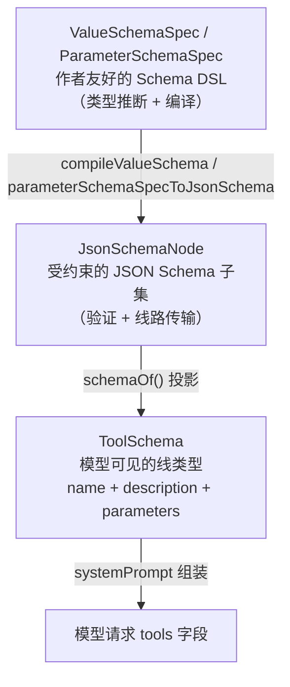
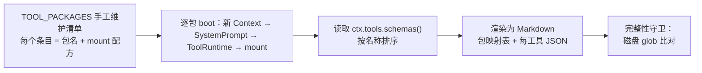
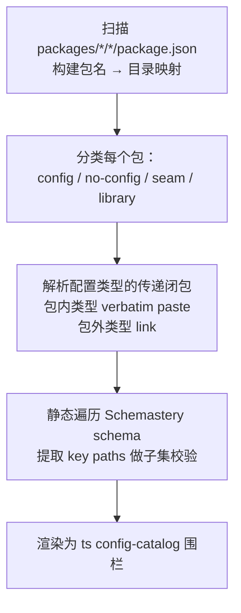
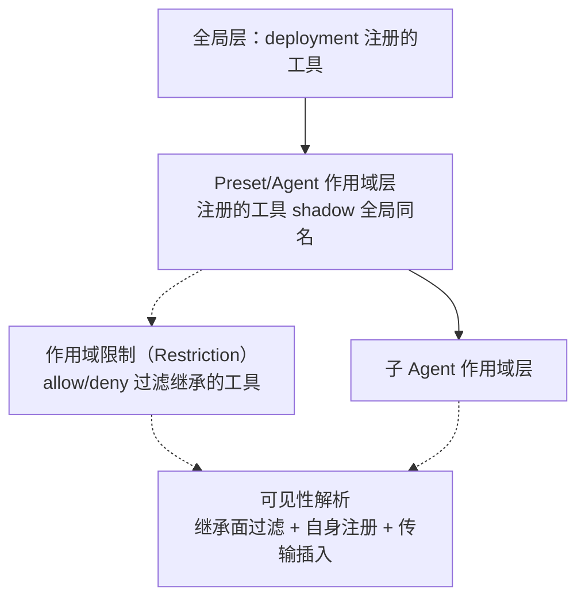

本页系统性地梳理 DeepSeek Harness 中两个核心参考目录——**工具 Schema 目录**（Tool Schema Catalog）与**插件配置目录**（Plugin Config Catalog）——的设计原理、生成机制与查阅方法。两者均为**自动生成文档**，由源代码编译而来，禁止手动编辑；理解它们如何在运行时与编译时被收集和校验，是高效开发与调试工具插件、编写 `cordis.yml` 配置树的关键前提。

## 两大目录的设计定位

DeepSeek Harness 将"模型可见的工具描述"和"部署可配的插件参数"分别维护为两份独立但互补的生成目录。这种分离源于一个架构决策：工具的 JSON Schema 不是静态的字面量，而是运行时注册的结果；而插件配置的 TypeScript 类型声明则是编译时可分析的结构。

| 维度 | 工具 Schema 目录 | 插件配置目录 |
| --- | --- | --- |
| **输出文件** | `docs/tool-catalog.md` | `docs/config-catalog.md` |
| **生成脚本** | `scripts/gen-tool-catalog.ts` | `scripts/gen-config-catalog.ts` |
| **采集方式** | **运行时启动**：每个工具插件在真实 Context 上 boot，读取 `ctx.tools.schemas()` | **源码 AST 分析**：静态遍历每个包的入口文件，提取配置类型声明 |
| **核心内容** | 每个工具的 `name`、`description`、JSON Schema `parameters` | 每个插件包的 `Config` 接口声明，含 JSDoc 注释与依赖类型 |
| **校验命令** | `pnpm run verify-tool-catalog` | `pnpm run verify-config-catalog` |
| **完整性保证** | manifest 与磁盘上所有 `tool-*` 包做 glob 比对 | 每个包必须被分类，引用类型必须可解析 |

Sources: [tool-catalog.md](docs/tool-catalog.md#L1-L11), [config-catalog.md](docs/config-catalog.md#L1-L10)

## 工具 Schema 体系：从声明到模型可见

### 三层类型架构

工具的 Schema 定义跨越三个类型层次，每一层服务于不同的消费者：



最底层是 **`ToolSchema`**——模型在 API 请求 `tools` 字段中看到的线类型，仅包含三个字段：

```typescript
export interface ToolSchema {
  name: string
  description: string
  parameters: Record<string, unknown>
}
```

它被定义在 `@deepseek-ai/dsh-llm` 中（而非 `dsh-tools`），因为它同时也是 `GenerateOptions` 的一部分，是适配器层和系统提示组装的共同消费者。

Sources: [types.ts](packages/llm/llm/src/types.ts#L306-L317), [index.ts](packages/core/tools/src/index.ts#L1-L30)

### 统一 JSON Schema DSL

中间层是 `JsonSchemaNode`——一个**受约束的 JSON Schema 子集**，接受任意 JSON 根、纯注释的 `json` 类型、单一标量 `type`、对象 `properties`/`required`/`additionalProperties`、数组 `items`、类型正确的标量 `enum`/`const`，以及精确单选的 `oneOf`。不在该子集中的关键字会被**直接拒绝**而非被静默接受。

顶层是**作者友好的 Schema DSL**（`ValueSchemaSpec`），它是 `defineTool()` 的输入语言：

| DSL 类型节点 | 支持的约束 | JSON Schema 投影 |
| --- | --- | --- |
| `string` | `enum`, `const` | `{ type: 'string', enum?, const? }` |
| `number` / `integer` | `enum`, `const` | `{ type: 'number'/'integer', enum?, const? }` |
| `boolean` | `enum`, `const` | `{ type: 'boolean', enum?, const? }` |
| `null` | `enum`, `const` | `{ type: 'null' }` |
| `array` | `items: ValueSchemaSpec` | `{ type: 'array', items? }` |
| `object` | `properties`, `additionalProperties`（**强制显式声明**） | `{ type: 'object', properties?, additionalProperties }` |
| `json` | 无（仅注解） | 空节点（接受任意 JSON） |
| `oneOf` | ≥2 个分支 | `{ oneOf: [...] }` |

所有节点共享一组**注解字段**：`description`、`title`、`default`、`examples`。这些注解仅用于文档和 UI 展示，不参与验证。

Sources: [schema.ts](packages/core/tools/src/schema.ts#L1-L107), [json-schema.ts](packages/core/tools/src/json-schema.ts#L1-L56)

### `defineTool()`：从声明到注册就绪

`defineTool()` 是第一方工具的标准创建入口。它将参数推断（`InferArgs<S>`）、输出类型推断（`InferValue<O>`）和 JSON Schema 编译绑定为一步：

```typescript
defineTool({
  name: 'ask_user_question',
  description: '...',
  parameters: {
    questions: {
      type: 'array',
      required: true,           // ← per-property requiredness
      description: 'Questions to ask the user before continuing.',
      items: {
        type: 'object',
        additionalProperties: true,  // ← 强制显式声明
        properties: { ... }
      },
    },
  },
  output: {
    schema: { type: 'object', additionalProperties: false, properties: { ... } },
    render: (_args, value) => [{ type: 'text', text: JSON.stringify(value) }],
  },
  async execute(args, exec) { ... },
})
```

`defineTool` 内部依次执行三步编译：`parameterSchemaSpecToJsonSchema(options.parameters)` 生成参数 Schema，`valueSchemaSpecToJsonSchema(options.output.schema)` 生成输出 Schema，最后构造一个 `ToolDefinition` 对象，其 `execute` 方法会先通过 `validate(args)` 做参数校验，校验失败时抛出 `ToolArgsError`。

Sources: [schema.ts](packages/core/tools/src/schema.ts#L538-L617), [tool-ask-user/index.ts](packages/interaction/tool-ask-user/src/index.ts#L19-L80)

### `ToolDefinition` 的完整结构

`ToolDefinition` 继承 `ToolSchema`，增加了注册表所需的全部执行契约。下表列出每个字段的用途与模型可见性：

| 字段 | 用途 | 模型可见？ |
| --- | --- | --- |
| `name` | 工具唯一标识 | ✅ 通过 `schemas()` 投影 |
| `description` | 模型可读的工具说明 | ✅ |
| `parameters` | JSON Schema 参数对象 | ✅ |
| `output.schema` | 输出值的 JSON Schema 约束 | ❌ 仅注册表验证 |
| `output.render` | 纯投影：从参数 + 值 → 模型内容块 | ❌ |
| `execute(args, exec)` | 异步执行体，返回规范化的 lossless JSON 值 | ❌ |
| `timeoutMs` | 协作式超时预算 | ❌ 由超时策略插件执行 |
| `isConcurrencySafe(args)` | 并行调度分类器（仅 `true` 入选） | ❌ |
| `finalizeContent(exec, result)` | 最后一英里内容变换 | ❌ |
| `presentCall(args)` | UI 挂起态呈现意图 | ❌ |
| `presentResult(args, result)` | UI 完成态呈现意图 | ❌ |

**关键设计决策**：`schemas()` 方法仅投影 `name`、`description`、`parameters` 三个字段到模型可见的 `ToolSchema[]`。`timeoutMs`、`isConcurrencySafe`、`presentCall` 等元数据永远不暴露给模型。

Sources: [index.ts](packages/core/tools/src/index.ts#L221-L302), [presentation.ts](packages/core/tools/src/presentation.ts#L1-L100)

## 工具 Schema 目录的生成机制

### 为什么需要运行时 boot

工具的 JSON Schema **不是静态字面量**。一个工具的参数 schema 可能受到加载时配置的影响——例如 `tool-subagent` 的注册名称 `toolName` 是可配置的，`tool-fs` 的 `read_image` 参数仅在 `ctx.attachments` 存在时才注册。因此，目录生成器必须**实际启动每个工具插件**，在真实 Context 上读取 `ctx.tools.schemas()`。



### `ToolPackage` 清单与完整性守卫

生成器维护一个手工编排的 `TOOL_PACKAGES` 数组，每个条目包含：

- `pkg`：npm 包名（如 `@deepseek-ai/dsh-tool-bash`）
- `dir`：`packages/` 下的叶子目录名（完整性守卫的匹配键）
- `source`：实现源文件路径（每个工具一段）
- `requires`：该工具运行时需要的服务键（如 `ctx.tools`, `ctx.shell`）
- `writes`：该工具写入的会话事件（如 `tool/call`, `tool/result`）
- `mount`：boot 配方——挂载所需的服务接缝 + 工具插件本身
- `note`：boot 无法显示的部署说明

完整性守卫 `assertManifestComplete` 对 `packages/*/*/` 下所有 `tool-*` 目录做 glob 扫描，与清单中的 `dir` 字段逐一比对。任何遗漏或多余都会触发 hard error。

Sources: [gen-tool-catalog.ts](scripts/gen-tool-catalog.ts#L140-L200), [gen-tool-catalog.ts](scripts/gen-tool-catalog.ts#L616-L660)

### 目录结构：包映射表 + 逐工具 Schema

生成的 `docs/tool-catalog.md` 分为两部分：

**包映射表**将模型可见的工具名称连接到插件包与服务接缝：

| 工具包 | 模型可见名称 | 依赖 | 写入/影响 | 部署说明 |
| --- | --- | --- | --- | --- |
| `@deepseek-ai/dsh-tool-ask-user` | `ask_user_question` | `ctx.tools`, `ctx.userQuestions` | `tool/call`, `tool/result` | 暂停工具调用直到 UI 返回人类回答 |
| `@deepseek-ai/dsh-tools` | `run_code` | `ctx.tools`, `ctx.codeRuntime`, `ctx.systemPrompt` | `tool/call`, `tool/code-dispatch-*`, `tool/result` | Code Mode 的保留传输 |
| `@deepseek-ai/dsh-tool-bash` | `bash` | `ctx.tools`, `ctx.shell`, `ctx.systemPrompt`, `ctx.shellEnv` | `tool/call`, `tool/result` | bash 执行器接缝的模型消费端 |
| `@deepseek-ai/dsh-tool-fs` | `edit`, `read`, `read_image`, `write` | `ctx.tools`, `ctx.fs`, `ctx.systemPrompt`, `ctx.attachments` | `tool/call`, `fs/*`, `tool/result` | `read_image` 需附件存储 |
| `@deepseek-ai/dsh-tool-subagent` | `subagent` | `ctx.tools`, `ctx.subagents`, `ctx.systemPrompt` | `tool/call`, `tool/result`, 子会话事件 | 工具名是可配置的 `toolName` |
| ... | ... | ... | ... | ... |

**逐工具 Schema 段落**为每个工具呈现完整的 JSON Schema 参数、描述文本和源文件链接。

Sources: [tool-catalog.md](docs/tool-catalog.md#L12-L42)

## 配置目录的生成机制

### 源码 AST 分析

与工具目录不同，配置目录采用**纯静态分析**：生成器遍历每个 `packages/*/*/src/index.ts` 入口文件，使用 TypeScript Compiler API 解析配置参数类型声明，并解析其传递依赖的包内类型（verbatim paste）和包外引用（link）。



### 包分类逻辑

生成器镜像 Loader 的 `unwrapExports` 逻辑对每个包分类：

| 分类 | 判定条件 | 目录表现 |
| --- | --- | --- |
| `config` | 默认导出是类/函数且构造器/apply 的第二个参数有类型注解 | 完整配置声明 paste + schema keys |
| `no-config` | 有默认导出或 apply，但无配置参数 | 仅列出包名 |
| `seam` | 默认导出是 `abstract class` | 仅列出类名 |
| `library` | 无默认导出，无 apply 导出 | 仅列出包名 |

### `Requires` 与 `Depends on` 约定

每个配置条目带有两条元信息：

- **`Requires:`** 列出该插件 `inject` 的服务键。其 `cordis.yml` 配置树**必须同时加载这些服务的提供者**。例如 `@deepseek-ai/dsh-agent-loop` 的 Requires 行为 `agents · sessions · llm · tools · systemPrompt`。

- **`Depends on:`** 列出配置声明中引用的包外类型。包内类型被 verbatim paste 到 fence 中；包外类型以链接形式指向其他包的目录条目（如 `[ToolsConfig](#deepseek-aidsh-tools)`）或外部包（如 `Stream (@agentclientprotocol/sdk)`）。

Sources: [config-catalog.md](docs/config-catalog.md#L1-L10), [gen-config-catalog.ts](scripts/gen-config-catalog.ts#L500-L600)

### 配置声明的约束与质量保证

生成器强制执行多项约束，确保目录质量：

| 约束 | 校验内容 | 失败后果 |
| --- | --- | --- |
| **类型名唯一性** | paste 闭包中同名类型不能解析到两个不同声明 | hard error |
| **包内类型不可别名** | 包内相对导入的 `import { X as Y }` 中 `X` 必须等于 `Y` | hard error |
| **JSDoc 完整性** | 每个配置属性必须有非空 JSDoc prose | hard error |
| **Schema 子集校验** | 运行时 schema 的每个 key path 必须出现在类型声明中 | hard error（仅确定性 miss） |
| **显式 .ts 扩展名** | 包内相对导入必须以 `.ts` 结尾 | hard error |

Sources: [gen-config-catalog.ts](scripts/gen-config-catalog.ts#L140-L171), [gen-config-catalog.ts](scripts/gen-config-catalog.ts#L196-L200)

## 工具呈现模式与作用域过滤

### 三种呈现模式

`ToolRuntime` 通过 `mode` 配置控制模型看到的工具形态：

| 模式 | 模型可见内容 | 适用场景 |
| --- | --- | --- |
| `native`（默认） | 每个可见工具的完整 JSON Schema | 标准部署 |
| `code` | 仅 `run_code` + 生成的 SDK 提示段 | 减少工具数量、让模型用代码编排 |
| `both` | native schema + code SDK 并存 | 渐进迁移 |

在 `code` 模式下，模型直接调用 `run_code` 以外的工具会被拒绝为 `UNKNOWN_TOOL`；但 `run_code` SDK 的内部子调度可以调用任何可见工具。

Sources: [index.ts](packages/core/tools/src/index.ts#L650-L674), [index.ts](packages/core/tools/src/index.ts#L980-L1001)

### 作用域与工具可见性

工具注册表采用**分层作用域**模型，通过 `@deepseek-ai/dsh-scope` 实现：



**关键规则**：作用域限制（`tools.restrict()`）只能过滤该作用域**继承**的工具，不能影响该作用域**自身注册**的工具。这确保了委托运行时在子作用域注册的汇报工具不会被能力过滤器剥离。

Sources: [index.ts](packages/core/tools/src/index.ts#L1130-L1193), [index.ts](packages/core/tools/src/index.ts#L1064-L1098)

## 典型配置树与目录查阅实践

### `cordis.yml` 与配置目录的关系

一份 `cordis.yml` 的每个 `config:` 块对应配置目录中的一个条目。以 ACP Agent 示例为例：

```yaml
- id: bash
  name: '@deepseek-ai/dsh-bash-sandbox'
  config:
    timeoutMs: 60000    # ← 查 config-catalog.md 的 @deepseek-ai/dsh-bash-local 条目
```

查阅步骤：

1. 在配置目录中搜索 `@deepseek-ai/dsh-bash-sandbox`
2. 注意 `Depends on: [LocalConfig]`，说明该配置类型是 `@deepseek-ai/dsh-bash-local` 的 `LocalConfig` 的别名
3. 跳转到 `@deepseek-ai/dsh-bash-local` 条目，查看 `LocalConfig` 的完整声明
4. 确认 `timeoutMs` 是可选字段，类型为 `number`，语义为"默认前台超时（毫秒）"

Sources: [cordis.yml](examples/acp-agent/cordis.yml#L37-L40), [config-catalog.md](docs/config-catalog.md#L343-L367)

### 添加新工具时的清单编辑

当新增一个 `packages/*/tool-*` 包时，需要在两处同步更新：

1. **`scripts/gen-tool-catalog.ts` 的 `TOOL_PACKAGES` 数组**中添加一个 `ToolPackage` 条目，包含 `pkg`、`dir`、`source`、`requires`、`writes` 和 `mount` 配方。`mount` 函数必须挂载该工具运行所需的全部服务接缝。

2. 运行 `pnpm run gen-tool-catalog` 重新生成 `docs/tool-catalog.md`。

如果遗漏，完整性守卫会在 CI 中 fail，提示缺少哪个 `tool-*` 包。

Sources: [gen-tool-catalog.ts](scripts/gen-tool-catalog.ts#L179-L200), [gen-tool-catalog.ts](scripts/gen-tool-catalog.ts#L607-L614)

## 下一步阅读

- 深入了解工具从注册到执行的完整流水线：[工具执行管线](14-gong-ju-zhi-xing-guan-xian)
- 理解工具在 Agent 循环中的调度逻辑：[Agent 循环：Turn 与 Step 生命周期](12-agent-xun-huan-turn-yu-step-sheng-ming-zhou-qi)
- 学习如何编写自定义工具插件：[扩展开发实战手册](21-kuo-zhan-kai-fa-shi-zhan-shou-ce)
- 了解工具子系统的完整 API 参考：查阅子系统文档 [Tools](docs/subsystems/tools.md)