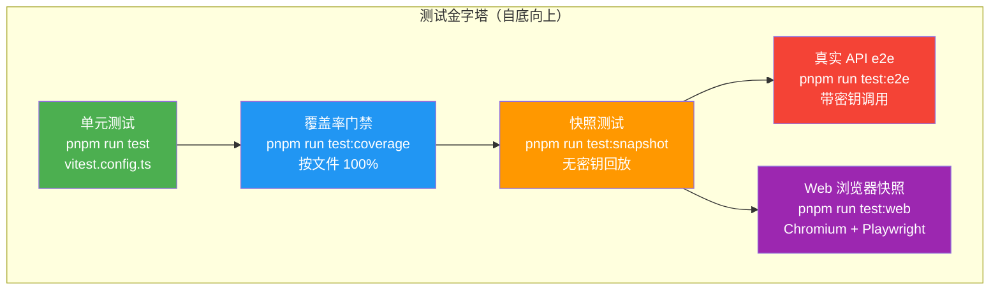
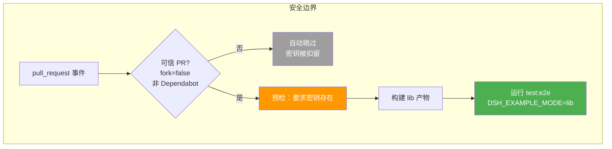
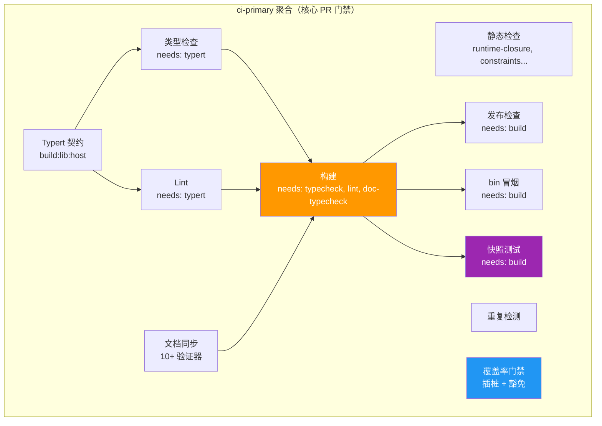
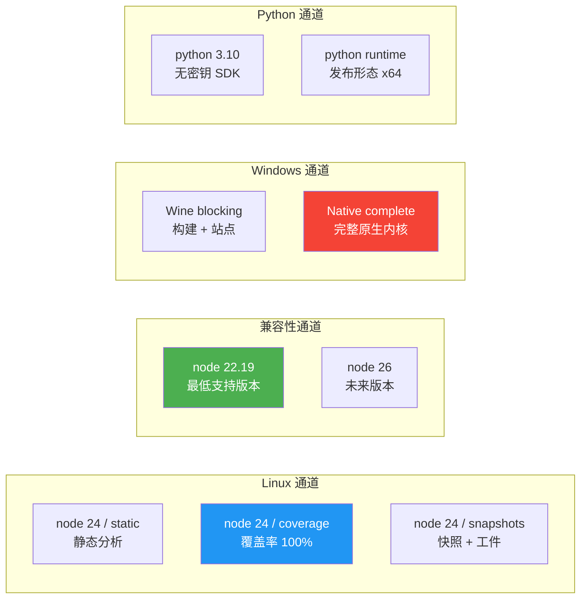
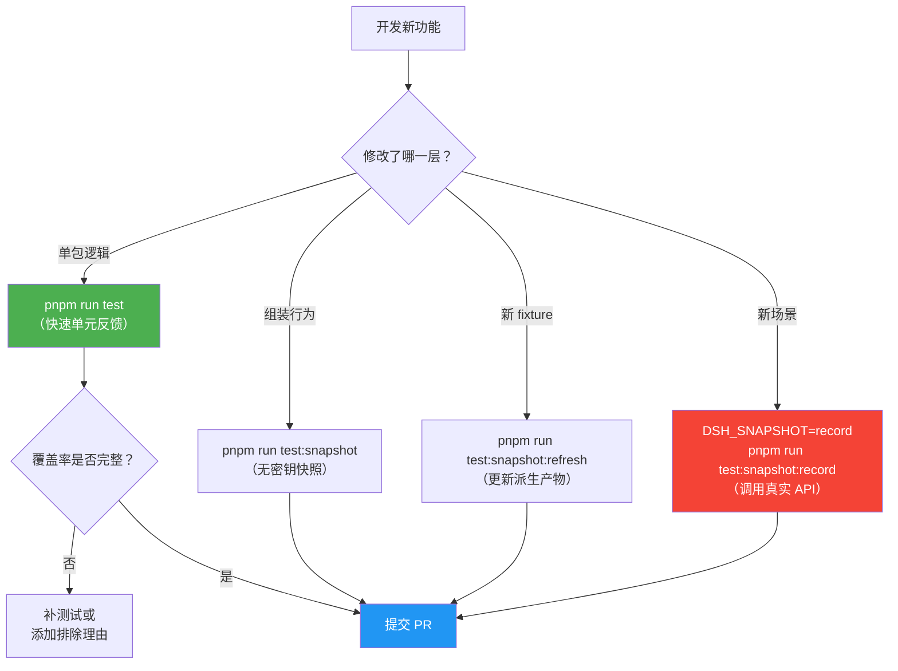

本页面系统梳理 DeepSeek Harness 仓库的分层测试架构、门禁调度机制，以及支撑每一层测试的基础设施。无论你是贡献新功能的开发者还是审查 PR 的维护者，理解这套分层体系都至关重要——它定义了"什么才算真正通过"的工程标准。

## 测试金字塔：五层体系

仓库采用**五个独立的测试层级**，每一层通过独立的 Vitest 配置文件驱动，在 CI 中由不同的门禁作业守护。这种分离确保了快速反馈（单元层）、严格质量（覆盖率层）、真实验证（e2e 层）和无密钥回归保护（快照层）各司其职。

Sources: [vitest.config.ts](vitest.config.ts#L1-L286), [vitest.e2e.config.ts](vitest.e2e.config.ts#L1-L59), [vitest.snapshot.config.ts](vitest.snapshot.config.ts#L1-L69), [vitest.web.config.ts](vitest.web.config.ts#L1-L36)

### 层级一览表

| 层级 | 配置文件 | 命令 | 是否需要密钥 | CI 作业 | 核心目的 |
|------|---------|------|-------------|---------|---------|
| **单元测试** | `vitest.config.ts` | `pnpm run test` | 否 | node 24 / coverage | 验证逻辑正确性 |
| **覆盖率门禁** | `vitest.config.ts --coverage` | `pnpm run test:coverage` | 否 | node 24 / coverage | 按文件 100% 行/分支/函数覆盖率 |
| **快照测试** | `vitest.snapshot.config.ts` | `pnpm run test:snapshot` | 否（record 需要） | node 24 / snapshots | 无密钥回归保护，覆盖组装行为 |
| **真实 API e2e** | `vitest.e2e.config.ts` | `pnpm run test:e2e` | 是 | E2E workflow | 真实模型调用验证 |
| **Web 浏览器快照** | `vitest.web.config.ts` | `pnpm run test:web` | 否（record 需要） | node 24 / snapshots | Chromium 浏览器交互回归 |

Sources: [package.json](package.json#L34-L47), [.github/workflows/ci.yml](.github/workflows/ci.yml#L63-L259), [.github/workflows/e2e.yml](.github/workflows/e2e.yml#L1-L124)

---

## 第一层：单元测试

单元测试是金字塔的基座。Vitest 配置文件将测试文件的发现范围精确限定在四个 glob 模式中，确保测试始终与其所覆盖的代码区域物理相邻。

**测试文件发现范围**决定了"什么算作单元测试"的边界。配置文件中的 `include` 数组仅匹配 `.spec.ts`（或 `.spec.tsx`）后缀——这与 e2e（`.e2e.ts`）和快照（`.snapshot.ts`）形成严格区分。

Sources: [vitest.config.ts](vitest.config.ts#L85-L90)

单元测试采用 **双项目（dual-project）隔离策略**。大部分测试运行在 `thread-safe` 项目中，使用 fork 模式避免 Node 24 中 CJS 词法分析器在 worker 线程上的已知崩溃。少量依赖进程全局状态的测试（如 JSONL 持久化、子进程管理、会话启动）则隔离在 `process-bound` 项目中，确保不互相干扰。

Sources: [vitest.config.ts](vitest.config.ts#L106-L158)

**Windows 平台兼容性**是配置中显式处理的关键问题。Bash 相关的测试套件（`bash-local`、`bash-sandbox`、`tool-bash` 等）在 Windows 上被自动排除，因为 Windows 上没有 POSIX shell。但 PowerShell 相关测试（`pwsh-local`、`tool-pwsh`）保持启用，因为 PowerShell 是 Windows 的原生组件。

Sources: [vitest.config.ts](vitest.config.ts#L21-L46)

### 测试文件命名约定

文件后缀不仅是约定，更是 Vitest 配置的选择器——不同后缀的文件被不同的配置文件捕获，进入不同的 CI 通道：

| 后缀 | 捕获配置 | 场景 |
|------|---------|------|
| `*.spec.ts` / `*.spec.tsx` | `vitest.config.ts` | 纯单元逻辑验证 |
| `*.e2e.ts` | `vitest.e2e.config.ts` | 真实 API 模型调用 |
| `*.snapshot.ts` | `vitest.snapshot.config.ts` / `vitest.web.config.ts` | 组装行为快照回放 |
| `*.compat.spec.ts` | 各配置的 include 手动选择 | Node 版本兼容性冒烟 |
| `*.stress.ts` | `vitest.web-stress.config.ts` | 浏览器性能压力测试（可选） |
| `*.perf.ts` | `vitest.web.perf.config.ts` | 手动诊断指标采集 |

Sources: [vitest.config.ts](vitest.config.ts#L85-L90), [vitest.e2e.config.ts](vitest.e2e.config.ts#L45), [vitest.snapshot.config.ts](vitest.snapshot.config.ts#L47-L54), [vitest.web.config.ts](vitest.web.config.ts#L26-L29)

### 模块解析策略：源码平面

所有 Vitest 配置共享一个关键的解析策略——通过 `vite-tsconfig-paths` 将裸包导入解析到**源码目录**（`src/`），而非通过 `package.json` 的 `exports` 解析到构建产物 `lib/`。这是为了避免陈旧产物加载第二份模块单例，导致单例状态不一致。

Sources: [vitest.config.ts](vitest.config.ts#L15-L19), [docs/testing.md](docs/testing.md#L37-L39)

---

## 第二层：覆盖率门禁

覆盖率门禁是这个仓库质量控制的**硬性底线**。配置采用 v8 provider，对 `packages/*/*/src/**/*.{ts,tsx}` 执行**按文件 100%** 的行、分支、函数和语句覆盖率阈值。

**按文件（perFile）** 而非全局覆盖率是关键设计——一个覆盖率良好的大文件无法"补贴"一个覆盖率不足的小文件。每个文件的每一行都必须被覆盖，否则 PR 无法合并。

Sources: [vitest.config.ts](vitest.config.ts#L269-L279)

### 覆盖率豁免机制

并非所有源码路径都适合在单元层覆盖。配置中维护了一份精确的排除列表，每一项排除都带有**明确的技术理由**：

- **类型文件**（`types.ts`）：只有类型声明，没有运行时代码
- **入口胶水**（`bin.ts`、`worker.ts`）：自执行入口，在单元进程中导入会启动整个进程
- **Windows 专属**（`sandbox-windows-acl`）：在 Linux CI 上无法覆盖的 Win32 代码
- **客户端 GUI 组件**：带 `TODO(gui)` 标注的临时性债务，随客户端测试通道成熟逐步移除

Sources: [vitest.config.ts](vitest.config.ts#L169-L268)

此外，还有一套**覆盖率豁免重型套件**机制。这些套件（如全工作区编译分析、真实子进程 fixture）在覆盖率门禁运行时被排除，但在旁边的并行门禁中以**不插桩**的方式运行。成员规则要求：被豁免的套件中所有被覆盖率度量的文件，都必须已被其他套件完全覆盖，因此排除它们不会改变任何阈值结果。

Sources: [scripts/coverage-exempt.ts](scripts/coverage-exempt.ts#L1-L42)

### 未覆盖位置报告器

覆盖率门禁还配备了一个自定义报告器 `coverage-uncovered-locations.cjs`。当某个文件未达到 100% 时，它输出每一处未覆盖的语句、分支和函数的**精确位置**（`path:line:col`），而 Vitest 内置报告器只给出文件名——后者迫使开发者手动搜索未覆盖的位置。

Sources: [vitest.config.ts](vitest.config.ts#L9-L13), [vitest.config.ts](vitest.config.ts#L280-L282)

---

## 第三层：快照测试

快照测试层提供了**无密钥的回归保护**。其核心理念是：录制真实的模型交互会话，然后在回放模式下重新启动真实子进程路径，对比归一化后的输出。

快照配置支持三种模式，通过环境变量 `DSH_SNAPSHOT` 控制：

| 模式 | 说明 | 并发性 | 是否需要密钥 |
|------|------|--------|-------------|
| **replay** | 回放提交的录制脚本，对比预期输出（默认） | 文件间并行，受 `DSH_SNAPSHOT_MAX_CONCURRENCY` 约束 | 否 |
| **refresh** | 回放提交脚本，重写派生产物 | 串行 | 否 |
| **record** | 调用真实 API，更新录制和预期输出 | 串行 | 是 |

Sources: [vitest.snapshot.config.ts](vitest.snapshot.config.ts#L24-L67)

### LLM 回放引擎

回放引擎（`@deepseek-ai/dsh-llm-replay`）是快照层的核心。它从录制的 `session.jsonl` 文件中提取每次 `stream()` 调用的 `assistant/chunk` 事件，重建为逐次调用的回放脚本。对于嵌套代理场景，多个子会话日志按 `createdAt` 排序，按首次调用顺序绑定到新的活跃会话。

回放引擎还支持 `throw`（在回放前缀块后失败）和 `hang`（模拟流式取消）两种特殊场景，这些无法从普通会话日志中重建，需要通过显式的 override sidecar 文件注入。

Sources: [packages/test-support/llm-replay/src/index.ts](packages/test-support/llm-replay/src/index.ts#L36-L121)

### ACP 协议快照套件

ACP（Agent Client Protocol）快照套件（`@deepseek-ai/dsh-acp-snapshot`）是快照层的另一个关键组件。它启动真实的 automation-server 示例进程，回放录制的会话，对**归一化 JSON-RPC 输出**和**重新持久化的会话日志**执行 diff。每个 header 组合类有且只有一个 pin 场景，固定 tokenized request-header 序列、system-prompt 和 tool-schema sidecar。

Sources: [packages/test-support/acp-snapshot/src/suite.ts](packages/test-support/acp-snapshot/src/suite.ts#L1-L200)

### Web 浏览器快照

Web 快照通道使用 Chromium（通过 Playwright）比较回放后的浏览器输出与 `apps/web/tests/snapshots/` 中的提交快照。CI 强制 `DSH_SNAPSHOT=replay`（只读），绝不写入预期输出。浏览器启动和真实模型轮次很慢，因此文件间串行执行，但单文件内有更高的超时（180 秒测试，120 秒钩子）。

Sources: [vitest.web.config.ts](vitest.web.config.ts#L26-L34)

---

## 第四层：真实 API E2E

E2E 测试层验证 agent 能否对接真实模型正常工作。每一套件在缺少密钥时**自动跳过**，使无密钥 CI 保持绿色。这是 DeepSeek 内部的"推理在这里很便宜"策略——不要吝惜真实 API 测试。

E2E 配置具有区别于单元测试的鲜明特征：

- **慷慨超时**：每测试 120 秒，每钩子 30 秒
- **重试机制**：重试 2 次（真实模型 API 的瞬态抖动）
- **有界并发**：默认最多 4 个文件并行（`DSH_E2E_MAX_WORKERS`），CI 中可提升至 14
- **无覆盖率**：单元层独占覆盖率门禁
- **lib 模式启动**：CI 中以构建后的产物启动示例进程

Sources: [vitest.e2e.config.ts](vitest.e2e.config.ts#L31-L58), [.github/workflows/e2e.yml](.github/workflows/e2e.yml#L107-L123)

### 安全模型

E2E 工作流的安全设计严格区分可信与不可信 PR。Fork PR 和 Dependabot PR 不持有仓库密钥，被跳过执行。密钥缺失不再是"静默跳过"——预检步骤在可信事件中**硬失败**，防止缺少密钥时产生假绿色。

Sources: [.github/workflows/e2e.yml](.github/workflows/e2e.yml#L7-L26), [.github/workflows/e2e.yml](.github/workflows/e2e.yml#L56-L105)

---

## 门禁调度系统

整个测试体系通过一个**有向无环图（DAG）门禁调度器**统一编排。`scripts/run-gates.ts` 定义了多个命名聚合（aggregate），每个聚合包含一组带依赖关系的门禁（gate），调度器在有界并发下执行它们。

Sources: [scripts/run-gates.ts](scripts/run-gates.ts#L256-L284)

### CI 门禁聚合体系

| 聚合模式 | CI 作业 | 包含的关键门禁 |
|---------|--------|--------------|
| `ci-static` | node 24 / static | 运行时闭包、约束检查、包不变量、Cordis 配置、文档同步 |
| `ci-coverage` | node 24 / coverage | 插桩覆盖率门禁 + 豁免重型套件并行 |
| `ci-consumers` | node 24 / snapshots and artifacts | 构建、Node 兼容性、快照、Web 快照、文档类型检查、bin 冒烟 |
| `ci-windows-blocking` | windows / wine blocking | 构建、生产站点构建 |
| `ci-windows-complete` | windows native | 构建后运行完整覆盖率 + 观察性门禁 |
| `ci-windows-observational` | （windows complete 的子集） | 静态检查、lint、publint、包不变量 |

Sources: [scripts/run-gates.ts](scripts/run-gates.ts#L192-L243), [.github/workflows/ci.yml](.github/workflows/ci.yml#L63-L259), [.github/workflows/ci.yml](.github/workflows/ci.yml#L447-L489)

### 覆盖率门禁的双轨调度

覆盖率聚合内部被拆分为两个并行门禁，共享 worker 预算（`DSH_COVERAGE_MAX_WORKERS`）：

1. **插桩门禁**（`DSH_COVERAGE_EXEMPT_HEAVY=1`）：运行除豁免套件外的全部测试，收集 v8 覆盖率，执行 100% 阈值检查
2. **豁免重型套件**：运行编译分析和子进程 fixture 等重量级套件，不插桩，不计算覆盖率

豁免门禁取总预算的 1/3，因为其墙上时间由最长的单个文件主导。

Sources: [scripts/run-gates.ts](scripts/run-gates.ts#L473-L518)

### DAG 调度器核心逻辑

调度器在执行前验证门禁图的完整性：检查重复 ID、未知依赖和循环依赖。执行时采用**贪心 + Promise.race** 策略——优先调度依赖已满足的门禁，当没有可调度的门禁时等待最快的完成者。当一个门禁失败时，依赖它的门禁被标记为 `skipped` 而非执行。

Sources: [scripts/run-gates.ts](scripts/run-gates.ts#L645-L777)

---

## 测试支撑基础设施

仓库维护了一套专门的测试支撑包（`packages/test-support/`），每一层测试都有对应的工具来减少样板代码并确保一致性。

### 测试不变量主机

`scripts/test-invariants.ts` 是整个测试体系的**全局不变量守卫**。它通过拦截 `RegistryService.prototype.plugin`，在每个测试的根 Context 上自动挂载：

1. **不变量注册服务**（`InvariantRegistry`）：全局启用
2. **归属包的不变量 companion**：通过 `import.meta.glob` 懒加载，确保每个包测试只加载自己 owner 的检查
3. **测试附件存储**（`TestAttachmentStore`）：拒绝所有图片操作的存根

普通测试只收到自己归属包的 companion；专用的拓扑测试（`scripts/test-invariants.spec.ts`）加载并执行所有 companion，确保覆盖率仍然观察到每个注册。

Sources: [scripts/test-invariants.ts](scripts/test-invariants.ts#L1-L98), [scripts/test-invariants.ts](scripts/test-invariants.ts#L136-L210)

### Agent Loop 测试工具包

`@deepseek-ai/dsh-agent-loop-testkit` 提供了挂载 AgentLoop 测试前置服务的快捷函数。它故意**不**挂载 AgentLoop 本身或注册适配器，使测试保留对加载顺序和被测拓扑的控制。

Sources: [packages/test-support/agent-loop-testkit/src/index.ts](packages/test-support/agent-loop-testkit/src/index.ts#L1-L47)

### 脚本化 LLM Mock 服务器

`@deepseek-ai/dsh-llm-mock-server` 是一个**可编程的 OpenAI 兼容 HTTP/SSE 服务器**，用于传输协议和语义空响应恢复测试。每个接受的 chat-completions 请求消费一个行为；服务器本身不重试或解释 harness 策略。支持的行为包括 `connection_reset`、`stream_disconnect`、`empty`、`rate_limit`、`success`、`tool_call_success` 等 23 种，以及 `random` 加权随机选择。

Sources: [packages/test-support/llm-mock-server/src/index.ts](packages/test-support/llm-mock-server/src/index.ts#L1-L200)

### 双模式启动器

`@deepseek-ai/dsh-loader-smoke` 提供了所有示例子进程共享的**双模式启动解析器**（`resolveExampleLaunch`）：

- **src 模式**：通过 `tsx` 运行 TypeScript 源码，设置 `TSX_TSCONFIG_PATH` 使工作区导入解析到源码——零构建开发路径
- **lib 模式**：通过普通 Node 运行构建后的 `lib/`，裸包导入通过真实 `exports` 解析——消费者实际运行的形态

CI 的 `DSH_EXAMPLE_MODE=lib` 强制使用 lib 模式，确保测试覆盖消费者真实使用的构建产物。

Sources: [packages/test-support/loader-smoke/src/index.ts](packages/test-support/loader-smoke/src/index.ts#L30-L122)

### 共享 Vitest 插件

`vitest.shared.ts` 导出两个被所有配置共享的组件：

- **`vitestExecArgv`**：`--no-webstorage` 标志，防止进程级 Web Storage 遮蔽 jsdom 存储
- **`standardDecoratorPlugin`**：在 Vite 默认解析器之前转译标准 TypeScript 装饰器，并在编译器合成的装饰器访问器上自动注入 `/* v8 ignore next */` 注释，避免覆盖率的噪声

Sources: [vitest.shared.ts](vitest.shared.ts#L1-L43)

---

## 核心测试原则

仓库的测试策略建立在六条不可妥协的原则之上。这些原则定义了"什么才算真正的覆盖"，超越了对行数的机械追求。

### 原则一：优先使用真实实现，而非 Mock

只 mock 开销高或不确定的边界（LLM 适配器、网络、时钟），下游一切保持真实。手写替身只能证明桥接层在搬运字节，不能证明交付的工具行为符合断言。桥接工具调用测试使用脚本化的 mock 模型，但工具和执行器是真实的。

恢复测试按步骤区分分片前与分片后的失败，覆盖耗尽、取消、策略组合、持久化、协议计数等边界。

Sources: [docs/testing.md](docs/testing.md#L21-L25)

### 原则二：验证外部世界，而非自我报告

E2E 断言应重新运行命令或从外部重新读取文件。对 agent 自身输出的关键词探测会让作弊的 agent 通过——正确的做法是检查文件是否被创建、命令是否产生了预期的副作用。断言未修改的文件逐字节一致。每个 E2E 测试自行管理资源：在 `afterEach` 中 dispose（即使失败/重试/超时也要执行）。

Sources: [docs/testing.md](docs/testing.md#L27-L29)

### 原则三：测试真实入口路径

"真实入口路径"指**已发布的产物**，而非开发时的源码入口。包的 `bin` 所运行的是构建后的 `lib/bin.js`，由普通 `node` 执行，从而暴露 `tsx` 会掩盖的失败（结算竞态、模块解析、被吞掉的加载失败）。

**真实组合测试**要求产品可见的插件必须有一个非单元的、通过 Loader 启动测试专用 `cordis.yml` 的组合测试。手动构建的 `ctx.plugin(...)` 套件不够。

Sources: [docs/testing.md](docs/testing.md#L31-L35)

### 原则四：快照测试的触发条件

每项非平凡的**模型可见、协议可见或人类可见**变更，都必须在同一 PR 中通过可运行示例的快照套件添加或更新无密钥场景。包测试、E2E 断言、mock 组合和 PR 理由都不能取代组装后的 transcript。

Sources: [docs/testing.md](docs/testing.md#L47-L50)

### 原则五：子进程启动模式

CI 和有构建产物的测试通道通过共享双模式启动器从构建后的 `lib/` 运行每个子进程。不要为这些子进程手写 `--import tsx`。不加载 Cordis 的协议 fixture 直接用 Node 运行 `.ts`。只有测试对象本身是源码路径解析时才可以选择 `src` 模式。

Sources: [docs/testing.md](docs/testing.md#L41-L45)

### 原则六：HMR 安全测试

每个注册表（registry）都必须有一个 HMR 安全测试：dispose 贡献的 fiber，断言清理。这确保插件可以在运行时被安全卸载和重新加载。

Sources: [docs/testing.md](docs/testing.md#L9)

---

## 跨平台 CI 矩阵

仓库在 CI 中维护了一套**多层跨平台验证矩阵**，针对不同操作系统和 Node 版本提供不同级别的信号。

Sources: [.github/workflows/ci.yml](.github/workflows/ci.yml#L63-L259), [.github/workflows/ci.yml](.github/workflows/ci.yml#L260-L297), [.github/workflows/ci.yml](.github/workflows/ci.yml#L298-L327), [.github/workflows/ci.yml](.github/workflows/ci.yml#L338-L456)

### Windows 验证的三个层级

Windows 测试采用**三级保真度策略**，以在 CI 成本和信号质量之间取得平衡：

| 层级 | 运行环境 | 信号类型 | 门禁 |
|------|---------|---------|------|
| **Wine blocking** | Linux + Wine | 阻塞（必需） | 构建通过、站点构建通过 |
| **Windows native** | 真实 Windows | 阻塞 + 观察 | 完整覆盖率 + 全部门禁（非阻塞） |
| **Windows observ.** | 真实 Windows | 观察（非阻塞） | lint、publint、包不变量 |

Wine 层在标准 Linux 托管运行器上用模拟的 Windows 内核验证两个最关键的表面（构建和站点），耗时约 15 分钟。原生 Windows 层则在真实 Windows 上运行完整的不变量清单，但其结果**不**纳入 `all-checks-passed` 判定——它提供信号但不延迟 PR。

Sources: [.github/workflows/ci.yml](.github/workflows/ci.yml#L328-L456)

### 故障转移机制

仓库实现了**双开关故障转移**设计。通过仓库变量（非 PR 可编辑的仓库状态）而非合并代码来切换：

- `DSH_CI_FAILOVER_LINUX=selfhosted`：将三个必需 Linux 作业重定向到自建 VM 池
- `DSH_CI_FAILOVER_WINDOWS=selfhosted`：将 Windows 作业重定向到自建 Windows 池

自建池的就绪状态由 master 分支每次推送时的**热备演练**（`serial-linux-selfhosted`）持续验证。

Sources: [.github/workflows/ci.yml](.github/workflows/ci.yml#L49-L62), [.github/workflows/ci.yml](.github/workflows/ci.yml#L574-L598)

---

## 本地开发工作流

在日常开发中，你可以根据当前任务的粒度选择不同的测试命令组合：

| 本地命令 | 说明 | 预期耗时 |
|---------|------|---------|
| `pnpm run test` | 全部单元测试 | 约 30-60 秒 |
| `pnpm run test:coverage` | 单元测试 + 100% 覆盖率门禁 | 约 2-5 分钟 |
| `pnpm run test:snapshot` | 快照回放（无密钥） | 约 2-5 分钟 |
| `pnpm run test:snapshot:refresh` | 回放并更新派生产物 | 约 2-5 分钟 |
| `pnpm run check:all` | 完整本地门禁（含构建） | 约 10-20 分钟 |

Sources: [package.json](package.json#L34-L51)

---

## 与其他页面的关系

测试策略与分层体系涉及多个架构主题。要深入理解 Agent Loop 测试的具体模式，请参阅 [Agent 循环：Turn 与 Step 生命周期](12-agent-xun-huan-turn-yu-step-sheng-ming-zhou-qi)。覆盖率排除列表中的沙箱相关包，其架构设计详见 [文件系统与会话沙箱](16-wen-jian-xi-tong-yu-hui-hua-sha-xiang)。测试中使用的 LLM Mock 和回放基础设施，其底层适配器设计见 [LLM 流式协议与适配器](18-llm-liu-shi-xie-yi-yu-gua-pei-qi)。当测试涉及防御性编程模式（如 `unwrapExports` 断言、不变量注册）时，请参阅 [防御性编程模式](25-fang-yu-xing-bian-cheng-mo-shi)。