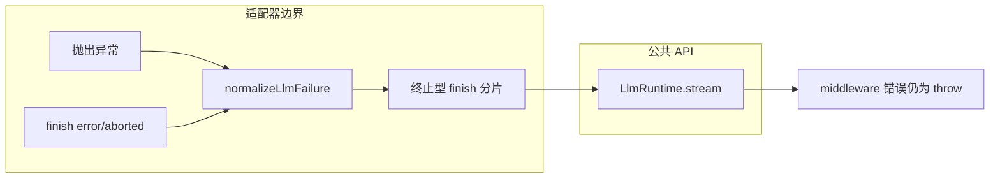
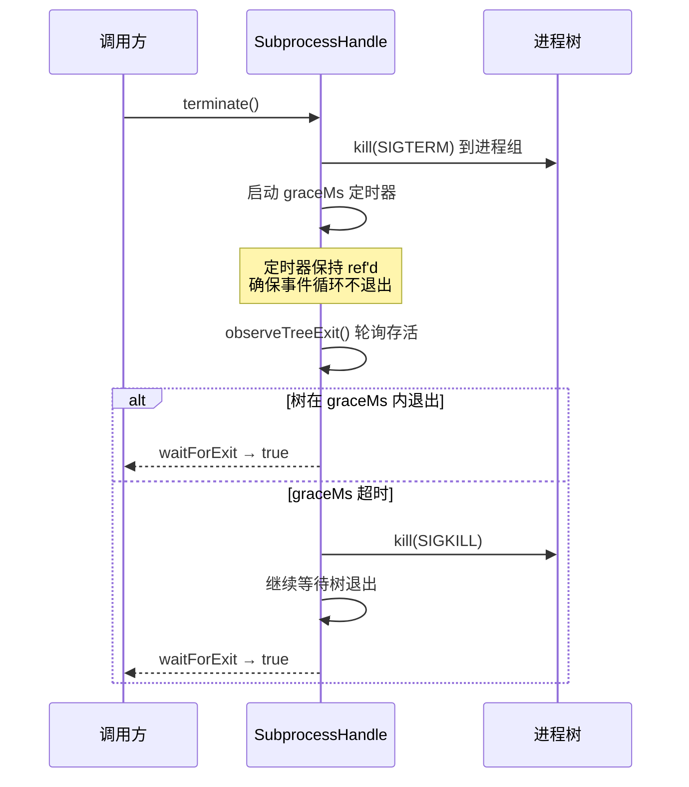
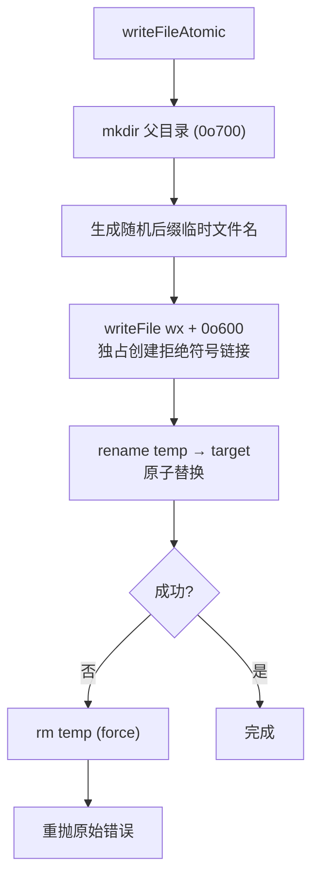
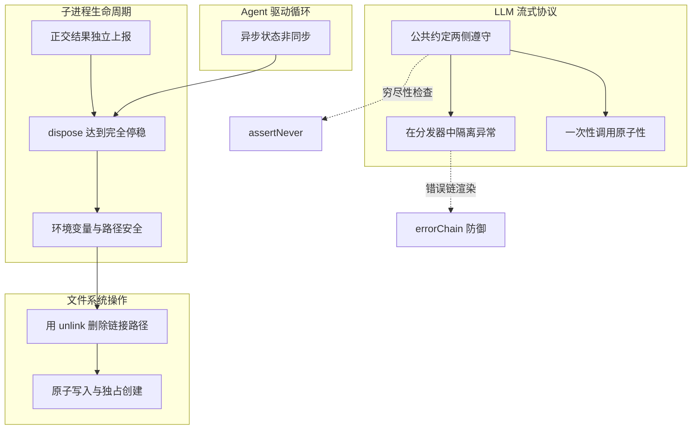

每一条防御性规则都不是凭空想象的最佳实践——它们是本项目实际发布或险些发布的缺陷类别，以防止其复发的纪律形式记录下来。在编写生命周期、并发、子进程或资源清理代码之前，理解这些模式可以从源头上消除整类 bug。

本文档以 **Diátaxis 四象限中的 Explanation（解释）** 定位：重点不是"怎么做"，而是"为什么必须这样做"——每条规则都关联到具体的代码实现和曾经发生的故障，使你在遇到相似场景时能识别风险并应用正确的防御策略。测试层面的对应规则（真实入口路径、验证世界而非自我报告）参见 [测试策略与分层体系](24-ce-shi-ce-lue-yu-fen-ceng-ti-xi)。

## 模式总览

| 模式 | 核心风险 | 关键代码位置 |
|------|---------|-------------|
| 正交结果独立上报 | 多维事实被折叠成一个标志 | `SubprocessOutcome` 类型 |
| 公共约定两侧都要遵守 | 内部表示差异泄漏到公共 API | `LlmRuntime.adapterStream` |
| 异步状态不是同步状态 | 异步竞态被当作同步结果使用 | `ReactLoopAgent` 阶段机 |
| dispose 必须达到完全停稳 | 清理只请求停止但不等待停稳 | `spawnSubprocess` 终止升级 |
| 在分发器中隔离回调异常 | 一个坏订阅者破坏整个生命周期 | `emitAdaptersUpdated` |
| 不暴露环境变量或可预测路径 | 凭证泄漏与符号链接攻击 | `scrubbedParentEnv` + spill 存储 |
| 用 unlink 删除链接形态的路径 | 递归删除跟随符号链接 | `writeFileAtomic` + spill 清理 |

## 正交结果独立上报

一个结果可以**同时具有多种性质**。进程可能已经超时，却仍以退出码 0 结束——因为它捕获了终止信号。如果将超时标志的上报嵌套在退出码分支内部，调用方就会把一个被截断的运行读成干净的成功。

本项目的子进程接缝（`SubprocessOutcome`）将每个独立事实（`exitCode`、`signal`）放在同一平面上的独立字段中，并且**刻意不携带超时或取消分类**——这些由调用方通过它拥有的 AbortSignal 来判定。

```typescript
export interface SubprocessOutcome {
  /** Exit code; null when the process died from a signal. */
  exitCode: number | null
  /** Terminating signal (e.g. 'SIGTERM'); null on normal exit. */
  signal: NodeJS.Signals | null
}
```

这个设计的深层原则是：**接缝层只报告原始事实，不做因果归因**。子进程层无法知道 AbortSignal 是因为超时还是因为用户取消而触发的——那是调用方的知识。调用方通过自己的计时器和原因分类来组合这些正交事实，而不是依赖一个可能丢失信息的中间层。

这个模式在 Postmortem 0004 中有对应的故障案例：沙箱结果类型只能表达一袋子串，无法说明 Landlock 失败需要退出码 125 以及证据必须出现在同一致命行中，导致信息型通知和致命诊断共享同一前缀时被误分类。

Sources: [types.ts](packages/subprocess/subprocess/src/types.ts#L106-L118) | [0004-postmortem](docs/postmortem/0004-landlock-partial-notice-misclassified-child-failures.md#L34-L38)

## 公共约定两侧都要遵守

当一个实现内部收到**同一结果的多种表示**时，必须在通过公共 API 返回前将其规范化。`LlmAdapter.stream()` 的实现可以抛出异常，也可以发出 `finish {kind:'error'|'aborted'}`——但 `LlmRuntime.stream()` 只会通过终止型 finish 分片暴露模型请求失败；middleware 和下游消费者的失败仍然是抛出的插件或消费者错误。



`normalizeLlmFailure` 是这条规则的具体实现：它防御性地从任意抛出值中提取可序列化的、提供商中立的失败信息，不信任第三方 SDK 的类标识或访问器。

该函数有三个层次的防御：(1) 如果抛出值不是 `Error` 实例，则包装为 `HarnessError`；(2) 通过 `Object.getOwnPropertyDescriptor` 直接读取自有数据属性，绕过 SDK 可能定义的 getter 陷阱；(3) 只信任通过验证的 `HarnessError` 的 `code`，第三方 SDK 的 code 不属于本项目分类体系。

```typescript
export function normalizeLlmFailure(value: unknown): LlmFailure {
  const error = value instanceof Error
    ? value
    : new HarnessError(thrownMessage(value), 'UNKNOWN', { cause: value })
  const carried = ownFailureSnapshot(error)
  if (carried !== undefined && carried.code === ownErrorCode(error)) return carried
  return Object.freeze({
    message: errorMessage(error),
    code: harnessErrorCode(error),
  })
}
```

`adapterStream` 方法是将这套规范化与迭代器生命周期结合的完整实现：适配器选择失败、迭代器构造失败和迭代过程中的失败都被捕获为终止型 finish 分片，而消费者和 middleware 的失败保持为 throw。

Sources: [adapter-failure.ts](packages/llm/llm/src/adapter-failure.ts#L16-L28) | [index.ts](packages/llm/llm/src/index.ts#L843-L900) | [error.ts](packages/llm/llm/src/error.ts#L114-L154)

## 异步状态不是同步状态

`agent.followup()` 没有逐消息的完成状态或结果；后台任务的完成与轮次边界存在**竞态**；`reader.close()` 在 EOF 和 dispose 两种情况下都会触发。切勿把 `agent/status` 或 `whenIdle()` 当作某次 `followup()` 的结果。

本项目通过一个**阶段机**（Phase Machine）来管理这种异步性。`ReactLoopAgent` 的 `phase` 字段是一个判别联合类型，包含 `idle`、`maintenance` 和 `running` 三种状态，每种状态携带不同的控制结构：

| 阶段 | AbortController | 唤醒锁定 | 语义 |
|------|----------------|---------|------|
| `idle` | 无 | 无 | 无活跃工作，可接受新驱动 |
| `maintenance` | 独有 | `wakeRequested` | 后台任务运行中，不能交付唤醒 |
| `running` | 独有 | `wakeRequested` | 模型驱动循环中，可自领队列 |

关键防御在于：当维护或中止的驱动无法交付唤醒时，唤醒被锁存（`wakeRequested = true`），在收敛时重放——而不是假定唤醒立即生效。`whenIdle()` 的实现使用了一个 do-while 循环来处理 `activityDone` promise 被替换的竞态：

```typescript
async whenIdle(): Promise<void> {
  let activity: Promise<void>
  do {
    await (activity = this.activityDone)
  } while (activity !== this.activityDone)
}
```

这个循环的必要性在于：在 `await` 挂起期间，另一个 `wakeDriver()` 可能把 `activityDone` 替换为新的 promise。如果只用单次 `await`，调用方会在旧 promise 解决后返回，而新驱动可能已经开始——`do-while` 确保 `activityDone` 在 await 返回后仍然指向同一个 promise。

Sources: [agent.ts](packages/core/agent-loop/src/agent.ts#L38-L46) | [agent.ts](packages/core/agent-loop/src/agent.ts#L172-L200)

## dispose 必须达到完全停稳，而不仅仅是请求停止

如果清理流程只发出终止或中止信号便返回，而不等待工作**真正停止**，就会留下孤儿进程。清理逻辑应采用异步流程，并等待子进程退出。

本项目的子进程终止协议是一个完整的**升级阶梯**（SIGTERM → graceMs → SIGKILL），并且对整个进程树生效，而非仅对直接子进程。终止的核心设计原则有三条：

**第一，树级存活探测而非仅看直接子进程。** 一个捕获 SIGTERM 的辅助进程可能在直接子进程退出后仍然存活。`treeAlive()` 函数通过 POSIX 进程组探测（`process.kill(-pid, 0)`）或 Linux `/proc` 检查来判断整棵树是否真正消亡，而不是仅检查 `child.exitCode`。

**第二，SIGKILL 定时器在直接子进程结算后仍然存活。** `graceTimer` 刻意不在结算时清除——领导者的死亡不代表整棵树已死。定时器保持 ref'd（引用计数），确保父进程不会在 SIGKILL 触发前退出从而孤儿化一个存活的捕获者。

**第三，`waitForExit` 观察整棵树的退出。** 一个仍在运行的辅助进程在 teardown 返回之前必须是可观察的。



`FactoryOwnership.dispose()` 是工厂层的对应实现：它中止所有活跃代理的 teardown，等待所有启动任务和活跃代理的清理 promise 全部结算，然后才返回——通过 `Promise.all([...liveAgents, ...startupTasks])` 确保不会有任何遗留工作。

Sources: [spawn.ts](packages/subprocess/subprocess-local/src/spawn.ts#L426-L525) | [index.ts](packages/core/agent-loop/src/index.ts#L81-L89)

## 在分发器中隔离回调异常

用户提供的监听器如果抛出异常，**不得导致它所在的 promise 被 reject**，也不得饿死排在它后面的监听器。一个行为不当的订阅者绝不能破坏核心生命周期。

`emitAdaptersUpdated` 是这条规则的教科书实现。Cordis 的 `emit` 使用 `Array.map` 遍历监听器：一个同步抛出的异常会**饿死后续监听器**。该函数将每个回调独立包裹在 try/catch 中，并区分三种情况：

| 异常来源 | 处理方式 | 理由 |
|---------|---------|------|
| INVARIANT 编码失败 | 捕获并继续，最后统一重抛 | 不变量失败必须上报，但不能阻止其他监听器 |
| 同步监听器失败 | 记录警告，继续执行 | 注册表通知不可否决 |
| 异步监听器 rejection | `.then(undefined, handler)` 容纳 | 异步 rejection 无法到达同步重抛路径 |

```typescript
for (const listener of this.ctx.events.dispatch('emit', ['llm/adapters-updated']) as Array<() => unknown>) {
  try {
    const returned = listener()
    if (returned != null && typeof (returned as PromiseLike<unknown>).then === 'function') {
      void Promise.resolve(returned as PromiseLike<unknown>).then(undefined, (error: unknown) => {
        this.warnAdaptersListenerFailure(error)
      })
    }
  } catch (error) {
    if ((error as { code?: unknown } | null)?.code === 'INVARIANT') {
      invariantFailure ??= error
      continue
    }
    this.warnAdaptersListenerFailure(error)
  }
}
if (invariantFailure !== undefined) throw invariantFailure as Error
```

这种模式的深层逻辑是：**通知是报告，不是否决**。注册表更新（适配器注册/注销）已经不可逆地发生了；通知的目的只是告知观察者状态已变化。一个失败的监听器不应该阻止其他观察者收到通知。

Sources: [index.ts](packages/llm/llm/src/index.ts#L297-L328)

## 绝不将环境变量或可预测路径暴露给不可信输出

启动的命令应使用**经过清理的环境变量**，移除名称匹配 `*KEY*`、`*SECRET*`、`*TOKEN*` 或 `*PASSWORD*` 的项，防止 harness 凭证通过命令输出、`env` 或 spill 文件泄漏。

### 环境变量清理

`scrubbedParentEnv()` 是所有子进程的环境基线。它遍历 `process.env`，过滤掉两类条目：匹配 `SENSITIVE_ENV_PATTERN`（凭证型名称）和以 `DSH_` 开头的条目（harness 管理的事实）。清理在 POSIX 上保留 `PATH`、`HOME`、locale 和代理变量，使子进程 CLI 正常运行；harness 身份绝不隐式泄漏。

```typescript
export const SENSITIVE_ENV_PATTERN = /KEY|PASSWORD|SECRET|TOKEN/i

export function scrubbedParentEnv(): Record<string, string> {
  const env: Record<string, string> = {}
  for (const [key, value] of Object.entries(process.env)) {
    if (value !== undefined
      && !SENSITIVE_ENV_PATTERN.test(key)
      && !key.toUpperCase().startsWith(DSH_ENV_PREFIX))
      env[key] = value
  }
  return env
}
```

清理之后，调用方显式提供的 `env` 条目会**合并到已清理的基线之上**——这意味着一个刻意转发的凭证或 `DSH_*` 事实通过 spec 的显式 `env` 存活，但不会隐式泄漏。Windows 上环境变量名是大小写不敏感的，所以清理也以大小写不敏感方式匹配。

### 临时文件与 spill 存储

临时文件和 spill 文件使用一系列安全措施来防御共享目录中的攻击：

| 防御措施 | 实现细节 | 威胁模型 |
|---------|---------|---------|
| 私有目录 | `mkdtempSync` 创建 0700 权限的目录 | 其他本地用户读取命令输出 |
| 随机文件名 | `randomBytes(6).toString('hex')` 前缀 | 预测路径、预植入符号链接 |
| 独占创建 | `openSync(path, 'wx', 0o600)` | 已存在的路径（包括符号链接） |
| 路径遍历防护 | `encodeSegment` 将不可信输入编码为安全路径段 | `../`、绝对路径、NUL、分隔符 |

`encodeSegment` 的注入安全性值得特别关注：它是**对所有 JS (UTF-16) 字符串的双射映射**——每个码单元要么被保留为字面字符（`[A-Za-z0-9._-]`，排除 `~`），要么被转义为 `~XXXX`。空字符串编码为 `~`，`.` 和 `..` 被完全转义，因此**永远不会产生路径遍历**。

Sources: [index.ts](packages/subprocess/subprocess/src/index.ts#L44-L66) | [store.ts](packages/spill/spill-local/src/store.ts#L48-L120) | [spawn.ts](packages/subprocess/subprocess-local/src/spawn.ts#L84-L92) | [index.ts](packages/subprocess/subprocess-local/src/spawn.ts#L155-L173)

## 用 unlink 删除链接形态的路径

可能是符号链接或 Windows junction 的路径，应先用 `lstatSync().isSymbolicLink()` 判断，再用 `unlinkSync` 删除：unlink 只删除链接本身并拒绝真实目录，因此**绝不会跟随链接进入其目标**。

本项目在多个层面实现了这一防御。`writeFileAtomic` 使用随机后缀的临时文件配合 `wx`（独占创建）模式来写入，然后通过 `rename` 替换目标——`rename` 替换的是符号链接目标本身，而不是写入到其引用者。



`withFileLock` 使用 `wx` 创建的 `<file>.lock` 文件来实现跨进程写入锁。竞争者**永远不会删除已存在的锁文件**，因为文件年龄无法证明其所有者已停止——孤儿锁恢复是运维操作，不是程序行为。

在 OutputCollector 的 spill 文件清理中，`discardSpill` 方法在关闭文件描述符后调用 `unlinkSync` 删除 spill 文件，并且包含在 try/catch 中——失败的 unlink 最多留下 `maxSpillBytes` 的数据，永远不会留下一个无界文件。

Sources: [index.ts](packages/util/atomic-write/src/index.ts#L49-L118) | [spawn.ts](packages/subprocess/subprocess-local/src/spawn.ts#L176-L197) | [store.ts](packages/spill/spill-local/src/store.ts#L96-L120)

## 附加防御模式

### 闭合联合的穷尽性检查

`assertNever` 是 TypeScript 中 `switch` 穷尽性检查的运行时后盾。在闭合核心联合（如 LLM finish 类型）的 `default` 分支使用它，新增的变体会在调用点编译失败；一个逃逸了类型的值在运行时会抛出诊断信息。**不要**在声明合并的联合（如会话事件或内容块）上使用它——插件可能添加有效的未知情况，应处理已知变体并显式 fall through。

Sources: [never.ts](packages/llm/llm/src/never.ts#L1-L22)

### 错误链的完整渲染

`errorChain` 函数从任意抛出值中渲染完整的 cause 链和 AggregateError 成员。它有**三层防御**：(1) 使用 `Set` 跟踪递归路径，防止循环引用；(2) 对非 Error 对象通过 `Object.getOwnPropertyDescriptor` 直接读取 `message` 属性，绕过 getter 陷阱；(3) 内层每个帧的 catch 都会捕获自己的异常并返回占位符，因此只有敌对节点坍缩，而不是整条链。

```typescript
// 敌对 toString / Symbol.toPrimitive / message getter 不会逃逸
} catch {
  return '<unrenderable value>'
}
```

Sources: [error.ts](packages/llm/llm/src/error.ts#L114-L154)

### 一次性调用的原子性

`PreparedLlmCall` 使用 `dispatched` 标志确保一次准备好的调用**只能被分派一次**。如果调用方试图重用或配置已改变，抛出 `INVALID_PREPARED_CALL`。配置在准备时通过 `deepFreeze(structuredClone(...))` 冻结和分离，确保 HMR 不能将一个适配器的能力结果与另一个适配器的分派组合在一起。

Sources: [index.ts](packages/llm/llm/src/index.ts#L779-L813)

## 模式关系图



这些模式构成了一个相互支撑的防御网络。正交结果上报为 dispose 停稳提供了可靠的存活探测；环境变量清理与路径安全配合 unlink 安全删除构成完整的文件系统防御层；公共约定规范化与分发器异常隔离共同确保 LLM 流式协议的健壮性。

在进入下一篇 [术语表](26-zhu-yu-biao) 之前，建议回顾 [测试策略与分层体系](24-ce-shi-ce-lue-yu-fen-ceng-ti-xi) 中的"真实入口路径"和"验证世界而非自我报告"规则——它们是本文每条防御模式在测试层的对应物。