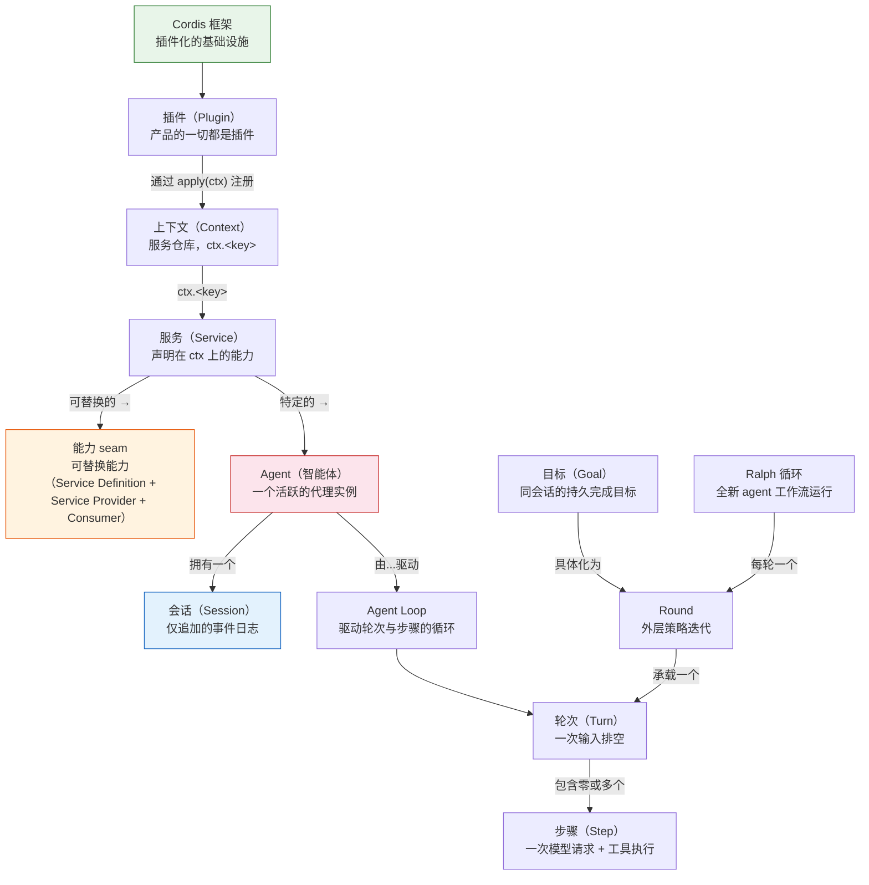
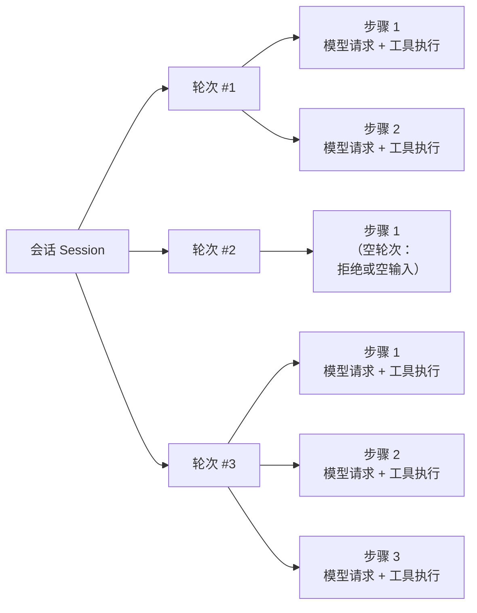

本页是 DeepSeek Harness（简称 dsh）领域词汇的统一参考。每个概念只对应一个规范术语；当你阅读其他文档时遇到不确定的词，可以在这里快速查找其含义与正确用法。术语按概念分组组织，初学者建议从上往下顺读一遍，之后作为参考手册随时查阅。

## 如何使用本术语表

本术语表收录了三类术语：**保留英文的领域术语**（如 `seam`、`agent`、`scope`），它们在中文文档中同样使用英文写法；**双语对照术语**（如 `turn` → 轮次、`tool` → 工具），它们有标准中文译法；以及**缩写术语**（如 `LLM`、`HMR`），在两种语言中均使用缩写形式。下文的表格中，"中文写法"列标明了该术语在中文正文中的正确写法。

Sources: [terminology.md](docs/i18n/terminology.md#L1-L9), [glossary.md](docs/glossary.md#L1-L5)

## 概念关系总览

在深入每个术语之前，先用一张图理解核心概念之间的层级与依赖关系：

上图展示了从 Cordis 框架到具体执行单元的完整概念链条。接下来的各节将逐一展开这些概念。

## 核心框架概念

以下术语是理解 dsh 全部文档的前置基础。Cordis 是底层的插件框架，理解"插件即服务"的范式是入门的第一步。

| 术语 | 中文写法 | 释义 |
|---|---|---|
| **Cordis** | Cordis | dsh 底层的插件框架。插件向共享上下文贡献服务、类型化事件和可逆副作用；产品的每一部分都是插件，因此每一部分都可替换 |
| **插件（plugin）** | 插件 | 一个实现 `Service` 接口的对象，可以是带 `inject` 和 `apply(ctx)` 的函数，也可以是 `Service` 子类。Cordis 将其生命周期挂载到当前上下文 |
| **上下文（context）** | 上下文 | 服务的仓库。一个服务通过 `ctx.<key>`（如 `ctx.tools`、`ctx.llm`）声明自身；其他插件通过 key 而非导入具体实现来发现服务 |
| **服务（service）** | 服务 | 声明在上下文上的能力单元，拥有稳定的 `ctx.<key>`。可以是核心主干服务、可替换能力 seam 或组合点 |
| **`inject`** | `inject` | 插件声明服务依赖的方式。一个命名了所需服务的插件会等待这些服务存在后才能激活，因此加载顺序通过服务需求表达，而非手动编排启动序列 |
| **dispose（资源释放）** | dispose | 每个注册都应有一个 disposer：要么从 `ctx.effect()` 返回一个，要么使用 Cordis 提供的辅助函数。资源释放顺序与注册顺序相反 |
| **fiber** | fiber | Cordis 中的协程单元，用于管理异步生命周期。详见 [Cordis 教程](6-bian-xie-di-ge-cha-jian) |

理解 Cordis 的五条核心理念：**插件是实现 Service 的对象**；**上下文是服务的仓库**；**通过 `inject` 声明依赖**；**类型化事件用于通信**；**注册是可逆副作用**。

Sources: [cordis-primer.md](docs/cordis-primer.md#L7-L13), [architecture.md](docs/architecture.md#L11-L12)

## 事件与分发

事件是 dsh 的核心扩展点——大多数改动的第一个决策就是"选择哪个事件域"。Cordis 提供了四种分发模式，每种模式有严格的使用约定。

| 术语 | 中文写法 | 释义 |
|---|---|---|
| **事件（event）** | 事件 | 服务间通信的机制。服务通过 TypeScript 声明合并声明事件名，然后以不同模式分发 |
| **会话事件（session event）** | 会话事件 | 追加到日志并通过 `session/event` 广播的持久事实。当某个事实必须在重新加载后仍然存在时使用 |
| **Agent 事件** | `agent/*` 事件 | 携带活跃 `Agent` 的实时扩展点：inbox、步骤、状态、请求、验证、续跑 |
| **能力事件** | 能力事件 | 无需导入循环即可向某个 seam 附加策略和适配器（`fs/*`、`tools/*`、`telemetry/*`） |
| **waterfall（瀑布式事件）** | waterfall | around-中间件语义。监听器收到 `(...args, next)`，调用 `next()` 委托，不调用则短路。值通过 `next()` 的返回值传播 |
| **emit** | `emit` | 分发模式：监听器按注册顺序观察，不等待，无返回值 |
| **parallel** | `parallel` | 分发模式：所有监听器并行观察事件，等待全部完成，无返回值 |
| **serial** | `serial` | 分发模式：监听器按注册顺序观察，等待逐个完成，有返回值 |
| **事件溯源（event-sourced）** | 事件溯源 | 仅追加事件日志作为单一真源的架构模式。LLM 消息历史从日志派生，绝不单独存储 |

四种分发模式的速查表：

| 模式 | 是否等待 | 分发顺序 | 是否有返回值 |
|---|---|---|---|
| `emit` | 否 | 按注册顺序 | 否 |
| `waterfall` | 否 | 按注册顺序 | 是 |
| `parallel` | 是 | 并行 | 否 |
| `serial` | 是 | 按注册顺序 | 是 |

分发模式是事件公开约定的一部分。新增事件时通过 `@mode` 标签标注，以便生成器检查声明与分发点的一致性。

Sources: [cordis-primer.md](docs/cordis-primer.md#L15-L26), [architecture.md](docs/architecture.md#L54-L61)

## 智能体与循环层级

dsh 的执行模型是一个分层的循环结构。理解 **Session → Round → Turn → Step** 这条层级链是掌握系统行为的关键。

| 术语 | 中文写法 | 释义 |
|---|---|---|
| **agent（智能体）** | agent | 一个活跃的代理实例。每个 agent 拥有一个会话，由 agent loop 驱动。`Agent` 接口是所有插件编程的统一面 |
| **agent loop（智能体循环）** | agent loop | 实现 `Agent` 接口公开约定的具体驱动器（`ctx.agentLoop`）。它领取排队输入、打开轮次、组装提示词、调用模型、执行工具，直到不再有工作 |
| **会话（session）** | 会话 | 一个仅追加的 `SessionEvent` 日志，是一个 agent 完整交互历史的单一真源。`ctx.sessions` 提供内存存储 |
| **轮次（turn）** | 轮次 | 会话中一次对已接纳输入的排空过程。在领取首条输入之前打开，在模型及其工具停止或终止策略介入后关闭。一个轮次包含零个或多个步骤 |
| **步骤（step）** | 步骤 | 一次模型请求加上由模型响应引发的工具执行。`step/start` 打开一个步骤，`step/end` 关闭它 |
| **Round** | Round | 承载一个轮次的外层策略迭代，例如一个 Goal Round 或一次使用全新 agent 的 Ralph 尝试。Round 计数器归该策略所有，并不统计会话中的每个轮次 |

上图展示了会话、轮次与步骤的包含关系。注意：一个轮次可以不包含任何步骤（当首条输入被拒绝或改写为空时），但仍然会在日志中记录这次尝试。

Sources: [glossary.md](docs/glossary.md#L36-L39), [architecture.md](docs/architecture.md#L63-L82), [terminology.md](docs/i18n/terminology.md#L56)

## 能力体系

**能力 seam（capability seam）** 是 dsh 最核心的架构概念之一。它定义了一种"声明—实现—消费"三角色模式，使一项能力的提供方可以被整体替换。

| 术语 | 中文写法 | 释义 |
|---|---|---|
| **seam** | seam | 一种可替换能力，包含三种角色：**Service Definition**（声明接口）、一个或多个 **Service Provider**（实现接口）和 **Consumer**（使用接口，通常是面向模型的工具） |
| **能力（capability）** | 能力 | 一项可被声明、实现和替换的系统功能。必须与 **功能（feature）** 区分——功能是 SDK 产品模型中的可管理单元 |
| **Service Definition** | Service Definition | seam 的接口声明角色，是拥有自身 `ctx.<key>` 和词汇类型的 Cordis `Service`。可以是抽象类（如 `ShellExecutor`）或具体注册表（如 `WebRuntime`），但绝不是 TypeScript `interface` |
| **Service Provider** | Service Provider | seam 的实现角色，提供具体的后端逻辑。单数固定写作 Service Provider，复数写作 Service Providers |
| **Consumer** | 消费方 | seam 的使用角色，通常是一个面向模型的工具，通过 `ctx.<key>` 调用能力 |

一个包可以同时承担多个角色，但单一角色本身不构成 seam——添加一项能力意味着设计好这三者的边界。以 `packages/shell` 为范例：文件系统提供方与进程提供方共享同一个执行世界，因此把它们指向远程沙箱，也就把 Bash、PTY 和 LSP 一并搬了过去，无需提供方专用 fork。

Sources: [glossary.md](docs/glossary.md#L7-L9), [architecture.md](docs/architecture.md#L98-L102), [terminology.md](docs/i18n/terminology.md#L59-L101)

## 作用域与注册体系

作用域（scope）是 dsh 实现"按 agent 定制"的原语。理解作用域可以解释为什么同一个工具集对不同的 agent 可以呈现不同的行为。

| 术语 | 中文写法 | 释义 |
|---|---|---|
| **scope** | scope | 按 agent 划分的注册单位。一项贡献（工具、提示词段、变量、限制、监听器）要么是*全局的*（对所有 agent 可见），要么是*带作用域的*（归属于恰好一个 scope key） |
| **scope key** | scope key | scope 的不透明标识，按对象同一性比较。harness 约定：一个活跃的 agent 就是其自身 scope 的 key |
| **agent 上下文（`agent.ctx`）** | `agent.ctx` | agent 的带作用域上下文。通过它进行的注册既具有 scope 可见性，其生命周期也绑定到该 scope |
| **shadowing** | shadowing | 最具体者胜出的名称解析：一个带作用域的工具／片段／变量仅在该 scope 内替换同名的全局对应项。这是按 agent 定制 persona 和工具变体的机制 |
| **restriction / scope-local 注册** | restriction | `tools.restrict` 为单个 scope 过滤全局工具集合（多个 restriction 取交集组合）。被过滤掉的全局工具既不出现在提示词中，也拒绝执行 |
| **setup window** | setup window | 创建者组装 agent 作用域环境的创建时隙（`CreateAgentOptions.setup`）：此时 scope 和 agent 对象已存在，但尚未发布 |
| **lineage** | lineage | 以数据形式携带的父子关系事实（`parentSession`、持久的 `delegationDepth`、运行时 `subagentDepth`）；从不影响可见性 |
| **scoped dispatch** | scoped dispatch | 关于某个 agent 活动的事件以该 agent 的 carrier 进行分发；关于注册表本身的事件属于注册表主体事件，保持不过滤 |

Sources: [glossary.md](docs/glossary.md#L11-L21), [scope.md](docs/subsystems/scope.md#L1-L20)

## 工具与命令

工具是 agent 操控外部世界的手臂；命令是人类操控 agent 的接口。两者在 dsh 中有严格的区分。

| 术语 | 中文写法 | 释义 |
|---|---|---|
| **工具（tool）** | 工具 | 注册在 `ctx.tools` 上的面向模型的能力。其 schema 加入提示词组装，模型通过 Function Calling 调用它 |
| **工具调用（tool call）** | 工具调用 | 模型发起的一次工具调用请求，包含工具名和原始 JSON 参数。以 `tool/call` 会话事件记录 |
| **工具结果（tool result）** | 工具结果 | 一次完成的工具调用的面向模型的结果，以 `tool/result` 会话事件记录。可携带可选的内部失败身份和工具私有 `meta` 展示载荷 |
| **工具 schema** | 工具 schema | 描述工具参数结构的 JSON Schema。在提示词组装时与提示词段一起提交给模型 |
| **人类命令（human command）** | 人类命令 | 以斜杠开头的指令，由面向人类的适配器通过 `ctx.commands` 解释并执行，不会成为模型消息。它既不同于面向模型的工具，也不同于通过 `ctx.shell` 执行的 shell 命令 |
| **命令平面（command plane）** | 命令平面 | 由 UI 适配器和命令插件负责的发现、解析、分发、取消与结果渲染机制 |
| **Function Calling** | Function Calling | 模型调用工具的机制 |

Sources: [glossary.md](docs/glossary.md#L29-L33), [session.md](docs/subsystems/session.md#L65-L88), [architecture.md](docs/architecture.md#L108-L116)

## 目标与工作流

目标（Goal）和 Ralph 循环是 dsh 中两种不同的任务驱动机制：目标用于同会话的持续续行，Ralph 用于全新 agent 的迭代工作流。

| 术语 | 中文写法 | 释义 |
|---|---|---|
| **目标（goal）** | 目标 | 附着在现有会话上的单个持久完成目标，带有按修订号演进的 `active` / `paused` / `blocked` / `complete` 阶段和 Goal Round 上限。目标是一种状态，不是调度器或独立对话 |
| **Goal Round** | Goal Round | 为当前目标接纳的一次续行周期。同会话驱动器将其具体化为一个由目标触发的轮次，其中可包含零个或多个步骤 |
| **目标激活** | 目标激活 | 续行消费方接纳下一个 Goal Round 的进程本地权限。激活态为 `armed` 或 `disarmed`；有意不参与持久回放 |
| **Ralph 循环** | Ralph 循环 | 一次面向不可变目标的前台全新 agent 工作流运行。它是由工作流和 subagent 原语组合而成的面向模型的工具策略 |
| **Ralph Round** | Ralph Round | Ralph 循环中的一个全新子会话。子会话不接收父会话或此前子会话的对话种子；共享工作区和一份有界的 Ralph 交接承载跨 Round 的状态 |
| **Ralph 交接** | Ralph 交接 | 从一个仍需继续的 Ralph Round 传给下一个的规范化、有界结构化报告，包含状态、摘要、证据、后续步骤和阻塞说明 |
| **后台任务（background job）** | 后台任务 | 注册在 `ctx.jobs` 上的后台工作。`job_*` 工具负责收集或停止它 |
| **工作流（workflow）** | 工作流 | 注册在 `ctx.workflowEngine` 上的工作流脚本引擎 |

Sources: [glossary.md](docs/glossary.md#L23-L45), [terminology.md](docs/i18n/terminology.md#L95-L161)

## 会话日志与持久化

会话日志是 dsh 架构的真源（source of truth）。**模型可见即已记录**——任何抵达模型请求的内容都必须能从日志重建。

| 术语 | 中文写法 | 释义 |
|---|---|---|
| **事件日志（event log）** | 事件日志 | 会话中所有 `SessionEvent` 的仅追加序列。`deriveMessages()` 从中投影出模型历史，原始 `assistant/chunk` 事件保证回放和 UI 保真 |
| **仅追加（append-only）** | 仅追加 | 日志只增长、不修改的性质。事件序列号保持连续，包括原始分片，因此持久化可以逐字存储规范日志 |
| **真源（source of truth）** | 真源 | 权威数据来源。会话日志是 agent 交互历史的唯一真源；LLM 消息历史从中派生 |
| **fork** | fork | 从一个活跃会话分叉出新会话。`ctx.sessions.fork(source, boundary?, childSessionId?)` |
| **恢复（resume）** | 恢复 | 加载一个已持久化的会话并继续工作。`ctx.agents.resume()` 先加载持久会话 |
| **回放（replay）** | 回放 | 从日志重放事件以重建内存状态 |
| **压缩（compaction）** | 压缩 | 当上下文窗口接近溢出时，将选定的历史范围摘要为一个总结节点的机制。`ctx.compaction` 提供 Service Definition |
| **spill** | spill | 工具输出超限落盘机制。当工具返回的文本超出模型上下文限制时，将其持久化为文件并返回定位符 |
| **检查点（checkpoint）** | 检查点 | 持久化的时间点快照。`dsh-session-checkpoint-policy` 负责按请求的持久化检查点 |
| **transcript（文本记录）** | transcript | 会话渲染给用户或编辑器的完整文本，区别于事件日志 |

Sources: [architecture.md](docs/architecture.md#L92-L96), [session.md](docs/subsystems/session.md#L1-L7), [compaction.md](docs/subsystems/compaction.md#L1-L10), [terminology.md](docs/i18n/terminology.md#L163-L179)

## 安全与沙箱

沙箱机制确保 agent 启动的进程受到文件系统策略的约束，审批机制确保敏感操作需要人类确认。

| 术语 | 中文写法 | 释义 |
|---|---|---|
| **沙箱（sandbox）** | 沙箱 | 包装同世界子进程 argv 的文件效果策略，`ctx.sandbox` 提供。后端包括 Linux bwrap/Landlock、macOS Seatbelt 和 Windows ACL |
| **权限（permission）** | 权限 | 控制工具操作能力的策略。通过 `ctx.permissionPresets` 和 `ctx.approval` 管理 |
| **审批（approval）** | 审批 | `ctx.approval` 提供的一次性提示机制。工具执行前通过审批策略确认是否允许 |
| **非升权（non-escalation）** | 非升权 | 安全与权限语境中的原则：主体不得获得超出既有授权的权限 |

沙箱的三种模式：

| 模式 | 含义 |
|---|---|
| `read-only` | 仅允许必需的接收端（如 `/dev/null`） |
| `workspace-write` | 允许工作区及后端定义的临时区域 |
| `danger-full-access` | 绕过限制，不调用 `ctx.sandbox` |

Sources: [sandbox.md](docs/subsystems/sandbox.md#L1-L23), [terminology.md](docs/i18n/terminology.md#L156-L165)

## 组合与启动

Profile 和组合包定义了一个运行中的 dsh 实例如何从有序层叠加组装而成。

| 术语 | 中文写法 | 释义 |
|---|---|---|
| **profile** | profile | 存放在 Harness home 中的具名组装。它列出自己叠放的组合包、存放树外插件，并保存用户自己的 `cordis.patch.yml` |
| **组合包（composition bundle）** | 组合包 | Cordis 配置项及其挂载代码的分发格式，因此它插入的内容始终可被其上各层 patch |
| **Cordis 配置项** | Cordis 配置项 | `cordis.yml` 插件列表中的一项；注意与 Cordis 插件（实际被加载的插件实现）区分 |
| **patch** | patch | 按 id 定位某个配置项并替换其整个 config，或插入新条目 |
| **HMR（热模块替换）** | HMR | 开发期间无需重启即可热重载插件的能力 |
| **Typert** | Typert | dsh 的类型图、生成器、loader 与运行时 registry。注意产品拼写为 Typert |

Sources: [architecture.md](docs/architecture.md#L15-L37), [terminology.md](docs/i18n/terminology.md#L108-L121)

## 子代理与模型通信

子代理（subagent）允许一个 agent 将工作委托给子 agent；LLM 适配器定义了与模型通信的协议。

| 术语 | 中文写法 | 释义 |
|---|---|---|
| **subagent** | subagent | 让 agent 将工作委托给子 agent 的能力 seam（`ctx.subagents`）。多种提供方实现共存：进程内 spawn/fork、ACP、Codex、Claude Code、dsh-sdk |
| **LLM（大语言模型）** | LLM | 模型提供方通过 `ctx.llm` 适配器注册。适配器约定定义了消息与流式词汇表 |
| **适配器（adapter）** | 适配器 | 将特定模型提供方的 API 转换为 dsh 统一协议的组件 |
| **分片（chunk）** | 分片 | 模型流式输出的 token 级别片段，以 `assistant/chunk` 事件记录，保证回放保真 |
| **内容块（content block）** | 内容块 | 消息的有类型组成部分。包含 `text`、`reasoning`、`image`、`tool-call`、`tool-result` 五种 |
| **提示词（prompt）** | 提示词 | 提交给模型的文本。由系统提示词（system prompt）和用户消息组成 |
| **steering（中途引导）** | steering | 在 agent 工作过程中注入额外上下文或指令以影响其方向 |

Sources: [subagent.md](docs/subsystems/subagent.md#L1-L8), [llm-streaming.md](docs/subsystems/llm-streaming.md#L1-L31), [terminology.md](docs/i18n/terminology.md#L34-L66)

## 术语翻译规则速查

以下是初学者在阅读中文文档时最常遇到的术语翻译约定。完整的术语对照表参见仓库内的翻译规范文档。

### 缩写类（中英文均使用缩写）

| 缩写 | 全称 | 备注 |
|---|---|---|
| ACP | Agent Client Protocol | |
| CLI | 命令行界面 | |
| HMR | 热模块替换 | |
| JSONL | JSON Lines | 一种文本格式 |
| LLM | 大语言模型 | |
| MCP | Model Context Protocol | |
| SSE | Server-Sent Events | 流式传输协议 |

### 常见易混淆术语

| 正确用法 | 不要译作 | 原因 |
|---|---|---|
| seam | 接缝 | 一个可替换能力的整体概念 |
| 能力（capability） | 功能 | capability 是技术能力，feature 是产品功能 |
| 消费方（consumer） | 消费者 | 遵循角色命名 |
| 真源（source of truth） | 事实来源 / 唯一来源 | 遵循领域术语 |
| agent | 智能体 | 首次出现括注"agent（智能体）"，之后只写 agent |
| 事故复盘（postmortem） | 事后分析 / 事故记录 | 遵循仓库文档类型命名 |

Sources: [terminology.md](docs/i18n/terminology.md#L11-L29), [terminology.md](docs/i18n/terminology.md#L33-L73), [terminology.md](docs/i18n/terminology.md#L75-L213)

## 下一步阅读

掌握了这些基础术语后，建议按以下顺序继续深入：

- **[整体架构与插件树设计](10-zheng-ti-jia-gou-yu-cha-jian-shu-she-ji)**：在架构层面理解 Profile、组合包和事件域如何协作
- **[能力接缝原理](15-neng-li-jie-feng-capability-seams-yuan-li)**：深入理解 seam 三角色模式的替换机制
- **[Agent 循环：Turn 与 Step 生命周期](12-agent-xun-huan-turn-yu-step-sheng-ming-zhou-qi)**：从时序细节掌握轮次与步骤的流转
- **[会话日志：事件溯源与持久化](13-hui-hua-ri-zhi-shi-jian-su-yuan-yu-chi-jiu-hua)**：理解"模型可见即已记录"原则的实现
- **[Cordis 核心概念速览](20-cordis-he-xin-gai-nian-su-lan)**：回到 Cordis 的五条核心理念进行系统学习