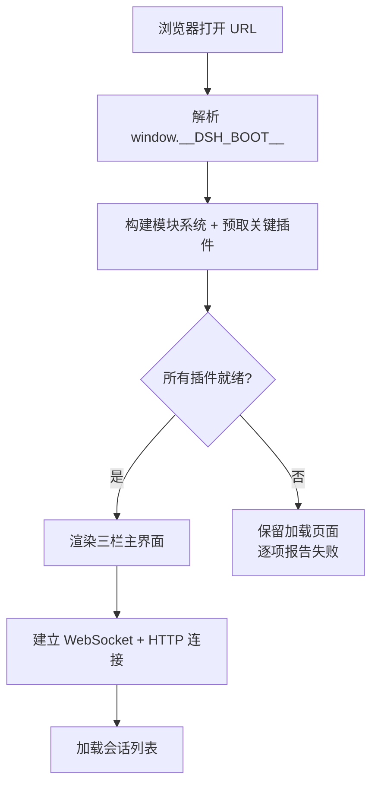
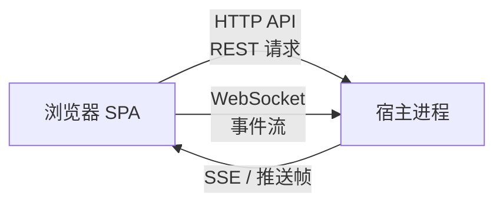
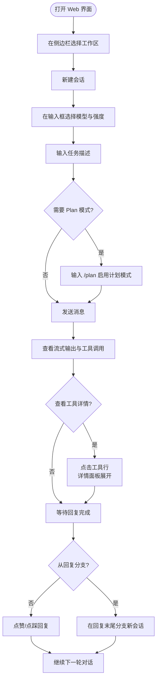

DeepSeek Harness 的 Web 界面是一个运行在浏览器中的智能体对话前端，通过 WebSocket 和 HTTP API 与本地宿主进程通信，让你能在可视化的三栏布局中创建会话、发送消息、查看工具调用详情、管理模型配置与权限策略。本文面向初次使用的开发者，从启动方式到核心交互场景逐一讲解。

## 启动 Web 服务

Web 界面通过 `dsh --profile web` 命令启动。宿主进程会启动一个本地 HTTP 服务器，加载预构建的前端静态资源（dist），同时暴露 API 网关和 WebSocket 端点供浏览器连接。

```
dsh --profile web                    # 使用组合后的默认 host 和 port
dsh --profile web --port 8080        # 指定端口
dsh --profile web --host 127.0.0.1   # 显式绑定回环地址（默认）
```

启动后，终端会打印本地访问 URL。浏览器打开该 URL 即可看到 Web 界面。出于安全原因，`--host 0.0.0.0`（暴露到网络）被明确禁止——这会将远程代码执行能力暴露给网络上的其他设备。

Sources: [startup.ts](packages/bundle/web-app/src/startup.ts#L49-L83), [web-server.zh.md](docs/subsystems/web-server.zh.md#L1-L30)

## 启动流程与加载页面

Web 应用采用**两阶段启动**机制。第一阶段构建客户端模块系统（解析 `window.__DSH_BOOT__` 中的插件配置图），并行预取关键插件包；第二阶段挂载 Cordis Loader 并创建所有插件入口。在两阶段全部完成之前，屏幕上显示一个简洁的加载页面（带旋转动画和品牌标识）。

如果任何插件加载失败，加载页面会保留并**逐项列出失败的插件名称和错误信息**，而不是显示残缺的部分界面。这是一个刻意的设计决策——宁可完整失败，也不渲染不可靠的交互界面。

Sources: [boot.tsx](packages/client/web/src/boot.tsx#L40-L120), [AppRoot.tsx](packages/client/web/src/AppRoot.tsx#L28-L61)



## 三栏布局总览

界面主体是一个**三栏式布局**，由 `AppFrame` 组件统一管理：

| 区域 | Slot 名称 | 职责 |
|------|-----------|------|
| **侧边栏** | `sidebar` | 会话列表、新建会话、工作区浏览、设置入口 |
| **对话区** | `conversation` | 消息流、输入框、模型选择器、命令面板 |
| **详情面板** | `details` | 工具调用详情、轨迹视图 |

侧边栏和详情面板的宽度均可通过拖拽分隔条调整。侧边栏在窄视口下会自动折叠为图标轨道（56px 宽度），详情面板在未选中会话时关闭。

Sources: [AppFrame.tsx](packages/client/ui-layout/src/client/AppFrame.tsx#L60-L202)

## 侧边栏：会话与工作区管理

侧边栏是**会话和工作的入口**。顶部展示品牌标识和折叠按钮，下方是"新建会话"按钮，中间区域由工作区浏览器（`WorkspaceBrowser`）填充，底部是设置入口和页脚操作。

**核心操作：**

- **新建会话**：点击品牌标识或"新建会话"按钮，选择工作区后创建新会话
- **会话搜索**：在工作区浏览器顶部输入关键词，防抖 250ms 后向宿主发起 `session.search` 请求
- **会话管理**：每个工作区默认折叠显示最近 5 个会话，可展开查看全部
- **侧边栏折叠**：点击面板图标切换折叠/展开状态，窄屏自动折叠

折叠后的轨道模式保留新建会话和搜索两个核心图标的可访问性，悬停时提示展开。

Sources: [SidebarRoot.tsx](packages/client/ui-sidebar/src/client/SidebarRoot.tsx#L56-L193), [WorkspaceBrowser.tsx](packages/client/ui-workspace/src/client/WorkspaceBrowser.tsx#L1-L80)

## 对话区：消息流与输入

对话区是**最核心的交互区域**。会话打开后，消息流从底部向上展示历史消息，支持分页加载更早的内容。

### 消息类型与渲染

消息流中的每一行称为一个 **ChatNode**，由 `ChatNodeSeat` 组件统一调度并根据类型分发到对应的渲染器：

| 消息类型 | 说明 | 渲染特征 |
|----------|------|----------|
| **用户消息** | 你输入的文本和图片 | 右对齐气泡，显示时间和复制按钮 |
| **助手回复** | 智能体的流式 Markdown 输出 | 左对齐，支持实时流式渲染 |
| **推理内容** | 模型的思维链 | 可折叠的推理块 |
| **工具调用** | 文件读写、Shell 执行、搜索等 | 紧凑卡片行，可展开查看详情 |
| **命令** | `/compact`、`/goal` 等 | 命令卡片 |
| **压缩标记** | 上下文压缩事件 | 带摘要的可展开行 |

流式输出期间，消息流底部显示"Deep diving..."状态指示器和已运行时长（超过 15 秒后显示时钟）。新消息到达时自动跟随到底部；向上滚动时停止跟随，点击"回到底部"按钮可快速返回。

Sources: [ChatView.tsx](packages/client/ui-conversation/src/client/chat/ChatView.tsx#L60-L200), [locales.ts](packages/client/ui-conversation/src/client/locales.ts#L16-L22)

### 输入框与消息发送

输入框位于对话区底部，支持以下交互：

- **文本输入**：输入消息描述你的任务，占位提示会根据当前模式（普通 / Plan / Goal）变化
- **图片附件**：拖拽图片到输入区域或粘贴添加，支持 PNG、JPG、WebP、GIF 格式，有限制每张大小和总数量上限
- **发送**：Enter 键发送（智能体运行中时根据配置决定是排队还是插话），Cmd/Ctrl+Enter 使用另一种行为
- **撤回/重做**：标准 Ctrl/Cmd+Z / Shift+Ctrl/Cmd+Z
- **排队消息**：智能体运行时发送的消息进入队列，队列停靠条显示排队数量，可编辑、删除或插话发送

当没有选择工作区时，输入框提示"选择一个工作区开始"；当会话不可用时，提示"会话不可用"。

Sources: [facade.ts](packages/client/ui-conversation/src/client/input/facade.ts#L60-L160), [QueueDock.tsx](packages/client/ui-conversation/src/client/queue/QueueDock.tsx#L28-L50)

### 斜杠命令

在输入框中输入 `/` 可触发**斜杠命令面板**。面板提供搜索过滤、键盘导航，选择后将命令应用到当前会话。常见命令包括：

- `/compact` — 压缩上下文，释放 token 空间
- `/goal` — 设置长期运行目标
- `/model` — 切换模型
- `/permission` — 切换权限预设

Sources: [PopupSelectView.tsx](packages/client/ui-commands/src/client/PopupSelectView.tsx), [locales.ts](packages/client/ui-commands/src/client/locales.ts#L4-L12)

### 模型选择器

输入框左侧（或上方）有**模型选择器**，采用两级菜单设计：

1. 第一级显示当前模型名称和推理强度（Effort）
2. 点击进入模型列表（按提供方分组）或强度级别列表

模型选择数据由宿主的模型目录提供，选择后即时生效。如果目录加载失败，菜单内显示带重试按钮的错误条。

Sources: [ModelSelect.tsx](packages/client/ui-model-selection/src/client/ModelSelect.tsx#L33-L60)

### 权限模式

权限模式控制智能体执行操作时的审批粒度。切换"Full access"需要**风险确认对话框**——你必须勾选"我已了解风险"复选框才能启用。权限预设的默认值可在设置面板中配置，影响后续新建的会话。

Sources: [PermissionRow.tsx](packages/client/ui-permission-presets/src/client/PermissionRow.tsx#L56-L134)

### Goal 与 Plan 模式

**Goal 模式**适用于需要长期持续执行的任务。通过 `/goal` 命令设置目标后，输入框上方显示一个目标指示条（GoalBar），展示当前阶段（active / paused / blocked）、目标摘要，以及暂停/继续/编辑/清除操作。

**Plan 模式**让智能体先生成执行计划再行动。启用后，输入框旁出现一个 Plan 标签，点击可退出 Plan 模式。Plan 模式下的占位文本变为"描述你的任务以生成计划"。

Sources: [GoalBar.tsx](packages/client/ui-goal/src/client/GoalBar.tsx#L27-L60), [PlanModeControl.tsx](packages/client/ui-plan/src/client/PlanModeControl.tsx#L23-L50)

## 详情面板：工具调用与轨迹

详情面板（`details` 列）在选中对话流中的工具调用行时展开，展示该调用的完整输入和输出。面板始终保持在 DOM 中（关闭时宽度归零），切换会话时自动关闭。

**轨迹视图**（Trajectory View）是详情面板中的一种紧凑汇总视图，以 Turn 为单位展示每轮的助手消息、推理过程和工具调用，支持搜索过滤和时间线导航。

Sources: [TrajectoryView.tsx](packages/client/ui-trajectory/src/client/TrajectoryView.tsx#L1-L60)

## 设置面板

点击侧边栏底部的设置入口，打开一个**居中模态面板**。面板左侧是分区导航栏，右侧是当前分区的配置内容。

| 分区 | 内容 |
|------|------|
| **通用设置** (General) | 外观主题（浅色/深色/跟随系统）、权限预设默认值、繁忙时 Enter 行为 |
| **模型** (Models) | 提供方配置（API Key 输入、模型列表管理）、自定义提供方添加 |
| **插件** (Plugins) | Agent Loop、Bash、Web Search 等可配置插件的参数 |
| **Agent Presets** | 智能体预设管理 |

### 首次使用引导

当没有任何提供方可用时（首次启动），设置面板会弹出**引导对话框**（Onboarding Modal），阻塞应用根元素，引导你完成必要的 API Key 配置。完成引导后，该步骤不再显示。

Sources: [SettingsRoot.tsx](packages/client/ui-settings-general/src/client/SettingsRoot.tsx#L58-L173), [ModelsSection.tsx](packages/client/ui-settings-models/src/client/ModelsSection.tsx#L82-L200), [AppearanceRow.tsx](packages/client/ui-theme/src/client/AppearanceRow.tsx#L46-L64)

## 图片附件

Web 界面支持在消息中附带图片附件。交互方式包括：

- **拖放上传**：将图片文件拖入对话区域时显示拖放遮罩
- **粘贴上传**：从剪贴板粘贴图片
- **缩略图轨道**：输入框下方显示已添加图片的水平缩略图列表，支持滚动、点击查看原图、悬停删除

图片附件有格式（PNG/JPG/WebP/GIF）、单张大小和总数量限制。添加超出限制时显示友好的错误提示。

Sources: [AttachmentRail.tsx](packages/client/ui-attachment/src/AttachmentRail.tsx#L63-L200), [DropOverlay.tsx](packages/client/ui-attachment/src/DropOverlay.tsx)

## 连接与通信

浏览器与宿主进程之间通过**双通道通信**连接：



- **HTTP API**：处理设置读写、凭证管理、模型选择等请求-响应式操作
- **WebSocket（双流）**：一条传输 Mux 帧（会话级事件），一条传输 Host 帧（宿主级事件），用于实时流式输出和工具执行更新

连接断开时自动重连，采用指数退避策略（初始 500ms，最大 10s，带抖动）。重连期间界面显示"reconnecting"状态。

Sources: [connection.ts](packages/client/connection/src/client/connection.ts#L65-L160)

## 交互工作流：一次完整的对话



Sources: [ChatNodeSeat.tsx](packages/client/ui-conversation/src/client/chat/ChatNodeSeat.tsx#L18-L62), [AssistantNodeView.tsx](packages/client/ui-conversation/src/client/chat/AssistantNodeView.tsx#L10-L34)

## 统计指标

对话区底部（输入框上方）的**统计行**实时展示当前窗口内的关键性能指标：

| 指标 | 含义 |
|------|------|
| 轮次 · 步数 | 当前窗口中的 Turn 和 Step 总数 |
| LLM 耗时 | 模型请求的总墙钟时间 |
| 工具调用耗时 | 工具执行的总墙钟时间 |
| 首 token 延迟 | 平均首 token 响应时间 |
| 解码速度 | 输出吞吐量（tokens/秒） |
| 缓存命中率 | KV cache 命中百分比 |
| Token 用量 | 输入 / 输出 token 数 |

这些指标来自宿主的会话投影（session projection），在分页和上下文压缩后仍然保持准确。

Sources: [StatsLine.tsx](packages/client/ui-conversation/src/client/chat/StatsLine.tsx#L1-L50)

## 主题与外观

Web 界面支持三种主题偏好：

- **浅色**（Light）—— 固定浅色配色
- **深色**（Dark）—— 固定深色配色
- **跟随系统**（System）—— 根据操作系统的 `prefers-color-scheme` 自动切换

主题切换即时生效，所有颜色通过语义化 CSS 变量（`--dsw-alias-*`）驱动，不使用组件库或 Tailwind。所有组件遵循无障碍标准：键盘焦点可见，动画在 `prefers-reduced-motion` 下降级。

Sources: [AppearanceRow.tsx](packages/client/ui-theme/src/client/AppearanceRow.tsx#L46-L64), [web-styling.zh.md](docs/web-styling.zh.md#L1-L26)

## 阅读建议

本文涵盖了 Web 界面的核心使用场景。要继续深入了解，推荐以下阅读路径：

- 如果需要从命令行启动和配置宿主进程，请阅读 [命令行启动器（dsh CLI）](4-ming-ling-xing-qi-dong-qi-dsh-cli)
- 如果想了解插件如何注册到 Web 界面的 Slot 中，请阅读 [编写第一个插件](6-bian-xie-di-ge-cha-jian)
- 如果想理解 Web 界面背后的整体架构设计，请阅读 [整体架构与插件树设计](10-zheng-ti-jia-gou-yu-cha-jian-shu-she-ji)
- 如果对 Host-Client 通信机制感兴趣，请阅读 [Typert API 网关与 Host-Client 通信](22-typert-api-wang-guan-yu-host-client-tong-xin)