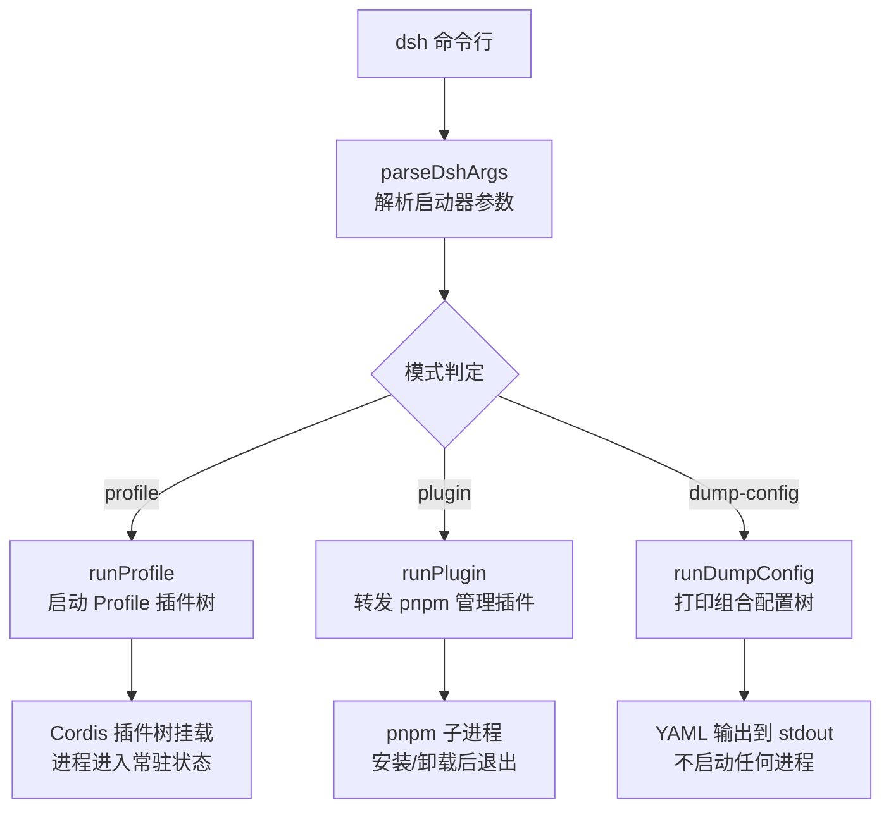
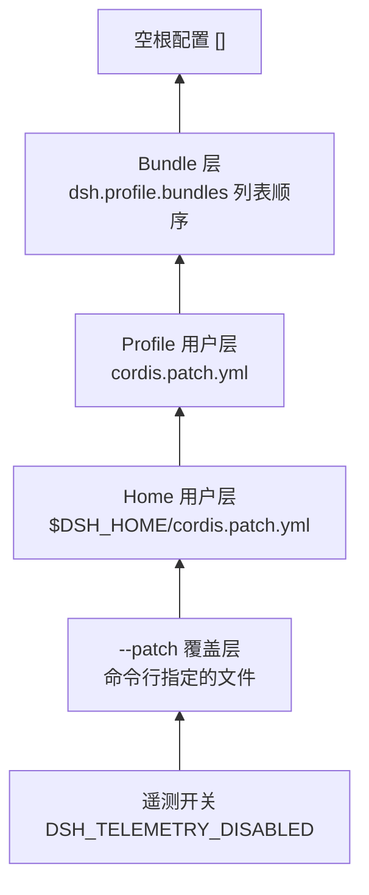
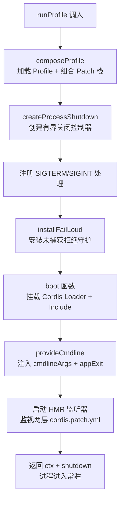
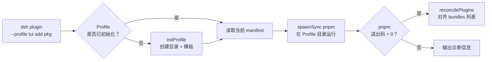

`dsh` 是 DeepSeek Harness 的产品级命令行启动器。它的职责非常精简：解析自己的启动参数、加载指定的 Profile、将插件树组装完毕后交给 Profile 内的应用逻辑去运行。换句话说，`dsh` 本身不是 Agent 运行时——它是**把 Agent 运行时装配起来并点燃的那根火柴**。本文面向初学者，从整体架构到每条命令的实际用法，逐一拆解 `dsh` CLI 的运作原理。

Sources: [bin.ts](apps/cli/src/bin.ts#L1-L54), [args.ts](apps/cli/src/args.ts#L1-L192)

## 整体架构：三分派模式

`dsh` 的入口文件 `bin.ts` 在启动后只做两件事：先用 `parseDshArgs` 解析命令行参数，再根据解析结果**动态导入**（`await import`）对应的运行器并执行。三种互斥的分派模式构成了 CLI 的全部行为。



动态导入的设计保证了每个分派路径只加载自己需要的代码——执行 `dump-config` 时不会引入进程关闭控制器，执行 `plugin` 时不会引入 Cordis 框架。这种隔离让 `dsh --version` 和 `dsh plugin` 的冷启动开销远低于一次完整的 Profile 启动。

Sources: [bin.ts](apps/cli/src/bin.ts#L29-L53)

### 三种分派模式一览

| 模式 | 触发方式 | 典型用途 | 进程生命周期 |
|---|---|---|---|
| **Profile 启动** | `dsh --profile <name>` | 挂载插件树，启动 Web/Headless 等应用 | 常驻，等待信号或应用主动退出 |
| **插件管理** | `dsh plugin --profile <name> <args>` | 安装/卸载/更新 Profile 的外部插件 | pnpm 子进程结束后即退出 |
| **配置转储** | `dsh --profile <name> --dump-config` | 检查组合后的配置树，排查配置问题 | 打印 YAML 后立即退出 |

Sources: [args.ts](apps/cli/src/args.ts#L20-L48)

## 命令解析：启动器只认自己的旗帜

`dsh` 的参数解析遵循一条核心原则：**启动器只解析它自己认识的旗帜，第一个它不认识的令牌之后的一切，原封不动地交给被启动的应用**。这通过 Commander 的 `allowUnknownOption()` + `passThroughOptions()` + `enablePositionalOptions()` 三个配置协同实现。

启动器自身只认这几个旗帜：

| 旗帜 | 说明 | 可重复 |
|---|---|---|
| `--profile <name>` | 指定要启动的 Profile 名称（必须存在） | 否 |
| `--patch <path>` | 在 Profile 的用户层之上追加额外 patch 覆盖 | 是 |
| `--dump-config` | 打印组合配置树（含用户层 + 覆盖）后退出 | 否 |
| `--dump-default-config` | 只打印 Bundle 层（不含用户层）后退出 | 否 |
| `-V, --version` | 打印版本号 | 否 |

```sh
dsh --profile web --port 8080       # --port 属于 web 应用，不属于启动器
dsh --profile headless "run tests"  # "run tests" 是 headless 应用的参数
dsh --profile web --help            # web 应用自己的帮助，不是启动器的
dsh --help                          # 启动器自己的帮助
```

其中 `--help` 的归属取决于它出现的位置：因为 `dsh` 在无 Profile 时禁用了自己的 `helpOption`（设为 `false`），所以只有 `dsh --help`（不带 Profile）才会打印启动器的帮助；一旦 Profile 确定，`--help` 就穿透到应用端。这种设计确保了每个应用完全拥有自己的命令行界面和帮助文本。

Sources: [args.ts](apps/cli/src/args.ts#L116-L145)

### `web` 子命令别名

`dsh web` 是 `--profile web` 的硬编码别名。它有自己的 `--patch`、`--dump-config` 和 `--dump-default-config` 旗帜，但不能再叠加父级的 `--profile`——启动器会直接拒绝这种混用。

Sources: [args.ts](apps/cli/src/args.ts#L156-L169)

## Profile 系统：插件树的分层组合

Profile 是 `dsh` 最核心的概念。一个 Profile 就是一个目录，位于 `$DSH_HOME/profiles/<name>/`，里面装着组装一棵完整 Cordis 插件树所需的全部信息。

### Profile 目录结构

```
$DSH_HOME/profiles/web/
├── package.json          # 外部插件依赖 + dsh.profile.bundles 清单
├── cordis.patch.yml      # 用户自己的 patch 层（热重载）
├── cordis.yml            # 空的根配置（每次启动时被重写）
└── pnpm-workspace.yaml   # pnpm 配置（hoisted linker）
```

其中 `$DSH_HOME` 的解析优先级为：显式配置 > 环境变量 `DSH_HOME` > 默认路径 `~/.dsh`。

Sources: [home-paths](packages/util/home-paths/src/index.ts#L86-L91), [profile.ts](packages/boot/app-boot/src/profile.ts#L98-L168)

### 四层 Patch 叠加

Profile 的插件树组合过程遵循严格的层级顺序，从下往上依次叠加：



每一层的 Patch 条目都是一组 Loader patch 操作——以 `id` 为目标，可以对已有插件行进行配置覆盖、禁用或插入新的插件列表。后应用的层覆盖先应用的层。Bundle 名称的解析顺序是**先从 `dsh` 安装目录查找，再从 Profile 目录查找**，这保证了内置 Bundle（`@deepseek-ai/dsh-base` 等）永远来自运行中的 `dsh` 本身，而非 Profile 本地副本。

Sources: [profile-boot.ts](apps/cli/src/profile-boot.ts#L131-L171)

### 预置模板与自动初始化

`dsh` 为两个 Profile 名称内置了自动初始化模板：

| Profile 名称 | 模板 Bundle 列表 | 行为 |
|---|---|---|
| `web` | `@deepseek-ai/dsh-base` + `@deepseek-ai/dsh-web-app` | 首次运行时自动创建目录 |
| `headless` | `@deepseek-ai/dsh-base` + `@deepseek-ai/dsh-headless` | 首次运行时自动创建目录 |
| 其他名称 | 无模板 | 不存在时报错，提示 `dsh plugin --profile <name> add <package>` |

当用户执行 `dsh --profile web` 且 `$DSH_HOME/profiles/web/` 尚不存在时，启动器会调用 `initProfile` 创建目录结构、写入模板清单和空的 `cordis.patch.yml`，然后正常启动。

Sources: [profile.ts](packages/boot/app-boot/src/profile.ts#L114-L117), [profile.ts](packages/boot/app-boot/src/profile.ts#L371-L384)

## Profile 启动流程详解

`runProfile` 是 `dsh` 最复杂的函数，负责从参数到一颗活的 Cordis 插件树的完整编排。

### 启动步骤



在 `boot` 调用的回调中，启动器在**任何配置树条目挂载之前**就完成了两件事：一是通过 `DSH_LAUNCH_ENVIRONMENT_KEY` 注入冻结的环境变量快照，确保所有插件从相同的不可变来源解析启动时环境值；二是通过 `provideCmdline` 注入命令行参数和退出请求句柄，使被启动的应用可以通过 `ctx.cmdlineArgs.get()` 读取自己的参数，通过 `ctx.appExit(code)` 请求有界退出。

Sources: [profile-boot.ts](apps/cli/src/profile-boot.ts#L207-L300)

### 环境变量的三层来源

启动器在启动前调用 `loadLayeredEnv` 构建一个**冻结的环境快照**，按信任优先级排序：

| 层 | 来源 | 优先级 |
|---|---|---|
| **process** | 进程继承的环境变量 | 最高 |
| **project-env** | 调用目录的 `.env` 文件 | 中 |
| **user-env** | `$DSH_HOME/.env` 文件 | 最低 |

其中一组"引导安全"变量名（如 `PATH`、`HOME`、`SHELL`、`DEEPSEEK_BASE_URL`、所有 `DSH_` 前缀等）只允许从进程继承环境获取，`.env` 文件中设置这些变量会直接报错并提示用户 `export` 它们。这一设计防止了项目级 `.env` 静默篡改进程启动、网络可达性和凭证加载等关键路径。

Sources: [app-boot index.ts](packages/boot/app-boot/src/index.ts#L93-L128), [app-boot index.ts](packages/boot/app-boot/src/index.ts#L177-L198)

### 命令行参数的传递与应用解析

启动器解析完毕后，未被启动器认识的参数以**不可变冻结数组**的形式通过 `ctx.cmdlineArgs` 服务提供。应用侧的普通插件注入 `cmdlineArgs` 后，调用 `parseCmdline` 用自己的 Commander 程序解析这些参数：

```typescript
// 启动器侧：冻结并注入
provideCmdline(hostCtx, {
  args: Object.freeze([...options.args]),  // 不可变快照
  exit: code => void shutdown.shutdown(code),
})
```

`parseCmdline` 将 Commander 的输出重定向到启动器适配器，使帮助文本和错误都通过 `ctx.appExit` 走有界退出路径，而非直接 `process.exit()`。这让 headless 的一次性任务和 Web 的长驻服务共享同一套进程关闭机制。

Sources: [cmdline index.ts](packages/boot/cmdline/src/index.ts#L67-L72), [cmdline index.ts](packages/boot/cmdline/src/index.ts#L98-L119)

### 热重载：配置修改实时生效

对于常驻表面（Web Profile），启动器会在 `boot` 完成后挂载两个 HMR 监听器，分别监视 Profile 级和 Home 级的 `cordis.patch.yml`。当用户编辑这两个文件时，HMR 重新读取 patch 文件，将其插入到 Bundle 层之上、覆盖层之下的位置，通过 Include 的 `entry.update()` 事务性地重新应用整棵树的 Patch。Bundle 层和覆盖层始终保持在用户层两侧，确保用户编辑永远不能覆盖或丢失它们。

Sources: [profile-boot.ts](apps/cli/src/profile-boot.ts#L240-L298)

## 进程关闭：有界递进策略

`dsh` 为常驻表面（Web 等）实现了一套有界的进程关闭机制。核心原则是：给插件树最多 5 秒的优雅处置时间，超时后强制退出。

| 触发方式 | 退出码 | 行为 |
|---|---|---|
| `SIGTERM`（第一次） | `0` | 优雅处置：等插件树 dispose 完毕后退出 0 |
| `SIGINT`（第一次，Ctrl+C） | `130` | 优雅处置：等插件树 dispose 完毕后退出 130 |
| 第二次信号 | 原信号码 | 立即强制 `process.exit` |
| `ctx.appExit(code)`（应用主动退出） | 由调用方指定 | 优雅处置后退出 |
| dispose 超时（5 秒） | 请求码 | 强制 `process.exit` |

其中 `SIGTERM` 被视为管理程序的普通停止请求（退出码 0），`SIGINT` 被视为用户中断（退出码 130）——退出码的语义在启动器层面统一了。`installFailLoud` 守卫则覆盖了另一个场景：如果某个插件的初始化 Promise 在启动后期才被 reject，它会被转为一条带堆栈的 stderr 诊断并 `exit(1)`，而非让 Node 报告未处理的 Promise 拒绝。

Sources: [process-shutdown.ts](apps/cli/src/process-shutdown.ts#L1-L77), [profile-boot.ts](apps/cli/src/profile-boot.ts#L210-L225), [app-boot index.ts](packages/boot/app-boot/src/index.ts#L609-L649)

## 插件管理：dsh plugin

`dsh plugin --profile <name> <args...>` 是一个极其精简的 pnpm 转发器。它的工作流程分为三步：



其中 `reconcilePlugins` 是关键的后置处理：它不是简单地做依赖 diff，而是**按安装后的实际状态**重新检查每个依赖是否声明了 `dsh.bundle`。一个声明了 `dsh.bundle` 的包被自动加入 `dsh.profile.bundles` 列表（Bundle 层）；一个没有声明的纯依赖则只得到一条警告。这意味着 `pnpm update` 如果新版本加入了 `dsh.bundle` 声明，会自动激活该包为 Bundle 层。

Sources: [plugin.ts](apps/cli/src/plugin.ts#L58-L91), [plugin.ts](apps/cli/src/plugin.ts#L120-L158)

### Windows 兼容性处理

在 Windows 上，`pnpm` 通过 `.cmd` 脚本调用，Node.js 自 CVE-2024-27980 加固后不允许 `spawnSync` 在无 shell 的情况下执行 `.cmd` 文件。`dsh plugin` 自动检测 `process.platform === 'win32'` 并传入 `shell: true` 选项，使 Windows 上的行为与 POSIX 一致。此外，相对路径参数（如 `.`、`../plugin`）会被锚定到调用目录而非 Profile 目录，防止 `add .` 从一个插件检出目录运行时意外自链接 Profile 本身。

Sources: [plugin.ts](apps/cli/src/plugin.ts#L104-L133)

## 配置转储：排查配置问题的诊断工具

`--dump-config` 和 `--dump-default-config` 是不启动任何进程的诊断命令。它们读取各层 Patch 文件，通过 Include 的 patch 算法 `applyEntryPatches` 组合成最终的有效条目列表，然后渲染为带注释的 YAML。

| 命令 | 包含的层 | 典型用途 |
|---|---|---|
| `--dump-default-config` | 仅 Bundle 层 | 排查 Bundle 模板是否正确 |
| `--dump-config` | Bundle 层 + 用户层 + `--patch` 覆盖 | 排查完整组合是否预期 |

输出的 YAML 中，每个来源文件贡献的行和修改它们的 Patch 层都会用 `# ==` 注释标注，`!!js` 表达式原样打印（不评估），使得输出既是人类可读的诊断文档，也是合法的可加载 YAML。

Sources: [dump-config.ts](apps/cli/src/dump-config.ts#L30-L52), [app-boot index.ts](packages/boot/app-boot/src/index.ts#L378-L399)

## 内置 Agent Preset

`dsh` 随附了三套 Agent 预设，位于安装目录的 `config/agent-presets/` 下：

| 预设 | 名称 | 说明 | 排序 |
|---|---|---|---|
| `standard` | 标准模式 | 功能完整的编码 Agent，支持文件编辑、Shell、检索、Skills、计划、子代理和工作流 | 1 |
| `code` | PTC 模式 | 标准模式全部能力 + Code Mode SDK 呈现工具，让模型用一个 TypeScript 程序组合多步操作 | 2 |
| `minimal` | 极简模式 | 仅提供持久 bash 与 str_replace_editor 的双工具 Agent | 3 |

这些预设通过 Profile 组合中的 `agent-presets` 行加载，其根路径在启动时被注入为系统可信来源。

Sources: [standard/preset.yml](apps/cli/config/agent-presets/standard/preset.yml#L1-L4), [code/preset.yml](apps/cli/config/agent-presets/code/preset.yml#L1-L4), [minimal/preset.yml](apps/cli/config/agent-presets/minimal/preset.yml#L1-L4), [profile-boot.ts](apps/cli/src/profile-boot.ts#L159-L167)

## 开发模式运行

在生产环境中，`dsh` 通过 `bin` 字段指向 `lib/bin.js` 执行已构建的产物。而在开发模式下，仓库根目录的 `package.json` 提供了 `pnpm dsh` 脚本，它使用 `node --import tsx/esm` 直接执行 TypeScript 源文件 `apps/cli/src/bin.ts`，并转发所有参数。这种方式无需构建步骤即可运行完整的 CLI，适合开发者在本地调试。

```sh
# 开发模式（直接运行 TypeScript 源码）
pnpm dsh --profile web --port 8080

# 生产模式（需要先 pnpm run build）
dsh --profile web --port 8080
```

Sources: [README.md](apps/cli/README.md#L46-L48)

## 快速上手速查表

以下是初学者最常用的 `dsh` 命令汇总：

| 命令 | 效果 |
|---|---|
| `dsh web` | 启动 Web 界面（首次运行自动初始化 Profile） |
| `dsh --profile headless "解释这个项目"` | 运行一次性任务，打印结果后退出 |
| `dsh web --port 8080` | 指定端口启动 Web |
| `dsh --profile web --dump-config` | 检查当前组合配置树 |
| `dsh plugin --profile tui add github:user/plugin` | 为 tui Profile 安装外部插件 |
| `dsh --profile tui --patch ./extra.yml` | 启动 tui Profile 并叠加额外配置层 |
| `dsh -V` | 打印版本号 |

---

读完本文后，你已经掌握了 `dsh` CLI 的全部启动模式、Profile 组合机制和进程管理策略。接下来，你可以继续探索：

- **[Web 界面使用指南](3-web-jie-mian-shi-yong-zhi-nan)** — 了解 `dsh web` 启动后的浏览器界面操作
- **[Python SDK 快速入门](5-python-sdk-kuai-su-ru-men)** — 通过 Python API 而非 CLI 来编排 Agent
- **[Profile 与 Bundle 分层组合机制](11-profile-yu-bundle-fen-ceng-zu-he-ji-zhi)** — 深入理解 Patch 层叠加的底层原理
- **[整体架构与插件树设计](10-zheng-ti-jia-gou-yu-cha-jian-shu-she-ji)** — 从全局视角理解 `dsh` 在系统中的定位