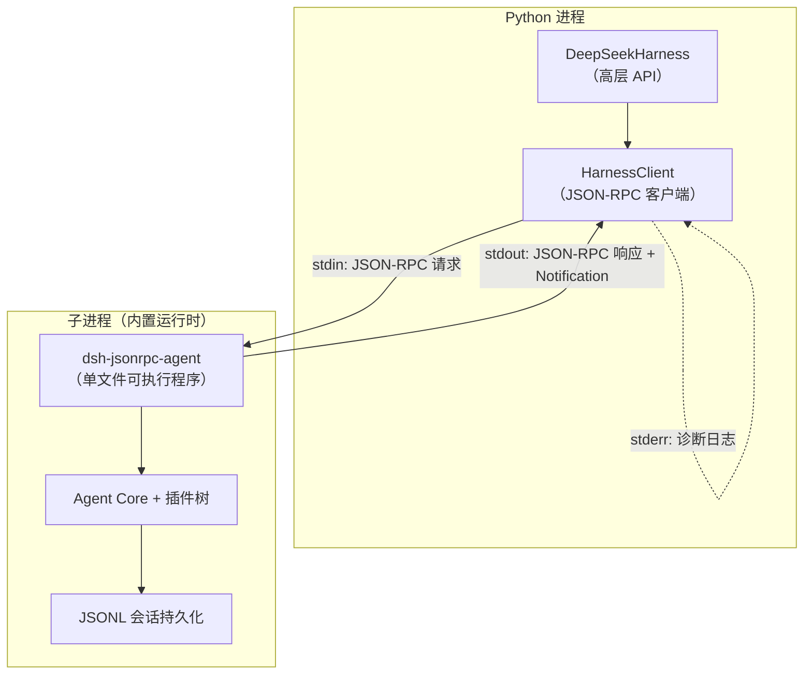
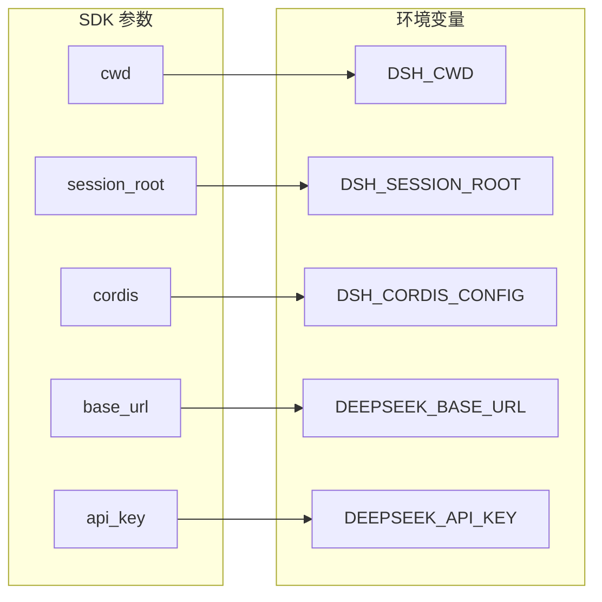
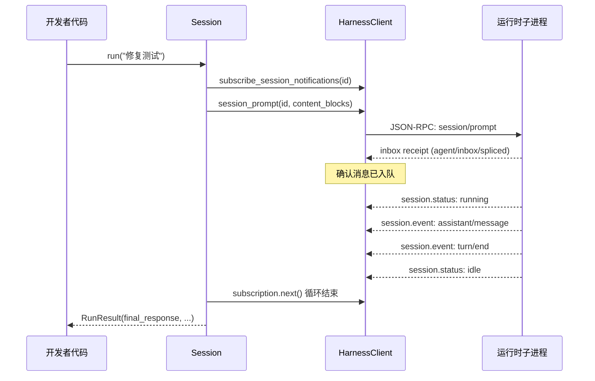
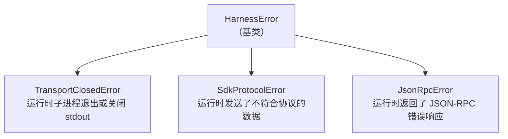

Python SDK 是 DeepSeek Harness 的编程式入口——它以 **子进程 + JSON-RPC over stdio** 的方式启动内置运行时，让开发者无需启动 Web UI 即可驱动完整的 Agent 循环。本文档覆盖从安装到首次调用的完整路径，帮助中间层开发者快速建立可运行的 Agent 编排能力。

## 架构全景

SDK 由两个 Python 分发包构成紧密耦合的分层：`deepseek-harness-sdk`（SDK 接口层）与 `deepseek-harness-runtime-bin`（运行时二进制层）。SDK 层提供同步的高层 API 和底层 JSON-RPC 客户端；运行时层携带平台特定的单文件可执行程序和默认 Cordis 配置。



SDK 的核心设计原则是 **延迟启动 + 跨调用复用**：运行时子进程在首次调用 `start()` 时才启动，之后由 `DeepSeekHarness` 实例持有，直到 `close()` 被显式调用或上下文管理器退出。这意味着同一个 harness 实例可以在多个 `run()` 调用之间复用同一个子进程及其全部状态。

Sources: [api.py — DeepSeekHarness](python/sdk/src/deepseek_harness/api.py#L48-L125), [client.py — HarnessClient](python/sdk/src/deepseek_harness/client.py#L37-L86)

## 系统要求与安装

**前置条件**：

| 条件 | 要求 |
|---|---|
| Python | ≥ 3.10 |
| 操作系统 | Linux x64 / Linux arm64 / macOS 14+ arm64 |
| Node.js | 不需要（生产模式使用内置单文件可执行程序） |
| API 凭证 | DeepSeek 兼容的 API 端点和密钥 |

> ⚠️ Windows 目前不支持 Agent 运行时（持久化 PTY 后端依赖 POSIX 终端基础）。SDK 的 Python 接口可在 Windows 上导入和编写测试，但实际 Agent 执行仅限 Linux 和 macOS 平台。

Sources: [platforms.json](python/sdk-runtime/platforms.json#L1-L14), [__init__.py — 平台解析](python/sdk-runtime/src/deepseek_harness_runtime/__init__.py#L119-L128)

安装 SDK：

```sh
python -m pip install deepseek-harness-sdk
```

`deepseek-harness-sdk` 会自动安装同版本的 `deepseek-harness-runtime-bin` 平台 wheel 包，其中包含目标平台的单文件可执行程序和默认 Cordis 配置。安装后无需额外下载或配置 Node.js 运行时。

Sources: [pyproject.toml — 依赖声明](python/sdk/pyproject.toml#L13-L16)

## 三分钟快速开始

### 零配置模式

最简调用只需导入 `DeepSeekHarness` 并使用上下文管理器。SDK 会自动注入内置默认配置，启动运行时子进程：

```python
from deepseek_harness import DeepSeekHarness

with DeepSeekHarness() as harness:
    result = harness.run("Say hi.")
print(result.final_response)
```

零配置模式下，SDK 调用 `deepseek_harness_runtime.resolve_bundled_launch_args()` 解析出当前平台的单文件可执行程序路径，并通过 `DSH_CORDIS_CONFIG` 环境变量注入内置默认配置文件 `runtime/cordis.yml`。该配置加载了 stdio JSON-RPC 服务器、Agent Core（带工作区上下文）、DeepSeek 适配器和 JSONL 持久化，但不包含任何 model-facing 文件工具。

Sources: [README.md — 零配置启动](python/sdk/README.md#L10-L25), [cordis.yml — 内置默认配置](python/sdk-runtime/src/deepseek_harness_runtime/runtime/cordis.yml#L1-L50)

### 完整配置模式

要获得编码 Agent 的全部能力（Bash、文件编辑、子代理委托等），需通过 `cordis` 参数指定一个完整的 Cordis 组合文件：

```python
from pathlib import Path
from deepseek_harness import DeepSeekHarness

config = Path("examples/jsonrpc-agent/minimal.cordis.yml").resolve()
workspace = Path("/absolute/path/to/workspace").resolve()
sessions = Path("/absolute/path/to/sessions").resolve()

with DeepSeekHarness(
    provider="deepseek-official",
    model="deepseek-v4-flash",
    max_tokens=49_152,
    cwd=str(workspace),
    session_root=str(sessions),
    cordis=str(config),
) as harness:
    result = harness.run(
        "Inspect the repository and fix the failing tests.",
        session_id="example-001",
    )

print(result.final_response)
```

运行前设置凭证环境变量：

```sh
export DEEPSEEK_API_KEY=sk-your-key-here
# 可选：指定代理端点
# export DEEPSEEK_BASE_URL=http://127.0.0.1:8000/v1
```

Sources: [python-sdk.md — 教程示例](docs/user/guide/python-sdk.md#L52-L79), [minimal.py — 示例脚本](examples/jsonrpc-agent/minimal.py#L16-L43)

## 配置参数详解

`DeepSeekHarnessConfig` 是 SDK 的核心配置类，通过构造函数关键字参数或 dataclass 实例传入：

| 参数 | 类型 | 默认值 | 说明 |
|---|---|---|---|
| `provider` | `str` | `"deepseek-official"` | Cordis 组合中注册的提供方路由名称 |
| `model` | `str` | `"deepseek-v4-flash"` | 由适配器解析的模型 ID |
| `max_tokens` | `int \| None` | `None` | 根 Agent 及进程内后代的输出 token 上限；省略时由提供方默认值控制 |
| `cwd` | `str \| None` | 当前目录 | Agent 工作区路径，解析为绝对路径后注入 `DSH_CWD` |
| `runtime_cwd` | `str \| None` | 同 `cwd` | 运行时子进程的启动目录，可与 Agent 工作区不同 |
| `session_root` | `str \| None` | `None` | 会话日志目录，注入 `DSH_SESSION_ROOT` |
| `cordis` | `str \| None` | `None` | Cordis 组合文件路径，注入 `DSH_CORDIS_CONFIG` |
| `env` | `dict[str, str]` | `{}` | 额外注入子进程的环境变量 |
| `runtime_bin` | `str \| None` | `None` | 显式指定运行时可执行程序路径 |
| `launch_args_override` | `tuple[str, ...] \| None` | `None` | 完全覆盖默认启动参数（调试用） |
| `request_timeout_seconds` | `float \| None` | `None` | JSON-RPC 请求超时时间 |
| `shutdown_timeout_seconds` | `float \| None` | `1.0` | 子进程关闭等待时间 |
| `base_url` | `str \| None` | `None` | 覆盖 `DEEPSEEK_BASE_URL` |
| `api_key` | `str \| None` | `None` | 覆盖 `DEEPSEEK_API_KEY` |

> **设计约束**：构造函数接受 `DeepSeekHarnessConfig` 实例 **或** 关键字参数，但两者不能同时传入。SDK 在构造阶段将 `cwd`、`runtime_cwd` 解析为绝对路径，将 `session_root`、`cordis`、`base_url`、`api_key` 映射为环境变量。部署 persona 和持久化策略应在 `cordis.yml` 中定义，而非通过 SDK 参数。

Sources: [api.py — DeepSeekHarnessConfig](python/sdk/src/deepseek_harness/api.py#L13-L35), [api.py — 构造函数](python/sdk/src/deepseek_harness/api.py#L56-L84)

### 环境变量映射

SDK 内部将高层参数映射为运行时进程的环境变量，理解这一映射有助于调试和自定义部署：



`DSH_CWD` 始终被设置（即使 `cwd` 参数为 `None`，也会使用当前工作目录的绝对路径）。其他变量仅在对应参数非 `None` 时设置。用户通过 `env` 字典传入的自定义变量优先于这些自动映射，但 SDK 的显式映射（如 `DEEPSEEK_API_KEY`）会在构造阶段覆盖 `env` 中的同名键。

Sources: [api.py — 环境变量注入](python/sdk/src/deepseek_harness/api.py#L63-L72)

## 会话管理与生命周期

### 一次完整的交互流程

`Session.run()` 的活动区间从提示词被持久 inbox 接收到开始，到整个 Agent 下一次进入空闲状态（`session.status = "idle"`）时结束：



### Session 复用与会话连续性

复用同一个 `session_id` 可以保持会话上下文连续性——包括持久化 Bash 进程的工作目录、已导出的环境变量和 Shell 函数：

```python
with DeepSeekHarness(cordis="config.yml") as harness:
    session = harness.start_session("dev-session")

    # 第一次调用：Agent 在 workspace 中运行命令
    result1 = session.run("列出当前目录的文件")
    print(result1.final_response)

    # 第二次调用：Agent 保留前一次的 shell 状态
    result2 = session.run("继续上一个任务")
    print(result2.final_response)
```

对于独立任务，应使用不同的 `session_id`。`DeepSeekHarness.start_session()` 会返回一个 `Session` 对象，其 `id` 属性即为会话标识符。

Sources: [api.py — Session.run()](python/sdk/src/deepseek_harness/api.py#L127-L183), [python-sdk.md — 会话复用](docs/user/guide/python-sdk.md#L98-L102)

## RunResult 与通知机制

### RunResult 结构

`run()` 方法返回 `RunResult` dataclass，包含 Agent 完整交互周期的所有产物：

| 字段 | 类型 | 说明 |
|---|---|---|
| `session_id` | `str` | 会话标识符 |
| `final_response` | `str` | 该区间内根会话最后提交的 Assistant 文本输出 |
| `finish_reason` | `str \| None` | 最后一个 `turn/end` 事件的 reason kind（如 `completed`、`max-tokens`） |
| `events` | `list[JsonObject]` | 根会话的全部事件流 |
| `notifications` | `list[Notification]` | 该区间内收到的全部通知（包括子代理的） |
| `session_root` | `str \| None` | 会话日志根目录 |

`final_response` 的提取逻辑：从事件流末尾向前扫描，找到最后一个 `type == "assistant/message"` 的事件，拼接其中所有 `type == "text"` 的内容块。`finish_reason` 同理，取最后一个 `turn/end` 事件的 `data.reason.kind` 字段。

Sources: [api.py — RunResult](python/sdk/src/deepseek_harness/api.py#L38-L45), [api.py — final_response 提取](python/sdk/src/deepseek_harness/api.py#L205-L222), [api.py — finish_reason 提取](python/sdk/src/deepseek_harness/api.py#L225-L242)

### 实时通知回调

通过 `on_notification` 回调可以在 Agent 执行期间实时处理事件，无需等待 `run()` 返回：

```python
def on_notification(notification: Notification) -> None:
    if notification.method == "session.event":
        event = notification.payload.get("event", {})
        event_type = event.get("type")
        if event_type == "assistant/message":
            print(f"[Agent 输出] {notification.payload}")
        elif event_type == "turn/end":
            print(f"[Turn 结束] reason={event.get('data', {}).get('reason')}")

with DeepSeekHarness(cordis="config.yml") as harness:
    result = harness.run(
        "分析项目结构",
        on_notification=on_notification,
    )
```

`HarnessClient` 在运行时进程的整个生命周期内维护已发现的 subagent 谱系（通过 `subagent.started` 通知中的 `parentSessionId` → `childSessionId` 映射）。每次 `Session.run()` 期间，`on_notification` 回调和 `RunResult.notifications` 都会按协议传输顺序收到根会话及所有已知后代的通知，包括嵌套子代理的生命周期事件和会话事件。

Sources: [api.py — Session.run 通知收集](python/sdk/src/deepseek_harness/api.py#L138-L183), [client.py — 谱系追踪](python/sdk/src/deepseek_harness/client.py#L460-L504)

## 运行时解析与两种载体

运行时层支持两种载体模式，由 `resolve_bundled_launch_args(mode)` 函数选择：

| 模式 | 描述 | 选择方式 | 适用场景 |
|---|---|---|---|
| **exe（生产）** | 平台特定的单文件可执行程序 `dsh-jsonrpc-agent-pkg-<platform>-<arch>` | 自动解析（默认） | 生产部署，目标机无需 Node.js |
| **node（开发）** | 仓库源码构建的完整 deploy 闭包，通过系统 Node.js 执行 | 显式 `DSH_RUNTIME_MODE=node` 或 `mode="node"` | 仓库本地开发，不自动选择 |

自动解析始终优先查找 exe 载体——`node` 模式永远不会被自动选中，以防生产部署意外依赖源码构建。macOS 平台还需一个同级的 `-spawn-helper` 可执行程序（用于 node-pty 的进程派生）。

Sources: [__init__.py — resolve_bundled_launch_args](python/sdk-runtime/src/deepseek_harness_runtime/__init__.py#L96-L116), [__init__.py — exe 载体解析](python/sdk-runtime/src/deepseek_harness_runtime/__init__.py#L70-L93)

## Cordis 组合参考

### 内置默认配置（零配置）

内置 `runtime/cordis.yml` 加载以下插件，提供基础但不可被 Agent 直接操作的 Agent 能力：

| 插件 | 包名 | 功能 |
|---|---|---|
| `sdk-jsonrpc-server` | `@deepseek-ai/dsh-sdk-jsonrpc-server` | stdio JSON-RPC 服务器入口 |
| `agent-core` | `@deepseek-ai/dsh-agent-spine-demo` | Agent 核心循环（带工作区上下文） |
| `llm-deepseek` | `@deepseek-ai/dsh-llm-deepseek` | DeepSeek LLM 适配器 |
| `sessions` | `@deepseek-ai/dsh-session-persistence-jsonl` | JSONL 会话持久化 |
| `session-checkpoints` | `@deepseek-ai/dsh-session-checkpoint-policy` | 持久化检查点策略 |
| `bash` | `@deepseek-ai/dsh-bash-local` | 本地 Bash 执行器 |
| `fs-local` | `@deepseek-ai/dsh-fs-local` | 本地文件系统后端 |

Sources: [cordis.yml — 内置默认配置](python/sdk-runtime/src/deepseek_harness_runtime/runtime/cordis.yml#L1-L50)

### minimal.cordis.yml（完整编码 Agent）

`minimal.cordis.yml` 是内置默认配置的编码 Agent 对等体，使用 `danger-full-access` 沙箱策略：

| 属性 | 值 |
|---|---|
| System Prompt | `DSH_SYSTEM_PROMPT`，回退为 `You are a helpful software engineer assistant.` |
| 模型 | `deepseek-v4-flash`（可通过 `DSH_MODEL` 覆盖） |
| Model-facing 工具 | 持久化 `bash`（`view`/`create`/`str_replace`/`insert`）和 `str_replace_editor` |
| Bash 超时 | 300 秒 |
| 编辑器输出限制 | 16,000 字符 |
| 沙箱策略 | `danger-full-access` |
| 上下文压缩 | 禁用 |
| 会话持久化 | 未压缩 JSONL |

> ⚠️ **安全警告**：`minimal.cordis.yml` 使用 `danger-full-access` 沙箱策略，Bash 和编辑器可以修改运行时进程可访问的任何路径。请仅在一次性检出或容器中运行此组合。

Sources: [minimal.cordis.yml — 完整配置](examples/jsonrpc-agent/minimal.cordis.yml#L1-L83), [python-sdk.md — 示例属性表](docs/user/guide/python-sdk.md#L85-L96)

### 环境变量速查

| 变量 | 用途 |
|---|---|
| `DEEPSEEK_API_KEY` | 传递给 OpenAI 兼容端点的 API 凭证 |
| `DEEPSEEK_BASE_URL` | `dsh-llm-deepseek` 使用的主机端点 |
| `DSH_CWD` | Bash 和文件系统工具的 Agent 工作区 |
| `DSH_SESSION_ROOT` | JSONL 会话目录 |
| `DSH_CORDIS_CONFIG` | Cordis 组合文件路径 |
| `DSH_SYSTEM_PROMPT` | 部署提供的编码 persona |
| `DSH_MODEL` | `minimal.py` 使用的默认模型 |
| `DSH_RUNTIME_MODE` | 运行时载体选择：`exe` 或 `node` |

Sources: [README.md — jsonrpc-agent 环境变量](examples/jsonrpc-agent/README.md#L17-L27)

## 错误处理与诊断

SDK 定义了统一的异常层次结构：



| 异常类 | 触发场景 | 关键属性 |
|---|---|---|
| `TransportClosedError` | 子进程异常退出、stdout 关闭或写入失败 | 消息附带退出码和 stderr 尾部（最后 400 行） |
| `SdkProtocolError` | `turn/end` 事件缺少 `data.reason.kind` 字符串字段 | — |
| `JsonRpcError` | 运行时返回 JSON-RPC error 响应 | `code`、`message`、`data` |

`TransportClosedError` 的诊断信息包括子进程退出码和 stderr 缓冲区尾部内容（`_stderr_lines` deque，最大 400 行），帮助快速定位运行时崩溃原因。当请求超时时，`TimeoutError` 同样会附带可用诊断信息。

Sources: [errors.py — 异常定义](python/sdk/src/deepseek_harness/errors.py#L1-L24), [client.py — 诊断信息](python/sdk/src/deepseek_harness/client.py#L399-L422)

## 进阶用法

### 使用底层 HarnessClient

`HarnessClient` 是 `DeepSeekHarness` 下面的底层 JSON-RPC 客户端，提供更细粒度的控制——包括手动消息订阅、IncomingRequest 处理和通知过滤：

```python
from deepseek_harness import HarnessClient, HarnessConfig

client = HarnessClient(HarnessConfig(
    runtime_bin="/path/to/dsh-jsonrpc-agent",
    request_timeout_seconds=30,
))
client.start()
client.initialize(cwd="/workspace", provider="deepseek-official", model="deepseek-v4-flash")

# 手动订阅通知
with client.subscribe_session_notifications("my-session") as sub:
    client.session_prompt("my-session", [{"type": "text", "text": "Hello"}])
    while True:
        notification = sub.next()
        if notification.method == "session.status":
            if notification.payload.get("status") == "idle":
                break

client.close()
```

Sources: [client.py — HarnessClient](python/sdk/src/deepseek_harness/client.py#L37-L200), [client.py — NotificationSubscription](python/sdk/src/deepseek_harness/client.py#L507-L557)

### 多内容块输入

`run()` 方法接受 `str` 或 `list[JsonObject]` 作为输入。字符串会被自动包装为 `[{"type": "text", "text": ...}]`。对于多模态或结构化输入，直接传入内容块列表：

```python
result = harness.run([
    {"type": "text", "text": "请分析以下代码："},
    {"type": "text", "text": "def foo(): pass"},
])
```

Sources: [api.py — normalize_input](python/sdk/src/deepseek_harness/api.py#L199-L202)

### 测试中的 launch_args_override

在测试环境中，`launch_args_override` 允许用一个 Python 脚本替代真实的运行时可执行程序，模拟 JSON-RPC 行为。SDK 测试套件大量使用此模式来验证协议行为，无需实际模型调用：

```python
with DeepSeekHarness(
    model="deepseek-v4-flash",
    max_tokens=4096,
    cwd=str(tmp_path),
    launch_args_override=(sys.executable, str(fake_runtime_script)),
) as harness:
    result = harness.run("say hello", session_id="main")
```

Sources: [test_client.py — 测试模式](python/sdk/tests/test_client.py#L94-L124)

## 下一步

- 如果你想理解 Agent 循环的内部机制，阅读 [Agent 循环：Turn 与 Step 生命周期](12-agent-xun-huan-turn-yu-step-sheng-ming-zhou-qi)
- 如果你想深入了解 Cordis 插件组合系统，阅读 [Cordis 核心概念速览](20-cordis-he-xin-gai-nian-su-lan)
- 如果你想探索完整的 Cordis 配置参考，阅读 [Profile 与 Bundle 分层组合机制](11-profile-yu-bundle-fen-ceng-zu-he-ji-zhi)
- 如果你想了解会话日志的持久化细节，阅读 [会话日志：事件溯源与持久化](13-hui-hua-ri-zhi-shi-jian-su-yuan-yu-chi-jiu-hua)