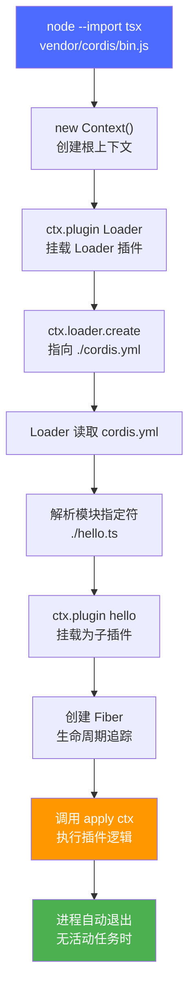
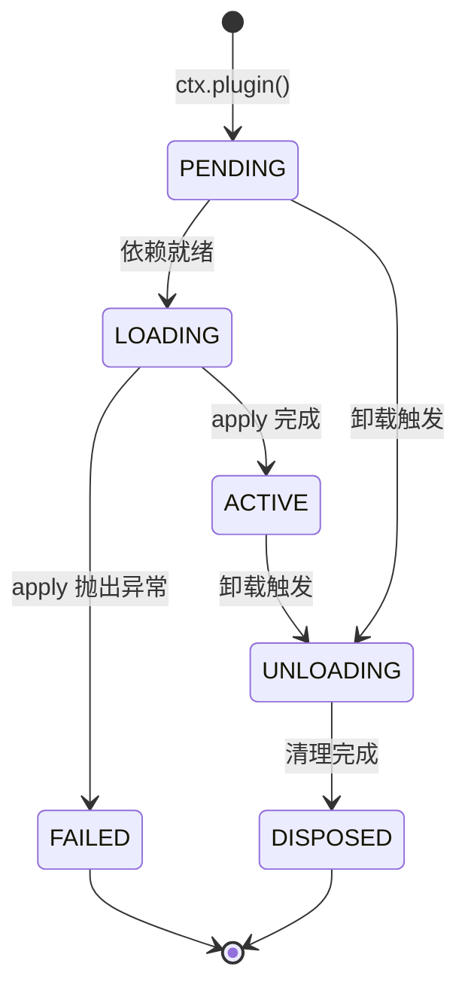
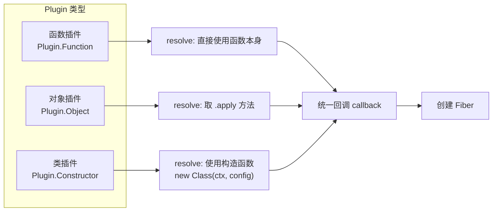

Cordis 是 DeepSeek Harness 底层的插件框架——在这个框架中，**每项能力**（工具、LLM 适配器、文件访问、甚至 Agent 循环本身）都是一个挂载到共享上下文中的插件。本页将带你从零开始编写并运行第一个 Cordis 插件，理解插件的核心结构、加载流程和常见形态。无需 API 密钥，全部示例可离线运行。

Sources: [index.md](docs/cordis-tutorial/index.md#L1-L11), [cordis-primer.md](docs/cordis-primer.md#L1-L14)

---

## 插件是什么

在 Cordis 中，**插件是一个导出了 `apply` 函数的模块**。框架加载插件时会调用 `apply`，并传入一个 **上下文对象**（`ctx`），插件通过这个对象注册自己贡献的所有内容——工具、事件监听器、服务、定时器等。

一个最简单的插件长这样：

```ts
import type { Context } from '@deepseek-ai/cordis'

export const name = 'hello'

export function apply(ctx: Context) {
  console.log('hello from my first plugin')
}
```

这里面只有两个关键部分：

| 导出项 | 作用 | 是否必需 |
|---|---|---|
| `apply(ctx)` | 插件入口函数，框架加载时调用，所有注册逻辑放在这里 | **必需** |
| `name` | 插件的显示名称，用于诊断信息中的标识 | 可选 |
| `inject` | 服务依赖声明，列出插件运行所需的其他服务 | 可选 |
| `Config` | 配置校验 schema，在插件启动前验证传入的配置 | 可选 |

Sources: [01-first-plugin.md](docs/cordis-tutorial/01-first-plugin.md#L5-L21), [registry.ts](vendor/cordis/src/registry.ts#L99-L111)

---

## 插件的解剖：`apply` 与 `ctx`

`apply` 是插件的心脏。它接收两个参数：上下文 `ctx` 和可选的配置 `config`。框架保证在调用 `apply` 之前，所有通过 `inject` 声明的依赖服务都已就绪——因此在 `apply` 内部访问这些服务是安全的。

`ctx` 不是普通对象，而是一个 **代理**。对它的属性读取会经过服务解析器：当你写 `ctx.tools` 时，Cordis 会查找名为 `tools` 的已注册服务并返回它。这种设计意味着插件之间不直接导入彼此的实现，而是通过服务名称来发现能力。

Sources: [context.ts](vendor/cordis/src/context.ts#L16-L33), [context.ts](vendor/cordis/src/context.ts#L42-L84)

`import type { Context } from '@deepseek-ai/cordis'` 这行代码只导入类型信息，在运行时会被完全擦除。因此，仅为了类型注解而导入 `Context` 的插件文件不会增加任何运行时依赖。

Sources: [index.zh.md](docs/cordis-tutorial/index.zh.md#L55-L58)

---

## 动手实践：编写、组合、运行

### 第一步：环境准备

确保已克隆仓库并安装依赖：

```sh
git clone https://github.com/deepseek-ai/deepseek-harness.git
cd deepseek-harness
pnpm install
```

创建临时工作目录（`tmp/` 已被 git 忽略，不会影响版本控制）：

```sh
mkdir -p tmp/cordis-tutorial
cd tmp/cordis-tutorial
```

后续每一章都从该目录运行同一条启动命令：

```sh
node --import tsx ../../vendor/cordis/bin.js
```

这个单文件启动器会创建根 `Context`、挂载 Loader 插件，并让它从当前目录读取 `./cordis.yml`。

Sources: [index.md](docs/cordis-tutorial/index.md#L14-L36)

### 第二步：编写插件文件

在 `tmp/cordis-tutorial` 目录中创建 `hello.ts`：

```ts
import type { Context } from '@deepseek-ai/cordis'

export const name = 'hello'

export function apply(ctx: Context) {
  console.log('hello from my first plugin')
}
```

`name` 导出是可选的显示元数据，用于在诊断信息中标识插件。

Sources: [01-first-plugin.md](docs/cordis-tutorial/01-first-plugin.md#L8-L21)

### 第三步：组合应用

创建 `cordis.yml`：

```yaml
- name: './hello.ts'
```

该文件是一组插件配置项的列表。`name` 是模块指定符，可以是相对路径（如 `./hello.ts`）或 NPM 包名。Loader 会挂载列表中的每个条目。

需要注意：**各项会并发启动**，列表中的位置不保证插件的加载先后顺序。插件的加载顺序由服务依赖（`inject`）决定，而非文件顺序。

Sources: [01-first-plugin.md](docs/cordis-tutorial/01-first-plugin.md#L23-L31)

### 第四步：运行

```sh
node --import tsx ../../vendor/cordis/bin.js
```

预期输出：

```
hello from my first plugin
```

当没有任何内容继续运行时，进程会自行退出。你的文件中没有框架启动代码——插件描述自己的贡献，`cordis.yml` 组合应用。

Sources: [01-first-plugin.md](docs/cordis-tutorial/01-first-plugin.md#L33-L51)

---

## 加载流程详解

运行那条命令后，到底发生了什么？以下流程图展示了从启动到 `apply` 被调用的完整链路：



具体过程如下：

1. **启动器** 创建根 `Context` 并设置 `baseUrl` 为当前工作目录
2. **Loader 插件** 被挂载到根上下文
3. Loader 读取 `cordis.yml`，解析 `./hello.ts` 路径，将其作为子插件挂载
4. Cordis 为该插件创建一个 **Fiber**（生命周期实例），调用 `apply(ctx)`

`--import tsx` 标志让 Node.js 能直接执行 TypeScript 文件，无需预编译。

Sources: [bin.js](vendor/cordis/bin.js#L1-L17), [01-first-plugin.md](docs/cordis-tutorial/01-first-plugin.md#L45-L51)

### Loader 与 bin.js 的角色

启动器 `bin.js` 只有 17 行代码，但它是理解整个插件体系的关键：

```ts
const ctx = new Context()
ctx.baseUrl = pathToFileURL(process.cwd()).href + '/'
await ctx.plugin(Loader)
await ctx.loader.create({
  name: '@deepseek-ai/cordis-plugin-include',
  config: { path: './cordis.yml' },
})
```

它做了三件事：创建根上下文、挂载 Loader、让 Loader 读取配置文件。其余一切都由 `cordis.yml` 驱动。这与 [dsh base](packages/bundle/base/cordis.patch.yml) 的工作方式完全一致——它是一份更长的插件组合，由部署 overlay 对其进行修补。

Sources: [bin.js](vendor/cordis/bin.js#L1-L17), [cordis.patch.yml](packages/bundle/base/cordis.patch.yml#L1-L17)

---

## Fiber 状态机

每个已加载的插件实例都拥有一个 **Fiber**——它是插件的生命周期追踪器，在以下状态之间转换：



| 状态 | 含义 |
|---|---|
| **PENDING** | 已声明，但所需服务尚未就绪（等待 `inject` 依赖） |
| **LOADING** | `apply` 正在执行 |
| **ACTIVE** | `apply` 已完成，插件正常运行 |
| **FAILED** | `apply` 或配置校验抛出了异常 |
| **UNLOADING** | 正在执行清理器（disposers） |
| **DISPOSED** | 一切资源已释放，Fiber 无法再重启 |

PENDING 状态是初学者最常遇到的情况——当你发现插件"什么也没打印"时，很可能是因为某个声明的 `inject` 依赖尚未提供。

Sources: [fiber.ts](vendor/cordis/src/fiber.ts#L139-L154), [02-lifecycle-and-effects.md](docs/cordis-tutorial/02-lifecycle-and-effects.md#L68-L82)

---

## 三种插件形态

函数是最常见的插件形态，但 Cordis 实际接受三种。它们的核心区别在于如何被 Registry 解析为可执行的回调：



以下是三种形态的完整代码对比：

```ts
import { Service, type Context } from '@deepseek-ai/cordis'

// 1. 函数插件（你刚才写的）
export function apply(ctx: Context) {}

// 2. 对象插件：带 apply 方法的对象
export const objectPlugin = {
  name: 'object-plugin',
  apply(ctx: Context) {},
}

// 3. 类插件：Service 子类（第 3 章详细讲解）
export class MyService extends Service {
  constructor(ctx: Context) {
    super(ctx, 'myTutorialService')
  }
}
```

| 形态 | 语法 | 适用场景 | 解析方式 |
|---|---|---|---|
| **函数** | `export function apply(ctx)` | 绝大多数情况——注册工具、监听事件 | 函数本身即回调 |
| **对象** | `{ name, apply(ctx) {} }` | 需要附带 `inject`、`Config` 等元数据的函数插件 | 取 `.apply` 方法 |
| **类** | `class MyService extends Service` | 需要向 `ctx` 公开命名服务（`ctx.myService`） | `new Class(ctx, config)` |

Registry 的 `resolve()` 方法负责统一这三种形态：如果传入的是函数，直接使用；如果是带 `apply` 方法的对象，则取其 `apply` 方法。最终都得到一个统一的回调函数，用于创建 Fiber。

Sources: [registry.ts](vendor/cordis/src/registry.ts#L91-L146), [01-first-plugin.md](docs/cordis-tutorial/01-first-plugin.md#L53-L77)

**在选择插件形态时，遵循一条原则**：在你需要公开服务之前，请一直使用函数形态；当需要通过 `ctx.xxx` 暴露能力给其他插件时，才升级为 `Service` 子类形态。

Sources: [01-first-plugin.zh.md](docs/cordis-tutorial/01-first-plugin.zh.md#L77), [service.ts](vendor/cordis/src/service.ts#L1-L59)

---

## 错误处理：让插件失败

Cordis 的设计哲学是 **loud failure**（显性失败）：插件加载失败会明确报错，不会默默跳过。

### apply 抛出异常

让 `apply` 抛出一个错误：

```ts
export function apply(ctx: Context) {
  throw new Error('apply exploded')
}
```

再次运行，进程会因该错误而终止。插件加载失败会直接导致进程崩溃——这是刻意的：你不会希望一个静默跳过的插件在生产环境中造成难以排查的问题。

Sources: [01-first-plugin.md](docs/cordis-tutorial/01-first-plugin.md#L79-L89)

### 模块无法解析

需要尽早了解一个例外：如果某个配置项的模块无法被 **解析**（例如路径或包名拼写错误），Cordis 会通过 logger 服务报告错误，而不会使进程崩溃。在启动阶段，这条报告可能在 console 导出器开始观察之前丢失。如果新增的配置项没有产生任何输出，请首先检查路径是否正确。

| 错误类型 | 触发条件 | 行为 |
|---|---|---|
| **apply 异常** | `apply(ctx)` 函数体内 `throw` | 进程崩溃，错误直接抛出 |
| **配置校验失败** | `Config` schema 校验未通过 | 抛出 `ValidationError`，进程崩溃 |
| **模块无法解析** | 路径或包名拼写错误 | 通过 logger 服务报告，可能静默丢失 |
| **依赖服务缺失** | `inject` 声明的服务未注册 | 插件停留在 PENDING，不崩溃也不执行 |

Sources: [01-first-plugin.md](docs/cordis-tutorial/01-first-plugin.md#L89-L93), [fiber.ts](vendor/cordis/src/fiber.ts#L16-L62)

---

## 完整示例回顾

以下是本章涉及的完整文件结构和代码：

```
tmp/cordis-tutorial/
├── hello.ts         ← 你的第一个插件
└── cordis.yml       ← 应用组合配置
```

**`hello.ts`** ——插件文件：

```ts
import type { Context } from '@deepseek-ai/cordis'

export const name = 'hello'

export function apply(ctx: Context) {
  console.log('hello from my first plugin')
}
```

**`cordis.yml`** ——配置文件：

```yaml
- name: './hello.ts'
```

**运行**：

```sh
node --import tsx ../../vendor/cordis/bin.js
```

**输出**：

```
hello from my first plugin
```

Sources: [01-first-plugin.md](docs/cordis-tutorial/01-first-plugin.md#L1-L51)

---

## 本章要点

| 概念 | 要点 |
|---|---|
| 插件本质 | 导出 `apply(ctx)` 函数的模块 |
| 上下文 `ctx` | 代理对象，属性读取经过服务解析器 |
| 配置文件 `cordis.yml` | 插件列表，loader 挂载每一项 |
| 加载顺序 | 并发启动，由 `inject` 依赖而非文件位置决定 |
| 错误策略 | apply 异常直接崩溃；模块解析失败走 logger |
| 三种形态 | 函数 → 对象 → 类（Service 子类），从简到繁 |

Sources: [cordis-primer.md](docs/cordis-primer.md#L1-L14), [01-first-plugin.md](docs/cordis-tutorial/01-first-plugin.md#L45-L51)

---

## 下一步

你现在已经掌握了 Cordis 插件的基本骨架。接下来的章节将逐步深入框架的核心机制：

- **[生命周期、副作用与可逆注册](7-sheng-ming-zhou-qi-fu-zuo-yong-yu-ke-ni-zhu-ce)**：插件卸载时会发生什么？Cordis 如何通过 `ctx.effect()` 管理资源的自动清理？
- **[服务声明与依赖注入](8-fu-wu-sheng-ming-yu-yi-lai-zhu-ru)**：如何通过 `ctx.plugin(Service)` 公开能力，如何用 `inject` 声明依赖。
- **[类型化事件与分发模式](9-lei-xing-hua-shi-jian-yu-fen-fa-mo-shi)**：插件之间如何通过事件总线通信。

如果你希望先获得 Cordis 的完整概念参考而非逐步教程，请参阅 **[Cordis 核心概念速览](20-cordis-he-xin-gai-nian-su-lan)**。