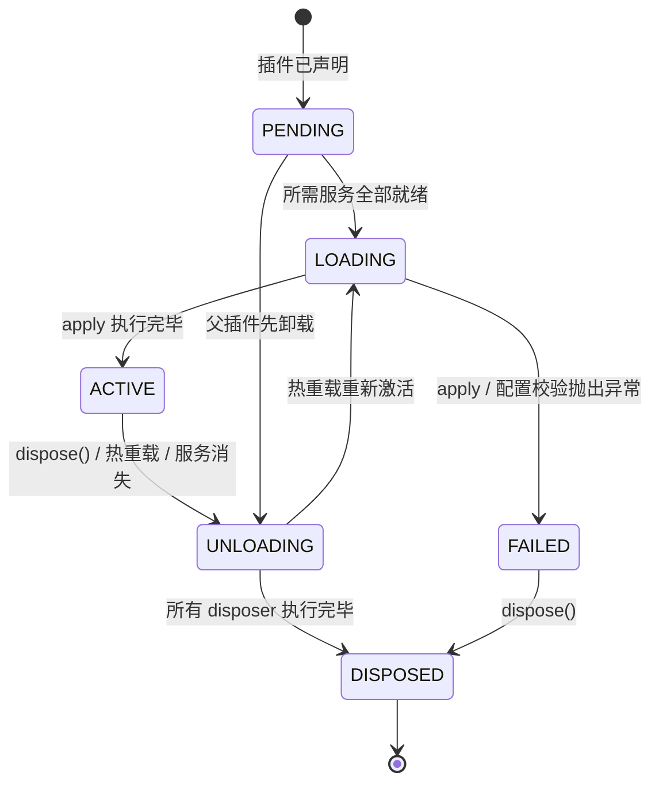
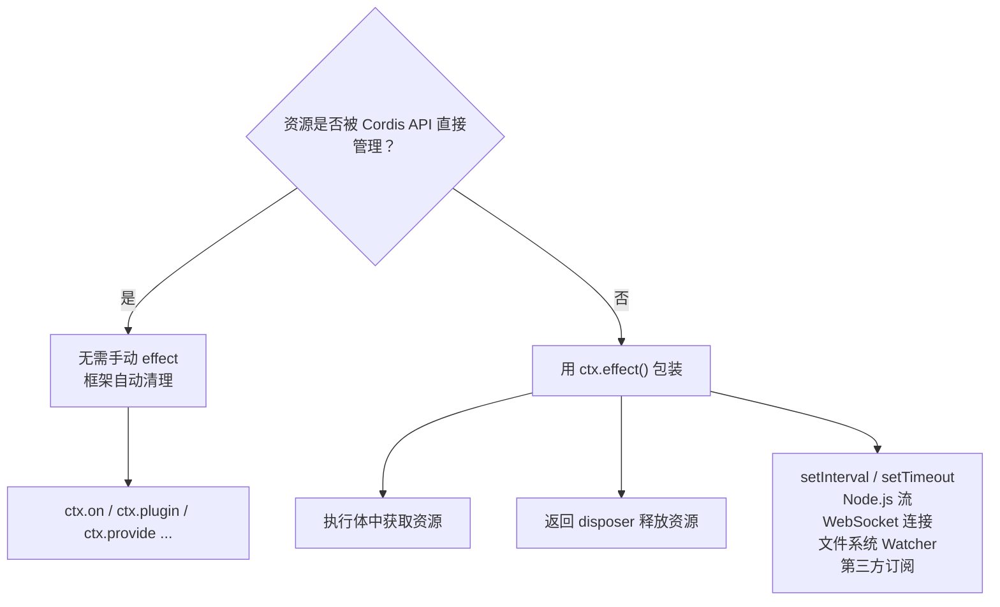
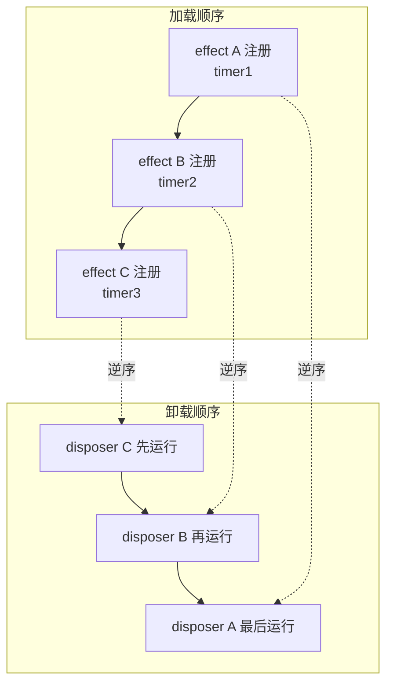

在上一章[编写第一个插件](6-bian-xie-di-ge-cha-jian)中，你学会了如何用 `apply(ctx)` 编写一个最简插件并让它跑起来。但插件并非"启动即永生"——它可能因配置修改、热重载、显式调用 `dispose()` 或所需服务消失而卸载。本章回答一个核心问题：**插件卸载时，它注册过的一切如何自动撤销？** 答案就是 Cordis 的**可逆注册**（reversible registration）机制：通过框架 API 建立的每一条注册都附带一个清理逻辑，会在所属插件卸载时被逆序执行，无需你手动拆除。

---

## 核心概念：Fiber 与插件生命周期

每个被加载的插件实例都拥有一个 **fiber**——它是插件在运行时的"身份证"，记录着当前生命周期状态、校验后的配置、以及已注册的所有副作用（effect）。



下表列出了每个状态的含义和触发条件：

| 状态 | 含义 | 触发条件 |
|------|------|----------|
| **PENDING** | 已声明，但所需服务（`inject`）尚未全部可用 | 插件刚被挂载，或某个依赖被卸载 |
| **LOADING** | `apply` 函数正在执行 | 所需服务全部就绪，开始加载 |
| **ACTIVE** | 插件正常运行中 | `apply` 已顺利完成 |
| **FAILED** | 启动失败 | `apply` 或配置校验抛出异常 |
| **UNLOADING** | 正在执行清理（disposer 逆序运行） | `fiber.dispose()` 被调用，或热重载，或所需服务消失 |
| **DISPOSED** | 已完全拆除，不可恢复 | 所有 disposer 执行完毕 |

PENDING 状态是新手最常遇到的困惑——"我的插件为什么什么都没输出？"通常就是因为某个依赖服务还没注册。我们会在[组合与热重载](#)一章中再次深入讨论。

Sources: [fiber.ts — FiberState 枚举定义](vendor/cordis/src/fiber.ts#L139-L154), [fiber.ts — Fiber 类与状态字段](vendor/cordis/src/fiber.ts#L184-L200)

---

## Effect：副作用的注册与自动清理

**Effect（副作用）**是 Cordis 生命周期管理的核心抽象。一个 effect 由两部分组成：

1. **执行体（execute）**——在插件加载期间立即运行，负责获取资源。
2. **Disposer（释放函数）**——执行体返回的清理函数，在插件卸载时被调用。

整个流程可以用一张图概括：


`ctx.effect()` 接受的执行体可以返回多种形态的副作用结果，这使得它足够灵活以应对不同场景：

| 返回形态 | 适用场景 | 示例 |
|----------|----------|------|
| 同步函数 `() => void` | 同步资源（定时器、DOM 节点） | `return () => clearInterval(timer)` |
| 异步函数 `() => Promise<void>` | 异步资源（数据库连接、网络端口） | `return async () => await db.close()` |
| Promise<Disposer> | 异步初始化后才确定释放逻辑 | `return fetch(...).then(...)` |
| 同步可迭代对象 | 需要注册多个 disposer | `function*() { ... yield disposer1 ... }` |
| 异步可迭代对象 | 异步逐步注册 disposer | `async function*() { ... }` |

Sources: [fiber.ts — Effect 类型定义](vendor/cordis/src/fiber.ts#L68-L94), [fiber.ts — _execute 支持的返回形态](vendor/cordis/src/fiber.ts#L356-L399)

---

## 实战：心跳定时器插件

让我们用一个完整的例子来理解 effect 的工作方式。这个插件会启动一个心跳定时器，并在卸载时自动清理它。

创建 `lifecycle.ts`：

```ts
import type { Context } from '@deepseek-ai/cordis'

export const name = 'lifecycle-demo'

// 子插件：启动心跳定时器
function heartbeat(ctx: Context) {
  console.log('heartbeat plugin loading')
  ctx.effect(() => {
    const timer = setInterval(() => console.log('tick'), 200)
    return () => {
      clearInterval(timer)
      console.log('heartbeat cleaned up')
    }
  })
}

export function apply(ctx: Context) {
  // 将 heartbeat 挂载为子插件，并保留 fiber 引用以便后续 dispose
  const fiber = ctx.plugin(heartbeat)

  // 这个延时器本身也是一个 effect：
  // 如果父插件先卸载，定时器会被取消，不会在一个已经死亡的 app 上触发
  ctx.effect(() => {
    const timer = setTimeout(async () => {
      await fiber.dispose()
      console.log('disposed')
      process.exit(0)
    }, 700)
    return () => clearTimeout(timer)
  })
}
```

运行后你会看到：

```
heartbeat plugin loading
tick
tick
tick
heartbeat cleaned up
disposed
```

**请留意三个关键点：**

- `ctx.plugin(heartbeat)` 把一个**来自代码**的函数挂载为子插件。函数插件不需要 `apply` 方法——Cordis 直接调用该函数，它的 `name` 仅用于诊断。只有对象形式（`{ apply(ctx) {} }`）才必须有 `apply` 方法。
- effect 的执行体在**加载期间**立即运行；它返回的 disposer 在**卸载期间**运行。对于生命周期与插件一致的资源，你**绝不需要**手动调用 disposer。
- `fiber.dispose()` 会等该插件的所有清理工作（包括异步 disposer）完成后才 resolve，并**递归卸载**它挂载的所有子插件。这就是为什么输出中 `heartbeat cleaned up` 出现在 `disposed` 之前——子插件的 disposer 先于父插件完成。

Sources: [02-lifecycle-and-effects.md — 教程原文](docs/cordis-tutorial/02-lifecycle-and-effects.md#L1-L67), [fiber.ts — fiber.dispose 递归卸载](vendor/cordis/src/fiber.ts#L265-L297)

---

## 哪些操作已经是 Effect

`ctx.effect()` 是最底层的副作用原语，但在实际开发中你**很少需要**直接调用它。Cordis 的内置注册 API 本身就已经是 effect——它们在内部都通过 `ctx.effect()` 包装，注册时自动收集 disposer，卸载时自动释放。

| 注册 API | 卸载时自动撤销 | 内部机制 |
|----------|---------------|----------|
| `ctx.on(event, listener)` | 移除事件监听器 | 内部调用 `ctx.fiber.effect()`，返回移除回调 |
| `ctx.plugin(child)` | dispose 子插件及其后代 | 子插件的 disposer 注册在父 fiber 上 |
| `ctx.provide(name, value)` | 注销服务实现，唤醒依赖者等待 | 通过 `ctx.reflect.provide` 注册 disposer |
| `new Service(ctx, name)` | 同上（Service 构造器内部调用 provide） | 构造器自动注册 disposer |
| `ctx.mixin(name, keys)` | 移除上下文属性代理 | 注册 disposer 到当前 fiber |
| Harness 注册表（如 `ctx.tools.register(...)`） | 撤销工具注册 | 返回的 disposer 附着到调用插件 |

以事件监听为例，`ctx.on()` 的内部实现清晰地展示了"可逆注册"的模式：事件服务调用 `ctx.fiber.effect()`，在执行体中把监听器加入列表，disposer 中把它移除。这一切对插件开发者完全透明。

Sources: [events.ts — register() 内部用 effect 包装监听器](vendor/cordis/src/events.ts#L254-L260), [service.ts — Service 构造器自动注册](vendor/cordis/src/service.ts#L42-L58)

---

## 何时需要手动使用 `ctx.effect()`

当资源**不属于上述任何内置 API 的管辖范围**时，你需要用 `ctx.effect()` 显式包装。常见的场景包括：



**规则很简单**：如果资源的生命周期与插件绑定，并且框架不直接管理它，就把它放进 `ctx.effect()`。

Sources: [02-lifecycle-and-effects.md — What is already an effect](docs/cordis-tutorial/02-lifecycle-and-effects.md#L84-L92)

---

## Disposer 执行顺序与并发注意事项

理解 disposer 的执行规则对于编写正确的清理逻辑至关重要：



**关键规则：**

- **同步 disposer** 按注册顺序的**逆序**依次执行（LIFO 栈）。这确保后注册的资源先被释放，避免依赖关系倒置。
- **异步 disposer** 之间会**并发运行**，不保证顺序。如果你有多个异步清理步骤需要严格按序执行，请将它们放在**同一个 disposer** 中，在其中依次 `await`。

以下是一个对比例子，展示"正确"与"错误"的写法：

| ❌ 错误写法 | ✅ 正确写法 |
|------------|------------|
| `ctx.effect(() => { acquireA(); return async () => await releaseA() })` | `ctx.effect(() => {` |
| `ctx.effect(() => { acquireB(); return async () => await releaseB() })` | `  acquireA()` |
| ↑ 两个异步 disposer **并发执行**， | `  acquireB()` |
| `releaseB()` 可能在 `releaseA()` 之前完成 | `  return async () => {` |
| | `    await releaseA()` |
| | `    await releaseB()` |
| | `  }` |
| | `})` |
| | ↑ 在同一 disposer 中**按序 await** |

Sources: [02-lifecycle-and-effects.md — 顺序注意事项](docs/cordis-tutorial/02-lifecycle-and-effects.md#L94), [fiber.ts — _unload 并发执行 disposer](vendor/cordis/src/fiber.ts#L675-L696)

---

## 深入理解：卸载机制的源码级视角

当 fiber 进入 UNLOADING 状态时，`_unload()` 方法会取出所有已注册的 disposer 并并发执行：

```ts
private async _unload() {
  await Promise.all(this._disposables.clear().map(async (dispose) => {
    try {
      await runDisposable(dispose)
    } catch (reason) {
      this.ctx.logger.error(reason)
    }
  }))
  // ...
}
```

注意三点：所有 disposer 通过 `Promise.all` **并发**执行（这正是上述并发注意事项的根源）；每个 disposer 的错误都被**独立捕获**并记入日志，不会中断其他 disposer；清理完成后，如果 fiber 的 epoch 表明它应该重新激活（如热重载场景），会自动进入 `_reload()`。

Sources: [fiber.ts — _unload 实现](vendor/cordis/src/fiber.ts#L675-L696), [fiber.ts — _reload 实现](vendor/cordis/src/fiber.ts#L646-L673)

---

## 小结

| 概念 | 一句话总结 |
|------|-----------|
| **Fiber** | 每个已加载插件实例的运行时身份，跟踪状态、配置和副作用 |
| **状态机** | PENDING → LOADING → ACTIVE → UNLOADING → DISPOSED |
| **Effect** | 副作用注册原语：执行体立即运行，disposer 卸载时自动调用 |
| **可逆注册** | 内置 API（`ctx.on`、`ctx.plugin`、`ctx.provide` 等）本身就是 effect，注册即绑定清理 |
| **`ctx.effect()`** | 用于包装框架不直接管理的资源（定时器、连接等） |
| **执行顺序** | 同步 disposer 逆序；异步 disposer 并发——需要严格顺序时合并到同一 disposer |

理解了生命周期和副作用机制后，你已经具备了编写"安全卸载"插件的知识基础。下一章[服务声明与依赖注入](8-fu-wu-sheng-ming-yu-yi-lai-zhu-ru)将介绍插件如何通过 `inject` 声明依赖、如何暴露服务给其他插件使用——这正是 PENDING 状态背后的完整故事。