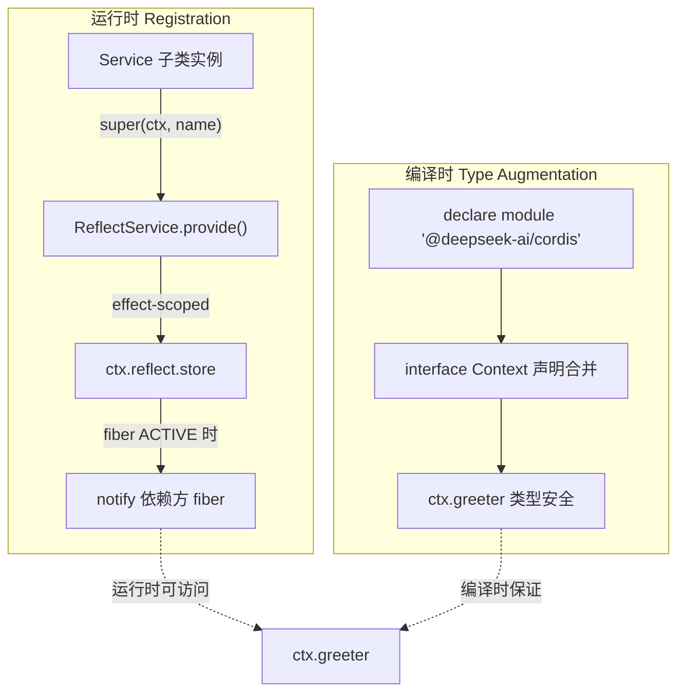
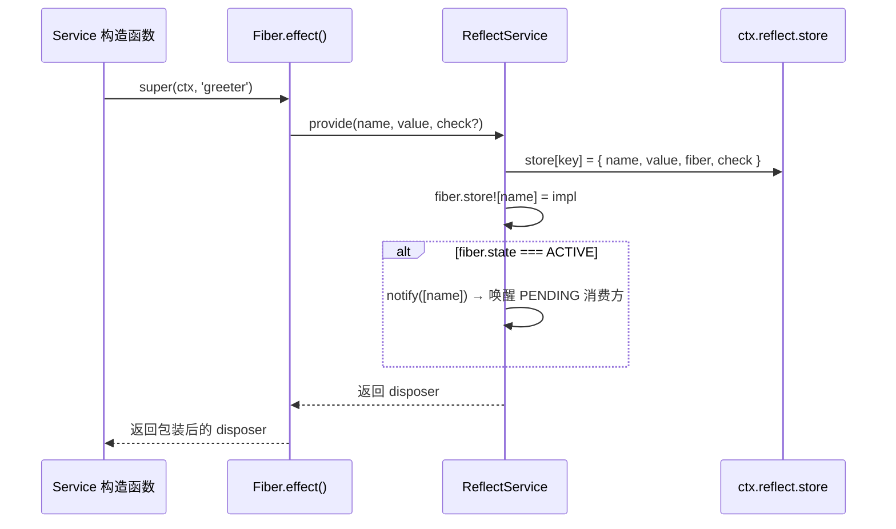
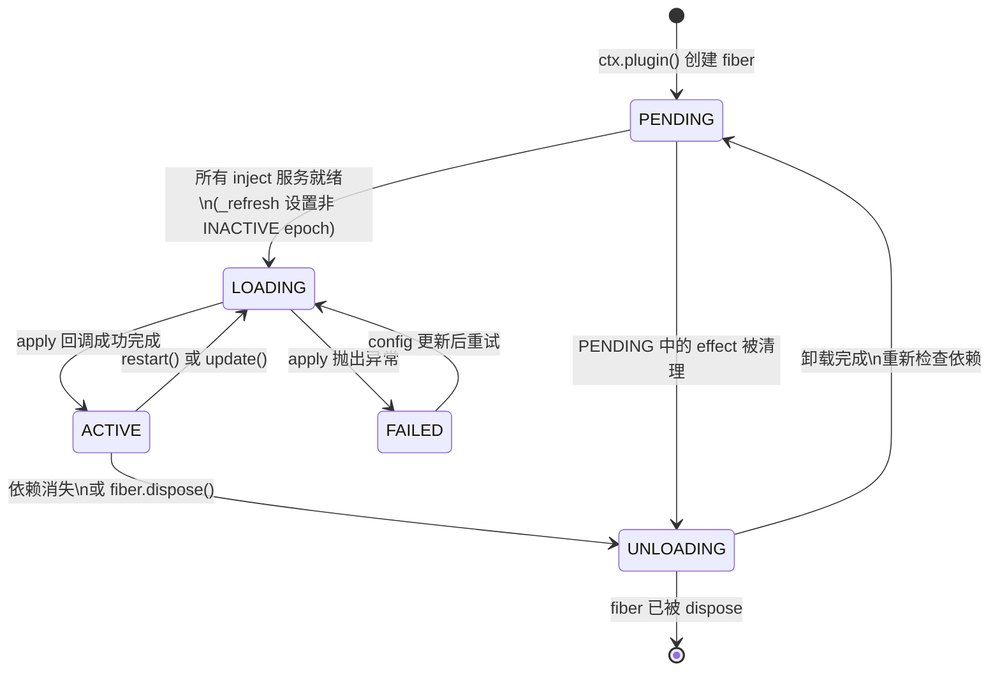
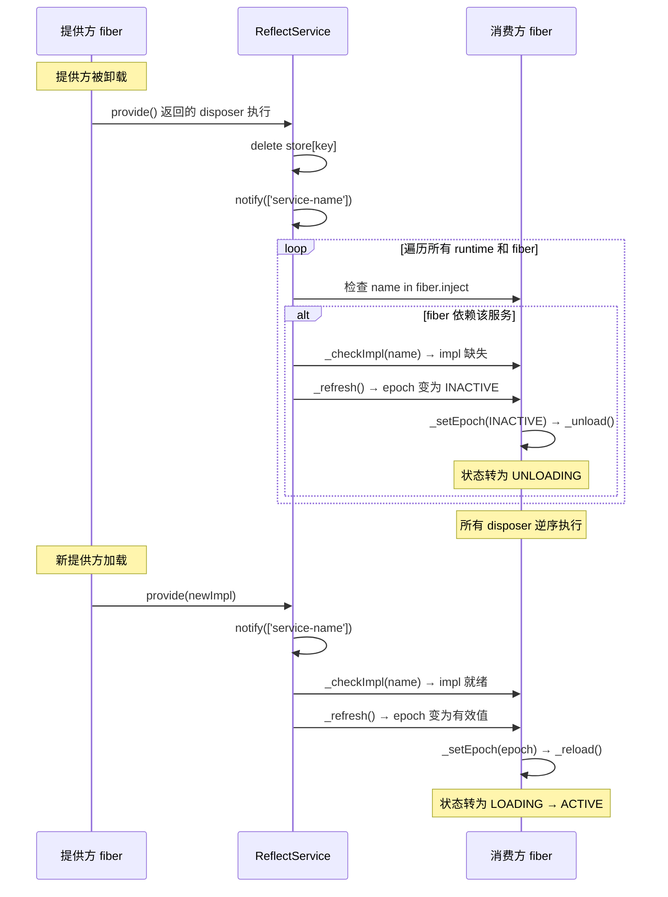

在 Cordis 框架中，**服务**是插件之间通信的桥梁：一个插件**提供**具名能力，其他插件通过 `ctx` **消费**该能力而不直接导入其实现。这种"按能力而非按实现"的解耦，是 deepseek-harness 能够在不修改消费方代码的前提下替换 LLM 适配器、Shell 执行器、文件系统后端等关键能力的基础。本页将深入解析服务声明的两个层面（运行时注册与编译时类型增强）、依赖注入的状态机原理、以及实际工程中的使用模式。

## 核心概念：Service 与 Context 接口

Cordis 的服务系统建立在两个协同机制之上。**运行时**层面，`Service` 基类的构造函数通过 `super(ctx, name)` 立即将实例注册到上下文的服务存储中——注册本身是一个 effect，随着提供方 fiber 的卸载自动撤销。**编译时**层面，TypeScript 的声明合并（declaration merging）将服务名称注入 `Context` 接口，使 `ctx.greeter` 这样的属性访问在类型层面合法化。这两层缺一不可：运行时注册让服务可被发现，类型声明让消费方获得编译时安全。



`Service` 基类本身是一个抽象类，定义了七个静态符号键（`init`、`check`、`config`、`invoke`、`extend`、`tracker`、`resolveConfig`），分别控制构造后初始化、可用性谓词、拦截配置解析等行为。当子类在构造函数中调用 `super(ctx, name)` 时，框架将实例注册为 `ctx.reflect` 管理的服务实现（`Impl`），并返回一个绑定到当前 fiber 上下文的 disposer。 [Service 基类](vendor/cordis/src/service.ts#L11-L59)

Sources: [service.ts](vendor/cordis/src/service.ts#L11-L59), [service.zh.md](docs/cordis-api/service.zh.md#L8-L14)

## 声明服务：从类到插件

### 标准声明模式

一个完整的服务声明包含三个部分：类定义（继承 `Service`）、类型增强（扩展 `Context` 接口）和插件入口（`apply` 函数或 `provide` 字段）。以下代码展示了 harness 中 `ShellExecutor` 的声明方式——一个抽象服务，由 `bash-local` 或 `pwsh-local` 等具体实现来填充：

```ts
// 1. 类型增强：将 'shell' 加入 Context 接口
declare module '@deepseek-ai/cordis' {
  interface Context {
    shell: ShellExecutor
  }
}

// 2. Service 子类：以 'shell' 名称注册
export abstract class ShellExecutor extends Service {
  constructor(ctx: Context) {
    super(ctx, 'shell')        // ← 运行时注册
  }
  abstract resolve(request: ShellExecRequest): ShellExecSpec
  abstract run(spec: ShellExecSpec): Promise<ShellRunResult>
  abstract start(spec: ShellExecSpec): ShellProcess
}
```

`Service` 子类本身就是插件（类形态），因此 `ctx.plugin(ShellExecutor)` 会像挂载任何其他插件一样挂载它。`super(ctx, 'shell')` 在构造函数中执行注册逻辑：如果子类定义了 `[Service.invoke]` 符号方法，实例将被包装为可调用对象；否则直接注册为普通属性。注册完成后，任何注入了 `'shell'` 的插件都能通过 `ctx.shell` 访问该实例。 [ShellExecutor](packages/shell/shell/src/index.ts#L40-L101)

### 类形态插件中的 `static inject`

当 Service 子类自身也需要依赖其他服务时，使用 **静态 `inject`** 属性而非模块级 `export const inject`。`ToolRuntime` 展示了这一模式——它声明依赖 `systemPrompt` 服务，同时自身作为 `tools` 服务注册：

```ts
export class ToolRuntime extends Service {
  static inject = ['systemPrompt']   // ← 类静态属性

  constructor(ctx: Context, config: Config = {}) {
    super(ctx, 'tools')               // ← 注册为 'tools' 服务
    // ...
  }
}
```

`RegistryService.plugin()` 在加载插件时会调用 `Inject.resolve(plugin.inject)` 将 inject 声明规范化为 `{ name: config | null }` 映射表，无论该声明来自模块导出还是类静态属性，处理逻辑完全一致。 [ToolRuntime](packages/core/tools/src/index.ts#L787-L829)

### 运行时注册的内部流程

当 `super(ctx, name)` 执行时，实际调用的是 `ReflectService.provide()`，它将注册包装在一个 fiber effect 中：



这个 disposer 会在 fiber 卸载时自动执行，从 store 中删除该实现并再次调用 `notify()`，使依赖该服务的所有 fiber 重新评估依赖状态。 [ReflectService.provide](vendor/cordis/src/reflect.ts#L277-L305)

Sources: [shell/src/index.ts](packages/shell/shell/src/index.ts#L40-L101), [tools/src/index.ts](packages/core/tools/src/index.ts#L787-L829), [reflect.ts](vendor/cordis/src/reflect.ts#L277-L305)

## 消费服务：`inject` 与 Fiber 状态机

### 硬性依赖：`inject` 数组

插件通过声明 `inject` 列表来声明它需要的服务。Cordis 会让插件保持 **PENDING** 状态，直到列出的每项服务都存在且其提供方 fiber 处于 ACTIVE 状态。harness 中的 `tool-fs` 插件展示了这一模式：

```ts
export const name = 'tool-fs'

// 硬性依赖：必须全部就绪后 apply 才会执行
export const inject = ['tools', 'fs', 'systemPrompt']

export function apply(ctx: Context, config: Config): void {
  // 在此处可以安全使用 ctx.tools, ctx.fs, ctx.systemPrompt
}
```

`inject` 有两种形式：**数组形式**（如上例）声明纯依赖，不带拦截配置；**对象形式**将每个服务名映射到可选的拦截配置，该配置会合并到消费方的上下文中。 [Inject 类型](vendor/cordis/src/registry.ts#L19-L24) [tool-fs](packages/fs/tool-fs/src/index.ts#L19-L22)

### 可选依赖：`ctx.inject()` 与 `ctx.get()`

并非所有依赖都是硬性的。当某项服务缺失时插件仍可运行，可以使用两种方式处理可选依赖：

| 模式 | 适用场景 | 行为 |
|------|----------|------|
| `export const inject = ['a', 'b']` | 硬性依赖，缺失则插件不启动 | fiber 保持 PENDING，apply 不执行 |
| `ctx.inject(['a'], (ctx) => { ... })` | 延迟回调，服务就绪时执行 | 等价于 `ctx.plugin({ inject, apply: callback })`，服务消失时回调自动卸载并在恢复后重新执行 |
| `ctx.get('a')` | 单次探测，不跟踪后续变化 | 返回 `undefined` 当无提供方，不阻塞 apply 执行 |

`tool-fs` 同时使用了硬性依赖和 `ctx.inject()` 可选依赖。`read_image` 工具仅在 `attachments` 服务挂载时才注册：

```ts
export const inject = ['tools', 'fs', 'systemPrompt']  // 硬性

export function apply(ctx: Context, config: Config): void {
  // ... read/write/edit 工具注册 ...

  // 可选依赖：attachments 就绪后才注册 read_image
  ctx.inject(['attachments'], (imageCtx) => {
    applyReadImageTool(imageCtx)
  })
}
```

`ctx.inject()` 本质上是 `ctx.plugin({ inject, apply: callback })` 的语法糖——它创建一个子 fiber，该 fiber 同样遵循 PENDING → LOADING → ACTIVE 状态流转，并在依赖变化时自动卸载/重载。 [RegistryService.inject](vendor/cordis/src/registry.ts#L300-L302) [tool-fs apply](packages/fs/tool-fs/src/index.ts#L54-L79)

Sources: [registry.ts](vendor/cordis/src/registry.ts#L300-L302), [tool-fs/src/index.ts](packages/fs/tool-fs/src/index.ts#L19-L79), [reflect.ts](vendor/cordis/src/reflect.ts#L9-L46)

## Fiber 生命周期与依赖追踪

### 六态状态机

每个插件加载都对应一个 **Fiber** 实例，它在六个状态之间流转。理解这个状态机是掌握 Cordis 依赖注入的关键：



| 状态 | 含义 | PENDING fiber 是否持有事件循环 |
|------|------|------|
| **PENDING** | 等待所需服务出现 | 否（不阻止进程退出） |
| **LOADING** | apply 回调正在执行 | 是 |
| **ACTIVE** | 已加载，提供服务 | 是 |
| **FAILED** | apply 或配置验证抛出异常 | 否 |
| **UNLOADING** | disposer 链正在逆序执行 | 是 |
| **DISPOSED** | fiber 已被永久移除 | 否 |

[FiberState 枚举](vendor/cordis/src/fiber.ts#L147-L154)

### 依赖解析的 epoch 机制

Cordis 使用 **epoch 字符串**来追踪依赖组合的变化。`_refresh()` 方法遍历所有 inject 声明，收集每个依赖对应提供方的 fiber uid，拼接为一个以冒号分隔的字符串。当这个字符串发生变化时（服务出现、消失或提供方切换），`_setEpoch()` 触发 fiber 的加载或卸载：

```
// epoch 构建逻辑（简化）
let epoch = ''
for (const name of Object.keys(this.inject)) {
  const impl = this._store[name]
  if (!impl) {
    epoch = INACTIVE    // 任一依赖缺失 → PENDING
    break
  }
  epoch += ':' + impl.fiber.uid
}
// epoch 例如 ":3:5:7" 表示依赖 uid 为 3, 5, 7 的三个 fiber
```

这个设计的精妙之处在于：**epoch 的值同时编码了"所有依赖都存在"和"具体由哪些 fiber 提供"两个事实**。当提供方被热替换（旧 fiber 卸载、新 fiber 加载），epoch 字符串自然变化，消费方 fiber 自动卸载旧回调并重新加载。 [Fiber._refresh](vendor/cordis/src/fiber.ts#L611-L623) [Fiber._checkImpl](vendor/cordis/src/fiber.ts#L597-L609)

### `_checkImpl` 的可用性谓词

除了检查服务是否存在且提供方处于 ACTIVE 状态，`_checkImpl` 还会调用服务实现上的可选 `check` 谓词。这允许服务提供方声明更精细的可用性条件——例如，某个服务虽然在 store 中存在，但内部状态可能使其暂时不可用。 [Fiber._checkImpl](vendor/cordis/src/fiber.ts#L597-L609)

Sources: [fiber.ts](vendor/cordis/src/fiber.ts#L147-L154), [fiber.ts](vendor/cordis/src/fiber.ts#L597-L623), [fiber.ts](vendor/cordis/src/fiber.ts#L625-L639)

## 持续追踪：服务变更的涟漪效应

`inject` 不是一次性的启动检查。**在应用运行期间，如果所需服务消失（提供方被卸载或热替换），每个依赖插件也会随之卸载，并在服务恢复后再次加载。** 这一行为由 `ReflectService.notify()` 驱动：



这也是**配置中可以替换服务**的根本原因：卸载 `dsh-bash-local` 配置项，挂载另一个 `shell` 提供方，所有注入 `'shell'` 的插件会干净地重启并使用新实现。结合 effect 机制（上一章的 `ctx.effect()`），disposer 保证了旧回调中注册的定时器、连接、文件句柄等资源被正确释放，不会残留。 [notify 实现](vendor/cordis/src/reflect.ts#L314-L336)

Sources: [reflect.ts](vendor/cordis/src/reflect.ts#L277-L336), [fiber.ts](vendor/cordis/src/fiber.ts#L675-L696)

## Harness 中的服务全景

以下是 deepseek-harness 核心注册的具名服务及其声明方式：

| 服务名 | 提供方 | 典型消费方 | 声明方式 |
|--------|--------|-----------|----------|
| `tools` | `ToolRuntime` (extends Service) | agent-loop, tool-fs, shell 工具 | 类形态，`static inject = ['systemPrompt']` |
| `llm` | `LlmRuntime` (extends Service) | agent-loop, session-title | 类形态，无 inject |
| `shell` | `ShellExecutor` (abstract, extends Service) | tool-bash, tool-pwsh | 抽象类，由 bash-local/pwsh-local 继承 |
| `fs` | `FilesystemService` (extends Service) | tool-fs, tool-str-replace-editor | 类形态 |
| `systemPrompt` | SystemPrompt 服务 | ToolRuntime, tool-fs | 类形态 |

这些服务名称共享一个**扁平命名空间**。harness 已占用 `tools`、`llm`、`shell`、`fs` 等通用名称，自有服务应添加有辨识度的前缀（如 `dsh-`）。 [ToolRuntime](packages/core/tools/src/index.ts#L787-L829), [LlmRuntime](packages/llm/llm/src/index.ts#L284-L294), [ShellExecutor](packages/shell/shell/src/index.ts#L65-L101)

### Context Proxy 与服务解析

所有 `ctx.xxx` 的属性访问都经过 `ReflectService.handler` 代理。当读取一个未直接定义在 context 对象上的属性时，代理从 fiber 的 `store` 中查找实现。如果属性在 `fiber.inject` 中声明但 store 中没有活跃实现，框架抛出明确的错误信息，而非返回 `undefined`——这是类型安全与运行时安全的双重保障：

```
ctx.greeter
  → ReflectService.handler.get(target, 'greeter', ctx)
  → 检查 target.reflect.props['greeter']
  → 查找 fiber.store['greeter']
  → 返回 impl.value（已包装 traceable）
```

 [Proxy handler](vendor/cordis/src/reflect.ts#L135-L171)

Sources: [tools/src/index.ts](packages/core/tools/src/index.ts#L787-L829), [llm/src/index.ts](packages/llm/llm/src/index.ts#L284-L294), [shell/src/index.ts](packages/shell/shell/src/index.ts#L65-L101), [reflect.ts](vendor/cordis/src/reflect.ts#L135-L171)

## 实战要点

**选择声明方式的决策表：**

| 场景 | 推荐方式 | 示例 |
|------|----------|------|
| 提供具名 API，其他插件可注入 | `extends Service` + `declare module` | `ShellExecutor`、`LlmRuntime` |
| 只消费服务，不提供新服务 | 函数插件 + `export const inject = [...]` | `tool-fs` |
| 同时提供和消费 | 类插件 + `static inject = [...]` | `ToolRuntime` |
| 条件性消费（服务可选） | `ctx.inject(['x'], cb)` 或 `ctx.get('x')` | `tool-fs` 中的 `attachments` |

**关键不变量：**

- 一个服务名称在同一个隔离域（isolation scope）中只能由一个 fiber 提供——重复注册会抛出错误，这是 Cordis 的标准重复服务行为。
- `inject` 声明的服务在 `apply` 执行期间**保证就绪**，无需 null 检查。
- PENDING fiber 不会阻止 Node 事件循环退出——一个只有 PENDING 插件的组合会以 exit code 0 静默退出。
- 服务注册是 fiber-scoped effect——提供方卸载时服务自动撤销，并触发所有依赖方的重新评估。

掌握了服务声明与依赖注入后，下一步可以学习 [类型化事件与分发模式](9-lei-xing-hua-shi-jian-yu-fen-fa-mo-shi)，了解插件之间无需共享服务即可通信的机制。