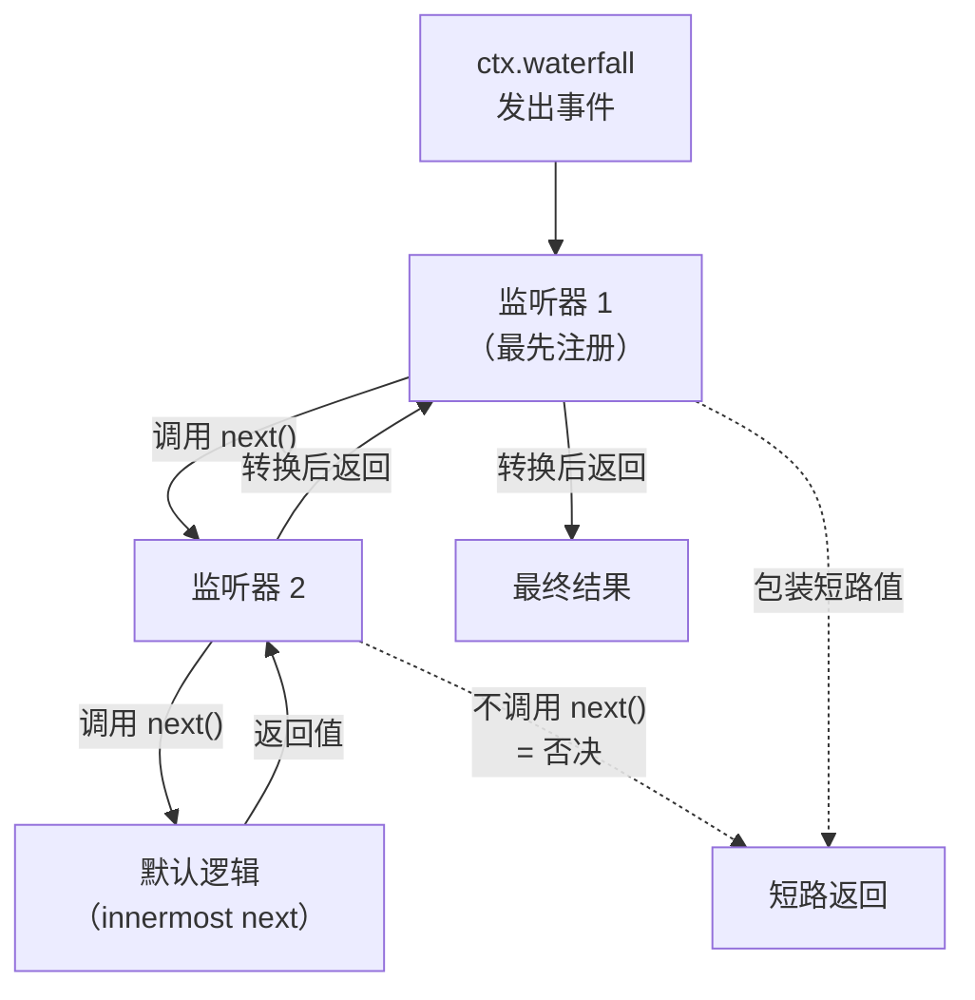
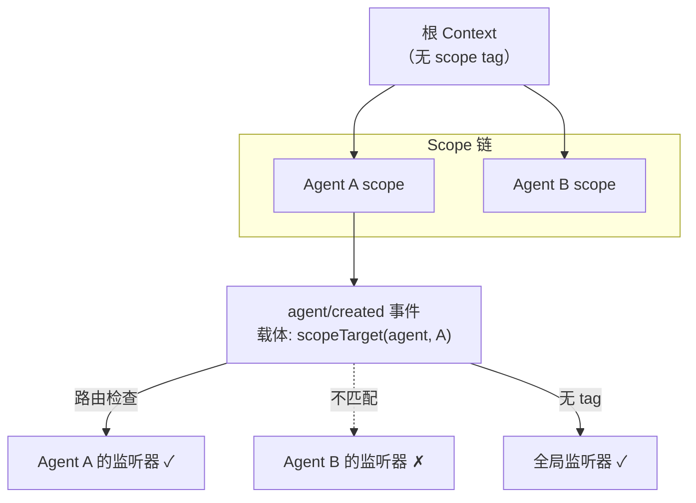

Cordis 框架的事件系统是插件之间解耦通信的核心机制。与服务的**直接调用**不同，事件让一个插件在无需知道"谁在监听"的前提下发出通知或请求决策。本文深入剖析 harness 如何通过 TypeScript 声明合并实现事件类型安全，通过五种分发模式控制监听器的并发与短路语义，以及如何利用 scope 过滤机制将事件路由到特定的 Agent 上下文。

---

## 类型声明：Events 接口合并

事件系统的类型安全建立在 TypeScript 的 **declaration merging**（声明合并）之上。每个插件通过 `declare module` 向全局 `Events` 接口添加自己的事件签名，编译器随后在所有调用点（`ctx.emit`、`ctx.on`、`ctx.waterfall` 等）强制检查事件名称与参数类型。

一个典型的事件声明如下所示，摘自 agent 子系统：

```ts
declare module '@deepseek-ai/cordis' {
  interface Events {
    'agent/created'(this: Scoped<Agent>, payload: { agent: Agent }): void
    'agent/pre-step'(
      this: Scoped<Agent>,
      payload: { agent: Agent; messages: UserMessage[]; turn: number; step: number; signal: AbortSignal },
      next: () => Promise<PreStepDecision>
    ): Promise<PreStepDecision>
  }
}
```

这段声明定义了两个事件：`agent/created` 使用 `emit` 模式（返回 `void`），`agent/pre-step` 使用 `waterfall` 模式（最后一个参数是 `next` 回调）。`this: Scoped<Agent>` 标记该事件受到 scope 过滤，只有注册在对应 Agent 作用域链上的监听器才会收到。

**命名约定**是 `namespace/action` 的扁平结构——例如 `agent/status`、`tools/execute`、`session/event`。这种结构在大型项目中保持了可读性，同时所有事件名共享同一个扁平命名空间，无需导入。

Sources: [runtime-types.ts](packages/core/agent/src/runtime-types.ts#L146-L291)

---

## 五种分发模式

事件的分发模式不是调用方选择的——它是**事件契约的一部分**，在声明时由参数签名和返回类型隐式确定。每个事件在所属子系统的参考文档中通过 `@mode` JSDoc 标签明确标注其模式。下表对比了五种模式的语义差异：

| 模式 | 调用形式 | 监听器执行 | 返回值收集 | 短路行为 |
|---|---|---|---|---|
| **emit** | `ctx.emit(name, ...args)` | 同步逐个调用 | 不收集 | 无短路 |
| **parallel** | `await ctx.parallel(name, ...args)` | 全部并发 | 等待全部完成 | 无短路 |
| **serial** | `await ctx.serial(name, ...args)` | 按顺序异步等待 | 第一个 bail 值胜出 | 第一个非空值停止 |
| **bail** | `ctx.bail(name, ...args)` | 按顺序同步调用 | 第一个 bail 值胜出 | 第一个非空值停止 |
| **waterfall** | `ctx.waterfall(name, ...args, next)` | 环绕中间件链 | 最外层返回值 | 不调用 `next()` 即否决 |

**emit** 是最轻量的模式，用于**通知型事件**——生命周期变化、状态更新等。监听器同步执行，返回的 Promise 不会被等待，抛出的异常不会被框架捕获（由调用方决定是否包裹）。harness 中 `agent/created`、`agent/status`、`session/event`、`tools/result` 等事件都使用此模式。

**parallel** 用于需要等待所有监听器完成的场景，最典型的例子是 `session/flush`——会话持久化检查点事件。框架并发启动所有监听器，然后 `Promise.all` 等待它们全部完成，任何一个监听器都无法阻止其他监听器运行。

**serial** 用于需要按顺序询问多个监听器、且第一个给出有效答案即停止的场景。harness 中 `agent/turn-stopping` 使用此模式：每个监听器可以反对关闭当前 turn，一旦有监听器返回非空值，后续监听器不再执行。

**waterfall** 是功能最强大的模式，也是 harness 扩展点的首选。每个监听器收到参数加上一个 `next()` 回调；调用 `next()` 将控制权传递给下一个监听器，最终到达内置默认逻辑；不调用 `next()` 则**否决**后续链条。

Sources: [events.md](docs/cordis-api/events.md#L8-L124), [04-events.md](docs/cordis-tutorial/04-events.md#L80-L92)

---

## Waterfall 深入：拦截、转换与短路

waterfall 的核心思想是**环绕中间件**（around-middleware）。以下流程图展示了监听器链条的执行顺序：



关键纪律是：**仅负责观察或标注的 waterfall 监听器必须调用 `next()`**。返回而不调用 `next()` 代表有意短路——它会吞掉链条中所有后续监听器和默认逻辑的执行。一个忘记调用 `next()` 的日志监听器会悄无声息地破坏所有下游行为。

以 harness 中 `tools/pre-execute` 事件为例，`hooks-claude-code` 插件在工具执行前进行权限检查。如果规则拒绝该工具调用，监听器返回拒绝决策且不调用 `next()`，链条短路，工具不会执行。如果规则允许，监听器调用 `next()` 将决策权交给链条中的下一个监听器或默认逻辑。

在 `agent/request-error` 事件中，`llm-retry` 插件实现了更复杂的 waterfall 监听器：它先检查是否需要重试（基于 provider 的重试策略和失败代码），如果需要则计算退避延迟并返回 `{ kind: 'retry' }`，否则调用 `next()` 委托给链条中的下一个恢复策略。这保证了多个错误恢复策略可以按注册顺序协作。

Sources: [04-events.md](docs/cordis-tutorial/04-events.md#L94-L141), [llm-retry/index.ts](packages/llm/llm-retry/src/index.ts#L156-L219)

---

## Scope 过滤：Scoped 事件路由

当系统中存在多个 Agent 时，事件需要精确路由到正确的 Agent 上下文，而不是广播给所有监听器。harness 通过 `@deepseek-ai/dsh-scope` 包实现了一套**不透明的 scope key 路由机制**。

### Scope 载体与路由

`scopeTarget(base, key)` 构建一个**路由载体**（carrier），它是一个纯路由对象，不暴露 subject 的任何属性。该载体通过 Cordis 的 `Context.filter` 机制决定哪些监听器能收到事件：

```ts
// 来自 packages/core/scope/src/index.ts
export function scopeTarget<T extends object>(base: T, key: ScopeKey | undefined): Scoped<T> {
  const carrier = {
    [CordisContext.filter](ctx: Context): boolean {
      if (baseFilter !== undefined && !baseFilter.call(base, ctx)) return false
      const tag = scopeOf(ctx)
      if (tag === undefined) return true      // 未标记的监听器始终接收
      for (let cursor = key; cursor !== undefined; cursor = scopeParents.get(cursor)) {
        if (cursor === tag) return true        // 匹配自身或祖先 scope
      }
      return false
    },
  }
  return carrier as unknown as Scoped<T>
}
```

这段逻辑实现了一个关键规则：**事件沿 scope 链向上流动，永不向下**。一个注册在父 scope 上的监听器会收到所有子 scope 的事件，但子 scope 的监听器不会收到父 scope 的事件。这让一个全局组合可以观察到其下所有 Agent 的活动。

### Scope 嵌套关系



### 融合分发器：agentEvents

Agent 子系统提供了 `agentEvents` 函数，构建一个**融合分发器**（fused dispatcher），自动将 Agent 的 scope 载体注入到事件分发中。调用方只需传递 payload 的非 `agent` 字段，分发器自动注入 subject，确保 scope key 与 payload 中的 `agent` 字段不会出现不一致：

```ts
export function agentEvents(
  ctx: Context,
  agent: Agent,
  carrier: Scoped<Agent> = agentCarrier(agent),
): AgentEventDispatch {
  const fused = <K extends AgentSubjectEvent>(payload: PayloadRest<K>): PayloadOf<K> =>
    ({ ...payload, agent } as PayloadOf<K>)
  return {
    emit(name, payload) {
      const args = [carrier, name, fused(payload)]
      const callbacks = ctx.events.dispatch('emit', args)
      for (const callback of callbacks) {
        try {
          const returned = callback(...args)
          void Promise.resolve(returned).catch((error) => {
            ctx.logger.warn(`agent event "${name}" listener rejected: ${String(error)}`)
          })
        } catch (error) {
          ctx.logger.warn(`agent event "${name}" listener threw: ${String(error)}`)
        }
      }
    },
    // serial、waterfall 同理...
  }
}
```

注意 `emit` 实现中，每个监听器的同步异常和异步拒绝都被**独立捕获**——一个监听器的失败不会影响后续监听器。这是因为 Cordis 原生 `emit` 的异常会饿死后续监听器，而 Agent 通知事件被设计为不可否决的。

### 自动化不变量检查

harness 通过代码生成器 `scripts/gen-scoped-events.ts` 对 scoped 事件进行编译时不变量检查。生成器扫描所有声明了 `this: Scoped<T>` 的事件，验证其 payload 中是否恰好包含一个与 scope base 类型匹配的字段，并生成运行时 resolver 映射。零匹配需要显式标注 `@dshScopeScan unsupported`，多重匹配则直接报错。

Sources: [scope/index.ts](packages/core/scope/src/index.ts#L158-L204), [agent/dispatch.ts](packages/core/agent/src/dispatch.ts#L98-L165), [scoped-events.generated.ts](packages/core/scope/src/scoped-events.generated.ts#L1-L49)

---

## 监听器注册与生命周期

### 自动清理

`ctx.on()` 是一个 **effect**（副作用注册），监听器随注册它的 Fiber（插件实例）一同销毁。这意味着**永远不需要手动调用 `removeEventListener`**——当插件被卸载或 HMR 重新加载时，它注册的所有监听器会自动消失。

```ts
export function apply(ctx: Context): void {
  // 监听器在 apply 执行期间注册，随插件 Fiber 销毁自动移除
  ctx.on('agent/status', ({ agent, status }) => {
    console.log(`Agent ${agent.id} -> ${status}`)
  })
}
```

### 注册选项

`ctx.on()` 和 `ctx.once()` 接受一个可选的第三参数，控制监听器的插入位置和过滤行为：

| 选项 | 类型 | 默认值 | 语义 |
|---|---|---|---|
| `prepend` | `boolean` | `false` | 将监听器插入到已注册监听器**之前** |
| `global` | `boolean` | `false` | 绕过 Context filter 检查，始终接收事件 |
| `true`（简写） | `boolean` | — | 等价于 `{ prepend: true }` |

`prepend` 在需要优先拦截时使用——例如一个安全策略插件希望在其他插件之前看到 `tools/pre-execute` 事件。`global` 则用于需要观察所有 scope 事件的诊断工具。

`ctx.once()` 的语义与 `ctx.on()` 相同，但监听器在第一次调用后自动注销。

Sources: [events.md](docs/cordis-api/events.md#L125-L187)

---

## 实战事件矩阵：Harness 核心事件

以下是 harness 中最具代表性的 scoped 事件及其分发模式，展示了事件系统如何支撑核心扩展点：

| 事件 | 模式 | 声明位置 | 典型监听器 | 用途 |
|---|---|---|---|---|
| `agent/created` | emit | `dsh-agent` | agent-presets, goal-round-driver | Agent 创建通知 |
| `agent/pre-step` | waterfall | `dsh-agent` | compaction-basic, agent-instructions | 步骤准入决策 |
| `agent/request` | waterfall | `dsh-agent` | agent（模型配置替换） | 模型调用配置拦截 |
| `agent/request-error` | waterfall | `dsh-agent` | compaction-basic, llm-retry | 请求失败恢复 |
| `agent/turn-stopping` | serial | `dsh-agent` | hooks-claude-code, hooks-codex | Turn 关闭异议 |
| `tools/pre-execute` | waterfall | `dsh-core/tools` | hooks-claude-code, timeout-policy | 工具执行前置门控 |
| `tools/execute` | waterfall | `dsh-core/tools` | session-checkpoint-policy, timeout-policy | 工具执行环绕 |
| `tools/post-execute` | waterfall | `dsh-core/tools` | hooks-claude-code, repeat-tool-reminder | 工具结果后处理 |
| `approval/request` | waterfall | `dsh-user-approval` | acp, apiproxy | 审批请求决策 |
| `system-prompt/assemble` | waterfall | `dsh-system-prompt` | agent, agent-presets | 系统提示词组装 |
| `llm/stream` | waterfall | `dsh-llm` | agent-loop, llm-replay | LLM 流式调用拦截 |
| `session/flush` | parallel | `dsh-session` | session-persistence, session-telemetry | 持久化检查点 |

以 `compaction-basic` 为例，它同时监听三个不同模式的事件：在 `agent/pre-step`（waterfall）中检查 token 压力并决定是否压缩上下文，在 `agent/status`（emit）中清理溢出重试计数器，在 `agent/request-error`（waterfall）中处理上下文窗口溢出的自动恢复。这种"一个插件监听多个事件"的模式是 harness 扩展的常态。

Sources: [event-producer-consumer.md](docs/event-producer-consumer.md#L8-L65), [compaction-basic/index.ts](packages/compaction/compaction-basic/src/index.ts#L147-L223)

---

## 非作用域事件与内部事件

并非所有事件都走 scope 过滤路径。一些事件被设计为**全局通知**，例如 `tools/change`（工具集变化）和 `system-prompt/change`（系统提示词变化）——这些事件不声明 `this: Scoped<T>`，不带 scope 载体，所有监听器都能收到。

此外，harness 内部还使用了一组 `internal/*` 命名空间的事件字符串（`internal/dispatch`、`internal/plugin`、`internal/service`、`internal/status`），它们未在 `Events` 接口中正式声明，属于 Cordis 框架层的生命周期事件，由 `loader`、`gateway` 等基础设施模块消费。

Sources: [event-producer-consumer.md](docs/event-producer-consumer.md#L67-L76), [tools/index.ts](packages/core/tools/src/index.ts#L198-L208)

---

## 文件系统事件：无作用域的单槽决策

文件系统子系统的事件模式值得单独说明。`fs/write-intent`、`fs/edit-intent` 和 `fs/observed` 三个事件不使用 `Scoped<T>` 声明——它们的分发不经过 scope 载体，而是由工具直接以普通参数形式分发。`fs-observation-policy` 插件监听这些事件时占据**单一决策槽**：它不调用 `next()`，直接返回自己的决策值，因为观察策略是唯一的意图裁决者。

```ts
// fs-observation-policy 注册的监听器——占据决策槽，不调用 next()
ctx.on('fs/write-intent', (target, actor) =>
  Promise.resolve().then(() => gate.writeIntent(target, actor))
)
```

这种"第一个返回值即终决"的语义与 waterfall 的短路行为一致，但因为没有 scope 载体，任何注册的监听器都会收到事件，不需要 scope 匹配。

Sources: [fs/src/index.ts](packages/fs/fs/src/index.ts#L50-L77), [fs-observation-policy/src/index.ts](packages/fs/fs-observation-policy/src/index.ts#L106-L130)

---

## 下一篇

本文覆盖了类型化事件的声明、五种分发模式的语义差异、scope 路由机制以及实战中的事件消费模式。接下来，[整体架构与插件树设计](10-zheng-ti-jia-gou-yu-cha-jian-shu-she-ji)将从全局视角展示这些事件如何编织进完整的插件组合架构。