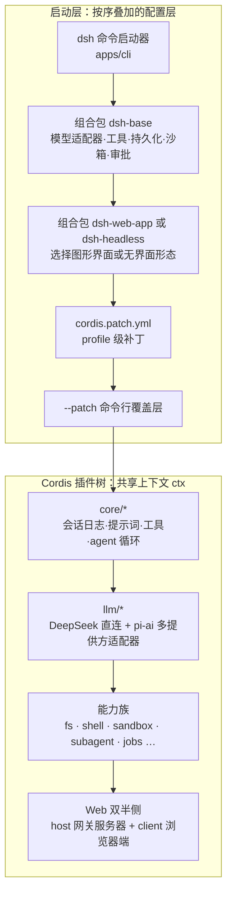

本页面向初次接触 DeepSeek Harness 的读者，回答三个问题：这个项目是什么、它为什么在工程上与众不同、以及初学者为什么要花时间研究它的源码。读完本页，你将建立起理解后续章节所需的全部心智模型——不涉及具体安装步骤或代码细节。

## 它是什么：一个"一切皆插件"的开源智能体框架

DeepSeek Harness（命令行入口叫 `dsh`）是 DeepSeek AI 开发的开源 agent harness（智能体框架）：一个让你在本地运行由大语言模型驱动的编码智能体的完整产品。它与常见的"AI 聊天工具"不同之处在于一个激进的架构决策——**一切皆插件**。产品的每一部分（模型适配器、工具注册表、会话日志、甚至 agent loop 智能体循环本身）都是运行在 [Cordis](https://github.com/cordiverse/cordis) 插件框架之上的插件，因此每一部分都可在不改源码的情况下被替换或扩展。

Sources: [README.zh.md](README.zh.md#L5-L7)

这条决策的直接推论是：**不存在需要打补丁的特权内核**。扩展 dsh 的方式不是修改框架代码，而是把新插件挂载到既有插件旁边；每一项注册都是"副作用"，当所属插件卸载时会自动撤销。对初学者而言，这意味着你读到的任何一堵墙，其实都是一扇门。

Sources: [architecture.zh.md](docs/architecture.zh.md#L9-L13)

需要提前知道的是，项目目前处于**开发者预览**阶段，正在快速迭代，未来会出现破坏兼容性的变更。把它当作学习方法论的高质量样本来看待，比当作稳定的依赖库来使用更合适。

Sources: [README.zh.md](README.zh.md#L9-L11)

## 为什么值得学习：三个理由

第一，它是**可以直接运行的真实产品**，不是玩具 demo。装好 Node.js 后一行命令 `npx @deepseek-ai/dsh web` 就会在 `http://127.0.0.1:3080` 启动完整的 Web 图形界面并自动打开浏览器；阅读源码前先亲手用一次，能极大降低后续理解成本。

Sources: [README.zh.md](README.zh.md#L17-L25)

第二，它能教你一套**可迁移的架构模式**。"agent loop 如何驱动模型-工具循环""如何设计可替换的能力接缝""如何用一个仅追加的事件日志保证上下文可重建"——这些问题在任何 AI 应用中都会遇到，而这个仓库给出了工业级的完整答案。本 wiki 的"深入解析"板块会逐一拆解它们。

第三，它是一座**工程化实践的展览馆**：数十个包按职责分组、组间依赖受工具校验、文档有预算门禁、LLM 测试依靠回放而非真实网络调用。即使你不打算写插件，这里的 monorepo 纪律也值得借鉴——参考页面[构建与发布工程](29-gou-jian-yu-fa-bu-gong-cheng-host-client-shuang-ju-he-typert-lei-xing-fan-she-yu-ge-jie-duan-chan-wu)与[测试体系](28-ce-shi-ti-xi-testkit-llm-hui-fang-mo-ni-kuai-zhao-yu-duan-dao-duan-fu-gai-men-jin)可以深入了解。

Sources: [packages/README.zh.md](packages/README.zh.md#L5-L14)

## 架构一瞥：从一条命令到一棵插件树

运行中的 `dsh` 是一棵**启动时按序叠加配置层组装出来的插件树**。两个关键概念贯穿本仓库：**profile（档案）**是存放在 Harness home 中的具名组装，`web` 和 `headless` 作为模板随发行版交付；**组合包**则是 Cordis 配置项及其挂载代码的分发格式。每个 profile 叠放的组合包顺序记录在其 `dsh.profile.bundles` 中，用户再通过自己的 `cordis.patch.yml` 和 `--patch` 参数做最终覆盖——你打印出来的配置树里任何一行，都可以被你的 patch 替换掉。

Sources: [architecture.zh.md](docs/architecture.zh.md#L15-L27)、[apps/cli/README.zh.md](apps/cli/README.zh.md#L34-L43)

下面的 Mermaid 流程图概括了从命令输入到插件树的组装路径（阅读提示：`flowchart TB` 表示自上而下布局；箭头表示上游"被下游所包含/叠加"；每个 `subgraph` 框是一个分组）：



图中各个方框不是抽象概念，而是仓库里真实存在的包：基础层 `dsh-base` 与两个应用组合包 `dsh-web-app`/`dsh-headless` 在 `packages/bundle/` 下；核心运转部件位于 `packages/core/` 与 `packages/llm/`；两类入口分别是 `apps/cli`（负责解析参数、加载 profile 的精简启动器）和 `apps/web`（浏览器前端）。想在不启动的情况下检视你机器上实际组装出的配置树，可用 `dsh --profile web --dump-config`。

Sources: [architecture.zh.md](docs/architecture.zh.md#L25-L35)、[apps/cli/README.zh.md](apps/cli/README.zh.md#L5-L16)

## 三个事件域：理解扩展点的坐标系

在这个"一切皆插件"的世界里，**事件就是扩展点**——而选对事件域，是大多数改动的第一个决定。仓库把事件分为三个域，初学者只需记住它们的分工：

| 事件域 | 本质 | 典型用途 |
|---|---|---|
| 会话事件 | 追加进日志、重启后依然存在的**持久事实** | 需要在重新加载后幸存的记录 |
| Agent 事件（`agent/*`） | 携带活跃 Agent 的**实时信号** | 观察或拦截正在进行的工作 |
| 能力事件（如 `fs/*`、`tools/*`） | 向某个能力接缝附加策略与适配器 | 不导入主循环即可注入策略 |

Sources: [architecture.zh.md](docs/architecture.zh.md#L55-L63)

这三个域共同支撑着一个可以逐步读懂的核心机制：**轮次流程**。一个**步骤是一次模型请求加上它调用的工具**；一个**轮次**则包含零个或多于零个步骤——它在领取首条输入之前打开，并在不再欠下任何工作时关闭。整条流水线以 `turn/start` 打开，中间经历提示词组装、`llm/stream` 流式响应、经把关事件的工具执行（`tools/pre-execute → tools/execute → tools/post-execute`），最终以 `turn/end` 关闭。

Sources: [architecture.zh.md](docs/architecture.zh.md#L67-L88)

这套流程中最值得玩味的一条规则是："`agent/pre-step` 决定模型看到什么"——监听器可以改写甚至拒绝已领取的消息。换句话说，就连"模型此刻该看见什么"本身也是一个开放的扩展点，而不是写死的常量。

Sources: [architecture.zh.md](docs/architecture.zh.md#L90-L94)

## 一条值得记住的设计不变量

如果只带一句话离开本页，请带走这一句：**模型可见即已记录**。会话日志是模型所见上下文的唯一来源，`deriveMessages()` 从中投影出模型历史；fork 分叉、恢复续跑、文本导出、遥测和持久化全部派生自同一条事件流，且有一项运行时不变量断言抵达模型的每一字节都能从日志重建。这解释了为什么给智能体新增一项模型可见输入时，必须同步新增一种会话事件类型——一致性不是靠自觉维护的，而是靠不变量强制执行的。

Sources: [architecture.zh.md](docs/architecture.zh.md#L96-L100)

## 能力接缝：换一个提供方，改变整个产品

仓库为每类外部能力定义了 **seam（接缝）**，一个 seam 包含三种角色：声明接口的 **Service Definition**、实现接口的一个或多个 **Service Provider**，以及使用能力的 **Consumer**（通常是暴露给模型的工具）。这种三段式拆分的回报极高：把文件系统与进程提供方指向远程沙箱，Bash、PTY 和 LSP 会一并被搬过去，无需任何提供方专用的分支改造。

Sources: [architecture.zh.md](docs/architecture.zh.md#L102-L106)

LLM 接缝是感受这种设计的最佳起点：`ctx.llm` 上既挂着直连 DeepSeek 官方 API 的适配器 `llm-deepseek`，也挂着多提供方的 `llm-pi-ai` 适配器；重试策略与 token 计量则是独立的消费方包，互不纠缠。你日后若想接入自家网关，所做的不过是按同一契约再写一个适配器并在接缝处注册。

Sources: [llm/README.zh.md](packages/llm/README.zh.md#L1-L18)

至于"加一个功能应该动哪里"，官方架构文档末尾给出了一张极简速查表：加模型提供方 → 注册 `ctx.llm` 适配器；加面向模型的能力 → 注册 `ctx.tools` 工具；限制进程 → 用 `ctx.sandbox` 后端包装 argv……这张表本身就是"一切皆插件"哲学的最佳注脚——每个常见需求都恰好对应一个既有扩展点。

Sources: [architecture.zh.md](docs/architecture.zh.md#L114-L135)

## 仓库地图：这个 monorepo 里有什么

仓库采用 pnpm workspace 组织，要求 Node.js `^22.19.0 || >=24.0.0`。顶层结构如下（节选自真实目录树）：

```text
deepseek-harness/
├── apps/
│   ├── cli/          # dsh 启动器：解析参数、加载 profile
│   └── web/          # Web 应用（浏览器前端）
├── packages/
│   └── <group>/<pkg>/   # 数十个功能组，每组聚合同族包
├── examples/         # acp-agent、headless-agent 等演示组合包
├── python/           # Python SDK 及其内置运行时分发
├── native/landlock-run/  # Linux Landlock 原生限制启动器
├── docs/             # 架构文档、子系统参考、实操手册
└── website/          # VitePress 文档站点
```

Sources: [package.json](package.json#L7-L10)

包的命名规则很克制：目录按 `packages/<组>/<包>/` 两级组织，但 npm 包名始终是扁平的 `@deepseek-ai/dsh-<包名>`；每组有一份 README 专门负责"包 ↔ ctx 服务键"的映射，例如 `core/` 是产品 API 主干（会话、提示词、工具、agent 循环），`sandbox/` 收纳进程限制后端（bwrap/Landlock/Seatbelt），`client/` 承载 Web GUI 的浏览器半侧与全部 `ui-*` 插件。这份分组表是你日后检索代码时最重要的索引，建议结合页面[核心包地图](10-he-xin-bao-di-tu-bao-fen-zu-zhi-ze-yu-ctx-fu-wu-jian-dao-lan)一并精读。

Sources: [packages/README.zh.md](packages/README.zh.md#L7-L20)

## 建议的阅读路线

下一步请直接动手：打开终端执行 `npx @deepseek-ai/dsh web`，在浏览器里完成一次真实的智能体对话，建立感性认识。随后按下述顺序推进学习曲线最平缓——先解决"怎么跑起来"，再解决"怎么改"，最后深入"为什么这样设计"：

1. [快速开始：通过 npm 一行命令或源码编译运行 dsh](2-kuai-su-kai-shi-tong-guo-npm-xing-ming-ling-huo-yuan-ma-bian-yi-yun-xing-dsh) —— 把产品跑在你自己的机器上；
2. [开发环境搭建：Node/pnpm 前置条件、安装钩子与首次类型检查](3-kai-fa-huan-jing-da-jian-node-pnpm-qian-zhi-tiao-jian-an-zhuang-gou-zi-yu-shou-ci-lei-xing-jian-cha) —— 准备好参与开发的环境；
3. [CLI 入门：dsh 命令入口、web/headless Profile 与补丁覆盖](4-cli-ru-men-dsh-ming-ling-ru-kou-web-headless-profile-yu-bu-ding-fu-gai) —— 吃透上面那张组装图对应的操作层；
4. 进入"深入解析"：从 [Cordis 五大核心概念](5-cordis-wu-da-he-xin-gai-nian-chá-jian-shang-xia-wen-fu-wu-inject-yi-lai-sheng-ming-lei-xing-hua-shi-jian-yu-ke-ni-fu-zuo-yong)开始，再到[架构总览：一切皆插件的插件树世界](8-jia-gou-zong-lan-qie-jie-cha-jian-de-cha-jian-shu-shi-jie) —— 本页埋下的每一个概念都会在那里展开成完整章节。

带着本页建立的坐标——一棵按序叠加的插件树、三个事件域、一条仅追加的会话日志、若干可替换的能力接缝——去读接下来的内容，你会发现这份代码库远比它庞大的人数比例显得秩序井然。