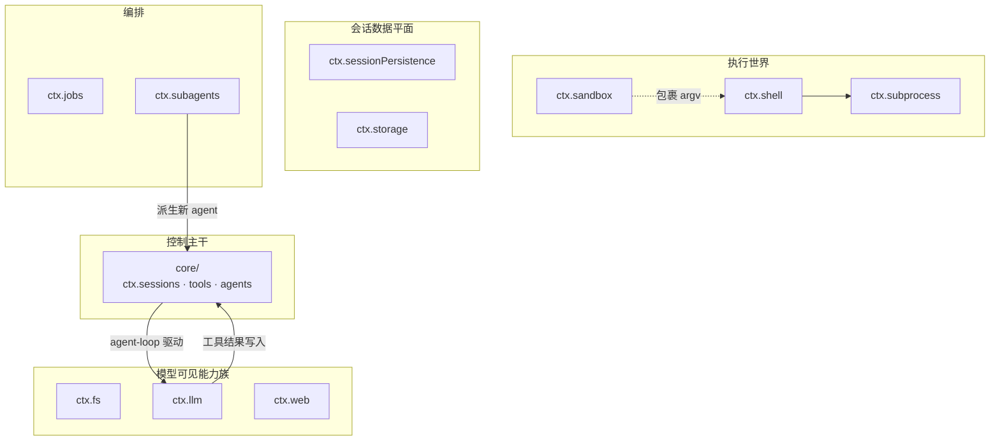
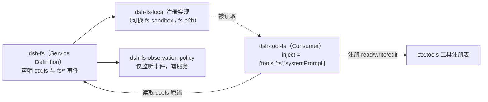

读完[架构总览：一切皆插件的插件树世界](8-jia-gou-zong-lan-qie-jie-cha-jian-shu-shi-jie)与 [Cordis 五大核心概念](5-cordis-wu-da-he-xin-gai-nian-cha-jian-shang-xia-wen-fu-wu-inject-yi-lai-sheng-ming-lei-xing-hua-shi-jian-yu-ke-ni-fu-zuo-yong)之后，你已经知道"插件树＋ctx 服务"这套语法。本页给出的是**词汇表层面的地图**：`packages/` 目录如何按组分治、每组承担什么职责，以及各能力族在 `ctx` 上暴露了哪些**服务键**。掌握这张地图后，你能在阅读任何子系统文档或组合包配置时，立刻定位"这个键由哪个包定义、由哪些包注册实现"。

## 分层原则：`packages/<group>/<pkg>/`

仓库对包组织只有一条刚性约定：包按组放在 `packages/<group>/<pkg>/` 两级目录中，npm 包名仍保持扁平的 `@deepseek-ai/dsh-<pkg>` 形式，**组的职责边界由该组的 README 维护**——每份组 README 都内含一张"包 ↔ ctx 键"映射表，这是本页所有信息的权威出处，而非任何代码扫描器。新包必须加入现有组，新组则需同步更新自己的 README 与根表。

Sources: [README.zh.md](packages/README.zh.md#L4-L9)，[README.zh.md](packages/README.zh.md#L62)

`core/session` 的源码可以印证"服务键即类型"这件事是如何落地的：`dsh-session` 通过 TypeScript **module augmentation** 向 Cordis 的 `Context` 接口追加了 `sessions: SessionStore` 成员，于是全仓库中 `ctx.sessions` 都获得类型检查支持；同一文件继续为 `Events` 接口声明 `session/*` 事件词汇。也就是说，**每个 ctx 服务键都有一个明确的"属主包"，声明位置就在该包源码顶部**，而各组 README 只是这份声明的可检索索引。

```ts
// packages/core/session/src/index.ts —— 服务键的类型声明
declare module '@deepseek-ai/cordis' {
  interface Context {
    sessions: SessionStore
  }
}
```

Sources: [index.ts](packages/core/session/src/index.ts#L37-L43)

## 功能域视角的组分布

根表罗列了约 47 个组，直接照抄对你建立心智模型帮助有限；下面这张表把它们归并为八个功能域，作为导读框架。注意两点前提：其一，这是**目录分组视图而非依赖图**——真实的包间依赖关系由脚本生成在 [docs/module-graph.zh.md](docs/module-graph.zh.md) 并有 CI 新鲜度门禁；其二，"发布预期"区分了产品包（稳定 API）、POC 与不发布的私有原型。

| 功能域 | 所属组 | 一句话职责 |
|---|---|---|
| 控制主干 | `core/`, `api/`, `typert/` | 会话日志、系统提示词、工具注册表、Agent 词汇与具体循环；RPC 网关与类型反射 |
| 执行世界 | `subprocess/`, `shell/`, `terminal/`, `code-runtime/`, `sandbox/`, `e2b/` | 受管子进程、Bash/Pwsh 执行器、持久 PTY、代码运行时、进程沙箱、E2B 远程运行时 |
| 模型可见能力族 | `fs/`, `lsp/`, `skill/`, `web/`, `llm/` | 文件系统、语言服务器、技能发现、Web 搜索/抓取、LLM 抽象与提供方适配器 |
| 会话数据平面 | `session/`, `session-query/`, `storage/`, `workspace/`, `settings/`, `credentials/`, `identity/`, `feedback/`, `attachment/` | JSONL/SQLite 持久化、投影、检索；非会话存储、设置、凭据、身份与附件 |
| 人机协作平面 | `interaction/`, `plan/`, `preset/`, `guard/`, `todo/` | 审批、命令、问答；Plan 模式；按会话组装 preset；循环卫生守卫 |
| 编排 | `jobs/`, `subagent/`, `workflow/`, `goal/`, `schedule/`, `experimental/` | 后台任务、子 agent 委托、工作流引擎、目标追踪、会话内提醒 |
| 上下文工程 | `compaction/`, `spill/`, `context/` | 压缩家族、工具结果溢出、请求上下文片段注入 |
| 界面与交付 | `host/`, `client/`, `bundle/`, `extensions/`, `hooks/`, `sdk/`, `acp/`, `boot/` | Web 双半侧、Profile 补丁层、自修改扩展、钩子桥、进程外 SDK 与 ACP |



读法提示：实线是主干上的调用流，虚线只是策略影响；图中仅列举代表性键，完整索引见下节。

Sources: [README.zh.md](packages/README.zh.md#L11-L60)，[README.zh.md](packages/README.zh.md#L64-L66)

## 关键模式：Service Definition / Provider / Consumer 三件套

几乎每个模型可见能力族都遵循同一个三角色接线法。以 `fs/` 家族为例——它也是理解全仓库接缝设计的最小标本：



三块角色各自的证据链如下。首先，`dsh-tool-fs` 是典型的**函数插件 Consumer**：具名导出 `name`、`inject`、`Config`、`apply` 四件套且无默认导出——混合两种导出形式会让 Loader 丢弃函数插件的命名空间（这正是仓库唯一一份 ACP 相关 postmortem 记录的事故）。

Sources: [index.ts](packages/fs/tool-fs/src/index.ts#L18-L24)，[AGENTS.md](packages/AGENTS.md#L4-L5)

其次，**Service Definition 层**（`dsh-fs`）拥有 `ctx.fs` 键本身和十二个存储原语的接口约定，以及 `fs/write-read` 等政策事件的词汇所有权；发出方与监听方共享词汇，却互不依赖。Sources: [README.zh.md](packages/fs/fs/README.zh.md#L10-L15)

最后，**Provider 层**以默认导出的 Service 子类形式存在：`fs-local` 的整个文件以 `export default LocalFileSystem` 收尾，类继承自 `dsh-fs` 导出的 `FileSystem` 基类并附带 `static Config`。按照仓库规则，"service 包默认导出其服务类"，而 Cordis 文档明确指出**以插件形式加载的 Service 子类会将自身注册为 `ctx.<name>`**——这就是"(注册 `ctx.fs`)"这一列的含义，也是组 README 表格第三列的所有暗语：凡是写成"`ctx.xxx`"的是定义者，写成"（注册 `ctx.xxx`）"的是提供方实现，写成"（注册到 `ctx.tools`）"的是面向模型的工具消费者，写成"无 / 监听……"的则是纯事件消费者。

Sources: [index.ts](packages/fs/fs-local/src/index.ts#L255-L266)，[AGENTS.md](packages/AGENTS.md#L4-L5)，[service.zh.md](docs/cordis-api/service.zh.md#L10-L16)

读取侧还有一条容易踩坑的细则：已在 `inject` 数组里声明的键可以安全使用属性代理 `ctx.fs`，但**可选服务必须用 `ctx.get(name)`**——属性代理对拓扑敏感，而严格的 `ctx.get` 读取全局服务存储，不会因为服务尚未在该子树上挂载而拿到意料之外的实例。`tool-fs` 里条件化的 `read_image` 正是通过 `ctx.inject(['attachments'], …)` 处理这种可选性的。

Sources: [AGENTS.md](packages/AGENTS.md#L6)，[index.ts](packages/fs/tool-fs/src/index.ts#L56-L58)

## ctx 服务键总导览

以下七张表按功能域汇总全部主要服务键。每张表的行都直接摘自对应组 README 的映射表，格式沿用其语义：**斜体角色** = 定义者，其余为注册者/消费者。

### 控制主干（core/）

| 包 | ctx 键 | 角色 |
|---|---|---|
| `scope/` | 库，不用键 | 作用域上下文注册原语 |
| `session/` | `ctx.sessions` | 事件溯源会话日志 |
| `system-prompt/` | `ctx.systemPrompt` | 提示词与 schema 组装注册表 |
| `tools/` | `ctx.tools` | 作用域工具注册表与执行流水线 |
| `agent/` | `ctx.agents` | Agent 接口、注册表与事件词汇 |
| `agent-default-model/` | `ctx.agentDefaultModel` | 部署级默认模型选择 |
| `agent-loop/` | `ctx.agentLoop` | 默认具体驱动器（可替换） |

Sources: [README.zh.md](packages/core/README.zh.md#L9-L15)

### 模型可见能力族

| 家族 | 定义者键 | 注册进来的提供方 |
|---|---|---|
| fs | `ctx.fs` | `fs-local`、`fs-sandbox`、`fs-e2b` |
| llm | `ctx.llm`、`ctx.tokenMeter` | `llm-deepseek`、`llm-pi-ai` |
| web | `ctx.web` | exa / perplexity / deepseek 搜索与 http 抓取共四种 |
| lsp | `ctx.lsp` | `lsp-stdio` |
| skill | `ctx.skills` | `skill-badge`、`skill-filesystem` |
| mcp | （无独立键） | `mcp-client` 将外部服务器工具直接注册到 `ctx.tools` |

值得留意 `llm-retry` 的反例：它不在任何服务上注册，而是**监听 `agent/request-error` 事件**提供重试策略——同样地，`guard/` 家族的重复调用提醒与超时策略也纯粹以事件监听器形态存在。这说明"不是一切皆服务"：仓库里 Consumer 有三种形态——注册实现到接缝键、向 `ctx.tools` 贡献工具、或只订阅类型化事件。

Sources: [README.zh.md](packages/fs/README.zh.md#L9-L15)，[README.zh.md](packages/llm/README.zh.md#L9-L13)，[README.zh.md](packages/web/README.zh.md#L9-L14)，[README.zh.md](packages/lsp/README.zh.md#L9-L11)，[README.zh.md](packages/skill/README.zh.md#L9-L12)，[README.zh.md](packages/mcp/README.zh.md#L9)，[README.zh.md](packages/guard/README.zh.md#L9-L11)

### 执行世界

| 键 | 定义者 | 本地实现 |
|---|---|---|
| `ctx.subprocess` | `subprocess/` | `subprocess-local`（detached 进程树、node-pty） |
| `ctx.shell` / `ctx.shellEnv` | `shell/` | `bash-local`、`bash-sandbox`、`pwsh-local` |
| `ctx.terminals` | `terminal/` | `terminal-bash`（建在 spawnTerminal 之上） |
| `ctx.codeRuntime` | `code-runtime/` | worker 线程后端 |
| `ctx.sandbox` / `ctx.sandboxPolicy` | `sandbox/` | `sandbox-local` 平台限制后端 |

Sources: [README.zh.md](packages/subprocess/README.zh.md#L9-L10)，[README.zh.md](packages/shell/README.zh.md#L9-L17)，[README.zh.md](packages/terminal/README.zh.md#L9-L11)，[README.zh.md](packages/code-runtime/README.zh.md#L9-L10)，[README.zh.md](packages/sandbox/README.zh.md#L9-L11)

### 会话数据平面与非会话状态

| 键 | 定义者 | 备注 |
|---|---|---|
| `ctx.sessionPersistence` | `session-persistence/` | JSONL 与 SQLite 两后端可选 |
| `ctx.sessionProjections` / `ctx.sessionProjectionCache` | `session-projection*` | 日志派生全量值及其检查点缓存 |
| `ctx.sessionTitle` | `session-title/` | 未注册模型提供方时保留确定性回退 |
| `ctx.storage` / `ctx.storageDomain` | `storage/` | 具名后端 `json`/`sqlite`，消费方只用数据形式 |
| `ctx.settings` | `settings/` | `settings-file` 提供文件后端 |
| `ctx.credentials` / `ctx.authorization` | `credentials/`、`authorization/` | 引用解析与"开口要"流程仅在记录处相交 |
| `ctx.workspaceRegistry` | `workspace/` | 单包单键的极简家族 |

Sources: [README.zh.md](packages/session/README.zh.md#L11-L39)，[README.zh.md](packages/storage/README.zh.md#L9-L12)，[README.zh.md](packages/settings/README.zh.md#L9-L10)，[README.zh.md](packages/credentials/README.zh.md#L9-L11)，[README.zh.md](packages/workspace/README.zh.md#L9)

### 人机协作平面

| 键 | 定义者 |
|---|---|
| `ctx.commands` | `commands/`（用户命令分派；`command-compact` 也注册于此） |
| `ctx.approval` | `user-approval/`（一次性审批决策） |
| `ctx.permissionPresets` | `permission-presets/` |
| `ctx.userQuestions` | `user-questions/`；`tool-ask-user` 把它翻转成模型工具 |
| `ctx.planMode` | `plan-mode/` |
| `ctx.agentPresets` | `agent-presets/`（受防护的按 agent 挂载） |

Sources: [README.zh.md](packages/interaction/README.zh.md#L9-L13)，[README.zh.md](packages/plan/README.zh.md#L9)，[README.zh.md](packages/preset/README.zh.md#L9)，[README.zh.md](packages/compaction/README.zh.md#L9-L12)

### 编排与上下文工程

| 键 | 定义者 | 消费形态 |
|---|---|---|
| `ctx.jobs` | `jobs/` | `jobs-local` 提供进程内注册表 |
| `ctx.subagents` | `subagent/` | 七个具名提供方（spawn/fork/ACP/Codex/Claude Code/DSH SDK）共存注册 |
| `ctx.workflowEngine` | `workflow/` | worker 线程引擎隔离宿主事件循环 |
| `ctx.goals` | `goal/` | 目标状态属于会话日志；三个配套包均无键 |
| `ctx.compaction` / `ctx.toolResultPruner` | `compaction/` | basic 摘要后端 + 可选无模型修剪器 |
| `ctx.spillStore` | `spill/` | `spill-policy` 以监听者身份应用执行后策略 |
| `ctx.sessionReferenceResolver` / `ctx.fileReferences` | `context/` | 有界跨会话快照与 `@file` 引用发现 |

Sources: [README.zh.md](packages/jobs/README.zh.md#L9-L11)，[README.zh.md](packages/subagent/README.zh.md#L9-L18)，[README.zh.md](packages/workflow/README.zh.md#L9-L12)，[README.zh.md](packages/goal/README.zh.md#L9-L12)，[README.zh.md](packages/spill/README.zh.md#L9-L11)，[README.zh.md](packages/context/README.zh.md#L9-L10)

唯一需要单独点名的是 `schedule/`：它是全仓库少数**刻意不设服务键**的产品家族——工具与运行时只向 Session 流追加版本化事件，到期工作经由普通 follow-up 队列回流入对话，因此不存在可被外部查询的可变数据库。

Sources: [README.zh.md](packages/schedule/README.zh.md#L7-L9)

## 组合即选型：把键接起来的最后一层

地图之上还有一个自由度：**这些提供方实现由叶节点 `cordis.yml` 在组合时挑选**。shell 家族说得很直白——叶节点配置选择一个执行器实现（本地 Bash？沙箱化 Bash？PowerShell？）与所需工具；沙箱化组合再额外挑一个 `ctx.sandbox` 提供方。配合上一条依赖纪律："**扩展插件依赖 Service Definition，绝不依赖具体提供方**；`dsh-agent-loop` 可替换"，就得到整张图的因果闭环：键（Definition）稳定、实现可换、组合定版。

Sources: [README.zh.md](packages/shell/README.zh.md#L17)，[README.zh.md](packages/README.zh.md#L64-L68)

如果想看一条现成的完整接线，ACP 示例展示了从执行器到沙箱的全套选择；多个 Profile 如何叠加这些补丁层的机制则在上一页 [Profile、组合包与多层 Patch 的按序叠加机制](9-profile-zu-he-bao-yu-duo-ceng-patch-de-an-xu-die-jia-ji-zhi)。到这里，你应该已经能把任何一个 `ctx.*` 键反向定位到"定义包 → 可选实现 → 消费方"三点一线。

## 建议的下一步

沿两条路径继续深入都很自然：若关注**键如何被消费**，进入[工具注册表、waterfall 把关事件与执行流水线](14-gong-ju-zhu-ce-biao-waterfall-ba-guan-shi-jian-yu-zhi-xing-liu-shui-xian)与[能力接缝设计模式：fs、LSP、Web、Skill 与 MCP 模型可见能力族](13-neng-li-jie-feng-she-ji-mo-shi-fs-lsp-web-skill-yu-mcp-mo-xing-ke-jian-neng-li-zu)；若关注**主干循环本身**，则接着阅读[轮次流程剖析：turn/step 事件流与 Agent 生命周期扩展点](11-lun-ci-liu-cheng-pou-xi-turn-step-shi-jian-liu-yu-agent-sheng-ming-zhou-qi-kuo-zhan-dian)，并用[示例组合包导览](27-shi-li-zu-he-bao-dao-lan-acp-agent-headless-agent-jsonrpc-agent-yu-mcp-memory)对照本页表格验证真实组合中的选型。