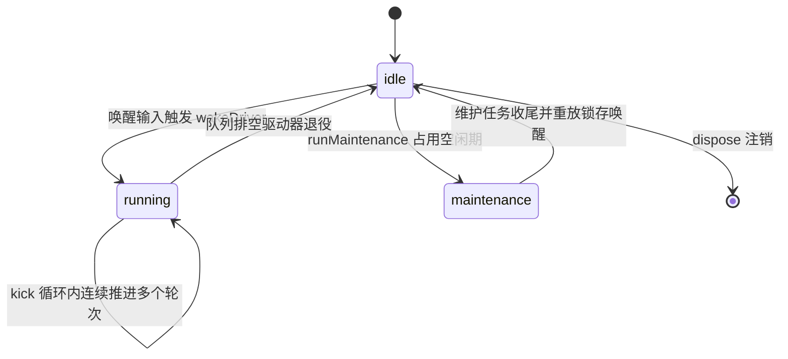
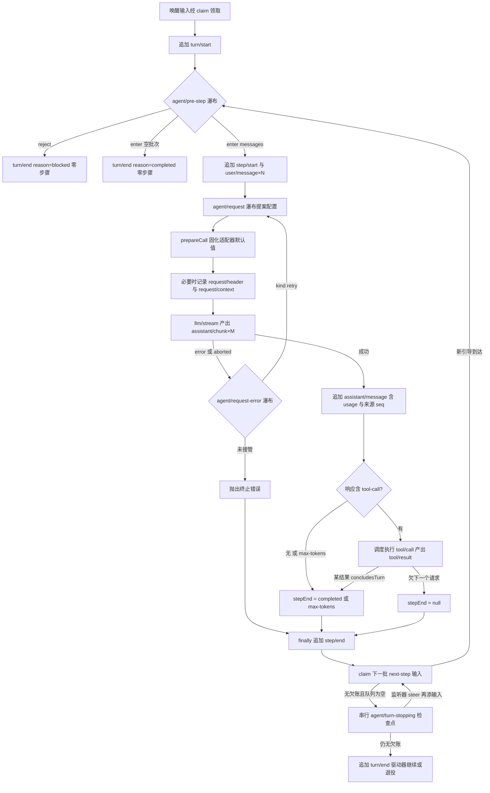

一个对话型 Agent 产品的全部行为，最终都收敛为同一个问题：一次用户输入如何变成一串模型调用、工具执行和持久日志。本文剖析 DeepSeek Harness 中承担这一转换的核心机器 —— `@deepseek-ai/dsh-agent-loop` 的 `ReactLoopAgent` 驱动器，以及围绕它的两层事件词汇：可回放的持久会话事件（`turn/*`、`step/*`）与实时的生命周期扩展点（`agent/*`）。上承[核心包地图：包分组职责与 ctx 服务键导览](10-he-xin-bao-di-tu-bao-fen-zu-zhi-ze-yu-ctx-fu-wu-jian-dao-lan)，下启[会话日志模型：“模型可见即已记录”的不变量与消息投影](12-hui-hua-ri-zhi-mo-xing-mo-xing-ke-jian-ji-yi-ji-lu-de-bu-bian-liang-yu-xiao-xi-tou-ying)，本文给出这两页之间缺失的那台"引擎拆解图"。

Sources: [architecture.zh.md](docs/architecture.zh.md#L65-L94)

## 双域词汇表：可回放事实与实时协调

Harness 把 Agent 的全部词汇严格切成两个域。第一个域是**持久会话事件**：`turn/start`、`step/start`、`user/message`、`assistant/chunk`、`assistant/message`、`tool/call`、`tool/result`、`step/end`、`turn/end` 等，它们定义在 `SessionEventMap` 上，逐条追加进会话日志，序号连续、无损 JSON，是 fork、恢复、回放与遥测的唯一事实来源。第二个域是**实时扩展点**：`agent/pre-step`、`agent/request`、`agent/request-error`、`agent/turn-stopping` 以及一系列 `agent/*` 通知，它们只存在于运行中的进程里，用于队列协调、提示词拦截、请求构造与错误恢复。官方架构文档将这套划分总结为一句话——回放事实进 `session/event`，实时控制走 `agent/*`。

Sources: [types.ts](packages/core/session/src/types.ts#L237-L301) ；[known-event-types.ts](packages/core/session/src/known-event-types.ts#L24-L68)

| 维度 | 持久会话事件（`turn/*` `step/*` …） | 实时扩展点（`agent/*`） |
|---|---|---|
| 载体 | `Session.append()` 写入追加式日志 | Cordis 事件总线上的监听器回调 |
| 序列号 | 连续递增、逐条持久化 | 无序列概念，仅进程内时刻 |
| 回放能力 | 可完整重建历史与模型可见上下文 | 不可回放，驱动结束后即消失 |
| 权威性 | 记录既成事实，不可被监听器改写 | 多数拥有裁决权（reject / 替换 / retry） |
| 典型消费者 | 投影缓存、UI、持久化后端、导出工具 | 压缩、权限钩子、重试策略、目标续跑 |

这条分界线对集成者有直接的工程含义：需要可回放 transcript 的消费者（SDK 客户端、UI 渲染、审计导出）应当订阅 `session/event`；而想改变行为而非观察行为的插件，才应该挂在 `agent/*` 扩展点上。两份入口文档（仓库根的 `docs/architecture.zh.md` 与生成的 `docs/agent-lifecycle.zh.md` 时序图）都明确地把这个选择写成面向用户的契约。

Sources: [agent-lifecycle.zh.md](docs/agent-lifecycle.zh.md#L74-L85)

## 驱动器状态机：Phase 三相与 agent/status

阅读 Loop 源码的第一把钥匙是一个仅三行的联合类型：驱动器的全部状态要么是 `idle`（附带上一轮次号），要么是 `running`（附带该次活动的 `AbortController`、当前 turn/step 和一个 `wakeRequested` 锁存位），要么是 `maintenance`（同样的 AbortController 加锁存位的空闲期变体）。对外可见的 `status` 只是 `phase.kind === 'running'` 的投影——`idle` ⇄ `running` 两态枚举，而销毁不是第三个可观察状态，它只是把 agent 从注册表摘除。`setPhase()` 在唯一的位置做提交，并且只在状态真的翻转时才发射 `agent/status` 事件，这让下游可以把 `agent/status` 当作无损的状态迁移流来消费。

Sources: [agent.ts](packages/core/agent-loop/src/agent.ts#L38-L111) ；[runtime-types.ts](packages/core/agent/src/runtime-types.ts#L43-L61)

理解这张状态机之前，只需一个前提：每个 `running` 相位自持一个 `AbortController`，取消（cancel）就是给当前活动信号打原因标记，而"活动收敛"指驱动器把这个标记传播完并退出循环的瞬间。

输入侧只有四个动词，却覆盖了全部交互形态：`followup()` 追加到 `next-turn` 并唤醒；`steer()` 追加到 `next-step` 并唤醒——空闲驱动器会立刻开轮，运行中的驱动器则在最近的步骤边界取用；`inject()` 同样落在 `next-step` 但不唤醒，只作为下一次获得批准的请求中的补充上下文；底层 `send()` 还处理一个竞态规则——当唤醒发生在取消之后、收敛之前，这条输入会被重新归类到 `next-turn`，成为中断后下一轮的首条消息。`cancel()` 默认清空双队列并以第一个到达的原因中止活动；传入 `keepInbox` 则保住未开始的工作，让它存活到之后的轮次。

Sources: [runtime-types.ts](packages/core/agent/src/runtime-types.ts#L106-L144) ；[agent.ts](packages/core/agent-loop/src/agent-loop/src/agent.ts#L113-L140)

唤醒路径上藏着一个精心设计的闩锁机制：空闲时收到唤醒，`wakeDriver()` 直接开一个新驱动器；非空闲时则检查原因——`disposed` 类取消永不锁存（关停不应等一个新的模型轮次），而维护任务期间或中止收敛窗口内的唤醒会被记入 `wakeRequested`，待驱动器在自己的收敛边界退役时由 `kick()` 的 `finally` 重放。这保证了"发出即送达"的直觉在任何竞态窗口内都不破例，即便消息随后被清除，也会留下一个完整的 `idle → running → idle` 状态对作为这次尝试的可见痕迹。

Sources: [agent.ts](packages/core/agent-loop/src/agent.ts#L164-L223) ；[README.zh.md](packages/core/agent-loop/README.zh.md#L70)

支撑这一切的存储底座是 `Inbox`——一个可从持久日志增量重建的双列表投影。构造函数从 `seedLength` 之后重放全部 `agent/inbox/spliced` 事件；所有变更先写持久拼接事件、再改动内存投影，因此同步观察者能在 `session/event` 里看到拼接前的列表。关键操作 `claim(target, turn)` 是驱动器的步骤边界专用原语：它取走整个 `next-step` 列表，加上 `next-turn` 队头的一条排队消息，把这些纯删除拼接固化后逐条发布 `agent/inbox/claimed`。注意这一操作被显式标注为内部方法而非插件扩展点——插件想要影响认领结果，正确路径是下一步要讲的 `agent/pre-step`。

Sources: [inbox.ts](packages/core/agent/src/inbox.ts#L63-L80) ；[inbox.ts](packages/core/agent/src/inbox.ts#L128-L147) ；[types.ts](packages/core/agent/src/types.ts#L13-L27)

## 一次轮次的解剖：turn() 主干

下面的主干图汇总了 `turn()` 与 `step()` 的全部控制流。阅读它只需要两个前置概念：来自[Cordis 五大核心概念](5-cordis-wu-da-he-xin-gai-nian-cha-jian-shang-xia-wen-fu-wu-inject-yi-lai-sheng-ming-lei-xing-hua-shi-jian-yu-ke-ni-fu-zuo-yong)的 waterfall（环绕中间件，监听器持有 `next()` 委托权）与 serial（顺序等待）两种分发模式（详见[事件分发四模式与 Waterfall 环绕中间件语义](6-shi-jian-fen-fa-si-mo-shi-yu-waterfall-huan-rao-zhong-jian-jian-yu-yi)）；以及"虚框节点写日志、菱形节点是监听器裁决"这一绘图约定。

`turn()` 开门见山：先把 `{ turn }` 追加为持久日志事件，再把相位里的轮次号推进——轮次号的起点来自构造函数中对既有日志的 `findLast('turn/start')` 扫描，这正是断点续跑时编号无缝衔接的原因。也就是说，`turn/start` 落笔的时间点早于任何认领、组装与裁决：一个"尝试过但没有产生步骤"的轮次同样会在日志里留下完整括号。

Sources: [agent.ts](packages/core/agent-loop/src/agent.ts#L246-L259) ；[agent.ts](packages/core/agent-loop/src/agent.ts#L87-L97)

每个提议步骤都经过统一的 `preStep()` 流程：先用 `inbox.claim()` 领走独占批次，再调用 `ctx.systemPrompt.assemble()` 冻结本轮的片段组装快照（携带 agent 主体与轮次信号），并用 `RuntimeContextProjection` 将拼好的运行时上下文段落折算成可能附加的输入消息；随后才是 `agent/pre-step` 瀑布。瀑布的默认裁决把这些合成成 `enter` 决策，任何监听器都可以改写 `messages` 数组或返回 `reject`。签名细节值得注意：payload 同时携带领走的消息、拟用的 `turn`/`step` 编号与本轮取消信号，且事件经由 `Scoped<Agent>` 载体分发——只在对应 agent 作用域上注册的监听器才会收到它。

Sources: [agent.ts](packages/core/agent-loop/src/agent.ts#L225-L243)

两种"空转关闭"分支对称地处理了废轮次。`reject` 让当前轮以 `blocked` 结束且零步骤——被领走的消息既不会被丢弃也不会重放为 `user/message`，它随被拒批次一起留在已删除状态；首次进入就被改写为空批的情形则以 `completed` 关闭，同样零步骤。这两个分支共同保证了一条审计不变量：**凡是被打开过的轮次都有持久的开闭括号**，无论它是否消耗了一次模型调用。

Sources: [agent.ts](packages/core/agent-loop/src/agent.ts#L260-L278) ；[types.ts](packages/core/session/src/types.ts#L237-L256)

主循环体的胶水逻辑里有三个容易忽略的精确性约束。其一，`max-tokens` 是粘性的：一旦某个步骤触顶，后续正常完成的步骤不允许把轮次结局降级回 `completed`。其二，`step/end` 放在 `finally` 里追加，无论步骤如何出错，配对永不缺失。其三，`agent/turn-stopping` 只有一个严格的触发条件——步骤自然停结且 `next-step` 为空；它被 await 于轮次闭合提交之前，监听器若不满意可以调用 `agent.steer()` 注入新输入，机器重新读取队列后自然再走一步，结果由数据决定而与监听器顺序无关。当队列确实清空，`turn()` 以 `turn/end` 收官；若仍有待办工作，同一驱动器换上全新的 `AbortController` 继续下一轮，避免一次取消殃及后来者。

Sources: [agent.ts](packages/core/agent-loop/src/agent.ts#L279-L330) ；[runtime-types.ts](packages/core/agent/src/runtime-types.ts#L261-L278)

出口处的错误映射同样是结构化的。所有异常都会先经过 `throwError()` 在其实时边界上发射一次 `agent/error` 通知，再向上抛出并被驱动器围栏容纳；`turn()` 的 catch 把信号中止翻译成 `aborted{reason}`（cause 为 `user`/`parent`/`hook`/`disposed` 之一），把其余一切折叠成结构化失败——`LlmError` 保留原始事实，其他错误压平为 `UNKNOWN` 码加错误链文本——写入 `turn/end`。合并可扩展的 `TurnEndReasonMap` 甚至为持久化层预留了一个循环自身从不产生的变体：崩溃孤儿轮次在后端加载时被标记为 `interrupted`，而此前已落盘的事件原封不动。

Sources: [agent.ts](packages/core/agent-loop/src/agent.ts#L202-L208) ；[agent.ts](packages/core/agent-loop/src/agent.ts#L302-L323) ；[types.ts](packages/core/session/src/types.ts#L142-L178)

| 结局 kind | 语义 | 产生位置 |
|---|---|---|
| `completed` | 不再欠下任何工作；含零步骤轮次与工具 `concludesTurn` 提前收束 | `turn()` 主循环 |
| `max-tokens` | 至少一步触到输出上限（粘性，不被后续步骤覆盖） | `step()` 返回值 |
| `aborted` | 本轮信号被取消，携带结构化 cause | `turn()` catch 分支 |
| `blocked` | `pre-step` 裁决拒绝，零步骤关闭 | `preStep` 调用处 |
| `error` | 结构化模型/循环失败（`LlmFailure`） | `turn()` catch 兜底 |
| `interrupted` | 持久化后端标记崩溃孤儿轮次；循环永不发射 | 后端加载路径 |

## 一个步骤的解剖：step() 与请求组装

`step()` 的第一行代码就宣示了本项目最重要的设计公理：模型请求是从 `session.deriveMessages()` 推导出来的，即**模型可见的一切都必须能从日志重建**。这使得 `turn/step` 边界之外的任何一个会话事件都有了双重身份——既是即时投递的通知，也是未来任意时刻重放请求的证据。同样的时间纪律也适用于晚到的注入：若某条 `inject()` 在 `agent/request` 瀑布执行期间才抵达，它不会挤进本步已冻结的批次，而是加入下一个 `step/start` 边界，测试套件专门为此立了回归用例。

Sources: [agent.ts](packages/core/agent-loop/src/agent-loop/src/agent.ts#L332-L343) ；[architecture.zh.md](docs/architecture.zh.md#L96-L101) ；[request-reconstruction.spec.ts](packages/core/agent-loop/tests/request-reconstruction.spec.ts#L457-L463)

请求配置的合成是一条两段流水线。起点是一个深度冻结的提案种子：Loop 实例的第一次请求使用声明的路由（provider/model/maxTokens），之后的步骤则复用最近一次记录的 `request/header`，但剥掉带适配器所有权标记的字段，让当前确切路由重新填入自己的默认值。第一段的末梢是 `agent/request` 瀑布——每个监听器都可以整支替换这份冻结配置，这也是无模型 agent 存在的方式：`provider/model` 可以完全由监听器在分发前补齐，ACP 组合正是利用这一点让目标可选地交给上游监听器提供；若最终仍缺字段，Loop 会在抛出的错误信息里直接指出两条修复路径。第二段是 `prepareCall()`：校验适配器负责的字段、物化推理强度与输出上限等默认值，并把准备好的调用与那次确切的适配器注册绑定，防止 HMR 期间把一家适配器的能力解析混进另一家的请求。

Sources: [agent.ts](packages/core/agent-loop/src/agent.ts#L426-L476) ；[README.zh.md](packages/acp/acp/README.zh.md#L18) ；[contract-regressions.spec.ts](packages/core/agent-loop/tests/contract-regressions.spec.ts#L452-L461)

第二段之后的记账动作常被忽视却至关重要：以规范相等比较决定是否追加 `request/header`（原因分别为首个头 `initial`、Loop 实例复播头 `resume`、内容变更 `change`），仅在路由或容量真正变化时追加 `request/context`；最后整个请求对象连同消息引用一起再次冻结，附上 `sessionId` 与轮次信号后交给分发层。这意味着日志中任意两次请求之间的配置差异永远是"故意的"，因为偶然相同的头部根本不会写入事件。

Sources: [agent.ts](packages/core/agent-loop/src/agent.ts#L477-L513)

流式消费环节维护着一份 `chunkSeqs` 数组：每条 `assistant/chunk` 落盘的同时记录其序号。成败在此分岔——若迭代中途信号中止，已送达的前缀只要非空就会被结算为带 `interrupted: true` 标记的 `assistant/message`（用量一并保留），未分发的工具调用缺席，然后异常照旧上抛；若装配器报告 `error` 或 `aborted` 终态，失败事实连同捕获的重试策略一起进入 `agent/request-error` 瀑布：监听器返回 `{ kind: 'retry' }` 即表示自己接管恢复权，Lo�op 于是 `continue` 内层循环开启全新尝试，默认的 `undefined` 则让 `LlmError` 成为终态。成功路径上，汇编完成的 `assistant/message` 附带适配器上报的用量以及恰好指向本次流各分片序号的 `sourceEventSeqs`；空内容或以 `max-tokens` 收尾的成功调用同样入账——持久事件保留用量，只是空内容不进入派生历史。

Sources: [agent.ts](packages/core/agent-loop/src/agent.ts#L344-L371) ；[agent.ts](packages/core/agent-loop/src/agent.ts#L372-L390) ；[types.ts](packages/core/session/src/types.ts#L265-L277)

步骤的最后一段属于工具。宏观行为足以支撑本文叙事：模型顺序产出的调用按声明的执行模式分组，互斥调用形成屏障，并行安全调用进入受 `maxParallelToolCalls`（默认 10、Settings 可热更、作用于部署全局的滚动池）约束的有界池；池子在派发前会对后续调用重新分类，使注册表变化能即时竖起新屏障。结果与结果附加上下文永远按模型顺序提交，`additionalContexts` 经由回调暂存进 `next-step` 收件箱，等待下一步边界统一认领；取消时会为被跳过的调用补写合成的 `ABORTED_BEFORE_DISPATCH` 结果对，保证回放依然成立。任一结果携带 `concludesTurn` 即以数据驱动的方式结束本轮。工具把关瀑布（`tools/pre-execute` 等）与执行细节属于另一条流水线的专属话题，请参阅[工具注册表、waterfall 把关事件与执行流水线](14-gong-ju-zhu-ce-biao-waterfall-ba-guan-shi-jian-yu-zhi-xing-liu-shui-xian)与[进程执行能力族：子进程、Shell、持久终端 PTY 与代码运行时](16-jin-cheng-zhi-xing-neng-li-zu-zi-jin-cheng-shell-chi-jiu-zhong-duan-pty-yu-dai-ma-yun-xing-shi)。

Sources: [tool-calls.ts](packages/core/agent-loop/src/tool-calls.ts#L1-L34) ；[constants.ts](packages/core/agent-loop/src/constants.ts#L5-L6) ；[README.zh.md](packages/core/agent-loop/README.zh.md#L52) ；[README.zh.md](packages/core/agent-loop/README.zh.md#L70)

## 扩展点全景：九个挂载点与它们的权威边界

在罗列挂载点之前必须固定三条分发语法。第一，四个标名 waterfall 的扩展点要求监听器显式调用 `next()` 才能把控制权委托给链条下游，跳过 `next()` 就等于单方面替整个链条作出裁决；`turn-stopping` 走 serial 顺序等待，`emit` 类通知则逐个调用所有监听器并对同步抛错与异步拒绝逐个围栏记录，确保通知永远不能否决生命周期进展。第二，所有 `agent/*` 事件的监听器 `this` 都绑定到一个融合载体上——驱动器在构造函数里一次性构建、热路径零分配，分派时自动把 `agent` 字段注入 payload 并以其作为作用域键，两者从机制上不可能分叉。第三，作用域过滤是内在语义：在某个 agent 的 `agent.ctx` 上注册的监听器只对该 agent 生效。

Sources: [dispatch.ts](packages/core/agent/src/dispatch.ts#L1-L7) ；[dispatch.ts](packages/core/agent/src/dispatch.ts#L44-L76) ；[runtime-types.ts](packages/core/agent/src/runtime-types.ts#L149-L178)

| 扩展点 | 模式 | 触发位置 | 监听器拥有的裁决权 | 仓库内代表消费者 |
|---|---|---|---|---|
| `agent/session-start` | emit | 发布后、首个轮次前的唯一启动驱动点 | 无否决；可用 `inject()` 播种模型可见上下文 | hooks-claude-code（SessionStart）、goal、agent-team |
| `agent/created` / `disposed` | emit | 注册表进出（dispose 先于注销静默驱动器） | 只观察 | Loader 诊断、运行时登记 |
| `agent/status` | emit | 相位切换瞬间（idle ⇄ running） | 只观察 | goal-round-driver 以 idle 触发续跑评估 |
| `agent/inbox/inserted·claimed·discarded` | emit | Inbox 变更提交时 | 只读投影 | UI 会话视图、goal-round-driver 竞争检测 |
| `agent/pre-step` | waterfall | 认领与组装之后、`step/start` 之前 | `reject` 或改写 `enter.messages`，决定本步看什么 | compaction-basic、context 注入族、plan-mode、repeat-tool-reminder、checkpoint-policy、hooks 两家、goal-round-driver |
| `agent/request` | waterfall | 每次请求组帧之前 | 整支替换冻结的 `LlmCallConfig` | ACP 目标注入、按步换模的模型选择助手 |
| `agent/request-error` | waterfall | 失败尝试终结步骤之前 | `{kind:'retry'}` 自持恢复，否则交还终态 | llm-retry、compaction-basic 上下文超限恢复 |
| `agent/turn-stopping` | serial | 自然停止边界、`turn/end` 提交前 | 数据决定续跑：steer 即再走一步 | hooks-claude-code / codex 的 Stop 桥接 |
| `agent/error` | emit | 驱动器各错误边界 | 只观察，错误随后照常传播 | goal-round-driver 据此解除武装 |

Sources: [runtime-types.ts](packages/core/agent/src/runtime-types.ts#L206-L290) ；[runme: 组合扩展点与目标行为对照的索引见架构文档的归属表](docs/architecture.zh.md#L110-L133)

选点的心智模型可以用一句话概括：**观察状态找 emit，纠正流量找 waterfall，卡住终点找 turn-stopping**。架构文档同样把它折叠成了一张"新行为归属何地"的速查表——其中"拦截请求、工具或轮次"一行明确指向相应的 `agent/*` 与 `tools/*` 事件，并特别注明 `agent/turn-stopping` 是那个能停止轮次的点。当你不确定新逻辑属于哪一层时，先问它需要什么权威：只需要读（观察、埋点）→ emit；需要改模型可见内容（消息批次、配置）→ pre-step / request；需要为失败兜底 → request-error；需要在停止与否上表态 → turn-stopping。

Sources: [architecture.zh.md](docs/architecture.zh.md#L110-L133)

## 生命周期发布链路：从工厂到首个扩展点

驱动器并非凭空出现。`AgentLoop` 服务在 Cordis 启动时声明五项依赖（agents、sessions、llm、tools、systemPrompt），把自身注册为全局 agent 工厂，同时提供部署级提示词变量（`provider`、`model`、`cwd`）并安装 Settings 段；`cordis.yml` 里声明的每一行 agent 配置都会走 create 或 resume 路径，启动失败不炸进程，而是记警告并向身份绑定的等待者广播 `agent-loop/config-start-failed`，让缓冲工作的一方能够及时拒绝而不是永久悬挂。

Sources: [index.ts](packages/core/agent-loop/src/index.ts#L296-L381) ；[index.ts](packages/core/agent-loop/src/index.ts#L384-L399)

单个 agent 的诞生是一条防御纵深极长的装配线。`prepare()` 把三个独立的取消源（调用方信号、属主 fiber 卸载、工厂拆除）熔接为一个 `AbortController`，并在任何资源存在之前就注册反向拆卸效果；`dispose` 被 memoized 成单一共享承诺——对驱动器发 `disposed` 取消、`whenIdle()` 等到静默、展开作用域注册，最后才从两个注册表摘除。真正的 `publish(source)` 动作顺序固定：进入 session 注册表、进入 agent 注册表、双向 announce、发射 `agent/session-start`，每步之间都插入活跃性复查，因为同步监听器可能在分派途中就发起了拆除。契约在这里做了细致的不对称设计：同步监听器抛错直接否决发布（工厂随即清理半成品），而已发布 Promise 的拒绝只上报不停机。

Sources: [index.ts](packages/core/agent-loop/src/index.ts#L489-L578) ；[runtime-types.ts](packages/core/agent/src/runtime-types.ts#L149-L159)

在这条装配线上，**setup 与 session-start 有刻意的分工**。`setupAndPublish()` 先以 agent 作用域上下文执行调用方提供的组合期 `setup`（只能注册服务与监听器，commit 落盘后才能发布），然后才 publish；`agent/session-start` 因此被定位为"第一个能驱动启动行为的扩展点"——想在第一轮请求前播种上下文（如子目录 AGENTS.md、技能清单、cron 通知）的插件都在这里动手，这也解释了为什么 `SessionStartSource` 要区分 `startup`/`resume`/`clear`/`compact` 四种入口。对外工厂暴露的两对入口与此一一对应：`create()` 同步走新建路径，`createAgent()`/`resume()` 则是带属主 fiber、setup 钩子与取消信号的异步版本。

Sources: [index.ts](packages/core/agent-loop/src/index.ts#L589-L645) ；[runtime-types.ts](packages/core/agent/src/runtime-types.ts#L206-L217)

## 实战：五个内建消费者的挂接姿势

外部钩子体系已经验证了这套接缝的表达力：`dsh-hooks-claude-code` 把 Claude Code 的五类钩子一比一映射到本节讨论的点——SessionStart 外部钩子的产物经 `agent.inject()` 落入首轮；UserPromptSubmit 映射到 `pre-step`，deny 即 `reject`，其余情形先 `await next()` 尊重下游裁决、再把自己的上下文前置到进入决策；Stop 钩子映射到 `turn-stopping`，一个 blocking 的 deny 通过 `agent.steer()` 强制续步。`dsh-hooks-codex` 采用完全相同的拓扑。这类"环绕-委托"式监听器是 waterfall 生态的标准姿势：不抢夺裁决权，只在下游决策之上叠加一层。

Sources: [index.ts](packages/hooks/hooks-claude-code/src/index.ts#L203-L277)

| 插件 | 主挂载点 | 决策风格 | 失败姿态 |
|---|---|---|---|
| dsh-session-checkpoint-policy | `pre-step` + `llm/stream`/`tools/execute` 包裹 | 纯委托，只在前后夹一道 flush | fail-closed：检查点不过即不放行副作用 |
| dsh-llm-retry | `request-error` | 按确切 provider 选退避策略后自持 `{kind:'retry'}` | 未达预算才吞下失败，否则交还终态 |
| dsh-compaction-basic | `pre-step`（压力）+ `request-error`（超限） | 压力分支降级告警继续；超限分支需持久进展证明才允许重试 | 压缩自身失败不拖垮轮次 |
| dsh-goal-round-driver | `status`/`pre-step`/全套观察 | 幂等的预订-校验-续跑状态机 | 任何失配立即 `disarm` 收敛到人工控制 |
| dsh-hooks-claude-code / codex | 五点全桥 | 环绕-委托叠加层 | 外部钩子失败仅记警告 |

`dsh-session-checkpoint-policy` 展示了最克制的用法：`agent/pre-step` 监听器只做一件事——在下一次请求推导之前把上个步骤提交的全部事件 flush 到存储，然后原样委托。同一策略还在 `llm/stream` 链上延迟构造下游直到日志前缀持久、在顶层 `tools/execute` 前.flush 再放行工具本体，构成模型与工具两类副作用边界上的 fail-closed 三明治。这里没有任何自主裁决，却获得了极强的_durability_保证——因为 waterfall 的包裹位置本身就是权威。

Sources: [index.ts](packages/session/session-checkpoint-policy/src/index.ts#L29-L38) ；[index.ts](packages/session/session-checkpoint-policy/src/index.ts#L55-L84)

`dsh-llm-retry` 则是 `agent/request-error` 的教科书消费者。它刻意不去包装 `llm/stream`——包裹层如果在一个分片已经发出之后重试，就不存在可持久记录的尝试边界；因此每次适配器调用保持为一次提供方尝试，而每一次真正的重试都从 `request-error` 出发、开一个全新的编号轮次。监听器拿到的 payload 里包含了规范化失败事实、失败请求所选 provider、以及准备好的适配器注册所捕获的不可变重试策略，于是策略选择可以是 provider 精确的；选定等待时长后它还发射非表面的 `llm/retry` 状态事件供 UI 展示，最后才返回重试动作。

Sources: [README.zh.md](packages/llm/llm-retry/README.zh.md#L5) ；[README.zh.md](packages/llm/llm/README.zh.md#L52-L53) ；[README.zh.md](packages/llm/llm/README.zh.md#L102-L106)

`dsh-compaction-basic` 一鱼两吃，把软硬两种上下文治理分开安放在两个点上。软的一路挂在 `pre-step`：派生请求之前检查 tokenMeter 压力，必要时剪枝加摘要，监听器自身的失败被降级为警告并继续放行——治理不得绑架业务轮次。硬的一路挂在 `request-error`：仅当失败码确实是上下文窗口超限时介入，且有重试预算与"表层取得持久进展"的双重门槛，证明剪枝已落盘才授权 retry，防止无限压缩-重试循环。预算计数在收到新的 `assistant/message` 与 agent 回到 idle 时复位。

Sources: [index.ts](packages/compaction/compaction-basic/src/index.ts#L145-L200) ；[README.zh.md](packages/compaction/compaction-basic/README.zh.md#L18-L20)

`dsh-goal-round-driver` 是把整套生命周期当操作系统来写的极端样本。它不给循环加任何新机制：在一个复合 effect 里登记十余个监听器，用 `agent/status === 'idle'` 作为续跑时钟，为每个武装的目标至多预留一轮待审输入，全部可通过 `followup()` 这条公开通道排队；预订单的正确性在 `pre-step` 瀑布里做双重校验——`await next()` 之前校验"预订仍然新鲜"，之后再校验"下游裁决没有引入竞争"，任何失配都拒绝本步、把他人已认领的消息还原回队列，并由 `goals.block()` 给出结构化原因。它同时订阅 `session/event` 的 `turn/end` 来区分 `max-tokens`（解除武装）与 `aborted`（标记己方回合被取消），并在卸载时归还全部自动权限、等待在途工作收敛。目标追踪的业务面不在本文范围，相关编排话题见[后台任务与编排：jobs 运行时、定时调度、工作流引擎与目标追踪](22-hou-tai-ren-wu-yu-bian-pai-jobs-yun-xing-shi-ding-shi-diao-du-gong-zuo-liu-yin-qing-yu-mu-biao-zhui-zong)。

Sources: [index.ts](packages/goal/goal-round-driver/src/index.ts#L245-L332) ；[index.ts](packages/goal/goal-round-driver/src/index.ts#L333-L414)

## 结语与导读

回到最初的假设检验：Harness 的轮次机器把"发生了什么"与"允许发生什么"拆成了两个正交的事件域，前者靠追加式日志获得可回放性，后者靠四种 Cordis 分发模式获得可插拔性；九个挂载点的权威边界在类型签名里逐一显形，五个内建消费者又各自示范了一种成熟的控制风格。读完本文，你应当能够在不修改 Loop 一行源码的前提下，准确说出自己的横切需求应该落在哪个点上。

Sources: [agent-lifecycle.zh.md](docs/agent-lifecycle.zh.md#L1-L85)

推荐的继续阅读路线：先进入[会话日志模型：“模型可见即已记录”的不变量与消息投影](12-hui-hua-ri-zhi-mo-xing-mo-xing-ke-jian-ji-yi-ji-lu-de-bu-bian-liang-yu-xiao-xi-tou-ying)，弄清 `deriveMessages()` 与表层投影如何让本文的每一步都可重放；再到[工具注册表、waterfall 把关事件与执行流水线](14-gong-ju-zhu-ce-biao-waterfall-ba-guan-shi-jian-yu-zhi-xing-liu-shui-xian)深入步骤内的工具把关瀑布；若你想从事件分发理论补齐地基，[Cordis 五大核心概念](5-cordis-wu-da-he-xin-gai-nian-cha-jian-shang-xia-wen-fu-wu-inject-yi-lai-sheng-ming-lei-xing-hua-shi-jian-yu-ke-ni-fu-zuo-yong)与[事件分发四模式与 Waterfall 环绕中间件语义](6-shi-jian-fen-fa-si-mo-shi-yu-waterfall-huan-rao-zhong-jian-jian-yu-yi)是绕不开的两课；需要纵览这台机器所在的整体版图，请回到[架构总览：一切皆插件的插件树世界](8-jia-gou-zong-lan-qie-jie-cha-jian-de-cha-jian-shu-shi-jie)。仓库内随构建更新的 `docs/agent-lifecycle.zh.md` 时序图是本文的配套速查图，二者的结论始终互为镜像。