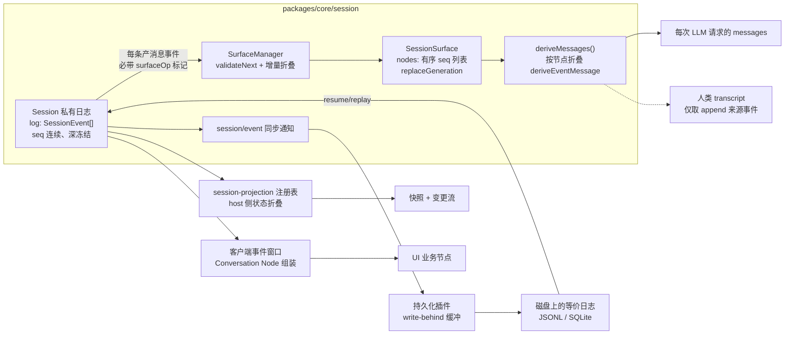
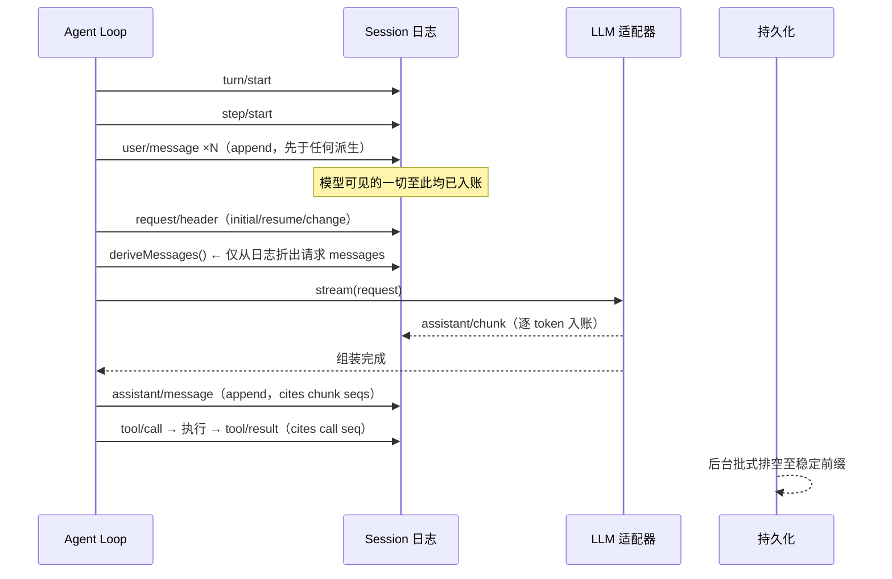
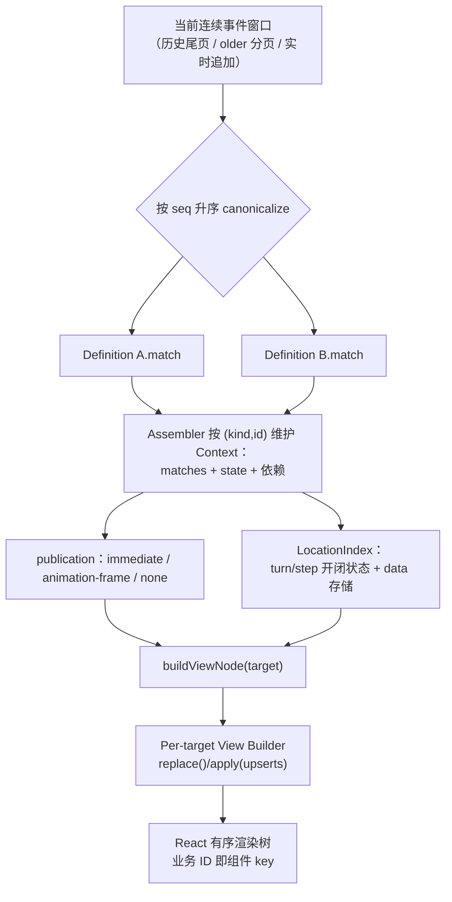

DeepSeek Harness 的会话子系统建立在一条最朴素的架构决策上：**会话就是一份仅追加的事件日志，LLM 消息历史只是这份日志的派生物**。这条决策的直接推论是本文标题所概括的不变量——“模型可见即已记录”：凡是出现在发给模型请求里的每一条消息，必然先于请求被追加进日志；反过来，任何一次历史请求都能从日志中逐字重建。本页剖析这条不变量在代码中的落点，以及围绕这份日志运转的多套“消息投影”。

在阅读下图前需要两个前置概念：**事件** 是携带 `seq`（单调连续序号）、`time` 与类型化 `data` 的不可变记录；**Surface** 则是日志上一张只由“产消息事件”构成的有序节点表——它是全部消息派生的唯一入口。



理解这张图的关键在于分叉点：同一份日志向下游裂解出三个互不相同的投影——给模型看的 transcript、给人看的 transcript、给 UI 看的业务节点。三者读的都是同一段字节，却遵循不同的折叠规则；这正是“投影”而非“存储”的含义。

Sources: [types.ts](packages/core/session/src/types.ts#L230-L237) · [event-sourced-sessions Agent Note](.agents/notes/implemented/architecture/2026-06-11-event-sourced-sessions.md#L15-L22)

## 一份日志承担三重职责：真源、发布总线与可回放凭证

`Session` 是一个普通类（不是 Cordis Service），内部只有一条私有数组 `log`，外加一个增量维护 Surface 的 `SurfaceManager`。它的公共形态刻意极小：`events` 返回冻结的日志快照，`seq` 直接等于 `log.length`（整个系统依赖的 `seq = log.length` 连续性契约），`header` 承载被排除在日志之外的存储元数据。[Session.append](packages/core/session/src/index.ts#L604-L655) 是唯一写入口，而构造器种子走完全相同的校验管道——这保证了一次回放/fork 不可能造出“活跃时合法、落盘后被后端拒绝”的畸形日志。

架构笔记记录了当初否决“可变消息数组 + 事件当通知”方案的推理：状态与日志可以分叉（diverge），而事件溯源让这种分叉**在结构上不可能发生**——日志本身就是状态。与之配套的是两条运行约定：追加永远同步完成（热路径不阻塞 I/O），持久化则退化为订阅 `session/event` 的插件责任，在 `session/flush` 检查点排空缓冲；构造期种子不重放发布总线，代之以日志内的 `session/end-seed` 记号区分亲代历史与本生命周期的工作。

| 职责 | 实现载体 | 关键性质 |
|---|---|---|
| 唯一真源 | 私有 `log` 数组 + 深冻结事件对象 | 追加后无法改写；观测者失败不回滚提交 |
| 发布总线 | `session/event` 同步通知、`session/flush` 并行检查点 | 观察者在日志推入之后才收到回调 |
| 回放凭证 | 原始 `assistant/chunk` 全量入账 + 连续 `seq` | 持久化可逐字存下规范日志 |

第三行值得单独强调：流式 token 以原始 chunk 形态逐条入账，随后组装完成的 `assistant/message` 通过 `sourceEventSeqs` 反向引用产生它的全部 chunk 序号。chunk 只是回放保真的素材，从不进入派生历史；真正进入 transcript 的只有组装后的消息。这个分工让你既能做 token 级重演，又能保持消息历史的推导成本可控。

Sources: [index.ts](packages/core/session/src/index.ts#L420-L567) · [session.zh.md](docs/subsystems/session.zh.md#L435-L460) · [write-behind.ts](packages/session/session-persistence/src/write-behind.ts#L40-L68) · [persistence.zh.md](docs/subsystems/persistence.zh.md#L9-L12)

## 单点准入：`append` 如何把校验前置到写入现场

`Session.append` 的签名在类型层面就执行了一半纪律：对三种产消息事件（`user/message`、`assistant/message`、`tool/result`）强制要求 `SurfaceIntent` 参数，而对其余事件在编译期拒绝该参数。运行时另一半则是每次追加都要经历的流水线：数据经 `snapshotJsonValue` 做无损 JSON 校验并复制、请求头类事件做规范性检查、Surface 元数据同样快照化、候选事件先交给 `validateNext` 预演合格才真正压栈——一旦进入日志即为提交态，观察者回调被逐个包含（contain），任何监听者崩溃都不会改变返回值或污染日志。

```ts
// 简化的提交顺序（完整语义见源码）
const dataSnapshot = snapshotJsonValue(data)      // 无损 JSON 门禁
this.surfaceManager.validateNext(event)           // 预演不合格则抛错，日志零改动
this.log.push(event)                              // 进入即提交（committed）
invokeContainedSessionObservers(...)              // 提交后才广播，失败逐个包含
```

防御纵深不止于单个事件。包级配套插件 `session-invariant` 以关系不变式监视整条日志流：`seq` 必须严格递增、turn/step 括号必须正确嵌套闭合、每个 `tool/result` 必须能在本步找到配对的 `tool/call`（或属于取消时的合成结果）。不认识某事件类型的读取方还受 `ignorable` 标记保护——未识别且未标记为可忽略的事件要求读者拒绝重建整个会话，而不是悄悄跳过后继续误读余下的日志。这些设计的共同取向很明确：**坏事件应在追加现场爆炸，而不是在数周后的恢复路径上以静默错读的形式出现**。

Sources: [index.ts](packages/core/session/src/index.ts#L594-L655) · [invariant.ts](packages/core/session/src/invariant.ts#L33-L131) · [types.ts](packages/core/session/src/types.ts#L408-L441)

## 不变量的正方向：凡可见，必先已记录

现在可以精确陈述不变量的第一条腿。Agent 循环构建请求时的消息来源只有一个表达式：`this.session.deriveMessages()`。而循环内部的追加次序保证了这个调用点看到的永远是已记录的事实——回合开始后，循环保留队列里认领到的输入先逐一以 `user/message`（`surfaceOp: 'append'`）形式追加，然后才打开本轮首个步骤发起模型调用；注入上下文同理：任何想让模型看见的东西（文件变更通知、子目录 AGENTS.md、技能内容），唯一的通路就是把一个带 `source` 标识的 `user/message` 写进日志。不存在旁路、不存在半提交态的消息缓存。



请求信封本身也受同一纪律管辖：系统提示词、工具 schema、调用配置组成 `EpochHeader`，以 `request/header` 全量快照形态在分派前写入当步之内，`reason` 字段标注 `'initial'`、`'resume'` 或 `'change'`；路由容量元数据走独立的 `request/context`，仅在变化时追加。于是"解释任意一次历史请求为什么长成那样”不再依赖外部叙事——头看最新快照，消息看 surface 投影，差量看是否有已记录的头变更或压缩替换。

Sources: [agent.ts](packages/core/agent-loop/src/agent.ts#L279-L351) · [agent.ts](packages/core/agent-loop/src/agent.ts#L477-L512) · [types.ts](packages/core/session/src/types.ts#L304-L313)

## 不变量的反方向：凡已记录到 surface，即可重建任何请求

第二条腿是可重建性——它把不变量从“诚实的记账”升级为“可证明的性质”。仓库中的回归测试用一句话锁定了这条契约：*"every request the loop sends is a pure function of the session log"*（循环发出的每个请求都是会话日志的纯函数），并用端到端断言验证：从冷日志重建出的 `deriveMessages()` 与实际发送的冻结请求消息 `structuredClone` 后逐元素相等。测试同时锁定单调扩展律：没有日志中的压缩替换或头变更作为凭据，后续请求必须是前一请求的严格值前缀延长。

这句话值得拆开体会。"pure function of the log”意味着消息历史的每次演化都有对应的日志痕迹，并且痕迹的先后次序足以唯一决定每一步请求的形态——既不多一条（无旁路注入），也不少一条（无内存态丢失）。取消中途的流式输出同样并入此框架：已送达的文本/推理前缀被固化为带 `interrupted: true` 的 `assistant/message`，未派发的工具调用缺席但不留空洞；崩溃后重新加载时，后端为悬挂的 turn 补写合成的 `interrupted` 收尾事件而不截断任何已持久化的内容。

| 断言点 | 测试证据 | 锁定的语义 |
|---|---|---|
| 请求 = 日志纯函数 | 冷日志重建与线上请求消息全等 | 派生只依赖 surface，无隐藏输入 |
| 严格前缀延长 | 相邻请求逐元素比较 | 无凭据不改写历史形态 |
| 取消保留前缀 | interrupted 消息 + 合成结果 | 不变量在中断路径上依旧成立 |

Sources: [request-reconstruction.spec.ts](packages/core/agent-loop/tests/request-reconstruction.spec.ts#L1-L5) · [request-reconstruction.spec.ts](packages/core/agent-loop/tests/request-reconstruction.spec.ts#L589-L603) · [repair 相关事件契约](docs/subsystems/session.zh.md#L267-L276)

## Surface：一张用标记语言书写的有序投影

Surface 本身不是独立数据结构，而是日志的一种**自述式注解加上一个折叠器**。注解部分很小：三个产消息事件类型各带一个必填的 `surfaceOp`——`'append'` 表示接在可见序列尾部，`{ op: 'replace', start, end }` 表示用一个新节点遮蔽既有区间（两端含）；可选的 `sourceEventSeqs` 完整声明本事件的来源序号或被遮蔽节点集合。折叠器 `SurfaceManager` 把这些操作折成一个有序 `nodes: seq[]` 列表，并为每次已提交的位置替换递增 `replaceGeneration`，供增量消费方分辨“纯尾部增长”与“发生了改写”。编译器与运行时双向把关：非 surface 事件携带这些字段会在校验中直接报错。

一个真实的持久化快照胜过千言描述。以下是压缩场景（compaction 属于上下文工程主题，详见[下一页目录条目](20-shang-xia-wen-gong-cheng-ya-suo-jie-guo-yi-chu-ce-lue-token-ji-liang-yu-ti-shi-ci-pian-duan-zu-zhuang)，此处只取其投影面）：`compaction/summary` 事件本身只是日志中的素材记录，真正登上 surface 的替补是一名特殊身份的 `user/message` 检查点：

```json
{"type":"user/message","data":{"content":[...<compacted-summary>...],
 "source":{"kind":"plugin","plugin":"compact","compactionId":"..." }},
 "sourceEventSeqs":[19,20,4],"surfaceOp":{"op":"replace","start":4,"end":4}}
```

`start === end === 4` 表示恰好遮蔽原日志中 seq 为 4 的旧消息节点；`sourceEventSeqs: [19,20,4]` 同时引用了压缩摘要事实所在的两个后续事件与被遮蔽节点自身——`(sessionId, time)` 之外的第三个锚点。这样，即使压缩前的原文永远从模型视野消失，它的存在与去向仍在日志中留下可审计的链条。

Sources: [surface.ts](packages/core/session/src/surface.ts#L14-L68) · [types.ts](packages/core/session/src/types.ts#L342-L393) · [压缩替换的真实快照](examples/headless-agent/tests/snapshots/compaction-recovery/session.jsonl#L20-L32)

## 消息投影的两级折叠：从节点表到冻结消息

第一级折叠的规则写在 `deriveEventMessage` 里，短得出奇：`user/message` 原样透传（调用方负责把框定语境的文本烤进 content——框架有意不在派生层加 `<context>` 之类的装饰壳）；`assistant/message` 透传但跳过空内容消息（那种消息只为托管 max-tokens 步骤的 usage 而存在，不能往提供方 transcript 里塞一个空 assistant 轮）；`tool/result` 透传其内嵌消息；其余一切产 `null`。第二级折叠由 `Session.deriveMessages()` 完成：按 `nodes.slice(上次投影位置)` 只投影新增节点，遇到 `replaceGeneration` 变化则整体重建。缓存里的 `Message` 对象直接共享自深冻结的事件数据，因此“每次调用拿到新数组、数组内对象永不可变”两件事同时成立。

空内容跳过规则暴露了这套投影哲学的一个有趣面向：**并非所有已记录内容都注定模型可见**。“模型可见即已记录”的正方向仍然成立（可见者必有记录），但反方向经过 surface 这道闸门后变成条件命题——记录的东西要亲自声明自己如何加入 ordered surface 才有资格可见。usage 数据就是个例子：它与产出的消息同事件旅行（`usage` 内嵌在 `assistant/message` 上），而不是独立事件，从而避免“用量可见了消息本体却被跳过”的裂缝。

Sources: [surface.ts](packages/core/session/src/surface.ts#L70-L114) · [index.ts](packages/core/session/src/index.ts#L701-L757) · [types.ts](packages/core/session/src/types.ts#L267-L277)

## 同一份日志的三位读者：模型、人类与界面

日志的价值最终由消费方兑现，而不同消费方对“历史”的理解理应不同。Harness 在这里做了一个语义上非常讲究的切分，可以整理成一张对照表：

| 投影 | 输入面 | 折叠方式 | 使用者 | 关键差异 |
|---|---|---|---|---|
| 模型 transcript | `SessionSurface.nodes` | `deriveEventMessage` 逐节点折叠 | 每次 LLM 请求 | 替换会真实消失——压缩旧文对模型不可见 |
| 人类 transcript | 追加来源的 surface 事件（`isAppendSurfaceEvent` 过滤） | 过滤后的日志顺序读取 | CLI/Web 会话展示 | 替换只影响模型——用户看过的对话不被抹除 |
| Host 状态折叠 | 全部 `session/event` | 各领域注册的 `ProjectionDefinition.apply` | 派生状态快照 / 变更流 | 整值事件规则：事件携带完整变更后状态 |
| UI 业务节点 | 客户端连续事件窗口 | Node Definition 引擎 + Location 索引 | React 渲染树 | 稳定 `(kind,id)` 身份，跨分页保持挂载 |

人类的那个投影尤其体现设计者的克制。代码注释直言：模型可见的 surface **有意**遮蔽被替换的区间，所以它是人类转录的错误来源——一次已生效的压缩不应该抹掉用户已经亲眼看到过的内容；因此人类转录读取“追加来源”事件，替换副本只留给模型。同一个系统里，“历史”一词因读者不同而有两种合法定义，且两种定义都可以由日志机械导出，无需人工干预。

Sources: [surface.ts](packages/core/session/src/surface.ts#L41-L55) · [session.zh.md](docs/subsystems/session.zh.md#L317-L319) · [session-projection/index.ts](packages/session/session-projection/src/index.ts#L13-L77)

## 界面投影：把事件窗口组装成业务节点

Web 端的做法把“投影”推向了第四种形态。客户端运行时提供一个**目标中立**的组装引擎：业务插件为每种业务对象（助手轮、工具生命周期、命令、压缩、重试、收件箱 splice……）注册 `ConversationNodeDefinition`，`match()` 从单条原始事件提取定义内的稳定业务 ID；装配器维持每会话隔离的 Context，把 Matches 按 `seq` 升序规范排列，`start()` 初始化 State、`update()` 演进 State，最终 `buildViewNode()` 物化成带 `kind + id` 复合键的视图节点。边界事实不属于任何业务定义——`turn/start`、`step/end` 等坐标信息由引擎自己的 Location 索引持有，向所有定义提供 reference-stable 的层级查询。



三条数据链路在同一机器内殊途同归：初始历史尾页整体清空重建、older 页增量补齐但保持既有 Context 身份、实时尾部只精确更新命中的 ID。无论网络乱序还是分页方向如何，State 永远按日志正序计算——“反向扫描”只是页面加载策略，从来不是计算顺序。这使得 `anchorSeq` 和业务 ID 可以作为 React 的稳定 key，消息在滚动加载旧史时不发生重挂载，也给这套 UI 提供了与派生模型历史同源的确定性：**界面呈现的每一次变更同样能追溯到具体的 seq**。

Sources: [conversation.ts](packages/client/runtime/src/client/contract/conversation.ts#L88-L108) · [client-conversation-node-assembly Agent Note](.agents/notes/implemented/architecture/2026-08-09-client-conversation-node-assembly.zh.md#L19-L150)

## 结语：不变量的经济学

回头审视，"模型可见即已记录”是一条典型的**结构性约束换设计自由度**的交易。放弃独立的内存消息数组意味着每次历史询问都要付出一次折叠成本——这正是 `deriveMessages` 的缓存将摊销做到 O(新增节点)、并把长期治理外包给压缩投影的原因（那条演进路径由[上下文工程页](20-shang-xia-wen-gong-cheng-ya-suo-jie-guo-yi-chu-ce-lue-token-ji-liang-yu-ti-shi-ci-pian-duan-zu-zhuang)专述）。得到的回报是一组“买断即终身”的保证：调试时可逐字重演任何一步、恢复时能精确知道中断发生在何处、审计时每条注入都带有身份标签、多套 UI 视图之间永不失同步。持久化后端只需承诺“把事件按序原样存下来”（具体后端见[持久化数据平面](19-hui-hua-chi-jiu-hua-shu-ping-mian-jsonl-sqlite-hou-duan-tou-ying-huan-cun-yu-quan-wen-jian-suo)），因为真正承载语义的那份“账本”，早在事件抵达 `Session.append` 的那一刻就已经记完了。

从这里出发的两条自然延伸：想了解上述 turn/step 括号与事件流的更多扩展点（waterfall 拦截、pre-step 决策），请移步[轮次流程剖析](11-lun-ci-liu-cheng-pou-xi-turn-step-shi-jian-liu-yu-agent-sheng-ming-zhou-qi-kuo-zhan-dian)；想知道这些产消息事件被工具执行流水线以何种把关节奏生产出来，请继续阅读[工具注册表与执行流水线](14-gong-ju-zhu-ce-biao-waterfall-ba-guan-shi-jian-yu-zhi-xing-liu-shui-xian)。