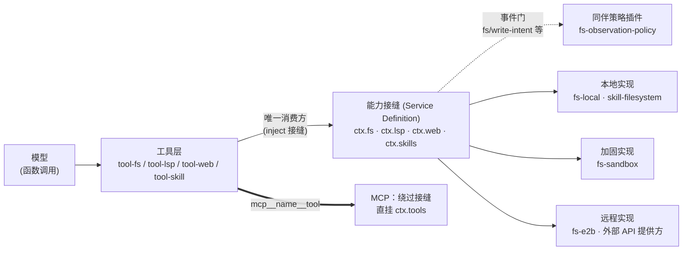

本页是面向高级开发者的解释性文档，剖析 deepseek-harness（DSH）中贯穿五个能力族的一套统一架构模式——**能力接缝（capability seam）**。阅读前提是你已理解 Cordis 插件框架的服务与 inject 机制（见 [Cordis 五大核心概念](5-cordis-wu-da-he-xin-gai-nian-cha-jian-shang-xia-wen-fu-wu-inject-yi-lai-sheng-ming-lei-xing-hua-shi-jian-yu-ke-ni-fu-zuo-yong)）。本页聚焦四个挂在 `Context` 上的服务接缝（`ctx.fs`、`ctx.lsp`、`ctx.web`、`ctx.skills`）以及一个刻意**不走服务路线**的对照组——MCP 桥接插件；工具如何被把关和执行的完整流水线属于下一页的内容，此处只在必要的范围内引用。

Sources: [capability-seams.md](docs/capability-seams.md#L4-L6)

## 三分法：核心主轴服务、可换接缝与组合点

DSH 把每个 Cordis 服务归入三类角色之一：**core**（核心主轴服务，独占某个领域状态，如会话存储、投影单元）、**seam**（可交换的能力接缝，把一个"执行世界"的边界抽象在单一接口之后）、**bundle**（组合点，具体循环驱动等胶合产物）。这份分类并非散文描述，而是仓库中一份带完备性守卫的清单：[gen-doc-graphs.ts](scripts/gen-doc-graphs.ts) 的 `SERVICE_ROLES` 数组逐条声明每个 `ctx.*` 键的角色、实现包、消费方与备注，`assertServiceRolesComplete` 保证从源码扫描到的所有服务键都被归类——少一条或多一条都会在文档生成阶段直接抛错。生成的图谱即 [capability-seams.md](docs/capability-seams.md)，页面标题中的"模型可见能力族"则是一个更严格的子集：**只有那些存在专属工具消费方、会把能力暴露给模型的接缝才算数**。凭据（`ctx.credentials`）、设置（`ctx.settings`）、会话持久化（`ctx.sessionPersistence`）同样是接缝，但它们的消费方是适配器与网关而非工具，因此不在本页讨论之列。

Sources: [capability-seams.md](docs/capability-seams.md#L4-L6), [gen-doc-graphs.ts](scripts/gen-doc-graphs.ts#L30-L39), [gen-doc-graphs.ts](scripts/gen-doc-graphs.ts#L641-L657)

值得注意的是生成器如何表达这类关系：`fs` 角色除实现包与消费方外还有一列 **companions**（同伴插件），它们不直接注入服务，而是通过服务声明的 `fs/*` 事件门参与决策。这个第四位置正是接缝模式的扩展缝——策略逻辑以旁观监听者身份挂载，而非修改提供者契约本身。

Sources: [gen-doc-graphs.ts](scripts/gen-doc-graphs.ts#L462-L471), [gen-doc-graphs.ts](scripts/gen-doc-graphs.ts#L686-L689)

## 一个结构模板，五种实例化

五个能力族共享同一个解剖结构，可以浓缩为一张图：

模板的第一条纪律是**所有权分离**：服务定义包（如 `packages/fs/fs`）通过 Cordis declaration merging 把抽象类挂上 `Context`，并且——这是它与普通接口包的关键差别——**同时拥有该接缝的策略事件词汇**。`fs` 包在自己的 `declare module '@deepseek-ai/cordis'` 里既声明 `ctx.fs`，也声明 `fs/write-intent`（waterfall 单槽决策）、`fs/edit-intent`（waterfall）、`fs/observed`(emit) 三个事件；这保证任何实现或消费者都不可能绕开声明包私造策略通道。第二条纪律是**生命周期内建**：提供方注册一律经由 `ctx.effect` 完成，fiber 销毁时同步反注册，插件的热重载因此天然成立（Web 与 LSP 的注册方法都返回一个无参 disposer 即是证据）。第三条纪律是**编译期封闭**：面向模型的联合类型一律封闭，新增成员必须跨包协调，稍后各节逐一展开。

Sources: [fs/index.ts](packages/fs/fs/src/index.ts#L44-L86), [web/index.ts](packages/web/web/src/index.ts#L118-L129), [lsp/index.ts](packages/lsp/lsp/src/index.ts#L130-L141)

## fs：带版本守卫的原语面与单槽策略门

`ctx.fs` 的抽象类 `FileSystem` 定义了目标解析（`resolve` 返回稳定身份 `FsTarget`）、进程路径与 `file:` URI 的转换、包含判断，以及文本/字节读取与原子写改原语；`editText` 刻意留在接缝内，让版本检查、字面匹配与重写共享一个临界区，而读窗口与"先读后改"策略留给消费方与策略插件。词汇层的两个**品牌化不透明类型**是防泄漏的样板：`FsTargetKey` 与 `FsVersion` 都是 branded string，注释明确规定消费者不得解析或假设其格式——本地后端用 realpath 字符串，远程后端完全可以换成 workspace URI 或修订号而不动任何下游代码。写意图 `FsWriteIntent` 则把并发安全编进类型：`createIfAbsent` 撞上已存在目标时报 `FS_NOT_OBSERVED`，`replaceIfVersion` 版本失配时报 `FS_STALE_VERSION`，配合十三个个机器可路由的 `FS_*` 错误码，上层无须解析错误消息字符串。

Sources: [fs/index.ts](packages/fs/fs/src/index.ts#L1-L9), [fs/types.ts](packages/fs/fs/src/types.ts#L11-L45), [fs/types.ts](packages/fs/fs/src/types.ts#L118-L188)

三个实现包展示同一接缝的三档强度：`fs-local`（本地直连）、`fs-sandbox`（继承 local 但按共享沙箱模式对写改设栏）、`fs-e2b`（E2B 远程运行时）。接缝还暴露一个**能力事实**：`sandboxMode` getter 让工具层如实宣传升级字段——裸本地后端返回 `undefined`（从不隔离），`dsh-fs-sandbox` 覆盖为部署默认模式。真实组合里，替换发生在配置层而非代码层：acp-agent 示例用一行 `- id: fs-sandbox` 替换掉默认 local 后端，再叠加 `fs-observation-policy` 监听 `fs/*` 门实施"先读后改"，最后由 `tool-fs` 注册面向模型的 `read`/`write`/`edit`。另有一个容易误解的细节：`tool-fs-search` 的 glob/grep 不走 `ctx.fs` 方法，而是打包的 ripgrep 二进制经 `ctx.subprocess` 执行——发现类工具与 IO 类工具分属两条能力管道。

Sources: [fs/index.ts](packages/fs/fs/src/index.ts#L100-L105), [cordis.yml](examples/acp-agent/cordis.yml#L163-L177), [fs/README.md](packages/fs/README.md#L7-L15)

## LSP：封闭操作集与原子注册的选择器

`ctx.lsp` 是五个族里**最小面**的一个：它只暴露四个规范化操作 `goToDefinition`/`findReferences`/`goToImplementation`/`hover`，类型注释明确写出"没有协议类型、没有进程或文档控制、没有通用 JSON-RPC 逃生舱"。`LspOperation` 与结果联合 `LspQueryResult`（locations 或 hover）都是封闭联合，消费者以穷尽 switch 接入，新增一种结果的改动会在所有消费点编译报错。注册侧体现的是**原子性纪律**：`registerProvider` 先完整校验品牌 id 非空、扩展名映射非空且合法、无单提供方内部重复，再交叉检查跨提供方的扩展名冲突，全部通过后才用一个 `ctx.effect` 同时登记 id 与全部路由——无效注册发布不出任何状态，disposer 将它们一并回收。

Sources: [lsp/types.ts](packages/lsp/lsp/src/types.ts#L12-L17), [lsp/types.ts](packages/lsp/lsp/src/types.ts#L75-L87), [lsp/index.ts](packages/lsp/lsp/src/index.ts#L90-L127)

查询路由按文件的最终扩展名分发（`finalExtension` 统一小写并排除点开头 dotfile），因此**选择永不含糊也永不依赖注册顺序**——这是与 Web 接缝对比时最锐利的差异：LSP 按"哪个语言"路由必然互斥，Web 按"选哪个后端"则可能有多个可用候选。具体的 `lsp-stdio` 后端演示了接缝之间的复合方式：它声明 `inject = ['fs', 'lsp', 'subprocess']`，源代码读取走 `ctx.fs`、语言服务器进程走 `ctx.subprocess`，自己只做 JSON-RPC 到规范化 query/result 的翻译，以及按 canonical workspace 的惰性单飞服务器生命周期管理。最外层 `tool-lsp` 注入的仅是 `tools`、`lsp`、`systemPrompt`，且 import 列表里没有任何提供方包——它负责把模型侧的一基准 UTF-16 光标坐标转为接缝侧的零基准、封顶渲染结果并附带 60 秒默认超时预算。

Sources: [lsp/index.ts](packages/lsp/lsp/src/index.ts#L143-L150), [lsp-stdio/index.ts](packages/lsp/lsp-stdio/src/index.ts#L1-L12), [tool-lsp/index.ts](packages/lsp/tool-lsp/src/index.ts#L1-L11)

## Web：执行期解析的双登记表

`ctx.web`（`WebRuntime`）维护两张登记表——search 与 fetch 各一——却共用一个服务，让提供方选择、取消、错误与产品配置只有一个属主。它的选择算法完全在**执行期**判定且不依赖注册顺序：显式配置了 id，就要求该 id 已注册且 `available()`，否则分别抛 `WEB_PROVIDER_CONFIGURED_MISSING` 或 `WEB_PROVIDER_CONFIGURED_UNAVAILABLE`；未配置 id 时恰好一个可用提供方则自动选中，多于一个则 `WEB_PROVIDER_AMBIGUOUS` 强制用户表态，一个都没有则 `WEB_PROVIDER_UNAVAILABLE`。`available()` 契约规定它是廉价本地检查、禁止发起网络调用——即"可用性"是部署事实而非健康探测。环境变量 `DSH_WEB_SEARCH_PROVIDER`/`DSH_WEB_FETCH_PROVIDER` 直接喂进同一批配置字段，代码注释特意强调这不是隐藏优先级链。

Sources: [web/index.ts](packages/web/web/src/index.ts#L62-L94), [web/index.ts](packages/web/web/src/index.ts#L172-L194)

规范化词汇中有两处值得称道的设计判断。其一，非 2xx 的 HTTP 响应是**结果而不是异常**——状态码是被抓取资源状态的一部分，`WebError` 只保留"无法安全取得或表示资源"的失败。其二，响应体类型 `WebFetchBody` 是由 `dsh-web` 独有的封闭联合（当前仅 `html`/`text` 两臂）：提供方解码、工具层渲染，新kind是跨已知包的协同变更而非插件扩展点。接缝还会替工具兜底：`maxResults` 在返回途中由 `capSources` 截断并置 `truncated` 标记，即使某提供方超额返回也不破约。三家的搜索适配器构成实施光谱：Exa 支持 `numResults` 下推（作为成本优化）、DeepSeek 自家接口、Perplexity 附带生成式答案（映射到可选的 `content` 字段）；fetch 侧的 `web-fetch-http` 是本地 HTTP 实现。工具层 `tool-web` 独占 schema、提示词引导与输出上限（默认单次抓取输出 200,000 字符、协作式超时 30 秒），并确立一条产品规则：启用开关控制注册与否，但**已启用的工具在后端缺席时保持可见**，执行期才以结构化错误失败——目录稳定性优先于运行时可用性。

Sources: [web/types.ts](packages/web/web/src/types.ts#L58-L93), [web/types.ts](packages/web/web/src/types.ts#L35-L56), [tool-web/index.ts](packages/web/tool-web/src/index.ts#L1-L7), [tool-web/index.ts](packages/web/tool-web/src/index.ts#L26-L52)

## Skill：作用域分层的裁决登记表

`ctx.skills`（`SkillRegistry`）与前三者的根本不同在于它是**合并裁决者**而非选择器：多个来源可以在一次目录视图中共存，冲突按两层规则消解——注册按调用上下文的作用域落入 `ScopedLayers` 的层（宿主与仓库插件进全局层，agent preset 驻留挂载进的对应 preset 层），读取时合并全局层与查看方作用域链，**最近层的重名直接获胜，rank 只在同一层内决胜**（数字小者优先，其次才是注册顺序；打包根的标准 rank 为 600，运行时贡献为 250）。提供方契约只有 `list` 与 `get` 两个方法：远程初始化与认证都推迟到 `list()` 内进行，返回值可以是纯数组简写，也可以是带 `complete` 标志的显式观察——不完整的发现结果不可进入收集缓存（容量默认 128 个完成目录），任何变更通过 `skills/change` emit 事件广播失效。

Sources: [skill/index.ts](packages/skill/skill/src/index.ts#L346-L378), [skill/index.ts](packages/skill/skill/src/index.ts#L231-L268), [skill/index.ts](packages/skill/skill/src/index.ts#L20-L27)

Skill 族最有特色的地方是**双调用面**由同一元数据裁剪：每条摘要携带 `SkillInvocationPolicy`（`modelInvocable`/`userInvocable`），决定它是否进入模型目录、是否进入人类命令目录——模型不可见的技能对人依然可以 `/invoke`。加载侧的规范化由 `renderSkillContent` 保证：无论走 `skill` 工具结果还是用户显式调用的上下文注入，模型看到的都是同一个 `<skill_content>` 形状；注入侧还在消息源词汇表中登记了 `skill-invocation` 类型（form 固定为 `instructions`），使转录消费者能从结构化元数据识别注入而不必重新解析正文。工具层 `tool-skill` 会随目录一起发布一条持久化的 `catalog` 形态上下文消息（附结构化 entries），并把目录描述截断在 500 字符内——模型面目录与人类审计面各取所需而互不复述。

Sources: [skill/index.ts](packages/skill/skill/src/index.ts#L38-L53), [skill/index.ts](packages/skill/skill/src/index.ts#L146-L184), [tool-skill/index.ts](packages/skill/tool-skill/src/index.ts#L28-L41)

## MCP：第五族的反例——为什么桥接不做接缝

MCP 客户端是本页五个族中唯一**不创建 `ctx.*` 服务**的成员，这个否定性事实本身就是设计结论：外部 MCP 服务器的价值在于动态注册任意数量的远端工具，天然形态是工具增殖而非单一能力查询面。因此 `dsh-mcp-client` 是一个 namespace 插件（named exports，无 default export），`inject = ['tools']`，apply 时先按 `(serverName)` 在以 `ctx.root` 为键的 WeakMap 中预留命名空间——重名是加载期配置错误，绝不静默遮蔽——随后进入连接监督循环，把远端 `tools/list` 同步进工具注册表。

Sources: [tools.ts](packages/mcp/mcp-client/src/tools.ts#L1-L13), [mcp-client/index.ts](packages/mcp/mcp-client/src/index.ts#L39-L48), [connection.ts](packages/mcp/mcp-client/src/connection.ts#L1-L13)

面向模型的命名采用确定性纯函数：公共名形如 `mcp__<serverName>__<rawName>`；若字符替换（DeepSeek 函数名约束只允许 `[A-Za-z0-9_-]`、上限 64 字符）或截断改变了名字，追加 12 位 SHA-256 身份哈希保证不同 `(serverName, rawName)` 对永不坍缩成同一个公共名。原始名仅在 `tools/call` 上线传输，公共名永远不被反向解析——同一性信息保存在桥接内部而非编码在名字里。生命周期语义值得细读：重连默认指数退避（500ms 起、30s 封顶、每次中断共享 10 次尝试预算），耗尽后注销该服务器全部工具并停机，唯一的回头路是 disposal（含 HMR）；`failOnStartupError` 则决定初始连接失败是拒绝激活整条 fiber（Cordis 回滚）还是记日志进入重连环。桥接强制"先连接后激活"，所以 Cordis 消费者在 fiber 激活后的第一时间就能观察到全部工具。最后，`McpResult` 类型保留 `content[]` 与 `structuredContent` 双字段供 Code Mode 无损转发协议块——外部世界进入 harness 的载荷同样需要一份封闭词汇。

Sources: [tools.ts](packages/mcp/mcp-client/src/tools.ts#L97-L117), [mcp-client/index.ts](packages/mcp/mcp-client/src/index.ts#L166-L181), [connection.ts](packages/mcp/mcp-client/src/connection.ts#L40-L45), [examples/mcp-memory/mcp-reference-memory.cordis.yml](examples/mcp-memory/mcp-reference-memory.cordis.yml#L3-L13)

## 五族横向对照

| 维度 | fs | LSP | Web | Skill | MCP |
|---|---|---|---|---|---|
| 服务键 | `ctx.fs` | `ctx.lsp` | `ctx.web` | `ctx.skills` | （无服务，直挂 `ctx.tools`） |
| 定义包 | `fs/fs` | `lsp/lsp` | `web/web` | `skill/skill` | `mcp/mcp-client` |
| 实现包 | fs-local / fs-sandbox / fs-e2b | lsp-stdio | exa / perplexity / deepseek / http 四提供方 | skill-badge / skill-filesystem / 运行时注册 | —（任意外部服务器） |
| 模型可见面 | `read`/`write`/`edit`(+glob/grep) | 单一 `lsp` 工具·四操作 | `web_search`/`web_fetch` | 会话前缀目录 + `skill` 加载器 | `mcp__srv__tool` 动态集 |
| 选择/命名语义 | 沙箱模式能力事实 + 后端整体替换 | 按扩展名确定性路由 | 配置优先→唯一可用→歧义报错 | 最近作用域层胜出，rank 同层决胜 | 命名空间预留 + 哈希防坍缩 |
| 失败词汇 | 13 个 `FS_*` 码 | `LSP_INVALID_PROVIDER` 等 6 类码 | `WEB_PROVIDER_AMBIGUOUS` 等 | 目录 incomplete 标志 + change 广播 | 重连退避耗尽即注销 |
| 扩展缝 | `fs/*` waterfall 单槽事件 | 编译期封闭操作联合 | 封闭 `WebFetchBody` 联合 | 双调用面策略位 | 新增 MCP 服务器=新增插件实例 |

Sources: [gen-doc-graphs.ts](scripts/gen-doc-graphs.ts#L336-L343), [gen-doc-graphs.ts](scripts/gen-doc-graphs.ts#L462-L471), [gen-doc-graphs.ts](scripts/gen-doc-graphs.ts#L507-L515), [gen-doc-graphs.ts](scripts/gen-doc-graphs.ts#L559-L567)

综合来看，这套模式的收益链条清晰可辨：因为接缝词汇封闭且身份不透明，替换 `fs-local` 为 `fs-e2b` 只需换一行组合配置；因为选择不依赖注册顺序，多提供方部署不会产生顺序敏感的歧义行为；因为每个族恰有一个模型可见消费方，向模型暴露能力的成本集中在 schema 与提示词引导一处，可被独立审计。想继续深入时，建议按 [核心包地图：包分组职责与 ctx 服务键导览](10-he-xin-bao-di-tu-bao-fen-zu-zhi-ze-yu-ctx-fu-wu-jian-dao-lan) 复盘全局键分布，再到 [工具注册表、waterfall 把关事件与执行流水线](14-gong-ju-zhu-ce-biao-waterfall-ba-guan-shi-jian-yu-zhi-xing-liu-shui-xian) 看 `ctx.tools` 如何把关这些工具的每次调用；沙箱后端与 Landlock 启动器的 enforcement 细节见 [沙箱策略后端与 Landlock 原生限制启动器](17-sha-xiang-ce-lue-hou-duan-bwrap-landlock-seatbelt-yu-landlock-yuan-sheng-xian-zhi-qi-dong-qi)，MCP 组合包的实跑样例见 [示例组合包导览](27-shi-li-zu-he-bao-dao-lan-acp-agent-headless-agent-jsonrpc-agent-yu-mcp-memory)。