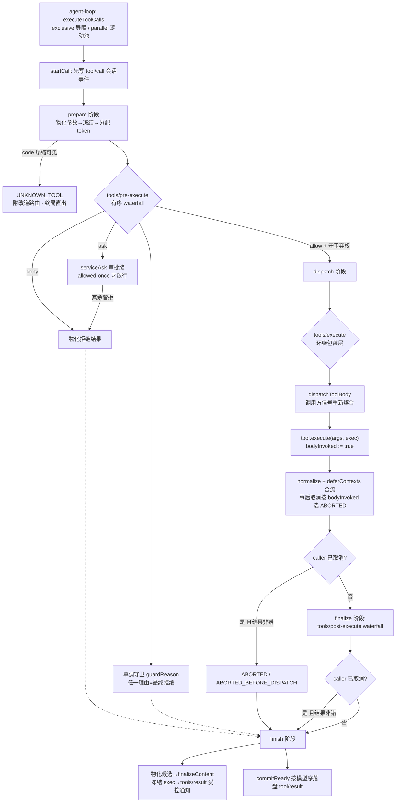

本页解释 DeepSeek Harness 中模型可见工具的完整生命周期：插件如何把工具注册进 `ctx.tools` 服务、注册表暴露了哪些把关扩展点，以及一次调用在 `prepare → dispatch → finalize → finish` 四段协议中被策略层层层放行或拦截的精确路径。阅读本文前建议先掌握 Cordis 的 waterfall 环绕语义：[事件分发四模式与 Waterfall 环绕中间件语义](6-shi-jian-fen-fa-si-mo-shi-yu-waterfall-huan-rao-zhong-jian-jian-yu-yi)，以及工具所在能力族的定位：[能力接缝设计模式：fs、LSP、Web、Skill 与 MCP 模型可见能力族](13-neng-li-jie-feng-she-ji-mo-shi-fs-lsp-web-skill-yu-mcp-mo-xing-ke-jian-neng-li-zu)。官方仓库内还有一张由生成器维护的流程总图可直接对照：[tool-execution-pipeline.zh.md](docs/tool-execution-pipeline.zh.md#L7-L10) 描述了策略、钩子、沙箱与结果重写的运行时机。

## 注册表即服务：ctx.tools 的统一入口

`ToolRuntime` 是一个挂在上下文上的服务，模块头一行话概括了它的全部职责："Tool registry, model presentation modes, and pre/guard/around/post/result execution pipeline"。它只声明依赖 `systemPrompt`（用于在系统提示词组装期取回工具 schema 投影），并通过配置项决定呈现方式：`mode` 支持 `native | code | both` 三态，`maxParallelSubCalls` 约束 Code Mode 下单个程序的并发子派发上限。注册表实例本身即挂载键：所有插件通过 `ctx.tools.*` 访问它，agent 循环则通过符号键 `[TOOL_RUNTIME_SCHEDULER]` 访问一个内部调度视图——后者刻意不进入面向插件的公开 API。

Sources: [index.ts](packages/core/tools/src/index.ts#L1-L3), [index.ts](packages/core/tools/src/index.ts#L785-L802)

对外 API 面由五个方法构成，每个方法返回精确的 disposer，保证副作用插件被 dispose 时自动回滚注册状态：

| 方法 | 作用域语义 | 关键约束 |
|---|---|---|
| `register(definition)` | 全局或调用方 agent 层；同层重名失败 | 必须声明 `output { schema, render }`；保留名 `run_code` 永久不可注册 |
| `restrict({ allow?, deny? })` | 仅限 scoped 上下文；对继承面取交集 | 不能命名 `run_code`；未知名称直接抛错 |
| `guard(guard)` | 普通上下文=全局；`agent.ctx`=仅该 agent | 同步判定，返回字符串即拒绝 |
| `presentAs(mode)` | 单个作用域声明呈现模式 | 同一作用域二次声明即冲突 |
| `executionMode(exec)` / `get(name, agent)` | 按作用域解析后的只读查询 | 被限制的全局工具按"不存在"处理 |

Sources: [index.ts](packages/core/tools/src/index.ts#L1031-L1116), [index.ts](packages/core/tools/src/index.ts#L1276-L1276)

作用域叠加是理解一切可见性的关键：可见性解析沿 scope 链从最远祖先走到当前作用域，较近的同名注册遮蔽较远的；`restrict` 只过滤**继承**来的表面，该作用域自己 `register` 的工具永远不受自家过滤器影响——这正是委派子 agent 保有自己的上报通道的机制基础。每次注册、注销或限制变更都会发出未过滤的 `tools/change` 通知（故意的非过滤分发：全局变化关乎每个 agent 的下一次组装），随后系统提示词组装器据此重建各 agent 的模型请求。注意 `presentAs` 的注释揭示了一个安全不变量：某个 agent 因其他作用域开启了 code mode 而**不应该**在自己的分派表里找到 `run_code`，所以预留传输层的注入是逐 scope 解析的。

Sources: [index.ts](packages/core/tools/src/index.ts#L1132-L1205), [index.ts](packages/core/tools/src/index.ts#L933-L975)

## 事件词汇表：三个拦截 waterfall 与两个通知

注册表在 Cordis 的 `Events` 接口上共声明六个事件，形成一套分层的把关词汇。前置概念是 waterfall 监听器的两种收尾惯例：调用 `next()` 委托给下游（可再加工下游结论）或直接返回决策短路整条链：

| 事件 | 分发模式 | 决策词汇 | 典型消费者 |
|---|---|---|---|
| `tools/pre-execute` | waterfall | `allow` / `deny(reason)` / `ask(reason?)` | 钩子桥接、作业准入、审批入口 |
| `tools/execute` | waterfall（环绕分派） | 返回 `ToolExecutionResult`；只能换 `exec.signal` | 协作超时、重试、度量 |
| `tools/post-execute` | waterfall | `accept(content? \| value?)` / `block(feedback)` | 结果外溢、重复提醒、钩子后处理 |
| `tools/code-dispatch-log` | waterfall | 替换持久日志副本的内容块 | 外溢策略（仅限日志副本） |
| `tools/result` | emit（同步通知） | 无，观察冻结终局 | 结构化输出捕获、遥测 |
| `tools/change` | emit（未过滤） | 无 | 系统提示词组装失效 |

Sources: [index.ts](packages/core/tools/src/index.ts#L144-L213), [generated.ts](packages/core/scope/src/scoped-events.generated.ts#L31-L36)

三个拦截事件共同维护一条身份保护规则：**参数一旦落笔就不可改写**。`pre-execute` 收到的参数已被一次性物化为无损 JSON 并深冻结，且该值此刻已写入 `tool/call` 日志、已渲染过 pending 卡片，因此水瀑布不提供改参出口——想改变行为的唯一途径是 deny 或 ask。`execute` 是唯一的环绕层：包装器可以为**自身委托的生命周期**替换 `exec.signal`（超时计时器就是这么挂上去的），但调用身份字段全只读；注册表还会在函数体执行前把原始调用方信号重新熔合回去，使任何包装器都无法把调用方取消从管道里摘除。`post-execute` 则允许接受、替换投影（内容与规范值二选一）、附加下一轮上下文，或以纠正反馈把成功结果翻转为错误。

Sources: [index.ts](packages/core/tools/src/index.ts#L143-L190), [tools.zh.md](docs/subsystems/tools.zh.md#L346-L392)

除拦截词汇外，两个通知事件各有不可替代的位置。`tools/result` 在最终结果**深冻结之后**触发，监听器异常被容器化吞掉并降级为警告日志——它是唯一能拿到"规范化终局"而不可能污染它的观察点，子代理驱动正是用它来提交结构化输出的捕获判词。`tools/change` 反其道而行之：故意不做 scope 过滤，任何订阅者都能看见全局变化。

Sources: [index.ts](packages/core/tools/src/index.ts#L176-L206), [index.ts](packages/core/tools/src/index.ts#L207-L213)

## 一次调用的旅程：四段式调度协议

先看全景，再逐段拆解。下图是本页 mermaid 图的阅读前提：左侧是会话事件的写入时机，右侧虚线框是注册表内部的四个阶段，`ask` 分支汇入的是内建审批缝而非外部监听器。

Sources: [tool-calls.ts](packages/core/agent-loop/src/tool-calls.ts#L39-L99), [tool-execution-pipeline.zh.md](docs/tool-execution-pipeline.zh.md#L12-L60)

**prepare 阶段是整个把关过程的秩序中枢。** 入口 `createExecution` 先完成三件事：分配注册表私有的不透明 token、用 `snapshotJsonValue` 把参数 detachment 成独立快照并 `deepFreeze`、以及在任何策略运行之前捕获 `finalizeContent` 回调（防止参数 getter 在物化中途偷换回调）。这里有一个值得玩味的特判：如果调用的是一个**可见但已塌缩**的名字——即在 native agent 视角下被 `mode: 'code'` 收编进程序内部的工具——调用会在进入策略管线**之前**终止为一个带路由指引的 `UNKNOWN_TOOL` 终局。设计意图写在原地：pre-execute 监听器、审批询问和守卫都绝不应看到、更不应批准一个注定失败的调用。

Sources: [index.ts](packages/core/tools/src/index.ts#L1363-L1453), [index.ts](packages/core/tools/src/index.ts#L1459-L1507)

**waterfall 之后是一套降级矩阵而非异常路径。** `ask` 决策交给注册表内建的 `serviceAsk` 消费审批缝：没有部署 ApprovalService 就历史性地降级为 deny；调用没有所属 agent（没有会话可审计、没有 UI 可路由）同样拒绝；只有 `allowed-once` 放行，三种非授权各自携带**可区分的理由**——这让模型分得清"人类说不"与"审批通道根本不在"。审批结束后还有一个容易忽略的细节：如果等待期间调用方信号恰好中止，取消会被标注为 `approvalCancelled` 并走 post-result 慢速路径（让后续日志照常闭合）而不是悄悄吞掉。

Sources: [index.ts](packages/core/tools/src/index.ts#L1663-L1710), [user-approval](packages/core/tools/src/index.ts#L16-L18)

**waterfall 放行之后、分派之前，还横着一道单调守卫。** `guardReason` 先查全局守卫层再沿 scope 链下行，任一匹配守卫返回字符串即成最终拒绝，而守卫的类型签名刻意不含 allow 分支：返回 `undefined` 表示弃权而非批准。这保证了"可重排策略允许、所有者策略仍能否决"的双层结构——扩展监听器顺序自由组合，最后的安全底座却无法被后续组合推翻。全部拒绝（waterfall 的 deny 或守卫的理由）都会被物化为标准 `isError` 结果并照常经过 post-execute 与 `tools/result`，日志因此永远闭合。

Sources: [index.ts](packages/core/tools/src/index.ts#L700-L713), [index.ts](packages/core/tools/src/index.ts#L1118-L1130)

**dispatch 与 finish 两段把取消语义做成了状态机。** 函数体启动时置位 `bodyInvoked`，此后每一阶段检查 `callerCancelled` 时都以它选择正确的取消码：身体已动则是 `ABORTED`（补偿结果会走快照下来的 `finalizeContent`），身体未动则是 `ABORTED_BEFORE_DISPATCH`。任何一环抛出的异常都被收敛为 `final-result` 快速路径——但该结果依然要经过完整的物化、`applyFinalContent`（回调被恰好调用一次，包括旁路了 post-execute 的管线失败）与冻结后的受控通知。

Sources: [index.ts](packages/core/tools/src/index.ts#L1521-L1602), [index.ts](packages/core/tools/src/index.ts#L1621-L1662)

这个四段结构不是审美偏好，而是被并行调度逼出来的形状：prepare 必须对同组调用**串行**（策略可以 await 而且策略决策之间不能交错），dispatch/body 却需要重叠以吃满并发，于是中间结果必须能停在两段之间的插槽里。注册表为此在类型层面显式区分了 `post-result`（还需 post-execute）与 `final-result`（已经终局）两种准备产物，并配了一台阶段机不变量——`pre-execute` 对同一执行不得重复、`execute` 必须紧随其后、`post-execute` 必须排在两者之一后面——违规即刻失败。

Sources: [index.ts](packages/core/tools/src/index.ts#L440-L462), [invariant.ts](packages/core/tools/src/invariant.ts#L88-L112)

## agent 循环的消费视图：有序提交下的重叠分派

agent-loop 的 `executeToolCalls` 是调度器符号键的唯一消费者，它的分组算法直接读取注册表的并发声明：每轮先用 `ctx.tools.executionMode()` 给队首分类，`parallel` 调用尝试并入滚动池（池上限来自 `agentLoop.config.maxParallelToolCalls`），普通调用独占成一个屏障组。关键的细节在于**开始前的重新分类**：滚动池每补一个槽位都重读后续成员的模式，因此在策略允许的前提下，注册表后来追加的独占声明能让尚未开始的平行调用收敛成新屏障。

Sources: [tool-calls.ts](packages/core/agent-loop/src/tool-calls.ts#L39-L99), [tool-calls.ts](packages/core/agent-loop/src/tool-calls.ts#L200-L207)

提交侧的纪律只有一个词：模型序。各分派异步落地到各自的插槽，`commitReady` 只沿连续前缀推进；`needsPost` 标记决定走 `finalize`（含 post-execute）还是 `finish`（跳过）；每个结果的 `additionalContexts` 恰在此刻交给下一轮的 inbox。会话事件的时序也由此钉死：`startCall` 在进入 prepare **之前**写下 `tool/call` 并记住其 seq，此后无论管线成败，`appendToolResult` 都会用 `sourceEventSeqs` 把结果回链到那次调用；abort 送达时，已开始的调用排空提交，未开始的每个都补一条合成 `ABORTED_BEFORE_DISPATCH` 结果——重放的正确性建立在"记录过的调用必有结果"之上。

Sources: [tool-calls.ts](packages/core/agent-loop/src/tool-calls.ts#L118-L148), [tool-calls.ts](packages/core/agent-loop/src/tool-calls.ts#L209-L280)

## 把关生态：扩展点的真实用法

以下消费者全部来自第一方代码，合在一起展示了这套扩展点的惯用法谱系：

| 包 | 挂载点 | 用法要点 |
|---|---|---|
| `guard/timeout-policy` | `tools/execute` | 读 `timeoutMs`，限时换信号，仅当**自己的**计时器胜出才替换结果并恢复上游信号 |
| `hooks/hooks-claude-code` · `hooks/hooks-codex` | `tools/pre-execute` + `tools/post-execute` | 把外部代理框架的挂钩协议双向映射为本地决策 |
| `spill/spill-policy` | `tools/post-execute` | 超大文本结果外溢为文件加定位符，替换规范值 |
| `fs/tool-fs-search`（glob/grep） | `tools/post-execute` | 结果数超上限时保存全文并重写内容为截断视图 |
| `guard/repeat-tool-reminder` | `tools/post-execute` | observe-and-enrich：计数恒进、无委托不决策、附加上下文兼容 block |
| `jobs/tool-jobs` | `tools/pre-execute`（prepend） | 把单执行的输出上限暂存进以 `exec` 为键的 WeakMap 再委托 |
| `subagent/subagent-in-process-driver` | `ctx.tools.guard()` + `tools/result` | 守卫封路捕获已完成的结构化输出，result 通知做提交判词 |

Sources: [index.ts](packages/guard/timeout-policy/src/index.ts#L29-L82), [index.ts](packages/hooks/hooks-claude-code/src/index.ts#L235-L252), [index.ts](packages/hooks/hooks-codex/src/index.ts#L222-L240)

值得细读的是两个体现"品味"的样本。其一，重复提醒插件注释里的自我约法——"Observe-and-enrich, never veto"：即使要把提醒折叠进阻断结论，也先把计数写完、无条件的 `next()` 委托出去，再把上下文同时叠在 accept 与 block 两种变体上；这是多条策略在同一 waterfall 上和平共处的前提。其二，glob 后处理器展示的结果形态 surgery：命中数超过上限时不修改规范值的存在性而是整体改写内容并附溢出引用，让 UI 的 truncation 标记始终可信。

Sources: [index.ts](packages/guard/repeat-tool-reminder/src/index.ts#L205-L227), [glob.ts](packages/fs/tool-fs-search/src/glob.ts#L359-L374), [index.ts](packages/spill/spill-policy/src/index.ts#L71-L74)

单调守卫的生产端只有一个场景却最能说明设计分层：进程内结构化输出的捕获。子代理约定结构化输出工具被调用后本轮终止，这本质上是一条**所有者策略**而不是可选修饰，所以它不走可重排的 pre-execute，而是服务自有地调用 `childCtx.tools.guard(...)` 封死后续一切调用——源码注释明言守卫在整个 pre-execute 完毕之后运行且单调合成，"后来 prepend 的监听器也无法复活分派"。与其互补的是同一个文件里对 `tools/result` 的使用：只观察不可变的权威结果来做提交判词，绝不试图改造结局。

Sources: [structured.ts](packages/subagent/subagent-in-process-driver/src/structured.ts#L103-L124), [index.ts](packages/core/tools/src/index.ts#L1101-L1116)

如果你要为自己的部署写第一条把关规则，官方 cookbook 给出的分工建议与本页的分析完全一致：可扩展的允许/拒绝/询问策略走 `tools/pre-execute`，不可撤销的最终拒绝走 `ctx.tools.guard()`，别把策略焊死在工具本体里。

Sources: [adding-a-tool.zh.md](docs/cookbook/adding-a-tool.zh.md#L73-L81), [index.ts](packages/jobs/tool-jobs/src/index.ts#L231-L247)

## 结语与延伸阅读

回望全局：**注册表**解决"工具有哪些、谁能看见"，**waterfall 家族**解决"谁能在哪个瞬间表态、表什么态"，**四段调度协议**与 agent 循环的并行分派一起解决"这些表态以什么顺序发生、结果以什么序落盘"。三者共享同一组只读身份对象——`ToolExecution` 从物化那一刻起冻结不变，随结果穿过每一个钩子并落在持久事件上，包装层永远造不出第二个互相矛盾的身份。这套"可重排策略 + 单调底线 + 身份保护"的三件套，是把任意数量的第三方策略组合进热路径而秩序不塌的基础。

继续深入的建议路线：向上看这些把关如何嵌进更广的能力族面板——[能力接缝设计模式：fs、LSP、Web、Skill 与 MCP 模型可见能力族](13-neng-li-jie-feng-she-ji-mo-shi-fs-lsp-web-skill-yu-mcp-mo-xing-ke-jian-neng-li-zu)；向左补足事件系统的理论底座——[事件分发四模式与 Waterfall 环绕中间件语义](6-shi-jian-fen-fa-si-mo-shi-yu-waterfall-huan-rao-zhong-jian-jian-yu-yi)；向下衔接调用发生的宿主语境——[轮次流程剖析：turn/step 事件流与 Agent 生命周期扩展点](11-lun-ci-liu-cheng-pou-xi-turn-step-shi-jian-liu-yu-agent-sheng-ming-zhou-qi-kuo-zhan-dian)；审批交互的产品级展开见[人机协作平面：审批流、权限预设、命令与向用户提问](21-ren-ji-xie-zuo-ping-mian-shen-pi-liu-quan-xian-yu-she-ming-ling-yu-xiang-yong-hu-ti-wen)；而工具调用产出的 token 如何计量，则是下一篇的主题——[LLM 流式词汇表与多提供方适配器接入](15-llm-liu-shi-ci-hui-biao-yu-duo-ti-gong-fang-gua-pei-qi-jie-ru)。