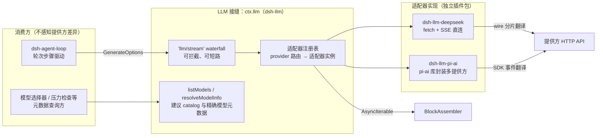
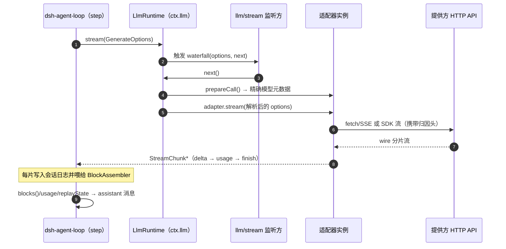
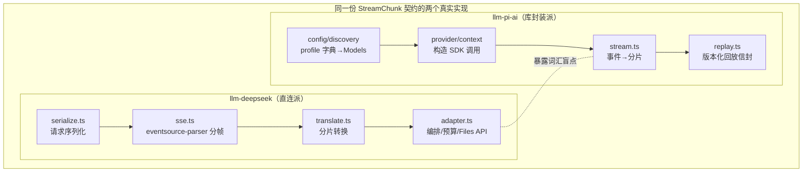

任何 Agent 产品的长期生命力都取决于一个问题的答案：**当出现新的模型提供方时，你需要改动多少核心代码？** DeepSeek Harness 的回答是「零」——提供方差异被压缩进一个可替换的适配器层，而智能体循环、UI 与持久化只依赖一套提供方无关的**流式词汇表**。本页剖析这条接缝的三层结构：共享词汇（`ContentBlock` / `StreamChunk`）、运行时调度（`ctx.llm` 注册表与 waterfall）、以及两个刻意成对的参考实现（直连 HTTP 的 `llm-deepseek` 与库封装的 `llm-pi-ai`），最后给出接入新提供方的最短路径。

## 接缝全景：ctx.llm 与 llm 能力族

整条接缝由 [`packages/llm`](packages/llm/README.zh.md) 下的五个包构成：`llm` 包身兼二职——它既是 **Service Definition**（定义抽象服务与词汇类型），也是消费者角色的服务实现（持有适配器注册表）；提供方适配器是纯插件，通过副作用把路由注册到 `ctx.llm` 上。

| 包 | 职责 | ctx key |
|---|---|---|
| [`llm/`](packages/llm/llm/README.zh.md) | LLM 服务和共享流式词汇 | `ctx.llm` |
| [`token-meter/`](packages/llm/token-meter/README.zh.md) | 可感知回放的 token 测量 | `ctx.tokenMeter` |
| [`llm-retry/`](packages/llm/llm-retry/README.zh.md) | 提供方作用域的重试策略 | 监听 `agent/request-error` |
| [`llm-deepseek/`](packages/llm/llm-deepseek/README.zh.md) | 直接 DeepSeek 适配器 | 注册到 `ctx.llm` |
| [`llm-pi-ai/`](packages/llm/llm-pi-ai/README.zh.md) | 多提供方 pi-ai 适配器 | 注册到 `ctx.llm` |

注意这张表的分层纪律：**重试与 token 计量不是适配器的一部分**，它们是独立的消费者插件——适配器只负责「一次调用即一次提供方尝试」，恢复策略叠加在上层。理解接下来的架构图需要一个前置概念：Cordis 的 waterfall 事件允许监听方包裹甚至短路 `next()`（详见 [事件分发四模式与 Waterfall 环绕中间件语义](6-shi-jian-fen-fa-si-mo-shi-yu-waterfall-huan-rao-zhong-jian-jian-yu-yi)），而每一次流式模型调用都会穿过一条名为 `llm/stream` 的 waterfall：



事件在类型系统中的挂载方式也值得一看：`llm/stream` 通过 Cordis 的模块扩充直接绑定在 `LlmRuntime` 上，监听方调用 `next()` 到达已解析适配器的流，也可以自行 yield 分片来短路整个调用；由循环构建的请求还携带进程本地的冻结标记，监听方只能读、不能改。

Sources: [packages/llm/README.zh.md](packages/llm/README.zh.md#L8-L14)、[index.ts](packages/llm/llm/src/index.ts#L47-L68)

## 词汇层之一：内容块与消息

`ContentBlockMap` 是整套词汇的地基：一段对话由不可变的 `Message` 组成，每条消息的内容是一个按 `type` 判别的**内容块数组**。联合类型从映射接口派生，因此它是**可合并扩展**的——插件可以往里加自己的块类型；但每新增一个核心块，都必须同时落地适配器序列化、UI 渲染和压缩支持三件事，否则就成一个语义上的悬空词。

```ts
interface ContentBlockMap {
  'text': TextBlock          // 可见正文
  'reasoning': ReasoningBlock // 思维链，区别于可见文本
  'image': ImageBlock         // 持久图片附件引用
  'tool-call': ToolCallBlock  // id + name + 原始 JSON arguments
  'tool-result': ToolResultBlock
}
```

模型生成的 assistant 消息在 `source` 中记录生成它的提供方与模型，并可选携带 `replayState`——这段**适配器私有的回放数据**的存在，是后面「历史重编码转发给其他网关」等高层能力的基础。它会跟随消息进入持久日志（[会话日志模型](12-hui-hua-ri-zhi-mo-xing-mo-xing-ke-jian-ji-yi-ji-lu-de-bu-bian-liang-yu-xiao-xi-tou-ying)），并在请求重建时被有条件地交还给适配器。

Sources: [types.ts](packages/llm/llm/src/types.ts#L95-L110)、[docs/subsystems/llm-streaming.zh.md](docs/subsystems/llm-streaming.zh.md#L40-L95)

## 词汇层之二：StreamChunk 流协议

如果说 `ContentBlock` 是存储形态，`StreamChunk` 就是传输形态——适配器唯一被要求输出的东西就是这种分片的 `AsyncIterable`。理解它的两个关键不变量：其一，`index` 把交错到达的增量关联回各自的块；其二，`block-end` 直接携带组装完成的完整块，这意味着**消费方永远不需要自己拼接 delta**。这是一个封闭的可辨识联合，共七种变体：

| type | 关键字段 | 语义 |
|---|---|---|
| `block-start` | `index`, `blockType` | 一个内容块开始，声明其类型 |
| `text-delta` | `index`, `text` | 可见文本增量 |
| `reasoning-delta` | `index`, `text` | 思维链增量 |
| `tool-call-delta` | `index`, `id`, `name?`, `argumentsDelta` | 工具调用增量；参数始终是原始 JSON 字符串片段 |
| `block-end` | `index`, `block` | 组装完成的内容块 |
| `usage` | `usage` | `TokenUsage` 计量，必须先于 `finish` |
| `finish` | `reason`, `replayState?` | 终态分片，此后不得再有任何输出 |

三种「跨实现共同验证」的配套类型值得一提。**FinishReasonMap** 同样是合并扩展的：核心五种 `stop` / `tool-calls` / `max-tokens` / `aborted` / `error`，后两者携带 `LlmFailure` 结构化失败事实。**TokenUsage** 要求各计数互不重叠——`inputTokens` 只含未缓存输入，缓存读写单独报告，计费输入是三者之和；像 DeepSeek 把缓存命中折进单一 `prompt_tokens` 的提供方，适配器要负责把它扣出来。**ReplayEnvelope** 则定义了回放状态的共享切分：一个不透明的响应级半区，加上可选的、与发射块序列一一对齐的逐块半区——对 harness 而言两半都不透明，只有这个「切分本身」是共享词汇，这让组装器能在丢弃某个块时同步裁剪对应位置的条目，而不需要读懂任何元数据。

Sources: [types.ts](packages/llm/llm/src/types.ts#L304-L324)、[types.ts](packages/llm/llm/src/types.ts#L112-L141)、[types.ts](packages/llm/llm/src/types.ts#L283-L302)

## 词汇层之三：一次完整的模型请求

适配器的输入端同样由共享词汇描述。`GenerateOptions` 是一个完全组装好的请求：`provider` 选择适配器实例、`model` 是提供方原样的模型 id、外加消息历史、系统提示词、工具 schema、采样参数与中止信号。其中 `ToolSchema` 特意声明在 dsh-llm 而非工具包——因为「工具长什么样」本质上是每次请求组装的一部分，工具定义的注册与执行属于另一条流水线（[工具注册表、waterfall 把关事件与执行流水线](14-gong-ju-zhu-ce-biao-waterfall-ba-guan-shi-jian-yu-zhi-xing-liu-shui-xian)）。两端的衔接词还包括 `purpose?: 'compaction' | 'session-title'` 这类辅助调用标记，供适配器映射到隐藏的传输元数据。

Sources: [types.ts](packages/llm/llm/src/types.ts#L333-L338)、[types.ts](packages/llm/llm/src/types.ts#L340-L377)

## BlockAssembler：把分片折叠回消息

`BlockAssembler` 是把原始流折叠成最终产物的**唯一共享实现**。使用方式极简：`push()` 逐片喂入，流结束后读取 `blocks()` / `usage` / `finish` / `replayState`，或用 `message(source)` 直接得到冻结的 assistant 消息。它的健壮性规则体现了「防御坏适配器」的思路：容忍只有 delta 没有 start/end 的简化协议；对已被 `block-end` 关闭的索引再到达的 delta 一律忽略，使行为异常的适配器既撑不大内存、也无法污染已完成的块。

两个语义决定尤其关键。第一，**max-tokens 截断会丢弃所有工具调用**——被执行一半的调用不能安全执行；而同一决定会在相同位置裁剪回放数据的逐块条目，保证「保留的块」与「保留的元数据」永不失配。第二，取消中断时 `interruptedBlocks()` 只保留能安全定稿的前缀：闭合与非闭合的非空白文本/推理块；工具调用被排除是因为中断先于派发，保留它就得伪造结果。

Sources: [assembler.ts](packages/llm/llm/src/assembler.ts#L37-L207)、[docs/subsystems/llm-streaming.zh.md](docs/subsystems/llm-streaming.zh.md#L293-L352)

### 与智能体循环的衔接

看一个真实的消费现场就能把两侧串起来。agent-loop 在每个步骤中新建装配器，一边把每个分片以 `assistant/chunk` 事件**原样追加进会话日志**（回放保真度由此而来），一边推入装配器；循环结束后用装配产物构造 assistant 消息并连同 `sourceEventSeqs` 持久化，`replayState` 也在此处落盘。



若 `finish.kind` 是 `error` 或 `aborted`，循环会触发 `agent/request-error` waterfall 寻求重试决策——这正是重试策略插件的挂载点（见下文）；无人接管时才升级为抛出的 `LlmError`。信号中止时则改用 `interruptedBlocks()` 把安全前缀落盘。完整轮次语义不属于本页范围，请移步[轮次流程剖析](11-lun-ci-liu-cheng-pou-xi-turn-step-shi-jian-liu-yu-agent-sheng-ming-zhou-qi-kuo-zhan-dian)。

Sources: [agent.ts](packages/core/agent-loop/src/agent.ts#L343-L399)

## 运行时：注册表、路由原子性与 waterfall 调度

`registerAdapter(providers, adapter)` 的注册语义是严格的：**全有或全无**——任一路由已属于其他适配器即刻抛出 `DUPLICATE_ADAPTER`，不会留下半套注册；空路由集同样拒绝。注册返回的句柄既是随 fiber 释放的 disposer，又带有一个 `replace(providers)` 方法：候选集先整体校验，再在同一同步区段内完成换装，任何请求都观察不到路由缺口；空数组在这里反而合法（配置清空的路由保持注册但零路由），这与初始注册形成刻意的对照。换装的发布点同时广播 `llm/adapters-updated`，让观察者像对待首次注册一样对待替换。

注册时还有两个容易被忽略的捕获动作：适配器的 `providerInfo()` 显示元数据会被校验并深拷贝（id 必须等于路由名）；`providerRetryPolicy()` 返回的策略会在注册时就解析为不可变值，之后任何调用到达该路由都能附带一致的策略快照——即便路由随后被释放，进行中的失败仍持有当时的服务策略。

Sources: [index.ts](packages/llm/llm/src/index.ts#L266-L284)、[index.ts](packages/llm/llm/src/index.ts#L357-L423)、[index.ts](packages/llm/llm/src/index.ts#L432-L448)

### 从调用到终端分片的规范化边界

`stream()` 是唯一的调用入口，它把整个分发包进 `llm/stream` waterfall。真正有趣的是 `adapterStream()` 这一层的**故障规范化边界**：适配器选择、精确模型解析、迭代器构建乃至迭代中途的任何异常，都会被转换为终端的 `finish {kind:'error'|'aborted', failure}` 分片后才暴露给外界；而中间件和下游消费者的异常仍然照常向上抛出。一个辅助函数完成了全部转换逻辑，abort 信号优先归类为 `aborted`：

```ts
function adapterFailureChunk(error: unknown, signal?: AbortSignal): StreamChunk {
  const failure = normalizeLlmFailure(error)
  return {
    type: 'finish',
    reason: signal?.aborted || failure.code === 'ABORTED'
      ? { kind: 'aborted', failure }
      : { kind: 'error', failure },
  }
}
```

同一层还处理两类内容级投影：文本模型收到含图请求时自动降级图片内容；更精妙的是 `forAdapter()` ——历史消息携带的 `replayState` 只有在该历史提供方与目标提供方**当前由同一个适配器实例拥有**时才会原样传递，否则它把 source 剥离成纯粹的身份记录。配合 `prepareCall()` 把精确模型元数据与本次分发绑定为同一个代际（防止设置变更期间新旧能力错配），整个调用路径做到了「异步间隙里注册表怎么变，行为都可预测」。

Sources: [index.ts](packages/llm/llm/src/index.ts#L974-L999)、[index.ts](packages/llm/llm/src/index.ts#L877-L972)、[index.ts](packages/llm/llm/src/index.ts#L1002-L1011)

## 适配器契约：九条协议义务

每个适配器必须遵守以下规则，每类消费方都可以无条件依赖它们。这张清单是「孪生验证」的直接产物——凡两个实现无法同时自然表达的要求，都被视为核心词汇缺陷立即修正。

| `#` | 义务 | 设计原因 |
|---|---|---|
| 1 | `usage` 先于 `finish`，此后不再有任何分片；稳健做法是把两者缓冲到提供方流结束标记统一 flush | 让消费方获得确定的终止条件，兼容末尾纯 usage 分片等怪癖 |
| 2 | 工具参数全程保持原始 JSON 字符串，片段经 `argumentsDelta` 传输；提供方给解析对象就在 `block-end` 时重新 stringify | 存储形态的唯一性（会话日志记什么，模型就看到什么） |
| 3 | 块 `index` 按首次出现顺序分配，同块增量复用 | `BlockAssembler` 折叠与回放裁剪的前提 |
| 4 | 失败仅有两条合法路径：从 `stream()` 抛出（传输/协议故障），或以 `finish {kind:'error'\|'aborted', failure}` 结束 | 共用一个可序列化 `LlmFailure`，两条路径汇合同一分类学 |
| 5 | 一次适配器调用 = 一次提供方尝试，禁用库级重试 | 重试在 agent 层开启新编号轮次，才能保证持久日志可重建 |
| 6 | 遵守 `options.signal`（传给 fetch / SDK），并暴露正有限默认五分钟的 `streamIdleTimeoutMs` 停顿看门狗 | 取消与僵死流的确定性终结 |
| 7 | 无法支持的请求字段（如 `stop`）抛 `UNSUPPORTED` code，绝不静默丢弃 | 防止「看似成功实则偏离意图」的静默降级 |
| 8 | 需要原生元数据回放时，以最小无损 JSON 投影作为 `finish.replayState` 发出，并自行验证历史状态合法性 | 元数据归适配器私有，harness 只保管切分对齐 |
| 9 | 每个提供方 HTTP 请求携带 `attributionHeaders()` 归因头作为 `User-Agent` 基线 | 公开产品身份集中管理，版本取自包清单防漂移，白名单部署传自定义 identity 但无法抑制归因 |

在这个契约之上，聚合出三条机器可路由的规范行为：上下文溢出无论以何种路径抵达都归一化为唯一 code `CONTEXT_WINDOW_EXCEEDED`；无内容的终止性 `stop` 映射为 `EMPTY_RESPONSE` 错误而非虚假的成功消息；身份认证/配额无效等凭据问题共用统一的诊断谓词，且错误信息中永不回显密钥本体。

Sources: [docs/cookbook/adding-an-llm-adapter.zh.md](docs/cookbook/adding-an-llm-adapter.zh.md#L25-L35)、[docs/subsystems/llm-streaming.zh.md](docs/subsystems/llm-streaming.zh.md#L229-L241)、[attribution.ts](packages/llm/llm/src/attribution.ts#L16-L69)、[index.ts](packages/llm/llm/src/index.ts#L138-L155)

## 错误词汇：稳定 code 的机器路由

`LlmError` 扩自仓库统一的 `HarnessError`，构造期就对 status 范围、延迟数值、请求 id 等字段做校验，并把 `failure` 冻结为可序列化负载：`{ message, code, status?, providerRetryAfterMs?, requestId? }`。关键定位在于——这些事实只描述「发生了什么」，**是否重试由策略决定**，错误自身不做决策。两个适配器稳定产出同一套 code 分类，消费方据此路由而非猜测文本：

| code | 典型触发 | 性质倾向 |
|---|---|---|
| `AUTH` | 401/403 | 永久性 |
| `QUOTA` | 配额、余额、点数耗尽详情 | 终止型（与暂时型 RATE_LIMIT 区分） |
| `RATE_LIMIT` | 其余 429 | 暂时型，尊重 `Retry-After` |
| `CONTEXT_WINDOW_EXCEEDED` | 提供 code/type/message 标识溢出的 400，及基于用量与容量的推断 | 触发上游压缩恢复策略 |
| `INVALID_REQUEST` | 其余 400 与 413 请求体超限 | 不应原样重发 |
| `SERVER` / `TRANSPORT` / `TIMEOUT` | 5xx、连接截断、空闲超时与传输建连失败 | 传输层问题 |
| `EMPTY_RESPONSE` | 无内容块的终止性 stop | 默认策略可重试 |
| `NO_ADAPTER` | 路由未注册 | 调用方配置错误 |

重试执行不在本页展开——[`dsh-llm-retry`](packages/llm/llm-retry/README.zh.md) 监听的是 agent 层的 `agent/request-error` waterfall，它**不包装** `ctx.llm.stream()`，因为原始流无法持久区分各次尝试已经发出的分片；代币侧的测量消费方见[上下文工程页](20-shang-xia-wen-gong-cheng-ya-suo-jie-guo-yi-chu-ce-lue-token-ji-liang-yu-ti-shi-ci-pian-duan-zu-zhuang)。

Sources: [index.ts](packages/llm/llm/src/index.ts#L80-L118)、[packages/llm/llm-deepseek/README.zh.md](packages/llm/llm-deepseek/README.zh.md#L104-L104)、[packages/llm/llm-retry/README.zh.md](packages/llm/llm-retry/README.zh.md#L1-L54)

## 目录面：路由之外的三张登记簿

除适配器外，`ctx.llm` 还有三组查询/登记 API，它们共同支撑配置界面在路由不存在时的表达力：

- **`listProviders()`** 列出已有适配器活着的路由；
- **`registerConfigurableProviders()`** 声明插件**可以激活**的休眠路由及其用户设置命名空间，让 Models 页在任何路由注册之前就能呈现「可添加」的提供方条目，配合 `handle.replace()` 支持配置变化的原子刷新；
- **`registerModelDiscovery()` / `discoverModels()`** 回答「这个端点能服务哪些模型？」——这是针对**正在编辑草稿**的一次性询问：请求直接携带端点与凭据而非命名路由，回复是界面可以采纳的候选清单，而不是权威 catalog；点名了已安装 catalog 所覆盖路由的询问甚至完全离线作答。

此外 `listModels()` 返回仅供参考的建议目录（未列出的模型 id 依旧放行，绝不被当作请求校验），而 `resolveModelInfo()` 则是**正确性敏感**的权威解析：上下文容量、请求默认值与推理档位共用这一个确切模型结果，避免各消费方重复实现权威判定——推理强度标识符 core 只加品牌类型，具体档位集合、展示名和部署默认全部由适配器持有。

Sources: [index.ts](packages/llm/llm/src/index.ts#L450-L519)、[index.ts](packages/llm/llm/src/index.ts#L521-L586)、[index.ts](packages/llm/llm/src/index.ts#L602-L652)、[docs/subsystems/llm-streaming.zh.md](docs/subsystems/llm-streaming.zh.md#L400-L503)

## 孪生参考实现：一条契约，两种骨架

为什么维护两个适配器？架构笔记给出的理由值得复述：如果词汇只为单个实现打磨，「提供方无关」就无从验证——假设会默默编码成协议。于是同一份契约从一开始就有**两个刻意不同内部结构**的真实实现：`llm-deepseek` 自行持有 fetch/SSE 翻译逻辑，`llm-pi-ai` 则借道拥有自己事件词汇的第三方库。二者共同的隐含断言是：**凡是无法同时喂饱两个实现的词汇就是缺陷**，当场暴露，而不是拖到下一个提供方接入时。



两者的工程取舍可以通过对比看清：

| 维度 | dsh-llm-deepseek（直连） | dsh-llm-pi-ai（库封装） |
|---|---|---|
| 传输 | 原生 `fetch` + SSE 分帧委托 `eventsource-parser` | pi-ai 通用流式 API，延迟加载各提供方 SDK |
| 路由所有权 | 唯一路由 `deepseek-official`，刻意区别于 pi-ai catalog 名 `deepseek`，可与后者并存 | 以配置字典每个键为路由：catalog 路由、收窄覆盖后的 catalog 路由、或手工声明的私有网关路由 |
| 模型目录 | 配置 `models` 列表整体替换默认三项 | pi-ai 安装 catalog 为底座，`models` 替换、`modelOverrides` 就地整形 |
| 网关兼容 | 天然单协议 | `compat` 开关族补足 pi-ai 对未知端点的形状判断，误设键加载即报错 |
| 工具参数 | 提供方本来给字符串片段，直接透传 | pi-ai 给解析对象，`toolcall_end` 时 `JSON.stringify` 还原为原始字符串 |
| 错误来源 | HTTP 状态与响应体 detail → 稳定 code | pi-ai 流内 error 事件的文本模式分类（上游压扁 cause 的已知缺陷被显式注释追踪） |
| `stop` 序列 | 支持并映射到协议 stop 字段 | `UNSUPPORTED_OPTION` 显式拒绝 |
| 回放状态 | 按 Runtime 门控规则参与 | 版本化信封：响应半区 + 每块 signature，供跨模型/跨提供方原生恢复尝试 |

直连派的 `translate.ts` 最适合用来观察词汇落地：转换器维持每个索引一个开放块，把 finish reason 和最新 usage 都**延迟到 `[DONE]` 哨兵**才统一发出——一次性满足「usage 先于 finish」「finish 后无输出」「兼容尾随 usage 分片」三条义务；首个空的推理分片不开块，避免产生空 reasoning；缓存命中从 `prompt_tokens` 中扣除以满足不相交计量；而无任何开放块的终止性 stop 在此处就地转为 `EMPTY_RESPONSE` 错误。这百余行代码几乎就是适配器契约的 executable 规范。

库封装派的价值则在展示「词汇摩擦面」的真实形状：每一处不得不承认的差异（工具参数表示、错误投递风格、推理 token 计数折叠进输出、`off` 档位省略发送）都在「词汇差异」清单中被显式列为条目——这份清单正是其他潜在适配器的探雷图。

Sources: [.agents/notes/implemented/architecture/2026-06-13-twin-llm-adapters.zh.md](.agents/notes/implemented/architecture/2026-06-13-twin-llm-adapters.zh.md#L11-L28)、[translate.ts](packages/llm/llm-deepseek/src/translate.ts#L31-L186)、[packages/llm/llm-deepseek/README.zh.md](packages/llm/llm-deepseek/README.zh.md#L7-L7)、[packages/llm/llm-pi-ai/README.zh.md](packages/llm/llm-pi-ai/README.zh.md#L151-L165)、[stream.ts](packages/llm/llm-pi-ai/src/stream.ts#L76-L212)

## 动态配置：连接事实不冻结于加载期

两个适配器都遵循同一动态配置范式：连接事实（base URL、catalog、请求默认值、密钥引用）经由一个 thunk **每操作重读一次**，而非在构造期固化。API key 只保存为 `apiKeyEnv` 引用，按次请求通过与端点同一份解析快照解析——「URL 与密钥永远来自同一代际」是明确的抗混淆设计。密钥是空串还是含非法字符、该去哪里修正（Models 页、`.env` 还是 shell 导出），都有专门的诊断文案，且永不回显密钥内容。

DeepSeek 侧还有一处示范了注册句柄的真实用法：嵌套 `retryPolicy` 是唯一在注册期捕获的事实，当其解析值因 settings 变化而改变时，插件就用 `replace()` **原地重注册**该路由——同一适配器实例、一个同步区段，`providerRetryPolicy()` 于是总能报告当前策略，无需拆除重建。

Sources: [index.ts](packages/llm/llm/src/index.ts#L138-L155)、[packages/llm/llm-deepseek/README.zh.md](packages/llm/llm-deepseek/README.zh.md#L83-L85)、[packages/llm/llm-pi-ai/README.zh.md](packages/llm/llm-pi-ai/README.zh.md#L137-L149)

## 接入新提供方：操作路径

综合以上，接入一个新提供方只触碰五个文件组织层面的决策，`.zh` 手册给出的基本形态如下：

```ts
class MyAdapter extends LlmAdapter {
  async *stream(options: GenerateOptions): AsyncIterable<StreamChunk> { … }
}

export const name = 'llm-myprovider'
export const inject = ['llm']
export const Config: z<Config> = z.object({ apiKey: z.string(), … })

export function apply(ctx: Context, pluginContext: Context) {
  ctx.llm.registerAdapter(['my-provider'], new MyAdapter(…))
}
```

步骤分解：

1. **读懂词汇源码**——先读 `packages/llm/llm/src/types.ts` 中 `StreamChunk` 的完整文档注释，它是契约的真源。
2. **实现适配器类**——唯一必选方法是 `stream()`；确切的模型元数据走提供方无关的 capability seam：实现 `resolveModel()` 返回身份与可选的容量/推理信息。提供方特有的思考模式开关放在你自己的 Config schema 里，不要污染核心词汇。
3. **声明插件形态**——导出 `name` / `inject: ['llm']` / zod `Config` / `apply` 四件套；重复注册同一路由会得到 `DUPLICATE_ADAPTER`，注册基于副作用，天然支持 HMR。
4. **需要设置界面时**——额外调用 `registerConfigurableProviders()` 声明休眠路由及其 settings namespace，必要时提供 `registerModelDiscovery()` 支持端点询问。
5. **拆分与验证**——协议格式类型、请求序列化、传输解析、分片转换、适配器类各自独立成模块（`llm-deepseek` 即此布局）；测试遵循仓库测试体系（[测试体系：testkit、LLM 回放/模拟与覆盖门禁](28-ce-shi-ti-xi-testkit-llm-hui-fang-mo-ni-kuai-zhao-yu-duan-dao-duan-fu-gai-men-jin)），覆盖义务条款时可参照两兄弟各自的 mock-server 与 e2e 形态。

Sources: [docs/cookbook/adding-an-llm-adapter.zh.md](docs/cookbook/adding-an-llm-adapter.zh.md#L7-L44)

## 收束：这条接缝设计的三条启示

回到开篇的问题，这套设计的可迁移经验有三条。**词汇先于实现**：`ContentBlockMap` / `StreamChunk` 这样的类型层面契约，让「支持新提供方」从一个核心改造问题降维成一个叶子包问题，甚至 Subagent 的多提供方注册也在复用同一套路由机制（[Subagent 委托、多提供方注册与实验性 Agent 团队](18-subagent-wei-tuo-duo-ti-gong-fang-zhu-ce-yu-shi-yan-xing-agent-tuan-dui)）。**契约会自我进化**：两个异构参考实现的持续对账，把词汇缺陷的发现成本摊薄到日常开发而非事故时刻。**能力归能力、策略归策略**：适配器只做「一次真实的尝试」，重试、压缩、计费估计全部是独立的 seam 消费者——这样的切分使得每一层都能独立测试、独立替换、独立审计。具备 ToolSchema 视角的读者可继续深入工具把关流水线；想看这些分片如何在 UI 上逐字渲染，Web 双半侧架构页提供了下一站。