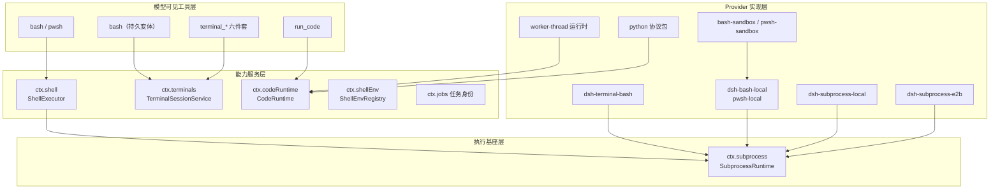
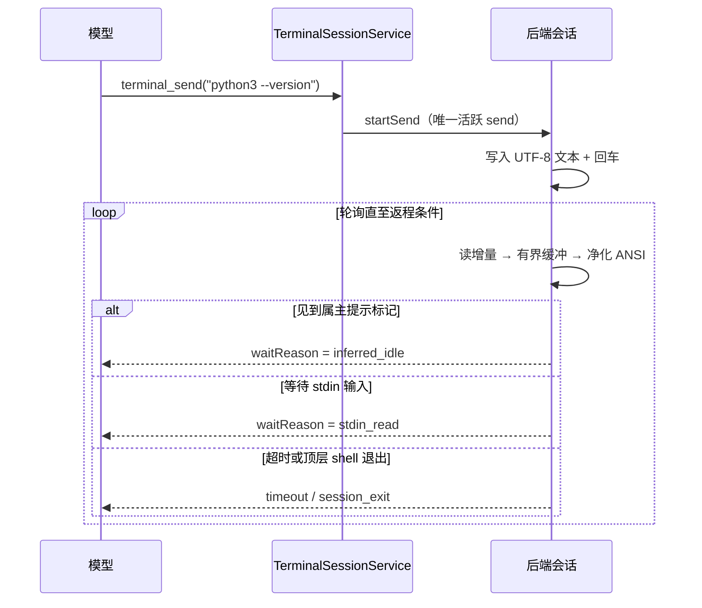

本文深入 DeepSeek Harness 中负责**让模型驱动外部世界执行**的四个能力子系统：子进程接缝（`ctx.subprocess`）、Shell 执行接缝（`ctx.shell`）、持久终端 PTY 会话族（`ctx.terminals`）与代码运行时接缝（`ctx.codeRuntime`）。这四者并非孤立的功能模块，而是同一个"能力接缝"设计模式在不同抽象层级上的四次展开——从最底层的进程树托管，到面向模型的命令行工具、交互式终端会话，再到让模型以编程方式调用工具的运行时沙箱。理解它们的分层方法是一致的：先看 Service Definition 定义了什么契约，再看 Provider 如何兑现契约，最后看 Consumer 工具层如何把它翻译成模型可见的能力。

Sources: [subprocess.md](docs/subsystems/subprocess.md#L1-L10), [shell.md](docs/subsystems/shell.md#L1-L10), [terminal.md](docs/subsystems/terminal.md#L1-L10), [code-runtime.md](docs/subsystems/code-runtime.md#L1-L10)

## 能力族的分形结构：一条接缝模式的四次实现

Harness 的[能力接缝](capability-seams.md)模式要求每个能力都拆分为 **Service Definition**（声明服务接口与语义不变量的抽象包）、**Service Provider**（兑现接口的具体实现包）和 **Consumer**（消费服务的工具或插件包）。进程执行能力族将这一模式叠加为四层金字塔：

注意图中的两条关键依赖边：Shell 执行器与 PTY 后端都不直接调用 Node 的 `child_process` 或 `node-pty`，而是统一经过子进程接缝；这使得 "在本地跑" 与 "在 E2B 云沙箱里跑" 对上层完全透明。每个接缝都有一个权威的子系统文档页记录跨包词汇表，本节之后的四段分析均以源码验证其内容。

Sources: [index.ts](packages/subprocess/subprocess/src/index.ts#L70-L96), [index.ts](packages/shell/bash-local/src/index.ts#L1-L9), [session.ts](packages/terminal/terminal-bash/src/session.ts#L1-L7), [code-runtime.md](docs/subsystems/code-runtime.md#L1-L5)

| 能力族 | ctx 服务键 | 抽象定义包 | 主要 Provider | 面向模型的工具 |
| --- | --- | --- | --- | --- |
| 子进程 | `subprocess` | dsh-subprocess | dsh-subprocess-local、dsh-subprocess-e2b | （无直接工具，供上层组合） |
| Shell | `shell` | dsh-shell | bash-local/bash-sandbox、pwsh-local/pwsh-sandbox | `bash`、`pwsh` 及持久变体 |
| 持久终端 | `terminals` | dsh-terminal | dsh-terminal-bash 后端 | `terminal_open/send/read/signal/close/list` |
| 代码运行时 | `codeRuntime` | dsh-code-runtime | worker-thread 实现（Python 协议在建） | `run_code`（Code Mode） |

Sources: [index.ts](packages/subprocess/subprocess/src/index.ts#L30-L40), [index.ts](packages/shell/shell/src/index.ts#L29-L44), [index.ts](packages/terminal/tool-terminal/src/index.ts#L160-L386), [code-mode.ts](packages/core/tools/src/code-mode.ts#L20)

## 子进程接缝：全显式的进程原语

`SubprocessRuntime` 是整个能力族的基座，其核心纪律是**"接缝不施加任何默认值"**：`SubprocessSpawnSpec` 要求调用方逐项写明 argv、工作目录、每条流的 stdio 处置方式、宽限期与环境变量——决定权属于调用方自己的配置，而不是一个隐藏的子进程服务默认。`argv` 在这一层永远不做 shell 解释，shell 语义是上一层的职责。

Sources: [types.ts](packages/subprocess/subprocess/src/types.ts), [subprocess.md](docs/subsystems/subprocess.md#L88-L92)

两个安全卫生规则值得单独强调。其一，**凭据擦洗**：正则 `/KEY|PASSWORD|SECRET|TOKEN/i` 命中的环境变量名不会被隐式转发给子进程（Harness 自己的 API 密钥不会泄漏到被生成的进程里），所有仓库内生成器共享这一个启发式；导出的 `scrubbedParentEnv()` 函数同时剔除凭据形状名字与全部 `DSH_*` 名字，供无法走服务路由的生成器（如 node-pty 后端）复用同一份擦洗定义。其二，**托管环境命名空间**：`DSH_*` 变量是 Harness 拥有的子进程事实，环境感知的名字会被丢弃，只有通过 spec 显式 `env` 条目合并进来的字符串才算数——显式条目合并发生在擦洗之后，因此刻意转发的凭据也能存活。

Sources: [index.ts](packages/subprocess/subprocess/src/index.ts#L23-L58)

**stdio 处置**是三种形态的笛卡尔选择：stdin 支持 `'ignore'`/`'pipe'`/一次性 `{ data }` 批量写入；stdout/stderr 支持原始 `'pipe'`（协议分帧用，如 LSP 的 JSON-RPC、ACP 的 ndjson）、`'inherit'`（诊断直通父流）或收集模式对象。收集模式是这套设计的精妙处：内存中只保留流的**尾部**（按字节上限），溢出时可选地把完整流落到 spill 文件供事后恢复，于是"语言服务器 stderr 只要个尾巴"与"bash 工具要完整可恢复输出"两种消费者形状共用同一原语。

Sources: [subprocess.md](docs/subsystems/subprocess.md#L46-L86)

spawn 返回的句柄立即存活：collect 流的读取器基于**整流字节偏移**且不消耗数据，独立读取器互不偷取增量，进程退出后仍可读取；而 terminate 是唯一终止动词，在每个平台上都是**进程树级**的——POSIX 向脱离的进程组发信号，Windows 走 `taskkill /T`——并以 SIGTERM→宽限期→SIGKILL 升级保证辅助进程无法悄悄幸存。结算时 `done` 只携带 Node close 事件词汇（exitCode/signal），**故意不带超时或取消分类**：超时截止信号归调用方拥有（例如 Shell 执行器的 timedOut/aborted 区分），由调用方读自己的信号来归类原因。责任边界在此清晰切开。

Sources: [subprocess.md](docs/subsystems/subprocess.md#L214-L246)

第三个方法是 `spawnTerminal(spec)` ——**唯一的非管道进程原语**。实现方拥有终端分配、UTF-8 文本传输、前台进程组检查与信令，以及一次 await 到底的 TERM-to-KILL 清理操作；就绪检测与持久 shell 策略则留在 PTY 消费方。本地实现包裹了打过补丁的 node-pty（补丁解决嵌入式运行时下 spawn-helper 的定位问题），并用平台专属的进程检查器追踪后代进程。

Sources: [index.ts](packages/subprocess/subprocess/src/index.ts#L128-L133), [terminal.ts](packages/subprocess/subprocess-local/src/terminal.ts#L42-L60), [node-pty@1.2.0-beta.15.patch](patches/node-pty@1.2.0-beta.15.patch#L1-L33)

云沙箱方向有对称的第二实现：`E2BSubprocessRuntime` 同样继承抽象类注册为 `ctx.subprocess`，但每个句柄经由共享 E2B 沙箱启动，输出与状态路径留在远端世界，用轮询控制面代替本地进程事件——对消费方而言，唯一的差别只是 grace 上限等同样的契约校验换成远程等价物。

Sources: [index.ts](packages/e2b/subprocess-e2b/src/index.ts#L1-L11), [index.ts](packages/e2b/subprocess-e2b/src/index.ts#L52-L77)

## Shell 接缝：请求/规范分离与正交结果字段

Shell 接缝的一个标志性构造是 **resolve() 分离**：模型/插件侧提交的 `ShellExecRequest` 里 workdir、timeoutMs、stdoutMaxBytes 都是可选项，交给实现的配置去填充与封顶；执行器真正行动的对象则是必填齐全的 `ShellExecSpec`。工具层在两者之间调用 `ctx.shell.resolve(request)`——这是仓库"请求 vs 规范"惯用法的归属模板。同样重要的是暴露面的克制：`stdin`、`env` 与 `stdoutMaxBytes` 只开放给可信的进程内插件（hooks 桥接器用它们写 hook JSON 载荷、注入 `CLAUDE_PROJECT_DIR` 等），面向模型的 bash 工具一律不透出这些参数。

Sources: [shell.md](docs/subsystems/shell.md#L18-L47), [shell.md](docs/subsystems/shell.md#L78-L80)

前台运行的结局载体 `ShellRunResult` 体现了防御性模式的**正交结果独立报告**原则：进程完全可能既超时又以退出码 0 结束（因为它捕获了终止信号），所以 exitCode、signal、timedOut、aborted 各自独立成字段；且由于超时截止与调用方取消共享同一融合时限，二者竞速只会报告**第一原因**，绝不会同时为真。

Sources: [shell.md](docs/subsystems/shell.md#L122-L156)

后台路径上，`start()` 返回无 id 无归属的 `ShellProcess` 句柄——job 身份不属于执行器，通用任务运行时才拥有 id、轮询与通知；工具层把句柄适配进 `ctx.jobs.start()` 钩子。句柄的 `done` 永不 reject（生成失败也落为 killed 加 stderr 错误文本），`readOutput()` 增量交付且连续读取绝不重复。生命周期有一条微妙边界：仍在运行的后台进程会在其**所属组合销毁**时被停止并 join——这个边界是子进程接缝的服务处置，因此后台进程可以熬过一次仅执行器层的重载。

Sources: [shell.md](docs/subsystems/shell.md#L198-L232), [background.ts](packages/shell/tool-bash/src/background.ts#L17-L28)

具体实现上，`LocalBashExecutor` 以 `bash -c` 经 `ctx.subprocess` 托管进程组运行命令，自己只负责命令默认值、截止时间与原因分类、以及一套模型友好的终端环境覆盖（`NO_COLOR=1`、`TERM=dumb`、`PAGER=cat`、`GIT_PAGER=cat`，防止颜色码与分页器毁掉工具输出）；有界输出、spill 文件与进程组升级机制全部下沉到子进程服务，执行器只按次提供配好预算的 spec。配置默认值同样经过校验把关（存进设置文档的非法值会在写入点被拒绝而非在下一条命令时爆炸）：默认前台超时 120 秒、上限 600 秒、单流内存上限 64 KB、spill 上限 64 MB、宽限期 3 秒。

Sources: [index.ts](packages/shell/bash-local/src/index.ts#L23-L37), [index.ts](packages/shell/bash-local/src/index.ts#L120-L135)

环境事实的表达走另一条接缝 `ctx.shellEnv`：这是一个受信 `DSH_*` 变量注册表，每次模型 shell 调用都会重建命名空间——内置事实（`DSH_HOME`、`DSH_SHELL`、`DSH_SESSION_ID` 等保留键）由注册表自己拥有，插件可以贡献额外变量并随其 fiber 作用域注销；执行器先丢弃环境里的 `DSH_*` 再注入当前快照，确保过期的陈旧事实无法从 Harness 进程继承下来。工具描述文本也会引导模型在需要时主动检查 `$DSH_*` 变量。

Sources: [index.ts](packages/shell/shell-env/src/index.ts#L60-L100), [index.ts](packages/shell/tool-bash/src/index.ts#L85-L95)

模型可见层的 `bash` 工具每 call 一个新 shell、状态零持久，非零退出报告为 `[exit code: N]`，长输出截尾并告知完整输出的保存路径；后台调用立即返回任务 id，用配套的任务工具收数或叫停。工具还内置了**沙箱升级话术**：被文件沙箱拒绝的操作报告 `[sandbox: file access denied under <mode> mode]` 并提示这是策略拒绝而非命令缺陷，模型可在同轮内以 `sandbox_permissions` 加一句话 justification 重试同一条命令发起一次用户审批——这条窄门是拒绝的唯一豁免通道。（沙箱后端的强制机制本身属于下一章的主题。）

Sources: [index.ts](packages/shell/tool-bash/src/index.ts#L80-L101)

Windows 平台存在逐行的 PowerShell 孪生实现：`pwsh-local` 提供同名 resolve/run/start 契约，`pwsh-sandbox` 继承之并经 ACL 类沙箱包装。由于一个宿主组合恰好挂载一个 `ctx.shell` 提供者（重复注册会响亮失败），shell 设置命名空间归属抽象层而非任一执行器家族，让跨平台的设置文档在两边都能解析。

Sources: [index.ts](packages/shell/pwsh-local/src/index.ts), [index.ts](packages/shell/shell/src/index.ts#L15-L27)

## 持久终端 PTY：会话所有权与就绪检测

前两族处理的是"一发一收"的批式执行；PTY 族回答的问题是：如何让模型安全地持有**跨越多次工具调用的交互式会话**（vim、REPL、gdb、需要 stdin 的安装器）。答案是所有权严格化的注册表服务 `TerminalSessionService`：会话 id 由服务铸造（`pty-N` 品牌 ID），授权比较的是确切的 owning Agent 而非名字或猜测的 id；外来操作得到 `FOREIGN_SESSION` 错误码族之一的机器可路由失败；await 过的清理函数挂在所有者的精确 scope 上，owner 消亡即回收；PTY 原始字节保持进程本地，但模型输入与有界返回输出经由现有的持久化通道成为可恢复事实。

Sources: [index.ts](packages/terminal/terminal/src/index.ts#L140-L200), [terminal.md](docs/subsystems/terminal.md#L176-L185)

终端机制下沉到**可替换后端**：`TerminalBackend` 只需实现按类型字符串注册的 `spawn(spec)`，成功后才发布会话，失败则清理残留资源（清理本身失败另有专用错误类型上报）。每个活跃会话同时只允许**一个排他的 send 操作**；send 的返回原因与顶层 shell 存活状态是两个独立维度——静默、超时都可能返程而 shell 仍活着，只有 `session_exit` 表示顶层 shell 本身退出了：

Sources: [types.ts](packages/terminal/terminal/src/types.ts), [terminal.md](docs/subsystems/terminal.md#L26-L56)

首发后端 `dsh-terminal-bash` 把上述抽象落在子进程接缝的 `spawnTerminal` 原语上。它的就绪检测方案有两个巧思：一是**属主提示标记**——child 环境把 `PS1` 固定为受控串 `dsh> `，并用 `PROMPT_COMMAND` 在每次渲染提示前先发射 OSC-133 序列打印上一命令的退出码，随后再重申 PS1，这样即使某条命令覆写了 shell 的 PS1 变量，下一次提示前的重申依然让就绪探测活着；二是**流式净化器**——跨 chunk 解析并剥除 CSI/OSC 转义序列（保留半截序列的进位状态），只在见到属主标记时判定一轮输入结束。输出端用双向有界缓冲（字节+可选行数上限）保住 scrollback 的尾部而不失截断事实。

Sources: [index.ts](packages/terminal/terminal-bash/src/index.ts#L65-L81), [sanitize.ts](packages/terminal/terminal-bash/src/sanitize.ts#L1-L36), [session.ts](packages/terminal/terminal-bash/src/session.ts#L43-L70)

PTY 与沙箱策略之间有一条专门的围栏：backend 监听所有者的会话事件流，只要该 owner 存在已发布或在途创建的 PTY 会话，就把 `sandbox/mode` 变更直接抛错——持久终端已经打开的任意交互状态无法可靠地迁移到另一个沙箱档位，所以索性别迁。

Sources: [index.ts](packages/terminal/terminal-bash/src/index.ts#L31-L63)

模型接口是六个工具：`terminal_open`（按后端类型建会话）、`terminal_send`（写文本并等待就绪，默认回车提交）、`terminal_read`（翻页读 scrollback）、`terminal_signal`（向经验证的前台进程组递送允许列表内的信号，SIGKILL 因太危险被排除在外）、`terminal_close` 与 `terminal_list`。`terminal_send` 还支持后台化：立即返回任务 id，发送操作作为 `pty-send` 种类的任务交给 `ctx.jobs` 收集，取消走任务的取消通道。

Sources: [index.ts](packages/terminal/tool-terminal/src/index.ts#L162-L230), [index.ts](packages/terminal/tool-terminal/src/index.ts#L264-L290)

同族还有一个有意思的适配层：`tool-bash-persistent` 提供**单个名叫 `bash` 的工具**，但底层复用的正是 PTY 接缝。它给每条命令包一层 nonce 标记（随机 UUID 构成的 start/end 哨兵，printf 打印后 eval 执行并回报退出码），从 scrollback 快照里切出这段命令的真实输出——对外呈现"状态跨调用持久的 bash"，对内享受 owner 隔离、有界缓冲与属主检测的全部基建，且同一 owner 的命令经队列串行化避免交叉污染。

Sources: [index.ts](packages/shell/tool-bash-persistent/src/index.ts#L79-L101), [index.ts](packages/shell/tool-bash-persistent/src/index.ts#L395-L458)

## 代码运行时：把"执行模型写的程序"做成接缝

第四族处理的命题最抽象：让模型写一段程序、拿到宿主提供的异步绑定、整段跑完再收回 JSON 结果——也就是把"多次工具往返"折叠成"一次程序执行"。`CodeRuntime` 契约的第一条纪律是**错误是结果字段而不是异常路径**：失败的程序由调用方负责呈现，`run()` 只在服务契约误用时才 reject。失败分类同样是正交独立的六元组：`exception`（抛错或解析失败）、`timeout`(实现拥有的预算到期)、`abort`（调用方信号）、`worker-exit`（基底死亡，如 OOM）、`invalid-output`（完成值不是无损 JSON）、`output-limit`（序列化输出超帽）。

Sources: [code-runtime.md](docs/subsystems/code-runtime.md#L21-L72), [code-runtime.md](docs/subsystems/code-runtime.md#L130-L168)

契约中最讲究的部分是**可移植标识符承诺**：绑定命名空间的全局名必须匹配语言中立子集 `[A-Za-z_][A-Za-z0-9_]*` 且避开每一种目标语言的保留字——不是"本语言碰巧没撞"，而是"在一个后端合法的名字列表在所有后端都合法"。为此接缝级导出了三份共享集合：每个后端都要拒绝的绑定全局名（`console`、`__dsh_main__`、`__builtins__`、`__name__`、`__debug__`——有的是某个后端拥有槽位，有的像 `__debug__` 干脆因为 CPython 编译期常量化而注入不可达），每个后端都要拒绝的错误成员名（JS Error 三件套加上 Python 异常协议成员，dunder 形态整体拒绝），以及 ECMAScript ∪ Python 的联合保留字表。扩展新语言意味着加宽这份并集并对既有绑定名做一次破坏性审查——这是有意为之的成本。

Sources: [index.ts](packages/code-runtime/code-runtime/src/index.ts#L23-L107)

绑定桥接规则同样双严：参数与决议值必须是无损 JSON，命名空间以 null 原型构造（模型写到 `constructor`、`__proto__` 这样的键也只能命中普通自有属性，永远不会撞上原型链上的真实可调用体）；宿主把 worker 端口流量当作敌意输入对待，逐字段重建后再解析，垃圾帧静默丢弃——宿主的 message 监听器若因畸形消息抛错就是宿主进程崩溃，所以宁可丢帧。

Sources: [index.ts](packages/code-runtime/code-runtime-worker-thread/src/index.ts#L144-L150), [index.ts](packages/code-runtime/code-runtime-worker-thread/src/index.ts#L468-L500)

已发布的 TypeScript 后端 `dsh-code-runtime-worker-thread` 的隔离观很诚实——JSDoc 第一行就写明这是**容器化而非安全边界**：程序里的模型代码享有与 bash 等价的信任度，尽管它面对的是空环境（`env: {}`，比生成命令还要彻底）、清空的 execArgv、老生代堆帽。它的预算体系是三层时间学的：`computeMs` 计算预算读 worker 自己测得的事件循环忙碌时长（每 25ms 采样 ELU），于是热循环必然耗尽预算而在慢绑定上等待的程序分文不计——公平且无法作弊；`maxWallMs` 挂钟天花板兜底"等待一个永远不会 resolve 的 promise"这类忙碌计时看不见的情况；堆溢出杀掉 worker 浮出为 `worker-exit`。

Sources: [index.ts](packages/code-runtime/code-runtime-worker-thread/src/index.ts#L1-L48), [index.ts](packages/code-runtime/code-runtime-worker-thread/src/index.ts#L376-L388), [index.ts](packages/code-runtime/code-runtime-worker-thread/src/index.ts#L536-L555)

程序的接入方式利用了 Node 原生的类型剥离：程序源以位置保持的方式被包进 async 函数体外壳再剥离类型——删除的语法变成空白、行列坐标不漂移，所以错误信息里报给模型的还是它自己的行号。编译期有一处针对 CPython 行为的注释值得玩味：bare `__debug__` 引用在 Python 里编译为常量 True，赋值直接编译期报错，这正是用共享集合提前堵死的原因。

Sources: [index.ts](packages/code-runtime/code-runtime-worker-thread/src/index.ts#L90-L98)

Python 方向目前是一个纯粹的协议包：版本无关的 fd-3 线缆协议、宿主侧编解码器与敌意帧校验器从此处再导出，CPython 子进程后端尚未上线——这与 CodeRuntime JSDoc 中"只有 TypeScript 有已发布的后端"的表述互相印证，也让任何未来实现无从私改线缆格式。

Sources: [index.ts](packages/code-runtime/code-runtime-python/src/index.ts#L1-L20)

Code Runtime 的主消费者是**Code Mode**：工具注册表在 `tools.mode` 配置为 `code` 时只向模型暴露一个线上工具 `run_code` 加一份自动生成的 SDK 提示章节，模型具名调用其他任何工具都会失败——这是系统提示词里明说的单向阀；`both` 模式则两套并存。`language` 描述符是非门控的信息位：SDK 渲染器按加载到的运行时语言查表切换 TypeScript 或 Python 风味的 schema 文案，缺失渲染器的语言在组装期响亮失败。这份三处平行编辑的语言扩展清单（union 成员、查表项、flavor 表）由 satisfies 子钉死——漏掉任何一个都是 typecheck 失败。

Sources: [index.ts](packages/core/tools/src/index.ts#L648-L670), [index.ts](packages/core/tools/src/index.ts#L30-L59), [code-mode.ts](packages/core/tools/src/code-mode.ts#L278-L306)

## 组合挂载：能力族如何进入真实部署

最后看装配。dsh-base 组合补丁按平台门控挂载这套能力：`dsh-subprocess-local` 无条件常驻；`dsh-bash-sandbox` 在 win32 上禁用、`dsh-pwsh-sandbox` 仅 win32 启用，`tool-bash` 与 `tool-pwsh` 同步镜像这一布尔取反——这就是抽象层注释所说的"win32 层把 POSIX 行换成 pwsh 行"机制的实体：双方可能都被列入清单，但每台机器实际激活的恰是一个 `ctx.shell` 提供者。`shell-env` 注册表与后台任务工具也在此层常驻。

Sources: [cordis.patch.yml](packages/bundle/base/cordis.patch.yml#L163-L219)

Code Mode 与 PTY 则是显式选装的叠加补丁示例：headless 应用补丁插入 worker 线程运行时并把 `tools.mode` 接到 `DSH_TOOLS_MODE` 环境变量；acp-agent 示例仓库的两个 overlay 分别演示了完整 PTY 三件套（注册表 + bash 后端 + 六工具，附带调优过的探测节奏参数）与 Code Mode 二件套（mode 切换 + 运行时插入）。三个家庭的全部开关都收敛在这几行 YAML 里——这正是接缝模式红利的直观展示：**替换一种执行世界（本地→云沙箱）、切换一种 shell 方言、换掉一个代码后端，工具层与服务契约纹丝不动**。

Sources: [cordis.patch.yml](packages/bundle/headless/cordis.patch.yml#L12-L35), [pty.cordis.yml](examples/acp-agent/pty.cordis.yml#L1-L22), [code-mode.cordis.yml](examples/acp-agent/code-mode.cordis.yml#L19-L29)

---

**延伸阅读建议**：沙箱模式如何在进程级强制（bwrap/Landlock/Seatbelt）请继续阅读[沙箱策略后端（bwrap/Landlock/Seatbelt）与 Landlock 原生限制启动器](17-sha-xiang-ce-lue-hou-duan-bwrap-landlock-seatbelt-yu-landlock-yuan-sheng-xian-zhi-qi-dong-qi)；本文反复出现的 waterfall 把关与工具注册机制详见[工具注册表、waterfall 把关事件与执行流水线](14-gong-ju-zhu-ce-biao-waterfall-ba-guan-shi-jian-yu-zhi-xing-liu-shui-xian)；后台任务身份与 job_output/job_kill 工具的完整语义见[后台任务与编排：jobs 运行时、定时调度、工作流引擎与目标追踪](22-hou-tai-ren-wu-yu-bian-pai-jobs-yun-xing-shi-ding-shi-diao-du-gong-zuo-liu-yin-qing-yu-mu-biao-zhui-zong)。