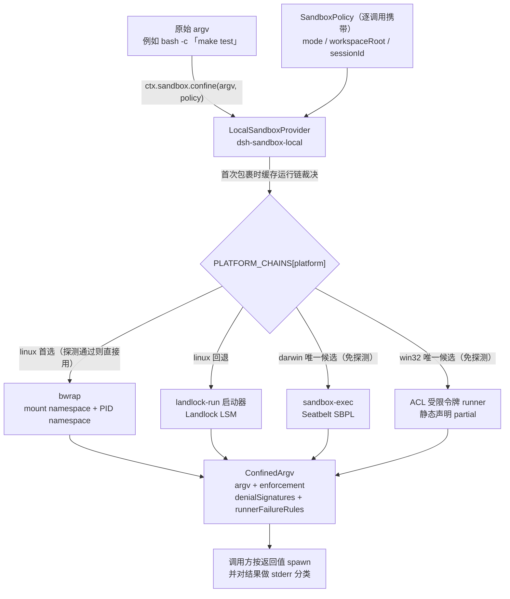
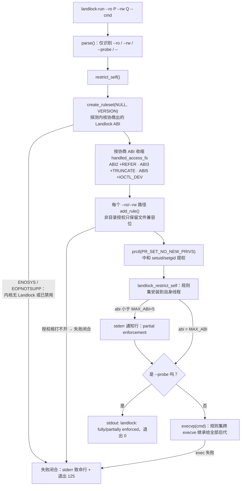

本页剖析 dsh 的进程沙箱执行层：`@deepseek-ai/dsh-sandbox` 定义的接缝词汇、`@deepseek-ai/dsh-sandbox-local` 如何在 Linux（bwrap → Landlock）、macOS（Seatbelt）与 Windows（ACL 受限令牌）上选择并驱动运行器，以及配套原生启动器 `landlock-run`（约 300 行 C11、静态链接 musl、基于内核 UAPI 的「先限制自身、再 exec」工具）的设计与 CLI 契约。策略的会话级解析与审批提权流不在本页展开——前者属于沙箱策略服务自身的职责面，后者归入人机协作平面。

## 一个接缝、两个服务、四个方言

沙箱家族由三个包构成一个「同世界」强制接缝：共享宿主内核与文件系统的子进程 argv 在被 spawn 前先经过包装。`@deepseek-ai/dsh-sandbox` 只定义类型与抽象服务——它明确声明容器、microVM 与远程执行不是这个接缝的范围；`@deepseek-ai/dsh-sandbox-policy` 是模式默认值与会话 cwd 边界的唯一归属地；`@deepseek-ai/dsh-sandbox-local` 则注册为 `ctx.sandbox` 提供方，负责平台运行链选择、一次性功能探测与每次包裹的方言报告。

抽象服务只有一个方法：`confine(argv, policy)` 接收调用方*即将* spawn 的精确 argv（shell 形态的消费方传 `['bash', '-c', command]` 而非 shell 字符串），返回替代执行的包裹 argv 加强制事实；契约要求失败闭合——要么返回真正约束的 argv，要么抛错，**静默放行未经约束的原 argv 被明文禁止**。

Sources: [index.ts](packages/sandbox/sandbox/src/index.ts#L1-L11)、[index.ts](packages/sandbox/sandbox-local/src/index.ts#L1-L18)、[index.ts](packages/sandbox/sandbox/src/index.ts#L125-L179)

## 策略词汇表：三种文件效果模式与强制完整性

`SandboxMode` 是闭集的三值词汇，且只管控**文件系统效果**——网络与进程可见性刻意留在词汇之外：

| 模式 | 允许写入 | 消费方行为 |
|---|---|---|
| `read-only` | 仅必需 sink（如 `/dev/null`） | 走 `ctx.sandbox.confine()` |
| `workspace-write` | workspace root + 后端定义的临时区 | 走 `ctx.sandbox.confine()` |
| `danger-full-access` | 不受限 | 直接 spawn 原 argv，不触碰提供方 |

只有前两种受约束模式能被装进 `SandboxPolicy` 发给提供方（`ConfinedSandboxMode = Exclude<SandboxMode, 'danger-full-access'>`）；`danger-full-access` 的消费方绕过整个接缝——bash 执行器的 `run()/start()` 对该模式直接走本地执行器并短路返回。

Sources: [index.ts](packages/sandbox/sandbox/src/index.ts#L17-L23)、[index.ts](packages/shell/bash-sandbox/src/index.ts#L88-L94)

强制完整性是后端上报的**事实**而非承诺：`full` 表示活跃后端管控了该模式下全部文件效果；`partial` 表示活跃后端或较旧的内核 ABI 只能管控其中一个子集，要求绝对边界的消费方必须拒绝或向上暴露这一差别。下文会看到四个后端里三个声称 `full`，唯独 Windows ACL runner 因受限令牌机制必须保留 Everyone 组而静态声明 `partial`。

Sources: [index.ts](packages/sandbox/sandbox/src/index.ts#L46-L51)、[index.ts](packages/sandbox/sandbox-local/src/index.ts#L168-L187)

## 逐调用 SandboxPolicy 与一次性的运行链裁决

完整策略（含 `danger-full-access` 的三值形态 `SandboxExecutionPolicy`）带着 `mode`、绝对化的 `workspaceRoot` 和可选 `sessionId` **按每次能力调用解析并传递**，而不是钉死在提供方上。这使同一时刻两个消费方可以在不同边界下各自约束（bash 在 `read-only` 下执行、子代理却需要状态目录可写），也使批准后的提权重试天然是一次更宽策略的新调用。

Sources: [index.ts](packages/sandbox/sandbox/src/index.ts#L24-L44)

与之相对，**运行器的选择是 provider 生命周期内一次性的**：`selectRunner()` 把链裁决缓存在 `selectedRunner` 私有字段里，首个受限包裹触发时确定，此后每次 `confine()` 复用同一裁决——策略随调用变化，选中哪个内核机制却不随调用变化。

Sources: [index.ts](packages/sandbox/sandbox-local/src/index.ts#L485-L496)

## 平台运行链：先按平台选型，再用功能探测仲裁

运行链的选择规则是「**先按平台、再探测**」：每个平台的候选列表按偏好顺序排列，但功能探测只在链上存在**多于一个**候选时才发生——探测用于仲裁竞争者，而不是重新验证别无选择的唯一项。

| 平台 | 运行链（优先序） | 探测方式 |
|---|---|---|
| linux | `bwrap` → `landlock` | 两级都做真实功能探测 |
| darwin | `seatbelt`（唯一候选） | 产品路径免探测 |
| win32 | `windows-acl`（唯一候选） | 产品路径免探测 |

Linux 之所以把 bwrap 排在前面，是因为它的挂载 profile 与模式词汇最贴近；Landlock 启动器作为回退，专门服务于 bwrap 不可用的宿主（未安装、非特权 user namespace 被禁用、LSM 拒绝 mount 等——Landlock 是独立的系统调用族，不依赖这些设施）。

Sources: [index.ts](packages/sandbox/sandbox-local/src/index.ts#L150-L166)、[main.c](native/landlock-run/packages/entry/src/main.c#L1-L29)

Linux 链上的每一级都做**真实功能探测**而非版本检查：bwrap 探测在 `--ro-bind / /` 构成的真实只读 profile 下跑 `true`；Seatbelt 探测用真正的 `read-only` profile 过一遍 `sandbox-exec -p ... true`（Apple 已标记该 CLI 弃用但仍随每台 macOS 出货，若它某天消失，正是这个探测失败闭合）。探测超时由 `probeTimeoutMs` 控制，schema 默认 5000ms，且校验必须为正有限数——因为 Node 会把 `spawnSync({timeout: 0})` 解释为**无超时**，与字段承诺恰好相反。

Sources: [index.ts](packages/sandbox/sandbox-local/src/index.ts#L67-L91)、[index.ts](packages/sandbox/sandbox-local/src/index.ts#L189-L198)

链上全部候选探测失败、或平台根本没有链（空列表兜底），`chainVerdict()` 返回 `'unavailable'`，后续每次 `confine()` 抛出 `SandboxUnavailableError`（错误码 `SANDBOX_UNAVAILABLE`）：错误信息点名四种安装出路——安装 bubblewrap、换用支持 Landlock 强制的内核、确保 sandbox-exec 可用、确保 ACL 受限令牌 runner 能启动——否则请改用 `danger-full-access`。命令永远不会以未约束状态悄悄运行。

Sources: [index.ts](packages/sandbox/sandbox-local/src/index.ts#L498-L510)、[index.ts](packages/sandbox/sandbox/src/index.ts#L98-L117)

运维侧还留有一条逃生门：配置 `runnerCommand` 后内置选择与探测整体跳过，bwrap 兼容 profile 参数追加到自定义 runner 之后，并把「full 强制」当作运维者的显式断言；此时必须同时给出至少一条 `runnerFailureSignatures` 用于识别拒绝 profile 的自定义 runner，两条配置互相校验缺一即抛错。

Sources: [index.ts](packages/sandbox/sandbox-local/src/index.ts#L43-L65)、[index.ts](packages/sandbox/sandbox-local/src/index.ts#L305-L333)

## 同一策略的三种 Linux/macOS 方言表达

各运行器说出的是同一个策略的不同「方言」。`profiles.ts` 里三个构造器把一份 `SandboxPolicy` 翻译成各自的参数形态：

| 方言 | 机制 | `read-only` 表达 | `workspace-write` 增量 |
|---|---|---|---|
| bwrap | mount namespace | `--ro-bind / /`（外加 `--dev /dev`、`--proc /proc`、`--unshare-pid`、`--die-with-parent`） | `--tmpfs /tmp` + `--bind <root> <root>` |
| Landlock | LSM 规则集 allow-list | `--ro /` | `--rw /dev/null`、`--rw /tmp`、`--rw <workspaceRoot>` |
| Seatbelt | SBPL 配置文件 | `(deny file-write*)` + literal `/dev/null` 放行 | `(allow file-write* (subpath …))` 由 `writableRoots()` 推导 |

Sources: [profiles.ts](packages/sandbox/sandbox-local/src/profiles.ts#L11-L36)、[profiles.ts](packages/sandbox/sandbox-local/src/profiles.rs) 未使用——实际来源为 [profiles.ts](packages/sandbox/sandbox-local/src/profiles.ts#L43-L58)

注意 Seatbelt 行引用了共享助手 `writableRoots()`：它是「`workspace-write` = workspace root + `/tmp` + `os.tmpdir()`」这一定义的唯一归属地，所有根经 `canonicalPath()`（symlink 解析后的原生 realpath）规范化并去重。Seatbelt profile 与进程内文件系统围栏 `@deepseek-ai/dsh-fs-sandbox` 都从这里推导授权清单，因此「写工具不能写 /tmp 但 bash 可以」这类不对称在结构上不可能出现；bwrap 与 Landlock 刻意保留各自的临时区拼写（临时 tmpfs 挂载、launcher 自有的 flag），差异由测试锁定为诚实的每运行器事实。

Sources: [roots.ts](packages/sandbox/sandbox/src/roots.ts#L1-L12)、[roots.ts](packages/sandbox/sandbox/src/roots.ts#L43-L56)

## ConfinedArgv：包裹结果的双重 stderr 分类协议

`confine()` 的返回值除了替换 argv 外还携带两组正交分类证据。第一组是**拒绝方言** `denialSignatures`——本后端正常工作、内核阻止被限命令时的 stderr 子串：

| 后端 | 拒绝方言（大小写不敏感子串） |
|---|---|
| bwrap | `read-only file system`（EROFS 文案） |
| landlock | `permission denied`（EACCES 文案） |
| seatbelt | `operation not permitted`（EPERM 文案） |
| windows-acl | `access is denied` / `access to the path` / `permission denied` |

Sources: [index.ts](packages/sandbox/sandbox/src/index.ts#L77-L96)、[index.ts](packages/sandbox/sandbox-local/src/index.ts#L200-L213)

第二组是结构化的 **runner 失败规则** `runnerFailureRule`：判定「runner 在执行命令之前就失败了」（意味着命令从未运行）。分类器要求非零退出码成立，再套用可选的允许退出码门控，剔除整行精确匹配的信息性行之后，在剩余 stderr 行内匹配致命签名——单凭退出状态永远不能证明 runner 失败。消费方必须**先判 runner 失败、后判拒绝**，因为 runner 的诊断文本可能含有拒绝词汇，而命令没运行过这一点在语义上压倒一切。

Sources: [index.ts](packages/sandbox/sandbox/src/index.ts#L63-L75)、[helpers.ts](packages/shell/bash-sandbox/src/helpers.ts#L47-L84)

这套结构化规则并非过度设计，而是事故复盘的直接产物：旧实现把共享前缀 `landlock-run: ` 与任意非零退出组合判为 launcher 失败，导致旧 ABI 内核上每次子进程前的无害「部分强制执行通知」把 `false`、ripgrep 无匹配退出码 1 这类合法结果误标成基础设施故障。修复后的 Landlock 规则绑定「退出码必须是 125 + 存在非通知性的致命行」，并把那条通知列为整行排除项。

Sources: [0004-landlock-partial-notice-misclassified-child-failures.zh.md](docs/postmortem/0004-landlock-partial-notice-misclassified-child-failures.zh.md#L25-L31)、[0004-landlock-partial-notice-misclassified-child-failures.zh.md](docs/postmortem/0004-landlock-partial-notice-misclassified-child-failures.zh.md#L41-L48)

## landlock-run 启动器：先限制自身、再执行

Landlock 回退级的运行器是仓库内 `native/landlock-run` 的产物：约 300 行纯 C11，越过 libc 封装直接打三个 Landlock 系统调用（444/445/446，统一系统调用表中全架构同号），与 musl 静态链接，审计面就是这一个文件加上内核稳定系统调用契约。它的核心手法是**自限制**：安装规则集到自身线程，再 `execvp` 被包命令——Landlock 规则集跨 `execve` 继承，于是命令及其派生的每个后代进程同样被约束，而发起调用的 harness 进程本身不受影响。

Sources: [main.c](native/landlock-run/packages/entry/src/main.c#L1-L29)、[main.c](native/landlock-run/packages/entry/src/main.c#L220-L262)

内核交互有三个值得记录的细节。其一，ABI 协商靠第一次带 `LANDLOCK_CREATE_RULESET_VERSION` 标志的 `create_ruleset` 调用完成——内核以其支持的最新 ABI 版本号作为返回值，构建端再把 `handled_access_fs` 掩码收缩到该级别可管辖的访问位（ABI 1 基础位之外的 REFER/TRUNCATE/IOCTL_DEV 分别在 ABI 2/3/5 引入；ABI 4 只加了 TCP 位，与本文件无关）。其二，授权根打开失败会立即退出 125 而不是静默收窄授权集——运行一份调用方未曾得到过的 profile，其歧义代价高于保守失败。其三，`no_new_privs` 在 `restrict_self` 之前设置，它既是非特权自限制的前提，也顺带中和了沙箱内部的 setuid/setgid 提权。

Sources: [main.c](native/landlock-run/packages/entry/src/main.c#L84-L115)、[main.c](native/landlock-run/packages/entry/src/main.c#L193-L209)

### CLI 契约：锁定在文档中的外部兼容面

| 维度 | 约定 |
|---|---|
| 语法 | `landlock-run [--ro <path>]... [--rw <path>]... -- <argv>...` 或 `landlock-run --probe` |
| 授权语义 | allow-list：`--ro` 授予读取+执行；`--rw` 授予协商 ABI 可管辖的全部访问；非目录授权自动收敛到文件兼容位（`--rw /dev/null` 即此用法）；未授予的一切被拒绝 |
| 退出码 125 | 所有 launcher 级失败（用法错误、内核不强制、授权根打不开、exec 失败）——命令**未运行**；exec 成功后子进程状态原样透传（125 亦然），故消费方必须「125 + 致命 `landlock-run: ` 行」双证据才能归因 launcher 失败 |
| 报告行 | 探测成功输出一行 stdout `landlock: fully enforced` / `landlock: partially enforced (older ABI)`；旧 ABI 受限运行前输出一行 stderr `landlock-run: partial enforcement (older Landlock ABI)` 并继续 |
| 环境输入 | 除 argv 外没有任何环境变量入口 |

Sources: [cli-contract.md](native/landlock-run/docs/cli-contract.md#L5-L18)、[cli-contract.md](native/landlock-run/docs/cli-contract.md#L20-L35)

## JS 入口包：契约的所有权与平台分发

消费方从不手拼 launcher flag 或解析其输出——`@deepseek-ai/node-addon-landlock-run` 入口包独占 CLI 契约，使「探测解析漂移于二进制」在结构上不可能发生，契约与二进制在同一包族内共同升版：

| API | 职责 |
|---|---|
| `LAUNCHER_BIN` / `LAUNCHER_FAILURE_EXIT` | 二进制名 `landlock-run` 与约定退出码 125 |
| `launcherPath(resolvePackageJson?)` | 从平台可选依赖解析绝对路径；不可解析时回退到本包 `node_modules` 内的**必然不存在**的绝对路径 |
| `grantArgs({readOnly, readWrite})` | 生成 `--ro`/`--rw` 参数串，flag 拼写对消费方私有 |
| `probe(launcher?, {timeoutMs?})` | 同步功能探测，映射 stdout 报告行为 `'full' \| 'partial'`，spawn 失败一律 `'unusable'` |

模块注释点明了两个刻意决策：任何地方都没有环境变量覆盖（哪个二进制来约束进程绝不可由环境决定，测试注入一律走函数参数）；路径从不检查存在性也不做 cwd 相对拼写（可 spawn 的相对路径等于把「哪个二进制在约束」的决定权交给 cwd），可用性信号唯一地来自 `probe`——缺失二进制与不强制内核探出同一个 `unusable`，这是有意为之的不可区分性。

Sources: [index.ts](native/landlock-run/packages/entry/src/index.ts#L12-L14)、[index.ts](native/landlock-run/packages/entry/src/index.ts#L54-L83)、[index.ts](native/landlock-run/packages/entry/src/index.ts#L101-L127)

分发层面没有安装时编译回退：npm 以 `os`/`cpu` 字段让安装器只拉取匹配的平台包，发布物就是三个 npm 包——入口包加按架构预构建的两个二进制包。在没有对应平台包的宿主上，解析到的路径必然不存在、探测报 `unusable`、消费方失败闭合；官方支持矩阵只覆盖 linux-x64 与 linux-arm64（内核 5.13+，ABI 级别决定 `full`/`partial`），darwin 与 win32 被有意排除——macOS 消费方本就该走随系统出货的 sandbox-exec，Windows 则是另一种机制。

Sources: [README.zh.md](native/landlock-run/README.zh.md#L13-L38)、[support-matrix.md](native/landlock-run/docs/support-matrix.md#L3-L19)

## 与相邻页面的衔接

到这里你应当掌握了完整的「策略进、argv 出、证据随行」图景：三种模式的逐调用策略如何被翻译成 bwrap 的挂载表、Landlock 的 allow-list 或 SBPL 配置，以及 `ConfinedArgv` 如何用双通道 stderr 协议区分「约束生效且拦截」与「基础设施故障」。建议继续：

- 看沙箱化 bash 执行器如何持有 spawn 与结果归因职责、danger-full-access 如何短路——见 [进程执行能力族：子进程、Shell、持久终端 PTY 与代码运行时](16-jin-cheng-zhi-xing-neng-li-zu-zi-jin-cheng-shell-chi-jiu-zhong-duan-pty-yu-dai-ma-yun-xing-shi)
- 看 `ConfinedArgv` 从哪个把关事件进入工具执行流水线、模型可见的拒绝标记如何落进调用结果——见 [工具注册表、waterfall 把关事件与执行流水线](14-gong-ju-zhu-ce-biao-waterfall-ba-guan-shi-jian-yu-zhi-xing-liu-shui-xian)
- 看沙箱拒绝之后的 `sandbox_permissions` 审批提权全流程——见 [人机协作平面：审批流、权限预设、命令与向用户提问](21-ren-ji-xie-zuo-ping-mian-shen-pi-liu-quan-xian-yu-she-ming-ling-yu-xiang-yong-hu-ti-wen)