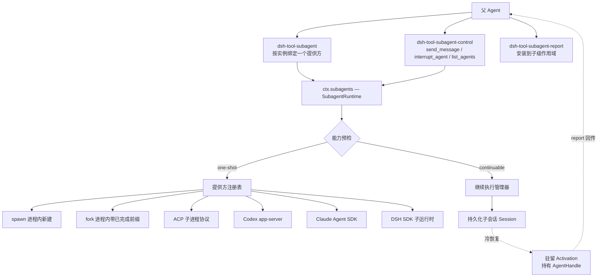
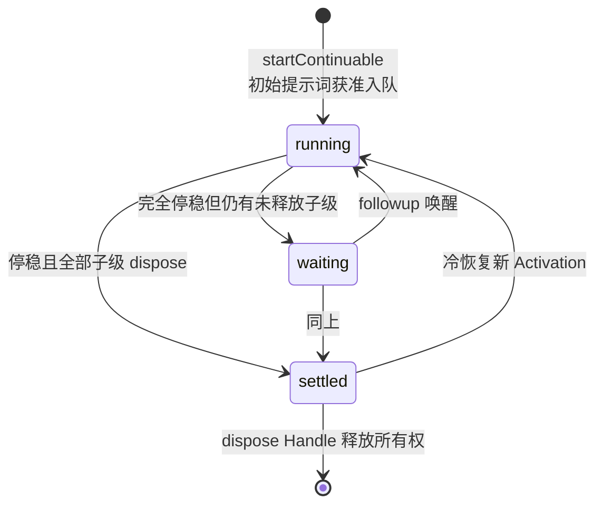

本页深入 DeepSeek Harness 的 **Subagent 能力族**——让一个 agent 将工作委托给子 agent 的完整机制链路：从面向模型的委派工具、多提供方注册表，到可继续执行的持久化子 agent 与实验性 Agent 团队协作领域。它与[沙箱策略后端](17-sha-xiang-ce-lue-hou-duan-bwrap-landlock-seatbelt-yu-landlock-yuan-sheng-xian-zhi-qi-dong-qi)同属“能力子系统能力族”章节，是理解 Harness 如何在不污染 agent loop 的前提下扩展出“分身”能力的关键一章。

Sources: [subagent.zh.md](docs/subsystems/subagent.zh.md#L5-L9)

## 架构定位：一条可插拔的委派接缝

subagent seam 是一项**可选能力**——它不属于 agent loop 本体，类型定义独立于 core 存在。这与其他能力接缝（fs、web、skill 等，见[能力接缝设计模式](13-neng-li-jie-feng-she-ji-mo-shi-fs-lsp-web-skill-yu-mcp-mo-xing-ke-jian-neng-li-zu)）一致，但它有一处独特性：同一上下文中可以共存多个具名提供方。Service Definition 是 `@deepseek-ai/dsh-subagent`（暴露 `ctx.subagents`），六个兄弟包作为 Service Provider 注册进注册表：`spawn`、`fork`、`acp`、`codex`、`claude-code`、`dsh-sdk`；面向模型的消费者则是三个工具包。

Sources: [subagent.zh.md](docs/subsystems/subagent.zh.md#L5-L9) · [README.zh.md](packages/subagent/README.zh.md#L7-L17)

整体拓扑如下——委派工具有三条通路：单次前台/后台委派直接穿过服务到达提供方；可继续委派则绕过提供方的 `start()`，由**继续执行管理器**直接持有子 Agent 的句柄并经收件箱排队：



Sources: [subagent.zh.md](docs/subsystems/subagent.zh.md#L138-L142) · [README.zh.md](packages/subagent/README.zh.md#L7-L17)

## 失败要响亮：启动期能力的声明式发现

六个提供方通过静态描述符公布各自的**启动时能力**（`outputSchema`、`depthLimit`、`toolFilter`、`persona` 四个布尔 flag）。服务在单次 run 尚不存在时就完成检查——若请求依赖提供方不具备的能力，将以 `SubagentError('UNSUPPORTED_CAPABILITY')` 类型化错误明确拒绝，绝不会被接受后静默忽略。每个 flag 与启动请求中的对应选项一一映射（`depthLimit` 对应 `maxDepth`，其余同名），这种**失败要响亮、零静默降级**的规则是整个接缝的设计基石。

Sources: [subagent.zh.md](docs/subsystems/subagent.zh.md#L11-L33)

值得注意的是，这些 flag 只描述**单次启动路径**；可继续子 agent 由管理器自行组装，其准入由 `prepareContinuable` 方法是否存在来判定——“方法存在即能力”。另一条描述性字段 `inheritsParentContext` 只声明子级是否看到父级已完成轮次前缀（fork 为 true、其余为 false），它不参与能力校验，仅用于让模型可见的工具措辞保持真实。

Sources: [subagent.zh.md](docs/subsystems/subagent.zh.md#L417-L440)

## 单次委派的请求、结果与终止原因词汇

模型侧只需给出 `{ description, prompt }`，工具层将其与自身配置组装成 `SubagentStartRequest`：必填的 `parent` 提供会话 cwd、谱系与委派深度；四个可选增强各自绑定能力 flag。其中 `signal` 是就绪前后**唯一的取消通道**——发布前触发则提供方清理部分资源后拒绝 `start()`，发布后触发则取消已发布 run 的剩余轮次工作。

Sources: [subagent.zh.md](docs/subsystems/subagent.zh.md#L35-L99)

服务的 `start()` 在能力检查后解析出分离的一次性描述符，再向所选传输传递 `ResolvedSubagentStartRequest`；可继续子 agent 永远不会走到提供方的 `start()`。履约时服务铸造唯一 runId、从确切的 `localAgent` 快照本地代理、发射 `subagent/start` 事件并返回同一个 run——rejection 则意味着未发布资源已被清理且不会产生任何生命周期事件对。

Sources: [subagent.zh.md](docs/subsystems/subagent.zh.md#L101-L112) · [subagent.zh.md](docs/subsystems/subagent.zh.md#L472)

终态结果 `SubagentResult` 携带三份内容：最后一条非空 assistant 消息构成的 `output`、仅在成功满足请求 schema 时才存在的 `structured` 值，以及针对非 `completed` 结果、经脱敏且限制在 4096 UTF-8 字节内的提供方诊断 `diagnostic`。请求了 schema 并不保证一定能拿到结构化值——这是消费方必须处理的真实边界。

Sources: [subagent.zh.md](docs/subsystems/subagent.zh.md#L310-L345)

终止原因是一个**可合并扩展的派生联合类型**：后端可以添加变体，消费方应对已知 case 分支处理并将未知原因视为失败：

| `stopReason` | 含义 |
|---|---|
| `completed` | 子 agent 正常完成轮次 |
| `aborted` | 经请求信号或 dispose 取消 |
| `error` | 模型或传输故障 |
| `max-tokens` | 子 agent 耗尽 token 上限 |
| `refusal` | 子 agent 拒绝任务 |

Sources: [subagent.zh.md](docs/subsystems/subagent.zh.md#L347-L368)

`SubagentRun` 是消费方持有的、指向已发布单次子 agent 的可 dispose 句柄——一次前台委派恰好对应一个结果，绝不是持久化子 agent 句柄。本地 run 必须在 `start()` 履约前发布一个普通子会话并以子会话 id 作为 run id；远程提供方则在父级命名空间中铸造独立 id（ACP 与 DSH-SDK 后端都是如此）。消费方 await 该结果后**必须始终调用 `dispose()`** 以取消剩余工作并达到静止。

Sources: [subagent.zh.md](docs/subsystems/subagent.zh.md#L372-L413) · [subagent-acp/README.zh.md](packages/subagent/subagent-acp/README.zh.md#L14-L16)

## 六个具名提供方：一张矩阵看清差异

家族的总 README 明确分工：两个进程内后端共享宿主的 agent 工厂与 LLM/工具服务；四个进程外后端各自拥有独立运行时。下表是选型的第一维度：

| 提供方 | 执行位置 | 继承父上下文 | 启动期能力 | 默认注册名 | 分发方式 |
|---|---|---|---|---|---|
| `spawn-in-process` | 当前进程新建子 Agent | 否（空对话） | 全部四项 | `spawn` | 核心随附 |
| `fork-in-process` | 当前进程 + 父级已完成轮次前缀 | 是 | 全部四项 | `fork` | 核心随附 |
| `acp` | 独立子进程，以 ACP 客户端驱动 | 否 | 无 | `acp` | 普通组合包 |
| `codex` | Codex app-server 子进程（锁定 0.147.0） | 否 | 无 | `codex` | 可选 Profile Bundle |
| `claude-code` | Claude Agent SDK 子进程（锁定 0.3.220） | 否 | 无 | `claude-code` | 可选 Profile Bundle |
| `dsh-sdk` | 完整 Harness 运行时子进程（stdio JSON-RPC） | 否 | 无 | `dsh-sdk` | 需显式配置 command |

Sources: [README.zh.md](packages/subagent/README.zh.md#L7-L17) · [subagent-spawn-in-process/README.zh.md](packages/subagent/subagent-spawn-in-process/README.zh.md#L1-L56) · [subagent-fork-in-process/README.zh.md](packages/subagent/subagent-fork-in-process/README.zh.md#L1-L62) · [subagent-acp/README.zh.md](packages/subagent/subagent-acp/README.zh.md#L1-L101) · [subagent-codex/README.zh.md](packages/subagent/subagent-codex/README.zh.md#L1-L144) · [subagent-claude-code/README.zh.md](packages/subagent/subagent-claude-code/README.zh.md#L1-L150) · [subagent-dsh-sdk/README.zh.md](packages/subagent/subagent-dsh-sdk/README.zh.md#L1-L98)

这六个后端在**上下文继承**上呈清晰的两极分化：进程内后端继承工作区与谱系（fork 还携带对话前缀），进程外后端的唯一父级输入就是工作区 cwd——远程子级的系统提示词、工具与模型全部来自其自身配置。正因无法在远程进程内强制执行本地约定，四个进程外后端一律不声明启动期能力，要求 persona、深度上限或工具过滤的委派会在服务层被当场拒绝。

Sources: [subagent-acp/README.zh.md](packages/subagent/subagent-acp/README.zh.md#L21-L25) · [subagent-dsh-sdk/README.zh.md](packages/subagent/subagent-dsh-sdk/README.zh.md#L28-L30) · [subagent-codex/README.zh.md](packages/subagent/subagent-codex/README.zh.md#L32-L34) · [subagent-claude-code/README.zh.md](packages/subagent/subagent-claude-code/README.zh.md#L26-L28)

### fork 的初始内容边界

fork 是 spawn 的近亲，唯一差异是会话初始内容。启动时刻父 agent 当前的工具调用轮次尚未结束（日志里只有 assistant 工具调用而没有匹配的结果与 `turn/end`），直接复制会产生不平衡的无效会话——因此 fork 只截取到最后一个 `turn/end` 为止的连续前缀；若父级尚未完成任何轮次，fork 行为退化为全新 spawn。子级获得全新的扁平注册作用域：初始内容只传递对话历史，不会导入父级的工具限制或权限。

Sources: [subagent-fork-in-process/README.zh.md](packages/subagent/subagent-fork-in-process/README.zh.md#L11-L29)

值得注意的一个现状是：尽管 `prepareContinuable` 仍实现完好且 seam 也接受它，但所有随附组合都在 fork 委派工具上设置 `backgroundMode: one-shot`——该提供方的可继续路径目前没有生产调用方。

Sources: [subagent-fork-in-process/README.zh.md](packages/subagent/subagent-fork-in-process/README.zh.md#L59-L62)

## 共享驱动器：进程内语义如何统一落地

spawn 与 fork 的全部运行机制都收敛到一个共享驱动器 `startInProcessRun`，它按五步流水线执行：校验并推导深度 → 通过 `parent.ctx.agents.create` 发起创建事务（把取消信号传入工厂）→ 在未发布的设置窗口中安装 persona、工具过滤与结构化输出运行时 → 发布子级并保留 `AgentHandle` → 从完整的自有子运行中提取输出。启动被拒时创建事务已完全回滚，调用方绝不会收到创建到一半的句柄。

Sources: [subagent-in-process-driver/README.zh.md](packages/subagent/subagent-in-process-driver/README.zh.md#L9-L21)

**委派深度**由两个字段共同表示：持久的 `SessionHeader.delegationDepth` 具有权威性，运行时可合并扩展字段 `AgentOptions.subagentDepth` 只能加深、不能降低——因此恢复后的子 agent 保留预算。这两个字段完全归本 seam 所有，循环既不设置也不读取它们。

Sources: [subagent.zh.md](docs/subsystems/subagent.zh.md#L474-L479) · [subagent-in-process-driver/README.zh.md](packages/subagent/subagent-in-process-driver/README.zh.md#L62-L66)

**Fork 种子注入**复用了与 `ctx.agents.resume()` 相同的原语 `CreateAgentOptions.seed`（一个配平的 `SessionEvent[]` 前缀），driver 同时记录其长度以确保结果读取器不会把继承的父级消息误认为子级输出。

Sources: [subagent.zh.md](docs/subsystems/subagent.zh.md#L474-L479) · [subagent-in-process-driver/README.zh.md](packages/subagent/subagent-in-process-driver/README.zh.md#L68-L70)

结构化输出是一套完整的子级作用域协议：按请求 schema 注册的 `structured_output` 工具负责校验并暂存模型值；顺序为 190 的系统提示词段宣告“工具调用即终态答案”；`tools/result` 观察者只在本次执行的权威最终工具结果成功后提交暂存值；单调防护在捕获值后阻止后续调用并由 `concludeTurn()` 标记结束轮次。正常结束却未提交必需值的轮次报告为 `error`，driver 不会重新提示。所有注册附着于子级 fiber，专家级监听器可以整套替换它们。

Sources: [subagent-in-process-driver/README.zh.md](packages/subagent/subagent-in-process-driver/README.zh.md#L74-L95)

## 模型可见工具面：委派、控制与回报三层

面向模型的入口是 `dsh-tool-subagent`。它的关键设计是**每插件实例绑定一个提供方到一个 `toolName`**——模型不会收到提供方选择器；想公开另一种传输就加载另一个不同名称的实例。工具只在其提供方存在时才注册，从而不对同级加载顺序产生依赖。

Sources: [tool-subagent/README.zh.md](packages/subagent/tool-subagent/README.zh.md#L7-L9)

| 配置键 | 默认值 | 说明 |
|---|---|---|
| `provider` | （必填） | 提供方注册名 |
| `toolName` | `subagent` | 面向模型的名称，各实例必须唯一 |
| `enableRunInBackground` | `true` | 公开后台模式 |
| `backgroundMode` | `one-shot` | `continuable` 要求提供方具备 `prepareContinuable`，返回持久子级 ID |
| `maxDepth` | `3` | 绝对深度上限；`'provider-managed'` 表示预算归子级 harness 所有 |
| `persona` / `toolFilter` | 无 | 各要求对应能力 flag |

Sources: [tool-subagent/README.zh.md](packages/subagent/tool-subagent/README.zh.md#L25-L46)

并发语义值得强调：前台与后台调用均并发安全，同一条 assistant 消息里的同级委派可在循环滚动池下重叠执行，结果仍按模型顺序提交；一次性后台形态将 run 注册成归父级所有的普通 Task（与[jobs 编排子系统](22-hou-tai-ren-wu-yu-bian-pai-jobs-yun-xing-shi-ding-shi-diao-du-gong-zuo-liu-yin-qing-yu-mu-biao-zhui-zong)对接），而可继续形态返回的是稳定子级 ID，其输出**永远不会**经由本工具回流。

Sources: [tool-subagent/README.zh.md](packages/subagent/tool-subagent/README.zh.md#L48-L50) · [tool-subagent/README.zh.md](packages/subagent/tool-subagent/README.zh.md#L70-L73)

`dsh-tool-subagent-control` 是可单独加载的全局控制三件套（`send_message`、`interrupt_agent`、`list_agents`），只注册一次供所有传输共享。它不做任何生命周期路由：投递授权来自确切的在线父级，来源记作 `{ kind: 'coordinator', senderSessionId }` 但**不授予权限**；`interrupt_agent` 把 `exec.agent` 作为 ancestor 授权传入，目标可以是任意深度的后代，谱系校验由服务而非工具完成。

Sources: [tool-subagent-control/README.zh.md](packages/subagent/tool-subagent-control/README.zh.md#L7-L13)

`dsh-tool-subagent-report` 则填补了“子级如何主动说话”的空白。它在每个可继续子级作用域中安装 `report` 工具与一段指引提示词，并刻意不受子级全局 `toolFilter` 约束——委派允许列表无法移除这条唯一的返回通道。`next-step` 投递（默认）借助 `parent.steer()` 让运行中的父级在最近的 step 边界收到报告，空闲父级则被唤醒开一轮；`quiet` 投递静默等待其他输入唤醒父级。

Sources: [tool-subagent-report/README.zh.md](packages/subagent/tool-subagent-report/README.zh.md#L5-L17) · [subagent.zh.md](docs/subsystems/subagent.zh.md#L192-L210)

子级上报之外，管理器还保有一份自己的记账：驻留 Activation 结算时会向持久化的直接父级投递结算通知，说明该 epoch 如何结束并携带最终 assistant 内容。这份通知的来源类型 `subagent-settled` 与子级自选的 `subagent-report` **刻意采用不同的 kind**——一份合并了两者的转录会让孩子背负它从未写过的词。

Sources: [subagent.zh.md](docs/subsystems/subagent.zh.md#L212-L231)

## 可继续子 agent 的持久化激活模型

**可继续后台 subagent** 是一份持久化子会话，至多关联一个进程内的 Activation（激活）——被重建的子 Agent 处于驻留状态的时段。Activation 不是请求、结果、取消或 Task：它能执行多个 FIFO 轮次，还拥有自己的 `AgentHandle` 和 `ownedChildren` 集合。由于一份会话至多有一个存活 Activation，子会话 id 无需额外的运行时化身即可标识存活子级。

Sources: [subagent.zh.md](docs/subsystems/subagent.zh.md#L114-L157)

`followup()` 是唯一的续聊操作，路由只取决于 Activation 的驻留状态：



Sources: [subagent.zh.md](docs/subsystems/subagent.zh.md#L128-L136)

Agent 收件箱是唯一的队列：每条续聊消息成为一个 FIFO 轮次，后续消息无法改变已在进行中的轮次——seam 不对外暴露任何 steering 中途引导。唯一公开的停止操作 `interrupt()` 同步鉴权后对在线目标发出 `Agent.cancel(cause, { keepInbox: true })` 即刻返回，未领取的待处理 inbox 工作、Activation 与已发布的后代均保留；人机两种授权凭据由联合类型 `SubagentInterruptAuthority` 表达。

Sources: [subagent.zh.md](docs/subsystems/subagent.zh.md#L138-L155) · [subagent.zh.md](docs/subsystems/subagent.zh.md#L524-L539)

提供方在可继续路径上的参与被压缩到一个极小的面：`prepareContinuable` 只返回分离的数据 `ContinuableCreateSpec`（目前只有可选的父级历史种子），不含 Agent、句柄、投递或恢复操作——身份预留、组合、创建、冷恢复与销毁全部归管理器所有。冷恢复根本不触达提供方。

Sources: [subagent.zh.md](docs/subsystems/subagent.zh.md#L243-L281)

持久化发现也遵循“不经查询服务、不加载 Agent”的原则：`listChildren()`/`listDescendants()` 合并实时会话存储与可选持久化存储（live 优先），条目解释沿三级阶梯下降——活子级取投影注册表的水位线快照；冷子级优先取持久化投影缓存行（seq 门证明其晚于 fork 种子）；否则做一次持久化检查折叠。每次读取都转发调用方 `signal`，中止后的读拒绝会成为稳定的 `CANCELLED` 错误。

Sources: [subagent.zh.md](docs/subsystems/subagent.zh.md#L287-L305) · [subagent.zh.md](docs/subsystems/subagent.zh.md#L481-L672)

描述符（`SubagentDescriptorData`）是每个会话支撑子级的按模式判别持久身份，两种模式均携带提供方名：本地一次性提供方在子级初始轮次内、首次请求前追加它；继续执行管理器则在任何种子之后、初始提示词准入之前追加，`header.seedLength` 始终充当 fork 谱系边界。

Sources: [subagent.zh.md](docs/subsystems/subagent.zh.md#L283-L285)

## 多提供方注册的生命周期契约

`registerProvider()` 以 effect 作用域注册提供方且 **HMR 安全**：移除提供方只会阻止新的启动，不会撤销已交还给持有者的 run。`getProvider(name)`、`list()`（插入序）与 `start(name, request)` 构成注册表的完整读写面；能力与语义检查永远先于委派发生，而提供方的所有权只在 promise 履约前有效。

Sources: [subagent.zh.md](docs/subsystems/subagent.zh.md#L640-L668) · [subagent.zh.md](docs/subsystems/subagent.zh.md#L421-L430)

服务还会在子级结算时对外发射作用域过滤的事件对——`subagent/start` / `subagent/end` 使用与委派父级相同的载体分发，因此这对生命周期事件能精确到达同一个作用域受众。此外还有一个可选扩展点：`registerContinuableSetup()` 可以把部署级贡献组合进每一个可继续子级“未发布的创建上下文”，授予等待下一次 Activation、移除立即撤销全部驻留安装。

Sources: [subagent.zh.md](docs/subsystems/subagent.zh.md#L674-L694) · [subagent.zh.md](docs/subsystems/subagent.zh.md#L192)

工程上还有一条容易踩坑的硬约束：`subagent-acp` 与 `subagent-dsh-sdk` 两个包**都没有默认导出**——否则 Cordis loader 的解包会隐藏具名 `inject` 元数据（详见事故复盘 0001）。

Sources: [subagent-acp/README.zh.md](packages/subagent/subagent-acp/README.zh.md#L48-L50) · [subagent-dsh-sdk/README.zh.md](packages/subagent/subagent-dsh-sdk/README.zh.md#L44-L46)

## 实验性 Agent 团队：以 Lead 日志为唯一事实源的协作领域

`packages/experimental/agent-team` 实现了一个**隐式 Root Team 领域**：每个普通运行的 Root 都是天然 Team Lead，`TeamId` 就等于根 `SessionId`，因此在写入第一条成员/消息/任务记录之前创建 Team 不需要任何额外状态。teammate 是记录在 Root 日志中的具名 continuable 直接子级；名字是小写 kebab-case 且永不复用的不可变标签，Session id 才是持久身份。

Sources: [agent-team.zh.md](docs/subsystems/agent-team.zh.md#L5-L9) · [agent-team/README.zh.md](packages/experimental/agent-team/README.zh.md#L28-L37)

成员快照体现了一条简洁的状态机纪律：每个 member 从 `provisioning` 出发、只到达 `active` 或 `failed` 之一；运行时的 `running/idle/inactive` 单独派生，绝不改写持久记录。

```ts
interface TeamMemberSnapshot {
  readonly id: SessionId
  readonly name: string
  readonly description: string
  readonly provider: string
  readonly context: 'fresh' | 'fork'
  readonly phase: TeamMemberPhase
  readonly error?: string
}
```

Sources: [agent-team.zh.md](docs/subsystems/agent-team.zh.md#L11-L24)

**持久 mailbox** 采用“先落账、再投递、后确认”的三步写序：Lead 先存完整 queued 消息，只有当 target 的 pending inbox 条目或已记录用户消息完成持久化后才写入独立的 acknowledgement 事件——queued 减 delivered 之差即构成恢复 mailbox。target 端以 `TeamMessageSource` 作为跨 inbox 与历史的去重键；保证强度是“进程内重试加去重”，并非跨进程 exactly-once。

Sources: [agent-team.zh.md](docs/subsystems/agent-team.zh.md#L26-L53) · [agent-team/README.zh.md](packages/experimental/agent-team/README.zh.md#L47-L64)

**共享任务板**是版本化的完整快照存储：`revision` 是 compare-and-set 期望值，陈旧调用方收到 `TEAM_TASK_STALE_REVISION` 而非覆盖更新。依赖边必须指向未删除任务并维持无环（禁止 self/duplicate 边）；删除保留 tombstone 以供回放与 id 稳定但不占 `maxTasks` 配额。`writeScopes` 规范化为 workspace 相对路径前缀——它们是协作提示而**不是锁**：Bash、formatter 或外部写入都可绕过文件版本守卫，Lead 必须协调 owner 并核对最终 diff。

Sources: [agent-team.zh.md](docs/subsystems/agent-team.zh.md#L55-L73) · [agent-team/README.zh.md](packages/experimental/agent-team/README.zh.md#L66-L71)

回放函数 `foldTeam()` 把一个 Root Session 重放为每个 Team 操作所读取的 roster、任务板与 queued-minus-delivered mailbox，按 `TeamId` 选取记录——普通 fork 继承的事件保留祖先 id，绝不会进入新 Root 的状态。配套的 invariant 模块会把每条候选 Team 事件先对照已提交前缀回放验证、再将合法 payload 纳入折叠状态，在 append 前拒绝非法转换、名字复用或超界 id。

Sources: [agent-team.zh.md](docs/subsystems/agent-team.zh.md#L75-L77) · [agent-team/README.zh.md](packages/experimental/agent-team/README.zh.md#L73-L74)

服务暴露为 `ctx.agentTeams`（`TeamService`）：`membership` / `listMembers` / `spawnTeammate` / `sendMessage` / `createTask` / `getTask` / `listTasks` / `updateTask`（CAS）/ `waitForChange`（10 秒至 1 小时的有界等待）/ 仅限 Lead 的 `interrupt`，以及供观察者使用的无损 `tryMembership`。所有方法都以“确切的在线 Agent”作为权限凭据。

Sources: [agent-team.zh.md](docs/subsystems/agent-team.zh.md#L87-L135)

装配约束同样明确：该服务要求 Agent、Session、Session persistence 与 continuable-subagent 服务在场——没有持久会话存储的组合根本不会激活它。资源限额通过插件配置声明：`maxMembers: 8`（统计所有曾 provision 过的名字）、`maxTasks: 256`、`maxPendingMessagesPerMember: 64`、`maxMessageBytes: 65536`、`disposalTimeoutMs: 5000`。

Sources: [agent-team/README.zh.md](packages/experimental/agent-team/README.zh.md#L9-L24) · [agent-team/README.zh.md](packages/experimental/agent-team/README.zh.md#L26)

## tool-agent-team：Scoped 协作工具与固定策略注入

`dsh-experimental-tool-agent-team` 是 `ctx.agentTeams` 的 scoped 模型适配器：它监听 Agent 发布事件，在每个隐式 Lead 与持久 teammate 的确切作用域中安装 `team:policy` 系统提示词段（order 60）与全套协作工具——因此 fresh 创建与冷恢复都会在第一次模型请求前获得一致的注册集合；Agent dispose 与插件 HMR 则对称地撤除一切。

Sources: [tool-agent-team/README.zh.md](packages/experimental/tool-agent-team/README.zh.md#L5-L21) · [index.ts](packages/experimental/tool-agent-team/src/index.ts#L150-L172)

工具全集共十个，可直接对照源码验证：

| 工具名 | 职责 | 权限要点 |
|---|---|---|
| `spawn_teammate` | 创建具名持久 teammate | 服务端强制 Lead 身份 |
| `send_message` | quiet 投递，绝不唤醒 inactive target | 全员可用 |
| `followup_task` | wakeup 投递并可冷恢复 target 的下一轮 | 全员可用 |
| `list_agents` / `wait_agent` | roster 快照 / 有界等待变更 | 全员可用 |
| `interrupt_agent` | 打断活跃队友当前轮次 | 仅限 Lead |
| `team_task_create/list/get/update` | 任务板 CRUD（update 为 CAS） | 领域层校验 Owner/Lead 与 revision |

Sources: [index.ts](packages/experimental/tool-agent-team/src/index.ts#L174-L212) · [index.ts](packages/experimental/tool-agent-team/src/index.ts#L266-L380)

一个重要的兼容性行为：scoped Team 定义会覆盖同名的旧全局 continuable-subagent control 工具，因此同时挂载两套的组合必须禁用旧全局包以免歧义。策略文本本身也是产品决定的一部分：固定模型策略规定**只有用户明确要求 Agent Teams 或 teammates 时才组队**——普通任务不会自发扩张成编制。

Sources: [tool-agent-team/README.zh.md](packages/experimental/tool-agent-team/README.zh.md#L7-L21) · [index.ts](packages/experimental/tool-agent-team/src/index.ts#L26-L29)

工程红线同样写进了已知限制：单进程、共享 checkout、扁平不可变 roster、不自动释放任务 owner、mailbox 不承诺跨进程 exactly-once——这些是把实验包推向生产前必须逐条评估的边界。

Sources: [tool-agent-team/README.zh.md](packages/experimental/tool-agent-team/README.zh.md#L46-L50) · [agent-team/README.zh.md](packages/experimental/agent-team/README.zh.md#L76-L77)

## 选型决策指南

把前面的分析压缩成一张速查表，覆盖最常见的部署问题：

| 场景 | 推荐组合 | 关键理由 |
|---|---|---|
| 需要结构化产出/工具过滤/分级深度的受控委派 | `spawn`（或需历史时 `fork`），前台或 one-shot 后台 | 唯一具备全部四项能力的路径 |
| 长期同事式异步协作、多轮往返 | 可继续子 agent + `tool-subagent-report` + control 三件套 | 持久身份、inbox FIFO、report 回传 |
| 借用外部产品的原生技能（终端工具等） | `codex` 或 `claude-code` Profile Bundle | 锁定版本的可选载荷，休眠 Host provider |
| 让另一个完整 Harness 运行时干活 | `dsh-sdk` | 子进程自带完整插件树，预算归子级管 |
| 多成员共享看板的编排 | 实验 `agent-team` + `tool-agent-team` | Lead 日志回放、CAS 任务板——生产使用须评估共享 checkout 限制 |

Sources: [README.zh.md](packages/subagent/README.zh.md#L7-L21) · [tool-subagent/README.zh.md](packages/subagent/tool-subagent/README.zh.md#L25-L83)

codex/claude-code 两个 Bundle 的双实例示例展示了完整的静态装配范式——每个提供方实例可换名并存，工具逐一绑定：

```yaml
- id: subagent-codex-safe
  name: '@deepseek-ai/dsh-subagent-codex'
  config:
    providerName: codex-safe
    permissionMode: never
    env:
      OPENAI_API_KEY: !!js process.env.OPENAI_API_KEY

- id: tool-subagent-codex-safe
  name: '@deepseek-ai/dsh-tool-subagent'
  config:
    provider: codex-safe
    toolName: subagent_codex_safe
    backgroundMode: one-shot
    maxDepth: provider-managed
```

安装走 Profile Bundle 流程：`dsh plugin --profile <name> add @deepseek-ai/dsh-subagent-codex` 后重启该 Profile；安装决定的是 Host 可用性而不是模型权限。

Sources: [subagent-codex/README.zh.md](packages/subagent/subagent-codex/README.zh.md#L51-L98)

## 小结与延伸阅读

三块拼图共享同一条不变量：**父级日志只见委派工具调用与结果（或轻量通知），子级的一切工作细节留在子级自己的会话里**。单次 run 用结果约束信息流；可继续子 agent 用来源标记的消息与结算通知保持可审计；Agent 团队则把协调本体也搬进 Lead 日志让回放成为唯一事实源。想在下一站继续深挖，建议顺序阅读：先看[会话持久化数据平面](19-hui-hua-chi-jiu-hua-shu-ju-ping-mian-jsonl-sqlite-hou-duan-tou-ying-huan-cun-yu-quan-wen-jian-suo)理解可继续子 agent 依赖的持久化底座，再到[后台任务与编排](22-hou-tai-ren-wu-yu-bian-pai-jobs-yun-xing-shi-ding-shi-diao-du-gong-zuo-liu-yin-qing-yu-mu-biao-zhui-zong)补齐 one-shot 后台 run 的 Task 收集语义，最后可用[测试体系](28-ce-shi-ti-xi-testkit-llm-hui-fang-mo-kuai-zhao-yu-duan-dao-duan-fu-gai-men-jin)回顾这些行为是如何被快照与 E2E 门禁锁定的。