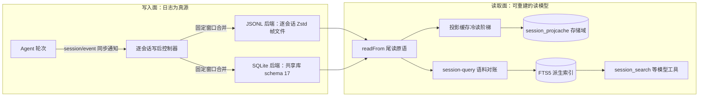
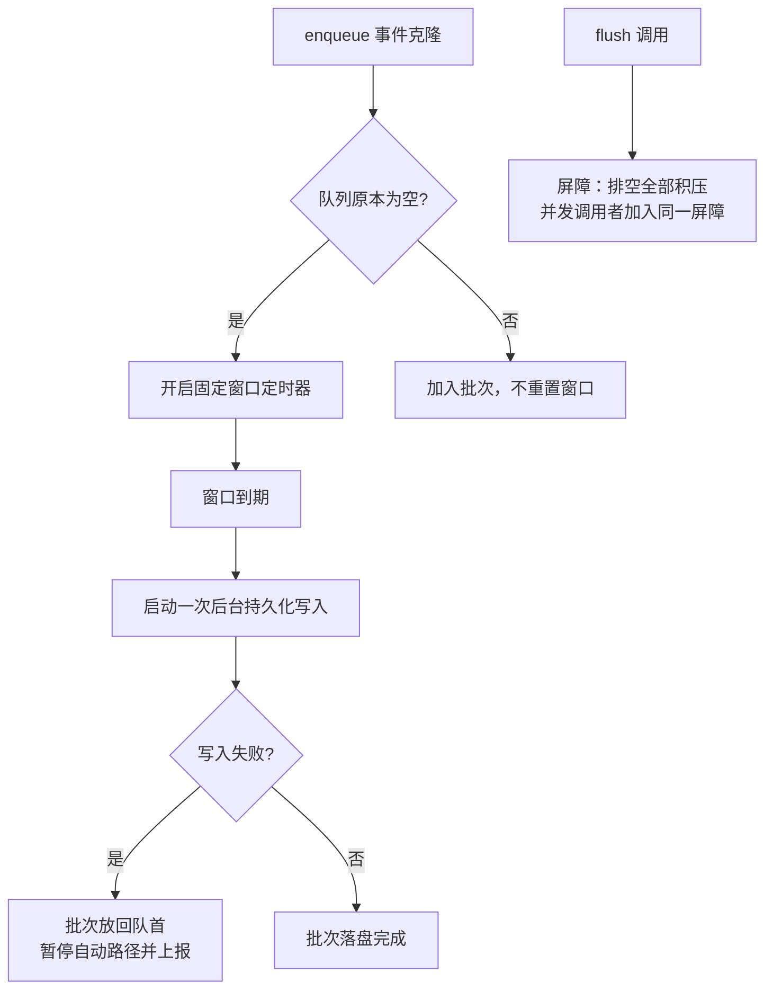
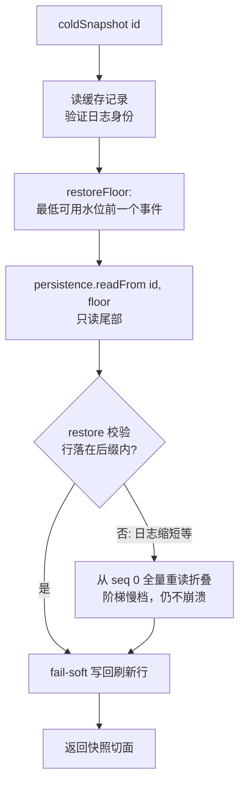
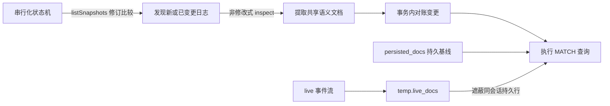

会话事件日志是 DeepSeek Harness 的真源——「模型可见即已记录」的不变量在[会话日志模型](12-hui-hua-ri-zhi-mo-xing-mo-xing-ke-jian-ji-yi-ji-lu-de-bu-bian-liang-yu-xiao-xi-tou-ying)中已经定义。本页向下走一层，剖析让这份日志**持久化并被高效读取**的数据平面：统一的事件日志 `SessionPersistence` 缝、两个可互换的后端（逐会话 JSONL 文件与共享 SQLite 数据库）、把 host 侧折叠状态持久化的投影缓存，以及基于 SQLite FTS5 的全文检索读模型。全部机制只服务于「日志优先」这一件事：任何读模型都可能陈旧，但绝不与日志矛盾。

## 数据平面总览

整个数据平面围绕一条不对称的分界线组织：**写入面**只有一个真源（仅追加的事件日志），**读取面**则派生出多个可丢弃的读模型（投影检查点、FTS 索引），每个读模型都自带「落后于日志多远」的水位记录，因此可以随时重建而不危及正确性。



两个后端实现同一个抽象服务；协调器（coordinator）把缓冲、序列化、崩溃修复等与介质无关的编排收敛在一处，后端只实现最小的持久化原语。读模型则通过「修订号比较 + 尾读」避免加载完整日志，这是本平面最重要的成本设计。

Sources: [index.ts](packages/session/session-persistence/src/index.ts#L78-L96), [coordinator.ts](packages/session/session-persistence/src/coordinator.ts#L123-L132)

## 统一契约：`SessionPersistence` 抽象缝

`ctx.sessionPersistence` 是一项能力缝：抽象类只承诺「连续、可无损 JSON 序列化的事件被持久保存；`append` 仅在持久化完成后解析；`load` 会配平被中断的轮次尾部而不改写已提交事件」。这一契约把「什么是已持久化的会话」定义成后端无关的语义，JSONL 与 SQLite 只是同一语义的两种物理实现。

| 方法 | 语义 | 后端差异点 |
|---|---|---|
| `locate(meta)` | 解析逐会话产物的绝对路径（不读取、不实体化） | JSONL 返回 `{kind:'jsonl', path}`；SQLite 共享一个库，返回 `undefined` |
| `readRaw(id)` | 逐字返回后端自持工件文本，保留打包/键序/换行 | 仅 JSONL 支持（`supportsRawArtifacts`） |
| `create/append` | 注册元数据；按连续 seq 追加批次，持久化后才解析 | 两者都允许「延迟实体化」：从未 append 的会话不留痕迹 |
| `prepare/load/inspect` | 恢复未发布 Session；提交冷恢复的加载；非修改式检查 | 语义完全共享，由协调器实现 |
| `readFrom(id, fromSeq)` | 从水位起读取已存储后缀——读模型的核心原语 | SQLite 按行号 seek 只读尾部；JSONL 顺序介质仍解析全文件、只是限制返回量 |
| `list/listSnapshots` | 元数据轻量列举；附带每个日志的不透明修订号 | 修订号是读模型（缓存/FTS 对账）的变更检测基础 |

`readFrom` 的注释值得逐字理解：它约束的是「返回并重折叠什么」，而不是「每个后端物理上读多少」——这就是投影缓存能以「缓存行 + 尾部回放」避免全量加载、同时语义保持严格的原因。修订号（`SessionPersistenceRevision`）由后端拥有，随 append 或修改数据的 load 修复以事务方式改变，调用方只做相等性比较。

Sources: [index.ts](packages/session/session-persistence/src/index.ts#L62-L76), [index.ts](packages/session/session-persistence/src/index.ts#L202-L244), [persistence.zh.md](docs/subsystems/persistence.zh.md#L228-L246)

## 写入路径：写后批处理与协调器

`session/event` 是同步通知：持久化插件把事件复制进**逐会话**的写后控制器，绝不阻塞生产方。控制器对每个事件先做 `structuredClone` 快照（与生产方解引用），然后仅在「空闲队列收到第一个待处理事件」时开启一个**固定**合并窗口——后续事件加入批次但不会重置截止时间。这保证了尾部延迟有上界（默认 200 ms），同时高频流式 delta 仍能被合并成大批次。



失败语义同样明确：写失败的批次被放回队首等待重试，自动路径暂停，后台失败只上报给观察者而不拒绝生产方；显式 `flush()` 通过 quiescence 屏障保证「返回即全部落盘」，是检查点策略与投影缓存依赖的持久化屏障。与介质无关的编排集中在 `PersistenceCoordinator`，后端只需实现 `PersistenceBackend` SPI：`loadStored`（读有效前缀 + 撕裂尾标记）、`readStoredRevision`、可选的 `loadStoredFrom`（按 seq seek）、`appendBatch`（原子物化 + 追加）与 `commitRepair`（截断撕裂尾 + 追加合成 closer）。第三方后端也可以绕过协调器直接实现抽象缝。

Sources: [write-behind.ts](packages/session/session-persistence/src/write-behind.ts#L38-L63), [write-behind.ts](packages/session/session-persistence/src/write-behind.ts#L141-L160), [coordinator.ts](packages/session/session-persistence/src/coordinator.ts#L26-L64), [coordinator.ts](packages/session/session-persistence/src/coordinator.ts#L123-L200)

## 后端一：JSONL——逐会话仅追加日志

JSONL 后端是出厂默认（`dsh-base` 组合包直接挂载）。磁盘布局为「项目目录 → 会话目录 → 固定 transcript 文件名」：项目目录保留规范化 cwd 的**可读**形式便于人导航（分隔符有损替换并截断，因此规范化相同的 cwd 共享目录），会话 id 则经单射转义为安全路径段——`SessionId` 是未验证的品牌字符串，编码必须消灭遍历与冲突。

```
<root>/
  --<normalized-cwd>--/          # 可读项目目录（无 cwd 则 _no-cwd/）
    <encoded-id>/                # 会话自有目录
      session.jsonl.zstd         # 默认：带 checksum 的 header 帧 + 追加帧
      session.jsonl              # 仅 compression: 'none' 时
```

第一条逻辑行是标记为 `type: 'session'` 的不可变 `SessionHeader`（磁盘上 `delegationDepth` 必需）；事件行是原样 `SessionEvent` JSON，或在 `packChunks` 启用时写成的**打包分片行**——字段完全匹配、连续且同一分片块的 text/reasoning/tool-call delta 连续段被压成一行（真实编程会话上测得逻辑日志约小 60%）。物理编码是标准 Zstandard 帧的拼接：一个仅含 header 的带 checksum 帧，后跟每个持久化批次一个帧。选择「逐帧拼接」而非整文件压缩，是为了能逐帧校验、逐帧追加，并在崩溃时识别撕裂的最后一帧——读取器保留其完整解码记录、从帧起点截断，未压缩的原始行模式同理按行截断。

持久化语义的四个关键点：**延迟实体化**（`create` 不写盘，首次 `append` 将 header 与首批写入临时文件并 `fsync`）；**原子发布**（POSIX 通过无覆盖硬链接发布并 `fsync` 父目录，Windows 通过 `MoveFileExW` 的 write-through 无替换改名——同 id 竞态会失败而不是覆盖已提交日志）；**仅追加**（部分写入或同步失败回滚到之前的字节长度）；**一个根只有一种编码**（启动发现拒绝相反后缀，不提供迁移或混合根回退）。`load` 与 `inspect` 的分工在此后端可见：前者提交冷恢复（截断撕裂尾 + 为完整中断轮次持久补写合成 closer），后者只在内存中配平、绝不触碰物理尾部。

Sources: [README.zh.md](packages/session/session-persistence-jsonl/README.zh.md#L9-L15), [README.zh.md](packages/session/session-persistence-jsonl/README.zh.md#L17-L23), [README.zh.md](packages/session/session-persistence-jsonl/README.zh.md#L43-L57), [format.ts](packages/session/session-persistence-jsonl/src/format.ts#L27-L43), [format.ts](packages/session/session-persistence-jsonl/src/format.ts#L120-L206), [zstd.ts](packages/session/session-persistence-jsonl/src/zstd.ts#L40-L70), [index.ts](packages/session/session-persistence-jsonl/src/index.ts#L510-L560), [index.ts](packages/session/session-persistence-jsonl/src/index.ts#L645-L695)

## 后端二：SQLite——共享数据库与打包物理行

SQLite 后端是可选启用的 `node:sqlite` 实现，把所有会话放进一个数据库（schema 17，应用标识 `0x44534850`）。三张 STRICT 表构成存储模型：`persistence_state`（单例 store 身份）、`sessions`（元数据 + 单调 `revision` + UUID `incarnation`）、`events`（复合主键 `(session_id, seq)`）。标量行存一个逻辑事件；打包行把 `text-chunks`/`reasoning-chunks`/`tool-call-chunks` 用作物理 `type`，`seq`/`time` 标识所代表的第一个事件——**物理标签绝不进入 prompt、回放或实时投递**，它们是纯存储层概念。

```sql
CREATE TABLE events (
  session_id        TEXT NOT NULL REFERENCES sessions(id) ON DELETE CASCADE,
  seq               INTEGER NOT NULL,
  type              TEXT NOT NULL,
  time              INTEGER NOT NULL,
  data              ANY NOT NULL,
  source_event_seqs ANY,
  surface_op        TEXT,
  ignorable         INTEGER CHECK (ignorable IS NULL OR ignorable IN (0, 1)),
  PRIMARY KEY (session_id, seq)
) STRICT;
```

压缩与编码是schema 内聚的 codec：序列化后的 `data` 小于 4 KiB 保持 SQLite `TEXT`（避免小记录的逐帧 CPU 开销）；达到阈值时用 Zstandard level 3 压缩，且**只在帧确实更小时**才存 `BLOB`。`source_event_seqs` 永远完整有界：首值直存，后续值做 zigzag 变换的 delta varint 编码——典型情况下 assistant/message 引用数十个 chunk seq，delta 后每值只占一两个字节。追加路径持有 `BEGIN IMMEDIATE`，验证有界物理尾部、只打包新持久批次、把会话 revision 递增一次；普通追加绝不删除或改写既有行。因为介质可按 `(session_id, seq)` 寻址，后端实现可选的 `loadStoredFrom`，使 `readFrom` 的物理读取量与返回的尾部成正比——这正是与 JSONL 的本质差异。

打开数据库时的加固非常全面：`trusted_schema=off`、`mmap_size=0`、外键开启，journal mode 切换在 `SQLITE_BUSY` 时按 10 ms 步进重试直到 `busyTimeoutMs` 截止，随后强制 `synchronous=FULL`。所有权校验拒绝旧 schema、外部应用标识、非空未版本化库与任何 schema 对象差异（与内存中的规范 schema 逐对象比对）——预发布阶段明确不做迁移。读取方的安全约束也随之而来：外部 SQL 读取方必须理解物理打包标签，受支持的消费方应经由本提供方读取。

Sources: [README.zh.md](packages/session/session-persistence-sqlite/README.zh.md#L9-L27), [schema.ts](packages/session/session-persistence-sqlite/src/schema.ts#L17-L44), [schema.ts](packages/session/session-persistence-sqlite/src/schema.ts#L70-L101), [schema.ts](packages/session/session-persistence-sqlite/src/schema.ts#L103-L185), [schema.sql](packages/session/session-persistence-sqlite/resources/sql/schema.sql#L1-L31), [compression.ts](packages/session/session-persistence-sqlite/src/compression.ts#L28-L34), [compression.ts](packages/session/session-persistence-sqlite/src/compression.ts#L109-L141)

## 后端选型对比

两个后端共享全部逻辑语义（同一契约测试套件 `runPersistenceContract` 覆盖），差异集中在物理层，按部署需求选择即可：

| 维度 | JSONL 后端 | SQLite 后端 |
|---|---|---|
| 存储形态 | 每会话一个仅追加文件（Zstd 帧拼接或原始行） | 所有会话共享一个数据库（schema 17） |
| 逐会话产物 | 有：`locate` 返回路径，`readRaw` 可导出原文 | 无：`locate` 返回 `undefined` |
| `readFrom` 物理成本 | 顺序介质：解析全文件、限制返回量 | 按 PK seek：只读请求的后缀 |
| 空间效率 | 打包分片行约省 60% | 打包行 + 4 KiB 以上 Zstd-3 + delta varint 引用 |
| 删除/回收 | 无删除接口，日志在 root 下累积 | 普通追加只插入，无后台压缩 |
| 并发模型 | 每会话一个活动 writer；进程间靠无覆盖发布防覆盖 | `BEGIN IMMEDIATE` 串行化；`DatabaseSync` 同步阻塞事件循环 |
| 典型定位 | 出厂默认；产物可直接归档/外部分析（`compression:'none'` 时） | 大日志 + 高频冷读场景的效率型实现 |

Sources: [README.zh.md](packages/session/session-persistence-jsonl/README.zh.md#L25-L31), [README.zh.md](packages/session/session-persistence-sqlite/README.zh.md#L43-L64), [coordinator.ts](packages/session/session-persistence/src/coordinator.ts#L143-L168)

## 投影缓存：折叠捷径，绝非权威

投影系统（[会话投影](docs/subsystems/session-projection.zh.md) 的注册表）在每个已提交事件上驱动纯同步折叠；投影缓存则把这些折叠状态**持久化**为检查点，让冷会话不必重放全日志就能拿到近乎当前的投影值。它挂载在 `ctx.storageDomain` 之上，声明 `session_projcache` 领域：每会话一条记录，内容是 `key → {ver, seq, val}` 行的集合——`ver` 是单元的 `stateVersion`，`seq` 精确说明这行陈旧到哪个事件，`val` 经无损 JSON 边界快照（违反纯 JSON 约定的单元显式报错）。

一条存储行是**折叠捷径，绝不是权威**，实现据此承诺四件事：每次后台写入都 fail-soft（失败只记警告，下次写入或冷读自愈）；`ver` 与当前运行单元不匹配即丢弃、绝不迁移；存储行必须通过当前单元的 `stateSchema`，畸形行直接省略；记录绑定到**日志生命周期**而不只是 id——每条记录存储其折叠来源的 `{createdAt, cwd}` 身份，读取先验证再接受，因此「删掉重建的同 id 会话」或「缓存幸存而持久化存储被换掉」都不会让旧行污染新日志的折叠。

| 触发 | 性质 |
|---|---|
| `turn/end` | 必写——冷读要的正是轮次终值 |
| 会话释放（live 转 cold） | 必写——此后冷读阶梯接管该会话 |
| 累计 `writeEveryEvents` 个已提交事件 | 配置节流（条数） |
| 距首个脏事件 `writeIntervalMs` 毫秒 | 配置节流（间隔） |

写入路径有一条承重的**持久化屏障**：检查点切面先从注册表取出，然后 `sessions.flush(session)` 保证切面内每个事件都已持久落盘，最后缓存行才写入。因此崩溃只会让缓存**落后**于日志（代价是更长的尾部回放），绝不会**领先**于它（幽灵值）。两个节流参数都是必填——写入节奏是部署选择，出厂组合（web 半侧）明示为 200 个事件 / 5000 ms。

冷读阶梯把「零全量加载」变成一条降级路径明确的链：



阶梯的锚点设计很精妙：`restoreFloor` 取「最低可用水位**前一个事件**」而非水位本身——尾部读取因此能证明存储日志确实延伸到多远，一旦缓存行声称的水位超过日志实际末尾（崩溃修复截短了日志），restore 立即察觉并触发从 seq 0 的全量重读，而不是把陈旧行当现值提供。列表场景还有零 I/O 的 `cachedSnapshot`：直接从存储行 view 客户端值（仅版本匹配的 key），切面水位取所服务行的最低值，客户端在 higher-seq-wins 规则下播种时，陈旧列表块永远压不过更新推送。

Sources: [README.zh.md](packages/session/session-projection-cache/README.zh.md#L9-L23), [index.ts](packages/session/session-projection-cache/src/index.ts#L36-L52), [index.ts](packages/session/session-projection-cache/src/index.ts#L62-L89), [index.ts](packages/session/session-projection-cache/src/index.ts#L137-L167), [index.ts](packages/session/session-projection-cache/src/index.ts#L168-L200), [index.ts](packages/session/session-projection-cache/src/index.ts#L201-L255), [spec.ts](packages/session/session-projection-cache/src/spec.ts#L25-L71), [index.ts](packages/session/session-projection/src/index.ts#L342-L372)

## 全文检索：live 优先语料上的 FTS5 读模型

`ctx.sessionQuery` 缝刻意做了一次职责切分：精确读取、谱系追踪、与提供方无关的过滤器（id/cwd/创建时间/父级/可用性，事件的 seq/时间/类型/表层/文本）是**具体的、后端无关的**行为，定义在 Service Definition 包里；只有两个全文方法 `searchSessions`/`searchEvents` 是抽象的。查询统一在「live 优先」的逻辑语料上：同 id 的会话，live 源遮蔽持久化源，匹配 id 只产生一条记录。文本子句是字面语义扫描（转义为大小写不敏感、空白弹性的 Unicode 正则），与 FTS 提供方无关——这条「逃生通道」在后面 token 召回的取舍处会再次出现。

`dsh-session-query-sqlite` 是第一个具体提供方。索引是一个**可丢弃重建**的专用派生数据库（应用标识 `0x44534851`，与持久化库的标识刻意不同）：持久表 `persisted_docs` 是 FTS5 虚表（`unicode61` 分词，`session_id`/`seq`/`type`/`time`/`surface`/码点长度作 UNINDEXED 列），连接本地的 TEMP 表 `live_docs` 保存实时文档行并**遮蔽**同一会话的持久化基线，实时所有者消失后持久行重新可见；卸载持久化后端只是隐藏持久行而不丢缓存，重新挂载时对账即可。



对账状态机以「来源限定的修订号」为增量依据，只用非修改式 `inspect` 检查日志（绝不触发崩溃修复），再以事务方式对账变更——索引可以随时删库重建，但绝不反向影响日志。排序可直接跨持久表与 TEMP 表比较：先按 FTS5 `highlight()` 匹配 span 数降序，再按文档码点长度升序，事件时间、会话 id 与 seq 打破其余平局；结果页携带由规范化请求指纹与索引世代绑定的不透明游标，世代失效返回 `SESSION_QUERY_STALE_CURSOR` 而非错误结果。`openAt` 三档决定生命周期：`startup`（默认）在服务激活前打开句柄、索引无效则服务发布失败；`first-search` 把 SQLite 模块与句柄推迟到首次搜索；`never` 完全不导入不打开，搜索调用以类型化的 `SESSION_QUERY_SEARCH_DISABLED` 失败——但继承的精确读取照常可用。

需要记住的取舍：`unicode61` 是 **token/短语召回**而非任意子串召回（`AI` 不匹配 `BRAID` 中的子串）；需要字面扫描时用 `filterEvents()` 的 `text` 子句。出厂组合把这个后端挂成 `path: ':memory:'` + `openAt: never`——全文搜索是**显式 opt-in**：部署在后续 patch 层覆盖 `openAt` 并给出持久 `path` 即可启用；关闭时 Web 侧栏搜索退化为仅匹配标题与工作区名。面向模型的消费由 opt-in 的 `dsh-tool-session-query` 提供（`session_search`、`session_event_search`、`session_trace`、`session_event_trace`、`session_event_read`），它只依赖统一缝并强制跨工作区 `cwd` 严格相等的授权——工具语义详见[工具注册表](14-gong-ju-zhu-ce-biao-waterfall-ba-guan-shi-jian-yu-zhi-xing-liu-shui-xian)与工具目录。

Sources: [README.zh.md](packages/session-query/session-query/README.zh.md#L1-L12), [README.zh.md](packages/session-query/session-query/README.zh.md#L36-L42), [README.zh.md](packages/session-query/session-query-sqlite/README.zh.md#L1-L10), [README.zh.md](packages/session-query/session-query-sqlite/README.zh.md#L26-L34), [schema.ts](packages/session-query/session-query-sqlite/src/schema.ts#L5-L12), [schema.ts](packages/session-query/session-query-sqlite/src/schema.ts#L95-L112), [schema.ts](packages/session-query/session-query-sqlite/src/schema.ts#L130-L156), [index.ts](packages/session-query/session-query-sqlite/src/index.ts#L73-L100), [query.ts](packages/session-query/session-query-sqlite/src/query.ts#L5-L12), [README.zh.md](packages/session-query/tool-session-query/README.zh.md#L1-L12)

## 交付组合与配置速查

数据平面的出厂形态由组合包分层决定，也再次印证了本仓库「组合即部署」的哲学（见 [Profile 与多层 Patch](9-profile-zu-he-bao-yu-duo-ceng-patch-de-an-xu-die-jia-ji-zhi)）：

| 组合层 | 挂载行 | 关键配置 | 效果 |
|---|---|---|---|
| `dsh-base`（所有模式） | `session-persistence-jsonl` | `root: dshHomePath('sessions')` | 持久化默认开启，落在用户 harness 主目录 |
| `dsh-base` | `session-query-sqlite` | `path: ':memory:'`，`openAt: never` | `ctx.sessionQuery` 可用但搜索关闭、SQLite 不打开 |
| `dsh-base` | `session-projection` | — | 投影注册表（live 折叠）始终存在 |
| `dsh-web-app` | `storage-domain` + `storage-json` | `backend: json` | 投影缓存的介质路由 |
| `dsh-web-app` | `session-projection-cache` | `writeEveryEvents: 200`，`writeIntervalMs: 5000` | 检查点节流明示，无隐式默认 |

`session-query-sqlite` 启用时的完整配置面如下（继承自 Service Definition 的 `readWindowMax` 与 `persistedInspectConcurrency` 同样生效）：

| 键 | 默认值 | 约定 |
|---|---:|---|
| `path` | 必填 | 专用派生索引路径，支持 `:memory:`；POSIX 上以仅所有者可访问方式创建 |
| `openAt` | `startup` | `first-search` 推迟加载；`never` 关闭搜索但保留精确读取 |
| `journalMode` | `wal` | `wal`/`delete`/`truncate`/`persist` |
| `defaultLimit` / `maxLimit` | `20` / `100` | 分页大小及其上界 |
| `snippetChars` | `240` | 按 Unicode 码点计的摘要上限 |
| `readWindowMax` | `50` | `readEvent` 邻近窗口上限 |
| `persistedInspectConcurrency` | `4` | 批量读取的并发持久化检查数 |

JSONL 后端对应的调优键是 `packChunks`（默认 true）、`compression`（默认 `zstd`）、`preparedSessionCacheSize`（默认 5）与 `writeBatchMaxDelayMs`（默认 200 ms）——后两者实际由共享协调器实现，两个后端行为一致。

Sources: [cordis.patch.yml](packages/bundle/base/cordis.patch.yml#L96-L121), [cordis.patch.yml](packages/bundle/base/cordis.patch.yml#L123-L127), [cordis.patch.yml](packages/bundle/web-app/cordis.patch.yml#L55-L80), [README.zh.md](packages/session-query/session-query-sqlite/README.zh.md#L38-L48), [README.zh.md](packages/session/session-persistence-jsonl/README.zh.md#L25-L31)

## 结语：一个平面，一条不变量

回看整条数据平面，所有设计都在执行同一条不变量：**日志领先，读模型跟随**。写后批处理把同步事件流转化为有界的持久化批次；JSONL 用逐帧校验与原子发布换取「已 flush 事件绝不重写」；SQLite 用 STRICT schema、应用标识与 `BEGIN IMMEDIATE` 换取共享介质上的同样承诺；投影缓存以「必写点 + 节流 + 持久化屏障」保证缓存永远不领先于日志；FTS 索引以修订号对账和可重建性保证陈旧但绝不错误。理解了这条不变量，冷读阶梯的「水位前一格锚点」、SQLite 的「只验证有界物理尾部」、以及「崩溃修复截短日志触发全量重折叠」这些细节都成为它的自然推论。

接下来建议按以下路径深入：[会话日志模型](12-hui-hua-ri-zhi-mo-xing-mo-xing-ke-jian-ji-yi-ji-lu-de-bu-bian-liang-yu-xiao-xi-tou-ying)（本平面的上游真源）、[上下文工程](20-shang-xia-wen-gong-cheng-ya-suo-jie-guo-yi-chu-ce-lue-token-ji-liang-yu-ti-shi-ci-pian-duan-zu-zhuang)（压缩如何以 surface replace 写入本平面记录的日志）、[Web 应用双半侧架构](23-web-ying-yong-shuang-ban-ce-jia-gou-su-zhu-ce-wang-guan-fu-wu-qi-yu-liu-lan-qi-ce-ke-hu-duan-yun-xing-shi)（投影缓存与搜索的消费方载体），以及 [Profile 与多层 Patch](9-profile-zu-he-bao-yu-duo-ceng-patch-de-an-xu-die-jia-ji-zhi)（如何在自己的部署中启用 SQLite 后端与全文搜索）。