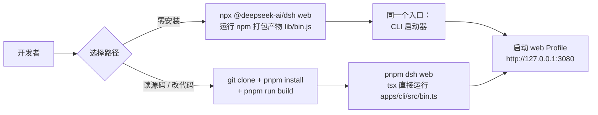
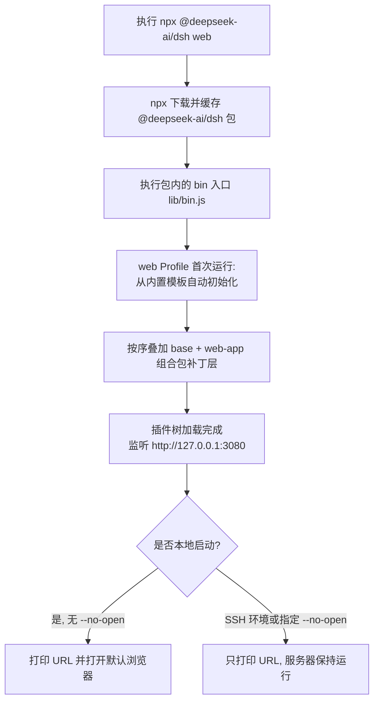
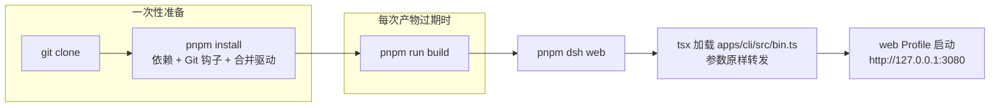

DeepSeek Harness（简称 `dsh`）提供两条彼此独立的运行路径：不想接触源码的开发者可以用一条 npm 命令直接启动完整产品；希望阅读或修改代码的开发者则可以在仓库检出内完成一次构建后直接运行 TypeScript 入口。本页只回答一件事——"怎样把 `dsh` 第一次跑起来"，包括两种方式各自的命令、幕后发生了什么、以及首次启动时应当观察到的现象。环境搭建的深入话题（pnpm 钩子、类型检查门禁）属于下一页[开发环境搭建：Node/pnpm 前置条件、安装钩子与首次类型检查](3-kai-fa-huan-jing-da-jian-node-pnpm-qian-zhi-tiao-jian-an-zhuang-gou-zi-yu-shou-ci-lei-xing-jian-cha)的范畴，这里只做必要衔接。

Sources: [README.md](README.md#L5-L13)

## 两条路径，一个入口

无论选择哪条路径，最终运行的入口都是同一个东西：名为 `@deepseek-ai/dsh` 的 CLI 包，其命令行程序名叫 `dsh`。它是一个 **Profile（档案）启动器**——负责把一组有序的插件组合包层叠起来并引导启动，例如 `dsh web` 就是 `--profile web` 的硬编码别名。理解了这一点，下面两条路径的区别就很直观了：npm 路径运行的是发布到 npm 注册表的已打包产物（`lib/bin.js`），而源码路径通过仓库根的一个脚本直接以 `node --import tsx/esm` 方式运行 TypeScript 源文件 `apps/cli/src/bin.ts`，跳过打包环节并原样转发每一个参数。



Sources: [apps/cli/package.json](apps/cli/package.json#L31-L33), [apps/cli/src/bin.ts](apps/cli/src/bin.ts#L2-L6), [package.json](package.json#L141)

## 开始前的最小准备

npm 路径的前置条件只有一条：安装 Node.js。仓库对运行时的约束在根清单中声明为 `^22.19.0 || >=24.0.0`，也就是 Node 22.19 以上或 24 及以上版本；低于该下限的版本在安装或执行阶段会因引擎检查而失败。CI 覆盖 22.19、24 与 26 三个版本线。对初学者而言，直接安装当前 LTS 的 24.x 即可满足要求。另外要提醒的是，`dsh` 目前处于 developer preview 阶段，兼容性破坏性变更会频繁出现，这是评估升级节奏时应纳入考量的背景信息。

| 维度 | npm 一行命令 | 源码构建运行 |
|---|---|---|
| 适用人群 | 只想试用产品的用户 | 阅读/修改代码的贡献者 |
| 必备工具 | Node.js ≥ 22.19 或 ≥ 24 | Node.js、Git 2.26+、Corepack pnpm |
| 运行产物 | npm 注册表上的已打包 JS | 仓库内源码（经 tsx 直接执行） |
| 需要构建 | 否 | 是（首次及产物过期后） |
| 典型命令 | `npx @deepseek-ai/dsh web` | `pnpm dsh web` |

Sources: [package.json](package.json#L7-L10), [docs/development.md](docs/development.md#L11), [README.md](README.md#L9-L11)

## 路径一：一行命令从 npm 启动

安装好 Node.js 后，在任何目录执行：

```sh
npx @deepseek-ai/dsh web
```

这条命令默认会做三件事：启动 Web UI 服务、监听 `http://127.0.0.1:3080`、并在本地启动场景中自动打开系统默认浏览器。三件事之间有一个值得注意的实现细节——服务器只有在完整的插件加载树落定之后才会触发浏览器的打开动作，避免用户点击进入一个尚未就绪的页面。如果你是通过 SSH 远程启动，浏览器打开行为会被抑制，终端只打印主机 URL，因为本地转发地址由 SSH 客户端或编辑器掌管；若不想打开浏览器，追加 `--no-open` 即可让服务器独立运行。此外 `--host 0.0.0.0` 这类对外暴露监听地址的写法目前会被刻意拒绝并以用法错误退出——这是一条面向安全的设计边界，不是缺陷。

```sh
dsh web              # 本地启动：服务 + 自动开浏览器
dsh web --no-open    # 只起服务，不开浏览器
```



首次启动前还有一件可选项需要说明：真实的模型调用依赖 DeepSeek API 密钥。适配器按固定顺序查找凭据——继承自进程的环境变量 `$DEEPSEEK_API_KEY`、`$DSH_HOME/.credentials.yaml`、调用目录下的 `.env` 文件、最后是 `$DSH_HOME/.env`（其中 `$DSH_HOME` 未显式配置时默认为 `~/.dsh`）。四种来源任选其一即可，密钥可以是环境变量形式，也可以写入任一 `.env` 文件；`DEEPSEEK_BASE_URL` 为可选项，缺省指向公共 API。

Sources: [README.md](README.md#L15-L23), [apps/cli/reference/README.md](apps/cli/reference/README.md#L65-L77), [apps/cli/reference/README.md](apps/cli/reference/README.md#L87-L89), [packages/util/home-paths/README.md](packages/util/home-paths/README.md#L5-L9)

### 命令行参数怎么放：启动器的标志在前

初次使用最容易踩的坑是参数的位置。`dsh` 启动器只解析属于自己的少量标志，其余参数一律原样转交给被引导的应用。规则可以概括为一句话：**启动器标志在前，第一个无法识别的词开始就是应用参数**。因此下面的示例里，`--help` 出现在不同位置时意义完全不同：

```sh
dsh --help                # 启动器自己的帮助
dsh web --help            # 属于 web 应用的帮助
dsh --profile web --port 8080   # --port 属于 web 应用
dsh --profile headless "run the tests"   # 任务文本是位置参数
```

web 应用自己拥有的旗标为 `--host`、`--port`、可重复出现的 `--trusted-host` 和 `--no-open`。记住这张小表，就覆盖了快速开始阶段的绝大部分参数需求。

Sources: [apps/cli/README.md](apps/cli/README.md#L18-L28), [apps/cli/reference/README.md](apps/cli/reference/README.md#L67-L75), [apps/cli/reference/README.md](apps/cli/reference/README.md#L30-L34)

## 路径二：从源码构建并运行

希望阅读实现或参与贡献的用户走第二条路径。官方 README 给出的完整序列只有五行：

```sh
git clone https://github.com/deepseek-ai/deepseek-harness.git
cd deepseek-harness
pnpm install
pnpm run build
pnpm dsh web
```

这五行背后的分工非常清晰：`pnpm install` 安装依赖并同时配置工作树本地的 Git 钩子与翻译配对合并驱动（该集成由 postinstall 脚本完成，若被缓存跳过可手动执行 `node scripts/install-lefthook.mjs` 补齐）；`pnpm run build` 负责生成仓库工件；`pnpm dsh web` 则使用这些**已构建好的工件**启动，自身不再触发重新构建。与前一条路径相比，唯一的结构性差异是：你运行的是源码树中的 TS 入口而非打包后的 JS。



Sources: [README.md](README.md#L25-L37), [docs/development.md](docs/development.md#L16-L32), [apps/cli/README.md](apps/cli/README.md#L45-L47)

### `pnpm run build` 在五个阶段做了什么

`pnpm run build` 是整个源码路径中最耗时的步骤，理解它的阶段划分有助于在出错时定位问题。根构建遵循生成的依赖顺序，共五个阶段：Host 侧的 `tsc -b tsconfig.host.json` 编译（此阶段同时运行 Typert 类型反射分析，生成 Host 反射工件和 Host-for-Client 远程投影）、Host 侧的 `tsdown` 打包、Client 侧的 `tsc -b tsconfig.client.json` 类型编译、Client 侧的 `tsdown` 打包，最后是 `pnpm run build:web` 构建浏览器端前端。Typert 只在 Host 打包阶段运行，这就是为什么 Client 阶段必须排在 Host 之后。

| 阶段 | 命令 | 产出 |
|---|---|---|
| 1 | `tsc -b tsconfig.host.json` | Host 类型编译与 Typert 反射工件 |
| 2 | `tsdown --env.DSH_BUILD_FACE host` | Host 包的打包产物 |
| 3 | `tsc -b tsconfig.client.json` | Client 包类型编译 |
| 4 | `tsdown --env.DSH_BUILD_FACE client` | Client 插件的双面产物 |
| 5 | `pnpm run build:web` | 浏览器前端静态资源 |

`pnpm dsh` 脚本的实现在根 package.json 中只有一行：`node --import tsx/esm apps/cli/src/bin.ts`。它意味着"以 tsx 预导入方式运行这个 TypeScript 文件"，因此每次执行都直接读到最新源码——但也正因为如此，若某个包的产物缺失，生产型 runner 会报错提示你先执行 `pnpm run build`。一个实用的心智模型是：**改的是源码且不涉及生成工件时，重跑 `pnpm dsh` 即可看到效果；涉及类型反射或前端资源时，需要先重跑构建**。供发布使用的等价官方构建命令是 `pnpm run build:official`。

Sources: [docs/development.md](docs/development.md#L64-L77), [package.json](package.json#L141), [apps/cli/reference/README.md](apps/cli/reference/README.md#L95-L97), [package.json](package.json#L21)

## 首次启动时发生了什么

无论走哪条路径，第一次运行 `dsh web` 都会经历同样的过程。`bin.ts` 解析参数后按模式动态导入对应的运行器——导入 `web` 模式不会把 `plugin` 或配置转储模式的代码拉进内存。web 与 headless 两个内置 Profile 首次使用时会从随产品发布的模板自动初始化（web 由 base 与 web-app 两个组合包构成；headless 则由 base 与 headless 构成）；其他名字的 Profile 缺失时会明确失败并提示创建方式。初始化产生的 Profile 目录位于 `$DSH_HOME/profiles/<name>`（默认即 `~/.dsh/profiles/web`），内含插件清单与一层属于你自己的补丁文件 `cordis.patch.yml`。

三种模式的职责对照如下，快速开始阶段只需关注前两行：

| 命令模式 | 用途 |
|---|---|
| `dsh web` | `--profile web` 的别名，启动带图形界面的 Web 应用 |
| `dsh --profile headless "任务"` | 新建一次性持久化会话，提交任务，打印最终答案后退出 |
| `dsh plugin --profile <name> <pnpm args>` | 将插件管理操作转发给 Profile 目录中的 pnpm |

headless 模式特别适合自动化场景：它会创建一个全新的持久化 Agent，提交任务文本，等待静默，刷新会话后取出最后一段非空的助手文本连同 `turn/end` 原因一并打印。最后是退出行为——第一次 `SIGINT`/`SIGTERM` 会给插件树最多五秒时间优雅地清理资源，第二个信号则强制立即退出；`SIGTERM` 正常返回 0，`Ctrl+C` 报告 130。

Sources: [apps/cli/src/bin.ts](apps/cli/src/bin.ts#L27-L53), [apps/cli/reference/README.md](apps/cli/reference/README.md#L9-L15), [apps/cli/README.md](apps/cli/README.md#L9-L16), [apps/cli/reference/README.md](apps/cli/reference/README.md#L79), [packages/util/home-paths/README.md](packages/util/home-paths/README.md#L7-L9)

## 常见问题速查

初学者首次启动时最可能遇到的状况集中在下表中。它们都能通过单条命令或一处改动解决，不需要修改源码。

| 现象 | 原因 | 处置方式 |
|---|---|---|
| 安装阶段引擎校验失败 | Node 版本低于 `^22.19.0 \|\| >=24.0.0` | 升级到 Node 24 LTS |
| 模型回复不可用 | 未配置 `DEEPSEEK_API_KEY` | 写入环境变量或任一查找位置的 `.env` 文件 |
| SSH 终端没有弹出浏览器 | 非本地启动时浏览器移交被抑制 | 这是预期行为，使用打印出的主机 URL 手动访问 |
| 需换端口或绑定地址 | 默认监听 `127.0.0.1:3080` | `dsh web --port <n>`；`--host 0.0.0.0` 目前不支持 |
| 改动源码后行为未变 | 运行的是旧构建产物或 tsx 缓存外的生成物 | 重跑 `pnpm run build` 后再 `pnpm dsh` |
| 仓库存了真实密钥的风险 | `.env` 写入了敏感信息 | 保持 `.env` 处于 gitignore 中，切勿提交 |

另有一条判定准则贯穿两个路径：所有模式都将调用 `dsh` 时所在的目录作为默认工作区根。想针对某个项目工作，就在那个项目的目录里启动 `dsh`。

Sources: [package.json](package.json#L7-L10), [docs/development.md](docs/development.md#L92-L101), [apps/cli/reference/README.md](apps/cli/reference/README.md#L77-L79), [apps/cli/reference/README.md](apps/cli/reference/README.md#L81)

## 下一步读什么

跑通第一条命令只是起点。按你的目标选择后续路径：想弄清这次运行背后"一切皆插件"的世界观，进入[架构总览：一切皆插件的插件树世界](8-jia-gou-zong-lan-qie-jie-cha-jian-de-cha-jian-shu-shi-jie)；想把源码检出整理成规范的贡献环境，前往[开发环境搭建：Node/pnpm 前置条件、安装钩子与首次类型检查](3-kai-fa-huan-jing-da-jian-node-pnpm-qian-zhi-tiao-jian-an-zhuang-gou-zi-yu-shou-ci-lei-xing-jian-cha)，那里完整讲解 Corepack pnpm、安装钩子与首次 `pnpm run typecheck` 门禁；想吃透 Profile、组合包与多层补丁的叠加规则，则继续[CLI 入门：dsh 命令入口、web/headless Profile 与补丁覆盖](4-cli-ru-men-dsh-ming-ling-ru-kou-web-headless-profile-yu-bu-ding-fu-gai)。文档库另有速览页[项目概览：DeepSeek Harness 是什么与为什么值得学习](1-xiang-mu-gai-lan-deepseek-harness-shi-shi-yao-yu-wei-shi-yao-zhi-de-xue-xi)可作为背景铺垫。

针对本页提到的进阶玩法，源码检出的用户还可以尝试仓库自带的一次性演示：需要 API 密钥的 headless 编码代理 `pnpm dsh --profile headless "summarize this workspace"`，能自省并修改自身插件运行时的 cordis 演示 `pnpm run demo:cordis`，以及经 JSON-RPC stdio 暴露会话的 ACP 自动化服务器 `pnpm run demo:acp`。