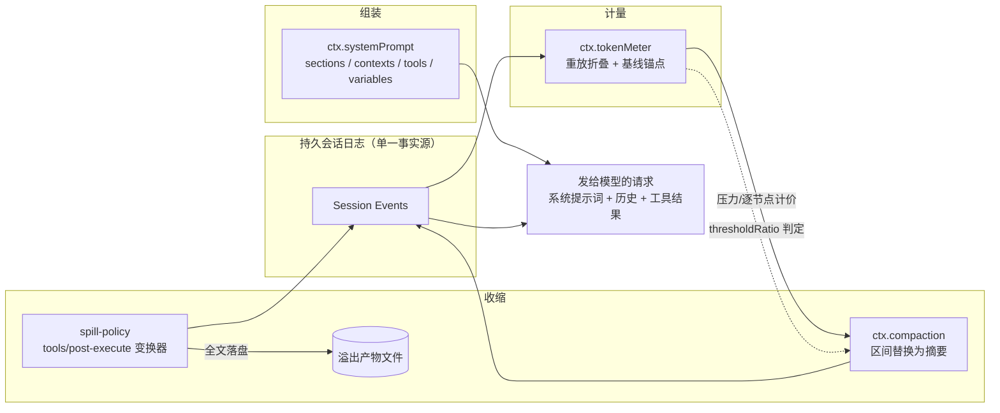
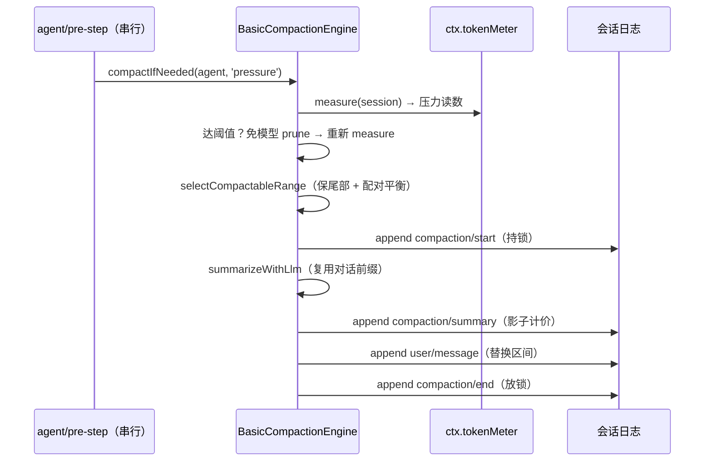
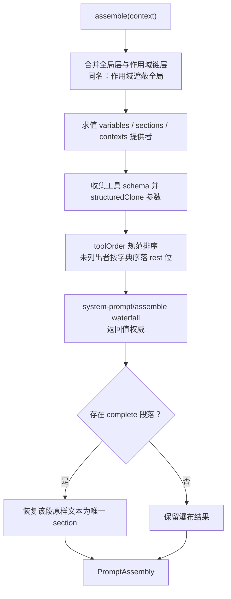

DeepSeek Harness 把"模型看到什么"当作一个可 engineering 的第一性问题：上下文窗口是稀缺资源，而模型可见内容由三部分构成——系统提示词、对话历史、工具结果。本页剖析管理这三部分的四个子系统：**Token 计量**回答"现在用了多少"，**结果溢出**回答"单个工具结果过大怎么办"，**压缩**回答"整体历史过长怎么办"，**提示词片段组装**回答"每次请求的静态骨架如何拼装"。这四个子系统都围绕同一个不变量运转——[会话日志模型](12-hui-hua-ri-zhi-mo-xing-mo-xing-ke-jian-ji-yi-ji-lu-de-bu-bian-liang-yu-xiao-xi-tou-ying)所确立的"模型可见即已记录"原则。

Sources: [types.ts](packages/llm/token-meter/src/types.ts#L1-L9) · [compaction.md](docs/subsystems/compaction.md#L1-L7)

## 全景：围绕会话日志的四个协作者

四个子系统并非四个孤立特性，而是以持久会话日志为单一事实源的闭环：计量服务通过**重放折叠**（replay fold）从日志推导压力读数；压缩引擎消费计量读数、向日志追加 lock/summary/end 事件并替换表面区间；溢出策略在工具执行流水线的瀑布钩子里改写结果、把全文存到会话级溢出产物；提示词注册表则在每次请求前把各插件贡献的片段组装成系统提示词与运行时上下文快照。

关键的分界线是：溢出解决**单条**结果超限（字节级、即时），压缩解决**累计**历史超限（token 级、逐步边界触发），计量为两者提供统一的价格语言，而组装决定了每个请求的固定骨架成本。这三层收缩手段的先后关系也体现了成本梯度——能不调用 LLM 就不调用（prune）、能存文件就不进上下文、能替换区间就不截断语义。

Sources: [index.ts](packages/compaction/compaction-basic/src/index.ts#L1-L12) · [index.ts](packages/spill/spill-policy/src/index.ts#L1-L18)

## Token 计量：`ctx.tokenMeter` 的重放折叠模型

### 固定密度启发式计价

`@deepseek-ai/dsh-token-meter` 的核心假设是：在拿到精确分词器之前，用一个**固定密度启发式**为所有内容定价——每 4 个字符折算 1 个 token，每个内容块额外加 4 token 的 JSON 框架开销，每条消息再加 4 token 的角色字段开销。这个纯函数同时服务于计量服务实例与"上下文分解"投影，保证两个表面为相同内容算出相同数字。未知类型的块（`ContentBlockMap` 可合并扩展）按其 `JSON.stringify` 长度保守计价，工具调用按名称与参数串分别折算。

Sources: [estimate.ts](packages/llm/token-meter/src/estimate.ts#L13-L15) · [estimate.ts](packages/llm/token-meter/src/estimate.ts#L21-L57)

### 三态基线与增量重放

计量服务的精妙之处在于**基线锚点**机制：它并非每次都从头启发式估算整个请求，而是优先复用最近一次成功调用的提供方真实用量。`TokenMeasurementBaseline` 是一个三态判别联合——`usage` 表示有可复用的真实用量锚点，`estimated` 表示只能全启发式定价，`none` 表示空会话。复用条件相当保守：最近成功调用的**规范请求信封**必须与当前请求头一致，且其总量不得低于该调用的完整启发式锚点（防止用低估的旧用量高估当前余量）；任一条件不满足，整个信封与表面就重新启发式定价。

Sources: [types.ts](packages/llm/token-meter/src/types.ts#L10-L28) · [index.ts](packages/llm/token-meter/src/index.ts#L100-L137)

折叠状态按会话隔离存放在 `WeakMap` 中，通过 `_sync` 从上次消费到的日志位置**增量**推进到当前持久尾部，构造函数还会监听 `session/event` 让已读会话主动追平以降低读延迟。每次 `measure()` 调用克隆全部位置节点并返回深冻结的不可变快照，因此计量是 O(表面) 的；`logRevision` 字段记录本次测量消费到的事件数，是快照的版本戳。快照中的 `totalTokens` 等于 `baseline + surfaceDeltaTokens`（夹到非负），`nodes` 则是按位置顺序排列的逐节点计价——这份逐节点价格正是压缩引擎做保留区间选择的输入。

| 字段 | 含义 |
|---|---|
| `logRevision` | 消费的持久事件数（快照版本） |
| `baseline` | `usage` / `estimated` / `none` 三态锚点 |
| `surfaceDeltaTokens` | 相对锚点的有符号表面重定价 |
| `totalTokens` | 当前请求压力（非负） |
| `surfaceTokens` | 当前表面的启发式总价格 |
| `nodes` | 位置序的逐节点 `{ seq, tokens }` 列表 |

Sources: [index.ts](packages/llm/token-meter/src/index.ts#L159-L181) · [index.ts](packages/llm/token-meter/src/index.ts#L85-L98) · [index.ts](packages/llm/token-meter/src/index.ts#L139-L147)

## 结果溢出：把超大工具结果移出上下文

### 接缝与服务契约

溢出存储是一个典型的[能力接缝](13-neng-li-jie-feng-she-ji-mo-shi-fs-lsp-web-skill-yu-mcp-mo-xing-ke-jian-neng-li-zu)拆分：抽象服务 `SpillStore`（`ctx.spillStore`）只有一个方法 `saveText(input) → Promise<SpillRef>`——把全文**逐字**持久化，返回不透明定位符、精确字节数和面向模型的取回指引。`SpillLocator` 是品牌化的模型可见句柄：本地后端渲染为文件路径，远程后端可以是 URI 或键，消费方必须配合 `retrievalHint` 渲染而**不得解析**。`SpillOwner.sessionId` 只是保存时的存储命名空间——fork 出的会话继承种子日志里已有的定位符（不复制、不转属），fork 后新产生的溢出才用子会话 id。

Sources: [types.ts](packages/spill/spill/src/types.ts#L13-L73) · [spill.md](docs/subsystems/spill.md#L7-L13)

### 策略插件的两条臂

`spill-policy` 插件不拥有任何存储或预览机制（预览来自 `@deepseek-ai/dsh-output-retention`，存储来自 `ctx.spillStore`），它只决定**何时**溢出并组装通知。它的第一条臂挂在 `tools/post-execute` 瀑布上：先通过 `next()` 委托让下游监听器（如 hook）先定型结果，再对**被接受**的纯文本结果判定——只要混入任何非文本块就原样放行，超过 `maxInlineBytes`（UTF-8 字节）才溢出。第二条臂挂在 `tools/code-dispatch-log` 瀑布上，用同样的方式约束 `tool/code-dispatch` 事件中超大 `run_code` 子调用结果的**日志副本**——程序返回值本身不动，只是重放与 UI 改从溢出产物读全文。

| | 模型可见臂 | 持久日志臂 |
|---|---|---|
| 挂载点 | `tools/post-execute` 瀑布 | `tools/code-dispatch-log` 瀑布 |
| 约束对象 | 进入模型上下文的结果 | 事件日志中的副本 |
| `read` 工具 | 跳过（避免 read→spill→read 循环） | 照常约束（日志副本非模型上下文） |
| 嵌套复合调用 | 跳过（由日志臂约束） | 约束 |

Sources: [index.ts](packages/spill/spill-policy/src/index.ts#L1-L42) · [index.ts](packages/spill/spill-policy/src/index.ts#L199-L232)

### 预览组装的字节级严谨性

替换文本由两部分组成：头尾各半的预览（`TextRetainer` 的 `headTail` 策略，预算向上/向下取整劈成两半，在 UTF-8 边界切割）加上一行溢出通知，通知里含省略量描述、定位符与取回指引。一个容易忽视的细节是**通知字节数必须在预算内预留**：策略用"最坏情况省略量"（总字节数，其位数必然覆盖真实省略量的位数）为通知定出安全上界，从 `maxInlineBytes` 中扣除后再给预览分配预算，保证替换结果永不超帽子——否则一个仅略超限的结果可能替换后反而更大。若连通知本身都超帽（帽子太小或溢出根路径太长），策略放弃替换、保留原文；已写的溢出文件成为无害孤儿。整个策略是**尽力而为**的：无会话属主、无后端、存储失败都只记警告并保留内联结果，溢出失败绝不能把成功的工具调用变成 `isError`。

Sources: [index.ts](packages/spill/spill-policy/src/index.ts#L113-L156) · [index.ts](packages/spill/spill-policy/src/index.ts#L144-L155) · [index.ts](packages/util/output-retention/src/index.ts#L93-L110)

### 本地后端的存储安全

`spill-local` 把文件系统机制从服务类中剥离成可单测的纯函数：默认根目录是 OS 临时目录下惰性创建的 `mkdtemp` 私有目录（0700，不可预测后缀，防止共享机器上其他用户预读或植入符号链接）；会话子目录取 `sha256(sessionId)` 的 12 位十六进制前缀；文件名是不可预测的随机十六进制前缀加经 `encodeSegment` 净化的建议名——后者是一个对**所有** JS 字符串单射的安全段编码（`~XXXX` 转义），中性化 `../`、绝对路径、NUL 与分隔符；写文件用 `'wx', 0o600` 独占打开，任何已存在路径（无论是否符号链接）都会让写入失败，预植目标因此无法劫持写入。

Sources: [store.ts](packages/spill/spill-local/src/store.ts#L26-L40) · [store.ts](packages/spill/spill-local/src/store.ts#L52-L90) · [store.ts](packages/spill/spill-local/src/store.ts#L114-L121)

## 压缩：以日志事件为锁的区间替换

### 接缝与三个入口

`CompactionEngine`（`ctx.compaction`）是压缩的抽象接缝，暴露三个入口：`compactIfNeeded(agent, trigger, signal)` 供自动策略调用，trigger 区分 `'pressure'`（常规压力）与 `'context-overflow'`（提供方确认的上下文溢出）；`compactNow(...)` 在空闲会话强制做一次低于压力阈值的有用收缩；`compactRegion(start, end, ...)` 对显式区间强制替换。成功返回的 `CompactionResult` 携带三个记账事件的 seq、安全摘要投影、被遮蔽区间的**表面位置**范围（注意 `shadowedRange.start` 可能大于 `end`，因为替换会在旧位置落一个新高 seq 节点）、被遮蔽节点的权威 seq 列表以及被遮蔽内容的估算 token 数。

Sources: [types.ts](packages/compaction/compaction/src/types.ts#L92-L119) · [compaction.md](docs/subsystems/compaction.md#L52-L110)

### 日志即锁：`compaction/*` 事件协议

压缩的并发安全完全建立在日志事件上。三个事件都是**仅日志**类型（不进表面、不扩展 `SurfaceEventType`）：`compaction/start` 先落盘获取锁，随后摘要化、`compaction/summary` 记录、替换用 `user/message` 依次落盘，最后 `compaction/end` 释放锁。锁最后释放意味着崩溃中途会留下可检测的孤儿锁。编号 owner（`turn` 数字）标识回合内的自动压缩且必须严格被该开放回合包含，`null` 标识回合之间的独立手动事务。这里还有一个**影子计价协议**：`compaction/summary`（或 prune 场景的 `compaction/prune`）必须紧跟在其驱动的表面替换事件之前，声明被替换区间的精确启发式价格，纯消费方因此无需自留逐节点价格即可完成减法。

| 事件 | 职责 |
|---|---|
| `compaction/start` | 获取锁；`turn` 区分回合内自动与独立手动 |
| `compaction/summary` | 摘要投影 + 影子计价 + 模型调用事实（可从日志重建） |
| `compaction/prune` | 免模型剪除替换的影子计价（共享协议） |
| `compaction/end` | 释放锁；`error` 记录失败尝试 |

Sources: [types.ts](packages/compaction/compaction/src/types.ts#L16-L89) · [compaction.md](docs/subsystems/compaction.md#L9-L17)

### 区间选择：保留尾部与配对平衡

`selectCompactableRange` 实现了"锚定头部的区间选择"：从表面**尾部**向前累加逐节点价格，直到累加值达到 `retainTokens` 预算，得到保留边界；随后向头部回退，直到边界前的助手工具调用与其结果**配对平衡**（复用接缝导出的 `toolPairingBalancedBefore` 校验），绝不把调用/结果对劈开；若回退到位置 0 仍无安全边界则返回 `null`（单个超大的不可分单元无法靠表面压缩修复）。进入事务前还必须校验计量快照的表面与当前会话表面完全一致——防止在过期价格上做替换决策。

Sources: [region.ts](packages/compaction/compaction-basic/src/region.ts#L84-L131)

### 压力策略：比例阈值与按模型覆写

`compaction-basic` 的默认策略是：请求压力达到该模型上下文窗口的 **80%**（`thresholdRatio` 0.8）即触发，替换时**逐字保留**最近的 **16%**（`retainRatio` 0.16）尾部。配置解析分两步走——先在加载时校验并解析服务默认值与按 provider/model 精确匹配的 `modelPolicies` 覆写表，再由 `resolveCompactSpec` 依据适配器声明的 `contextWindow` 把比例缩放为具体 token 预算，并强制不变量 `retainTokens < thresholdTokens`（容量无关的冲突在加载期即被拒绝）。摘要调用的路由模型默认沿用会话最近路由的 provider/model，也可为摘要单独配置 `summarizationProvider`/`summarizationModel`。

Sources: [config.ts](packages/compaction/compaction-basic/src/config.ts#L17-L18) · [config.ts](packages/compaction/compaction-basic/src/config.ts#L69-L100) · [config.ts](packages/compaction/compaction-basic/src/config.ts#L127-L160)

`compactIfNeeded` 的执行序体现"先便宜后昂贵"：压力路径先解析模型容量并比对阈值；一旦够格，先调用可选的 `ctx.toolResultPruner` 做**免模型**剪除（每条剪除产出一条 `compaction/prune` 影子计价事件加一条替换事件，并报告码点减少量），再通过计量单例重新测量——prune 之后的重测可能已低于阈值，摘要调用就省掉了；仍超阈值才选区间做摘要压缩，并按 `compactionRetries` 重试，全部尝试后仍超阈值则抛错。

Sources: [index.ts](packages/compaction/compaction-basic/src/index.ts#L248-L332) · [compaction.md](docs/subsystems/compaction.md#L118-L128)

### 溢出恢复与手动入口

溢出恢复是自动策略的第二臂：当请求以 `CONTEXT_WINDOW_EXCEEDED_CODE` 失败时，`agent/request-error` 监听器按目标路由解析策略、检查 `maxOverflowRetries` 次数预算，然后以 `'context-overflow'` 触发压缩——该触发**绕过**常规阈值与保留尾部策略（`retainTokens` 传 0），强制做一次有用的平衡收缩，成功后返回 `{ kind: 'retry' }` 让请求重来。手动 `compactNow` 则运行在 `agent.runMaintenance` 维护模式下：同步开始空闲任务、以独立括号（`owner: null`）落锁、只要求**选中区间**稳定（回合中间注入的上下文可以落在括号之间）、成功后把括号做持久化 checkpoint。

Sources: [index.ts](packages/compaction/compaction-basic/src/index.ts#L163-L223) · [index.ts](packages/compaction/compaction-basic/src/index.ts#L360-L399)

### 摘要即前缀复用的辅助调用

默认摘要器最值得学习的设计是 **KV 缓存亲和**：`summarize()` 把被压缩对话以最近路由请求的原样系统提示词、工具与消息前缀重放给 `ctx.llm.stream()`，压缩指令作为**最后一条**用户消息追加——这次辅助调用因此成为上一路由请求的真正前缀，提供方的 KV 缓存得以复用而非失效。指令要求输出固定的 Markdown 检查点结构（原始意图、关键技术概念、文件与代码、错误与修复、待办、当前工作、下一步、关键上下文八个部分），并明确"若对话中已有先前的 `<compacted-summary>` 块，合并新信息而非照抄"。落盘的替换消息带上检查点前言框架，让模型把它当作既定背景而非需要回应的内容。

Sources: [index.ts](packages/compaction/compaction-basic/src/index.ts#L226-L246) · [summarizer.ts](packages/compaction/compaction-basic/src/summarizer.ts#L24-L77)

## 提示词片段组装：分层注册表与严格渲染

### 四类贡献与作用域遮蔽

`ctx.systemPrompt` 是每次模型步骤前的输入注册表，接受四类贡献：**sections**（有序段落，拼接为系统提示词）、**contexts**（有序动态上下文，落为持久用户角色快照）、**tools**（工具 schema 提供者）、**variables**（被 `{{name}}` 引用的命名变量）。注册层级即调用上下文的作用域：全局层经 `dsh` 根上下文注册，agent 专属层经 `agent.ctx` 注册；同名时**作用域层遮蔽全局层**——这个机制正是部署人格可被 agent 预设替换的基础：`PERSONA_SECTION` 导出的固定段名 `'deployment:persona'` 让"替换"与"重复"成为命名问题的差别。

Sources: [index.ts](packages/core/system-prompt/src/index.ts#L337-L455) · [index.ts](packages/core/system-prompt/src/index.ts#L122-L140) · [system-prompt.md](docs/subsystems/system-prompt.md#L7-L13)

段落排序采用**序带约定**：`-100` 是固定的 harness 身份（"You are an AI agent powered by DeepSeek Harness."），`0` 是部署人格，工具指引使用 `100–199`，其他负数序也渲染在人格之前。工具 schema 的排序则由配置 `toolOrder` 决定——列表中必须恰好出现一次保留标记 `'<unlisted-tools>'`（`TOOL_ORDER_REST`），未列出的工具按字典序插入该位置；缺省时全部按字典序排序，保证跨机器确定性。重复注册、非有限 order、非法变量名都在注册或加载时即刻抛错。

| 序带 | 归属 |
|---|---|
| `-100` | harness 身份（固定开场白） |
| `< 0` | 其他身份性段落（渲染在人格前） |
| `0` | 部署人格 `deployment:persona` |
| `100–199` | 工具指引段落 |

Sources: [index.ts](packages/core/system-prompt/src/index.ts#L357-L370) · [index.ts](packages/core/system-prompt/src/index.ts#L142-L175) · [README.md](packages/core/system-prompt/README.md#L9-L14)

### `assemble()` 流水线与 complete 例外

每次组装经历五步：合并全局层与作用域链层（作用域遮蔽同名全局）、求值全部提供者、对工具参数做 `structuredClone` **参数脱离**（防止提供者持有的对象被下游监听器共享突变）、应用规范工具排序、最后运行作用域过滤的 `system-prompt/assemble` 瀑布——返回值权威。唯一的水瀑布例外是 `complete: true` 段落：合作式瀑布照常运行（工具、上下文、变量仍可解析），但完成后该段的**原样文本**被恢复为唯一 section——监听器无法往这个作用域的系统提示词里添加或替换任何内容；同时生效的多个 complete 段落直接使组装失败。

Sources: [index.ts](packages/core/system-prompt/src/index.ts#L467-L542) · [index.ts](packages/core/system-prompt/src/index.ts#L44-L72)

### 严格变量插值

`renderPrompt` 把每个 section 的 `{{variable}}` 引用按注册变量严格插值后以空行拼接。严格性体现在四个分支：残缺引用（有 `{{` 且后面还有 `}}`）抛错，而孤立的 `{{` 后再无 `}}` 视为字面散文；名字不匹配 `[a-z][a-z0-9_]*` 抛错；未注册的名字（含 `{{constructor}}` 这类原型链名字——用 `Object.hasOwn` 查找）抛错并列出全部已注册变量；已注册但本次求值为 `undefined` 也抛错。替换值**不会被再次扫描**，杜绝嵌套注入。

Sources: [index.ts](packages/core/system-prompt/src/index.ts#L204-L217) · [index.ts](packages/core/system-prompt/src/index.ts#L257-L295)

### 动态运行时上下文快照

`PromptContext` 是 `PromptSection` 的缓存安全对应物：它的贡献不在系统提示词里逐请求重复，而是由宿主循环物化为一条**持久的用户角色快照**追加在保留历史之后，且只在内容变化或被压缩移除时才落新快照——这是 KV 缓存友好的"新鲜事实"通道。快照带固定前缀 "Current runtime context. This snapshot supersedes earlier runtime-context snapshots."，新旧快照的取代关系由文本本身声明。`suppressRuntimeContext()` 可以在调用作用域内压掉全部动态上下文贡献而不动拥有这些事实的服务。

Sources: [index.ts](packages/core/system-prompt/src/index.ts#L224-L255) · [index.ts](packages/core/system-prompt/src/index.ts#L74-L82) · [system-prompt.md](docs/subsystems/system-prompt.md#L62-L77)

### 上下文贡献包

`packages/context/` 下的产品插件是这条通道的标准用户，它们添加模型可见请求上下文而不定义任何工具：

| 包 | 职责 | 机制 |
|---|---|---|
| `agent-instructions` | 工作区指令（AGENTS.md 兼容文件） | 基线指令在首个请求前进入持久上下文；fs 工具触碰 read/write/edit 后把项目嵌套、变更与移除的指令"投递进收件箱" |
| `time-context` | 当前时刻与流逝时间 | 代理 `agent/pre-step`，为合格步骤追加带来源的时间读数（含浏览器时区解析与 `refreshIntervalMs` 节流） |
| `session-reference` | 其他会话的有界快照 | `ctx.sessionReferenceResolver` 服务 |
| `file-reference` | `@file` 语法与发现接缝 | `ctx.fileReferences` 服务 + 本地提供者 |
| `tmux-context` | tmux 位置上下文 | — |

以 `time-context` 为例：它的 pre-step 监听器在决策放行后采样时钟，按 `refreshIntervalMs` 与本插件上次注入的时间差决定是否节流，渲染文本包含采样时刻、浏览器时区判定与"距前一条模型可见消息/步骤上下文的流逝时间"。这种"持久、带来源、可节流"的设计让时间这类易变事实既对模型可见，又不破坏前缀缓存的稳定性。

Sources: [README.md](packages/context/README.md#L7-L16) · [index.ts](packages/context/agent-instructions/src/index.ts#L1-L10) · [index.ts](packages/context/time-context/src/index.ts#L185-L210)

## 协同：一条消息的完整生命周期

把四个子系统串起来看一次典型回合：用户消息进入前，`agent-instructions` 已把工作区基线指令注入持久上下文；`agent/pre-step` 上压缩引擎与时间上下文各自把关——前者用 `ctx.tokenMeter` 测量压力，超过路由模型容量的 80% 就先剪除工具结果再摘要压缩；请求组装时 `systemPrompt.assemble()` 拼出系统提示词、规范排序的工具 schema 与变量插值，宿主循环把动态上下文快照追加进历史；工具执行后 `spill-policy` 在 post-execute 瀑布上把超限的纯文本结果替换为"头尾预览 + 定位符 + 取回指引"，全文落盘到会话私有目录；若提供方仍返回上下文超限错误，溢出恢复臂强制收缩并 `{ kind: 'retry' }` 重放请求。全程只有表面事件是模型可见的，所有记账都活在日志里——这正是压缩事件"仅日志"设计与会话投影模型的合流点。

Sources: [index.ts](packages/compaction/compaction-basic/src/index.ts#L99-L160) · [index.ts](packages/core/system-prompt/src/index.ts#L467-L542)

这四个子系统的边界也值得复述一遍：**溢出**是字节级、单结果、尽力而为的即时手段；**剪除**是免模型的中间档；**压缩**是 token 级、调用 LLM 的重量级手段，且其事务协议保证了崩溃可检测、失败留痕；**计量**为前两者的所有决策提供统一且保守的价格语言；**组装**则在请求边界定义了所有这些内容的骨架成本与缓存形态。理解了这套分层，你就掌握了把任意长会话约束在任意窗口内的完整工具箱。

Sources: [spill-policy index.ts](packages/spill/spill-policy/src/index.ts#L1-L42) · [index.ts](packages/compaction/compaction-basic/src/index.ts#L248-L332)

## 延伸阅读

- 回合与步骤事件流的完整时序见[轮次流程剖析：turn/step 事件流与 Agent 生命周期扩展点](11-lun-ci-liu-cheng-pou-xi-turn-step-shi-jian-liu-yu-agent-sheng-ming-zhou-qi-kuo-zhan-dian)；本文引用的 `agent/pre-step` 与 `agent/request-error` 都是该生命周期上的扩展点。
- "模型可见即已记录"不变量与表面/遮蔽语义见[会话日志模型](12-hui-hua-ri-zhi-mo-xing-mo-xing-ke-jian-ji-yi-ji-lu-de-bu-bian-liang-yu-xiao-xi-tou-ying)；压缩的区间替换与影子计价协议建立在其上。
- `tools/post-execute` 与 `tools/code-dispatch-log` 瀑布的把关语义见[工具注册表、waterfall 把关事件与执行流水线](14-gong-ju-zhu-ce-biao-waterfall-ba-guan-shi-jian-yu-zhi-xing-liu-shui-xian)。
- `ctx.llm.stream()` 辅助调用与提供方用量词汇见[LLM 流式词汇表与多提供方适配器接入](15-llm-liu-shi-ci-hui-biao-yu-duo-ti-gong-fang-gua-pei-qi-jie-ru)。
- 会话日志的持久化与投影机制见[会话持久化数据平面：JSONL/SQLite 后端、投影缓存与全文检索](19-hui-hua-chi-jiu-hua-shu-ju-ping-mian-jsonl-sqlite-hou-duan-tou-ying-huan-cun-yu-quan-wen-jian-suo)。
- 下一站：上下文管理只是模型交互的一半，另一半是人这一侧——见[人机协作平面：审批流、权限预设、命令与向用户提问](21-ren-ji-xie-zuo-ping-mian-shen-pi-liu-quan-xian-yu-she-ming-ling-yu-xiang-yong-hu-ti-wen)。