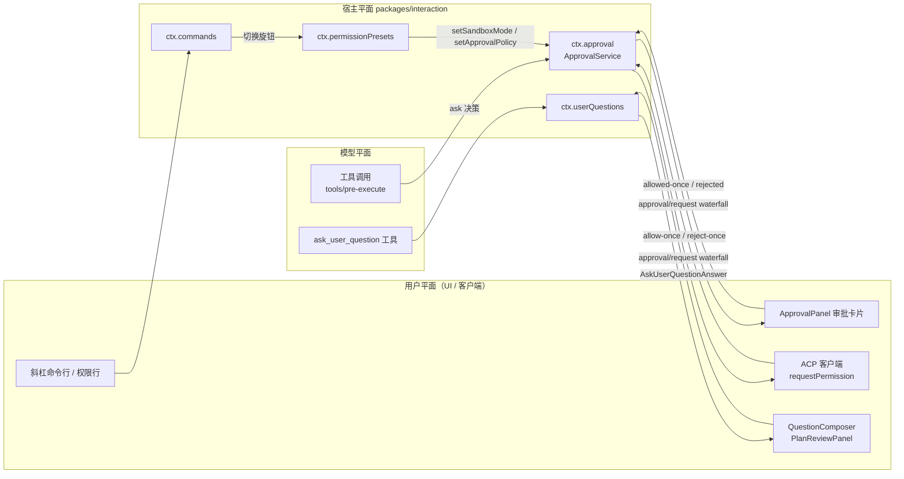
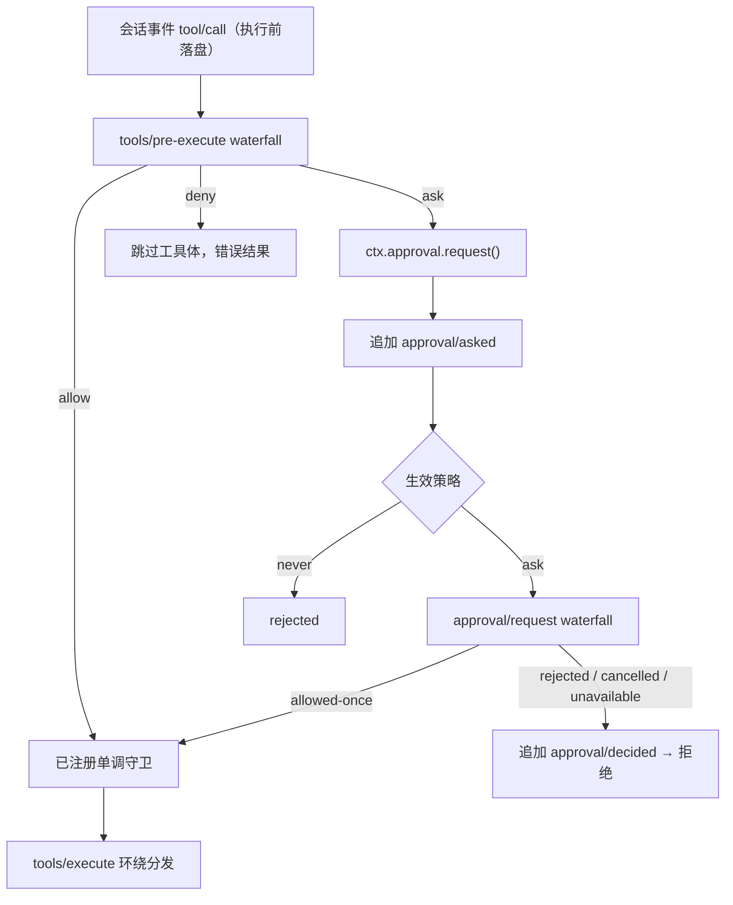

agent 的自主性越强，"人什么时候被叫进来、看到什么、能决定什么"就越需要一套明确的契约。DeepSeek Harness 把这份契约集中放在 `packages/interaction/` 下的四个包里：**user-approval**（审批流）、**permission-presets**（权限预设）、**commands**（用户命令）与 **user-questions**（向用户提问，含面向模型的 `tool-ask-user`）。它们共同构成"人机协作平面"：向上向 UI 提供方暴露稳定词汇，向下向模型与工具流水线提供确定性的执行语义。本页以中间开发者的视角剖析这四条通道的架构角色、数据流与失败语义。

Sources: [index.ts](packages/interaction/user-approval/src/index.ts#L1-L200) · [index.ts](packages/interaction/permission-presets/src/index.ts#L1-L200) · [index.ts](packages/interaction/commands/src/index.ts#L1-L200) · [index.ts](packages/interaction/user-questions/src/index.ts#L1-L144)

## 平面全景：四条通道，一套设计语法

四条通道的触发方各不相同——审批由工具流水线触发、预设与命令由用户触发、提问由模型触发——但它们共享同一套设计语法。第一，**fail-closed（失败即关闭）**：审批链上缺失、抛异常或不合规的应答者产生 `unavailable` 而非放行；第二，**审计与模型可见性分离**：`approval/*`、`permission/preset`、`command/*` 等事件仅写入会话日志（可回放、可审计），从不进入模型 transcript，模型通过运行时上下文快照与切换通知感知策略；第三，**单一授权**：审批唯一的放行结果是 `allowed-once`，不存在持久的"永远允许"；第四，**呈现与协议分离**：UI 意图（如 `plan-review`）只改变呈现方式，答案编码保持一致。

Sources: [approval.zh.md](docs/subsystems/approval.zh.md#L90-L101) · [permission-presets.zh.md](docs/subsystems/permission-presets.zh.md#L68-L84) · [commands.zh.md](docs/subsystems/commands.zh.md#L36-L100) · [user-questions.zh.md](docs/subsystems/user-questions.zh.md#L21-L45)

## 审批流：`ask` 决策之后发生什么

### 请求生命周期与审计对

审批接缝回答一个精确的问题："这个具体操作是否可以继续？"。每次 `ctx.approval.request()` 调用铸造一个全新的 `ApprovalRequestId`（品牌类型），它把成对的 `approval/asked` 与 `approval/decided` 审计事件绑定在一起，且不会与工具调用 id 或会话 id 互换。请求结构 `ApprovalRequest` 有意省略工具参数：应答者通过可选的 `callId` 把提示附加到**已经流式输出**的工具调用卡片上，而不是渲染一份可能漂移的参数副本。一个关键的前置条件是：请求必须在**未关闭的轮次内**发出——审计对必须被持久日志的 commit/replay 边界（`turn/start` 到 `turn/end`）封闭，轮次之间的裸事件在重载时与崩溃尾巴不可区分，会被静默丢弃。

Sources: [index.ts](packages/interaction/user-approval/src/index.ts#L200-L348) · [approval.zh.md](docs/subsystems/approval.zh.md#L11-L56)

### 封闭结果词汇：四种结局，一种放行

`ApprovalOutcome` 是封闭联合类型，服务端对 waterfall 的返回值做运行时归一：不合规的返回值一律折叠为 `unavailable`，绝不让非法词汇泄漏进调用方的 switch。abort 信号赢得竞速时结果定为 `cancelled`，迟到的应答被构造性地丢弃。

| 结果 | 语义 | 调用方（工具流水线）行为 |
| --- | --- | --- |
| `allowed-once` | 唯一的授权形态，仅覆盖被询问的这一次操作 | 放行，继续进入单调守卫 |
| `rejected` | 应答者明确拒绝 | 工具被拒 |
| `cancelled` | 请求在应答前被 `signal` 撤回 | 工具被拒 |
| `unavailable` | 无应答者、应答者抛异常或返回了词汇之外的值 | fail-closed 拒绝 |

Sources: [index.ts](packages/interaction/user-approval/src/index.ts#L200-L348) · [approval.zh.md](docs/subsystems/approval.zh.md#L11-L56)

### 按会话策略：`ask` 与 `never`

`ApprovalPolicy` 决定在任何交互式应答者**之前**发生什么：`ask`（默认）委托给组合的应答者链；`never` 确定性地返回 `rejected`，不分发任何监听器。生效值是会话日志中**最后一条** `approval/policy` 事件（纯折叠，重放即状态），缺失时回退到插件配置，再回退到 `ask`。值得注意的是 `never` 的强制执行点在服务自身的 `decide()` 内部、waterfall 分发之前——注释明确解释了原因：若依赖监听器顺序，一个以 `prepend: true` 注册的监听器可能绕过确定性承诺。策略切换有两条模型可见通道：`setPolicy()` 会向 agent 注入一条带插件来源的 `user/message`（"The approval policy changed from ... to ... (changed by the user)."），同时系统提示词中的 `approval:policy` 段（order 115）携带完整的当前策略语句——`never` 的语句甚至明确告诫模型不要请求沙箱升级。由于完整当前值被追加在保留历史之后，切换策略不会改写系统提示词的稳定缓存前缀。

Sources: [index.ts](packages/interaction/user-approval/src/index.ts#L1-L200) · [index.ts](packages/interaction/user-approval/src/index.ts#L200-L348)

### 与工具流水线的衔接：`PreToolDecision` 的 `ask`

审批流并不是一个独立 UI 功能，而是工具执行流水线的策略阶段之一。`tools/pre-execute` waterfall 的每个监听器返回一个 `PreToolDecision`：`allow` 继续执行、`deny` 物化为错误结果、**`ask` 则只有在审批服务返回 `allowed-once` 后才继续，其余一切结局均变为拒绝**。参数在此时不可被改写，因为它们已被记录并呈现给用户。

Sources: [tools.zh.md](docs/subsystems/tools.zh.md#L371-L404) · [tool-execution-pipeline.zh.md](docs/tool-execution-pipeline.zh.md#L13-L56) · [index.ts](packages/interaction/user-approval/src/index.ts#L200-L348)

### 应答者：ACP 桥与 Web 审批面板

宿主进程内没有硬编码的审批 UI；`approval/request` waterfall 的应答者由组合决定。ACP 桥（自动化协议）注册了一个监听器，把请求转换为 ACP 的 `requestPermission` 调用，只提供 `allow-once` 与 `reject-once` 两个一次性选项，并把客户端的 `cancelled` 结局如实映射回 `cancelled`——注释强调它"永远不会从未知的客户端响应中推断持久授权"。

Web GUI 的应答则由 `ui-conversation` 的 **ApprovalPanel** 承担：它是一个"composer 接管"面板——待审批问题挂起时，琥珀色的 "Waiting for approval" 卡片取代输入栏的位置，标题是模型给出的理由，弱化代码文本显示配对的命令行，底部是拒绝/允许按钮。按钮带一次性闩锁（点击后禁用，应答失败时重新武装以便重试），面板在 `approval/resolved` 广播帧才离场。领域面 `PendingApproval.answer()` 拥有线格式编码：提交 `{sessionId, approvalId, outcome}` 并校验回执。

Sources: [index.ts](packages/acp/acp/src/index.ts#L1-L80) · [index.ts](packages/acp/acp/src/index.ts#L200-L400) · [ApprovalPanel.tsx](packages/client/ui-conversation/src/client/skeleton/ApprovalPanel.tsx#L1-L88) · [slots.ts](packages/client/ui-conversation/src/client/contract/slots.ts#L679-L718)

## 权限预设：两个独立旋钮之上的意图层

沙箱模式（`sandbox/mode`，取值含 `read-only` / `workspace-write` / `danger-full-access`）与审批策略（`approval/policy`，`ask` / `never`）是两个**相互独立**的强制执行旋钮。权限预设层在这两个旋钮之上提供面向用户的命名组合：预设是一个表键，映射到 `PresetSpec`（沙箱值 + 审批值 + 可选的展示 `name`/`description`）。默认表自带两项：`workspace-write`（工作区内可写 + ask）与 `danger-full-access`（全量访问 + never）。

| 预设键 | sandbox/mode | approval/policy | 用户语义 |
| --- | --- | --- | --- |
| `workspace-write` | `workspace-write` | `ask` | 工作区与许可的临时目录内可写；更宽的重试需要审批 |
| `danger-full-access` | `danger-full-access` | `never` | 全量文件访问且不弹审批提示 |
| `custom` | （派生态） | （派生态） | 旋钮组合不匹配任何表项时的"非预设"只读状态 |

`custom` 名被保留：配置表里出现它会在插件加载时抛错。服务还要求挂载的 `ctx.shell` 执行器**施加隔离**（具备 `sandboxMode` 能力事实）并存在 `ctx.approval`——在无隔离执行器之上组合预设层被定义为配置错误，加载即失败。这个设计把"预设可能指向不存在的隔离能力"这类问题挡在了运行之前。

Sources: [permission-presets.zh.md](docs/subsystems/permission-presets.zh.md#L9-L40) · [index.ts](packages/interaction/permission-presets/src/index.ts#L1-L200) · [index.ts](packages/interaction/permission-presets/src/index.ts#L200-L450)

### 派生数学与用户意图保持

`current(events)` 从旋钮**派生**生效预设而非只看自身事件：先折叠会话的生效沙箱模式（回退到执行器配置）与生效审批策略（先回退审批服务配置，再回退 `ask`），然后若最近记录的预设选择仍然匹配其旋钮组合则取它，否则取第一个表匹配，皆不匹配则得 `custom`。"仍匹配的最近选择优先"这条规则解决了一个微妙问题：当两个预设共享同一旋钮组合时，只有记录用户实际选了哪个键，`current()` 才能保住用户的选择——这正是 `permission/preset` 事件（持久、仅记日志、不进模型 transcript）存在的理由。

Sources: [index.ts](packages/interaction/permission-presets/src/index.ts#L200-L450) · [permission-presets.zh.md](docs/subsystems/permission-presets.zh.md#L42-L84)

### 一条写路径，两个可选子件

切换预设时，服务先在 `name` 尚非生效预设时追加 `permission/preset` 事件，然后通过各旋钮**自己的 setter** 写入变更——`setSandboxMode` 与 `setApprovalPolicy`。执行、提示词叙述与回放始终读取旋钮折叠，预设事件只是意图层。读路径与写路径以可选子件的形式分发：**`permissions` 会话投影**（fold 三个旋钮事件的 `KnobState`，视图函数 `selectFor` 产出完整下拉选项，声明顺序排列、派生 `custom` 时恰好追加一项）服务客户端渲染；**`/permission` 命令**则是 web 客户端的唯一写路径——无参数时返回当前预设与可用列表，未知预设返回错误结果，成功时经 `ctx.approval.setPolicy()` 完成活体切换。新会话的初始预设由 `permission` 设置命名空间的 `defaultPreset` 在 `session/created` 时钉入。

Sources: [index.ts](packages/interaction/permission-presets/src/index.ts#L200-L450) · [permission-presets.zh.md](docs/subsystems/permission-presets.zh.md#L42-L84) · [permission-presets.zh.md](docs/subsystems/permission-presets.zh.md#L86-L132)

## 用户命令：不进模型上下文的直执行通道

`ctx.commands`（`CommandRuntime`）是插件拥有的人机命令注册表：命令针对**确切的 agent** 直接执行，**不创建任何模型消息**。插件注册 `CommandDefinition`（小写名称、发现用描述、可选的输入描述符、处理器），注册表校验并冻结一份与原始对象脱离的生效定义。作用域模型借鉴工具注册表：普通上下文的注册是全局的；经由 agent 上下文的命令注入子件注册的定义会为该 agent **遮蔽**全局同名命令。适配器通过 `list()` 获得按名排序的无处理器描述符用于发现 UI，`parseCommand()` 在注册表解析之前完成语法解析（正则要求 `/名称` 后接边界），因此语法有效仍可能指向不可用的命令。

命令的生命周期被完整记录：解析成功后先追加 `command/run`（携带 `commandId` 配对 id 与 `rawInput`，`recordInput: false` 的命令省略载荷以免与领域事件重复），再调用处理器，结算后追加 `command/done`；两者都是**无轮次包裹的直接仅记日志追加**，在普通检查点随持久化排出。语法未命中或未知命令**什么都不记**——它们从未进入处理器。值得注意的三个细节：图片准入在注册表强制而非 composer（未声明 `input.images` 的命令收到图片、缺少附件存储、超出附件上限，均在处理器运行前结算为错误结果，被拒的批次不发布任何持久对象）；取消信号由发起 UI 请求的一方拥有，且在慢速图片准入 await 之后仍会复查；处理器抛出或中止结算为 `kind: 'error'`，但 `command/done` 追加失败被抑制，让处理器自身的错误保持为上报失败。成功结果可选携带 `sourceEventSeq` 指向更早的权威领域事件，让客户端把命令生命周期与该领域投影合并呈现。

Sources: [commands.zh.md](docs/subsystems/commands.zh.md#L1-L100) · [index.ts](packages/interaction/commands/src/index.ts#L1-L200) · [index.ts](packages/interaction/commands/src/index.ts#L200-L458)

`/permission` 命令是这条通道的最佳实例：它是 `permission-presets` 的可选子件（仅在命令注册表被组合时激活），input 描述符声明 `'<preset>'` 提示，处理器完全在用户平面上操作——空输入查询、未知名称报错、合法名称切换——全程模型不可见。这类"命令行即写路径"的模式也解释了为什么命令结果直接呈现给 UI 而不是回流为工具结果。

Sources: [index.ts](packages/interaction/permission-presets/src/index.ts#L200-L450)

## 向用户提问：`ask_user_question` 的两端

### 服务端词汇与所有权边界

`ctx.userQuestions` 是提供方无关的提问接缝：同一上下文中只允许一个活跃的 `UserQuestionProvider`，注册绑定到 effect，因此 HMR 或 dispose 会自然摘除当前 UI。`ask()` 在委托给 provider 之前做了一整段防御性校验，每条失败都有稳定错误码（`UserQuestionError` 继承 `HarnessError`，`{name, code}` 会被 `ctx.tools.execute()` 保留并呈现给模型）：

| 错误码 | 触发条件 |
| --- | --- |
| `ASK_ABORTED` | 调用时 signal 已中止 |
| `EMPTY_QUESTIONS` | 问题数组为空 |
| `CALLER_NOT_LIVE` | 传入的 agent 不是注册表中的确切存活实例 |
| `DELEGATED_CALLER` | 存活 agent 已被其他 agent 拥有（被委派的子代理没有人类应答者） |
| `BAD_INTENT` | `intent.approve` 未命中本问题选项，或 `plan-review` 缺少它所审阅的 `detail` |
| `NO_PROVIDER` | 无提供方注册 |
| `DUPLICATE_PROVIDER` | 重复注册提供方 |

`CALLER_NOT_LIVE` 与 `DELEGATED_CALLER` 共同划定了一条重要边界：**运行时所有权，而非持久会话血缘，决定人类交互的合法性**。被拥有的子代理提问会永久阻塞（它没有人类应答者），因此错误信息直接指路——"把未解决的问题或决策包含进子代理的最终结果"；而一个带着血缘恢复为新运行时根的会话可以正常提问。

Sources: [index.ts](packages/interaction/user-questions/src/index.ts#L1-L144) · [user-questions.zh.md](docs/subsystems/user-questions.zh.md#L66-L136)

### 模型端工具与呈现意图

模型侧的消费方是 `tool-ask-user` 注册的 `ask_user_question` 工具：它把 `ctx.userQuestions.ask()` 暴露为标准工具 schema（问题数组，每项含稳定 `id`、`question`、可选 `header`/`options`/`multi_select`），工具描述里还写入了推荐排序约定——若推荐某选项则放在首位并在标签后追加 "(Recommended)"。执行时工具挂起等待 UI provider 返回人类答案，答案作为**普通的工具结果**回流进 agent loop——模型看到的是结构化的 `answers` 数组（`id` + `selected` + 可选 `custom`），与任何其他工具结果无异。

提问词汇中还有一层精巧的**呈现意图**设计：`AskUserQuestionIntent` 以开放标签（当前唯一成员是 `plan-review`，要求 `detail` 携带被审阅的计划 markdown、`approve` 指名批准选项）标记"这个问题本质上是什么决策"。认识标签的 UI 可以渲染成专门的计划评审面板（如 `ui-user-questions` 的 `PlanReviewPanel`），不认识的渲染通用选项列表——两种路径的答案编码完全相同，意图只改变呈现、从不改变协议。选项的 `label` 同时是面向用户的文字与面向模型的选中值，单选题的 `custom` 自由文本覆盖选中项，多选题则可与之共存。

Sources: [tool-ask-user](packages/interaction/tool-ask-user/src/index.ts#L1-L102) · [user-questions.zh.md](docs/subsystems/user-questions.zh.md#L7-L64) · [index.ts](packages/interaction/user-questions/src/index.ts#L1-L144)

## 四通道对比：同一平面的不同侧面

| 维度 | 审批流 | 权限预设 | 用户命令 | 向用户提问 |
| --- | --- | --- | --- | --- |
| 触发方 | 工具流水线的 `ask` 决策（钩子/策略插件发起） | 用户（UI 行 / 命令） | 用户（斜杠命令行） | 模型（`ask_user_question` 工具调用） |
| 宿主服务 | `ctx.approval` | `ctx.permissionPresets` | `ctx.commands` | `ctx.userQuestions` |
| 持久化事件 | `approval/asked` + `approval/decided` + `approval/policy`（仅日志审计） | `permission/preset`（仅日志意图）+ 两个旋钮事件 | `command/run` + `command/done` | 无自有事件（答案经工具结果回流） |
| 模型可见性 | 策略经系统提示词段与切换通知可见；审计不可见 | 旋钮后果由各自消费方承担 | 完全不可见 | 答案即 `tool/result` |
| 失败语义 | fail-closed：`rejected`/`cancelled`/`unavailable` 均拒绝 | 未知预设名抛错；配置错误加载期失败 | 准入未命中返回 `undefined` 且不记日志；处理器异常结算为 error 结果 | `UserQuestionError` 稳定错误码，保留 `{name, code}` |

这四条通道合起来给出协作平面的完整不变量：**用户的一切决策要么发生在轮次内被审计封闭，要么以仅记日志的意图事件持久化；模型看见的永远是语义化的结果与策略陈述，而不是决策机制本身。** 审计事件（如 `approval/asked`）与钩子事件一样刻意不做 surface event、不携带 `surfaceOp`。

Sources: [index.ts](packages/interaction/user-approval/src/index.ts#L1-L200) · [index.ts](packages/interaction/permission-presets/src/index.ts#L1-L200) · [index.ts](packages/interaction/commands/src/index.ts#L200-L458) · [index.ts](packages/interaction/user-questions/src/index.ts#L1-L144)

## 延伸阅读

审批流挂在工具注册表的 waterfall 把关事件与执行流水线之上，建议按以下顺序继续深入：先读 [工具注册表、waterfall 把关事件与执行流水线](14-gong-ju-zhu-ce-biao-waterfall-ba-guan-shi-jian-yu-zhi-xing-liu-shui-xian) 理解 `PreToolDecision` 与单调守卫的完整时序，再读 [会话日志模型："模型可见即已记录"的不变量与消息投影](12-hui-hua-ri-zhi-mo-xing-mo-xing-ke-jian-ji-yi-ji-lu-de-bu-bian-liang-yu-xiao-xi-tou-ying) 理解"仅记日志"事件与模型 transcript 的分离。权限预设捆绑的沙箱旋钮详见 [沙箱策略后端与 Landlock 原生限制启动器](17-sha-xiang-ce-lue-hou-duan-bwrap-landlock-seatbelt-yu-landlock-yuan-sheng-xian-zhi-qi-dong-qi)；`DELEGATED_CALLER` 边界的另一侧（子代理的最终结果如何回流决策）见 [Subagent 委托、多提供方注册与实验性 Agent 团队](18-subagent-wei-tuo-duo-ti-gong-fang-zhu-ce-yu-shi-yan-xing-agent-tuan-dui)。Web 侧的呈现机制（composer 接管链、槽位注册）详见 [客户端 UI 插件、槽位机制、主题与样式定制](24-ke-hu-duan-ui-cha-jian-cao-wei-ji-zhi-zhu-ti-yu-yang-shi-ding-zhi)。