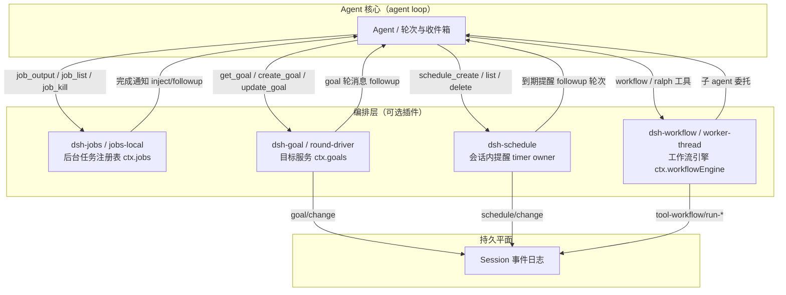
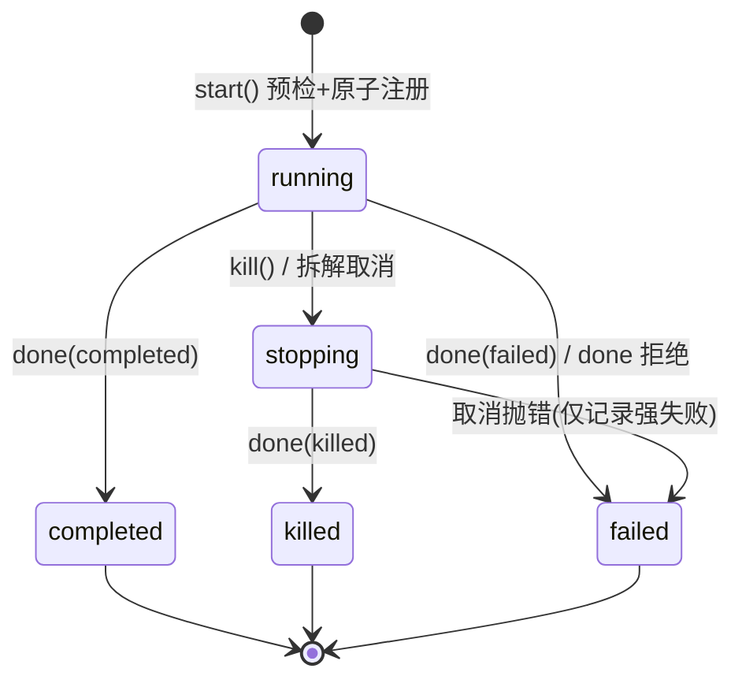
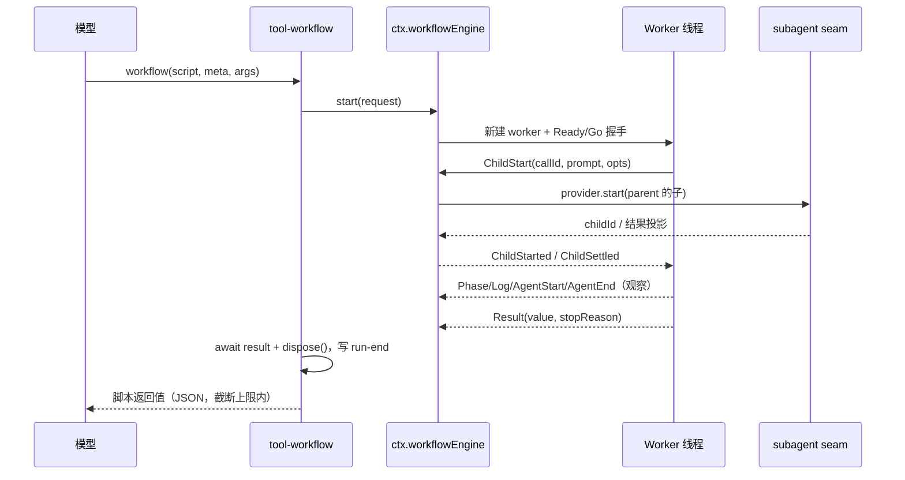
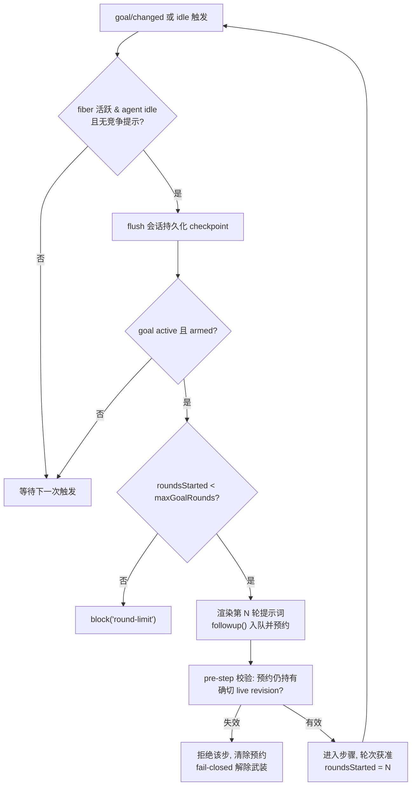

DeepSeek Harness 把「模型发起但生命周期超出单次工具调用的工作」收敛为四个可选子系统：`jobs` 后台任务运行时、`schedule` 会话内定时提醒、`workflow` 模型编写脚本的 subagent 编排引擎，以及 `goal` 持久化的同会话目标追踪。它们共享同一套设计纪律——抽象接缝（Service Definition）与实现包分离、工作归属于确切的 owner Agent、终局结算一次且仅一次、持久事实只追加进会话日志——但各自解决编排问题的不同切面。本页逐一剖析它们的运行时结构、权威模型与模型可见工具面。

## 全景：四个子系统的分工与共同原则

四个子系统都挂在 agent loop 之外的「编排层」：`jobs` 管理正在执行的进程级工作，`schedule` 管理未来的对话轮次，`workflow` 管理一次前台多 agent 编排，`goal` 管理跨轮次的目标状态与自动续跑。它们的类型与操作记录在各子系统文档而非 core，因为与 subagent 一样，它们都是**可选能力**，不属于 agent loop 本体。



| 子系统 | 包家族 | ctx 键 | 持久权威 | 模型面工具 |
|---|---|---|---|---|
| jobs | `jobs` + `jobs-local` + `tool-jobs` | `ctx.jobs` | 进程内存（注册表存活期） | `job_output` / `job_list` / `job_kill` |
| schedule | `schedule`（单包） | 无（函数插件） | `schedule/change` 会话事件 | `schedule_create` / `schedule_list` / `schedule_delete` |
| workflow | `workflow` + `workflow-worker-thread` + `tool-workflow` + `tool-ralph` | `ctx.workflowEngine` | `tool-workflow/run-*` 会话事件（展示投影） | `workflow` / `ralph` |
| goal | `goal` + `goal-round-driver` + `tool-goal` + `command-goal` | `ctx.goals` | `goal/change` 会话事件 | `get_goal` / `create_goal` / `update_goal` + `/goal` 命令 |

共同原则有三条。其一，**接缝与实现分离**：抽象 Service 定义生命周期契约，`-local` 或 `-worker-thread` 包提供进程内实现，部署可替换引擎而不动模型可见面。其二，**所有权归一**：每个任务、提醒、运行、目标都绑定确切的 live Agent 实例，访问控制靠 owner 授权而非 id 保密。其三，**持久事实走会话日志**：schedule 与 goal 完全以严格 decoder + 纯 fold 从 `schedule/change`、`goal/change` 事件重建状态，workflow 则把展示事实投影为可校验的配对记录，回放绝不依赖进程内存。

Sources: [README.zh.md](packages/jobs/README.zh.md#L3-L9) · [README.zh.md](packages/schedule/README.zh.md#L3-L9) · [README.zh.md](packages/workflow/README.zh.md#L3-L9) · [README.zh.md](packages/goal/README.zh.md#L3-L9)

## jobs 运行时：生产方、注册表与任务控制

jobs 家族用一套三方契约描述后台工作：**生产方**（如 bash、subagent 工具）声明身份并启动工作，**注册表**拥有身份、访问权限与生命周期状态，**任务控制方**（`tool-jobs`）向模型公开观察与停止手段。`JobStart` 声明 kind、label、可选输出上限与 owner；`JobHooks` 中的 `cancel` 必须同步且幂等，`done` 在生产方**释放资源之后**才 resolve，而非工作完成之时——这个差别正是「拆解语义」的契约化表达。

```ts
// 生产方声明与运行时钩子（节选）
interface JobStart {
  kind: JobKind          // 也是 id 前缀（bash、subagent…）
  label: string          // 面向模型的一行标签
  outputLimitBytes?: number
  owner?: Agent          // 缺省即为无主任务，对所有调用方开放
  run(): JobHooks        // 预检通过后同步调用一次
}
interface JobHooks {
  cancel(reason?: string): void      // 同步、幂等
  done: Promise<JobOutcome>          // 资源释放后 resolve；拒绝会被转为 failed
  readOutput?(): string              // 缺省即「仅有最终输出」类任务
}
```

Sources: [types.ts](packages/jobs/jobs/src/types.ts#L39-L89) · [jobs.zh.md](docs/subsystems/jobs.zh.md#L33-L76)

任务身份与状态模型刻意保持最小：`JobId` 按 `<kind>-N` 生成，`JobKind` 通过 declaration merging 从可扩展的 map 派生，注册表把每种 kind 视为不透明的 id 命名空间；内置 kind 是 `bash` 与 `subagent`，分别由 `tool-bash` 与 `tool-subagent` 作为生产方调用 `ctx.jobs.start` 注册。`JobStatus` 为 `running`、可选 `stopping`，然后恰好一个终态 `completed` / `killed` / `failed`，生产方特有的事实（退出码、信号、max-tokens）归入 `JobSnapshot.detail`。



Sources: [types.ts](packages/jobs/jobs/src/types.ts#L16-L37) · [index.ts](packages/shell/tool-bash/src/index.ts#L354-L365) · [index.ts](packages/subagent/tool-subagent/src/index.ts#L409-L415)

`LocalJobRegistry` 的准入是**先预检、后原子提交**：先检查是否有已挂载的任务控制方服务该 owner（`start` 在无控制方时直接拒绝，防止产生 owner 无法收集或停止的工作），再校验 kind/label/输出上限，再检查每 owner 活跃任务上限（默认 10，`background-job-admission` 示例演示了压到 1 时第二个生产方被拒绝的场景），最后才调用 `spec.run()` 并同步注册——starter 抛出则什么都不留，返回之后注册不可能失败。

```ts
// 准入预检（LocalJobRegistry.start 节选）
if (!this.servesOwner(spec.owner)) throw new Error('background jobs unavailable: ...')
// kind/label/outputLimitBytes 校验…
const active = this.activeTaskCount(spec.owner)
if (active >= this.maxConcurrentJobsPerOwner) throw new Error('background job limit reached ...')
const hooks = spec.run()      // 之后注册不可失败
```

Sources: [index.ts](packages/jobs/jobs-local/src/index.ts#L130-L183) · [index.ts](packages/jobs/jobs-local/src/index.ts#L315-L319) · [background-job-admission.cordis.yml](examples/acp-agent/background-job-admission.cordis.yml#L1-L19)

访问隔离是**会话 id 栅栏**而非 id 保密：有主任务仅当调用方 session id 与 owner 一致才可 `get`/`read`/`kill`/`wait`，无主任务对所有调用方开放，无 agent 的调用方永远无法匹配有主任务。对外交付的 `JobSnapshot` 是每次新建的只读投影，绝不暴露注册表可变记录；`read` 消费流式增量游标或幂等返回终态输出，`kill` 先取消再置 `stopping` 并标记已上报，`wait` 用有界 deadline 区分超时与调用方取消，结算时释放等待者并标记 `reported`。

Sources: [index.ts](packages/jobs/jobs-local/src/index.ts#L351-L360) · [index.ts](packages/jobs/jobs-local/src/index.ts#L205-L279) · [index.ts](packages/jobs/jobs-local/src/index.ts#L362-L377)

结算采用**一次胜出**语义：第一个终局结果提交唯一终态记录、释放等待者、触发一轮受控的监听器通知，即使生产方晚到的结果也不会二次结算。监听器与控制方都按注册作用域分层（`ScopedLayers`）：全局层来自宿主组合的服务所有 owner，agent 组合作用域内的层只服务其下组合的 agent——否则一个 preset 的完成监听会把通知送进另一个 preset 的 agent。owner 或服务被销毁时，拆解会取消存活工作并等待合规生产方；拆解取消同样把记录标记为 `reported`，因为 owner 已销毁时不再有读者，逐层报告只会浪费模型请求。

Sources: [index.ts](packages/jobs/jobs-local/src/index.ts#L321-L342) · [index.ts](packages/jobs/jobs-local/src/index.ts#L380-L399) · [index.ts](packages/jobs/jobs-local/src/index.ts#L95-L128)

`tool-jobs` 是控制方与通知投递的合体。加载插件即调用 `ctx.jobs.attachController('tool-jobs')` 打开生产方准入，并注册三个工具：`job_output`（流式读取增量，`wait: true` 时阻塞至终态或超时——超时返回 `[status: running]` 而非工具错误）、`job_list`（列出本会话可见任务）与 `job_kill`（请求取消，立即返回）。完成通知经 `onJobDone` 投递：忙碌 owner 被注入下一步收件箱（多个任务同轮结算只花一个 step），空闲 owner 则按 `wakeup` 策略开新轮——但受 `maxConsecutiveWakes`（默认 3）约束，该预算只在 owner 真正消费人类输入时重置，从而封死「被唤醒的轮次启动任务、任务完成又唤醒自己」的自激链。

| 工具 | 参数 | 语义要点 |
|---|---|---|
| `job_output` | `job_id`、`wait?`、`timeout_ms?` | 消费式读游标；等待超时返回运行态快照；输出受 `outputLimitBytes` 截断 |
| `job_list` | 无 | 仅列出调用方拥有与无主任务，不暴露他者 label |
| `job_kill` | `job_id`、`reason?` | 请求取消并置 `stopping`；终态任务返回 `already-finished` |

Sources: [index.ts](packages/jobs/tool-jobs/src/index.ts#L17-L39) · [index.ts](packages/jobs/tool-jobs/src/index.ts#L259-L300) · [index.ts](packages/jobs/tool-jobs/src/index.ts#L302-L399)

## schedule：会话内持久提醒

Schedule 家族管理**仅限 Session 内交付**的持久提醒：持久状态全部保存在原 Session 日志中，进程内 owner 只会在该 Session 拥有 live 根 Agent 时等待；cold Session 不做任何工作，重新 live 后恢复逾期目标，但不存在外部通知渠道。v1 支持三种记录：`after`（正安全整数延时的一次性）、`at`（严格带偏移的 RFC 3339 字符串或精确本地日历对象的一次性）与 `every`（以创建时刻为锚点、下限 300 秒的固定速率重复）。

| 记录类型 | 选择器 | 一次性/重复 | 越界补偿 |
|---|---|---|---|
| `after` | 正安全整数 `after_seconds` | 一次性 | 直接进入 overdue |
| `at` | 带偏移 RFC 3339 或 `date/time/time_zone` 对象 | 一次性 | 直接进入 overdue |
| `every` | `every_seconds ≥ 300`，创建锚点对齐 | 重复 | 只取最新一次到期，不回放错过区间 |

Sources: [README.zh.md](packages/schedule/README.zh.md#L3-L14) · [types.ts](packages/schedule/schedule/src/types.ts#L14-L79) · [schedule.zh.md](docs/subsystems/schedule.zh.md#L1-L80)

持久权威是版本 1 的 `schedule/change` 会话事件流：`create` 保存完整记录，`delete` 是终结且仅含 id 的转换，一次性 `dispatch` 仅含 id，`every` dispatch 额外携带用于选取最新到期触发的墙钟判断时刻 `acceptedAt`。严格 decoder 与 fold 拒绝未知版本、额外字段、id 复用、形状不匹配以及对非活动记录的 delete/dispatch；fork 只折叠 `SessionHeader.seedLength` 之后的事件。创建成功后只存储规范化后的 UTC `scheduledAt`，因此回放绝不依赖环境时区——无效时区、非未来目标、夏令时缺口内的本地时间都会被拒绝，重叠时取较早出现。

Sources: [schedule.zh.md](docs/subsystems/schedule.zh.md#L80-L160) · [domain.ts](packages/schedule/schedule/src/domain.ts#L385-L385) · [domain.ts](packages/schedule/schedule/src/domain.ts#L647-L652)

`ScheduleRuntime` 是每个确切根 Agent 一份的进程内投影：它从持久 fold 派生最早的到期目标并武装有界 timer 段（`setTimeout` 上限 `MAX_TIMER_DELAY_MS` 约 24.8 天，每次唤醒都重读墙钟），每次有界等待后重新判断。决策函数 `dueDecision` 有严格的优先级：先取最早到期的一次性提醒；否则若存在到期的 Every 记录则产出**一批**（每条记录贡献一次最新到期触发，按目标时间与创建顺序排列）；否则计算下一次唤醒目标。多条相互独立的 Every 记录在 Session busy 期间只会贡献最新到期，不会枚举、持久化或回放错过的间隔。

```ts
// dueDecision 的三臂决策：一次性 > Every 批次 > 等待
if (oneShot !== undefined) return { kind: 'one-shot', record: oneShot }
if (every.length > 0) return { kind: 'every', acceptedAt, reminders }
return { kind: 'wait', ...(target === undefined ? {} : { target }) }
```

Sources: [runtime.ts](packages/schedule/schedule/src/runtime.ts#L17-L63) · [schedule.zh.md](docs/subsystems/schedule.zh.md#L88-L125)

到期工作绝不打断当前轮次：runtime 先等待 Agent 完全 idle 并认领 maintenance phase，再重新折叠状态、采样本次判断、把一个 `followup()` 排入队列并追加对应 dispatch 变更——它从不调用 `steer()`。所有读写都经 per-agent 的 `runScheduleTransaction` 串行化，且每次判断先等待共享的 Session 持久化 barrier；若 framing 构造或同步队列准入失败则不记录 dispatch，避免「记录了却未交付」。插件只为加载之后发布的**根** Agent 安装 runtime（`ctx.agents.roots().includes(agent)` 是硬门槛），并随 agent 生命周期注册清理。

Sources: [runtime.ts](packages/schedule/schedule/runtime.ts#L130-L200) · [index.ts](packages/schedule/schedule/src/index.ts#L38-L77) · [transaction.ts](packages/schedule/schedule/src/transaction.ts#L9-L24)

Web overlay 通过 opt-in patch 把 `dsh-time-context` 与 `dsh-schedule` 插入既有 Web 组合：前者让模型按浏览器采样的 IANA 时区解释未限定时区的自然语言时间，后者挂上三个工具与根 Agent timer owner。官方 Web 界面没有独立的 Schedule 回执或浏览器渲染器——到期提醒只通过普通对话 transcript 的文本记录出现。

Sources: [cordis.yml](examples/web-schedule/cordis.yml#L1-L10) · [schedule.zh.md](docs/subsystems/schedule.zh.md#L60-L88)

## workflow：模型编写脚本的 subagent 编排引擎

workflow seam 允许 agent 运行**由模型编写、会启动 subagent** 的编排脚本。与 bash 一样每个上下文至多一个引擎实现：抽象接缝 `ctx.workflowEngine` 只暴露一个 `start(request): WorkflowRun`；请求携带脚本体、`meta` 身份块、可选 `args`、每运行子 agent 上限与必需的 parent Agent（脚本派生的每个子 agent 都归属它）。`WorkflowRun` 是持有者所有的活跃句柄：`result` 永不拒绝，`cancel` 取消运行及其子，`dispose` 必须在每条路径上调用以等待有界停稳。

```ts
interface WorkflowStartRequest {
  script: string                 // 纯 JS 函数体，顶层 await 合法
  meta: WorkflowMeta             // name/description 必填，引擎先行校验
  args?: unknown                 // 以 args 全局变量逐字暴露给脚本
  subagentProvider?: string      // 引擎级子提供方覆盖
  maxTotalAgents?: number        // 每运行子 agent 总上限
  parent: Agent                  // 每个子 agent 的归属父
  signal?: AbortSignal           // 取消信号
}
interface WorkflowResult {
  value: unknown                 // completed 时才有意义；无返回值即 null
  stopReason: 'completed' | 'cancelled' | 'error'
  error?: string
  agentsStarted: number          // 终止路径退化为宿主观测计数
}
```

Sources: [runtime-types.ts](packages/workflow/workflow/src/runtime-types.ts#L17-L50) · [types.ts](packages/workflow/workflow/src/types.ts#L39-L82) · [workflow.zh.md](docs/subsystems/workflow.zh.md#L1-L20)

官方引擎 `dsh-workflow-worker-thread` **每次运行一个 worker 线程**，脚本在独立的 `vm` 上下文中执行——它与宿主事件循环隔离但不构成安全边界。脚本可见的全局只有五个钩子与 `args`：`agent(prompt, opts?)` 运行一个子 agent 到完成（带 `schema` 时返回结构化对象，schema 仅支持 JSON Schema 的一个安全子集），`parallel(thunks)` 带栅栏并发，`pipeline(items, ...stages)` 无栅栏流水线，`phase(title)`/`log(message)` 纯进度叙述。**没有文件系统、网络、定时器或 Node API**——agent 干活，脚本只做协调。

| 钩子 | 语义 | 失败行为 |
|---|---|---|
| `agent(prompt, opts?)` | 运行一个子 agent 到完成 | 子失败 → `null`；钩子误用 → fatal |
| `parallel(thunks)` | 并发全部并等待（栅栏） | 单个 thunk 抛错 → 该项 `null` |
| `pipeline(items, ...stages)` | 每项独立流过各阶段（无栅栏） | 普通阶段抛错 → 该项 `null` 并跳过后续阶段 |
| `phase(title)` / `log(msg)` | 进度分组与叙述 | 仅播报，无执行语义 |

Sources: [runtime.ts](packages/workflow/workflow-worker-thread/src/runtime.ts#L1-L31) · [index.ts](packages/workflow/tool-workflow/src/index.ts#L106-L123) · [workflow.zh.md](docs/subsystems/workflow.zh.md#L80-L90)

失败纪律是双层的：脚本内部钩子误用（错误参数、未知选项、越界 schema、超上限、seam 启动失败、取消）抛出 `fatal: true` 的 `WorkflowError` 并**杀死整个脚本**，绝不溶解为逐项 `null`；只有子 agent 失败与普通阶段错误才降为逐项 `null`。worker 侧每个返回的 promise 都挂了拒绝消费者，脚本丢弃的 promise 不会以未处理拒绝杀死 worker；取消之后每个钩子在下一个调用边界抛 `CANCELLED`——取消在钩子边界生效，脚本无法捕获一次取消拒绝后继续经 `phase`/`log` 播报。

Sources: [runtime.ts](packages/workflow/workflow-worker-thread/src/runtime.ts#L1-L9) · [runtime.ts](packages/workflow/workflow-worker-thread/src/runtime.ts#L76-L130) · [runtime.ts](packages/workflow/workflow-worker-thread/src/runtime.ts#L143-L172)

宿主侧的 `WorkerRun` 用**三方竞速**决定结算：第一个 worker 结果、意外死亡（error/messageerror/exit）或取消宽限期到期，谁先到谁拥有终局并关闭消息准入。取消路径上，宿主向 worker 发 Cancel（钩子开始抛错、脚本死于下一个 await）、中止所有子 agent 共享的 AbortSignal，并武装宽限 timer：脚本仍不结算则强置 `cancelled` 并 **terminate 线程**——被终结脚本内排队中的调用不可知，`agentsStarted` 退化为宿主观测计数；被搁浅的 agent-start 由宿主合成 end 事件，保证 start/end 严格配对且 end 先于 `workflow/end`。



Sources: [host.ts](packages/workflow/workflow-worker-thread/src/host.ts#L90-L120) · [host.ts](packages/workflow/workflow-worker-thread/src/host.ts#L176-L203) · [protocol.ts](packages/workflow/workflow-worker-thread/src/protocol.ts#L16-L77)

宿主⇄worker 的线协议是封闭的可判别联合：worker→host 有 `Ready`/`Phase`/`Log`/`AgentStart`/`AgentEnd`/`ChildStart`/`ChildDispose`/`Result`，host→worker 有 `Go`/`Cancel`/`ChildStarted`/`ChildStartError`/`ChildSettled`/`ChildFailed`/`ChildDisposed`，全部载荷是结构化克隆安全的纯 JSON，接收方用 `assertNever` 保证枚举穷尽。脚本域内产生的值在离开 realm 前物化为纯 JSON；进入受信领域的值直接传递，只有 `args` 被克隆以防脚本变异初始化数据。

Sources: [protocol.ts](packages/workflow/workflow-worker-thread/src/protocol.ts#L16-L77) · [runtime.ts](packages/workflow/workflow-worker-thread/src/runtime.ts#L1-L9)

六个 `workflow/*` 事件（`start`/`phase`/`log`/`agent-start`/`agent-end`/`end`）是**仅供观察**的 emit，载荷以 `WorkflowRunInfo`（id + meta 快照）开头而非活跃运行对象；agent-start/end 按 `agent.seq` 在所有停止路径上恰好配对一次，终结路径上的 end 由引擎合成。持久化分两层：`tool-workflow` 消费方把展示事实投影为父 Session 的 `tool-workflow/run-start` → 成员对（`runId + seq`）→ `run-end` 记录，且 run-end 只在结果已取得、dispose 完全停稳后写入；`dsh-tool-workflow/invariant` 在实时提交前与 Session 加载时校验同一协议（单 start、正唯一序号、成员 end 配对、开放成员禁止结束）。UI 侧 `dsh-client-ui-workflow-run` 把这些事件折叠为一个锚定在原工具节点之后的 `workflow-run` Chat 节点。

Sources: [workflow.zh.md](docs/subsystems/workflow.zh.md#L90-L110) · [index.ts](packages/workflow/tool-workflow/src/index.ts#L62-L103)

`ralph` 工具展示了「固定策略工作流」的形态：模型只提供 `objective` 与可选 `maxRounds` 数据，无法改动循环本体——脚本由部署固定，每轮启动一个**全新**的结构化输出子 agent，仅携带不可变目标与上一轮有界结构化交接（≤ `maxHandoffChars`，默认 16384 字符）。子 agent 返回 `continue`（需 nextSteps 且 blocker 为空）、`complete`（需 evidence 且无 nextSteps）或 `blocked`（需具体 blocker）三态报告；到达轮数上限（默认 256）返回 `budget-limited`。共享工作区是唯一长期记忆，交接报告只作有界提示、须由子 agent 对照工作区自行验证。

Sources: [index.ts](packages/workflow/tool-ralph/src/index.ts#L17-L66) · [index.ts](packages/workflow/tool-ralph/src/index.ts#L66-L160)

## goal：事件溯源的同会话目标

goal 域把「长期目标」建模为**事件溯源**状态：每次获准的持久变更都提交一条版本 1 的 `goal/change` 会话事件，载荷要么是变更后的完整快照、要么是 `clear` 墓碑；严格回放折叠只从这些事件派生生命周期，拒绝未知版本、额外字段、非正轮数、编号缺口与陈旧修订。身份用 `GoalRef`（id + revision）做比较并设置：调用方必须持有所引用的确切修订，每次持久变更递增修订号。

```ts
type GoalPhase = 'active' | 'paused' | 'blocked' | 'complete'
interface GoalBlockReason { readonly code: string; readonly message: string }
interface GoalView extends GoalSnapshot {
  roundsStarted: number        // 仅由获准的 goal 轮 user/message 推进
  activation: GoalActivation   // 进程本地的 armed/disarmed，绝不持久化
}
```

Sources: [types.ts 相关定义](packages/goal/goal/src/types.ts#L1-L1) · [domain.ts](packages/goal/goal/src/domain.ts#L13-L49) · [goal.zh.md](docs/subsystems/goal.zh.md#L1-L60)

`GoalService`（`ctx.goals`）的动作面覆盖完整生命周期：`create` 创建并武装（completed 目标可被替换，其余阶段必须先 clear 或 resume）、`edit` 局部替换、`pause` 暂停并解除自动续跑、`resume` 重新武装、`complete` 完成、`block` 以策略拥有的 `GoalBlockReason`（稳定 kebab-case code + 人/模型可读 message）标记阻塞、`clear` 留墓碑清除，以及 `disarm`——只移除进程内续跑权威而不改动持久阶段，供生命周期 owner 在卸载驱动前调用；此后的人工授权 `resume` 记录新的激活边。每次变更后发出 `goal/changed` 通知（作用域过滤、监听器故障受控），且对应会话事件已先行提交。

Sources: [goal.zh.md](docs/subsystems/goal.zh.md#L138-L278) · [domain.ts](packages/goal/goal/src/domain.ts#L88-L101) · [index.ts](packages/goal/goal/src/index.ts#L1-L3)

**自动续跑**由独立的 `goal-round-driver` 实现。它为每个 Agent 维护串行化的驱动状态：只有 fiber ACTIVE、agent 确切存活且 idle、无竞争提示入队时才可驱动；驱动前先 flush 会话持久化（checkpoint 失败则 fail-closed 解除武装）。获准续跑时，它渲染第 `roundsStarted + 1` 轮提示词，以 `source: { kind: 'goal', goalId, revision, round }` 归属创建 user message 并 `followup()` 入队——**只有**这些获准的 goal 来源消息才推进 `roundsStarted`；超出 `maxGoalRounds` 时以 `round-limit` 码阻塞而非继续。



Sources: [index.ts](packages/goal/goal-round-driver/src/index.ts#L149-L205) · [index.ts](packages/goal/goal-round-driver/src/index.ts#L207-L241) · [index.ts](packages/goal/goal-round-driver/src/index.ts#L333-L347)

驱动器的核心复杂度在与收件箱的**竞态防护**：普通用户消息在下一轮队列出现即置 `competingQueued` 并把排队中的 goal 预约标为 `stale`；goal 消息被认领/丢弃、`turn/end` 的 max-tokens（解除武装）或 aborted（标记取消或解除武装）、`agent/error` 等事件都各自收敛预约状态。`agent/pre-step` waterfall 钩子做最终把关——除非排队提示仍拥有确切的 live 修订、正连续轮号且 goal 仍 active+armed，否则拒绝进入该步并恢复其他已被认领的提示；连下游钩子抛错也会先清除预约再让下一轮驱动重排。插件卸载时的拆解解除所有武装、取消运行中的已认领轮并等待 idle，保证后加载的驱动器绝不继承先前生产者实例的隐藏自动权威。

Sources: [index.ts](packages/goal/goal-round-driver/src/index.ts#L245-L331) · [index.ts](packages/goal/goal-round-driver/src/index.ts#L349-L401) · [index.ts](packages/goal/goal-round-driver/src/index.ts#L403-L446)

模型可见面是 `get_goal` / `create_goal` / `update_goal` 三个工具加上用户侧 `/goal` 命令，二者都受**权威模型**约束：工具执行要求调用方是注册表中的确切 live 实例且正处于其活跃驱动的开放轮次内；`complete`/`blocked` 需要直接人类轮次或当前 goal 轮的精确匹配授权，非人类生产者必须自带 source 而非继承 `user` 权威。策略层面，模型自报 `blocked` 需同一阻塞条件持续至少 `blockedAfterConsecutiveRounds`（默认 3）个获准轮。`/goal` 命令提供 `show/create/edit/pause/resume/clear` 文法，成功创建后还会把随附图片以 user 消息提前入队供后续轮次读取。

Sources: [index.ts](packages/goal/tool-goal/src/index.ts#L1-L27) · [authority.ts](packages/goal/tool-goal/src/authority.ts#L40-L109) · [index.ts](packages/goal/command-goal/src/index.ts#L40-L57) · [index.ts](packages/goal/command-goal/src/index.ts#L189-L197)

## 横向对比与子系统协作

四个子系统在同一编排层内各司其职，差异集中在**持久性、权威来源与中断模型**三个维度。jobs 是纯进程内的执行期设施，唯一持久物是 workflow 投影的展示记录；schedule 与 goal 则完全以会话日志为权威，跨重启/fork 可重建；workflow 的持久面最薄——只投影展示事实，执行所有权始终在持有运行句柄的消费方手中。

| 维度 | jobs | schedule | workflow | goal |
|---|---|---|---|---|
| 持久权威 | 进程内存（服务存活期） | `schedule/change` 事件流 | `tool-workflow/run-*`（展示投影） | `goal/change` 事件流 |
| 触发方式 | 生产方 start / 模型工具 | 墙钟到期 + idle 准入 | 模型工具调用（前台） | goal 轮 followup + 人类 resume |
| 中断模型 | `kill` → stopping → 终态 | 无中断（不打断当前轮次） | `cancel` + 宽限强置 + terminate | pause/block/disarm |
| 访问控制 | owner session id 栅栏 | 仅原 Session live 时交付 | parent Agent 归属子 agent | 确切 live Agent + 直接人类/确切轮授权 |
| 交付通道 | 完成通知 inject/followup | 普通后续轮次 transcript | 前台工具结果 + Chat 节点投影 | goal 轮 user message |

协作路径也很清晰：一个 `workflow` 运行派生的每个子 agent 都可以启动自己的 `bash`/`subagent` 后台任务，完成通知按各 owner 的作用域链路由回各自的组合；`goal` 轮驱动的工作里,模型用 `job_output(wait: true)` 收集后台产出；`schedule` 提醒到达时只能进入普通后续轮次,与 goal 轮共享同一个 followup 队列但互不覆盖——schedule 不调用 `steer()`，goal 驱动则用 pre-step 校验拒绝任何失效预约。四个子系统都不会绕过轮次生命周期：一切模型可见的推进都经由收件箱与轮次边界发生。

Sources: [index.ts](packages/jobs/jobs-local/src/index.ts#L95-L128) · [index.ts](packages/schedule/schedule/src/index.ts#L38-L77) · [index.ts](packages/goal/goal-round-driver/src/index.ts#L245-L291)

## 延伸阅读

理解编排层需要先掌握它所依附的两块地基：轮次与收件箱模型见 [轮次流程剖析：turn/step 事件流与 Agent 生命周期扩展点](11-lun-ci-liu-cheng-pou-xi-turn-step-shi-jian-liu-yu-agent-sheng-ming-zhou-qi-kuo-zhan-dian)，会话日志与「模型可见即已记录」不变量见 [会话日志模型："模型可见即已记录"的不变量与消息投影](12-hui-hua-ri-zhi-mo-xing-mo-xing-ke-jian-ji-yi-ji-lu-de-bu-bian-liang-yu-xiao-xi-tou-ying)。workflow 的子 agent 委托细节展开在 [Subagent 委托、多提供方注册与实验性 Agent 团队](18-subagent-wei-tuo-duo-ti-gong-fang-zhu-ce-yu-shi-yan-xing-agent-tuan-dui)，工具注册与 waterfall 把关事件的机制见 [工具注册表、waterfall 把关事件与执行流水线](14-gong-ju-zhu-ce-biao-waterfall-ba-guan-shi-jian-yu-zhi-xing-liu-shui-xian)。若关注这些子系统在 Web 界面上的呈现（工作流运行节点、任务卡片），可继续阅读 [Web 应用双半侧架构：宿主侧网关服务器与浏览器侧客户端运行时](23-web-ying-yong-shuang-ban-ce-jia-gou-su-zhu-ce-wang-guan-fu-wu-qi-yu-liu-lan-qi-ce-ke-hu-duan-yun-xing-shi)。