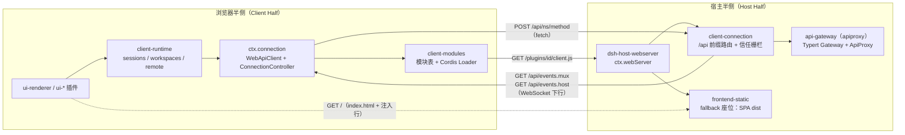
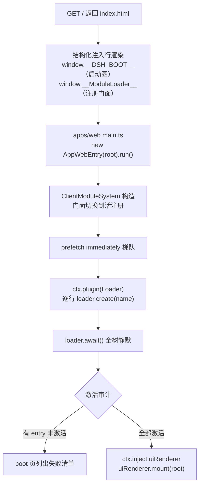
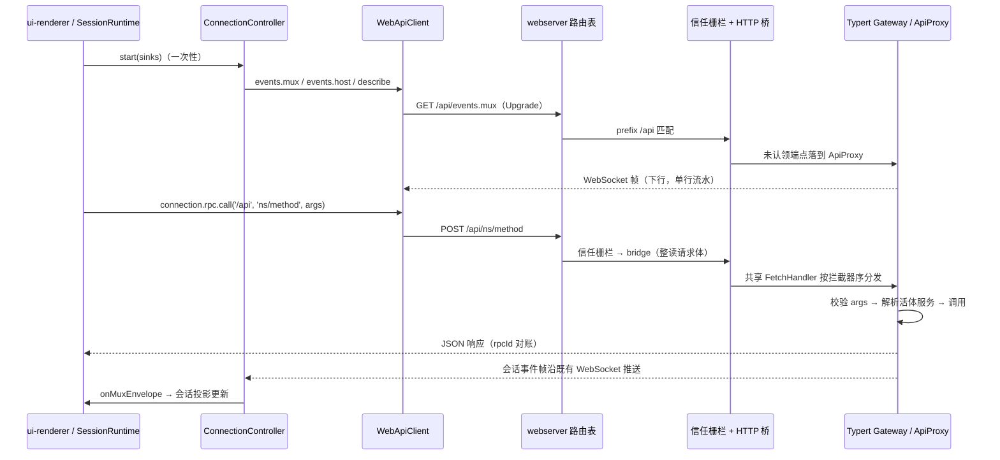

`dsh web` 启动的图形界面并不是一个"前端项目 + 后端接口"的常见组合，而是**同一棵 Cordis 插件树在两个运行环境中各长出的一半**：Node 进程里的**宿主半侧**（Host Half）是一台网关服务器，负责 HTTP 承载、RPC 分发与静态资源；浏览器里的**客户端半侧**（Client Half）是一个客户端运行时，负责模块装载、连接维持与会话投影。两侧之间只有一条协议边界——`/api` 前缀上的 unary 调用与两条 WebSocket 下行流。本页解释这两个半侧各自的内部结构、它们如何握手、以及一条消息如何走完全程。UI 插件与槽位定制等界面层话题在本页范围之外。

## 全景：一个框架，两棵插件树

理解 Web 应用的第一步是放弃"前后端分离"的直觉，换成"双半侧"（dual-half）视角。宿主进程是一棵完整的 Cordis 插件树，浏览器里在引导完成后同样是一棵 Cordis 插件树；很多插件包同时携带两个半侧——宿主半通过普通入口进入 Node 树，浏览器半通过在 package.json 里声明 `dsh.client` 并在 `exports["./client"]` 导出构建产物进入浏览器树。`dsh-client-modules` 与 `dsh-client-connection` 就是典型的双面包：前者宿主半扫描插件表并组装启动图，浏览器半就是模块表本身；后者宿主半把网关绑到 `/api`，浏览器半是 fetch/HTTP 客户端。

API 层次在官方文档中被总结为一条单向链：`remotes → gateway → connection → webserver`。请求从浏览器的 Remote 代理出发，穿过 Typert 网关的分发面、Connection 的传输载体，最终落在 webserver 的路由上；WebSocket 下行则沿同一条链反向流动。



这一布局有一个值得注意的不对称性：**上行是短连接的 unary 调用，下行是两条长连的只读流**。浏览器到宿主的一切业务请求都是普通的 `POST /api/<namespace>/<method>`；宿主到浏览器的事件（会话事件流、宿主帧）则通过两条 WebSocket 单向推送——WebSocket 上客户端发消息被视为协议违规，连接会被以 1008 状态码关闭。

Sources: [api-gateway.md](docs/api-gateway.md#L119-L123) [manifest.ts](packages/client/modules/src/client/manifest.ts#L5-L19) [cordis.patch.yml](packages/bundle/web-app/cordis.patch.yml#L153-L172) [websocket-downlink.ts](packages/client/connection/src/websocket-downlink.ts#L46-L56)

## 宿主半侧：一台"不认识 Harness"的网关服务器

宿主半侧的地基是 `dsh-host-webserver`：一个把 `node:http` 服务器包装成 `ctx.webServer` 服务的插件。它的设计边界刻在文件头注释里——"knows no harness concepts and serves no files"：它不提供任何静态文件，也不知道 Agent、Session 为何物；它只提供三样组合原语：**具名路由注册表**、**index.html 变换回调**、以及**唯一一个 fallback 座位**。谁最终提供页面，是上层组合的事。

路由匹配规则是固定的三段式：先查精确表（`exact`），再查最长匹配前缀（`prefix`，要求路径等于前缀或以 `前缀/` 开头），最后落入 fallback。注册顺序不影响请求语义——具名路由被约定为互不相交，重复的 `(kind, path)` 直接抛错，因为路由模式是组合层面的契约；fallback 座位同样只允许一个所有者，第二个注册者会抛错。此外还有一条独立的**升级路由表**（`registerUpgrade`），按精确路径接管 HTTP Upgrade，一个 socket 只能有一个协议所有者。服务的激活即监听：`port: 0` 时由操作系统分配端口并通过 `webServer.port` 暴露实际值；监听失败（如 `EADDRINUSE`）直接让 fiber 进入 FAILED 状态。配置面刻意极简——`host` 只接受 `127.0.0.1` 与 `0.0.0.0` 两个字面量，没有 TLS、认证或来源策略，因此绑定 `0.0.0.0` 是一次深思熟虑的网络暴露决定，而不是一个可调节的旋钮。

值得学习的还有它的**失败抑制哲学**：单个请求处理抛错（例如畸形 `%` 转义让 `decodeURIComponent` 炸掉、客户端中途断开）只会记一条 warning 并回答 400——若响应头已发出则直接销毁 socket——绝不允许一个坏请求把进程带走。服务释放时，`close()` 与 `closeAllConnections()` 成对出现，且因为 Node 的 `closeAllConnections()` 不包含已升级的 WebSocket socket，服务自己维护升级 socket 集合并逐一销毁。

| 宿主半侧组成 | 包 / 服务键 | 职责 |
|---|---|---|
| HTTP 承载 | `dsh-host-webserver` / `ctx.webServer` | 路由注册表、升级路由、fallback 座位、index 注入渲染 |
| 传输与信任 | `dsh-client-connection`（node 半）/ `ctx.connection` | `/api` 前缀路由、浏览器信任栅栏、HTTP 桥、WebSocket 下行泵 |
| RPC 分发 | `dsh-host-apiproxy` + `dsh-api-gateway` / `ctx.apiProxy`、`ctx.typertGateway` | Typert Remote 认领分发；无描述符端点的 ApiProxy 兜底 |
| 静态资源 | `dsh-host-frontend-static` | 在 fallback 座位上服务构建出的 SPA dist |
| 表面胶水 | `dsh-web-app` / `web-runtime` 行 | dist 定位、URL 行打印、LAN 信任采样、web 表面提示词 |

Sources: [index.ts](packages/host/webserver/src/index.ts#L1-L9) [index.ts](packages/host/webserver/src/index.ts#L102-L160) [index.ts](packages/host/webserver/src/index.ts#L181-L195) [index.ts](packages/host/webserver/src/index.ts#L241-L253) [web-server.md](docs/subsystems/web-server.md#L50-L66) [api-gateway.md](docs/api-gateway.md#L158-L162)

### `/api` 通道：信任栅栏先行，HTTP 桥垫后

`client-connection` 插件（`packages/client/connection` 的 node 半）在 `ctx.webServer` 上注册一条 `prefix: '/api'` 的路由，把"浏览器传输前缀"整体接管。每个到达该前缀的请求先穿过**浏览器信任栅栏**（`isTrustedApiRequest`），通过后才进入 HTTP 桥（`bridge`），由桥把 `node:http` 请求翻译成 WHATWG `Request`，交给一个与传输无关的 fetch 形状处理器。

信任栅栏防御的是浏览器本地 API 的两类"混淆代理人"攻击，其核心洞察值得展开：**DNS rebinding 防御必须压在 Host 头上**。攻击者页面可以把域名解析到 `127.0.0.1`，让 socket 落到本服务器，而浏览器会按"它以为在对话的 URL"填写 Host——于是携带攻击者域名的 Host 就是无法伪造的铁证：回环主机名（或部署声明的 `trustedHosts` 权威）之外一律拒绝。第二条防线是显式跨站标记：现代浏览器在 fetch 上标注 `Sec-Fetch-Site: cross-site`，直接拒绝；浏览器附带的 `Origin` 若与本权威不一致（包括沙箱 iframe 的 opaque `null`）同样拒绝。文档明确指出这套栅栏**不是认证层**：网络可达性属于 webserver 的绑定策略，鉴权属于未来真正的认证层。

```ts
// packages/client/connection/src/index.ts — /api 路由的组装（节选）
const route: WebRoute = {
  kind: 'prefix',
  path: API_PATH,
  handler: async (req, res) => {
    if (!isTrustedApiRequest(req, trustedHosts)) {
      res.writeHead(403); res.end('forbidden'); return
    }
    await bridge(req, res, fetchHandler, maxRequestBodyBytes)
  },
}
ctx.effect(() => ctx.webServer.register(route), 'client-connection: /api route')
```

HTTP 桥本身有两个值得注意的工程细节。其一是**请求体上限与内存上界合一**：桥先把请求体整体读入内存再派发，默认上限 300 MiB——这个看似任意的数字是为默认聚合图像限制（200 MiB）经 base64 膨胀后加上信封余量算出来的，插件还会在 `apiProxy` 存在时校验图像容量与上限的一致性，超限即 413。其二是**断连检测挂在 response 而不是 request 上**：Node 16 以来 `IncomingMessage` 的 `close` 在请求体读完即触发（无体的 GET 立即触发），挂在 request 上会把每个 SSE 流在打开瞬间掐断；挂 `ServerResponse` 的 `close` 并用 `writableEnded` 区分正常结束，才能既及时中止又不错杀。回写方向则实现了背压：socket 缓冲写满时等待 `drain`，慢速消费者不会无限堆积。

| `/api` 前缀上的通道 | 路径 | 方向 | 载体 | 内容 |
|---|---|---|---|---|
| Typert Remote / ApiProxy unary | `POST /api/<ns>/<method>` | 上行 | fetch（JSON） | 命名 `args` 对象 → 验证后的业务结果 |
| mux 会话事件流 | `GET /api/events.mux` | 下行 | WebSocket（downlink-only） | `MuxFrame` 序列 |
| host 宿主事件流 | `GET /api/events.host` | 下行 | WebSocket（downlink-only） | `HostFrame` 序列（含转发 Remote 事件） |
| 客户端插件 bundle | `GET /plugins/<id>/client.js?rev=<rev>` | 上行 | GET（no-cache） | 单个浏览器插件包的产物 |

Sources: [index.ts](packages/client/connection/src/index.ts#L38-L57) [index.ts](packages/client/connection/src/index.ts#L107-L172) [api-request-trust.ts](packages/client/connection/src/api-request-trust.ts#L1-L18) [api-request-trust.ts](packages/client/connection/src/api-request-trust.ts#L104-L124) [http-bridge.ts](packages/client/connection/src/http-bridge.ts#L7-L12) [http-bridge.ts](packages/client/connection/src/http-bridge.ts#L32-L99) [api-path.ts](packages/client/connection/src/api-path.ts#L1-L15)

### WebSocket 下行：只进不出的两条泵

当组合中存在 `apiProxy`（Web 组合中总是存在）时，`client-connection` 会进一步在 `webServer.registerUpgrade` 上认领 `/api/events.mux` 与 `/api/events.host` 两个升级路径，每条升级同样先过信任栅栏，未授权的升级在协议协商前就以裸 403 被拒绝。`WebSocketDownlinks` 是这两个下行的宿主侧引擎：它持有 `ws` 的 no-server `WebSocketServer`，把升级后的 socket 与宿主侧的 `api.events.mux` / `api.events.host` 异步迭代器对接，逐帧 JSON 序列化推给浏览器；socket 关闭或出错时中止上游迭代器，泵本身出错则改发一帧 `stream/error`。下行方向上浏览器发来的第一条消息即协议违规——**上游流量必须留在 HTTP 上**，这让两条 WebSocket 在语义上是纯粹的事件出口。

Sources: [index.ts](packages/client/connection/src/index.ts#L173-L190) [websocket-downlink.ts](packages/client/connection/src/websocket-downlink.ts#L105-L137) [websocket-downlink.ts](packages/client/connection/src/websocket-downlink.ts#L140-L153)

### RPC 分发的两级认领：Typert Gateway 与 ApiProxy

`/api` 前缀内部是一个**共享通道 + 拦截器 + 兜底**的三层分发结构。`HostConnectionService` 提供 `connection.rpc.intercept('/api', matcher, handler)`：Typert Gateway（`dsh-api-gateway`）在构造时通过它认领"恰好两段、且有严格生成描述符或活跃 SRC 标记"的端点；凡未被认领的请求原样落到 fallback——也就是 ApiProxy（`dsh-host-apiproxy`）的 fetch 处理器。每个请求在每次调用时从当前注册表解析描述符与活体服务，要求 `args` 字段与描述符完全一致、用编解码器校验线上值、通过 lookup 或 Context 解析接收者，绝不缓存业务对象。

这条两级结构解释了 Web 组合里 `api-gateway` 行的注释："transport-agnostic dispatch face every client shape shares"。Typert 生成的强类型 Remote 端点（`ctx.remote.<namespace>` 调用）与 ApiProxy 的宽接口端点共用同一条 HTTP 通道与同一道信任栅栏，但保持各自独立的协议身份——Remote 只做一元方法调用，会话事件流、分页、增量归约等流式协议永远不允许伪装成 Remote 方法。

Sources: [rpc-host.ts](packages/client/connection/src/rpc-host.ts#L71-L115) [index.ts](packages/api/gateway/src/index.ts#L85-L120) [api-gateway.md](docs/api-gateway.md#L119-L129) [cordis.patch.yml](packages/bundle/web-app/cordis.patch.yml#L103-L106)

### fallback 座位与 index 注入：页面如何长出插件

静态资源由 `dsh-host-frontend-static` 在 **fallback 座位**上提供：所有没被具名路由认领的 GET/HEAD 请求进入它的 dist 服务器——目录穿越出 dist 根即 403，缺失即 404，非 GET/HEAD 即 405。关键在 index.html 的处理：每次渲染 index 都要经过 `webServer.renderIndex()`，先套用**结构化注入表**，再套用 `tapIndex` 注册的原始变换。

结构化注入是理解"页面如何长出插件"的钥匙。插件不直接改 HTML 字符串，而是通过 `webserver/index-inject` 事件推入类型化的行：`global`（给 `globalThis` 赋 JSON 值，序列化时转义 `<` 防止逃逸出 script 元素）、`script`、`script-src`、`style`、`html` 五种。每次渲染与每次 boot 载荷请求都现场 emit 一次，订阅者推入当前值——模块图、主题偏好都是发射时刻的活状态。Web 组合中最重要的一行 `global` 注入就是 `dsh-client-modules` 宿主半发布的 `window.__DSH_BOOT__` 启动图。dist 的位置也不是用户配置，而是组合事实：web-runtime 行通过 `require.resolve('@deepseek-ai/dsh-web-frontend/dist/index.html')` 从包导出解析，未构建则报"请先在仓库根目录 `pnpm run build`"。

Sources: [frontend-static/index.ts](packages/host/frontend-static/src/index.ts#L1-L12) [frontend-static/index.ts](packages/host/frontend-static/src/index.ts#L104-L121) [injections.ts](packages/host/webserver/src/injections.ts#L11-L29) [injections.ts](packages/host/webserver/src/injections.ts#L50-L54) [index.ts](packages/bundle/web-app/src/index.ts#L162-L171)

## 浏览器半侧：从一张空 HTML 到一棵插件树

### 引导流水线：三级火箭

浏览器半侧的入口薄到极致——`apps/web/src/main.ts` 只做一件事：找到 `#root`，交给 `AppWebEntry`。真正的引导内核在 `@deepseek-ai/dsh-client-web` 里，它刻意只拥有"模块系统、Cordis Loader、一个无框架的 boot 页"三样东西，把动态 UI 渲染让给后续插件。

引导序列是一条严格的流水线。第一步，内核从页面全局读取三个门面：`window.__ModuleLoader__`（HTML 安装的注册门面，此时处于 pending 队列模式）、`window.__DSH_BOOT__`（宿主发布的启动图）、可选的 `__DSH_TRANSPORT__`（非 served 部署如 worker 预览页替换物理传输的钩子）。第二步，`ClientModuleSystem` 构造：索引启动行、保留已物化的 bootstrap 模块、把注册门面从队列切换到活注册——切换先行，排队中的 bundle 执行时才能直接注册而不是追加到队尾。第三步，`immediately` 标记的第一梯队并行 prefetch（只求代码早到，失败静默——Loader 的 import 才负责重试与报告）。第四步，挂载 Cordis Loader，为图里每行 `loader.create({ name })`，boot 页实时显示每个 entry 的状态。第五步，`loader.await()` 等全树静默后做**激活审计**：import 失败的 entry、仍在 pending 并缺服务的 entry 都会以清单形式抛出，错误可见于 boot 页。第六步——也是唯一与 UI 相关的一步——通过依赖 fiber 挂载：`ctx.inject(['uiRenderer'], scope => scope.uiRenderer.mount(container))`。把挂载放进 fiber effect 意味着替换 `uiRenderer` 会触发应用重挂载。



Sources: [main.ts](apps/web/src/main.ts#L1-L11) [boot.ts](packages/client/web/src/boot.ts#L46-L78) [boot.ts](packages/client/web/src/boot.ts#L88-L135) [boot.ts](packages/client/web/src/boot.ts#L137-L158)

### 启动图 wire：Node 半与浏览器半的唯一契约

`window.__DSH_BOOT__` 是两侧的 wire 单一来源。每行 `WebBootEntry` 描述一个浏览器插件：`id` 即包名，`url` 是 `/plugins/<id>/client.js?rev=<rev>`，`rev` 是 bundle 内容哈希——它作为 cache-busting 查询参数 riding 在 URL 上，而 bundle 路由本身以 `no-cache` 服务，一致性完全锚在 rev 上；图级 `rev` 对整张组合行做哈希，任何一行变化都会改变它。`immediately` 标记 prefetch 梯队；`external` 列出该行请求的非基线模块标识符——与仅供展示的 `inject` 边不同，`external` 真正约束代码到达，因为 `require` 是同步的。

宿主半的扫描是增量的：包声明 `dsh.client`（`platform: 'web'`、可选 `inject`、可选 `immediately`）即入表；每次 cordis `internal/plugin` 发射把对应 entry 标脏，微任务冲刷时按活体 loader 条目调和。bundle 变化只有一条进入图的通道——HMR watch 驱动调用 `rebuilt(id)` 重新哈希。

Sources: [client-modules.md](docs/subsystems/client-modules.md#L13-L17) [manifest.ts](packages/client/modules/src/client/manifest.ts#L41-L77) [client-modules.md](docs/subsystems/client-modules.md#L51-L60) [client-modules.md](docs/subsystems/client-modules.md#L93-L95)

### 客户端模块系统：懒 CJS 表

浏览器半没有 Node 的模块加载器，`dsh-client-modules` 的浏览器半自己造了一个——**懒 CJS 表**，它是 Node 内部 ESM loader 的浏览器对等物。核心模型：执行一个插件 bundle 只会**注册**工厂（`window.__ModuleLoader__.load({ id, factory })`）；模块体的所有副作用——包括 CSS 注入——都活在工厂闭包里，首次 `import`/`require` 物化时才执行并记忆化。工厂之间可以递归物化，因此装载顺序不需要外部排序。

解析分支顺序值得背下来：`import` 走"seed 词 → 已记忆化记录 → 图行（先注册其依赖工厂再注册自己的）→ 已注册工厂 → 抛错"；同步 `require` 走同一顺序但去掉装载分支（装载是异步的，同步世界不可达）。`external` 边在物化消费者之前先到达被依赖的动态包，图中出现环则是致命错误——工厂形态的 CJS 无法交付部分导出。任何解析失败都大声抛错，这正是构建期"bundle 纯净门禁"在运行时的镜像：bundle 里若混入了构建时未声明的外部依赖，运行时 require 会立即失败而不是静默吞掉。

Sources: [manifest.ts](packages/client/modules/src/client/manifest.ts#L5-L19) [system.ts](packages/client/modules/src/client/system.ts#L53-L101) [system.ts](packages/client/modules/src/client/system.ts#L127-L144) [system.ts](packages/client/modules/src/client/system.ts#L174-L187)

### 浏览器侧 `ctx.connection`：代际化重连控制器

客户端 Cordis 树的线根是 `dsh-client-connection` 的浏览器半。插件体按页面形态选择载体：URL 带 `?fixture` 时用测试夹具客户端；`__DSH_TRANSPORT__` 存在时用其钩子（worker 隧道）；served Web 应用则落到默认的 `WebApiClient`——unary 与 respond 走 `fetch`，mux 与 host 各开一条 downlink-only WebSocket，帧经 zod schema 校验，畸形帧丢弃并告警而不是断流。

其上的 `ConnectionController` 是浏览器半侧最精密的状态机。它以**代际**（generation）为单位组织连接：每个代际并行打开两条流，同时发起一次 `host.describe` unary 调用作为就绪握手——describe 证明 unary 可达，两条流的 `onOpen` 证明物理流已建立，三者齐备才允许 `onConnected` 触发，这样由它触发的重同步就不会跑在被订阅基线前面。握手有 3 秒超时，防的是从不触发 `onOpen` 的异常代理把连接卡死。任何流断掉，整个代际作废，进入指数退避重连：基线 500ms、因子 2、上限 10s、每次实际延迟在 cap/2 到 cap 之间抖动；UI 看到的只有去重后的 `connected` / `reconnecting` 两个粗粒度状态。业务层 sinks 的异常被完全隔离——业务代码抛错只记日志，绝不拖垮连接泵。

Sources: [client/index.ts](packages/client/connection/src/client/index.ts#L105-L170) [web-api-client.ts](packages/client/connection/src/client/web-api-client.ts#L12-L33) [web-api-client.ts](packages/client/connection/src/client/web-api-client.ts#L34-L90) [connection.ts](packages/client/connection/src/client/connection.ts#L38-L61) [connection.ts](packages/client/connection/src/client/connection.ts#L107-L169)

### 会话运行时：帧的去向

`dsh-client-runtime` 是浏览器插件树中消费连接的业务层，注入 `['connection', 'typert', 'remote', 'remote.commands']` 四个服务。它的 `apply` 展示了 sinks 的标准用法：mux 帧喂给 `SessionRuntime`；host 帧同时喂给会话层与工作区层，`host/remote-event` 类型的帧直接派发给 `ctx.remote.$on` 订阅者（帧本身无消费者阅读）；`onConnected` 触发会话/工作区重连处理并广播 `connection/reset` 事件——线派生缓存据此把自己标记为过期并重拉；`reconnecting` 是丢弃代际级交互状态的唯一安全时机，它在任何下一代帧到达之前触发。同一插件还向 Typert 注册了客户端侧的 `agent` 作用域身份解析，让 `ctx.remote` 的作用域调用能落到正确的会话。

至此浏览器半侧补齐了宿主半侧的镜像：宿主有 `ctx.apiProxy` / `ctx.typertGateway`，浏览器有 `ctx.remote` 与 `ctx.connection`；两侧都是普通 Cordis 服务，靠同一套 inject/effect 生命周期管理。

Sources: [runtime/index.ts](packages/client/runtime/src/client/index.ts#L182-L233)

## 一条消息的完整旅程

把两侧拼起来看一次典型往返：用户在输入框发送消息，`SessionRuntime` 通过 `ctx.connection.api` 发出 unary 调用；同一时刻，宿主侧 Agent 循环产生的会话事件沿 mux 流推回浏览器。下图自上而下是时间轴。



两个细节让这张图在代码里站得住。第一，重连语义是**全量重置**而非增量续传：每个新代际从流的 `onOpen` 起就会重放，`onConnected` 到达后业务层整体重拉基线，因此协议不需要断点续传的书签。第二，下行帧与上行调用共享同一 rpcId 信封词汇（`server-request` / `client-request`），这让两侧可以用同一套 zod schema 校验，也解释了为什么两条 WebSocket 是"downlink-only"——请求-响应的对账完全走在 HTTP 上。

Sources: [api-gateway.md](docs/api-gateway.md#L119-L125) [connection.ts](packages/client/connection/src/client/connection.ts#L132-L155) [runtime/index.ts](packages/client/runtime/src/client/index.ts#L204-L232)

## 特权平面：循环回环之上的第二道门

信任栅栏是 DNS rebinding 栅栏而非认证层，这个定位在 Web 组合里衍生出一个细粒度的**方法级特权平面**。`client-connection` 维护一张 `PRIVILEGED_METHODS` 集合：即便部署声明了 `trustedHosts`（例如 `0.0.0.0` 绑定的局域网服务），这些方法也只对 loopback 放行——判断方式是让它们额外通过一次空信任列表的栅栏检查。名单的理由本身就是一份安全设计教材：`settings.describe` 会返回每个暴露命名空间的配置、`credentials.describe` 会报告任意环境变量是否配置及来源，这是匿名调用者不该有的侦察能力；`llm.discoverModels` 更是双重越界——既携带草稿凭据，又让宿主机代调用者发起 GET。与之对照，模型目录（`llm.providers` / `llm.models`）被刻意留在局域网可达面：只有 provider id、显示名与模型列表的它，是局域网客户端的模型选择器正当需要的。

`trustedHosts` 的条目格式同样严格：必须是规范形式的裸 `host[:port]` 权威，任何 WHATWG 解析会静默改写的形状——路径、用户信息、前后空白、零填充端口、`0x7f.0.0.1` 式拼写——都会让插件加载直接失败，宁可启动时大声报错也不在请求时静默扩大授权。LAN 场景的权威由 `web-runtime` 行在绑定时一次性采样：`0.0.0.0` 绑定下取所有非内部 IPv4 地址字面量（IP 字面量不含攻击者可控制的域名，且端口未知，所以声明为不带端口、匹配任意端口的形态）。

Sources: [index.ts](packages/client/connection/src/index.ts#L63-L101) [index.ts](packages/client/connection/src/index.ts#L107-L163) [api-request-trust.ts](packages/client/connection/src/api-request-trust.ts#L44-L78) [index.ts](packages/bundle/web-app/src/index.ts#L132-L139)

## 双半侧对照

| 维度 | 宿主半侧（Node） | 浏览器半侧（浏览器） |
|---|---|---|
| 运行的框架 | Cordis 插件树（Loader 逐行激活） | Cordis 插件树（同一 Loader 的浏览器面） |
| 核心服务键 | `ctx.webServer`、`ctx.connection`、`ctx.apiProxy`、`ctx.typertGateway` | `ctx.connection`、`ctx.remote`、`ctx.sessions`、`ctx.workspaces`、`ctx.slots` |
| 代码到达 | 模块图 / npm workspace | `__DSH_BOOT__` 图 → 懒 CJS 模块表 |
| 对外暴露 | HTTP + 两条 WebSocket 下行 | fetch 上行 + WebSocket 接收 |
| 静态资源 | fallback 座位上的 SPA dist | 无（自身就是被服务的资源） |
| 启动顺序约束 | 配置树 patch 按层叠加 | 图按模块序组合；激活序由 fiber inject 决定 |
| 失败呈现 | FAILED fiber + boot 进程报告 | boot 页失败清单 + `console.error` |
| 开发热路径 | tsx 起源（SRC 描述符回退） | `dev:web` 监视重写 bundle → HMR |

Sources: [api-gateway.md](docs/api-gateway.md#L63-L75) [cordis.patch.yml](packages/bundle/web-app/cordis.patch.yml#L116-L152) [client-modules.md](docs/subsystems/client-modules.md#L93-L95)

## 开发模式：两个终端的分工

Web 开发的标准节奏是先 `pnpm run build` 准备当前 Host、Client、Web 三份产物，然后在两个终端里分别跑 `pnpm dsh web`（tsx 起源进程）与 `pnpm run dev:web`（客户端插件监视器）。分工边界清晰：tsx 起源的 Host 没有 Typert 编译器插件参与，因此依赖**SRC 开发回退**——装饰器初始化器把方法名与调用模式记进模块私有 WeakMap，网关从活函数解析简单参数名并按 lookup 的 wire 字段解析对象；而浏览器侧从不从运行中的 Host 发现装饰器，`ctx.remote` 拒绝挂载没有严格编解码器的 SRC 描述符，其类型与编解码器永远来自最近一次生成的产物。`dev:web` 只监视带 `dsh.client` 声明的客户端插件并重写其 `lib/client.js`，宿主半的 HMR 行（`client-hmr`）常驻但空闲，直到监视器真的改写 bundle 才通过 `rebuilt(id)` 把新 rev 推进图并广播。只改 Remote 方法实现体不需要重新生成 Typert 文件；一旦动了契约（导出名、命名空间、参数、返回值、lookup、取消签名），就要重跑有序的 `build:lib`。

理解这条分工线还能解释一个反直觉事实：`apps/web` 的 Vite 入口构建的是壳，但它**不是**独立应用——只有 `dsh web` 会注入 `window.__DSH_BOOT__`。这段话甚至被写进了模型可见的 web 表面提示词里，防止 Agent 向用户承诺"起个新服务器就能更新这个页面"。

Sources: [api-gateway.md](docs/api-gateway.md#L131-L156) [api-gateway.md](docs/api-gateway.md#L139-L148) [index.ts](packages/bundle/web-app/src/index.ts#L141-L153) [cordis.patch.yml](packages/bundle/web-app/cordis.patch.yml#L146-L151)

## 小结

Web 应用双半侧架构的可复用思想有三条。**其一，传输是组合而非骨架**：`ctx.webServer` 只提供路由注册、升级表与 fallback 座位三个原语，页面由认领座位的插件决定，因此同一台服务器可以服务 Web GUI、也可以被 Electron 形态换成 `file://` 与 IPC 桥。**其二，协议边界窄而硬**：`/api` 前缀上只有 unary 上行与两条只读下行，信任栅栏压在无法伪造的 Host 头上，特权方法再收一道 loopback 门——安全属性显式声明为"栅栏而非认证"，边界不越权。**其三，两侧共享同一套心智模型**：Cordis 的 inject/effect 生命周期、配置树 patch、以及"服务键即公共 API"的约定在 Node 与浏览器两侧原样成立，学习成本付出一次、收获两半。

下一步建议沿目录继续：

- 想知道这些浏览器插件如何组成界面，读[客户端 UI 插件、槽位机制、主题与样式定制](24-ke-hu-duan-ui-cha-jian-cao-wei-ji-zhi-zhu-ti-yu-yang-shi-ding-zhi)；
- 想回顾双半侧插件如何从配置树装配而来，回到[Profile、组合包与多层 Patch 的按序叠加机制](9-profile-zu-he-bao-yu-duo-ceng-patch-de-an-xu-die-jia-ji-zhi)与[架构总览：一切皆插件的插件树世界](8-jia-gou-zong-lan-qie-jie-cha-jian-de-cha-jian-shu-shi-jie)；
- 想把同样的 JSON-RPC 模式搬出浏览器，读[TypeScript 进程外 SDK：JSON-RPC 协议、客户端与服务端插件](25-typescript-jin-cheng-wai-sdk-json-rpc-xie-yi-ke-hu-duan-yu-fu-wu-duan-cha-jian)。