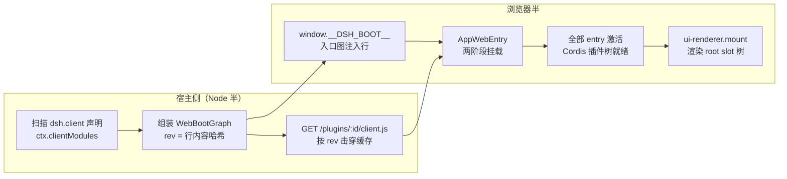
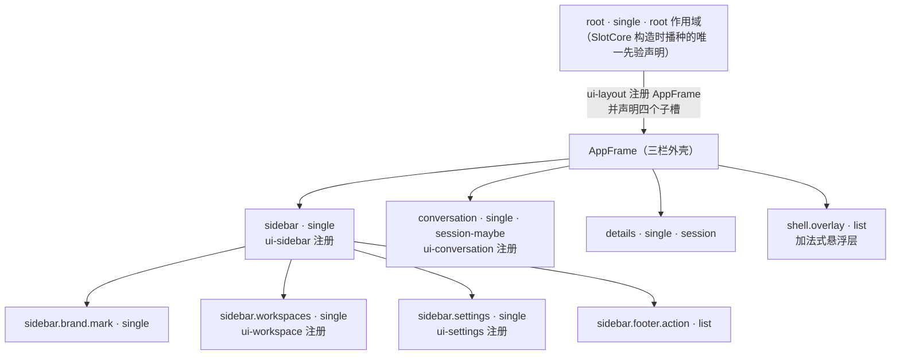
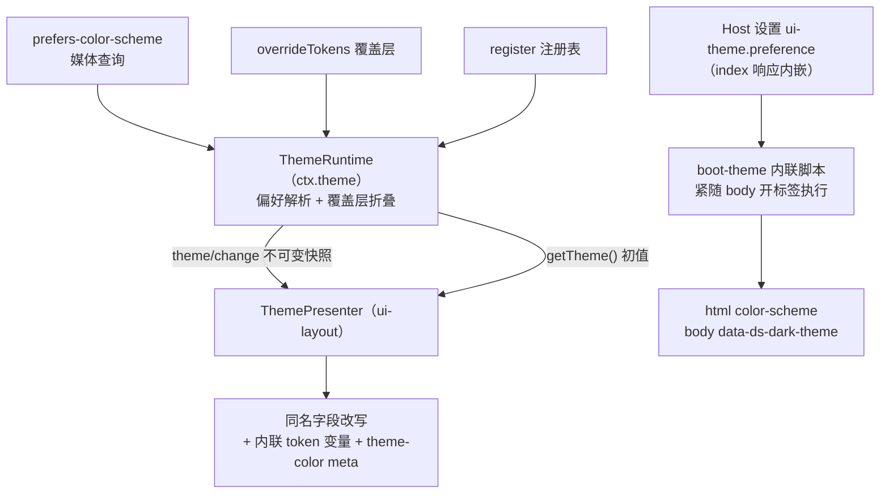

本页聚焦 dsh Web 图形界面的**浏览器半侧**：UI 插件如何进入页面、slot 槽位系统如何用一张类型表完成「声明即授权」的组合、store seat 如何承载插件本地状态，以及 `--dsw-*` token 主题体系与样式规则的职责边界。宿主侧网关与模块装订线属于[Web 应用双半侧架构：宿主侧网关服务器与浏览器侧客户端运行时](23-web-ying-yong-shuang-ban-ce-jia-gou-su-zhu-ce-wang-guan-fu-wu-qi-yu-liu-lan-qi-ce-ke-hu-duan-yun-xing-shi)的范畴，本页只在启动链路处与之衔接。

Sources: [README.zh.md](packages/client/README.zh.md#L1-L8)

## 浏览器半侧的插件版图

`packages/client/` 目录是 web GUI 的全部浏览器侧代码，除测试支持外每个子目录都是一个名为 `@deepseek-ai/dsh-client-<name>` 的产品包。它们分成三层：**启动底座**（`web` 启动内核、`modules` 模块装载、`connection` RPC 传输、`runtime` 共享服务、`hmr` 热更新、`locale` 词典）、**组合框架**（`ui-slots` 槽位核心、`ui-renderer` React 渲染器、`ui-theme` 主题、`ui-layout` 外壳、`ui-primitives` 共享控件），以及三十余个**功能插件**（会话、侧边栏、设置、工具树等）。每个包自带 README 声明自身约定，本页只横切其中与「插件—槽位—主题」相关的公共机制。

Sources: [README.zh.md](packages/client/README.zh.md#L9-L45)

一个包要成为浏览器 UI 插件，唯一的入会凭证是在 package.json 中声明 `dsh.client`（`platform: 'web'`，可选 `inject` 依赖边与 `immediately` 预取标记），并在 `exports["./client"]` 处导出构建产物。宿主侧 Node 半的 `ClientModuleRegistry`（`ctx.clientModules`）扫描 Loader 条目发现这些声明，把每个包组装成一行 `WebBootEntry`（条目 id、bundle 端点、内容哈希 `rev`、依赖边），整张图以 `window.__DSH_BOOT__` 全局注入行随 index 页面下发；浏览器随后按模块图序经 `GET /plugins/<id>/client.js?rev=<rev>` 拉取各 bundle，`rev` 内容哈希充当缓存击穿锚点。

Sources: [client-modules.zh.md](docs/subsystems/client-modules.zh.md#L11-L49)



图中虚线之上的三步是上一页宿主网关的职责；浏览器内的启动内核 `AppWebEntry` 分两阶段工作：**模块阶段**用 `window.__ModuleLoader__` 装载入口图，**激活阶段**接纳全部 Cordis 插件 fiber。启动页只用原生 DOM 与本地 CSS 绘制，因此任何客户端 bundle 或插件激活失败时仍能显示并逐项报告——应用首帧会等待完整名册，这是有意为之的一致性取舍。

Sources: [README.zh.md](packages/client/web/README.zh.md#L5-L20)

全部 entry 激活后，`dsh-client-web` 调用 `ctx.uiRenderer.mount(container)` 交出挂载点：`ui-renderer` 安装 slot 渲染器、hydrate 已有 DOM、把 observable 绑定为 `useSyncExternalStore` 订阅，然后挂载**组装完成的**应用。换言之，没有任何插件「自己渲染自己」——每个插件只向槽位注册表贡献组件，整棵 React 树由渲染器从 `root` 槽位一次性投影出来。

Sources: [README.zh.md](packages/client/ui-renderer/README.zh.md#L5-L19)

## UI 插件的解剖：inject、apply 与声明合并

每个客户端插件都是标准 Cordis 插件：模块顶层导出 `inject` 服务名数组与 `apply(ctx)` 函数体，所有副作用的注册与拆卸都走 `ctx.effect`，fiber 卸载时自动逆序回收。以 `ui-sidebar` 为例，它声明依赖 `['slots', 'layout', 'sessions', 'workspaces', 'locale']`，在 `apply` 里先用 `ctx.locale.register` 挂词典，再用一次 `ctx.slots.register(...)` 把 `SidebarRoot` 组件注册进 `sidebar` 槽位——两次 effect 的诊断标签会出现在 Cordis 的 fiber 树里。

Sources: [index.ts](packages/client/ui-sidebar/src/client/index.ts#L21-L59)

插件的**跨包类型协作**完全依赖 TypeScript 声明合并。`ui-slots` 在入口模块里导出空的 `SlotMap` 与 `LocaleNamespaceMap` 接口，消费者在自己的编译单元里 `declare module` 合并键——这样合并发生在词法位置而非 re-export 处，类型链才不会断裂。侧边栏的契约文件先以 type-only 导入拉进 `ui-layout` 的 SlotMap 合并（使 `PropsRuntime<'sidebar'>` 可解析），再声明本包拥有的五个子槽位键；词典同理，`sidebar` 命名空间合并进 `LocaleNamespaceMap` 后，注册点的 `locale:` 选项就能给组件挂上类型化的 `t` 翻译 seat。

Sources: [slots.ts](packages/client/ui-sidebar/src/client/contract/slots.ts#L1-L17)

```ts
// ui-sidebar：一条注册同时完成四件事
ctx.slots.register({
  name: 'sidebar',                 // 目标槽位（ui-layout 声明）
  locale: NS,                      // 声明词典命名空间 → 组件获得 t seat
  children: {                      // 声明子槽位 = 获得渲染授权
    'sidebar.brand.mark':  { kind: 'single', scope: 'root' },
    'sidebar.workspaces':  { kind: 'single', scope: 'root' },
    'sidebar.settings':    { kind: 'single', scope: 'root' },
    'sidebar.footer.action': { kind: 'list', scope: 'root' },
    /* … */
  },
  inject: injectProps,             // 注册方业务面：startSession / toggleSidebar
}, SidebarRoot)
```

Sources: [index.ts](packages/client/ui-sidebar/src/client/index.ts#L34-L53)

## 槽位机制：一张 SlotMap 的四重身份

槽位系统采用**纯核心 + 服务壳**的分层：`ui-slots` 是零运行时依赖（仅借用 React 类型）的注册表纯核心 `SlotCore`，持有声明台账、注册语义与加载时校验；`runtime` 包的 `SlotRegistry` 把它包成 Cordis Service（即 `ctx.slots`），补上事件桥、按调用方 fiber 回收的 effect 装订、渲染器安装契约与 store 实例轴。`ui-slots` 不依赖 Cordis，`SlotRegistry` 也不复制注册语义——类型层面它直接复用 `SlotCore['register']` 的签名，保持「一个权威，无结构拷贝」。

Sources: [README.zh.md](packages/client/ui-slots/README.zh.md#L3-L9)

核心设计是**声明合并出的 `SlotMap` 同时承担三重身份**：每个键的条目（`SlotEntryDef`）声明槽位的 kind（基数）与 scope（数据作用域）是**运行时分发规范**；父条目 `register` 调用里 `children` 表声明某个键，等于**渲染授权**——只有声明者被允许渲染这些键；同时这份表又参与**编译期类型检查**，`children` 的字面量会对照 SlotMap 条目校验 kind/scope/inject 一致性。一条铁律贯穿始终：「声明即认领」——声明了 children 的组件必须在渲染体里消费 `renderSlot`，`RendersCheck` 幻象类型会在违反时产生指名道姓的编译错误。

Sources: [index.ts](packages/client/ui-slots/src/index.ts#L511-L524)

### 四种基数与三种作用域

| kind | 语义 | 关键选项 | 分发方式 |
|---|---|---|---|
| `single` | 单占位，后来者遮蔽 | `priority`（默认 0，低者渲染） | 渲染遮蔽胜者 |
| `list` | 有序列表，贡献叠加 | `id`、`order`、`label` | 按 order 排序全渲染 |
| `keyed` | 键控路由，按键分发 | `key`、`priority` | 派发点传 `entryKey` |
| `chain` | 选择器竞选，反转键控 | `select`（必填）、`priority` | 条目自提名 |

Sources: [index.ts](packages/client/ui-slots/src/index.ts#L62-L96)

`scope` 轴决定框架注入哪些标准工具包：`root` 槽位只有全局 seat；`session-maybe` 槽位的钩子始终可调用、无会话时返回 `undefined`；`session` 槽位则拿到框架解析好的确定 `sessionId`（框架注入，拥有者 props 里永远不传）。**遮蔽规则**统一适用于 single/keyed/list：同一「单元格」（single 即槽位本身、keyed 同键、list 同 id）内的条目按 `priority` 升序共存，渲染最低优先级的存活者；在已占单元格的**相同优先级**上二次注册会直接抛错并指名占位者——无 priority 的组合保持「一格一人、响亮失败」。

Sources: [index.ts](packages/client/ui-slots/src/index.ts#L706-L737)

**chain 槽位**把键控路由反转为条目自提名：每次注册必须携带一个纯 `ChainSelect` 选择器（只读拥有者 props、无副作用），渲染时按 `priority` 升序依次执行，第一个非 null 返回值当选，其返回值成为组件的 `matched` prop；全部弃权则渲染拥有者的 fallback。`overlay: true` 还能让 fallback 永久挂载（当选时仅 `display:none` 隐藏），因此 fallback 持有的草稿、DOM 状态能在接管结束后存活——今天唯一的消费者是 `conversation.composer` 链：审批面板借此在等待期间接管输入区，审批关闭后 InputBar 无损回归。

Sources: [index.ts](packages/client/ui-slots/src/index.ts#L246-L257)

**加载时校验**把所有配置错误前置到 register 调用：向未声明槽位注册抛错；重复声明同一子键抛错（一条槽位只有一个声明者，错误信息指名首位声明者）；chain 注册缺 `select` 抛错；同一共享 store handle 挂到不同 scope 抛错。声明者的 disposer 会**级联折叠**其声明的全部子槽位——子条目递归清除、过期 disposer 变成无害空操作——一条生命周期轴，不留悬挂状态。

Sources: [index.ts](packages/client/ui-slots/src/index.ts#L787-L791)

### 组件 props 的四份额组合

注册点组件的 props 不需要手写，它们是四个（加 locale 五个）份额的**交集**，每份都从单一事实来源派生：

| 份额 | 类型 | 来源 |
|---|---|---|
| 运行时 | `PropsRuntime<K>` | SlotMap 条目：拥有者 props + 作用域标准包 + 全局 seat |
| 子槽渲染 | `PropsRenderSlots<S>` | `children` 键集合静态收窄的 `renderSlot` / `renderSlotChain` |
| store | `PropsStore<H>` | 已声明 handle 派生的 `useStore` 选择器钩子 + `actions` |
| 业务注入 | `I` | `inject` 工厂返回值推断 |
| 本地化 | `PropsLocale<N>` | `locale:` 命名空间的类型化 `t` seat |

Sources: [README.zh.md](packages/client/ui-slots/README.zh.md#L11-L17)

`renderSlot(key, owner, opts?)` 被静态收窄到本条目声明的子键集合；`__renders` 是一个从不物化的幻象方差锚点——泛型方法签名在键联合之间比较宽松，靠它做逆变标记才能在注册点强制「组件键集合 ⊆ children 声明」。声明 session 作用域子槽的条目还会额外收到 `SessionProvider` seat：声明会话子槽本身就是「让会话区域存在」，所以这个 seat 从子键集合的 scope 推导、由渲染器注入实现。

Sources: [index.ts](packages/client/ui-slots/src/index.ts#L327-L363)

`inject` 业务面是注册方私有的「服务接线」：工厂参数从声明派生（严格会话槽拿到确定的 `sessionId`，声明了 store 则追加烘焙后的 `actions`），返回值经 `ComposedProps` 并入组件约束。若 inject 面带有保留键 `hooks` 舱位（裸 observable source 集合），渲染器会在 outlet 处把每个 source 绑定成 `use<Name>` 选择器钩子——业务插件传裸数据源、不碰 React，框架完成绑定，这是客户端 bundle 保持「值不跨插件、类型可跨插件」纯净性门禁的关键。

Sources: [index.ts](packages/client/ui-slots/src/index.ts#L416-L432)

### 槽位树：从 root 到功能 seat



每个 `single` 槽位的 SlotMap 注释都写明了「在此注册会发生什么」：占据 `sidebar` 或 `conversation` 是**整体替换**该列、连带其声明的全部子 seat 消失；想给整个应用加一块自己的悬浮面（徽标、toast 栈、状态胶囊），正确入口是 `shell.overlay`——一个 list 槽位，条目彼此并列、默认点击穿透，新增 id 与既有条目共存而非顶替。这种「注释即护栏」的写法让动态插件作者无需读框架源码就能避开遮蔽陷阱。

Sources: [index.ts](packages/client/ui-layout/src/client/index.ts#L46-L90)

SlotMap 键合并发生在**拥有者包**而非消费方：`runtime` 只声明 `root` 一行，`ui-layout` 声明四栏，`ui-sidebar` 声明品牌与浏览区 seat，`ui-settings` 声明 `settings.general.*`……由此整棵树是「声明链」的自然产物：渲染器从 `root` 出发，读到的每个槽位的占用者又带来它们声明的下一层。`SlotRegistry` 还提供 `slots.inject(key, callback)`：为某个槽位声明的**每个生命周期**安装一个 effect，声明已存在则同步执行、不存在则在声明提交时执行、折叠后再次声明会重跑——`ui-brand-official` 正是用它把三个品牌占位者作为**一组声明感知注册**安装，无论其激活顺序先于还是后于声明方都能工作，任一声明折叠时全部占位者一起撤回，HMR 期间不留混合品牌。

Sources: [README.zh.md](packages/client/ui-brand-official/README.zh.md#L7-L13)

每次槽位变更都会同步触发版本号自增与 `slots/changed` 事件（供插件清单等诊断面板消费），`subscribe` 通知则按微任务批处理——同一 tick 内 N 次变更只产生一次通知。条目渲染崩溃经 `reportEntryError` 上报：遮蔽类槽位可选择让崩溃条目**退位**（一次性从单元格退役，幸存者顶上），chain 崩溃只报告不退位；注册本体始终留在台账上，拆除权归注册者。

Sources: [index.ts](packages/client/ui-slots/src/index.ts#L662-L677)

### store seat：声明式状态容器

槽位注册的 `store` 选项为组件树提供**声明式状态**：`defineStore({ init, persist?, actions })` 返回一个 `StoreHandle`——init 是每次实例化都产出新状态的工厂，`actions` 是对 state 的纯 immer-draft 变换表，同时充当**审计面**：组件只能通过这些 action 写入，绝无旁路。handle 有两种形态：在 apply 世界构造的**共享 handle**（同插件多次注册共用实例），或直接传工厂的**独占 handle**（框架按条目 × 作用域逐个实例化）。

Sources: [store.ts](packages/client/ui-slots/src/store.ts#L26-L45)

组件侧的 `PropsStore` 只暴露 `useStore` 选择器钩子与**烘焙后的** actions（draft 参数已被框架绑死剥离），从不暴露实例本身。实例轴归 `SlotRegistry` 所有：handle × scope key → 创建/缓存实例，最后一个持有条目卸载时整轴回收；会话作用域实例以 session id 为键各自持久化（persist 键按会话后缀），作用域消亡时框架调用 `clearPersisted` 清除孤儿的持久化键。`ui-conversation` 的聊天 store（选择与活跃视图）正是把同一个共享 handle 传给严格会话子树、聊天视图与详情注册的。

Sources: [slots.ts](packages/client/runtime/src/client/slots.ts#L11-L33)

## 主题运行时：`--dsw-*` token 与 ThemeRuntime

### token 样式表：静态色阶 + 语义别名

主题的载体是五张样式表——`base.css`（字体族与动效曲线基座）、`design-platform.css`（token 主体）、`scrollbar.css`、`gradient-shadow-text.css` 与 `shiki.css`（代码高亮），由 ui-theme 的动态客户端 entry 依次内联导入，编译进插件 bundle。安装方式是**插件持有的全局样式**：`installThemeStyles` 为每张表创建一个带 `data-plugin` 标记的 `<style>` 标签挂到 `<head>`，effect 拆卸时移除——因此插件卸载与 HMR 都会随 ui-theme fiber 的生死干净进出，没有游离的孤儿样式。

Sources: [styles.ts](packages/client/ui-theme/src/client/styles.ts#L8-L35)

token 分两层。**静态尺度层** `--dsw-static-*` 是设计平台导出的原色板（amber/blue/deepseek/green/neutral/red 等家族），light 值写在 `body`、dark 值写在 `body[data-ds-dark-theme]`；**别名语义层** `--dsw-alias-*`（外加少量 `--dsw-specific-*`）把角色语义（`bg-layer-1`、`label-primary`、`state-error-primary`……）指到静态色阶上，功能组件只允许消费这一层。

Sources: [design-platform.css](packages/client/ui-theme/src/styles/design-platform.css#L80-L140)

```css
/* 静态层：同一变量两套色值 */
body[data-ds-dark-theme] { --dsw-static-neutral-bluish-950: rgb(21, 21, 23); }
/* 别名层：语义角色 → 静态色阶，逐主题重指 */
body { --dsw-alias-bg-layer-1: var(--dsw-static-neutral-bluish-00); }
body[data-ds-dark-theme] { --dsw-alias-bg-layer-1: var(--dsw-static-neutral-bluish-875); }
```

Sources: [design-platform.css](packages/client/ui-theme/src/styles/design-platform.css#L248-L260)

### ThemeRuntime 服务：偏好、注册表与覆盖层

`ctx.theme` 是 `ThemeRuntime` 服务：它持有实时主题偏好（`light`／`dark`／`system`），把 `system` 经 `prefers-color-scheme` 媒体查询解析为实际主题，并发布**不可变的** `ThemeSnapshot`（preference、折叠覆盖层后的 active 定义、注册表、单调 revision）。服务本身**从不碰 DOM**——呈现交给 ui-layout 的 presenter；偏好持久化走 Host 设置文档的 `ui-theme` 命名空间，写入口只有 `setTheme`，持续同步只有 `theme/change` 事件。

Sources: [index.ts](packages/client/ui-theme/src/client/index.ts#L104-L161)

| API | 语义 | 失败模式 |
|---|---|---|
| `getTheme()` | 读当前不可变快照 | 引用稳定至下次变更 |
| `setTheme(id)` | 唯一的用户偏好写入口 | 未注册 id 抛错 |
| `register(def)` | 注册第三方主题（别名层覆盖） | 重复 id 抛错；`system` 不可注册；注销活跃主题时偏好回退默认 |
| `overrideTokens(source, tokens)` | 在活跃主题上叠放 token 覆盖层 | 裸字符串值抛**教学型**错误 |
| `exportInspectTokens()` | 导出 JSON 安全的 token 目录 | 供 Cordis 检查面预读 |

Sources: [index.ts](packages/client/ui-theme/src/client/index.ts#L217-L291)

两条定制通道值得区分。`register(ThemeDefinition)` 进入注册表：`ThemeDefinition` 携带 `id`、`colorScheme`（presenter 据此切换 `data-ds-dark-theme`，永远不看 id）与 `tokens` 别名覆盖；`overrideTokens(source, tokens)` 则是**token 级的槽位遮蔽模拟**——基础主题不动，覆盖层按 seq 序叠放、后者逐 token 胜出，移除一层即恢复其覆盖之物，同 source 重复调用整层替换并重排到栈顶（正是 effect 重注册语义）。每项覆盖值必须是 `{ light, dark }` 成对字符串：色板无关的 token 也要重复同值，否则用户切到另一配色时覆盖会「失明」——运行时校验器会对违规值抛出解释原因的教学型 `TypeError`。

Sources: [index.ts](packages/client/ui-theme/src/client/index.ts#L266-L291)

主题服务的设置面也是**功能自治**的范本：ui-theme 的 apply 里没有通用的「设置页适配层」，它直接向 `settings.general.item` 列表槽位注册 `order: 10` 的 Appearance 行，经 `ctx.slots.inject` 挂声明感知 effect，并用 `theme/change` 事件把偏好同步进行的本地 store——「功能拥有自己的设置表面」，与它拥有自己的词典、样式一样。

Sources: [index.ts](packages/client/ui-theme/src/client/index.ts#L377-L416)

### 无闪烁首帧与 DOM 投影



主题偏好在**插件树激活之前**就已生效：宿主组合含 HTTP 服务器时，每份 index 响应会把已注册的 Host 设置 `ui-theme.preference` 嵌进一段紧随 `<body>` 开标签的内联脚本，浏览器按 OS 配色解析 `system` 并直接写 `color-scheme` 与 `data-ds-dark-theme`——启动页回退样式与到达中的 token 保持同族，暗色用户看不到白闪。

Sources: [boot-theme.ts](packages/client/ui-theme/src/boot-theme.ts#L18-L35)

插件树激活后，`ThemePresenter`（ui-layout 内）接管同两个字段：`apply(snapshot)` 从 `active.colorScheme` 设置根节点 `color-scheme` 与 body 调色板属性，再**先撤后写**地替换上次由它写入的内联 token 变量，最后用计算出的 body 背景色刷新自家唯一的 `<meta name="theme-color">`。presenter 只收回自己写过的东西，外来属性、元数据与内联样式全部幸存；ui-layout 的 apply 用一个 effect 订阅 `theme/change`，初始态走 `getTheme()` 读一次、此后纯事件驱动，没有 React 路径。

Sources: [theme-presenter.ts](packages/client/ui-layout/src/client/theme-presenter.ts#L1-L63)

滚动条是这套体系里「间接层」约定的代表：`scrollbar.css` 在 `body` 上把 `--dsh-scrollbar-thumb(-hover)` 绑定到 l1 表面 token，两条渲染路径（WebKit 伪元素与标准属性）读同一组变量；高层级表面（菜单、浮层、对话框）在自己的容器上重设这组变量即可换肤。两条路径因 `scrollbar-width/color` 的非 auto 值会让 Chromium/Safari 丢弃整个 `::-webkit-scrollbar*` 规则集而**构造性互斥**，标准属性被隔离在 `@supports not selector(::-webkit-scrollbar)` 之内。`ui-sidebar` 更进一步把它做成指针可供性——指针不在栏内时把间接层重绑为 `transparent`，滑块在指针离开后保留两秒。

Sources: [README.zh.md](packages/client/ui-theme/README.zh.md#L11-L17)

## 样式职责归属与组件规则

样式系统的权威文件是 `docs/web-styling.zh.md`：`ui-theme` 独占 `--dsw-*` 静态色阶、语义别名、排版、动效、渐变、阴影、滚动条样式与明暗偏好；`ui-layout` 把解析后的主题快照应用到文档；功能包**只消费**语义别名。全局样式表归 `ui-theme/src/styles/` 所有，组件样式以 CSS Modules 放在组件旁——组件可以为自己的布局约定定义**局部**自定义属性，但共享的颜色、排版、层级与动效一律属于主题包。

Sources: [web-styling.zh.md](docs/web-styling.zh.md#L7-L11)

| 职责 | 归属包 | 说明 |
|---|---|---|
| `--dsw-static-*` 静态色阶、`--dsw-alias-*` 语义别名 | `ui-theme` | token 样式表是颜色值唯一权威来源，缺失值有意不补 |
| 明暗切换、`data-ds-dark-theme`、`theme-color` meta | `ui-theme` 定义 + `ui-layout` 投影 | presenter 只撤自写之物 |
| 面板几何、三栏框架、主题快照应用 | `ui-layout` | 几何为瞬时状态，不落 localStorage |
| 组件样式（CSS Modules） | 各功能包 | 紧邻组件文件，随组件生命周期 |
| 组件局部自定义属性 | 各功能包 | 仅限组件自身布局约定 |

Sources: [web-styling.zh.md](docs/web-styling.zh.md#L7-L25)

组件规则是可静态检查的硬约束：使用 CSS Modules 与 `clsx`，**不得**引入组件库或 Tailwind；功能组件只能用 `--dsw-alias-*` 语义 token，不得复制静态色板值或写颜色字面量；功能组件 CSS **不得包含主题选择器**——明暗覆盖属于主题所有方；字号必须与行高成对，已有排版角色时用主题变量；源码文本、终端输出与 diff 行在约定保留列结构时不得换行，滚动条用共享样式、禁止组件私选器；呈现规则写在 CSS 里，React 内联样式至多传递局部自定义属性值、不得编码主题分支；新增过渡或悬停显形控件必须保留键盘焦点可见性与 reduced-motion 行为。

Sources: [web-styling.zh.md](docs/web-styling.zh.md#L13-L21)

变更系统同样单向：先在 `ui-theme` 所属样式表添加或修改共享 token，再让功能包改用其语义别名；公共样式约定变化时同步更新所属包参考文档。主题侧的已知边界也写在 README 里——第三方主题目前只是**表层**：注册主题即覆盖同名别名变量，但不校验一组覆盖是否完整；token 样式表是颜色值的唯一权威来源，设计中缺失的值有意不补，一律取最接近的语义 token。

Sources: [web-styling.zh.md](docs/web-styling.zh.md#L23-L25)

## 延伸阅读

槽位与主题机制都构建在 Cordis 的插件/服务/事件模型之上，读法建议先回[核心包地图：包分组职责与 ctx 服务键导览](10-he-xin-bao-di-tu-bao-fen-zu-zhi-ze-yu-ctx-fu-wu-jian-dao-lan)对照 `ctx.slots`、`ctx.theme`、`ctx.layout` 的服务键位置；宿主半侧如何装订 bundle 与 index 注入行见[Web 应用双半侧架构：宿主侧网关服务器与浏览器侧客户端运行时](23-web-ying-yong-shuang-ban-ce-jia-gou-su-zhu-ce-wang-guan-fu-wu-qi-yu-liu-lan-qi-ce-ke-hu-duan-yun-xing-shi)。想动手扩展界面，可继续读[TypeScript 进程外 SDK：JSON-RPC 协议、客户端与服务端插件](25-typescript-jin-cheng-wai-sdk-json-rpc-xie-yi-ke-hu-duan-yu-fu-wu-duan-cha-jian)了解进程外插件的接入方式，或查阅[构建与发布工程：Host/Client 双聚合、Typert 类型反射与各阶段产物](29-gou-jian-yu-fa-bu-gong-cheng-host-client-shuang-ju-he-typert-lei-xing-fan-she-yu-ge-jie-duan-chan-wu)理解客户端 bundle 的构建与校验门禁。