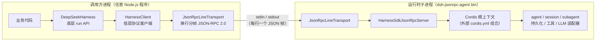
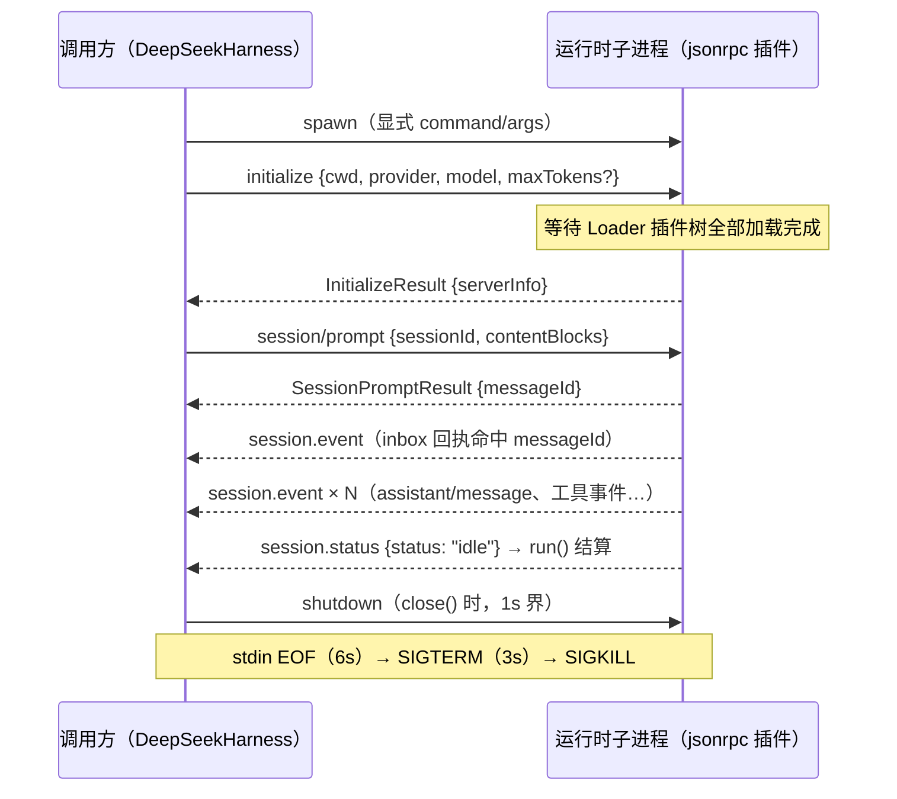

本页剖析 DeepSeek Harness 的 TypeScript 进程外 SDK 协议栈：`@deepseek-ai/dsh-sdk-protocol`（协议层）、`@deepseek-ai/dsh-sdk-client`（客户端库）、`@deepseek-ai/dsh-sdk-jsonrpc-server`（服务端 Cordis 插件），以及承载它们的 `dsh-jsonrpc-agent` 运行时 bin 与进程内消费者 `dsh-subagent-dsh-sdk`。读完本页你将理解：换行分帧的 JSON-RPC 2.0 线格式如何定义、服务端插件如何把一个完整 harness 上下文暴露给外部进程、客户端如何以“活动区间”语义驱动 agent 轮次，以及子进程如何被回收。

## 定位与总体架构

`packages/sdk/` 是一个独立的包组，职责是“从另一进程驱动 Harness 运行时”：调用方提供运行时可执行文件及其 `cordis.yml`，SDK 不创建、配置或启动开发者的项目。三个包按职责严格分层——`protocol/` 定义通信协议，`client/` 通过 TypeScript API 驱动运行时，`server/` 通过 stdio JSON-RPC 为进程外客户端提供服务。

Sources: [README.zh.md](packages/sdk/README.zh.md#L1-L12)

整体数据流是典型的“双进程 + 单通道”模型：调用方进程持有客户端对象并 spawn 一个 `dsh-jsonrpc-agent` 子进程；子进程内部由外部 `cordis.yml` 组合出完整的 Cordis 插件树，其中 `jsonrpc` 插件在进程 stdin/stdout 上挂载 JSON-RPC 服务器。**stdout 即协议**——除 JSON-RPC 帧之外任何输出都会污染通道，因此部署必须省略 stdout 日志器，诊断走 stderr。

上述结构中，客户端是纯库——它不向任何 Cordis 上下文注册插件；它 spawn 出的运行时进程是一个由自身 `cordis.yml` 完整配置的 harness。服务端则是“单一具名插件”：加载进任意组合即可让该组合获得对外服务能力，其余插件（工具、持久化、LLM 适配器）全部由外围配置决定。

Sources: [index.ts](packages/sdk/client/src/index.ts#L1-L9)
Sources: [README.zh.md](packages/sdk/server/README.zh.md#L3-L5)
Sources: [README.zh.md](packages/examples/jsonrpc-demo/README.zh.md#L3-L5)

## 协议层：换行分帧的 JSON-RPC 2.0

`@deepseek-ai/dsh-sdk-protocol` 是协议两端共享的线格式包，包含一个传输类和具名的请求/结果/通知类型。`JsonRpcLineTransport` 在**调用方持有的字节流**上分帧：每行一个紧凑 JSON、以 `\n` 结尾；带 `id` 与 `method` 的帧是请求，仅带 `id` 是响应，仅带 `method` 是通知。非法 JSON 行被直接忽略；请求处理器缺失返回 `-32601`，处理器抛错返回 `-32603`，无处理器的通知被丢弃。

Sources: [transport.ts](packages/sdk/protocol/src/transport.ts#L1-L7)
Sources: [README.zh.md](packages/sdk/protocol/README.zh.md#L9-L15)
Sources: [transport.ts](packages/sdk/protocol/src/transport.ts#L56-L61)

传输类的设计要点在于生命周期与并发控制。`start()` 挂接流监听器（幂等），`close()` 移除监听器并让所有挂起请求以错误落定，但不销毁底层流——这使得客户端可以在进程退出边缘安全地切断协议层。`request()` 支持可选的 `AbortSignal` 作为**放弃信号**：中止时直接删除挂起条目并拒绝，不为可能永远不会到来的响应保留状态；客户端正是用它实现了超时即放弃的语义。`flush()` 则通过一个零字节写入回调作为屏障，确保先前的帧都已落盘——服务端在退出前靠它把 shutdown 响应冲刷出去。

Sources: [transport.ts](packages/sdk/protocol/src/transport.ts#L75-L91)
Sources: [transport.ts](packages/sdk/protocol/src/transport.ts#L113-L126)
Sources: [transport.ts](packages/sdk/protocol/src/transport.ts#L162-L173)

协议本身只有三个客户端→服务端请求和四个服务端→客户端通知，全部在 `types.ts` 中按方法名索引为 `HarnessSdkRequestMap` 与 `HarnessSdkNotificationMap`：

| 方向 | 方法 | 载荷类型 | 语义 |
|---|---|---|---|
| client→server | `initialize` | `InitializeParams` → `InitializeResult` | 进程级握手：cwd、provider、model、可选 maxTokens；返回 wire 稳定的 `serverInfo` |
| client→server | `session/prompt` | `SessionPromptParams` → `SessionPromptResult` | 向一个 SDK 会话投递一条用户消息，返回**持久入队回执** `messageId` |
| client→server | `shutdown` | 无参数 → `{}` | 请求服务端有序停机 |
| server→client | `session.event` | `SessionEventNotification` | 每条会话日志事件，随写随流（不过滤，覆盖运行时内**每个**会话） |
| server→client | `session.status` | `SessionStatusNotification` | 整个 agent 的 `running`/`idle` 状态迁移 |
| server→client | `subagent.started` | `SubagentStartedNotification` | 运行时内派生了子会话 |
| server→client | `subagent.finished` | `SubagentFinishedNotification` | **仅进程内**子代理运行结束，含状态映射与停止原因 |

Sources: [types.ts](packages/sdk/protocol/src/types.ts#L15-L48)
Sources: [types.ts](packages/sdk/protocol/src/types.ts#L50-L98)
Sources: [README.zh.md](packages/sdk/protocol/README.zh.md#L17-L27)

协议刻意保持“窄”：`SessionPromptResult.messageId` 只标识入队的 `UserMessage`，**不**标识后续助手消息、轮次结束或提示词结果——客户端需要自行定义并观察活动区间。协议也没有版本协商（握手只携带 `serverInfo.version`，客户端不校验）、没有提示词取消或逐会话关闭方法，server→client 请求虽被传输层支持但服务器从不发送（为未来审批流预留）。处于预发布阶段，这些留白都是显式的已知限制而非疏漏。

Sources: [README.zh.md](packages/sdk/protocol/README.zh.md#L25-L27)
Sources: [README.zh.md](packages/sdk/server/README.zh.md#L41-L49)

## 服务端插件：dsh-sdk-jsonrpc-server

服务端包遵循 Cordis 插件的标准形状：导出 `name`（`sdk-jsonrpc-server`）、`inject: ['agents']`（仅要求 agent 工厂服务）、`Config` schema 与 `apply` 函数。`JsonRpcConfig` 只暴露一个部署键 `maxTokensAsSuccess`（默认 `false`），外加仅供测试注入的 `input`/`output`/`exit` 运行时钩子——生产环境直接使用进程 stdio 和 `process.exit`。

Sources: [index.ts](packages/sdk/server/src/index.ts#L20-L38)

`apply` 的装配逻辑很薄：构造一个 `JsonRpcLineTransport` 和一个 `HarnessSdkJsonRpcServer`，把请求分发挂到传输上，再通过 `ctx.effect(..., 'jsonrpc.serve')` 启动读取循环。两个细节值得注意：其一，`initialize` 被作为**运行时就绪边界**处理——插件可能先于异步同级插件（例如 MCP 客户端的初始工具发现）激活，所以处理 `initialize` 前会 `await ctx.get('loader')?.await()`，等整棵插件树加载完才宣告就绪；手工组装的无 Loader 上下文则立即可用。其二，shutdown 响应写回后通过 `setImmediate` 触发一个共享的退出任务：冲刷传输、dispose 根上下文（包括持久化），最后 `exit(0)`——用单例任务防止竞态的多次 shutdown 请求重复释放或重复退出。

Sources: [index.ts](packages/sdk/server/src/index.ts#L46-L98)

`HarnessSdkJsonRpcServer` 是协议方法的承载者，构造时订阅四类上下文事件并把它们桥接为线通知：`session/event` → `session.event`、`agent/status` → `session.status`、带父会话的 `session/created` → `subagent.started`、`subagent/end` → `subagent.finished`。转发 subagent 完成事件时有一个严格的本地性判定：只有服务在快照记录的 `local` 标志为 true 才转发——提供方名称、子级 id 匹配或持久化谱系都不能证明本地性，远程运行的子代理（如 ACP/Codex）不会被上报。

Sources: [server.ts](packages/sdk/server/src/server.ts#L53-L104)

会话管理采用**惰性创建 + 去重**：`session/prompt` 收到未知 `sessionId` 时创建新的 agent+session 对（读取握手时记录的 cwd/provider/model/maxTokens），创建中的会话用 `sessionCreations` Map 去重，防止并发提示词重复建会话。交付前还会校验记录的 agent 仍存活于全局注册表——若 agent 被服务器外部 dispose，返回明确错误而不是让 `followup()` 静默失败。`initialize` 时若请求的 provider 没有已注册适配器，唯一回退是为 `deepseek-official` 挂载 `dsh-llm-deepseek` 插件；其他未知 provider 直接报错。插件自身没有默认导出——否则 Cordis loader 的 `unwrapExports` 会丢失 `name`/`inject` 等元数据（见事故复盘 0001）。

Sources: [server.ts](packages/sdk/server/src/server.ts#L111-L125)
Sources: [server.ts](packages/sdk/server/src/server.ts#L132-L143)
Sources: [server.ts](packages/sdk/server/src/server.ts#L203-L239)
Sources: [index.ts](packages/sdk/server/src/index.ts#L5-L7)

## 客户端两层 API

`@deepseek-ai/dsh-sdk-client` 暴露两层 API。底层 `HarnessClient` 拥有子进程：spawn 运行时、走协议线、把服务器通知扇出到订阅、通过私有回收阶梯拆除子进程。高层 `DeepSeekHarness`/`HarnessSession` 在其上提供 `run()` 语义。它与 Python SDK 的 `HarnessClient` 是**设计孪生**——双方驱动同一个运行时协议；不同在于 TypeScript 版没有捆绑运行时解析，`command`/`args` 完全显式，由调用方指明要启动哪个运行时。

Sources: [client.ts](packages/sdk/client/src/client.ts#L1-L13)
Sources: [README.zh.md](packages/sdk/client/README.zh.md#L3-L9)

| 层 | 入口 | 职责 |
|---|---|---|
| 高层 API | `DeepSeekHarness` / `HarnessSession` | 惰性启动 + 记忆化握手；`run()` 从入队回执收集到 idle，产出 `RunResult`；支持 `await using` |
| 低层客户端 | `HarnessClient` | 显式 `start()/initialize()/prompt()/request()/subscribe()/close()`；子进程所有权与超时 |
| 订阅面 | `NotificationSubscription` | 可等待、可迭代的每订阅队列，支持过滤器与会话树过滤 |
| 回收 | `disposeRuntimeProcess` | stdin EOF → SIGTERM → SIGKILL 阶梯，直到进程真正退出 |

Sources: [api.ts](packages/sdk/client/src/api.ts#L22-L43)
Sources: [index.ts](packages/sdk/client/src/index.ts#L10-L30)

`DeepSeekHarness.start()` 把 `initialize` 握手记忆化为一个 Promise：首次调用 spawn 并握手；失败时回收该运行时并替换一个全新客户端（`HarnessClient.close` 是永久的），因此后续调用可以重试新子进程——除非 `close()` 已终结整个 harness。一个防呆细节：握手用的 cwd 在本进程内就解析为绝对路径，因为线上的相对值会在子进程里再解析一次，导致 `worker` 变成 `worker/worker` 这类双重解析。

Sources: [api.ts](packages/sdk/client/src/api.ts#L45-L80)
Sources: [api.ts](packages/sdk/client/src/api.ts#L33-L43)

`HarnessSession.run()` 实现了**活动区间所有权**：先订阅本会话的会话树，投递提示词拿到 `messageId`，然后持续消费通知直到看到该消息出现在持久化的 inbox 回执中（`agent/inbox/spliced`），再一直收集到整个 agent 下一次进入 `idle`。整个过程产出 `RunResult { sessionId, finalResponse, events, notifications }`——`finalResponse` 是区间内最后一条助手消息的拼接文本。注意协议层**没有线级取消**：超时的请求在服务端继续运行直到运行时关闭，客户端的超时只是本地放弃。

Sources: [api.ts](packages/sdk/client/src/api.ts#L146-L194)
Sources: [client.ts](packages/sdk/client/src/client.ts#L175-L197)

订阅机制支持单订阅过滤器和**会话树过滤**：`subscribeSessionTree(rootId)` 从 `subagent.started` 通知里累积父→子谱系边，让根会话的订阅自动涵盖运行时内发现的所有后代会话——服务端对每个会话都发通知，范围收敛完全在客户端完成（与 Python SDK 一致）。错误模型用三个具名异常表达：`TransportClosedError`（运行时死亡/不可用，消息带退出码和最多 400 行 stderr 尾巴）、`RequestTimeoutError`（超请求超时）、`SdkProtocolError`（对端违反协议形状）。

Sources: [client.ts](packages/sdk/client/src/client.ts#L342-L372)
Sources: [client.ts](packages/sdk/client/src/client.ts#L403-L430)
Sources: [client.ts](packages/sdk/client/src/client.ts#L38-L65)
Sources: [client.ts](packages/sdk/client/src/client.ts#L27-L28)

## 子进程回收：EOF → SIGTERM → SIGKILL 阶梯

客户端的 `close()` 先尽力发送协议 `shutdown`（受 `shutdownTimeoutMs` 约束，默认 1000ms，失败仅记诊断），然后执行私有的回收阶梯直到进程真正退出。这个阶梯是 SDK 客户端**私有的**：它运行在任何 harness 上下文之外，因此不能搭乘 `dsh-subprocess` 服务——这是该接缝文档化的例外场景。

Sources: [client.ts](packages/sdk/client/src/client.ts#L374-L401)
Sources: [dispose.ts](packages/sdk/client/src/dispose.ts#L1-L9)

| 阶梯层级 | 动作 | 默认宽限 | 平台差异 |
|---|---|---|---|
| 1. 协作停机 | 关闭 stdin（EOF），等待运行时自行 flush 与持久化 | `disposeEofGraceMs` = 6000ms | 全平台一致 |
| 2. 优雅终止 | 发送 `SIGTERM` | `disposeGraceMs` = 3000ms | Windows 跳过：Node 把信号都映射为 `TerminateProcess` |
| 3. 强制终止 | 发送 `SIGKILL` 并等待有界退出边 | 复用 `disposeGraceMs` | 两平台一致 |

Sources: [dispose.ts](packages/sdk/client/src/dispose.ts#L82-L99)
Sources: [types.ts](packages/sdk/client/src/types.ts#L37-L44)

阶梯实现上每层都不遗留监听器：竞争退出与定时器时，超时会移除 `exit` 监听、退出会清掉定时器，宽限定时器都 `.unref()` 以免拖住父进程事件循环。运行时侧的对称实现：EOF 和 `SIGTERM` 触发根上下文 dispose 后以 0 退出，`SIGINT` 以 130 退出——所以 stdin EOF 是一个合法的“客户端消失”信号，但它会**立即**截断进行中的工作；需要有序完成的调用方应使用协议级 `shutdown`。

Sources: [dispose.ts](packages/sdk/client/src/dispose.ts#L13-L32)
Sources: [runner.ts](packages/examples/jsonrpc-demo/src/runner.ts#L39-L54)
Sources: [README.zh.md](packages/examples/jsonrpc-demo/README.zh.md#L29-L34)

一次完整交互的时序如下（这是理解两层 API 协作的关键前提）：

## 运行时进程与组合：dsh-jsonrpc-agent

运行时 bin `dsh-jsonrpc-agent` 由包 `@deepseek-ai/dsh-sdk-jsonrpc-demo` 发布（其 `package.json` 的 `bin` 字段指向 `lib/bin.js`）。它是一个**只含 bin 的应用**：启动外部 `cordis.yml`、自身不组合任何业务插件。配置发现只有两个通道——`$DSH_CORDIS_CONFIG` 环境变量优先，其次位置参数 `argv[2]`；都不指向存在文件时向 stderr 打印单行用法并以 1 退出，没有工作目录回退或内置回退。

Sources: [package.json](packages/examples/jsonrpc-demo/package.json#L15-L17)
Sources: [runner.ts](packages/examples/jsonrpc-demo/src/runner.ts#L20-L36)
Sources: [README.zh.md](packages/examples/jsonrpc-demo/README.zh.md#L7-L17)

仓库自带的参考组合是 `examples/jsonrpc-agent/cordis.yml`——一个面向无人值守编码 agent 的部署：挂载 `sdk-jsonrpc-server`（`maxTokensAsSuccess` 从 `DSH_MAX_TOKENS_AS_SUCCESS` 读取，默认 true）、DeepSeek 适配器（thinking + max effort）、JSONL 会话持久化、自动压缩，以及前台 bash、文件系统工具、todo 与进程内 spawn 提供方的 subagent。它刻意**不**加载终端 UI、控制台日志记录器、批准界面或用户交互工具，因为 stdout 属于 SDK 协议、轮次由 SDK 驱动。

Sources: [cordis.yml](examples/jsonrpc-agent/cordis.yml#L1-L90)
Sources: [README.zh.md](examples/jsonrpc-agent/README.zh.md#L3-L11)

值得记住的一条部署不变量：**bin 无法证明配置提供了 JSON-RPC 服务**——不含 `dsh-sdk-jsonrpc-server` 条目的有效配置也能成功启动，只是不对外服务。同时 stdin EOF 会立即释放根上下文，可能截断正在处理的轮次，这两点都记录在包的已知限制中。

Sources: [README.zh.md](packages/examples/jsonrpc-demo/README.zh.md#L29-L34)

## 进程内消费者：dsh-subagent-dsh-sdk

SDK 的头号仓库内消费者是 `@deepseek-ai/dsh-subagent-dsh-sdk`：一个 subagent 提供方，把每次委派都作为一个**全新的子 harness 运行时进程**运行，经 TypeScript SDK 客户端通过 stdio JSON-RPC 驱动。它是 ACP 后端之外的第二个进程外后端，结构完全镜像 `dsh-subagent-acp`：子进程握手完成后才发布运行句柄、子级失败展平为停止原因、拆除到停稳。

Sources: [README.zh.md](packages/subagent/subagent-dsh-sdk/README.zh.md#L3-L5)
Sources: [run.ts](packages/subagent/subagent-dsh-sdk/src/run.ts#L1-L12)

`startSdkRun` 的流程展示了 SDK 客户端的真实用法：以 `scrubbedParentEnv()` 为基底、合并显式 `config.env`（例如子进程自己的 `DEEPSEEK_API_KEY` 或 `DSH_CORDIS_CONFIG`）构造子环境；spawn 后以取消信号竞争 `initialize` 握手，任何启动失败都拥有仍私有的进程并在拒绝前回收它。握手完成后，提供方用 `AssistantOutputFold` 从子会话事件流中折叠出最终答案，读取最后一个 `turn/end` 并把原因映射到接缝词汇：`completed`/`max-tokens`/`aborted` 各自直通，其余一切（error、interrupted、disposed、无轮次）一律映射为 `error`——不干净的停止永远不会被报告为完成。由于协议没有线级提示词取消，dispose 是先在本地把结果确定为 `aborted`，再走有界 shutdown 加共享回收阶梯。

Sources: [run.ts](packages/subagent/subagent-dsh-sdk/src/run.ts#L112-L200)
Sources: [run.ts](packages/subagent/subagent-dsh-sdk/src/run.ts#L78-L92)

该提供方的语义边界同样明确：不宣告任何启动期能力（`outputSchema`/`depthLimit`/`toolFilter`/`persona` 全为 false），`inheritsParentContext: false`——子进程是另一进程里的全新运行时，唯一来自父方的输入是工作区 cwd，父级对话不会进入子级，子级 transcript 留在子进程自己的会话根目录。每次运行都使用全新进程（无进程池），因为 harness 运行时需要启动完整插件树，spawn 成本高于 ACP 后端常用的子进程。

Sources: [README.zh.md](packages/subagent/subagent-dsh-sdk/README.zh.md#L33-L41)
Sources: [README.zh.md](packages/subagent/subagent-dsh-sdk/README.zh.md#L86-L91)

## 设计取舍与已知限制

把三层职责放在一起看，这套 SDK 的取舍非常清晰：协议窄、状态少、纪律靠约定。

| 维度 | 现状 | 影响 |
|---|---|---|
| 协议版本 | 无协商，握手仅携带 `0.0.1` 且不校验 | 预发布阶段，无兼容承诺 |
| 取消 | 无线级提示词取消/逐会话关闭 | 放弃轮次 = 关闭运行时进程 |
| 结果模型 | `messageId` 只是入队回执 | 活动区间由客户端定义并观察（`run()` 封装了从回执到 idle 的区间） |
| server→client 请求 | 传输层支持但从不发送 | 为审批流预留的承载能力 |
| stdout 纯净性 | 由部署保证，插件不检查同级 logger | 配置若加载 stdout logger 会破坏 JSON-RPC 通道 |
| 运行时解析 | TypeScript 侧无捆绑运行时发现 | `command`/`args` 显式；打包可执行文件的发现在 Python 侧 |
| 自动适配器 | 仅 DeepSeek 回退 | 其他 provider 必须已在上下文中注册适配器 |

Sources: [README.zh.md](packages/sdk/protocol/README.zh.md#L31-L40)
Sources: [README.zh.md](packages/sdk/client/README.zh.md#L33-L50)
Sources: [README.zh.md](packages/sdk/server/README.zh.md#L41-L49)

从工程视角看，三个最有复用价值的设计决策是：**初始化即就绪边界**（服务端 `initialize` 等待整棵插件树加载完成，让首次提示词就能看到 MCP 工具发现等异步能力）、**通知广播 + 客户端过滤**（服务端不过滤、客户端用会话树谱系自行收敛，服务端保持无状态）、以及**退出永远有界**（从协议 shutdown 到信号阶梯的每一级都有超时且不遗留监听器）。这些决策同样定义了 Python SDK 的行为——两者共享同一运行时对端与协议分层，差异只在语言侧的封装（Python 侧额外提供内置运行时二进制分发）。

Sources: [index.ts](packages/sdk/server/src/index.ts#L76-L89)
Sources: [client.ts](packages/sdk/client/src/client.ts#L354-L372)
Sources: [README.zh.md](packages/sdk/client/README.zh.md#L3-L5)

## 下一步阅读

理解了 TypeScript SDK 之后，自然的下一步是对照它的设计孪生 [Python SDK：子进程驱动方式与内置运行时二进制分发](26-python-sdk-zi-jin-cheng-qu-dong-fang-shi-yu-nei-zhi-yun-xing-shi-er-jin-zhi-fen-fa)，了解打包可执行文件如何在无 Node.js 目标机上运行同一协议；也可以在 [示例组合包导览：acp-agent、headless-agent、jsonrpc-agent 与 mcp-memory](27-shi-li-zu-he-bao-dao-lan-acp-agent-headless-agent-jsonrpc-agent-yu-mcp-memory) 中查看 jsonrpc-agent 组合的完整上下文；若想深入 SDK 作为 subagent 后端在整个委派体系中的位置，请参见 [Subagent 委托、多提供方注册与实验性 Agent 团队](18-subagent-wei-tuo-duo-ti-gong-fang-zhu-ce-yu-shi-yan-xing-agent-tuan-dui)。