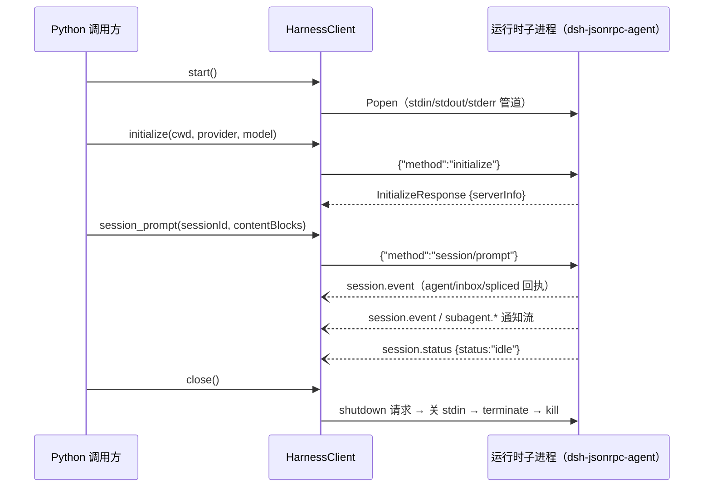
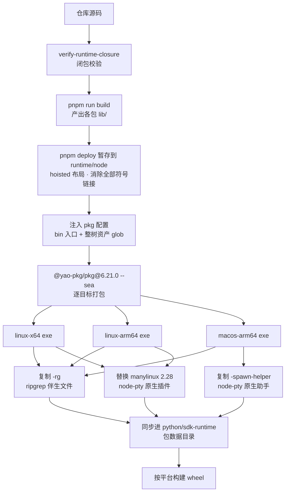

本页剖析 DeepSeek Harness 对 Python 生态的集成方式：客户端发行包 `deepseek-harness-sdk` 如何以子进程加 stdio JSON-RPC 的方式驱动完整的 Harness 运行时，以及运行时载体包 `deepseek-harness-runtime-bin` 如何把一个免 Node 安装的单文件可执行程序，经由构建流水线分发为按平台划分的原生 wheel。协议本身与 TypeScript SDK 共用同一套 JSON-RPC 词汇（由 `packages/sdk/server` 插件在 stdio 上提供服务），本页聚焦 Python 侧的驱动模型与二进制分发工程；协议细节参见 [TypeScript 进程外 SDK：JSON-RPC 协议、客户端与服务端插件](25-typescript-jin-cheng-wai-sdk-json-rpc-xie-yi-ke-hu-duan-yu-fu-wu-duan-cha-jian)。

Sources: [python/README.zh.md](python/README.zh.md#L5-L16), [packages/sdk/README.zh.md](packages/sdk/README.zh.md#L5-L12)

## 双包结构：客户端与运行时载体

Python 侧由两个包组成，职责刻意分离：客户端包只负责进程编排与协议对话，运行时包只负责携带二进制与默认配置。两者在发布时通过**精确版本锁定**绑成一个原子升级单元——客户端依赖写作 `deepseek-harness-runtime-bin==<版本>`，发布脚本会把它重写为与仓库根 `package.json` 完全一致的版本，杜绝"客户端与运行时协议错位"的组合。

| 目录 | PyPI 发行名 / 导入模块 | 职责 | wheel 形态 |
|---|---|---|---|
| `python/sdk` | `deepseek-harness-sdk` / `deepseek_harness` | 高层轮次 API（`DeepSeekHarness`）与低层 JSON-RPC 客户端（`HarnessClient`） | `py3-none-any` 纯 Python |
| `python/sdk-runtime` | `deepseek-harness-runtime-bin` / `deepseek_harness_runtime` | 内置运行时二进制（exe 或 node 闭包）与默认智能体配置 `runtime/cordis.yml` | 按平台划分的原生 wheel |

开发态下，客户端通过 `[tool.uv.sources]` 以 editable 路径引用 `../sdk-runtime`，使运行时可执行文件在安装后注入而非冻结进 wheel 快照，这与发布形态是同一依赖关系的两种解析方式。

Sources: [python/README.zh.md](python/README.zh.md#L8-L16), [python/sdk/pyproject.toml](python/sdk/pyproject.toml#L6-L16), [python/sdk/pyproject.toml](python/sdk/pyproject.toml#L34-L37), [python/sdk-runtime/pyproject.toml](python/sdk-runtime/pyproject.toml#L6-L12)

## 子进程驱动：stdio 上的按行 JSON-RPC 传输

`HarnessClient` 是整个驱动的底座。`start()` 用 `subprocess.Popen` 拉起运行时进程，三根标准管道全部接管：stdin/stdout 承载按行分隔的 UTF-8 JSON-RPC 消息（`bufsize=1` 行缓冲），stderr 由独立守护线程持续收进一个 **400 行的环形缓冲**——它平时静默，只在超时或传输断裂时作为诊断尾巴拼进异常信息，把"进程为什么死了"的线索（退出码 + stderr 末段）直接送到调用方面前。

请求-响应关联采用 UUID 请求号加每请求队列的设计：发出请求前先在 `_responses` 注册一个 `queue.Queue(maxsize=1)` 作等待位，读取线程按行解析 stdout，遇到带 `id` 的响应就把结果（或 `JsonRpcError`）投进对应队列，遇到通知则按订阅谓词分发。这样同步 API 之下是一个天然支持并发请求、通知不阻塞响应的单读取线程模型。



关闭走一条**逐级退避的阶梯**：先发 `shutdown` 请求（受 `shutdown_timeout_seconds` 约束，默认 1 秒），再关 stdin 让运行时看到 EOF，仍存活则 `terminate()`，超时后 `kill()` 兜底；随后一次性唤醒所有等待位与订阅者，注入 `TransportClosedError`。初始化失败同样会触发这条阶梯回收进程，保证失败路径不留孤儿。

错误分类薄而完整：`TransportClosedError`（进程退出或 stdout 关闭）、`JsonRpcError`（携带 code/message/data 的协议错误）、`SdkProtocolError`（运行时发来协议外数据），共同继承自 `HarnessError`。

| 异常 | 触发条件 | 携带信息 |
|---|---|---|
| `HarnessError` | 所有 SDK/运行时异常的基类 | — |
| `TransportClosedError` | 运行时进程退出或 stdout 关闭 | 退出码 + stderr 尾部 400 行 |
| `JsonRpcError` | 运行时返回 JSON-RPC error 响应 | `code` / `message` / `data` |
| `SdkProtocolError` | 运行时发送 SDK 协议之外的数据 | 原始描述 |

Sources: [python/sdk/src/deepseek_harness/client.py](python/sdk/src/deepseek_harness/client.py#L63-L85), [python/sdk/src/deepseek_harness/client.py](python/sdk/src/deepseek_harness/client.py#L87-L136), [python/sdk/src/deepseek_harness/client.py](python/sdk/src/deepseek_harness/client.py#L228-L308), [python/sdk/src/deepseek_harness/client.py](python/sdk/src/deepseek_harness/client.py#L310-L341), [python/sdk/src/deepseek_harness/client.py](python/sdk/src/deepseek_harness/client.py#L403-L422), [python/sdk/src/deepseek_harness/errors.py](python/sdk/src/deepseek_harness/errors.py#L4-L24)

## 高层轮次 API：会话通知树与收件回执语义

`DeepSeekHarness` 在 `HarnessClient` 之上提供轮次级 API，其核心价值是把"环境约定"翻译成子进程环境变量：`session_root` → `DSH_SESSION_ROOT`、`cordis` → `DSH_CORDIS_CONFIG`、`cwd` → `DSH_CWD`、`base_url`/`api_key` → `DEEPSEEK_BASE_URL`/`DEEPSEEK_API_KEY`。运行时默认继承调用方完整环境，因此已存在的 API 凭据继续生效；未显式给 `cordis` 时才会走内置默认配置（下节详述）。子进程**惰性启动且跨调用复用**——复用同一 harness 与 session id 就保留了该会话拥有的持久 Bash 状态。

`Session.run()` 的等待语义值得注意：它从本次提示词的**持久收件回执**（`agent/inbox/spliced` 事件中包含返回的 `messageId`）开始计时，一路收集 `session.event`，直到根会话的 `session.status` 变为 `idle` 才返回 `RunResult`。这意味着返回时整个轮次（含工具执行）已经落盘完成，`final_response` 是最后一个已提交的根会话 assistant 文本，`events`/`notifications` 保留了完整的线上事件序。

子进程模型还有一个容易被忽略的细节：**客户端在 Python 侧重建了子智能体会话的谱系**。`subagent.started` 通知的 `parentSessionId`/`childSessionId` 边被记录在 `_session_parents` 中，会话树过滤谓词沿边回溯（带环检测），使 `RunResult.notifications` 与 `on_notification` 能按线上顺序收到根会话及其全部已知后代的通知——嵌套子智能体的生命周期与事件因此天然并入同一订阅流。

Sources: [python/sdk/src/deepseek_harness/api.py](python/sdk/src/deepseek_harness/api.py#L13-L45), [python/sdk/src/deepseek_harness/api.py](python/sdk/src/deepseek_harness/api.py#L56-L84), [python/sdk/src/deepseek_harness/api.py](python/sdk/src/deepseek_harness/api.py#L132-L196), [python/sdk/src/deepseek_harness/client.py](python/sdk/src/deepseek_harness/client.py#L460-L504), [python/sdk/README.md](python/sdk/README.md#L38-L45)

## 运行时从哪里来：三条启动通道与双载体

启动参数的解析是一条**显式优先的通道链**：`runtime_bin`（直接给可执行文件）→ `bridge_bin` → `launch_args_override`（完全接管 argv）→ 全部缺省时回落到 `deepseek_harness_runtime.resolve_bundled_launch_args()`；若连运行时包都未安装，抛出的 `FileNotFoundError` 会同时给出两条补救路径（本地构建或安装平台 wheel）。

回落通道内部再分**两种载体**，这是理解分发模型的关键：

| 维度 | exe 载体（生产） | node 载体（仅开发） |
|---|---|---|
| 形态 | 单文件可执行 `dsh-jsonrpc-agent-pkg-<platform>-<arch>` | `runtime/node/` 下的完整部署闭包（package.json + node_modules） |
| Node 依赖 | 无，自带 Node 运行时 | 需系统 `node` ≥ 22.19 |
| 启动 argv | `(exe路径,)` | `(node路径, packaged-bin.js路径)` |
| 选择方式 | 自动解析的唯一目标 | 必须显式 `DSH_RUNTIME_MODE=node` 或传参 |
| 进入分发 | 平台 wheel 内置 | 被 wheel/sdist 排除 |

自动解析**只认 exe**——开发用 node 载体永远不会被静默选中，这个不对称是刻意设计：生产部署不可能悄然骑在一个源码构建上。载体模式的选择优先级为：显式实参 > `DSH_RUNTIME_MODE` 环境变量（`exe`|`node`）> 自动解析。同时 `bundled_runtime_path()` 在每次解析时都校验伴生文件的完整性：所有平台的 `-rg`（ripgrep 搜索伴生文件）与 macOS 专属的 `-spawn-helper`（node-pty 生成子进程用的原生助手）缺一即报错，错误消息内嵌获取途径提示。

Sources: [python/sdk/src/deepseek_harness/client.py](python/sdk/src/deepseek_harness/client.py#L424-L436), [python/sdk-runtime/src/deepseek_harness_runtime/__init__.py](python/sdk-runtime/src/deepseek_harness_runtime/__init__.py#L1-L20), [python/sdk-runtime/src/deepseek_harness_runtime/__init__.py](python/sdk-runtime/src/deepseek_harness_runtime/__init__.py#L37-L43), [python/sdk-runtime/src/deepseek_harness_runtime/__init__.py](python/sdk-runtime/src/deepseek_harness_runtime/__init__.py#L70-L123), [python/sdk-runtime/src/deepseek_harness_runtime/__init__.py](python/sdk-runtime/src/deepseek_harness_runtime/__init__.py#L138-L155), [python/sdk-runtime/README.md](python/sdk-runtime/README.md#L9-L12)

## 零配置注入：检入的默认 cordis.yml

运行时二进制有一条**硬语义**：它始终要求显式配置（`$DSH_CORDIS_CONFIG` 环境变量或 argv 位置参数），没有内置回退路径，缺配置就大声退出。Python SDK 不软化这条语义，而是在其上恢复零配置体验——当启动解析到内置运行时、调用方未给 `cordis`、环境里也没有非空 `DSH_CORDIS_CONFIG` 三个条件同时成立时，`HarnessClient.start()` 才把包内检入的默认 `runtime/cordis.yml` 路径注入环境。三条显式通道（`runtime_bin`、`bridge_bin`、`launch_args_override`）任一被使用时，注入一律不发生。

默认组合定义了一个最小可用的智能体栈：stdio JSON-RPC 服务端插件、agent 核心骨架（含 64KB workspace 上下文注入上限）、预载 DeepSeek 适配器、JSONL 会话持久化（`$DSH_SESSION_ROOT` 优先于 `./.sessions`）、持久化检查点策略、本地子进程执行器、以 `DSH_CWD` 为工作目录的本地 Bash，以及本地文件系统提供方。凭据不内联——适配器沿环境阶梯解析 `DEEPSEEK_API_KEY` 与 `DEEPSEEK_BASE_URL`，配置文件里不出现任何秘密。

Sources: [python/sdk/src/deepseek_harness/client.py](python/sdk/src/deepseek_harness/client.py#L438-L454), [python/sdk-runtime/src/deepseek_harness_runtime/runtime/cordis.yml](python/sdk-runtime/src/deepseek_harness_runtime/runtime/cordis.yml#L1-L21), [python/sdk-runtime/README.md](python/sdk-runtime/README.md#L29-L32)

## 单文件可执行的构建管线

内置 exe 由 `scripts/build-exe-for-python-sdk.ts` 一条流水线产出，采用 `@yao-pkg/pkg`（vercel/pkg 的活跃维护 fork）的 **`--sea`（enhanced SEA）模式**，统一以 node24 为构建目标，每次调用只打包一个目标三元组。选择这条路线而非 Node 原生 SEA 或 pkg 标准模式，是因为实测中只有 `--sea` 能让 VFS（`/snapshot` 虚拟文件系统）内的真实包树保持源码级 ESM 语义：裸包名动态 `import()`、CJS 互操作、`node:sqlite` 全部通过，插件语义与源码运行严格一致，无转译、无手工注册。



两个设计锚点撑起这条流水线。其一是**闭包 manifest 即部署真源**：`python/sdk-runtime/package.json`（`dsh-jsonrpc-agent-pkg`）是一个零代码的纯依赖 manifest，显式声明百余个 workspace 依赖——"exe 打包哪些插件"与"Python 运行时分发什么"由同一份文件定义，向 exe 加插件就是向这份 manifest 加一行。其二是**整树资产 glob**：Cordis 在运行时的裸包名导入是 pkg 静态分析不可见的，因此构建脚本把 `node_modules` 下的 js/cjs/mjs/json/node/wasm 全量声明为 pkg 资产塞进 VFS，并用"消除符号链接 + 还原 legacy hoist"两步保证暂存闭包是纯净的扁平文件树。

伴生文件各有归属：`-rg` 从 `@vscode/ripgrep-<platform>-<arch>` 复制到 exe 旁边，因为 ripgrep 必须在 pkg 虚拟文件系统之外作为真实进程被 spawn；macOS 的 `-spawn-helper` 取自 node-pty 的 darwin 预构建产物；Linux 的 node-pty 原生插件则由 CI 在目标架构上针对 manylinux 2.28 重建后放入。产物约 174MB，且源码原样进入 blob（无字节码混淆），这是该路线明码标价的代价；Windows 是记录在案的非目标平台。

Sources: [scripts/build-exe-for-python-sdk.ts](scripts/build-exe-for-python-sdk.ts#L1-L35), [scripts/build-exe-for-python-sdk.ts](scripts/build-exe-for-python-sdk.ts#L42-L56), [scripts/build-exe-for-python-sdk.ts](scripts/build-exe-for-python-sdk.ts#L244-L269), [scripts/build-exe-for-python-sdk.ts](scripts/build-exe-for-python-sdk.ts#L359-L435), [scripts/build-exe-for-python-sdk.ts](scripts/build-exe-for-python-sdk.ts#L442-L508), [python/sdk-runtime/package.json](python/sdk-runtime/package.json#L1-L6), [.agents/notes/implemented/architecture/2026-07-10-single-file-executable-sdk-runtime-distribution.zh.md](.agents/notes/implemented/architecture/2026-07-10-single-file-executable-sdk-runtime-distribution.zh.md#L13-L50), [.agents/notes/implemented/architecture/2026-07-10-single-file-executable-sdk-runtime-distribution.zh.md](.agents/notes/implemented/architecture/2026-07-10-single-file-executable-sdk-runtime-distribution.zh.md#L85-L89)

## 平台 wheel 分发与版本治理

分发终态是**四个 wheel**：一个纯 Python 的 SDK wheel 加三个原生运行时 wheel。平台矩阵由 `platforms.json` 单点定义，构建钩子 `hatch_build.py` 在隔离的 wheel 构建中读取它完成三件事：拒绝 sdist（运行时包 wheel-only）、校验包数据目录里的产物恰好等于该平台的期望清单（exe + `-rg`，macOS 再加 `-spawn-helper`，顺序与数量都严格比对）、执行位检查，最后把 wheel 标签硬性指定为 `py3-none-<平台标签>` 并关闭纯 Python 推断。跨平台构建用 `DSH_RUNTIME_PLATFORM_TAG` 环境变量显式指定标签。

| 平台键 | wheel 平台标签 | 期望产物 | CI 构建机（原生架构） |
|---|---|---|---|
| `linux-x64` | `manylinux_2_28_x86_64` | exe + `-rg` | `ubuntu-latest` |
| `linux-arm64` | `manylinux_2_28_aarch64` | exe + `-rg` | `ubuntu-24.04-arm` |
| `macos-arm64` | `macosx_14_0_arm64` | exe + `-rg` + `-spawn-helper` | `macos-latest` |

版本治理围绕"仓库版本单一真源"展开：`build-python-release.py` 从仓库根 `package.json` 读取权威的 `X.Y.Z`（可带预发布段），把预发布写法转换为 PEP 440 拼法（如 `0.0.1-rc.1` → `0.0.1rc1`），再以该版本暂存两个包并重写客户端的运行时依赖锁定。构建后的 `verify_wheel` 逐项审计：WHEEL 标签、元数据版本与发行名、MIT 许可证表达与许可文件清单、运行时产物精确匹配、产物可执行位、SDK wheel 内**不得**混入任何运行时二进制、以及运行时依赖锁定必须精确到同版本。

Sources: [python/sdk-runtime/platforms.json](python/sdk-runtime/platforms.json#L1-L15), [python/sdk-runtime/hatch_build.py](python/sdk-runtime/hatch_build.py#L38-L46), [python/sdk-runtime/hatch_build.py](python/sdk-runtime/hatch_build.py#L49-L83), [python/sdk-runtime/pyproject.toml](python/sdk-runtime/pyproject.toml#L20-L31), [scripts/build-python-release.py](scripts/build-python-release.py#L50-L97), [scripts/build-python-release.py](scripts/build-python-release.py#L99-L133), [scripts/build-python-release.py](scripts/build-python-release.py#L207-L267)

## CI 验证与发布路径

`build-exe-for-python-sdk.yml` 是这条分发链的自动化载体，有三种触发形态：手动派发、PR 打 `build-exe` 标签（可重跑）、以及被 Python 发布工作流以 `workflow_call` 复用（亦可作为必需的 linux-x64 PR 检查以 `ci=true` 调用）。`plan` 作业先把目标串解析成原生 runner 矩阵（三种目标各在对应架构的原生机器上构建，Linux 的 node-pty 原生插件在 `quay.io/pypa/manylinux_2_28_*` 容器中重建），随后并行产出 SDK wheel 与各平台产物。

每个目标构建后接受**三层无密钥冒烟**：直接对 exe 跑全轮次场景（含持久 Bash、字符串编辑器、文件搜索、MCP 客户端、快照场景）；把 SDK wheel 与运行时 wheel 装进干净 venv 走公开入口路径；Linux 上再把同样的 wheel 装进 manylinux 2.28 容器复验。兼容性门禁同样自动化：`readelf` 提取产物实际依赖的最高 GLIBC 版本并断言 ≤ 2.28（与 wheel 声明一致），macOS 则校验部署目标版本。

`python-release.yml` 把验证推到发布级：断言产物**恰好是四个 wheel**（三个运行时平台 wheel + 一个 SDK wheel），逐个检查体积低于 PyPI 默认的 100,000,000 字节上限，跑 `twine check` 与 SHA256 校验和，再以 Python 3.10/3.14 双版本矩阵从已安装 wheel 验证公开入口路径。真正的公开发布被三重门禁锁住：必须从匹配的 `python-v<版本>` 标签手动触发、仓库必须是配置的发布者仓库身份、且 `PUBLIC_PYPI_RELEASE_ENABLED` 显式开启——发布是显式意图，不是流水线副产品。

Sources: [.github/workflows/build-exe-for-python-sdk.yml](.github/workflows/build-exe-for-python-sdk.yml#L1-L13), [.github/workflows/build-exe-for-python-sdk.yml](.github/workflows/build-exe-for-python-sdk.yml#L83-L114), [.github/workflows/build-exe-for-python-sdk.yml](.github/workflows/build-exe-for-python-sdk.yml#L221-L259), [.github/workflows/build-exe-for-python-sdk.yml](.github/workflows/build-exe-for-python-sdk.yml#L266-L319), [.github/workflows/python-release.yml](.github/workflows/python-release.yml#L20-L58), [.github/workflows/python-release.yml](.github/workflows/python-release.yml#L118-L158)

## 上手路径与手工驱动的边界

用户侧的最短路径是安装后零参数运行——`pip install deepseek-harness-sdk` 会带来同版本运行时 wheel，`DeepSeekHarness()` 即可工作；`examples/jsonrpc-agent/minimal.py` 是这套 API 的轻量包装，支持 `--workspace`/`--session-root`/`--session-id` 等参数，仓库教程按"安装 → 跑示例 → 内嵌自己的程序"的顺序展开。两条边界需要记住：其一，运行时把 **stdin EOF 视为"客户端已离开"** 并立即释放资源，因此任何手工管道驱动的方案必须在轮次结束前保持 stdin 打开；其二，默认与示例组合都是本机全权限执行，请在可丢弃的 checkout 或容器内运行。

```python
from deepseek_harness import DeepSeekHarness

with DeepSeekHarness(
    provider="deepseek-official",
    model="deepseek-v4-flash",
    cwd="/absolute/path/to/workspace",
    session_root="/absolute/path/to/sessions",
) as harness:
    result = harness.run("Inspect the repository and fix the failing tests.")
print(result.final_response)
```

Sources: [python/sdk/README.md](python/sdk/README.md#L10-L23), [examples/jsonrpc-agent/minimal.py](examples/jsonrpc-agent/minimal.py#L1-L44), [docs/user/guide/python-sdk.zh.md](docs/user/guide/python-sdk.zh.md#L7-L52), [.agents/notes/implemented/architecture/2026-07-10-single-file-executable-sdk-runtime-distribution.zh.md](.agents/notes/implemented/architecture/2026-07-10-single-file-executable-sdk-runtime-distribution.zh.md#L77-L79)

## 延伸阅读

- 理解 `initialize`/`session/prompt` 背后的协议词汇与 TypeScript 客户端对偶实现，继续阅读 [TypeScript 进程外 SDK：JSON-RPC 协议、客户端与服务端插件](25-typescript-jin-cheng-wai-sdk-json-rpc-xie-yi-ke-hu-duan-yu-fu-wu-duan-cha-jian)；运行时 exe 的启动语义与 Cordis 组合装载机制另见 [架构总览：一切皆插件的插件树世界](8-jia-gou-zong-lan-qie-jie-cha-jian-de-cha-jian-shu-shi-jie)。
- 运行时内置的 Bash/PTY/子进程能力族如何被智能体消费，参见 [进程执行能力族：子进程、Shell、持久终端 PTY 与代码运行时](16-jin-cheng-zhi-xing-neng-li-zu-zi-jin-cheng-shell-chi-jiu-zhong-duan-pty-yu-dai-ma-yun-xing-shi)；exe 冒烟所用的无密钥验证体系参见 [测试体系：testkit、LLM 回放/模拟、快照与端到端覆盖门禁](28-ce-shi-ti-xi-testkit-llm-hui-fang-mo-ni-kuai-zhao-yu-duan-dao-duan-fu-gai-men-jin)。
- 想在本地从源码复现 exe 构建与 wheel 打包，参见 [构建与发布工程：Host/Client 双聚合、Typert 类型反射与各阶段产物](29-gou-jian-yu-fa-bu-gong-cheng-host-client-shuang-ju-he-typert-lei-xing-fan-she-yu-ge-jie-duan-chan-wu)；jsonrpc-agent 示例组合的完整导览见 [示例组合包导览：acp-agent、headless-agent、jsonrpc-agent 与 mcp-memory](27-shi-li-zu-he-bao-dao-lan-acp-agent-headless-agent-jsonrpc-agent-yu-mcp-memory)。