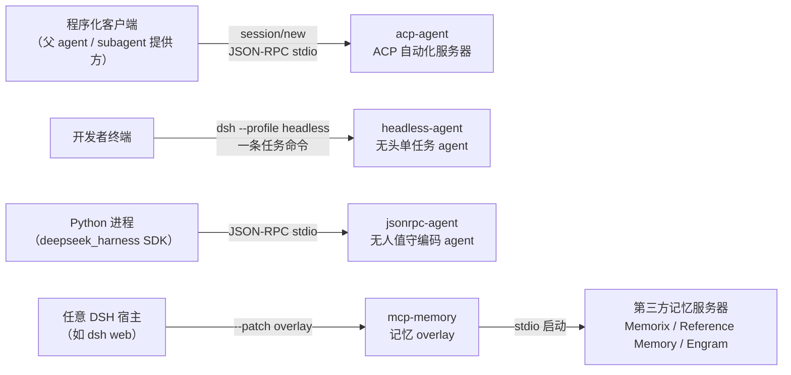
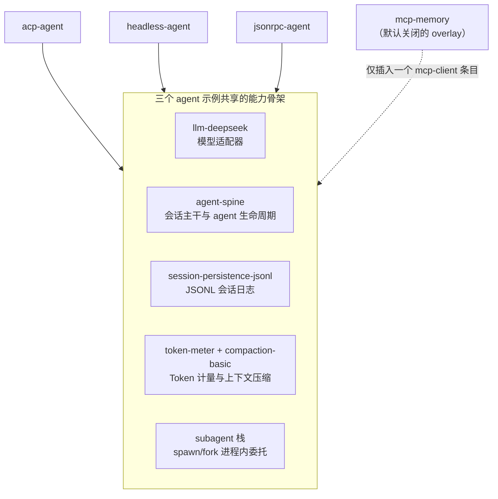
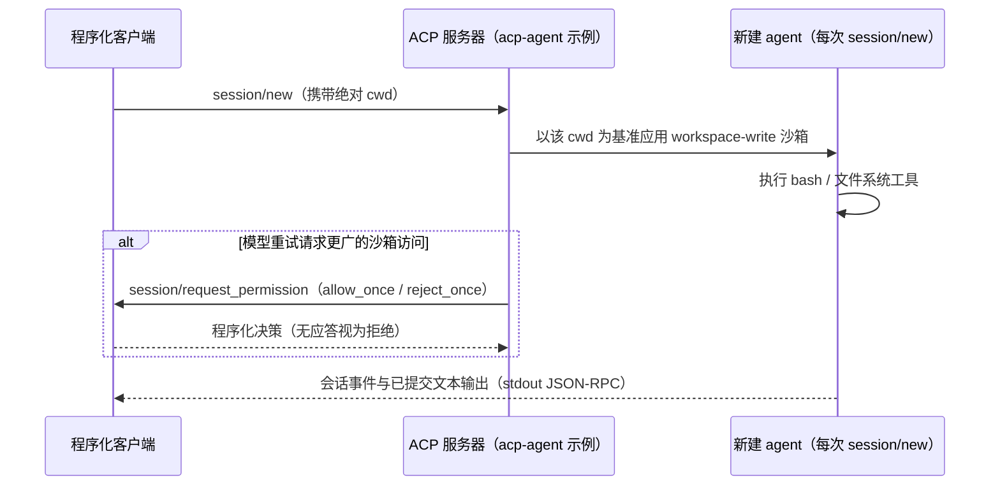
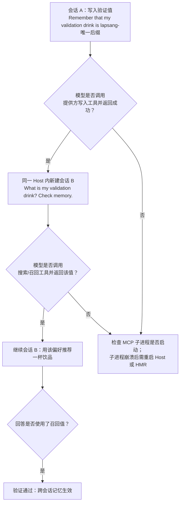

`examples/` 目录收录了 DeepSeek Harness 的可运行演示，每个子目录自带配置、前置条件与运行命令。本页聚焦其中四个最具代表性的组合包：**acp-agent**（对外协议服务器）、**headless-agent**（无头单任务 agent）、**jsonrpc-agent**（Python SDK 驱动的无人值守 agent）与 **mcp-memory**（默认关闭的第三方记忆 overlay）。同目录下的 web-cordis 与 web-schedule 两个 Web 相关示例不在本页展开。阅读本页不需要提前精通 Cordis 框架——只需知道：一份 `cordis.yml` 就是一张"要加载哪些插件、各自如何配置"的清单，而 overlay（叠加层）是在已有清单之上打补丁的增量配置。

Sources: [README.zh.md](examples/README.zh.md#L5-L29)

## 四个示例，四种集成形态

这四个组合包各自回答一个不同的集成问题：如何把 Harness 变成**别的程序可以调用的服务器**（acp-agent）；如何用**一条命令跑完一个编码任务**（headless-agent）；如何**从 Python 进程里驱动**一个 agent（jsonrpc-agent）；以及如何给现有会话**外挂一个记忆系统**（mcp-memory）。前三者都是完整 agent 应用，mcp-memory 则只是一件可插拔的附件。

| 目录 | 集成形态 | 驱动方式 | 通信通道 | 适合谁 |
| --- | --- | --- | --- | --- |
| `acp-agent` | ACP 自动化服务器 | 程序化客户端通过协议调用 | 换行分隔的 JSON-RPC over stdio | 父 agent、subagent 提供方等程序化客户端 |
| `headless-agent` | 无头单任务 agent | `pnpm dsh --profile headless "任务"` | 命令行 stdout（格式纯净） | 想看最小可用 agent 组合的初学者 |
| `jsonrpc-agent` | 无人值守编码 agent | Python SDK 进程驱动 | JSON-RPC（stdout 专属协议通道） | 通过 Python SDK 集成的开发者 |
| `mcp-memory` | MCP 记忆 overlay | 随宿主 profile 以 `--patch` 启用 | stdio MCP 子进程 | 想给现有会话外挂记忆的人 |



Sources: [README.zh.md](examples/README.zh.md#L7-L29), [README.zh.md](examples/acp-agent/README.zh.md#L5-L9), [README.zh.md](examples/headless-agent/README.zh.md#L5-L16), [README.zh.md](examples/jsonrpc-agent/README.zh.md#L5-L6), [README.zh.md](examples/mcp-memory/README.zh.md#L5-L9)

## 公共文件语言：cordis.yml 基座、变体 overlay 与快照配置

四个目录共享一套文件约定，理解它之后阅读任何示例都会事半功倍。每个目录的 `cordis.yml` 是**组合基座**，逐条列出插件 `id`、npm 包名 `name` 和 `config`；像 `code-mode.cordis.yml`、`advanced.cordis.yml`、`e2b.cordis.yml` 这样的文件是**变体 overlay**，通过 patch 或嵌套 include 在基座上叠加修改；`*.cordis.snapshot.yml` 则是配合测试基建录制回放快照的平行配置。此外，每个目录的 `composition.md` 由 `scripts/gen-doc-graphs.ts` 自动生成，内含该组合的 Mermaid 插件图与"插件 id → 包名"对照表，是核对组合内容的权威索引。

| 文件类型 | 作用 | 示例目录中的实例 |
| --- | --- | --- |
| `cordis.yml` | 组合基座，声明全部插件条目 | 四个目录各一份（mcp-memory 除外） |
| 变体 overlay | 在基座上叠加 patch 或替换配置 | `acp-agent/code-mode.cordis.yml`、`headless-agent/e2b.cordis.yml` |
| `*.cordis.snapshot.yml` | 快照录制/回放专用配置 | `acp-agent/advanced.cordis.snapshot.yml` 等 |
| `composition.md` | 自动生成的插件图与对照表 | `acp-agent/composition.md`、`headless-agent/composition.md` |
| `tests/` | 快照驱动与端到端测试 | `headless-agent/tests/fixtures/headless-driver.ts` |

三个 agent 示例的基座在骨架上高度同构——模型适配器、会话主干、JSONL 持久化、Token 计量与上下文压缩都是公共件，差异集中在工具面与安全边界上：



Sources: [cordis.yml](examples/acp-agent/cordis.yml#L1-L3), [composition.md](examples/acp-agent/composition.md#L94-L96), [cordis.yml](examples/headless-agent/cordis.yml#L1-L2), [cordis.yml](examples/jsonrpc-agent/cordis.yml#L1-L2)

## acp-agent：把 Harness 暴露为 ACP 自动化服务器

**acp-agent** 通过 JSON-RPC stdio 提供一个面向自动化场景的 [ACP（Agent Client Protocol）](https://agentclientprotocol.com) 服务器。它的服务对象是 parent agent（父智能体）、subagent 提供方和其他程序化客户端，而不是产品 UI。两条启动命令分别对应基座组合与 Code Mode 变体，运行前需要在仓库根目录 `.env` 或环境变量里准备 `DEEPSEEK_API_KEY`：

```sh
pnpm run demo:acp             # 基座组合
pnpm run demo:code-mode       # 同一协议，改用 Code Mode 工具传输
```

Sources: [README.zh.md](examples/acp-agent/README.zh.md#L5-L11), [package.json](package.json#L144)

这个示例对输出通道有严格的纪律约束：**stdout 只承载换行分隔的 ACP JSON-RPC**，因此基座组合不安装 stdout 日志记录器，也没有 HMR——所有新增组件的诊断信息必须走 stderr。这是"协议占用 stdout"模式的典型示范，初学者可以把它理解成：通道已经被协议独占，任何多余输出都会污染协议流。

Sources: [README.zh.md](examples/acp-agent/README.zh.md#L15-L17), [cordis.yml](examples/acp-agent/cordis.yml#L1-L3)

会话与权限的设计是本示例的核心教学点。应用为**每次 `session/new` 创建一个全新 agent**，客户端必须提供绝对 `cwd`；受沙箱限制的 bash 与文件系统栈以该会话 cwd 为基准应用 `workspace-write` 模式，因此并发会话可以各自使用不同的项目根目录。如果模型重试请求更广的沙箱访问权限，服务器会发出 `session/request_permission`，选项为 `allow_once` 与 `reject_once`，由客户端程序化决策；客户端放弃选择或无应答时按拒绝处理。下面的时序图概括了这一交互：



Sources: [README.zh.md](examples/acp-agent/README.zh.md#L12-L17), [README.zh.md](examples/acp-agent/README.zh.md#L20-L25)

组合层面，基座 `cordis.yml` 把沙箱策略默认设为 `workspace-write`（快照录制时切换为 `danger-full-access` 以保证场景与运行器无关），bash 使用 `dsh-bash-sandbox`，文件系统走 `dsh-fs-sandbox` 并叠加"先读后改"的 `fs-observation-policy`，再配上 subagent、工作流、Ralph、todo 与双方言 hooks 桥。`code-mode.cordis.yml` 变体则演示了 patch 的表达力：它用 `cordis-plugin-include` 包含基座后，将应用配置整体替换为 `tools: mode: code`，再插入 `code-runtime` worker 线程后端，把全部工具收敛为一个 `run_code` 线上工具。

Sources: [cordis.yml](examples/acp-agent/cordis.yml#L17-L56), [cordis.yml](examples/acp-agent/cordis.yml#L123-L153), [code-mode.cordis.yml](examples/acp-agent/code-mode.cordis.yml#L5-L29), [composition.md](examples/acp-agent/composition.md#L61-L92)

## headless-agent：单任务无头 agent 的参考组装

**headless-agent** 是"接受一项任务、运行、打印最终 assistant 文本、退出"的一次性编码 agent。它显式挂载共享 agent 主干、一个根 agent、持久化与压缩栈，产品入口是仓库根 `package.json` 里的 `dsh` 命令。凭据放在 gitignore 的根 `.env` 或导出环境变量中：

```sh
# repo root .env 或导出环境变量：
#   DEEPSEEK_API_KEY=sk-…
#   DEEPSEEK_BASE_URL=https://…   # 可选；默认公共 API
pnpm dsh --profile headless "fix the failing test in this workspace"
```

Sources: [README.zh.md](examples/headless-agent/README.zh.md#L5-L16), [package.json](package.json#L141)

它的基座 `cordis.yml` 是初学者学习"一个完整 agent 需要哪些件"的最佳教材：`settings` 与 `credentials` 提供热重载的配置与凭据平面；`llm-deepseek` 以全思考、最大推理努力出厂；`agent-spine` **预创建**一个 id 为 `main` 的持久 agent，钉在 `deepseek-v4-flash` 模型上并携带简短 persona；`persistence` 把会话日志写入 `./.sessions`，快照运行时切换为无压缩 JSONL，日常运行保持 zstd 帧。

Sources: [cordis.yml](examples/headless-agent/cordis.yml#L5-L25), [cordis.yml](examples/headless-agent/cordis.yml#L37-L61)

工具面覆盖了 Harness 的主要能力族：60 秒超时的本地 bash、带"先读后改"策略的 `fs-local` 文件系统、可并行的 `todo_write`、worker 线程工作流引擎与独立的 Ralph 固定消费者，以及 spawn/fork 双后端的 subagent 委托——其中 `subagent` 是可延续的后台子 agent，而 `subagent_fork` 因"延续型子 agent 的 report 工具与提示词片段先于 fork 复用的继承历史"这一顺序约束被刻意保持为一次性前台。

Sources: [cordis.yml](examples/headless-agent/cordis.yml#L32-L35), [cordis.yml](examples/headless-agent/cordis.yml#L101-L145)

两个变体 overlay 展示了组合包的可替换性：`e2b.cordis.yml` 用一个共享 E2B 云沙箱**替换本地文件系统与子进程提供方**，同时保留 `dsh-bash-local` 和相同的面向模型工具——文件与 Bash 变更只存在于 E2B，Cordis、模型调用、会话状态与日志仍在宿主上；`advanced.cordis.yml` 则在测试组装中加入 Code Mode 与 Cordis 工具。快照套件通过测试专用的 `headless-driver.ts` 驱动本目录配置，在结果记录前以 JSONL 发出规范会话事件——它属于测试基建，不是受支持的 CLI。

Sources: [README.zh.md](examples/headless-agent/README.zh.md#L18-L31), [cordis.yml](examples/headless-agent/cordis.yml#L63-L73)

## jsonrpc-agent：由 Python SDK 驱动的无人值守组合

**jsonrpc-agent** 面向 Python SDK 内置的 JSON-RPC 运行时：终端 UI、控制台日志记录器、批准界面和用户交互工具**有意缺席**，因为 stdout 属于 SDK 协议，轮次由 SDK 驱动。面向模型的工具集刻意精简：仅前台的 `bash`、`read`/`write`/`edit` 三件套、以进程内前台 spawn 提供方运行的 `subagent`，以及 `todo_write`。周边运行时加载 JSONL 会话持久化与自动上下文压缩，而 `maxTokensAsSuccess` 配置决定受 token 上限限制的模型轮次是保留为已接受的评估结果（默认），还是报告为错误。

Sources: [README.zh.md](examples/jsonrpc-agent/README.zh.md#L5-L17), [cordis.yml](examples/jsonrpc-agent/cordis.yml#L4-L8)

组合通过 Python SDK 的 `cordis` 选项或 `DSH_CORDIS_CONFIG` 环境变量传入配置路径，内置可执行文件已携带配置中指定的每个插件，**目标机器无需 Node.js**。全部运行时环境变量如下：

| 变量 | 用途 |
| --- | --- |
| `DEEPSEEK_API_KEY` | 传给 OpenAI 兼容宿主端点的凭据 |
| `DEEPSEEK_BASE_URL` | `dsh-llm-deepseek` 使用的宿主端点 |
| `DSH_CWD` | bash 和文件系统工具使用的 agent workspace |
| `DSH_CONTEXT_WINDOW` | 极简变体中为 `DSH_MODEL` 目录项记录的上下文容量 |
| `DSH_MAX_TOKENS_AS_SUCCESS` | `true`（默认）接受受 token 上限限制的结果；`false` 将其报告为错误 |
| `DSH_MODEL` | `minimal.py` 使用的默认模型；`--model` 优先 |
| `DSH_SESSION_ROOT` | JSONL 会话目录 |
| `DSH_SYSTEM_PROMPT` | 由部署提供的编码人格 |

Sources: [README.zh.md](examples/jsonrpc-agent/README.zh.md#L19-L31)

**minimal 变体**（`minimal.cordis.yml`）是 Web `minimal` preset 的完整独立版本：模型只看到一个部署方指定的系统提示词，只有两个工具——所有者作用域内持久化的 `bash` 与提供 `view`/`create`/`str_replace`/`insert` 的 `str_replace_editor`；运行时上下文注入与上下文压缩均被关闭。它组合了本地 PTY、裸 `fs-local` 后端与供持久 Bash 使用的 **danger-full-access** 策略——因为 Bash 和编辑器可以修改运行时进程有权访问的任何路径，所以**只能针对可丢弃的 checkout 或容器运行**。驱动它的 `minimal.py` 展示了 Python SDK 的极简用法：构造 `DeepSeekHarness` 上下文并调用 `harness.run()`，最后打印 `result.final_response`。

Sources: [README.zh.md](examples/jsonrpc-agent/README.zh.md#L32-L40), [minimal.cordis.yml](examples/jsonrpc-agent/minimal.cordis.yml#L1-L3), [minimal.cordis.yml](examples/jsonrpc-agent/minimal.cordis.yml#L23-L24), [minimal.py](examples/jsonrpc-agent/minimal.py#L25-L40)

## mcp-memory：默认关闭的第三方记忆 overlay

**mcp-memory** 提供三份**默认关闭**的参考配置，通过通用 MCP 客户端 `@deepseek-ai/dsh-mcp-client` 把一个记忆系统接入 DSH。职责边界清晰：DSH 解析选中的 overlay、启动已配置的 stdio 命令、发现 MCP 工具并以 `mcp__<serverName>__<tool>` 的形式公开它们；DSH **不负责**下载服务器、初始化数据库或选择模型与 embedding 提供方。安全方面，stdio 桥接器在启动子进程前会主动移除环境中名称通常表示凭据的变量和所有 `DSH_*` 变量，其余环境变量仍会继承。

Sources: [README.zh.md](examples/mcp-memory/README.zh.md#L5-L15)

| 系统 | 已测试版本 | 传输方式 | 上游前置条件 |
| --- | --- | --- | --- |
| [Memorix](https://github.com/AVIDS2/memorix) | `memorix@1.3.0` | stdio（`memorix serve`） | Node 22.18+，全局安装 `memorix@1.3.0` |
| [MCP Reference Memory](https://github.com/modelcontextprotocol/servers/tree/main/src/memory) | `@modelcontextprotocol/server-memory@2026.7.4` | stdio（`mcp-server-memory`） | 全局安装该 npm 包 |
| [Engram](https://github.com/Gentleman-Programming/engram) | `v1.20.0` | stdio（`engram mcp`） | Go 1.25.10+，`go install` 或发布版二进制 |

三份 overlay 结构完全一致——一个 `insert` patch 插入单个 `mcp-client` 条目，差异只在命令与少量环境变量（如 Reference Memory 的 `MEMORY_FILE_PATH` 指向 `$HOME/.dsh-mcp-reference-memory.jsonl`）。收录仅作为互操作参考，不代表 DeepSeek 的认可或持续支持承诺。

Sources: [README.zh.md](examples/mcp-memory/README.zh.md#L17-L23), [memorix.cordis.yml](examples/mcp-memory/memorix.cordis.yml#L3-L11), [engram.cordis.yml](examples/mcp-memory/engram.cordis.yml#L3-L11), [mcp-reference-memory.cordis.yml](examples/mcp-memory/mcp-reference-memory.cordis.yml#L11-L13)

启用方式是把一份 overlay 传给 DSH（可指向磁盘任意位置的复制文件）；不传 `--patch` 时三项全部保持关闭。若要跨次运行保留所选配置，把 overlay 中那个 `insert` patch 合并到用户 patch 层：仅对一个 profile 生效写 `$DSH_HOME/profiles/<name>/cordis.patch.yml`，对本机所有 profile 生效写 `$DSH_HOME/cordis.patch.yml`：

```sh
npm install --global memorix@1.3.0
dsh web --patch "$PWD/examples/mcp-memory/memorix.cordis.yml"
```

Sources: [README.zh.md](examples/mcp-memory/README.zh.md#L25-L33), [README.zh.md](examples/mcp-memory/README.zh.md#L37-L44)

官方推荐的验证流程强调"**跨会话**召回"：写入与读取必须发生在不同的 DSH 会话中，但无需重启 Host。若 MCP 子进程崩溃则需要重启或 HMR，因为当前通用客户端不会自动重连，其工具注册会一直保留到插件 dispose 或成功重新同步。



Sources: [README.zh.md](examples/mcp-memory/README.zh.md#L73-L84)

接入其他 MCP 服务器时，复制相同的条目字段并使用唯一的 `id` 与 `serverName` 即可；远程服务器改用 `transport: streamable-http` 加 `url` 和 `headers`。提供方专属的安装、身份、认证、模型、embedding、持久化和许可始终由提供方负责。

```yaml
- insert:
    - id: memory-my-server
      name: '@deepseek-ai/dsh-mcp-client'
      config:
        serverName: my-memory
        transport: stdio
        command: my-memory-mcp
        args: []
        env: {}
        cwd: !!js process.cwd()
```

Sources: [README.zh.md](examples/mcp-memory/README.zh.md#L86-L93)

## 四个组合包的能力对照

下表汇总三个 agent 示例在安全边界与工具面上的关键差异，可作为选型速查：

| 维度 | acp-agent | headless-agent | jsonrpc-agent（标准） | jsonrpc-agent（minimal） |
| --- | --- | --- | --- | --- |
| Bash 形态 | `dsh-bash-sandbox`（沙箱内，60s 超时） | `dsh-bash-local`（60s 超时） | `dsh-bash-local`，仅前台 | 持久 Bash（`tool-bash-persistent`） |
| 文件系统 | `fs-sandbox` + 先读后改策略 | `fs-local` + 先读后改策略 | `fs-local` + 先读后改策略 | 裸 `fs-local` |
| 沙箱策略默认值 | `workspace-write`（快照时 danger-full-access） | 未挂沙箱策略 | 未挂沙箱策略 | `danger-full-access`（仅限可丢弃环境） |
| Subagent | spawn（可延续）+ fork（一次性） | spawn（可延续）+ fork（一次性） | 仅 spawn 前台 | 无 |
| 工作流 / Ralph | 有 | 有 | 无 | 无 |
| 上下文压缩 | `compaction-basic` | `compaction-basic` | `compaction-basic` | 无 |
| 权限交互 | `session/request_permission` | 无交互平面 | 无交互平面 | 无交互平面 |

Sources: [cordis.yml](examples/acp-agent/cordis.yml#L17-L56), [cordis.yml](examples/headless-agent/cordis.yml#L32-L35), [cordis.yml](examples/jsonrpc-agent/cordis.yml#L18-L24), [minimal.cordis.yml](examples/jsonrpc-agent/minimal.cordis.yml#L18-L24), [README.zh.md](examples/acp-agent/README.zh.md#L23-L25)

## 快照配置与测试基建的联动

每个 agent 示例目录中的 `*.cordis.snapshot.yml` 并非给人手动运行的主配置，而是与快照测试基建配对：以 acp-agent 为例，基座配置声明"设置 `DSH_SNAPSHOT=record` 时应用 bin 运行真实 DeepSeek 适配器，测试基建收割其持久化日志"；持久化压缩也随之切换——快照模式读原始 JSONL，日常运行保留 zstd 帧。headless-agent 的测试驱动则通过未导出的 `tests/fixtures/headless-driver.ts` 以 JSONL 发出规范会话事件。这解释了为什么同一目录里每份变体都有一份 `.snapshot.yml` 孪生文件。

Sources: [cordis.yml](examples/acp-agent/cordis.yml#L1-L3), [cordis.yml](examples/acp-agent/cordis.yml#L46-L49), [cordis.yml](examples/headless-agent/cordis.yml#L54-L58), [README.zh.md](examples/headless-agent/README.zh.md#L18-L18)

## 建议的阅读路径

理解了示例组合包后，可以沿以下路径深化：

- 先回看组合包的理论基础：[Profile、组合包与多层 Patch 的按序叠加机制](9-profile-zu-he-bao-yu-duo-ceng-patch-de-an-xu-die-jia-ji-zhi)，理解 overlay 与 patch 的叠加语义。
- jsonrpc-agent 的协议背景在 [TypeScript 进程外 SDK：JSON-RPC 协议、客户端与服务端插件](25-typescript-jin-cheng-wai-sdk-json-rpc-xie-yi-ke-hu-duan-yu-fu-wu-duan-cha-jian) 中展开；`minimal.py` 背后的运行时机制见 [Python SDK：子进程驱动方式与内置运行时二进制分发](26-python-sdk-zi-jin-cheng-qu-dong-fang-shi-yu-nei-zhi-yun-xing-shi-er-jin-zhi-fen-fa)。
- `dsh --profile headless` 与 `dsh web --patch` 的命令入口细节见 [CLI 入门：dsh 命令入口、web/headless Profile 与补丁覆盖](4-cli-ru-men-dsh-ming-ling-ru-kou-web-headless-profile-yu-bu-ding-fu-gai)。
- 快照配置如何被测试消费，见下一页 [测试体系：testkit、LLM 回放/模拟、快照与端到端覆盖门禁](28-ce-shi-ti-xi-testkit-llm-hui-fang-mo-ni-kuai-zhao-yu-duan-dao-duan-fu-gai-men-jin)。