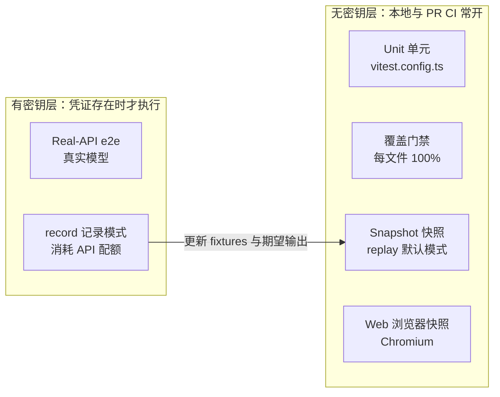
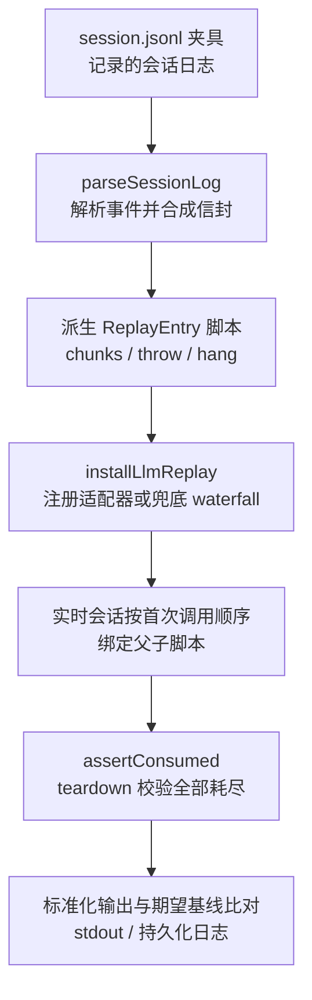
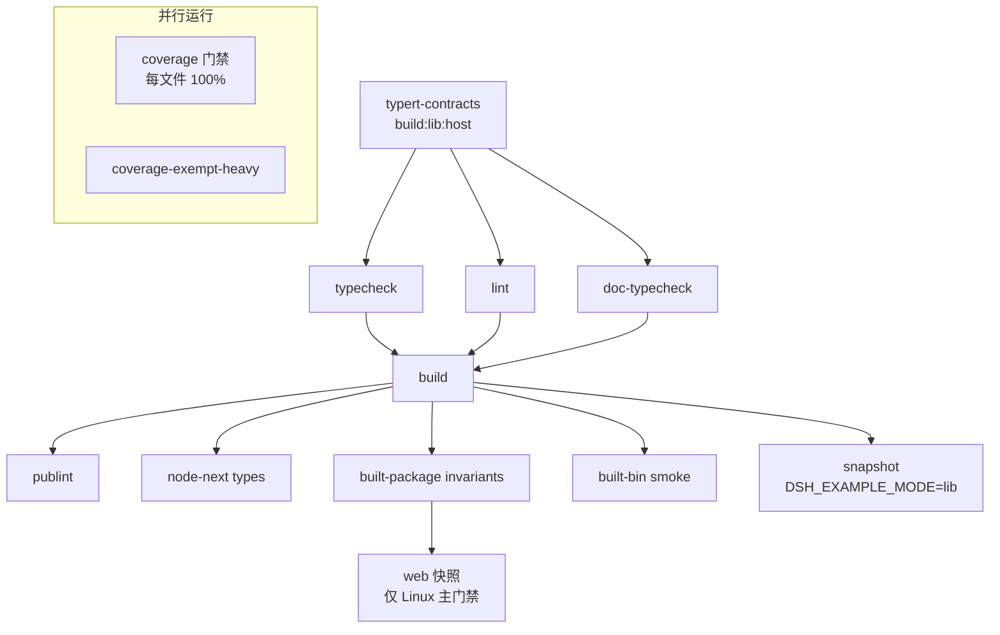

DeepSeek Harness 的测试体系围绕一个核心问题构建：如何在无密钥、确定性、可并行的前提下，持续验证一个以真实模型为核心产品的系统确实能工作。本页剖析支撑这一目标的五层测试体系、`packages/test-support` 下的测试基建工具箱、LLM 回放与模拟两种"替身"策略、驱动真实子进程的快照套件，以及作为合并闸门的每文件 100% 覆盖门禁与 CI 门禁编排。

Sources: [testing.md](docs/testing.md#L5-L15)

## 五层测试体系：按凭证与验证对象分层

仓库的测试策略文档将全部测试划分为五个层级，每层回答不同的问题：**Unit** 层验证包内单元行为与 HMR 安全性；**Coverage gate** 是合并闸门，要求 `packages/*/*/src` 下每个文件达到 100% 覆盖；**Real-API e2e** 在有密钥时对真实模型运行端到端验证；**Snapshot** 层用无密钥的期望输出覆盖传输契约、呈现层与持久化日志；**Web browser snapshot** 则在 Chromium 中比对回放的浏览器输出。层与层之间的关键分界是凭证：前三层与快照回放完全无密钥，只有真实 API 测试消耗配额。

| 层级 | 命令 | 配置文件 | 凭证要求 | 断言对象 |
|---|---|---|---|---|
| Unit | `pnpm run test` | `vitest.config.ts` | 无 | 包内单元、脚本 spec、HMR 安全 |
| Coverage 门禁 | `pnpm run test:coverage` | `vitest.config.ts` + `--coverage` | 无 | 每文件 100% 语句/分支/函数/行 |
| Real-API e2e | `pnpm run test:e2e` | `vitest.e2e.config.ts` | 需密钥，缺省自跳过 | 真实模型下的端到端行为 |
| Snapshot | `pnpm run test:snapshot` | `vitest.snapshot.config.ts` | replay 无密钥；record 需密钥 | 真实子进程的组装后外部行为 |
| Web 浏览器快照 | `pnpm run test:web` | `vitest.web.config.ts` | CI 强制 replay | Chromium 内的客户端交互快照 |

Sources: [testing.md](docs/testing.md#L7-L14)

数据平面侧有一个专门的约定：会话夹具保留头部与载荷，但省略体序列号与时间信封，回放时按需合成，而运行时持久化代码保持不变——这使夹具既稳定可评审，又能通过真实的解码路径。旧布局的夹具由迁移脚本统一改写。

Sources: [testing.md](docs/testing.md#L15)

## test-support 工具箱：测试基建的包组织

所有测试基建集中在 `packages/test-support/` 下，作为非产品 API 的开发支撑层组织成六个独立包，每个包自带测试与不变量文件。该目录有一条明确的退出规则：当一个包获得产品契约与产品消费者时，就移出 `test-support/`——测试基建与产品代码之间不允许可逆性模糊。

| 包 | 角色 |
|---|---|
| `acp-snapshot` | ACP 快照套件工厂：驱动真实子进程并比对标准化输出 |
| `agent-loop-testkit` | 为 AgentLoop 测试挂载共享前置服务 |
| `client-runtime` | 客户端运行时夹具：remote、sessions、settings、locale、快照与翻译 |
| `llm-mock-server` | 确定性 OpenAI 兼容故障注入服务器 |
| `llm-replay` | 从记录的会话日志派生模型响应回放 |
| `loader-smoke` | 通过 Loader 启动真实 `cordis.yml` 组合的冒烟支架 |

Sources: [README.md](packages/test-support/README.md#L5-L16)

此外，`packages/runtime-diagnostics/invariants` 提供开发期运行时契约断言，其契约由子系统文档单独记录；每个 `vitest.*.config.ts` 都把 `scripts/test-invariants.ts` 挂为共享 setup 文件，让跨层的不变量检查在同一入口生效。

Sources: [README.md](packages/test-support/README.md#L18)

## 把测试贴近真实组装：agent-loop-testkit 与 loader-smoke

`agent-loop-testkit` 解决的问题是：测试 AgentLoop 前必须挂载一串前置 Cordis 服务（LLM 运行时、会话存储、系统提示词、工具运行时、Agent 注册表）。它的关键设计在于**刻意不挂载 AgentLoop 本身、也不注册适配器**——测试保留对加载顺序与被测拓扑的完全控制权，而挂载的服务全部由上下文拥有并随上下文析构，插件加载失败时已激活的服务仍由上下文统一回收。这是 Cordis 所有权模型在测试域的直接映射。

Sources: [index.ts](packages/test-support/agent-loop-testkit/src/index.ts#L25-L46)

`loader-smoke` 则是"真实入口路径"原则的执行者：它提供共享的子进程支架，把示例 `bin` 通过真实的 app bin 与 Cordis Loader 启动，并内置一个**模式感知的启动解析器**——`src` 模式用 tsx 从 TypeScript 源码启动（零构建开发路径，经 tsconfig `paths` 映射解析工作区包），`lib` 模式用裸 Node 从构建产物启动（经真实 `exports` 解析，模拟已安装消费者）。环境变量 `DSH_EXAMPLE_MODE` 选择模式，CI 设为 `lib`，开发默认 `src`；任何非法值都会显式抛错而非静默回退，保证门禁环境配置的拼写错误立即暴露。

Sources: [index.ts](packages/test-support/loader-smoke/src/index.ts#L1-L12)

Sources: [index.ts](packages/test-support/loader-smoke/src/index.ts#L30-L54)

## LLM 模拟服务器：故障注入的确定性边界

`llm-mock-server` 是一台可脚本化的 **OpenAI 兼容 HTTP/SSE 服务器**，专为传输层、协议层与"语义空响应"恢复测试而建。它的行为契约非常克制：每个被接受的 chat-completions 请求消耗脚本中的一个行为，服务器自身**绝不重试、也不解释 Harness 的策略**——重试、退避与策略组合是被测代码的责任，mock 只负责在边界上如实制造故障。这是"只 mock 昂贵或非确定性边界"原则的物化：LLM 适配器与网络之外的一切保持真实。

Sources: [index.ts](packages/test-support/llm-mock-server/src/index.ts#L1-L7)

服务器预定义了 23 种请求行为，覆盖网络故障、协议畸形、HTTP 错误族与正常路径变体；`random` 行为按可配置权重在每个请求上抽取具体故障，默认权重配置被明确标注为"测试压力配置，而非对生产事故频率的断言"。

| 行为类别 | 代表行为 |
|---|---|
| 网络故障 | `connection_reset`、`stream_disconnect`、`partial_disconnect`、`stall` |
| 协议畸形 | `malformed_json`、`malformed_event`、`wrong_content_type` |
| HTTP 错误族 | `rate_limit`、`server_error`、`service_unavailable`、`auth_error`、`context_overflow`、`quota_exceeded` |
| 语义空响应 | `empty`、`empty_body`、`stream_eof`、`partial_eof` |
| 正常路径 | `success`、`reasoning_success`、`tool_call_success`、`slow_success`、`max_tokens` |
| 随机压力 | `random`（按权重抽取上述行为） |

Sources: [index.ts](packages/test-support/llm-mock-server/src/index.ts#L16-L41)

Sources: [index.ts](packages/test-support/llm-mock-server/src/index.ts#L56-L70)

每个请求的完整轨迹都被捕获为不可变遥测记录：尝试序号、脚本行为、实际行为、请求路径、请求头、解析后的请求体、已发送的 SSE 事件数，以及最终边界结果（`completed`/`reset`/`stalled`/`client_closed`/`server_error`）。测试据此断言"线上到底发生了什么"，而非依赖被测代码的自我报告。仓库还通过 `pnpm run mock:llm` 暴露服务器的 CLI 入口，供手动调试与示例场景使用。

Sources: [index.ts](packages/test-support/llm-mock-server/src/index.ts#L96-L114)

Sources: [package.json](package.json#L145)

## LLM 回放：让会话日志成为测试剧本

`llm-replay` 采取与 mock 服务器正交的策略：**从持久化的会话 `.jsonl` 日志中派生模型调用脚本**。解析器把每一行反序列化为会话事件（第 0 行是会话头，直接跳过；打包的 chunk 行被展开回原事件，保证以 `packChunks` 记录的夹具派生出相同脚本），并补齐投影夹具省略的序列号与时间信封。每个 `stream()` 调用对应一个 `ReplayEntry`：普通 `chunks` 从 `assistant/chunk` 事件派生；`throw` 可先回放前缀 chunk 再失败；`hang` 建模取消路径——后两者无法仅凭日志重建，必须走显式覆盖。

Sources: [index.ts](packages/test-support/llm-replay/src/index.ts#L1-L8)

Sources: [index.ts](packages/test-support/llm-replay/src/index.ts#L31-L44)

Sources: [index.ts](packages/test-support/llm-replay/src/index.ts#L168-L200)

父子会话的绑定机制是回放正确性的关键：每个记录的脚本携带 `createdAt` 与 `primary` 标记，实时会话**按首次调用顺序**绑定到按 `createdAt` 排序的脚本（父会话最早创建且总是先发起模型调用，`createdAt` 平手时 `primary` 决胜），记录中的会话 id 仅作诊断。回放配置还支持可选的提供方目录——非空时注册真实适配器路由以演练能力门控与发现，为空时保留测试用的兜底 waterfall；`paceMs` 则是一个纯"拟真度"旋钮，让下游传输（如浏览器观察的 SSE 复用器）看到真正增量的投递，文档明确要求正确性绝不依赖它。

Sources: [index.ts](packages/test-support/llm-replay/src/index.ts#L85-L122)

Sources: [index.ts](packages/test-support/llm-replay/src/index.ts#L145-L157)

安装句柄 `ReplayHandle` 暴露两个契约：`dispose` 移除注册的适配器或 waterfall 监听（HMR 安全），`assertConsumed` 在场景 teardown 时抛出诊断——**每一个被记录的脚本都必须绑定到实时会话且光标耗尽整个条目列表**，否则视为"场景发出的调用少于记录数"或"子会话从未绑定"的静默欠载，立刻转为清晰的失败。这把夹具与被测行为之间的漂移从隐性腐蚀变成了 teardown 时的显式错误。

Sources: [index.ts](packages/test-support/llm-replay/src/index.ts#L124-L139)

## ACP 快照：三种模式与场景契约

`acp-snapshot` 把上述回放机制组装成**默认无密钥的快照套件工厂**：每个场景驱动真实子进程（ACP 自动化服务器示例的完整装配），比对标准化后的 stdout，而可比的会话夹具同时充当回放输入与期望输出。三种模式由 `DSH_SNAPSHOT` 选择：`record` 调用真实 API 并更新夹具与期望输出（唯一读取 `.env` 或环境密钥的模式）；`refresh` 回放已提交的脚本并重写派生产物；`replay`（默认）只读已提交夹具、绝不写任何已提交输出。

Sources: [suite.ts](packages/test-support/acp-snapshot/src/suite.ts#L1-L9)

Sources: [vitest.snapshot.config.ts](vitest.snapshot.config.ts#L24-L37)

并发模型与写安全直接挂钩：replay 场景各自拥有唯一的临时 cwd 与持久化根、只读已提交夹具，因此快照文件可并行、文件内并发由 `DSH_SNAPSHOT_MAX_CONCURRENCY`（默认 5）约束；record 与 refresh 保持串行——前者每个场景消耗真实配额，后者从磁盘夹具回收易变值写入基线，并发写入者会损坏金标准文件。快照测试的收集范围覆盖 `scripts/**/*.snapshot.ts`、`apps/cli/tests` 与 `examples/*/tests`，CI 以 `DSH_EXAMPLE_MODE=lib` 让示例从构建产物启动。

Sources: [suite.ts](packages/test-support/acp-snapshot/src/suite.ts#L1-L9)

Sources: [vitest.snapshot.config.ts](vitest.snapshot.config.ts#L47-L66)

Sources: [run-gates.ts](scripts/run-gates.ts#L586-L594)

场景契约中最重要的区分是 **`recorded` 与 `authored`**：`recorded` 场景由模型驱动且可复现，`record` 会从真实 API 再生其 `session.jsonl`；`authored` 场景的夹具是手写或手工采集的（提供方错误、真实 API 无法确定性诱导的取消、确定性 hook 场景等），永远不会被再记录。需要 throw/hang 类回放的场景必须声明 `overridden` 并提供 `replay.override.json` 侧车——夹具守卫要求侧车与声明精确互为充要：多出的游离侧车会静默改变派生脚本，缺失的声明则让覆盖无法生效，两种不匹配都会大声失败。

Sources: [suite.ts](packages/test-support/acp-snapshot/src/suite.ts#L66-L99)

第三层契约是**请求头类 pinning**：每个"头部组合类"恰好指定一个场景作为该类 token 化请求头序列的唯一 pin，提示词与工具模式侧车独立选择且可在类成员间共享，但每个实时头部都会与组合 pin 逐一核对——依赖会话状态的组合必须声明独立的类，而不是逃逸覆盖。这把"请求长什么样"的回归检测从逐场景复制压缩成了类级断言。

Sources: [suite.ts](packages/test-support/acp-snapshot/src/suite.ts#L100-L124)

一个场景的夹具目录结构是固定的，以 `examples/acp-agent/tests/snapshots/` 下当前 83 个场景目录为代表：

| 文件 | 角色 |
|---|---|
| `input.json` | 场景输入脚本（harness 的 `InputScript`） |
| `session.jsonl` | 记录的会话日志：回放输入 + 期望输出双重身份 |
| `session.N.jsonl` | 第 N 个子会话日志（subagent 场景） |
| `stdout.expected.jsonl` | 标准化 JSON-RPC stdout 基线 |
| `stdout.expected.windows.jsonl` | Windows 原生 stdout 变体基线（可选） |
| `system-prompt.expected.md` / `tool-schemas.expected.json` | 系统提示词与工具模式侧车，可被子 pin 共享 |
| `replay.override.json` | 显式回放覆盖（throw/hang 等不可派生场景） |
| `workspace/` | 场景可变工作区夹具 |

Sources: [suite.ts](packages/test-support/acp-snapshot/src/suite.ts#L39-L64)

策略文档进一步规定：**每一个非平凡的模型可见、协议可见或人类可见变更，都必须在同一 PR 中通过所属快照套件新增或更新一个无密钥场景**——包测试、e2e 断言、mock 组合都不替代组装后的完整记录。

Sources: [testing.md](docs/testing.md#L47-L50)

## 真实 API e2e 与 Web 浏览器快照通道

真实 API 通道独立成配置的核心理由是"消耗 token"：每个测试在自己的提供方密钥缺失时自跳过，让无密钥 CI 保持绿色；有凭证的工作流则预检所需密钥，密钥缺失会硬失败而不是报告假绿。配置层面，e2e 测试拥有宽裕的超时（120 秒）与 2 次重试以吸收共享密钥的并发配额抖动，文件级并发由 `DSH_E2E_MAX_WORKERS`（默认 4）控制，为共享 API 配额保留资源旋钮。

Sources: [vitest.e2e.config.ts](vitest.e2e.config.ts#L45-L56)

CI 工作流对这个通道的安全模型写得极其明确：`e2e.yml` 消费 `DEEPSEEK_API_KEY_EXTERNAL` 密钥并显式钉住外部 API 端点；fork 与 Dependabot PR 天然无密钥，作业级 `if` 整体跳过；注释中还专门警示**绝不能把触发器改成 `pull_request_target`**——后者会带着基仓库密钥运行不受信任的 fork 代码，是教科书式的密钥泄露向量。这是"with-key 策略"（DeepSeek 内部主张推理便宜、不要吝啬真实 API 测试）与密钥安全之间的完整权衡记录。

Sources: [e2e.yml](.github/workflows/e2e.yml#L1-L29)

Sources: [testing.md](docs/testing.md#L17-L19)

Web 浏览器通道跑在独立配置下：`apps/web/tests` 中的 e2e 与快照测试通过真实宿主入口点在 Chromium 中比对构建后客户端的交互快照，本地与 record 运行保持串行（180 秒测试超时、120 秒钩子超时）。CI 侧通过 `run-gates` 强制 `DSH_SNAPSHOT=replay` 只读比对已提交金标准，且从不在 CI 中写期望输出——记录与刷新始终是显式的本地工作流，每个差异都经人工评审。调度上，两个会改动工作区的 HMR 与 Cordis 生命周期覆盖文件先串行运行，其余文件再进入有界 worker 池（`DSH_WEB_SNAPSHOT_WORKERS` 必须大于 1）。

Sources: [vitest.web.config.ts](vitest.web.config.ts#L5-L35)

Sources: [testing.md](docs/testing.md#L13)

Sources: [run-web-snapshots.ts](scripts/run-web-snapshots.ts#L1-L29)

Sources: [run-gates.ts](scripts/run-gates.ts#L441-L462)

## 每文件 100% 覆盖门禁

覆盖门禁是整个体系中最硬的闸门：阈值配置为 **per-file 100%**，作用于语句、分支、函数、行四个维度，覆盖 `packages/*/*/src` 下的全部运行时源码（含客户端 `.tsx`）。"每文件"是刻意的——一个高覆盖的大文件不能补贴一个低覆盖的小文件；策略文档对这条门禁的哲学是：**未覆盖的行往往是门禁正确标记出来等待删除的死代码，而不是需要补一个测试的欠账；行覆盖是必要条件，永远不充分**——它只证明行执行过，不证明特性正确。

Sources: [vitest.config.ts](vitest.config.ts#L280-L297)

Sources: [testing.md](docs/testing.md#L10)

为了让失败可行动，配置挂了一个自定义 CJS 报告器，在文件未达门禁时打印每一条未覆盖语句、分支路径与函数的精确 `path:line:col` 记录（内置阈值 ERROR 只报文件名，不报位置）；本地运行额外产出 HTML 报告。类型文件与自执行入口（`types.ts`、`bin.ts`、`worker.ts`）被排除——前者无可执行代码，后者在单测进程内导入会直接启动，由真实的子进程/Worker 测试覆盖其入口胶水。

Sources: [vitest.config.ts](vitest.config.ts#L10-L14)

Sources: [vitest.config.ts](vitest.config.ts#L171-L186)

排除清单本身是一份带注释的工程决策记录：GUI 债务块（`TODO(gui)`）圈出 jsdom 通道尚未覆盖的浏览器级分支；Typert 生成器被排除是因为逐文件覆盖会把整个工作区的编译器分析拖入 v8 插桩——覆盖通道最长的尾巴；平台矩阵则处理三个方向——Windows 上排除依赖 POSIX shell 的 bash 套件、Linux 上排除仅 Windows 执行的 koffi 源码、无 pwsh 主机上经探针排除 pwsh 套件（探针运行套件自身的解析逻辑，保证豁免只在套件确实跳过时激活）。每条 `v8 ignore` 注释都必须写明理由。

Sources: [vitest.config.ts](vitest.config.ts#L22-L88)

Sources: [vitest.config.ts](vitest.config.ts#L261-L265)

门禁运行时拆成两个并行 gate：插桩的 `coverage` gate 设置 `COVERAGE_EXEMPT_ENV='1'`，让编译器与子进程密集的重量级套件**以非插桩方式**在旁边照常运行——它们在 v8 插桩下付出数倍运行时却贡献不出阈值所需的增量；`DSH_COVERAGE_MAX_WORKERS` 给出的 worker 预算按 1/3 与 2/3 分配给豁免与插桩两侧。进一步地，`DSH_COVERAGE_PARTITIONS`（≥2）启用分区模式：协调器启动多个单 worker 的 vitest 插桩进程，各自产出覆盖 blob，校验后合并为单一报告；分区内阈值与报告被抑制，合并后统一判定——用进程级并行换插桩运行时的可调度性。

Sources: [run-gates.ts](scripts/run-gates.ts#L523-L549)

Sources: [run-gates.ts](scripts/run-gates.ts#L551-L584)

Sources: [coverage-partitions.ts](scripts/coverage-partitions.ts#L7-L14)

## 门禁编排：run-gates 与 CI 拓扑

所有本地与 CI 质量门禁由 `scripts/run-gates.ts` 统一编排：包脚本只拥有公开的聚合名称，runner 拥有经验证的依赖图、调度器环境与进程诊断。`Gate` 是带 `needs`/`after` 依赖边与可选环境的命令节点，`Mode` 是一组命名聚合——`ci-primary`、`ci-coverage`、`ci-snapshot`、`check-all`、`hygiene` 等，每个聚合展开为一张有向无环图，由有界进程并发度调度执行。

Sources: [run-gates.ts](scripts/run-gates.ts#L23-L58)

Sources: [run-gates.ts](scripts/run-gates.ts#L206-L264)

主门禁聚合 `ci-primary` 的图结构体现了测试与构建的协作关系：Typert 契约构建（`build:lib:host`）先行，typecheck、lint、doc-typecheck 三者等待它；`build` 必须等这三个消费者全部落定（避免 tsbuildinfo 竞争与声明文件在读取中被替换）；快照 gate 与四个构建产物验证（publint、node-next 类型、构建包不变量、构建 bin 冒烟）都依赖 `build`，其中快照 gate 以 `DSH_EXAMPLE_MODE=lib` 从构建产物启动示例。覆盖双 gate、模块图、knip 等则与这条链并行。Linux 主门禁额外追加 web 快照 gate（依赖构建包不变量 gate）。

Sources: [run-gates.ts](scripts/run-gates.ts#L281-L309)

Sources: [run-gates.ts](scripts/run-gates.ts#L586-L594)

CI 拓扑层面，PR 触发的 `ci.yml` 用三个企业级 runner 作业隔离覆盖、静态分析与构建后消费者尾部（`DSH_GATE_CONCURRENCY=8` 控制门禁调度并发），并支持通过仓库变量把 Linux 作业整体切换到自建池的故障转移机制；全局禁用遥测上报，被取代的 PR 运行自动取消。`ci-master.yml` 则在每次 master 推送时于 64 核自建 VM 上串行重跑完整的未分片主门禁（所有并发旋钮置 1），持续证明该环境可随时接管必需通道——这既是待机演练，也是覆盖门禁的串行参照系。Windows 侧通过 Wine 缓存播种与专用门禁聚合覆盖。

Sources: [ci.yml](.github/workflows/ci.yml#L23-L48)

Sources: [ci-master.yml](.github/workflows/ci-master.yml#L75-L119)

全部聚合都有同名本地入口（`pnpm run check:ci`、`check:ci:coverage`、`check:ci:snapshot` 等），保证本地与 CI 跑的是同一张依赖图而非两套脚本。

Sources: [package.json](package.json#L52-L64)

## 贯穿各层的测试哲学

支撑这套体系的四条原则在策略文档中反复出现，且都能在代码中找到物化。第一，**优先真实实现而非 mock**：只 mock 昂贵或非确定性的边界（LLM 适配器、网络、时钟），下游一切保持真实——手写替身只能证明桥接搬运了字节，不能证明出厂工具行为如断言。第二，**验证世界而非自我报告**：e2e 断言要么重跑命令、要么从外部重读文件；对代理自身输出的关键词探针会让一个"作弊"的代理通过；断言未触碰的文件字节级一致；测试拥有自己的资源，`afterEach` 中即使失败也要析构 harness。

Sources: [testing.md](docs/testing.md#L21-L29)

第三，**测试真实入口路径**：产品可见插件需要非单元的真实组合测试——通过 Loader 与 app 进程启动测试专用的 `cordis.yml`；"真实入口"指已发布产物，包 `bin` 在裸 Node 下运行构建后的 `lib/bin.js`，暴露 tsx 会遮蔽的失败（启动竞态、模块解析、被吞的加载失败）。第四，**测试解析只走源码平面**：每个 vitest 配置都把 vite-tsconfig-paths 指向 `tsconfig.base.json`（无 include 即全匹配），裸工作区导入解析到 `src` 而绝不穿过包 `exports` 加载构建后的 `lib/`——后者会加载模块单例的第二份副本，是最难排查的一类幽灵失败。

Sources: [testing.md](docs/testing.md#L31-L39)

Sources: [vitest.config.ts](vitest.config.ts#L16-L20)

单元层的执行拓扑也有明确的约束记录：覆盖门禁的一次调用聚合两个项目——`thread-safe` 项目用 forks 池运行大多数套件（Node 24 在 worker 线程的 CJS 词法分析器上有已记录的崩溃路径），`process-bound` 项目单独圈出依赖进程全局状态、进程 API 或时序敏感进程 I/O 的八个套件，保持清单可控；每个注册表都要求一条 HMR 安全测试（析构贡献 fiber，断言清理完成）。

Sources: [vitest.config.ts](vitest.config.ts#L128-L170)

Sources: [testing.md](docs/testing.md#L9)

## 阅读路线

理解本页后，建议按以下顺序深入：先看 [架构总览：一切皆插件的插件树世界](8-jia-gou-zong-lan-qie-jie-cha-jian-de-cha-jian-shu-shi-jie) 建立插件树心智模型，理解 testkit 为何"让上下文拥有一切"；再读 [轮次流程剖析：turn/step 事件流与 Agent 生命周期扩展点](11-lun-ci-liu-cheng-pou-xi-turn-step-shi-jian-liu-yu-agent-sheng-ming-zhou-qi-kuo-zhan-dian) 与 [会话日志模型：“模型可见即已记录”的不变量与消息投影](12-hui-hua-ri-zhi-mo-xing-mo-xing-ke-jian-ji-yi-ji-lu-de-bu-bian-liang-yu-xiao-xi-tou-ying)，它们分别是回放脚本的输入语义与快照日志的记录契约；Web 通道的架构背景见 [Web 应用双半侧架构：宿主侧网关服务器与浏览器侧客户端运行时](23-web-ying-yong-shuang-ban-ce-jia-gou-su-zhu-ce-wang-guan-fu-wu-qi-yu-liu-lan-qi-ce-ke-hu-duan-yun-xing-shi)；快照场景的产品实例见 [示例组合包导览：acp-agent、headless-agent、jsonrpc-agent 与 mcp-memory](27-shi-li-zu-he-bao-dao-lan-acp-agent-headless-agent-jsonrpc-agent-yu-mcp-memory)。若要继续工程化主线，构建侧的对应篇目是 [构建与发布工程：Host/Client 双聚合、Typert 类型反射与各阶段产物](29-gou-jian-yu-fa-bu-gong-cheng-host-client-shuang-ju-he-typert-lei-xing-fan-she-yu-ge-jie-duan-chan-wu)，文档预算等同类门禁见 [文档与国际化：双语约定、翻译配对工作流与文档预算门禁](30-wen-dang-yu-guo-ji-hua-shuang-yu-yue-ding-fan-yi-pei-dui-gong-zuo-liu-yu-wen-dang-yu-suan-men-jin)。