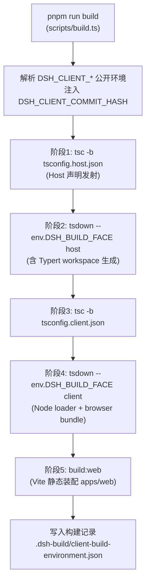
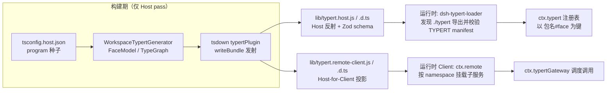
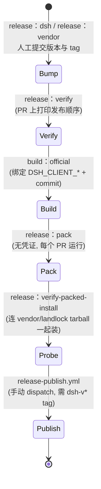

本页剖析 deepseek-harness 把约 200 个 workspace 包从 TypeScript 源码推向 npm 产物的完整工程路径。三条主线贯穿始终：其一是 **Host/Client 双聚合**——两个互相隔离的 TypeScript program 与两个 tsdown 构建面；其二是 **Typert 类型反射**——一个在构建期把源码类型树编译为运行时反射产物与 Host-for-Client 远程投影的生成器；其三是**各阶段产物**——从 `lib/types` 的声明发射、`lib/` 的打包产物、`lib/client.js` 浏览器 bundle，到 `dist/npm` 的 tarball 与构建记录。发布工程则围绕三条独立版本线（dsh / vendor / native）展开五步流水线：bump → verify → pack → verify-packed-install → publish。

## 双聚合模型：为什么 Host 与 Client 必须是两个 TypeScript program

这个仓库的类型检查不是单一 `tsconfig.json` 全量覆盖，而是两个互相隔离的 aggregate program。根本原因在于 cordis 的声明合并机制：Host 侧与 Client 侧都在**相同的键**下（如 `sessions`、`loader`）对 cordis `Context` 接口做声明合并，但合并进去的是不同的服务类型。若单一 program 同时看到两份合并，TypeScript 会报接口冲突。关键在于这种冲突只存在于 `ts.Program` 内部——模块解析永远不会触发它——因此 solution 根可以安全引用两侧。这解释了一个容易误解的设计：包同时具有 Node loader 入口和 browser 入口**并不构成**拆分理由；普通 Client 插件的两份运行时产物都在 Client 构建阶段生成。

| 文件 | 角色 | 是否构成 program |
|---|---|---|
| `tsconfig.json` | solution 根：`files: []`，引用两个 aggregate；也是 tsx 运行 `examples/`、`scripts/` 的解析配置 | 否 |
| `tsconfig.host.json` | Host aggregate：Host 包、示例、测试、scripts 与 website | 是 |
| `tsconfig.client.json` | Client aggregate：`packages/client/*` 及其测试、`apps/web` | 是 |
| `tsconfig.base.json` | 共享 compilerOptions 与源码 `paths` 门面；永不添加 `include`/`files` | 否 |
| `tsconfig.base.client.json` | 浏览器编译设置（`jsx`、DOM lib、`types: []`），由 Client 侧 extends | 否 |

唯一拆分 Host/Client tsconfig 的仓库特例是 `packages/api/remotes`：它的 Host 入口必须进入 Host Typert 图，而 Client 入口又要导入 Host tsdown 才会生成的 `/remote` 声明，因此该包根 tsconfig 只作 solution，两个 aggregate 分别引用其 face 专属子配置。由于两侧的引用图彼此独立，新包登记时必须选择且只选择一个 aggregate。

Sources: [docs/development.zh.md](docs/development.zh.md#L60-L66) · [tsconfig.client.json](tsconfig.client.json#L1-L8) · [tsconfig.host.json](tsconfig.host.json#L1-L6)

## 根构建流水线：五个阶段与 DSH_BUILD_FACE

理解构建顺序前需要先明确一个事实：两次 tsdown 都使用**同一组完整 workspace 匹配**（`vendor/*`、`packages/*/*`、`apps/cli`），既不扫描构建产物来发现 Client 包，也不维护 Host/Client 包过滤表。区分两个构建面的机制是环境变量 `DSH_BUILD_FACE`：根 `tsdown.config.ts` 在 host 面运行 Typert 插件并以 `lib/types/{index,invariant,startup}.js` 为入口；client 面则把入口选择权交给各包自己的配置，由它们决定当前阶段输出什么。`DSH_BUILD_FACE` 只接受 `host`、`client` 两个值，其他值直接抛错。

上图的每个箭头都是**生成依赖**：Client tsc 消费 Host 阶段生成的 `/remote` 声明，Client tsdown 的 browser bundle 从 `lib/types`（而非 `src`）取入口，Vite 又链接 Client 包的 `lib/client.js`。这个顺序写死在 `build:lib` 脚本中，也因此 `pnpm run typecheck`（= 完整 Host lib 阶段 + Client tsc）成为 lefthook `pre-push` 钩子的内容——它保证了任何推送都先经过一次含 Typert 约定生成的完整 Host 构建。

Sources: [package.json](package.json#L19-L25) · [tsdown.config.ts](tsdown.config.ts#L5-L31) · [docs/development.zh.md](docs/development.zh.md#L68-L86) · [docs/development.zh.md](docs/development.zh.md#L115-L117)

包级配置通过 `packages/client/tsdown.client.ts` 导出的预设函数参与 face 分派。`clientBundle()` 是普通 UI 插件的入口，它返回一个根据 `DSH_BUILD_FACE` 求值的配置工厂，形成如下矩阵：

| 包形态 | host face | client face |
|---|---|---|
| 普通 Host 包（根 workspace 默认） | 以 `lib/types` 为入口打包 | `SKIP_WORKSPACE_BUILD`（跳过） |
| `clientBundle` + `hostPhase: true` | 发射 Node 半侧 | 仅 browser bundle |
| `clientBundle` 默认 | `SKIP_WORKSPACE_BUILD` | Node 半侧 + browser bundle |
| `staticLinked` / `clientOnly` / `clientLibrary` | `SKIP_WORKSPACE_BUILD` | 指定配置 |

矩阵中有一个精妙的第三态：当 `DSH_BUILD_FACE` 完全未设置时（例如在包目录里直接运行 `tsdown` 做开发调试），`clientBundle` 的 client 入口回落到 `src/client/index.ts` 源码模式而非 `lib/types/client/index.js` 产物模式。注意包内若存在 `tsdown.config.ts`，它会**替换**根 workspace 布局，因此预设会把 lib 半侧配置重新声明一遍——漏掉它会让包丢失 `lib/index.js`，Host Loader 将无法导入其 node 半侧。

Sources: [packages/client/tsdown.client.ts](packages/client/tsdown.client.ts#L106-L123) · [packages/client/tsdown.client.ts](packages/client/tsdown.client.ts#L191-L195) · [packages/client/tsdown.client.ts](packages/client/tsdown.client.ts#L84-L99)

## Typert 类型反射：构建期的类型编译器

Typert 是本仓库最有特色的构建期子系统，它将源代码分析、运行时存储和 Loader 发现机制分离为四个包：

| 包 | 职责 | Cordis 键 |
|---|---|---|
| `generator/` | 从源代码类型生成运行时产物 | 构建时库（不进运行时） |
| `registry/` | 存储运行时包反射和 Zod schema | `ctx.typert` |
| `loader/` | 发现 Loader 条目并注册生成的宿主产物 | 消费 `ctx.loader`、`ctx.typert` |
| `protocol/` | Host Gateway 与消费方共用的 wire 约定 | — |

生成器的分析管线分两步：先把开发者编写的源类型树转换为独立于编译器的 `FaceModel` 和 `TypeGraph` 数据（保留声明标识、泛型应用、条件类型、映射类型、JSDoc 等），再由 `FaceModelEmitter` 只消费模型生成产物。分析器可以分别以 `tsconfig.host.json` 或 `tsconfig.client.json` 初始化独立 `ts.Program`，直接项目引用确定编译器 face 的成员归属。默认的 `check` 模式是**严格的**：遇到语法/语义诊断、可达公开声明缺少类型标注、跨包私有引用时直接失败；`write` 模式才会回填推导标注。

Sources: [packages/typert/README.zh.md](packages/typert/README.zh.md#L5-L12) · [packages/typert/generator/README.zh.md](packages/typert/generator/README.zh.md#L7-L17)

生成器接入构建的方式是一个 tsdown（rolldown）插件。它做两件事：`transform` 钩子在打包前把 TypeScript 依赖中的标准装饰器降级为 ES2024；`writeBundle` 钩子在产物落盘时发射 Typert 产物。Host pass 以 workspace 模式运行：插件从 bundle 输出目录向上查找到含 `tsconfig.host.json` 的仓库根，用 `WorkspaceTypertGenerator` 遍历从 cordis `Context`/`Events` 声明合并及显式 `@typert` 标记可达的公开导出，发现全部贡献方包后**一次性**生成（`emittedWorkspaces` 集合防止跨包重复发射）。只有声明了 `./typert`、`./client/typert` 或 `./remote` 导出的包才会成为贡献方——业务包可以自主选择不发布反射产物。

发射规则值得细看：每个 face 的产物写入 `lib/typert.<face>.js` 与对应 `.d.ts`；若该包携带 Host Remote 约定，额外生成 `typert.remote-client.js`、`.d.ts` 与 `.d.ts.map` 三件套。反向清理同样存在——当有 host 产物但本次未发射 remote 时，插件会强制删除残留的 remote 文件，避免陈旧产物混入。声明文件通过包的公开导出把 schema 标注为 `z.ZodType<SourceType>`，使消费方在类型层面拿到源类型而非裸 Zod。

Sources: [packages/typert/generator/src/tsdown-plugin.ts](packages/typert/generator/src/tsdown-plugin.ts#L14-L42) · [packages/typert/generator/src/tsdown-plugin.ts](packages/typert/generator/src/tsdown-plugin.ts#L79-L125) · [packages/typert/generator/README.zh.md](packages/typert/generator/README.zh.md#L19-L31)

运行时侧的接缝同样清晰。`dsh-typert-loader` 在激活时扫描 Loader 配置项并监听 `internal/plugin` 生命周期通知，解析每个条目所属包的 `package.json`，在其导出 `./typert` 时导入子路径、校验 `TYPERT` manifest 并注册贡献项；`ctx.typert` 注册表以原子方式同时登记包反射与 schema，并在发起调用的 cordis fiber 释放时一并移除。`packages/api/remotes` 是这套机制的旗舰消费方：它的 manifest 同时声明 Node 主入口、`./client` 浏览器入口和 `dsh.client` 元数据（`platform: web`、`immediately: true`），Host 构建生成的 Remote 投影经 Client 侧 `api-remotes` 组合挂到 `ctx.remote`，业务服务在 Host 用 `@Remote`/`@RemoteScope` 声明的方法由此成为浏览器可调用端点。

Sources: [packages/typert/loader/README.zh.md](packages/typert/loader/README.zh.md#L5-L9) · [packages/typert/registry/README.zh.md](packages/typert/registry/README.zh.md#L5-L8) · [packages/api/remotes/package.json](packages/api/remotes/package.json#L11-L46)

## Client 构建环境绑定：精确键集与构建记录

浏览器产物会被嵌入构建期常量，因此**哪些值进入了产物**本身就是发布完整性问题。仓库为此定义了保留前缀 `DSH_CLIENT_`：构建编排器会把父环境中所有该前缀变量收集为"公开 client 环境"，未设置时即为空集；`--profile official`（即 `build:official`）则要求精确的官方键集——`DSH_CLIENT_BUILD_PROFILE=official`、`DSH_CLIENT_TITLE=DeepSeek Harness` 加上 7 位小写 Git commit 前缀。子进程环境会被剥离选择器与继承值后重注，保证两次构建在相同 commit 下产生**逐字节相同**的公开环境输入。

`clientBuildEnvironmentDefines()` 把这套环境转换为 Vite/tsdown 的 `define` 替换：每个公开变量精确替换 `process.env.<NAME>`，同时提供 `process.env → {}` 的兜底——这让未设置的静态属性读取求值为 `undefined`，而无需在浏览器里提供 `process` 全局。每次完整构建成功后，编排器按三个 glob 模式（`apps/web/dist/**/*`、`packages/*/*/lib/client.js`、`packages/*/*/lib/client.js.map`）计算文件数与 SHA-256 摘要，连同环境键值写入被 gitignore 的 `.dsh-build/client-build-environment.json`。发布时 `dsh` 家族会调用 `verifyBuildArtifacts` 重放这份记录，把"当前产物树来自一次完整 official 构建"变成机械断言而非人工信任。

Sources: [scripts/client-build-environment.ts](scripts/client-build-environment.ts#L9-L32) · [scripts/client-build-environment.ts](scripts/client-build-environment.ts#L111-L124) · [scripts/client-build-environment.ts](scripts/client-build-environment.ts#L181-L200) · [scripts/build.ts](scripts/build.ts#L29-L46)

## 浏览器产物：闭包工厂 bundle 与静态装配通道

Client 包的 browser 产物走两种装配形态。**模块表通道**由 `clientBundle()` 服务：bundle 发射为闭包工厂，调用 `window.__ModuleLoader__.load({id, factory})`，外部依赖通过注入的 require（loader 模块表）解析——没有全局变量、没有 import map，这正是浏览器侧插件热替换的基础。CSS 由 bundle 内的 lightningcss 编译：`x.module.css` 产出哈希类映射并在工厂执行时注入带 `data-plugin-css` 标记的 style 标签，`x.css?inline` 则导出编译后文本供插件自持生命周期。

**静态装配通道**由 `staticLinked()` 标记：调用这个预设本身就是名册（roster）——门禁加载各包 tsdown 配置、以 Client face 求值后询问 `isStaticLinkedConfig()`，无需第二份手工清单。这些包不进模块表，而是由 `apps/web` 的编译壳按包名解析并直接打进主 bundle；其代价是一条硬约束：静态装配的包**不得同时**是模块表行，否则浏览器取静态副本，提供方 bundle 里的字节将无人消费。四条产物契约保证壳的缓存分块成立：裸说明符保持为 import（字节按 `node_modules/<pkg>` 归属）、`platform: 'browser'` 的 ESM、经 `lib/types` tsc map 链回源码的 sourcemap、以及随包发布样式表（vite 独占类哈希权）。

Sources: [packages/client/tsdown.client.ts](packages/client/tsdown.client.ts#L1-L8) · [packages/client/tsdown.client.ts](packages/client/tsdown.client.ts#L125-L161)

`apps/web` 的 Vite 配置进一步决定了最终用户缓存的形态：手工 vendor chunk 只按精确 npm 包名列出重型渲染家族（KaTeX、shiki、micromark/mdast 管线），且每个成员必须 React-free——rollup 会把入口与手工 chunk 共享的模块折叠进手工 chunk，一个 import react 的成员就会把唯一一份 react 拖进 vendor。其余一切（react 家族、vendored cordis、工作区代码）留在默认 `index` chunk，使编辑壳代码只失效 index 的哈希，回访客户端继续命中 vendor 缓存。惰性 `@shikijs/langs` 语法 chunk 各自独立，只有启动必需的几个语法静态归入 vendor。

Sources: [apps/web/vite.config.ts](apps/web/vite.config.ts#L45-L80) · [apps/cli/tsdown.config.ts](apps/cli/tsdown.config.ts#L4-L19)

## 发布工程：三条独立序列与五步流水线

发布维度的第一原则是**序列隔离**：本仓库从三条独立发布序列出包——`packages/` + `apps/`（dsh）、`vendor/`（九个重定名 Cordis 框架包）、`native/`（Landlock 原生启动器）——每条序列有自己的版本基线、tag 命名和发布集合，发布一条永不重发另一条。脚本模块只拥有前两条；家族维度被封装在一个抽象基类里，新序列只需增加子类和注册项，其他发布脚本不做任何家族分支。

| 家族 | 成员范围 | 版本基线 | tag 规范 | 安装探针入口 |
|---|---|---|---|---|
| `dsh` | `packages/*/*`（除 experimental）+ `apps/*` | 全家族单一版本 | `dsh-v<version>` 单 tag | `@deepseek-ai/dsh` 的 `lib/bin.js` |
| `vendor` | `vendor/*` | 每包独立版本线 | 每包一个 `vendor-<name>-v<version>` | 无（纯库） |
| `native` | `native/landlock-run` | 独立工作流管理 | （本模块不拥有） | — |

版本推进是**人工提交**而非 CI 派生：`release:dsh` 把新版本写入全部成员 manifest、私有包与 workspace 根，lockfile 跟随，人再在合并后打 tag——CI 永不写仓库。`release:verify` 在常规运行时打印完整的发布顺序及被放弃的 peer 边；在发布运行（`RELEASE_PUBLISH=true`）时升级为硬门禁：断言运行自家族 tag、tag 恰好命名家族当前携带的版本、且没有成员声明 `private: true`。

Sources: [scripts/release/families.ts](scripts/release/families.ts#L1-L13) · [scripts/release/families.ts](scripts/release/families.ts#L319-L360) · [scripts/release/bump.ts](scripts/release/bump.ts#L1-L16) · [scripts/release/verify.ts](scripts/release/verify.ts#L54-L79)

**发布顺序是一个带证明的拓扑排序**。安装边（`dependencies`/`optionalDependencies`）被绝对遵守——它们之间若成环即为缺陷并直接报告；peer 边则"能排则排、成环即弃"，因为 npm 视未满足的 peer 为警告而非解析失败，而兄弟包互相声明 peer 恰是成环的常态。每条被放弃的 peer 边都作为 `PublishPlan` 的一部分显式报告——放弃排序约束是对真实发布做出的决策，不能沉为实现细节。最关键的是后置校验：混合两类边的环可能让发射顺序暗中违反某条安装边，而下游无从察觉，所以算法最后会重放整张安装边图核对每个成员的位置，失败即抛错。这使部分发布的语义成立：一次被中断的发布在 registry 上恰好留下一个**前缀**，其中的包绝不指向缺席的依赖。

Sources: [scripts/release/families.ts](scripts/release/families.ts#L160-L231) · [scripts/release/families.ts](scripts/release/families.ts#L147-L159)

pack 阶段是**发布边界**：它在无凭证状态下运行（因此每个 PR 和 master 推送都能证明整个发布集合仍可打包），从单一 commit 产出全部 tarball，并把发布顺序写入 `dist/npm` 的顺序文件交给 publish 步骤。每个成员打包后立即执行 payload 校验；dsh 家族还额外要求构建记录匹配 official profile。安装探针（`release:verify-packed-install`）更进一步——它不仅安装 dsh 自身的 tarball，还同时安装 vendor 家族与 Landlock entry 的打包产物，因为 harness 包把 vendored 框架声明为 peer，校验不能依赖 registry 已有匹配版本（一个 PR 可能同时 bump 两条家族而两者都尚未发布）。

Sources: [scripts/release/pack.ts](scripts/release/pack.ts#L1-L8) · [scripts/release/pack.ts](scripts/release/pack.ts#L36-L63) · [.github/workflows/release.yml](.github/workflows/release.yml#L40-L78)

publish 阶段把"显式、经评审"制度化：`release-publish.yml` 只监听 `workflow_dispatch`，刻意不挂任何 push/PR 触发——发布必须从 `dsh-v*` tag 手动发起，且绝不能表现为 PR 检查。真正写 registry 的 job 挂在 GitHub 环境保护（`environment: npm-publish`，必需评审者配置在环境上）之下，并且**没有构建步骤**：它下载 pack job 产出的 artifact 原样上传，保证发布的字节就是无凭证阶段产出的字节。payload 政策是全仓统一的：任何包都禁止发布 `src/` 与 `.js.map`/`.d.ts.map`——map 在工作区开发时经包链接可达源码，发布后什么也解析不到；唯一例外是 vendor 包，它们的 manifest 刻意导出 `./src/*` 供源码导航，因此只需满足"manifest 选中的路径都存在"。

Sources: [.github/workflows/release-publish.yml](.github/workflows/release-publish.yml#L1-L6) · [.github/workflows/release-publish.yml](.github/workflows/release-publish.yml#L104-L132) · [scripts/publication-payload.ts](scripts/publication-payload.ts#L22-L56) · [.github/workflows/release-vendor.yml](.github/workflows/release-vendor.yml#L1-L7)

## 各阶段产物总览

把前文串成一张产物地图——每个阶段的工具、产物与其消费方一一对应：

| 阶段 | 工具 | 产物 | 消费方 |
|---|---|---|---|
| 类型检查 / 声明发射 | `tsc -b`（host → client 两次） | `lib/types/**`（JS + `.d.ts` + sourcemap） | tsdown 打包入口、NodeNext 校验、编辑器 |
| Host lib | tsdown host face + Typert 插件 | `lib/index.js`、`lib/typert.host.{js,d.ts}`、`lib/typert.remote-client.{js,d.ts,d.ts.map}`、`lib/bin.js`（CLI） | Node Loader、`dsh-typert-loader`、publint/hygiene |
| Client lib | tsdown client face | `lib/client.js`(+map)（browser bundle）、Client-only Node 半侧 | 浏览器模块表、静态装配壳 |
| Web 壳 | Vite | `apps/web/dist/**`（index/vendor/langs/fonts 分块） | `frontend-static` SPA 服务器 |
| 构建记录 | `scripts/build.ts` | `.dsh-build/client-build-environment.json`（环境 + SHA-256 摘要） | `dsh` 家族发布前校验 |
| 打包 | `pnpm pack` × N | `dist/npm/*.tgz` + 发布顺序文件 | 安装探针、publish 步骤 |

两条值得注意的横切约束把这个表格黏合起来。其一是**源码解析与产物消费的分离**：静态分析和测试经 base 的 `paths` 映射把工作区 import 解析到 `src`，必须在干净树上通过；消费 `lib/` 的门禁（如 publint、NodeNext 类型校验）则显式声明该依赖——新生成的 Host-for-Client Remote 声明是这里唯一被有意设置的例外，公共 `typecheck`/`lint` 命令为之先跑完整 Host lib 阶段。其二是**字节决定论**：从 `DSH_CLIENT_*` 精确键集、define 替换、到发布字节原样上传，整条链路都在消除"构建环境漂移导致产物不可复现"的可能。

Sources: [docs/development.zh.md](docs/development.zh.md#L82-L94) · [scripts/client-build-environment.ts](scripts/client-build-environment.ts#L28-L32) · [packages/bundle/README.zh.md](packages/bundle/README.zh.md#L5-L14)

## 延伸阅读路径

理解了构建与发布工程后，建议按以下方向继续深入：想看这些产物在运行时如何被组装，请回到 [架构总览：一切皆插件的插件树世界](8-jia-gou-zong-lan-qie-jie-cha-jian-de-cha-jian-shu-shi-jie) 与 [Web 应用双半侧架构](23-web-ying-yong-shuang-ban-ce-jia-gou-su-zhu-ce-wang-guan-fu-wu-qi-yu-liu-lan-qi-ce-ke-hu-duan-yun-xing-shi)；想了解 Typert Remote 投影的运行时语义与调用 descriptor 细节，请阅读 [架构总览](8-jia-gou-zong-lan-qie-jie-cha-jian-de-cha-jian-shu-shi-jie) 之后的子系统参考与 [TypeScript 进程外 SDK](25-typescript-jin-cheng-wai-sdk-json-rpc-xie-yi-ke-hu-duan-yu-fu-wu-duan-cha-jian)；想看构建产物如何被质量门禁消费（快照、e2e、覆盖率分区），请前往 [测试体系](28-ce-shi-ti-xi-testkit-llm-hui-fang-mo-ni-kuai-zhao-yu-duan-dao-duan-fu-gai-mei-jin)；Python SDK 的单文件可执行产物链路则是另一个独立故事，见 [Python SDK：子进程驱动方式与内置运行时二进制分发](26-python-sdk-zi-jin-cheng-qu-dong-fang-shi-yu-nei-zhi-yun-xing-shi-er-jin-zhi-fen-fa)。