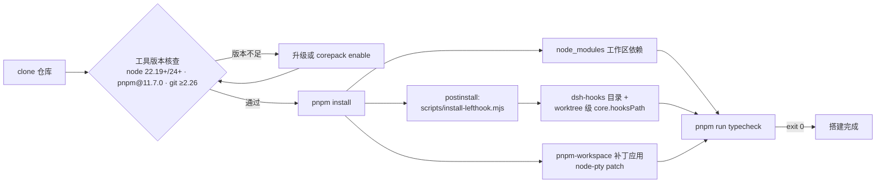
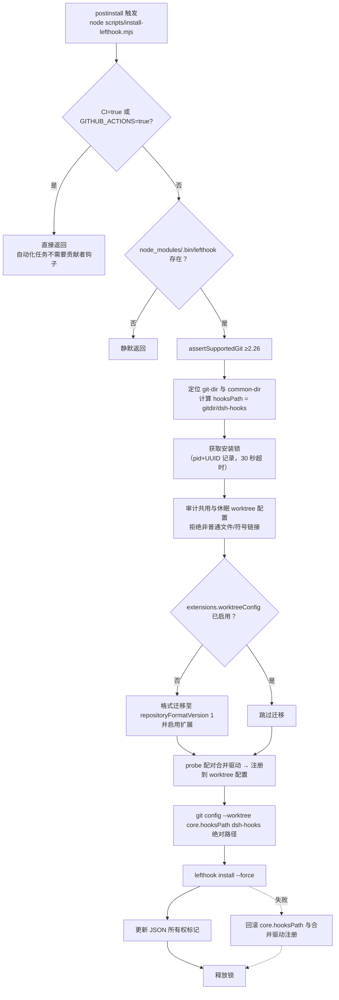
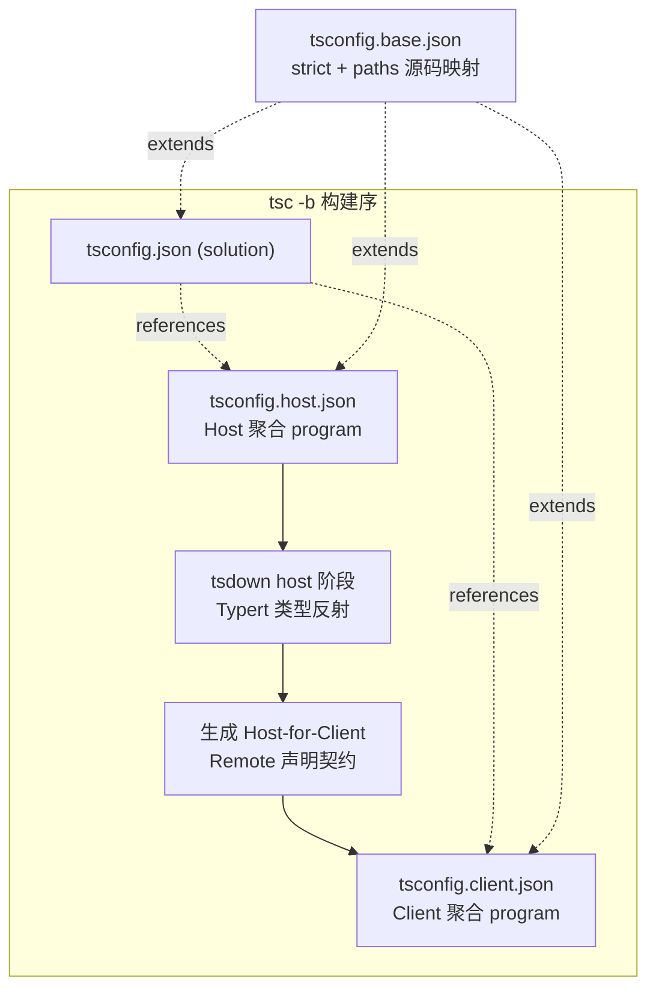

本页面向准备在 DeepSeek Harness 仓库内开发的中级贡献者，覆盖三件事：**工具链版本前置条件**（Node、pnpm、Git）、**首次 `pnpm install` 时自动执行的钩子安装机制**，以及作为"搭建完成"判据的**首次类型检查**。三者的共同特征是被仓库内的版本声明与脚本严格钉死——这不是随手写的约束，而是每一条都对应一个可追溯的设计决策。阅读本页前建议先完成基础启动（参见[快速开始：通过 npm 一行命令或源码编译运行 dsh](2-kuai-su-kai-shi-tong-guo-npm-xing-ming-ling-huo-yuan-ma-bian-yi-yun-xing-dsh)），本页聚焦源码贡献路径。

Sources: [development.md](docs/development.md#L1-L5)

## 环境搭建全景：从克隆到可验证检出

整个搭建流程是一条单向管线：工具齐备是前提，`pnpm install` 同时完成依赖落盘与 Git 集成装配，最后用一次全量类型检查验证结果。注意第二阶段有两个并行产出物——`node_modules`（工作区依赖）与 `dsh-hooks` 目录（worktree 本地 Git 钩子）——后者由根包的 `postinstall` 脚本触发。



`pnpm install` 之后、`pnpm run typecheck` 通过之前，检出处于"半可用"状态：依赖已就位但未验证。官方文档将 `pnpm run typecheck` 成功退出明确定义为搭建完成的唯一判据。

Sources: [development.md](docs/development.md#L16-L40)

## 前置条件：三个被版本钉死的工具

### Node.js：22.19 这个地板从哪里来

根 `package.json` 声明 `"engines": { "node": "^22.19.0 || >=24.0.0"`，同时 `"packageManager": "pnpm@11.7.0"` 精确钉住包管理器版本。这三个数字都不是随意选取的，逐个拆解能看清这个仓库"约束皆有出处"的风格。

`^22.19.0` 是一个典型的"双重下限取大"结果。源代码层面有两条硬需求：`packages/session/session-persistence-sqlite` 对 `node:sqlite` 做顶层导入，该模块去掉实验旗标是在 LTS 线 **22.13**；而构建模式冒烟测试依赖原生 TypeScript 类型剥离（type-stripping），默认开启于 LTS **22.18**。两条特性线都通过 22.18 即可满足——但安装的 Pi 适配器依赖 `@earendil-works/pi-ai` 在其自身 `engines.node` 中声明了 `>=22.19.0`，工作区引擎地板不能低于所装依赖的地板，最终 LTS 分支地板落在 22.19。这解释了为什么范围不是更直观的 `^22.18.0` 或开区间 `>=22.19`：后者会错误宣告支持 Node 23.0–23.5 这段既有特性缺失、又已停止维护的窗口期。

配套决策同样值得注意：`devDependencies` 中 `"typescript": "^6.0.3"`、`"@types/node": "^22.20.0"`。把 `@types/node` 钉在与 LTS 支持线一致的 22.x 上，意味着任何使用 Node 24+/25+ 专属 API 的代码会在每台机器和类型检查门禁中直接编译失败，而不是编译干净后仅在某个运行时角落爆炸——错误左移到了静态检查边界。

Sources: [package.json](package.json#L7-L10), [2026-07-06-node-engine-floor.md](.agents/notes/implemented/process/2026-07-06-node-engine-floor.md#L15-L22), [package.json](package.json#L158-L185)

### pnpm：Corepack 启动与精确钉版

前置条件列表明确要求"Corepack-enabled pnpm"，钉版值 11.7.0 就写在根 `package.json` 第 7 行。如果你的 shell 里 `pnpm --version` 未解析到 11.7.0，执行一次 `corepack enable` 让 Node 自带的包管理器代理接管即可。选择 pnpm 而非 yarn 或 npm 有独立的 Agent Note 记录其权衡，此处只需知道工作区解析行为依赖它：根配置启用了 `linkWorkspacePackages: true`，使本地构建可以通过真实包的 `exports` 相互解析；并通过 `overrides` 将 `@deepseek-ai/cosmokit` 与 `@deepseek-ai/schemastery` 强制链接到 `vendor/` 内的钉定源码副本。

前 10 行声明的成员清单也勾勒了整个 monorepo 的骨架：`vendor/*`（内嵌框架源码）、`packages/*/*`（约一百五十个能力子包）、`native/landlock-run` 及其子包、`apps/*`（`cli` 拥有 `dsh` 入口与 `web` 前端）、`website`，以及仅用于依赖解析而非构建目标的 `examples` 和单文件 exe 部署根 `python/sdk-runtime`。

Sources: [development.md](docs/development.md#L12), [package.json](package.json#L7), [pnpm-workspace.yaml](pnpm-workspace.yaml#L1-L33)

### Git：为什么至少要 2.26

第三条前置常被忽略但仍属硬性："Git 2.26 or newer"。原因精确定位在安装器的一个参数上：钩子安装器需要 `git config --show-scope` 来报告每个生效配置值来自哪个作用域（system/global/local/command/worktree），该选项正是 Git 2.26 引入的。没有它，安装器无法安全判断既有的 `core.hooksPath` 是否属于用户自有设置，也就无法实现后面将要看到的"拒绝覆盖非自有路径"策略。

Sources: [development.md](docs/development.md#L13), [install-lefthook.mjs](scripts/install-lefthook.mjs#L233-L244)

## 第一次安装：pnpm install 背后发生了什么

在仓库根目录执行：

```sh
pnpm install
```

除了常规的工作区依赖链接，这一步涉及三个对贡献者可见的机制。

其一，**安装脚本的审批清单**。pnpm 10+ 默认禁止任何依赖携带 install/build 生命周期脚本，除非在 `pnpm-workspace.yaml` 的 `allowBuilds` 中显式列出（未列出的脚本直接导致安装失败）。本仓库按"默认拒绝、逐项放行"维护这份名单：真正需要原生二进制的 `esbuild`（打包器）、`node-pty`（含 Windows ConPTY 的持久终端后端）、`koffi`（Windows 上 JSONL 持久化的直写发布调用）为 `true`；`lefthook` 为 `true` 因为它要在 git 钩子目录生成 shim；而 `@google/genai`、`protobufjs` 等虽带脚本但其内容是无操作（no-op），显式置为 `false` 以通过审查语义。若未来新增依赖携带脚本而被门禁拦下，正确动作是审查其脚本并在该清单登记，而不是全局关闭校验。

其二，**补丁注入**。`patchedDependencies` 将 `patches/node-pty@1.2.0-beta.15.patch` 应用于上游 node-pty 包，安装时自动落盘。

其三，也是本页主题之一——**postinstall 钩子安装器**。根 `scripts` 表中的最后一项 `"postinstall": "node scripts/install-lefthook.mjs"` 在每次安装结束时执行 Git 集成装配。

Sources: [pnpm-workspace.yaml](pnpm-workspace.yaml#L35-L55), [pnpm-workspace.yaml](pnpm-workspace.yaml#L71-L72), [package.json](package.json#L147)

## 安装钩子：worktree 本地化的 Lefthook 安装器

### 为什么不用共享 hooks 目录

标准做法是把 lefthook 生成的钩子写进所有 linked worktree 共享的 `$GIT_COMMON_DIR/hooks`。本仓库放弃了这条路，因为共享意味着串扰：任意一个 worktree 执行安装都会重写公共目录里的钩子文件；且 lefthook 生成的 shim 会优先固化"当时那个安装者 worktree"的二进制绝对路径，于是 A worktree 的提交可能一直跑着 B worktree 里那份已删除或已换版的 node 二进制，直到 B 消失才回退到当前路径。并发安装还会互相践踏同一批文件。设计结论是：**钩子安装按 worktree 隔离**，每个检出自持一份钩子与其绑定的二进制路径。

Sources: [2026-07-27-worktree-local-lefthook.md](.agents/notes/implemented/process/2026-07-27-worktree-local-lefthook.md#L7-L11)

### 安装器的执行序列

安装器是一个 846 行的安全工程范本，核心流程如下：



几个防御细节值得标注其匠心。**准入守卫**先行：入口处在 CI 环境变量命中时于任何 Git 探测之前返回；要求当前确实位于 Git 仓库中；并且只在 `node_modules/.bin/lefthook`（Windows 上是 `lefthook.cmd`）存在时继续——这意味着手动清理依赖后的冷检出即使重新运行也不会误报。

**互斥与幂等**靠一把文件锁保证：锁文件以独占创建写入 `${pid} ${uuid}` 记录，竞争者轮询等待最长 30 秒，通过 `process.kill(owner, 0)` 探测锁主进程是否存活来区分"正在安装"与"陈旧死锁"——前者等待，后者报错指示手工移除。

**所有权标记**让状态可回收：`dsh-hooks/.dsh-lefthook-owned` 写入一份含 `hooksPath` 绝对路径的 JSON。checkout 移动位置后，旧的绝对路径失效，此时标记允许精确替换那个"确定曾由自己发布的"陈旧值，而不触碰任何其他内容。反过来，如果发现 `core.hooksPath` 指向一个**没有标记的**第三方目录，安装器一律抛错拒改——绝不覆盖用户的自定义钩子（这条防线可用环境变量 `DSH_LEFTHOOK_ALLOW_HOOKS_PATH_OVERRIDE=1` 显式越权绕过，供高级用户继承父级钩子路径）。

**失败回滚**成对出现：合并驱动注册与 `core.hooksPath` 修改各自记录"改动前值"，任一环节失败即恢复原状；连回滚本身失败都会以 `AggregateError` 把两层故障一并上报。

顺带地，同一个安装器还注册了 `merge.dsh-translation-pairing` 自定义合并驱动——它是双语文档配对门禁在冲突合并时的自动求解器，这也是双语文档体系对开发环境的隐含要求之一。

Sources: [install-lefthook.mjs](scripts/install-lefthook.mjs#L691-L708), [install-lefthook.mjs](scripts/install-lefthook.mjs#L779-L794), [install-lefthook.mjs](scripts/install-lefthook.mjs#L381-L457), [install-lefthook.mjs](scripts/install-lefthook.mjs#L459-L533), [install-lefthook.mjs](scripts/install-lefthook.mjs#L30-L42), [2026-07-27-worktree-local-lefthook.md](.agents/notes/implemented/process/2026-07-27-worktree-local-lefthook.md#L13-L22)

### 安装后的钩子触点

lefthook 的任务是"快速本地检查点"，完整门禁矩阵归 CI 所有。配置 `lefthook.yml` 定义三类触发时机。`pre-commit` 针对**暂存区**做五件事：配对记录核验（只查 `*.i18n.yaml`）、暂存文件的 lint 并自动修复、当暂存内容触及生成输入时再生成 `THIRD_PARTY_NOTICES.md`、空白字符检查、vendor 清单守卫。`pre-merge-commit` 在自动合并提交前重复索引级配对检查。**最重要的**：`pre-push` 运行的正是 `pnpm run typecheck`——也就是说，首次类型检查命令在你第一次推送时会被钩子再次强制执行。刻意排除在钩子之外的则是测试、快照、构建等高延迟动作。

| 钩子 | 触发时机 | 执行内容 |
|---|---|---|
| translation pairing | pre-commit / pre-merge-commit | 校验暂存的 `.i18n.yaml` 双语配对记录一致性 |
| archived agent notes | pre-commit / pre-merge-commit | 归档目录内 Agent Note 格式核验 |
| lint (staged) | pre-commit | 以 `.oxlintrc.staged.json` 配置 lint 暂存 TS 文件并修复 |
| third-party notices | pre-commit | 输入变更时重新生成第三方声明并加入暂存 |
| whitespace | pre-commit | `git diff --cached --check` 空白检查 |
| vendor manifest guard | pre-commit | 确保 `vendor/*/src` 变更伴随 `vendor/README.md` 清单更新 |
| typecheck | pre-push | 运行完整的 `pnpm run typecheck` |

若因缓存还原或跳过 postinstall 导致集成缺失，可手动补救：

```sh
node scripts/install-lefthook.mjs
```

报错时请依据诊断信息与上述 Agent Note 处理，不要凭直觉修改 worktree 元数据；移动过检出位置后，重跑安装器即可再生所有权路径。

Sources: [lefthook.yml](lefthook.yml#L1-L56), [development.md](docs/development.md#L109-L119), [development.md](docs/development.md#L26-L32)

## 首次类型检查：双聚合解决方案

```sh
pnpm run typecheck
```

这是新 clone 后的第一个正式动作，其成功退出即为搭建完成的信号。但要理解它为何可能慢、为何结构如此，需要先看仓库的 TypeScript 编排。

### 为什么拆成 Host/Client 两个聚合

根 `tsconfig.json` 是一个 solution 文件：`files: []` 保证它自身不构成任何程序（program），仅通过 `references` 引向两个真实聚合——Host 侧 `tsconfig.host.json`（Node 平台代码、脚本、测试、站点）与 Client 侧 `tsconfig.client.json`（浏览器端 `packages/client/*` 与 `apps/web`）。注释里写明了铁律：**永远不要往根 solution 加 include/files，也永远不要把两个聚合摊平成一个程序**。原因是架构性的——两侧都在同一组键上对 cordis 的 `Context` 接口做接口合并，只是注册的服务不同；一旦单个 `ts.Program` 同时看见两份合并，就会报告碰撞。这种碰撞只存在于单程序内部，模块解析永远不会触发它，所以物理隔离_program_就消解了问题。

| 文件 | 角色 | 是否构成 program |
|---|---|---|
| `tsconfig.json` | Solution 根：无 files，引用两个聚合；tsserver 发现入口，tsx 运行 examples/scripts 的解析 facade | 否 |
| `tsconfig.host.json` | Host 聚合：Host 包、examples、tests、scripts、website、api/remotes 的 Host 面 | 是 |
| `tsconfig.client.json` | Client 聚合：`packages/client/*` 及其测试、`apps/web`、api/remotes 的 Client 面 | 是 |
| `tsconfig.base.json` | 共享 compilerOptions 与源码级 `paths` 映射；vite-tsconfig-paths 的匹配所有导入者的 facade | 否 |
| `tsconfig.base.client.json` | 浏览器设置（jsx、DOM libs、`types: []`），由 Client 聚合及全部 client 包扩展 | 否 |

因此新增包必须注册在且仅在一个聚合里。"既是 Node 入口又是浏览器入口"也不构成拆包理由——普通的 Client 插件会在 Client 构建阶段同时产出两种产物。

Sources: [tsconfig.json](tsconfig.json#L1-L16), [tsconfig.host.json](tsconfig.host.json#L1-L9), [development.md](docs/development.md#L44-L62)

### typecheck 的执行链路

查看根脚本可以看到这条链并不是单纯的两次 `tsc -b`：

```
typecheck = build:lib:host && typecheck:contracts-ready
build:lib:host = tsc -b tsconfig.host.json && tsdown --env.DSH_BUILD_FACE host
typecheck:contracts-ready = tsc -b tsconfig.client.json
```

顺序不可交换的原因在于 **Typert 类型反射系统**只在 Host tsdown 阶段运行：它分析 Host 类型并生成 Host 反射产物与"Host-for-Client Remote 投影"；Client 的 `tsc -b` 要检查的部分 Remote 声明依赖这些先生成的产物。所以 typecheck 必须先完整跑完 Host lib 阶段，才开始 Client TypeScript 检查。

compiler 层面，`tsconfig.base.json` 开启了严苛组合拳：`strict`、`noUncheckedIndexedAccess`、`exactOptionalPropertyTypes`、`noImplicitOverride`、`noUnusedLocals`/`noUnusedParameters` 等，配合庞大的源码级 `paths` 映射把每个 `@deepseek-ai/dsh-*` 导入直接解析到 `src` 源码树（项目引用负责跨包边界，paths 只管模块解析）。这意味着首次 typecheck 实际上是以最严格的诊断级别编译约三百个项目引用图——耗时正常，务必给它留出时间。



此外，静态分析与测试都通过 base `paths` 解析到源码，因此在干净树上就能通过；只有消费 `lib/` 产物的门禁（如 publint、NodeNext 声明消费检查）才需要先执行一次完整的 `pnpm run build`——这类门禁均会显式声明其对构建产物的依赖。

Sources: [package.json](package.json#L23-L29), [development.md](docs/development.md#L64-L90), [tsconfig.base.json](tsconfig.base.json#L1-L31)

## 可选环境变量

搭建过程中唯一可选的额外配置是 DeepSeek API 凭据，Web/headless/ACP 演示与真机 e2e 测试从环境或仓库根的 gitignore `.env` 读取：

```sh
DEEPSEEK_API_KEY=sk-...
DEEPSEEK_BASE_URL=https://... # 可选，缺省为公网 API
```

切勿提交真实凭据；未设置 `DEEPSEEK_API_KEY` 时真机 e2e 套件会自行跳过，不影响其余门禁。

Sources: [development.md](docs/development.md#L92-L101)

## 故障排查速查

搭建期的常见异常集中于两处：pnpm 的脚本审批门禁与安装器的保守防护。原则都是**读懂报错再做最小干预**，尤其不要手工编辑 worktree 元数据。

| 症状 | 根因 | 处置 |
|---|---|---|
| install 报某依赖"ships a lifecycle script not listed in allowBuilds" | pnpm 10+ 默认拒绝未审批构建脚本 | 审查该脚本用途后在 `pnpm-workspace.yaml` 的 `allowBuilds` 登记 |
| `Node.js version X is not supported` / engines 冲突 | Node 版本低于 22.19 或处于 23.x 窗口 | 切换至 22.19+ 或 24+；核对 `@earendil-works/pi-ai` 类依赖自身地板 |
| `pnpm --version` 不是 11.7.0 | pnpm 未走 Corepack | `corepack enable` 后重试 |
| 提交时钩子未触发 | 依赖来自缓存还原，postinstall 被跳过 | 手动执行 `node scripts/install-lefthook.mjs` |
| 安装器报 "stale/invalid ... installer lock" | 陈旧锁或记录损坏 | 确认无安装器进程运行后，按提示移除 `dsh-lefthook-install.lock` 重试 |
| 安装器报 "refusing ... dormant worktree config contains user-owned settings" | 启用 worktree 扩展会激活现存休眠配置 | 迁移或清理那些配置后重试，勿绕过 |
| 移动检出目录后钩子失效 | 所有权标记中的绝对 hooksPath 过期 | 在新位置重跑安装器，标记允许精确替换自有旧值 |
| push 卡在全量 typecheck | 这是预期行为：pre-push 门禁 = typecheck | 保持本地先跑一次 typecheck 的习惯，避免推送期等待 |

Sources: [pnpm-workspace.yaml](pnpm-workspace.yaml#L35-L55), [install-lefthook.mjs](scripts/install-lefthook.mjs#L348-L357), [install-lefthook.mjs](scripts/install-lefthook.mjs#L209-L231), [lefthook.yml](lefthook.yml#L52-L56)

## 下一步阅读

至此你的检出应当满足：`pnpm install` 成功、`node_modules/.bin/lefthook` 存在、git 目录下出现自有的 `dsh-hooks/`、且 `pnpm run typecheck` 干净退出。推荐的前进路线：

1. [CLI 入门：dsh 命令入口、web/headless Profile 与补丁覆盖](4-cli-ru-men-dsh-ming-ling-ru-kou-web-headless-profile-yu-bu-ding-fu-gai) —— 用刚搭好的环境实际驱动 `dsh`；
2. [架构总览：一切皆插件的插件树世界](8-jia-gou-zong-lan-qie-jie-cha-jian-de-cha-jian-shu-shi-jie) —— 建立"一切皆插件"的心智模型，理解你即将修改的东西是什么；
3. [构建与发布工程：Host/Client 双聚合、Typert 类型反射与各阶段产物](29-gou-jian-yu-fa-bu-gong-cheng-host-client-shuang-ju-he-typert-lei-xing-fan-she-yu-ge-jie-duan-chan-wu) —— 深挖本页点到为止的双聚合构建与 Typert 序；
4. [测试体系：testkit、LLM 回放/模拟、快照与端到端覆盖门禁](28-ce-shi-ti-xi-testkit-llm-hui-fang-mo-ni-kuai-zhao-yu-duan-dao-duan-fu-gai-men-jin) —— 在提交第一个 PR 前，了解钩子刻意留给你的完整检查矩阵在哪里。

若只想要一条核心 takeaway：这个仓库的开发环境是一个**自我说明的系统**——每一个版本号、每一道安装防线、每一次检查的先后次序，都能沿着 `package.json` → `pnpm-workspace.yaml` → `scripts/install-lefthook.mjs` → Agent Note 的证据链追到一句明确的"为什么"。