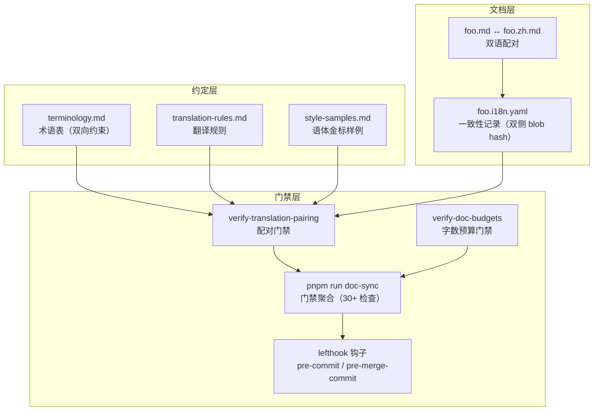
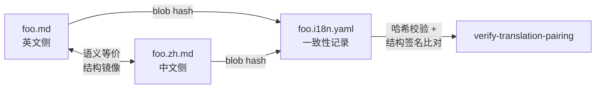
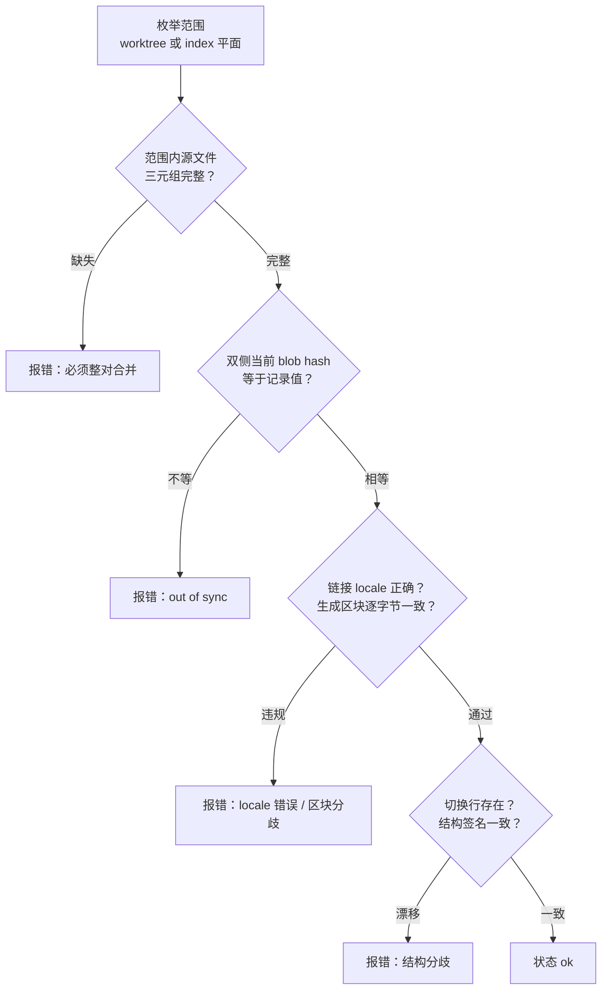
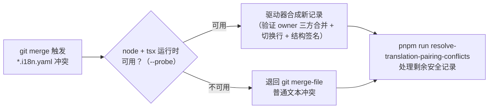
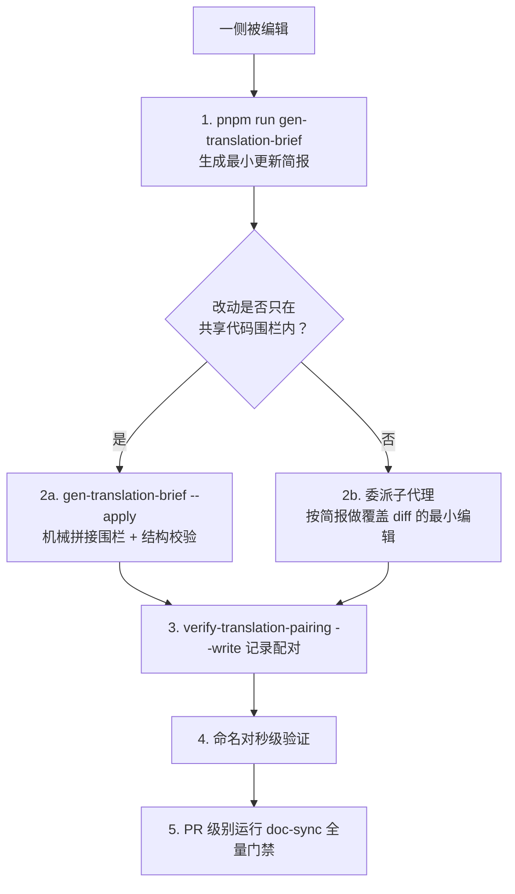
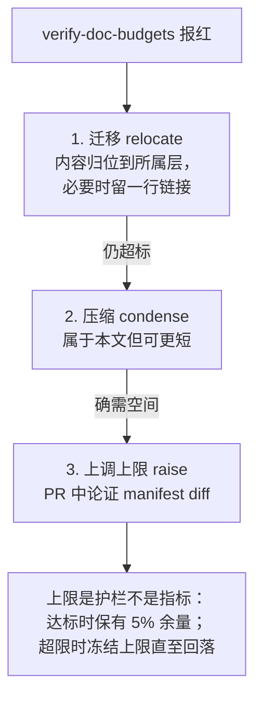

DeepSeek Harness 的文档被公司内外的人类与 agent 共同阅读，因此仓库采用一条非常规但纪律严明的路线：**每个受控文档都以英文与简体中文双语言同等权威地维护，并由机械门禁保证配对不漂移**。本页覆盖三块相互咬合的机制——双语文件配对契约（`.md` / `.zh.md` / `.i18n.yaml` 三元组）、翻译配对工作流（日常一次性更新、briefing 驱动的扩展技能与自动流水线），以及文档预算门禁（`verify-doc-budgets` 的字数上限与迁转优先政策）。整体机制布局如下：

Sources: [README.md](docs/i18n/README.md#L1-L5), [package.json](package.json#L132)

## 双语配对契约：一个文档 = 三个同目录兄弟文件

配对契约的第一条原则是**双语言同等权威**：文档可以先以任何一种语言写作并评审——中文先行的 Agent Note 与英文先行的完全同等合法，对侧从该侧翻译而来。两个文件互不隶属，约束它们的是"必须说同一件事"。第二条原则是**整对合并**：英文 `foo.md`、中文 `foo.zh.md` 与一致性记录 `foo.i18n.yaml` 三个文件同目录共存，不存在 locale 目录、独立翻译仓库或双语交错文件；PR 永远不会只落一个语言而不落另一个。

**一致性记录**保存两侧在上次"确认一致"时刻的完整 git blob hash。选用 blob hash 而非 commit hash 有两个工程理由：同一 PR 内编辑的文件可以直接用 `git hash-object foo.md` 计算出哈希（无需先提交），且一致性判断是纯内容比较。执行 `--write` 时，脚本还会把双侧内容快照存入本地 Git 对象数据库——即使内容尚未提交也能被记录，这个快照随后成为 briefing 生成器的恢复指针。**语言切换行**是配对的可视锚点：中文文件在 H1 之后必须紧跟 `[English](foo.md) | 中文`，手写英文文件 reciprocate 为 `English | [中文](foo.zh.md)`；由生成器拥有的英文源则省略该行，以保持与生成器输出逐字节一致。

Sources: [README.md](docs/i18n/README.md#L7-L22), [README.i18n.yaml](README.i18n.yaml#L1-L7), [verify-translation-pairing.ts](scripts/verify-translation-pairing.ts#L166-L172)

结构镜像约束比"看起来相似"严格得多：标题深度与顺序、列表种类、有序列表起始号、列表项数、表格行列数、带精确 query/fragment 后缀的语义链接目标、以及逐字节一致的代码围栏，全部必须一一对应。当相对链接目标属于活跃双语语料时，英文侧用 `.md` 路径而中文侧用 `.zh.md` 路径——这是两侧仅有的**允许**系统性差异。值得注意的是段落边界不在结构签名之内：翻译可以按目标语法的语义单元拆分段落，而不会触发门禁。

Sources: [README.md](docs/i18n/README.md#L22), [translation-rules.md](docs/i18n/translation-rules.md#L22-L34)

## 范围判定：没有白名单，只有排除清单

范围判定的实现是纯谓词函数而非配置清单：文件属于双语语料，当且仅当它匹配 `readme.md`（大小写不敏感，覆盖现在与未来所有目录）、根级 `CONTRIBUTING`/`BRAND_GUIDELINES`，或位于 `.agents/notes/`、`docs/`、`python/` 前缀之下，且不在依赖或生成目录内。**manifest 只允许一个 `excluded` 字段**——不存在按文件排期推广的 rollout 列表或日期截断，任何范围内文档（无论现有还是未来）都必须以完整双语对合并，这是一个普遍要求而非渐进目标。

Sources: [translation-pairing.ts](scripts/translation-pairing.ts#L126-L186), [README.md](docs/i18n/README.md#L42-L56)

排除清单本身就是一个微型的政策文档，每一项都对应一类"为什么不该翻译"的结构性理由：

| 排除项 | 理由 |
|---|---|
| `docs/cordis-api/inherited.md` | 生成文件且无已评审中文对侧，网站双 locale 都投影英文源 |
| `docs/AGENTS.md`、各级 `AGENTS.md`/`CLAUDE.md` | agent 指令文件，仅维护英文 |
| `docs/i18n/terminology.md`、`style-samples.md` | 本身就是双语对照结构 |
| `docs/i18n/translation-prompt.md` | 流水线逐字机读的 prompt 模板，配对译文会改变流水线行为 |
| `.agents/notes/archived/**` | 冻结的历史三元组，由专门的归档校验器封存，翻译维护永不重写 |

门禁对排除项是**双向拒绝**的：被排除的源文件若出现 `.zh.md` 或 `.i18n.yaml` 会直接报错，防止有人"好心"补翻改变流水线或封存语义。

Sources: [translation-pairing.manifest.json](scripts/translation-pairing.manifest.json#L1-L13), [README.md](docs/i18n/README.md#L48-L54), [verify-translation-pairing.ts](scripts/verify-translation-pairing.ts#L211-L215)

## 翻译规则：忠实性、语体与结构保持

`translation-rules.md` 用 RFC 2119 强度词组织翻译纪律。**忠实性**规定对侧必须说出撰写侧所说的一切——不增加行为、前置条件、警告、版本声明或示例，也不丢失任何一项；若两侧在实质内容上分歧，不默认任何语言获胜，而是修正错误的一侧并在同一次变更中带上对侧。**语体**不靠文字描述校准，而靠 `style-samples.md` 中的人工评审金标段落：译文必须匹配最近的同类文体样例的目标语言侧，样例与散文规则的效力冲突时样例获胜。中文目标使用机构 ton（"我们"式正式技术文体），称谓用"你"而非"您"，与 Vue 和 Kubernetes 中文社区惯例一致。

Sources: [translation-rules.md](docs/i18n/translation-rules.md#L7-L20), [style-samples.md](docs/i18n/style-samples.md#L1-L5)

**结构保持**与门禁的机械检查一一对应：标题层级同序（标题**文本**翻译）、列表形状与编号一致、表格同列同行序、围栏代码块**逐字节一致包括注释**、行内代码 span（命令、flag、路径、事件名、版本号）原样保留、每个相对文档链接保持语义目标与精确 query/fragment 后缀。**排版**规则管辖中文侧的中英混排：中文与拉丁词、数字之间放一个半角空格；中文行文使用全角标点；并列项用顿号（、）；禁止全角数字与全角拉丁字母（`１２３` 绝不允许）；破折号让位于冒号、句号、逗号或括号。

Sources: [translation-rules.md](docs/i18n/translation-rules.md#L24-L56)

**术语纪律**由 `terminology.md` 双向约束，分三类组织：

| 类别 | 约定 | 示例 |
|---|---|---|
| 缩写类 | 中英文文本均用缩写 | `LLM`，首次出现写 `LLM（大语言模型）` |
| 英文类 | 中英文文本均保留英文 | `agent`、`waterfall`、`spill`、`Typert` |
| 双语类 | 各自使用中英文 | `capability → 能力`、`snapshot → 快照` |

表中每行可有"首次出现"列（首次正文出现时带括号注释，后续只写括号前部分）与"不要译作"列（严格禁止的译法，如 `counterpart` 不得译作"对应物/配对物"、`orphan` 在文档语境译"遗留"而非"孤儿"）。中文目标遇到表外术语，必须引用主流中文 OSS 或厂商来源的既定译法并在 PR 中引用，否则保留英文并登记到「待定术语」——**任何方向都不得行内生造译名**，既定译名只能通过修改术语表进入契约。

Sources: [terminology.md](docs/i18n/terminology.md#L1-L9), [translation-rules.md](docs/i18n/translation-rules.md#L36-L42)

## 配对门禁：verify-translation-pairing 的工作机制

契约的机械执行者是 `pnpm run verify-translation-pairing`（`doc-sync` 聚合的成员，贡献者在文档变更时本地运行，CI 全量运行）。它是一个多模式 CLI：

| 模式 | 调用形式 | 行为 |
|---|---|---|
| 语料检查 | `verify-translation-pairing` | 全语料扫描，`doc-sync` 与 CI 使用 |
| 状态报告 | `--list` | 打印每个文档的 missing / out-of-sync / ok，永不失败 |
| 命名对检查 | `<pair...>` | 只检查指定对（三个文件或裸 stem 均可命名），秒级反馈 |
| 记录 | `--write <pair...>` | 重算并写入双侧 blob hash；拒绝裸跑，批量必须显式 `--all` |
| 暂存区检查 | `--cached <pair...>` | 检查 git index 中的精确字节，供钩子使用 |

`--write` 拒绝裸跑是刻意的安全设计：不带参数的批量重录会静默"祝福"树上每一对漂移的文档，包括调用者从未确认过的内容。CLI 解析层强制了这些互斥规则（`--list` 不能与其他 flag 组合、`--cached` 与 `--write` 互斥、`--all` 只随 `--write` 出现），非法组合以退出码 2 失败。

Sources: [README.md](docs/i18n/README.md#L24-L40), [translation-pairing.ts](scripts/translation-pairing.ts#L239-L307), [verify-translation-pairing.ts](scripts/verify-translation-pairing.ts#L147-L180)

检查流水线对每个完整配对依次执行五层验证：

第一层是**完整性**：检查以 `.zh.md` 与 `.i18n.yaml` 残余文件的并集为锚点，因此半删除的配对无论从哪个残迹出发都会被捕获。第二层是**哈希一致性**：任一侧当前 blob hash 不等于记录值即报 `out of sync`——"编辑任一侧而不重新确认配对就会变红"正是工作流的核心闭环。第三层是**链接 locale**：对两侧全文分别做 locale 违规扫描，双语语料内的链接必须指向正确的 locale 路径。第四层是**生成区块**：`<!-- BEGIN GENERATED <slug> -->` 标记的区域在链接归一化后必须逐字节一致，任何正文、顺序、代码或非 locale URL 的漂移都会要求两侧重新生成。第五层是**结构签名**比对。

Sources: [verify-translation-pairing.ts](scripts/verify-translation-pairing.ts#L185-L246), [verify-translation-pairing.ts](scripts/verify-translation-pairing.ts#L248-L319), [translation-pairing.ts](scripts/translation-pairing.ts#L28-L68)

**结构签名**是配对门禁的核心数据结构，用 mdast（GFM 扩展）解析后提取五个有序维度：

| 维度 | 捕获内容 | 允许的跨语言差异 |
|---|---|---|
| `headings` | 标题深度序列 | 标题文本自由翻译 |
| `code` | 每个围栏的信息串 + 内容原文 | 无（逐字节一致） |
| `tables` | 每个表的 `行x列` 计数 | 表头与单元格文本翻译 |
| `lists` | 每个列表的种类、有序起始号、直接项数 | 项内文本翻译 |
| `links` | 除切换行外的全部链接语义目标（含定义式引用） | 语料内目标切换 `.md`/`.zh.md` locale |

语言切换行通过位置偏移从 `links` 中排除——它的存在单独检查，且生成器拥有的英文源有显式豁免清单（`requiresSourceLanguageSwitcher`），否则切换行会使生成器输出失鲜。

Sources: [translation-pairing.ts](scripts/translation-pairing.ts#L309-L321), [translation-pairing.ts](scripts/translation-pairing.ts#L357-L399), [translation-pairing.ts](scripts/translation-pairing.ts#L335-L355)

## 一致性记录的 Git 合并驱动器

配对记录在分支合并时会遇到三方冲突：两个分支都可能包含同一配对的有效确认。仓库通过 `.gitattributes` 为 `*.i18n.yaml` 注册自定义合并驱动器 `dsh-translation-pairing`（worktree 本地安装器注册 fail-closed 驱动命令）。驱动器只在严格条件下合成新记录：Git 默认文本合并对**两个记录的 owner-blob 三元组**都成功，且合并后的配对仍保有必需的切换行与结构签名——合成前会验证合并出的 owner 内容本身通过完整配对检查。

失败关闭（fail-closed）体现在两层：shell 包装脚本在 Node 运行时不可用时不静默通过，而是退回 `git merge-file` 留下普通文本冲突，并保持 index 阶段未解决直到仓库感知的解析器运行；驱动器还会用 `git check-attr` 断言 owner 文件没有继承非默认的 merge 策略——配对驱动器只合成 Git 默认文本合并的结果，任何其他策略都会直接抛错。

Sources: [.gitattributes](.gitattributes#L1-L14), [README.md](docs/i18n/README.md#L20), [merge-translation-pairing.ts](scripts/merge-translation-pairing.ts#L1-L54), [merge-translation-pairing-driver.sh](scripts/merge-translation-pairing-driver.sh#L17-L36), [translation-pairing-merge.ts](scripts/translation-pairing-merge.ts#L67-L94)

## 翻译配对工作流：分工与三条路径

仓库在 `docs/i18n/README.md` 中明确了**分工边界**：日常对侧更新由工作中的 agent 在加载术语表后一次性、单遍直接完成——不调用翻译技能、不生成 briefing、不跑独立的翻译评审、不委派子代理。扩展的 `dsh-translate-docs` 技能保持**用户显式调用**（frontmatter 中 `disable-model-invocation: true`）：只有用户按名调用时才运行，普通文档工作、其他技能的内部调用或推断出的翻译需求都不得触发它。`docs/AGENTS.md` 的写作规则把这一纪律固化为"配对同 PR 一起更新"：术语引导的单遍 active-agent 工作重排首次出现注释、保留未触及的散文、然后重记录。

Sources: [README.md](docs/i18n/README.md#L58-L60), [SKILL.md](.agents/skills/dsh-translate-docs/SKILL.md#L1-L12), [AGENTS.md](docs/AGENTS.md#L36-L45)

`dsh-translate-docs` 技能按变更类型三分：**更新**（配对已存在、一侧被编辑）走 briefing 驱动路径；**新配对**走整篇文档路径；**删除或重命名**则必须连同对侧与 `.i18n.yaml` 一起处理，否则门禁报不完整配对。归档 Agent Notes 永远不是翻译工作。

Sources: [SKILL.md](.agents/skills/dsh-translate-docs/SKILL.md#L18-L34)

**Briefing 驱动路径**的关键资产是 `gen-translation-brief` 生成的简报：它把源侧自上次确认状态以来的变化映射到最窄的安全对齐粒度——优先代码围栏（可机械拼接）、其次是变更的 Markdown 单元（段落、表格行、列表项、标题）、再次是标题分节、最后退化为整篇文档——并内联受影响变更触及的术语行与规则摘要。单元对齐算法用语言中性的 `kind` 序列（容器路径 + 节点类型，如 `root.3:tableRow`；分节只比深度，因为标题文本参与翻译）判断逐位映射是否成立，只有对齐成立时变更索引才可信。**机械拼接**（`--apply`）适用于纯代码围栏变更：围栏跨配对逐字节一致，把源侧编辑后的围栏拼接进对侧就是完整更新，完全不涉及翻译判断。委派翻译的子代理不重读指导语料——简报就是译者的全部工作集。

Sources: [translation-brief.ts](scripts/translation-brief.ts#L1-L10), [SKILL.md](.agents/skills/dsh-translate-docs/SKILL.md#L26-L34)

**整篇文档路径**（新配对）遵循两遍法：第一遍"写作而非移植"——读语义单元，以最近语体样例的语域重新表述为目标语言的本族技术作者；第二遍逐子句对源验证忠实性。之后**脱离源单独读成品**，改写在隔离阅读时才显形的别扭措辞。收尾五步：补切换行、`--write` 记录（PR 中的 yaml diff 就是"我确认这两侧说同一件事"的可评审声明）、普通文档无需改 manifest、PR 级别跑一次 `doc-sync`（含语料级配对检查与 `verify-md-wrap`/`verify-md-links`）、在 PR 描述中区分新建对与最小更新并列出「待定术语」。

Sources: [SKILL.md](.agents/skills/dsh-translate-docs/SKILL.md#L36-L57), [SKILL.md](.agents/skills/dsh-translate-docs/SKILL.md#L65-L75)

仓库还内置一条**自动翻译流水线**：`docs/i18n/translation-prompt.md` 是流水线机读的 prompt 模板（因此被排除出配对）。模板使用三个占位符——`{{source_lang}}`/`{{target_lang}}` 由被改侧文件推断，`{{terminology}}` 在渲染时读取术语表当前版本（不缓存）。Few-shot 不是模板内嵌的句子级正误例，而是**五组整篇文档级金标对**（根 README、development、i18n README、translation-rules 与双语配对门禁的 Agent Note），每组作为一轮完整示例对话注入。模板正文规定了三段 XML 输出（`<translation>` 初译、`<review>` 实际修正、`<final>` 定稿）与双向自审指令；语言切换行在源文件没有时由流水线在解析 `<final>` 后按目标文件名机械插入，配对门禁兜底校验。

Sources: [translation-prompt.md](docs/i18n/translation-prompt.md#L1-L29), [README.md](docs/i18n/README.md#L53)

## 文档预算门禁：verify-doc-budgets

双语门禁管"两侧是否一致"，预算门禁管"单侧是否膨胀"。`pnpm run verify-doc-budgets` 从 `scripts/doc-budgets.manifest.json` 读取 `wc -w` 风格的字数上限（空白分隔 token 计数），对**仅限被列入的常设文档**强制执行：文件缺失或上限非法即失败，`--list` 报告当前用量。上限的政策是**棘轮式**：下调时至少保留 5% 余量，上调必须满足 `docs/AGENTS.md` 定义的 PR 论证要求。

当前预算清单本身就是仓库文档体量的概览：

| 文档 | 字数上限 |
|---|---|
| `AGENTS.md`（根） | 1950 |
| `docs/architecture.md` | 2400 |
| `docs/AGENTS.md` | 1320 |
| `packages/README.md` | 994 |
| `packages/AGENTS.md` | 675 |
| `docs/testing.md` | 1150 |
| `docs/cordis-primer.md` | 600 |
| `docs/defensive-patterns.md` | 550 |
| `examples/AGENTS.md` | 310 |

Sources: [verify-doc-budgets.ts](scripts/verify-doc-budgets.ts#L1-L9), [doc-budgets.manifest.json](scripts/doc-budgets.manifest.json#L1-L12)

门禁变红时的处置顺序是**迁转优先**的三级 escalation：

这套政策与文档分层分类学（每个事实只有一个家：类型定义归 subsystems、决策理据归 Agent Notes、操作程序归 cookbook）形成闭环——预算压力成为把细节推回其所属层的结构性力量，而不是单纯的删减指标。

Sources: [AGENTS.md](docs/AGENTS.md#L47-L57), [AGENTS.md](docs/AGENTS.md#L15-L34)

## 门禁触发时机：钩子、doc-sync 与 CI

配对门禁在三个时机介入，粒度递增：**pre-commit 与 pre-merge-commit 钩子**只对暂存的 `*.i18n.yaml` 文件运行 `--cached` 模式（检查 git index 中的精确字节），因此本地迭代零等待；**pre-push** 运行完整 typecheck；**CI 与 doc-sync** 运行语料级全量检查。`pnpm run doc-sync` 展开为 `run-gates` 的 `docSyncLeafGates`——三十余个文档相关叶检查的有界并发调度（本地模式限 4 并发，因为多个文档门禁各自构建完整 `ts.Program`，不设上限会拿墙钟换内存爆炸）。

| doc-sync 成员门禁 | 职责 |
|---|---|
| `translation-pairing` | 双语配对契约（本页主体） |
| `translation-prompt` | 校验流水线模板与快照的一致性 |
| `doc-budgets` | 常设文档字数上限 |
| `markdown-links` / `markdown-wrap` | 相对链接可解析 / 每段一行 |
| `doc-typecheck` / `type-equivalence` | 围栏 `ts` 块可编译 / 类型粘贴不漂移 |
| `mermaid` / `doc-graphs` | 图表语法与文档图形 |
| `docs-site-build` | 文档站点可构建（VitePress） |

面向源的代码门禁还有一个精妙的配合约束：它们可以把某个 `.zh.md` 的围栏序列当作其未加后缀兄弟的**派生物**来消费（长度、顺序、围栏种类、逐字节内容全部匹配），从而避免同一段代码被编译或清单化两次；一旦派生关系不成立，两侧就退回独立检查。

Sources: [lefthook.yml](lefthook.yml#L5-L11), [lefthook.yml](lefthook.yml#L33-L48), [run-gates.ts](scripts/run-gates.ts#L641-L686), [run-gates.ts](scripts/run-gates.ts#L261-L262), [README.md](docs/i18n/README.md#L32)

## 门禁的能力边界：绿灯意味着什么

这套机制有一句被明文写下的边界声明：**绿灯表示配对在这些精确内容上被确认过一致，而不表示确认本身是可靠的**。门禁检查哈希与 Markdown 结构；它无法判断两侧是否真的说了同一件事，也无法判断措辞是否准确、地道或优雅。这正是"质量线"条款存在的理由——配对完成的判定标准是双语工程师单独阅读任一文件能获得另一文件读者获得的全部信息（同样的事实、同样的注意事项、同样的语气），而人类评审拥有机器不可检查部分的最终裁量权：列表与表格顺序、非规范列表编号、行内代码、强调、意义与术语之外的判断。

Sources: [README.md](docs/i18n/README.md#L40), [translation-rules.md](docs/i18n/translation-rules.md#L58-L61)

从架构视角复盘，这套设计的可迁移经验有三条。其一，**哈希 + 结构签名**把"翻译是否同步"从评审议题降维成机械检查，评审注意力得以集中到机器不可判定的语义层；其二，**整对合并 + 排除清单式 manifest**消除了"哪份文档该翻译"的协商成本——普遍要求加上结构性豁免，规则自身保持零维护；其三，**预算门禁与文档分层分类学联动**，把字数压力转化为信息归位的结构力量。三者共同支撑了仓库"文档同时喂人和喂 agent"的核心场景，也与 [测试体系：testkit、LLM 回放/模拟、快照与端到端覆盖门禁](28-ce-shi-ti-xi-testkit-llm-hui-fang-mo-ni-kuai-zhao-yu-duan-dao-duan-fu-gai-men-jin)中"不变量进 CI"的工程哲学一脉相承——若要继续了解门禁如何与构建产物衔接，推荐阅读 [构建与发布工程：Host/Client 双聚合、Typert 类型反射与各阶段产物](29-gou-jian-yu-fa-bu-gong-cheng-host-client-shuang-ju-he-typert-lei-xing-fan-she-yu-ge-jie-duan-chan-wu)。